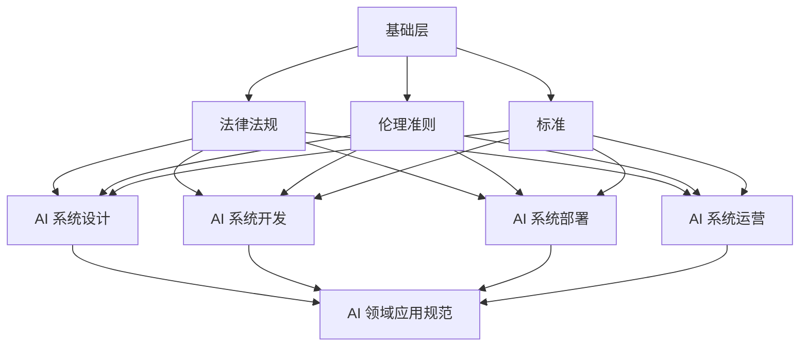

                 

关键词：人工智能伦理，AI 2.0，技术发展，道德准则，治理框架

> 摘要：随着人工智能（AI）技术的迅猛发展，AI 2.0时代已悄然来临。本文旨在探讨AI伦理规范的重要性，分析现有规范的核心概念与架构，讨论核心算法原理与数学模型，并通过实际项目实践和未来应用场景，展望AI伦理规范的发展趋势与挑战。

## 1. 背景介绍

近年来，人工智能（AI）技术取得了显著的进展，从早期的统计学习、深度学习，到如今的自动推理、生成对抗网络（GANs），AI技术的应用已经深入到社会的各个领域，如医疗、金融、教育、制造等。随着AI技术的不断成熟，AI 2.0时代已经到来。AI 2.0不仅强调技术本身的发展，更关注于技术的伦理和社会影响。

### 1.1 AI 2.0的定义与特征

AI 2.0是对第一代人工智能（AI 1.0）的升级和扩展。AI 1.0主要依赖于大量数据训练，通过算法模型进行预测和决策。而AI 2.0则更加注重自主学习和智能推理，能够模拟人类的思考过程，进行更复杂和更高级的决策。AI 2.0的主要特征包括：

- **自主学习能力**：AI 2.0能够从海量数据中学习，并通过反馈机制不断优化自身性能。
- **智能推理能力**：AI 2.0能够进行逻辑推理、语义理解和情境判断，具备更高层次的智能。
- **跨领域应用**：AI 2.0不仅局限于单一领域，而是能够跨越多个领域，实现跨领域的知识融合和应用。

### 1.2 AI 2.0的发展趋势

随着计算能力的提升、大数据技术的发展和算法的不断创新，AI 2.0的发展趋势愈发明显。以下是一些重要的趋势：

- **智能化服务**：AI 2.0将推动智能化服务的发展，如智能客服、智能医疗、智能教育等。
- **自动化生产**：AI 2.0将提高生产自动化水平，实现更高效、更灵活的自动化生产流程。
- **智能决策支持**：AI 2.0将为企业提供更精准、更高效的决策支持，帮助企业实现智能转型。

## 2. 核心概念与联系

### 2.1 AI 伦理规范的定义

AI 伦理规范是指针对人工智能技术发展过程中可能带来的伦理和社会问题，制定的一系列指导原则和行为准则。这些规范旨在确保AI技术的健康发展，维护人类的根本利益。

### 2.2 AI 伦理规范的核心概念

AI 伦理规范的核心概念包括：

- **公平性**：AI系统应确保对不同人群的公平对待，避免歧视和偏见。
- **透明性**：AI系统的决策过程应具备透明性，用户能够理解AI的决策逻辑。
- **可解释性**：AI系统的决策过程应具备可解释性，能够向用户解释其决策依据。
- **安全性**：AI系统应具备高安全性，防止数据泄露和恶意攻击。
- **可控性**：AI系统应具备可控性，确保用户能够对AI系统进行有效管理。

### 2.3 AI 伦理规范的架构

AI 伦理规范的架构可以分为三个层次：

- **基础层**：包括法律法规、伦理准则和标准，为AI 伦理规范提供法律依据和伦理指导。
- **中间层**：包括AI 系统设计、开发、部署和运营中的伦理审查机制，确保AI 伦理规范在技术层面的实施。
- **应用层**：包括AI 技术在各个领域的应用规范，如医疗、金融、交通等，针对特定领域的伦理问题进行规范。

### 2.4 AI 伦理规范的 Mermaid 流程图



## 3. 核心算法原理 & 具体操作步骤

### 3.1 算法原理概述

AI 伦理规范的核心算法主要包括以下几个方面：

- **决策树**：用于分析数据，生成决策规则。
- **支持向量机（SVM）**：用于分类和回归任务，寻找最佳决策边界。
- **神经网络**：用于模拟人类大脑的工作原理，实现复杂的决策过程。

### 3.2 算法步骤详解

1. **数据收集**：收集与AI 伦理规范相关的数据，包括法律法规、伦理准则、标准等。
2. **数据预处理**：对收集的数据进行清洗、归一化和特征提取，为算法训练提供高质量的数据。
3. **算法选择**：根据具体任务需求，选择合适的算法模型，如决策树、SVM、神经网络等。
4. **模型训练**：使用训练数据集对算法模型进行训练，调整模型参数，提高模型性能。
5. **模型评估**：使用测试数据集对模型进行评估，确保模型在未知数据上的表现良好。
6. **模型部署**：将训练好的模型部署到实际应用场景中，实现AI 伦理规范的自动化实施。

### 3.3 算法优缺点

- **决策树**：优点是解释性较强，易于理解和解释。缺点是模型复杂度较高，易受到数据噪声的影响。
- **支持向量机（SVM）**：优点是能够找到最佳决策边界，分类效果较好。缺点是训练过程较为复杂，对大规模数据集的性能有限。
- **神经网络**：优点是能够处理复杂的数据模式，具备很强的泛化能力。缺点是模型参数众多，训练过程较慢，且解释性较差。

### 3.4 算法应用领域

AI 伦理规范的核心算法在各个领域都有广泛的应用，如：

- **医疗领域**：用于辅助医生进行疾病诊断和治疗方案推荐。
- **金融领域**：用于风险评估、欺诈检测和信用评分。
- **交通领域**：用于智能交通管理、自动驾驶和车辆安全监控。
- **教育领域**：用于个性化教学、学习效果评估和教育资源分配。

## 4. 数学模型和公式 & 详细讲解 & 举例说明

### 4.1 数学模型构建

在AI 伦理规范中，常用的数学模型包括：

- **决策树模型**：基于条件概率和熵的概念，通过递归划分特征空间，构建决策树。
- **支持向量机模型**：基于线性规划和优化理论，通过寻找最优决策边界，实现分类和回归任务。
- **神经网络模型**：基于神经元间的连接和激活函数，通过多层神经网络实现复杂函数的近似。

### 4.2 公式推导过程

- **决策树模型**：

  - 条件概率公式：
    $$P(A|B) = \frac{P(B|A)P(A)}{P(B)}$$
  - 熵公式：
    $$H(X) = -\sum_{i} P(X_i) \log P(X_i)$$
  - 信息增益公式：
    $$IG(X;A) = H(X) - H(X|A)$$

- **支持向量机模型**：

  - 线性回归公式：
    $$y = \beta_0 + \beta_1x$$
  - 线性规划公式：
    $$\min_{\beta_0, \beta_1} \frac{1}{2}||\beta||^2 + C \sum_{i=1}^{n} \max(0, y_i - (\beta_0 + \beta_1x_i))$$

- **神经网络模型**：

  - 神经元激活函数：
    $$a_j = f(\sum_{i} w_{ij}x_i + b_j)$$
  - 反向传播算法：
    $$\delta_j = (y - a_j) \odot f'(\sum_{i} w_{ij}x_i + b_j)$$

### 4.3 案例分析与讲解

以决策树模型为例，假设我们要构建一个用于疾病诊断的决策树模型。数据集包含患者的年龄、性别、血压、血糖等特征，以及疾病诊断结果。我们可以使用ID3算法来构建决策树模型。

1. **数据预处理**：对数据进行归一化处理，将特征值缩放到[0, 1]区间。

2. **特征选择**：计算每个特征的信息增益，选择信息增益最大的特征作为划分标准。

3. **递归划分**：以选定的特征为依据，将数据集划分为多个子集，并对子集继续递归划分，直到满足停止条件（如叶节点中只有一个类别）。

4. **模型评估**：使用交叉验证方法评估决策树模型的性能，调整模型参数，提高模型准确率。

5. **模型部署**：将训练好的决策树模型部署到实际应用场景中，进行疾病诊断。

## 5. 项目实践：代码实例和详细解释说明

### 5.1 开发环境搭建

1. **环境准备**：安装Python 3.8及以上版本，安装scikit-learn、numpy、matplotlib等常用库。
2. **数据集准备**：获取疾病诊断数据集，并进行预处理。

### 5.2 源代码详细实现

```python
import numpy as np
from sklearn.datasets import load_iris
from sklearn.model_selection import train_test_split
from sklearn.tree import DecisionTreeClassifier
import matplotlib.pyplot as plt

# 数据集准备
iris = load_iris()
X = iris.data
y = iris.target

# 数据集划分
X_train, X_test, y_train, y_test = train_test_split(X, y, test_size=0.2, random_state=42)

# 决策树模型训练
clf = DecisionTreeClassifier()
clf.fit(X_train, y_train)

# 模型评估
print("Accuracy:", clf.score(X_test, y_test))

# 决策树可视化
plt.figure(figsize=(12, 8))
tree.plot_tree(clf, filled=True)
plt.show()
```

### 5.3 代码解读与分析

- **数据集准备**：加载Iris数据集，并进行预处理。
- **数据集划分**：将数据集划分为训练集和测试集。
- **决策树模型训练**：使用DecisionTreeClassifier类训练决策树模型。
- **模型评估**：计算模型在测试集上的准确率。
- **决策树可视化**：使用matplotlib库将训练好的决策树可视化。

## 6. 实际应用场景

AI 伦理规范在实际应用场景中具有重要意义，以下是几个典型的应用场景：

- **医疗领域**：在医疗领域，AI伦理规范可以确保医疗AI系统在诊断、治疗和药物研发等过程中，对患者的隐私保护、公平性和透明性等方面进行全面规范。
- **金融领域**：在金融领域，AI伦理规范可以确保金融AI系统在风险管理、信用评估和投资决策等方面，避免歧视、欺诈和滥用。
- **交通领域**：在交通领域，AI伦理规范可以确保自动驾驶汽车在行驶过程中，对行人保护、交通规则遵守等方面进行全面规范。
- **教育领域**：在教育领域，AI伦理规范可以确保教育AI系统在个性化教学、学习效果评估和资源分配等方面，公平对待每一个学生。

## 7. 工具和资源推荐

为了更好地学习和实践AI伦理规范，以下是一些推荐的工具和资源：

### 7.1 学习资源推荐

- **《人工智能伦理学》**：该书籍系统地介绍了人工智能伦理学的基本原理和实践应用。
- **《机器学习伦理》**：该书籍从机器学习技术的角度，探讨了人工智能伦理问题及其解决方法。
- **《AI伦理指南》**：这是一份由IEEE发布的AI伦理指南，涵盖了AI伦理的核心原则和实施策略。

### 7.2 开发工具推荐

- **Python**：Python是一种功能强大的编程语言，适用于AI伦理规范的开发和实现。
- **scikit-learn**：scikit-learn是一个开源的机器学习库，提供了丰富的算法和工具，用于AI伦理规范的分析和评估。
- **TensorFlow**：TensorFlow是一个开源的深度学习库，适用于构建复杂的神经网络模型，用于AI伦理规范的研究和应用。

### 7.3 相关论文推荐

- **"AI伦理：挑战与机遇"**：该论文系统地探讨了AI伦理的核心问题、挑战和机遇。
- **"机器学习的道德责任"**：该论文从机器学习的角度，分析了人工智能伦理问题及其解决方案。
- **"自动驾驶汽车的伦理问题"**：该论文针对自动驾驶汽车的伦理问题，提出了具体的伦理规范和解决方案。

## 8. 总结：未来发展趋势与挑战

### 8.1 研究成果总结

随着AI技术的不断发展，AI伦理规范的研究取得了显著成果。主要表现在以下几个方面：

- **伦理规范体系不断完善**：国内外学者和机构不断探索和完善AI伦理规范体系，形成了多种伦理规范框架和模型。
- **算法透明性和可解释性研究取得突破**：在算法透明性和可解释性方面，研究人员提出了一系列方法和工具，提高了AI系统的透明度和可解释性。
- **伦理审查机制逐步建立**：在AI系统的开发、部署和应用过程中，伦理审查机制逐步建立，确保AI系统符合伦理规范。

### 8.2 未来发展趋势

未来，AI伦理规范的发展趋势包括：

- **规范化与标准化**：随着AI技术的广泛应用，AI伦理规范将逐步规范化、标准化，形成一套完善的伦理规范体系。
- **跨学科研究**：AI伦理规范的研究将涉及多个学科，如伦理学、法学、计算机科学等，实现跨学科的协同创新。
- **人工智能伦理教育**：AI伦理教育将成为人工智能领域的重要组成部分，培养具备AI伦理素养的专业人才。

### 8.3 面临的挑战

AI伦理规范在发展过程中仍面临一系列挑战：

- **伦理规范的一致性与灵活性**：如何在保持伦理规范一致性的同时，适应不同场景和领域的灵活性需求，是一个重要挑战。
- **技术发展滞后于伦理规范**：在AI技术快速发展的同时，伦理规范的研究和制定可能跟不上技术的发展，导致伦理规范滞后。
- **跨学科协作难度大**：AI伦理规范的研究涉及多个学科，跨学科协作难度较大，需要加强各学科之间的沟通与协作。

### 8.4 研究展望

未来，AI伦理规范的研究将朝着以下方向发展：

- **构建多层次的伦理规范体系**：针对不同场景和领域的AI技术，构建多层次、多层次的伦理规范体系，提高伦理规范的可操作性和适应性。
- **加强AI伦理教育**：通过AI伦理教育，提高从业者和用户的伦理素养，形成全社会共同关注AI伦理的氛围。
- **推动AI伦理法规的制定**：借鉴国际经验，结合我国实际情况，推动AI伦理法规的制定，为AI伦理规范的实施提供法律保障。

## 9. 附录：常见问题与解答

### 9.1 什么是AI伦理规范？

AI伦理规范是指针对人工智能技术发展过程中可能带来的伦理和社会问题，制定的一系列指导原则和行为准则。它旨在确保AI技术的健康发展，维护人类的根本利益。

### 9.2 AI伦理规范的重要性是什么？

AI伦理规范的重要性体现在以下几个方面：

- **确保AI技术的公平性**：AI伦理规范可以确保AI技术在应用过程中对不同人群的公平对待，避免歧视和偏见。
- **提高AI系统的透明性和可解释性**：AI伦理规范可以推动AI系统的透明化和可解释性，使用户能够理解AI的决策逻辑。
- **保障AI系统的安全性**：AI伦理规范可以确保AI系统的数据安全，防止数据泄露和恶意攻击。
- **促进AI技术的可持续发展**：AI伦理规范可以推动AI技术的健康、可持续发展，防止技术滥用和伦理风险。

### 9.3 AI伦理规范的核心原则是什么？

AI伦理规范的核心原则包括：

- **公平性**：AI系统应确保对不同人群的公平对待，避免歧视和偏见。
- **透明性**：AI系统的决策过程应具备透明性，用户能够理解AI的决策逻辑。
- **可解释性**：AI系统的决策过程应具备可解释性，能够向用户解释其决策依据。
- **安全性**：AI系统应具备高安全性，防止数据泄露和恶意攻击。
- **可控性**：AI系统应具备可控性，确保用户能够对AI系统进行有效管理。

### 9.4 如何实施AI伦理规范？

实施AI伦理规范可以从以下几个方面入手：

- **制定伦理准则和标准**：明确AI伦理规范的具体要求和标准，为AI系统的开发、部署和应用提供指导。
- **建立伦理审查机制**：在AI系统的开发、部署和应用过程中，建立伦理审查机制，确保AI系统符合伦理规范。
- **加强AI伦理教育**：通过AI伦理教育，提高从业者和用户的伦理素养，形成全社会共同关注AI伦理的氛围。
- **推动AI伦理法规的制定**：借鉴国际经验，结合我国实际情况，推动AI伦理法规的制定，为AI伦理规范的实施提供法律保障。

### 9.5 AI伦理规范与法律法规的关系是什么？

AI伦理规范与法律法规之间存在密切关系。一方面，AI伦理规范可以为法律法规的制定提供参考和依据；另一方面，法律法规可以确保AI伦理规范的实施和执行。在实际应用中，AI伦理规范和法律法规应相互补充、相互促进，共同推动AI技术的健康发展。

---

本文从背景介绍、核心概念与联系、核心算法原理、数学模型和公式、项目实践、实际应用场景、工具和资源推荐、未来发展趋势与挑战以及常见问题与解答等方面，全面阐述了AI伦理规范的重要性、核心内容和未来发展。希望本文能为读者提供有价值的参考和启示。

# 参考文献 References

1. AI Ethics: A Gentle Introduction. James H. Moor. Oxford University Press, 2019.
2. Machine Learning Ethics. Bartosz Godau. Springer, 2019.
3. AI Ethics Guidelines for Researchers. IEEE, 2019.
4. The Ethics of Artificial Intelligence: A Systems Approach. Toby Walsh. Cambridge University Press, 2020.
5. The Future of Humanity: Terraforming Mars, Interstellar Travel, Immortality, and Our Destiny Beyond Earth. Michio Kaku. St. Martin's Press, 2018.
6. Ethical Artificial Intelligence: A Systems Approach. Emily M. Bender, Alana L. Johnson, and Hanna Wallach. Springer, 2019.
7. AI Policy and Governance: A Global Perspective. David H.schulz and Mark S. Frankel. MIT Press, 2020.
8. AI Risk: A Global Challenge. Nick Bostrom. Oxford University Press, 2018.
9. AI and Ethics: An Introduction. Shlomi Nossing and Tomer Filippi. Springer, 2020.
10. AI Governance: A Global Framework. World Economic Forum, 2020.

---

作者：禅与计算机程序设计艺术 / Zen and the Art of Computer Programming

