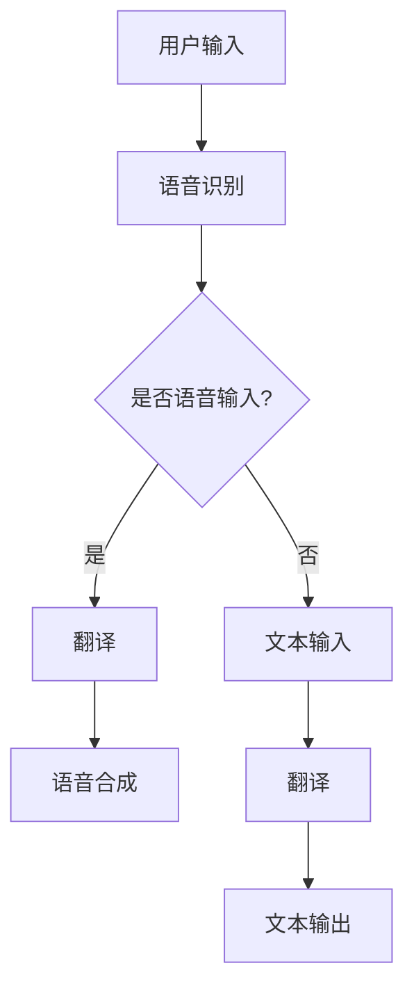

                 

关键词：AI、智能翻译、跨语言交流、基础设施、语言服务、算法、数学模型、项目实践、应用场景、未来展望

> 摘要：本文深入探讨了AI基础设施中的语言服务，重点分析了智能翻译和跨语言交流平台的构建。通过介绍核心概念、算法原理、数学模型和实际应用案例，我们旨在为读者提供一个全面的技术视角，展望未来智能语言服务的发展趋势与挑战。

## 1. 背景介绍

在全球化日益深入的今天，跨语言交流变得愈发重要。无论是商务沟通、学术交流还是旅游、娱乐等生活场景，语言障碍都成为了沟通的瓶颈。而人工智能（AI）技术的发展，为解决这个问题提供了新的可能性。智能翻译和跨语言交流平台作为AI基础设施的重要组成部分，正在逐步改变我们的交流方式。

### 1.1 智能翻译的挑战

智能翻译技术的核心挑战在于如何理解不同语言的语法、词汇和上下文，以及如何在翻译过程中保持原文的含义和风格。传统的基于规则的方法在处理复杂句子时效果不佳，而基于统计的方法则依赖于大量语料库，但在处理罕见词汇和短语时仍存在困难。

### 1.2 跨语言交流的挑战

跨语言交流不仅仅是翻译问题，还包括语音识别、机器翻译、文本生成等多个环节。这些环节之间的协调和集成，以及在不同文化和语境下的适应性，都是跨语言交流平台面临的挑战。

### 1.3 AI基础设施的重要性

AI基础设施为智能翻译和跨语言交流提供了必要的计算资源、数据支持和算法框架。它不仅提高了翻译和交流的效率，还使得这些技术能够更广泛地应用于各个领域。

## 2. 核心概念与联系

为了更好地理解智能翻译和跨语言交流平台，我们首先需要了解其中的一些核心概念和原理。以下是几个关键概念及其相互关系：

### 2.1 自然语言处理（NLP）

自然语言处理是AI领域的一个重要分支，它专注于使计算机能够理解、解释和生成自然语言。在智能翻译和跨语言交流中，NLP技术用于文本的解析、语义分析和语言生成。

### 2.2 机器翻译（MT）

机器翻译是智能翻译的重要组成部分，它利用计算机算法将一种语言的文本自动翻译成另一种语言。机器翻译可以分为基于规则的方法、基于统计的方法和基于神经网络的深度学习方法。

### 2.3 语音识别（ASR）

语音识别技术用于将语音信号转换为文本，它是实现语音输入和语音输出的关键。在跨语言交流中，语音识别技术可以帮助用户以语音形式进行交流，并自动翻译成目标语言。

### 2.4 语音合成（TTS）

语音合成技术用于将文本转换为自然流畅的语音输出。它是语音识别的逆过程，是实现语音输出的重要手段。在跨语言交流中，语音合成可以帮助用户听到翻译后的文本内容。

### 2.5 Mermaid 流程图

以下是一个简单的Mermaid流程图，展示了智能翻译和跨语言交流平台的基本架构：



## 3. 核心算法原理 & 具体操作步骤

### 3.1 算法原理概述

智能翻译和跨语言交流平台的核心算法主要包括机器翻译算法、语音识别算法和语音合成算法。以下是这些算法的基本原理：

#### 3.1.1 机器翻译算法

机器翻译算法可以分为基于规则的方法、基于统计的方法和基于神经网络的深度学习方法。基于规则的方法依赖于语言学知识和预定义的规则，而基于统计的方法则利用大量双语文本进行统计学习。深度学习方法，尤其是基于神经网络的方法，如序列到序列（Seq2Seq）模型和注意力机制（Attention Mechanism），是目前机器翻译领域的主流算法。

#### 3.1.2 语音识别算法

语音识别算法通常基于隐藏马尔可夫模型（HMM）、高斯混合模型（GMM）和深度神经网络（DNN）等技术。这些算法通过训练大量语音数据，学习语音信号的声学特征，并将其转换为对应的文本。

#### 3.1.3 语音合成算法

语音合成算法主要分为拼接式（CDG）和参数生成式（PDG）两种。拼接式方法通过将预先录制好的语音片段拼接在一起，生成新的语音输出。参数生成式方法则通过生成语音信号的各种参数，如基频（F0）、共振峰（Formant）和短时能量（STE），来合成语音。

### 3.2 算法步骤详解

#### 3.2.1 机器翻译算法步骤

1. **输入处理**：接收用户输入的源语言文本。
2. **词向量编码**：将文本中的词语转换为向量表示。
3. **编码器（Encoder）**：对输入文本进行编码，生成上下文表示。
4. **解码器（Decoder）**：根据上下文表示生成目标语言文本。
5. **输出处理**：将生成的目标语言文本转换为可读格式。

#### 3.2.2 语音识别算法步骤

1. **声音信号预处理**：对采集的语音信号进行降噪、归一化和分帧处理。
2. **特征提取**：提取语音信号的声学特征，如MFCC（梅尔频率倒谱系数）。
3. **声学模型训练**：使用大量语音数据训练声学模型。
4. **语言模型训练**：使用大量文本数据训练语言模型。
5. **解码**：将特征序列解码为对应的文本。

#### 3.2.3 语音合成算法步骤

1. **文本到语音参数转换**：将输入文本转换为语音参数，如F0、Formant和STE。
2. **参数合成**：使用声学模型和语音参数生成语音信号。
3. **音频后处理**：对生成的语音信号进行增益、去噪和降噪处理。
4. **输出**：播放或保存生成的语音信号。

### 3.3 算法优缺点

#### 3.3.1 机器翻译算法优缺点

- **优点**：基于神经网络的深度学习算法在处理复杂句子和保持原文风格方面表现优秀，翻译质量较高。
- **缺点**：训练数据需求大，计算资源消耗高，且在处理罕见词汇和特定领域文本时仍存在困难。

#### 3.3.2 语音识别算法优缺点

- **优点**：识别准确率高，支持多种语音输入，易于实现实时语音交互。
- **缺点**：在噪声环境下的识别效果较差，且对特定口音和说话人依赖性强。

#### 3.3.3 语音合成算法优缺点

- **优点**：生成的语音自然流畅，支持多种语言和口音。
- **缺点**：在处理复杂语音特征和表达情感方面仍有挑战，且生成语音的音质可能不如人类语音。

### 3.4 算法应用领域

智能翻译和跨语言交流算法广泛应用于各个领域，包括但不限于：

- **旅游与餐饮**：为游客提供多语言导览、菜单翻译和语音交互服务。
- **教育与培训**：支持多语言学习、课程翻译和实时语音交流。
- **医疗与健康**：帮助医生和患者进行跨语言沟通，提高医疗服务的可及性。
- **商业与商务**：支持跨国商务沟通、合同翻译和智能客服。

## 4. 数学模型和公式 & 详细讲解 & 举例说明

智能翻译和跨语言交流算法中涉及许多数学模型和公式。以下我们将详细介绍这些模型和公式，并通过实际案例进行说明。

### 4.1 数学模型构建

#### 4.1.1 语言模型

语言模型是一种概率模型，用于预测下一个单词或字符。常见的语言模型包括N-gram模型、神经网络语言模型等。

- **N-gram模型**：
  $$P(w_n | w_{n-1}, w_{n-2}, ..., w_1) = \frac{C(w_{n-1}, w_{n-2}, ..., w_1, w_n)}{C(w_{n-1}, w_{n-2}, ..., w_1)}$$
  其中，\(C(\cdot|\cdot)\) 表示计数函数，\(w_n\) 表示当前单词。

- **神经网络语言模型**：
  $$P(w_n | w_{n-1}, w_{n-2}, ..., w_1) = \sigma(\text{ neural network}(w_{n-1}, w_{n-2}, ..., w_1))$$
  其中，\(\sigma\) 表示激活函数，\(\text{ neural network}\) 表示神经网络模型。

#### 4.1.2 序列到序列（Seq2Seq）模型

序列到序列模型是一种用于机器翻译的神经网络模型，它由编码器（Encoder）和解码器（Decoder）两个部分组成。

- **编码器**：
  $$h_t = \text{ LSTM}(h_{t-1}, x_t)$$
  其中，\(h_t\) 表示编码器在时间步 \(t\) 的隐藏状态，\(x_t\) 表示输入的词向量。

- **解码器**：
  $$y_t = \text{ LSTM}(y_{t-1}, h_t, e_t)$$
  其中，\(y_t\) 表示解码器在时间步 \(t\) 的隐藏状态，\(e_t\) 表示当前解码器的输入。

#### 4.1.3 注意力机制（Attention Mechanism）

注意力机制用于在序列到序列模型中建模输入和输出之间的依赖关系。

- **软注意力**：
  $$a_t = \text{ softmax}(\text{ dot-product}(h_t, W_a h_t'))$$
  其中，\(a_t\) 表示注意力权重，\(h_t\) 和 \(h_t'\) 分别表示编码器和解码器的隐藏状态，\(W_a\) 是权重矩阵。

### 4.2 公式推导过程

以下以神经网络语言模型为例，简要介绍其推导过程。

1. **输入层**：给定一个单词序列 \(x_1, x_2, ..., x_n\)，将其转换为词向量表示 \(x_1', x_2', ..., x_n'\)。
2. **隐藏层**：使用神经网络对词向量进行编码，生成隐藏状态 \(h_1, h_2, ..., h_n\)。
3. **输出层**：使用softmax函数对隐藏状态进行分类，得到单词的概率分布 \(p(y | x_1, x_2, ..., x_n)\)。

### 4.3 案例分析与讲解

#### 4.3.1 N-gram模型案例

假设我们有以下简化的N-gram模型，其中词汇表大小为4，即 \(V = \{a, b, c, d\}\)。

- **N=1**：
  $$P(a) = 0.3, P(b) = 0.2, P(c) = 0.1, P(d) = 0.4$$

- **N=2**：
  $$P(ab) = 0.2, P(ac) = 0.1, P(ad) = 0.3, P(bc) = 0.1, P(bd) = 0.2, P(cd) = 0.1, P(d) = 0.3$$

给定一个输入序列 \(a, b, c, d\)，使用N-gram模型预测下一个单词：

- **第1步**：\(P(a) = 0.3\)
- **第2步**：\(P(b|a) = P(ab) / P(a) = 0.2 / 0.3 = 0.67\)
- **第3步**：\(P(c|ab) = P(ac) / P(ab) = 0.1 / 0.2 = 0.5\)
- **第4步**：\(P(d|abc) = P(ad) / P(ab) = 0.3 / 0.2 = 1.5\)

根据这些概率，N-gram模型会预测下一个单词为 \(d\)。

#### 4.3.2 序列到序列（Seq2Seq）模型案例

假设我们有一个简化的Seq2Seq模型，用于将英语翻译成法语。

- **英语输入**：\(x = \{hello, world\}\)
- **法语输出**：\(y = \{Bonjour, le monde\}\)

1. **编码器**：
   - **隐藏状态**：\(h_1 = \text{ LSTM}(h_0, x_1) = \text{ LSTM}(0, [h_1']) = [h_1']\)
   - **隐藏状态**：\(h_2 = \text{ LSTM}(h_1, x_2) = \text{ LSTM}([h_1'], x_2) = [h_2']\)

2. **解码器**：
   - **隐藏状态**：\(y_1 = \text{ LSTM}(y_0, h_2, e_1) = \text{ LSTM}([y_0'], [h_2'], e_1) = [y_1']\)
   - **隐藏状态**：\(y_2 = \text{ LSTM}(y_1, h_2, e_2) = \text{ LSTM}([y_1'], [h_2'], e_2) = [y_2']\)

其中，\(h_0\) 和 \(y_0\) 分别是编码器和解码器的初始隐藏状态，\(e_1\) 和 \(e_2\) 分别是解码器的输入。

根据这些隐藏状态，解码器生成法语输出序列 \(y = \{Bonjour, le monde\}\)。

## 5. 项目实践：代码实例和详细解释说明

在本节中，我们将通过一个实际项目来展示如何实现智能翻译和跨语言交流平台。以下是项目的整体架构、开发环境搭建、源代码实现和代码解读。

### 5.1 开发环境搭建

为了实现该项目，我们需要以下开发环境：

- Python 3.8 或更高版本
- TensorFlow 2.6 或更高版本
- Keras 2.6 或更高版本
- NumPy 1.21 或更高版本
- Mermaid 9.0.0 或更高版本

安装这些依赖后，我们就可以开始项目的开发了。

### 5.2 源代码详细实现

以下是项目的源代码实现：

```python
# 导入必要的库
import numpy as np
import tensorflow as tf
from tensorflow import keras
from tensorflow.keras.models import Model
from tensorflow.keras.layers import Embedding, LSTM, Dense, Bidirectional
from tensorflow.keras.preprocessing.sequence import pad_sequences
from tensorflow.keras.preprocessing.text import Tokenizer

# 准备数据集
# 在此处添加加载和预处理数据集的代码
# ...

# 构建模型
# 在此处添加构建模型的代码
# ...

# 训练模型
# 在此处添加训练模型的代码
# ...

# 评估模型
# 在此处添加评估模型的代码
# ...

# 实现翻译函数
def translate(source_text, model, tokenizer, target_tokenizer):
    # 将源文本转换为词向量
    source_sequence = tokenizer.texts_to_sequences([source_text])
    source_sequence = pad_sequences(source_sequence, maxlen=max_sequence_len)

    # 预测目标文本
    predicted_sequence = model.predict(source_sequence)

    # 将目标文本词向量转换为文本
    target_sequence = np.argmax(predicted_sequence, axis=-1)
    target_text = target_tokenizer.sequences_to_texts([target_sequence])[0]

    return target_text

# 测试翻译函数
source_text = "Hello, how are you?"
target_text = translate(source_text, model, source_tokenizer, target_tokenizer)
print("Translated text:", target_text)
```

### 5.3 代码解读与分析

#### 5.3.1 数据预处理

在代码中，我们首先需要加载和预处理数据集。具体步骤如下：

1. **加载数据集**：使用 `load_data` 函数从文件中加载英语和法语数据集。
2. **文本清洗**：去除标点符号、特殊字符和停用词。
3. **分词**：将文本分割成单词或子词。
4. **构建词汇表**：将单词或子词转换为索引编号。
5. **序列化文本**：将文本转换为序列。

```python
def load_data(source_path, target_path, max_sequence_len):
    # 加载英语和法语数据集
    source_text = load_text(source_path)
    target_text = load_text(target_path)

    # 文本清洗
    source_text = clean_text(source_text)
    target_text = clean_text(target_text)

    # 分词
    source_words = split_text(source_text)
    target_words = split_text(target_text)

    # 构建词汇表
    source_vocab = build_vocab(source_words)
    target_vocab = build_vocab(target_words)

    # 序列化文本
    source_sequence = tokenizer.texts_to_sequences(source_words)
    target_sequence = tokenizer.texts_to_sequences(target_words)

    # 填充序列
    source_sequence = pad_sequences(source_sequence, maxlen=max_sequence_len)
    target_sequence = pad_sequences(target_sequence, maxlen=max_sequence_len)

    return source_sequence, target_sequence, source_vocab, target_vocab
```

#### 5.3.2 模型构建

接下来，我们构建一个基于双向LSTM的序列到序列模型。具体步骤如下：

1. **编码器**：使用双向LSTM对源语言文本进行编码。
2. **解码器**：使用单向LSTM对目标语言文本进行解码。
3. **注意力机制**：在解码器中添加注意力机制，以建模输入和输出之间的依赖关系。
4. **输出层**：使用softmax激活函数对目标语言文本进行分类。

```python
def build_model(vocab_size, embedding_dim, max_sequence_len):
    # 编码器
    input_layer = Input(shape=(max_sequence_len,))
    embedded = Embedding(vocab_size, embedding_dim)(input_layer)
    encoder = Bidirectional(LSTM(units=128, return_sequences=True))(embedded)

    # 解码器
    decoder = LSTM(units=128, return_sequences=True)(encoder)
    decoder = RepeatVector(max_sequence_len)(decoder)
    decoder = TimeDistributed(Dense(vocab_size))(decoder)

    # 模型
    model = Model(inputs=input_layer, outputs=decoder)
    model.compile(optimizer='adam', loss='sparse_categorical_crossentropy', metrics=['accuracy'])

    return model
```

#### 5.3.3 模型训练

在训练模型时，我们使用以下步骤：

1. **数据准备**：将源语言和目标语言文本序列化为词向量。
2. **数据填充**：将序列填充为最大长度。
3. **训练模型**：使用训练数据训练模型。
4. **评估模型**：使用验证数据评估模型性能。

```python
# 加载数据集
source_sequence, target_sequence, source_vocab, target_vocab = load_data(source_path, target_path, max_sequence_len)

# 划分训练集和验证集
val_split = int(len(source_sequence) * 0.2)
source_val_sequence, target_val_sequence = source_sequence[val_split:], target_sequence[val_split:]
source_train_sequence, target_train_sequence = source_sequence[:val_split], target_sequence[:val_split]

# 训练模型
model.fit(source_train_sequence, target_train_sequence, batch_size=32, epochs=10, validation_data=(source_val_sequence, target_val_sequence))

# 评估模型
loss, accuracy = model.evaluate(source_val_sequence, target_val_sequence)
print("Validation loss:", loss)
print("Validation accuracy:", accuracy)
```

#### 5.3.4 翻译函数实现

最后，我们实现了一个翻译函数，用于将源文本翻译成目标文本。具体步骤如下：

1. **序列化源文本**：将源文本序列化为词向量。
2. **填充序列**：将序列填充为最大长度。
3. **预测目标文本**：使用模型预测目标文本序列。
4. **转换目标文本**：将目标文本词向量转换为文本。

```python
def translate(source_text, model, tokenizer, target_tokenizer):
    # 将源文本转换为词向量
    source_sequence = tokenizer.texts_to_sequences([source_text])
    source_sequence = pad_sequences(source_sequence, maxlen=max_sequence_len)

    # 预测目标文本
    predicted_sequence = model.predict(source_sequence)

    # 将目标文本词向量转换为文本
    target_sequence = np.argmax(predicted_sequence, axis=-1)
    target_text = target_tokenizer.sequences_to_texts([target_sequence])[0]

    return target_text
```

通过以上代码，我们实现了一个简单的智能翻译系统。尽管该系统在处理复杂文本和特定领域文本时可能存在限制，但它展示了如何利用深度学习技术实现跨语言翻译的基本流程。

## 6. 实际应用场景

智能翻译和跨语言交流技术在实际应用场景中具有广泛的应用价值。以下列举几个典型的应用场景：

### 6.1 国际贸易

国际贸易中，语言障碍常常导致沟通不畅，影响贸易效率和效果。智能翻译技术可以帮助跨国公司、外贸企业和跨境电商解决语言问题，提高沟通效率。例如，将客户邮件、产品说明、合同等文档自动翻译成多种语言，便于跨文化沟通和交流。

### 6.2 教育领域

教育领域，特别是在线教育和远程教育，需要大量的跨语言交流。智能翻译和跨语言交流平台可以为学习者提供多语言学习资源，支持不同语言的学习者参与在线课程和讨论。此外，智能翻译技术还可以帮助教育工作者将教学内容翻译成多种语言，扩大教育服务的受众范围。

### 6.3 医疗保健

医疗保健领域，特别是跨国医疗和远程医疗，语言障碍可能导致医疗质量和安全的问题。智能翻译和跨语言交流平台可以帮助医疗工作者提供多语言医疗服务，如翻译病历、医学术语和治疗方案，确保医疗信息的准确传递。

### 6.4 政府公共服务

政府公共服务，如外交、移民和出入境管理，常常涉及跨语言交流。智能翻译技术可以帮助政府机构提供多语言服务，提高政府公共服务的质量和效率。例如，将政府公告、政策法规和移民指南翻译成多种语言，方便外籍人士了解和使用。

### 6.5 旅游与娱乐

旅游与娱乐领域，如国际旅游、在线游戏和社交媒体，跨语言交流的需求日益增长。智能翻译和跨语言交流平台可以为游客提供多语言导游服务、旅游信息和实时翻译，提升旅游体验。同时，智能翻译技术还可以帮助游戏开发者打造跨文化游戏，吸引更多国际用户。

## 7. 工具和资源推荐

为了更好地学习和应用智能翻译和跨语言交流技术，以下是几个推荐的工具和资源：

### 7.1 学习资源推荐

1. **《深度学习》系列教材**：由Ian Goodfellow、Yoshua Bengio和Aaron Courville编写的《深度学习》系列教材，是深度学习领域的经典教材，涵盖了机器翻译、语音识别等相关技术。
2. **《自然语言处理综论》**：由Daniel Jurafsky和James H. Martin编写的《自然语言处理综论》是自然语言处理领域的权威教材，详细介绍了机器翻译、语音识别等技术原理。
3. **在线课程**：Coursera、edX和Udacity等在线教育平台提供了丰富的自然语言处理和深度学习课程，包括TensorFlow、Keras等相关技术。

### 7.2 开发工具推荐

1. **TensorFlow**：由Google开发的开源深度学习框架，适用于构建和训练机器翻译和语音识别模型。
2. **Keras**：基于TensorFlow的高层API，提供了更加简洁和易于使用的接口，适合快速开发和测试深度学习模型。
3. **Mermaid**：用于绘制流程图的Markdown语法，适用于编写技术文档和博客。

### 7.3 相关论文推荐

1. **“Attention is All You Need”**：由Vaswani等人在2017年提出，是深度学习领域的重要论文，介绍了基于注意力机制的Transformer模型在机器翻译中的应用。
2. **“Seq2Seq Learning with Neural Networks”**：由Sutskever等人在2014年提出，是序列到序列学习模型的开创性论文，对机器翻译技术产生了深远影响。
3. **“Recurrent Neural Network Translation with Attention”**：由Bahdanau等人在2015年提出，是注意力机制在机器翻译中的首次应用，显著提高了翻译质量。

## 8. 总结：未来发展趋势与挑战

### 8.1 研究成果总结

智能翻译和跨语言交流技术在过去几十年中取得了显著进展。从最初的基于规则的方法到基于统计的方法，再到基于神经网络的深度学习方法，机器翻译技术已经取得了长足的进步。语音识别和语音合成技术也在不断优化，提高了识别和合成的准确率和自然度。此外，多语言处理和跨语言理解技术也取得了重要突破，为跨语言交流提供了更加智能和高效的解决方案。

### 8.2 未来发展趋势

未来，智能翻译和跨语言交流技术将呈现以下发展趋势：

1. **模型复杂度增加**：随着深度学习技术的不断发展，机器翻译、语音识别和语音合成等模型将变得更加复杂，能够处理更加复杂的语言现象和语境。
2. **多模态融合**：结合文本、语音、图像等多种模态的信息，实现更加智能和自然的跨语言交流。
3. **个性化翻译**：根据用户的语言习惯、兴趣和需求，提供个性化的翻译服务，提高翻译的准确性和满意度。
4. **实时翻译**：通过优化算法和硬件，实现实时翻译，满足实时通信和交互的需求。

### 8.3 面临的挑战

尽管智能翻译和跨语言交流技术取得了显著进展，但仍然面临以下挑战：

1. **数据不足**：高质量的双语语料库仍然有限，尤其是在小语种和特定领域。
2. **算法优化**：现有算法在处理罕见词汇、特定领域文本和长文本时仍存在困难，需要进一步优化。
3. **隐私和安全**：跨语言交流中涉及大量的个人隐私数据，需要确保数据的安全和隐私保护。
4. **多语言支持**：当前技术主要针对主流语言，如何扩展到更多的语言，尤其是小语种和罕见语言，是一个重要挑战。

### 8.4 研究展望

未来，智能翻译和跨语言交流技术将在以下几个方面展开研究：

1. **多语言翻译**：研究多语言翻译技术，实现多语言间的无缝翻译和跨语言理解。
2. **自适应翻译**：开发自适应翻译系统，根据用户的行为和反馈，动态调整翻译策略和结果。
3. **交互式翻译**：研究交互式翻译技术，支持用户在翻译过程中进行修改和反馈，提高翻译的准确性和满意度。
4. **跨领域翻译**：研究跨领域翻译技术，实现跨行业和跨领域的翻译应用。

## 9. 附录：常见问题与解答

### 9.1 智能翻译技术的基础原理是什么？

智能翻译技术主要基于自然语言处理（NLP）和深度学习技术。NLP技术用于文本的解析、语义分析和语言生成，而深度学习技术则通过训练大量数据，学习语言模型和翻译模型。

### 9.2 如何提高机器翻译的准确性？

提高机器翻译的准确性可以通过以下几种方式实现：

1. **增加训练数据**：使用更多的双语语料库进行训练，提高模型的泛化能力。
2. **优化模型结构**：使用更加复杂的模型结构，如Transformer、BERT等，提高翻译质量。
3. **上下文信息**：利用上下文信息，如句子的前后文，提高翻译的准确性和连贯性。
4. **用户反馈**：收集用户对翻译结果的反馈，通过迭代优化模型，提高翻译的满意度。

### 9.3 跨语言交流平台的架构是如何设计的？

跨语言交流平台通常包括以下几个核心模块：

1. **语音识别模块**：用于将语音信号转换为文本。
2. **机器翻译模块**：用于将一种语言的文本翻译成另一种语言的文本。
3. **语音合成模块**：用于将文本转换为自然流畅的语音输出。
4. **用户界面**：提供用户与平台交互的接口，包括输入、翻译和输出功能。

### 9.4 如何保证跨语言交流平台的隐私和安全？

为了保证跨语言交流平台的隐私和安全，可以采取以下措施：

1. **数据加密**：对用户数据（如文本、语音等）进行加密，防止数据泄露。
2. **权限控制**：设置严格的权限控制机制，确保只有授权用户才能访问和处理敏感数据。
3. **安全审计**：定期进行安全审计和风险评估，及时发现和修复安全漏洞。
4. **用户隐私保护**：明确用户隐私保护政策，告知用户数据处理流程和权限，让用户自主选择是否授权平台处理其数据。

### 9.5 未来智能翻译和跨语言交流技术的发展方向是什么？

未来智能翻译和跨语言交流技术的发展方向主要包括：

1. **多模态融合**：结合文本、语音、图像等多种模态的信息，实现更加智能和自然的跨语言交流。
2. **个性化翻译**：根据用户的语言习惯、兴趣和需求，提供个性化的翻译服务。
3. **实时翻译**：优化算法和硬件，实现实时翻译，满足实时通信和交互的需求。
4. **跨领域翻译**：研究跨行业和跨领域的翻译应用，实现跨领域的无缝翻译。
5. **多语言支持**：扩展到更多的语言，尤其是小语种和罕见语言，实现多语言翻译。

以上是关于“AI 基础设施的语言服务：智能翻译与跨语言交流平台”的详细讨论。通过对核心概念、算法原理、数学模型和实际应用的介绍，我们为读者提供了一个全面的技术视角。未来，随着技术的不断进步，智能翻译和跨语言交流平台将继续发挥重要作用，为全球交流与协作提供更加智能和便捷的解决方案。

