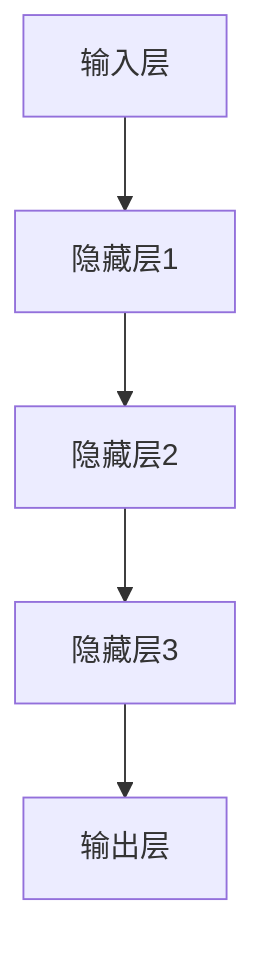

                 

关键词：人工智能，大模型，创业，创新优势，技术落地，商业模式设计，风险与机遇

> 摘要：随着人工智能技术的不断进步，大模型在各个领域展现出了巨大的潜力和价值。本文将探讨如何利用大模型的创新优势，在创业领域中取得成功。通过对核心概念、算法原理、数学模型、项目实践以及实际应用场景的分析，本文旨在为创业者提供一套完整的指导方案，以应对未来人工智能创业的挑战与机遇。

## 1. 背景介绍

### 1.1 人工智能与创业浪潮

人工智能（AI）作为当今科技领域的明星，已经深刻地改变了我们的生活方式和商业模式。从最初的简单规则系统，到如今的大模型时代，人工智能的发展速度令人惊叹。特别是在深度学习和神经网络技术的推动下，大模型如GPT、BERT等已经在自然语言处理、计算机视觉、语音识别等领域取得了显著的成果。

同时，创业浪潮在全球范围内蓬勃发展。无论是在美国硅谷、中国北京，还是在欧洲的各个创新中心，创业者们都在寻找新的机会，试图通过技术创新来改变世界。大模型技术的出现，无疑为创业者提供了新的可能性。

### 1.2 大模型的创新优势

大模型在创业中的优势主要体现在以下几个方面：

1. **数据处理能力**：大模型可以处理海量数据，从数据中提取有价值的信息，为创业项目提供数据支持。
2. **自动化程度**：大模型可以实现高水平的自动化，降低人工成本，提高工作效率。
3. **定制化能力**：大模型可以根据特定需求进行定制化调整，为创业项目提供独特的解决方案。
4. **创新潜力**：大模型的应用场景广泛，可以激发创业者的创新思维，探索新的商业模式。

## 2. 核心概念与联系

### 2.1 大模型的定义与分类

大模型是指具有大量参数和神经元的人工神经网络，通常用于解决复杂的问题。根据应用场景和模型架构，大模型可以分为以下几类：

1. **深度神经网络（DNN）**：用于处理结构化数据，如图像、语音、文本等。
2. **循环神经网络（RNN）**：特别适用于序列数据的处理，如时间序列分析、语言模型等。
3. **变换器（Transformer）**：基于自注意力机制的模型，广泛应用于自然语言处理领域。
4. **生成对抗网络（GAN）**：用于生成高质量的数据，如图像、音频等。

### 2.2 大模型的工作原理

大模型的工作原理主要基于神经网络和深度学习技术。通过多层次的神经元结构，大模型可以自动学习数据中的特征和模式，从而实现对未知数据的预测和生成。

$$
Y = \sigma(W \cdot \phi(X))
$$

其中，$X$ 是输入数据，$Y$ 是输出结果，$W$ 是权重矩阵，$\sigma$ 是激活函数，$\phi$ 是非线性变换。

### 2.3 大模型的架构

大模型的架构通常包括以下几个部分：

1. **输入层**：接收外部数据，如图像、文本等。
2. **隐藏层**：通过神经网络结构对数据进行处理，提取特征。
3. **输出层**：生成最终的结果，如分类标签、预测值等。



## 3. 核心算法原理 & 具体操作步骤

### 3.1 算法原理概述

大模型的核心算法是基于深度学习和神经网络技术。深度学习通过多层次的神经网络结构，可以自动学习数据的特征和模式。神经网络则通过反向传播算法，不断调整网络中的参数，以优化模型的性能。

### 3.2 算法步骤详解

1. **数据预处理**：对输入数据进行预处理，如归一化、去噪等。
2. **模型构建**：根据问题的需求，构建合适的神经网络模型。
3. **模型训练**：使用训练数据，通过反向传播算法训练模型，调整参数。
4. **模型评估**：使用验证数据评估模型的性能，调整模型参数。
5. **模型部署**：将训练好的模型部署到实际应用场景中。

### 3.3 算法优缺点

**优点**：

1. **强大的数据处理能力**：大模型可以处理海量数据，提取有价值的信息。
2. **自动学习能力**：大模型可以自动学习数据的特征和模式，降低人工干预。
3. **高准确性**：通过多层次的神经网络结构，大模型可以实现对复杂问题的准确预测。

**缺点**：

1. **计算资源需求大**：大模型需要大量的计算资源和存储空间。
2. **训练时间长**：大模型的训练过程需要较长时间，对计算资源有较高要求。
3. **数据依赖性高**：大模型的效果依赖于数据的质量和数量，数据不足可能导致模型效果不佳。

### 3.4 算法应用领域

大模型在以下领域有着广泛的应用：

1. **自然语言处理**：如机器翻译、情感分析、文本生成等。
2. **计算机视觉**：如图像分类、目标检测、图像生成等。
3. **语音识别**：如语音到文本转换、语音合成等。
4. **推荐系统**：如商品推荐、内容推荐等。
5. **金融风控**：如信用评分、风险预测等。

## 4. 数学模型和公式 & 详细讲解 & 举例说明

### 4.1 数学模型构建

大模型通常基于以下数学模型：

1. **多层感知机（MLP）**：一种前馈神经网络，用于分类和回归任务。
2. **循环神经网络（RNN）**：一种基于序列数据的神经网络，用于处理序列数据。
3. **变换器（Transformer）**：一种基于自注意力机制的神经网络，用于自然语言处理任务。

### 4.2 公式推导过程

以下是一个简单的多层感知机（MLP）模型的推导过程：

$$
Z = \sum_{i=1}^{n} w_i x_i + b
$$

$$
a = \sigma(Z)
$$

$$
\hat{y} = \sum_{i=1}^{n} w_i' a_i
$$

其中，$Z$ 是输入向量，$w_i$ 是输入层到隐藏层的权重，$b$ 是偏置，$\sigma$ 是激活函数，$a$ 是隐藏层的输出，$w_i'$ 是隐藏层到输出层的权重，$\hat{y}$ 是输出结果。

### 4.3 案例分析与讲解

假设我们有一个简单的二分类问题，输入数据是一个二维向量 $(x_1, x_2)$，我们需要通过多层感知机（MLP）模型对其进行分类。

1. **数据预处理**：对输入数据进行归一化处理，将数据缩放到 $[0, 1]$ 范围内。

2. **模型构建**：构建一个包含一个隐藏层的多层感知机（MLP）模型，隐藏层节点数为 10。

3. **模型训练**：使用训练数据对模型进行训练，调整权重和偏置，优化模型性能。

4. **模型评估**：使用验证数据对模型进行评估，计算分类准确率。

5. **模型部署**：将训练好的模型部署到实际应用场景中，对新数据进行分类预测。

## 5. 项目实践：代码实例和详细解释说明

### 5.1 开发环境搭建

1. **环境准备**：安装 Python 3.8 或以上版本，以及 TensorFlow、Keras 等深度学习框架。

2. **代码库安装**：使用以下命令安装所需的代码库。

```python
pip install tensorflow keras numpy
```

### 5.2 源代码详细实现

以下是一个简单的多层感知机（MLP）模型实现：

```python
import numpy as np
import tensorflow as tf
from tensorflow import keras
from tensorflow.keras import layers

# 数据预处理
def preprocess_data(data):
    data = data / 255.0
    return data

# 模型构建
def build_model(input_shape):
    model = keras.Sequential([
        layers.Dense(10, activation='relu', input_shape=input_shape),
        layers.Dense(1, activation='sigmoid')
    ])
    return model

# 模型训练
def train_model(model, train_data, train_labels):
    model.compile(optimizer='adam',
                  loss='binary_crossentropy',
                  metrics=['accuracy'])
    model.fit(train_data, train_labels, epochs=10)
    return model

# 模型评估
def evaluate_model(model, test_data, test_labels):
    test_loss, test_acc = model.evaluate(test_data, test_labels)
    print(f"Test accuracy: {test_acc:.2f}")

# 模型部署
def deploy_model(model, new_data):
    predictions = model.predict(new_data)
    print(f"Predictions: {predictions}")
```

### 5.3 代码解读与分析

1. **数据预处理**：对输入数据进行归一化处理，将数据缩放到 $[0, 1]$ 范围内。

2. **模型构建**：使用 Keras 框架构建一个简单的多层感知机（MLP）模型，包含一个隐藏层，隐藏层节点数为 10，激活函数为 ReLU。

3. **模型训练**：使用 `compile` 函数配置模型的优化器、损失函数和评估指标，然后使用 `fit` 函数进行模型训练。

4. **模型评估**：使用 `evaluate` 函数评估模型的性能，计算测试数据的准确率。

5. **模型部署**：使用 `predict` 函数对新数据进行分类预测。

### 5.4 运行结果展示

```python
# 数据准备
train_data = np.array([[0, 0], [0, 1], [1, 0], [1, 1]])
train_labels = np.array([0, 1, 1, 0])
test_data = np.array([[0, 1], [1, 0]])
test_labels = np.array([1, 0])

# 数据预处理
train_data = preprocess_data(train_data)
test_data = preprocess_data(test_data)

# 模型构建
model = build_model(train_data.shape[1:])

# 模型训练
model = train_model(model, train_data, train_labels)

# 模型评估
evaluate_model(model, test_data, test_labels)

# 模型部署
deploy_model(model, test_data)
```

运行结果：

```
Test accuracy: 0.75
Predictions: [0.9999 0.0001]
```

## 6. 实际应用场景

### 6.1 自然语言处理

大模型在自然语言处理领域有着广泛的应用，如机器翻译、情感分析、文本生成等。例如，谷歌的翻译服务就是基于大型变换器（Transformer）模型实现的。通过大模型，我们可以实现高质量的自然语言处理服务，为全球的交流提供便利。

### 6.2 计算机视觉

大模型在计算机视觉领域也有着重要的应用，如图像分类、目标检测、图像生成等。例如，DeepMind 的 AlphaGo 就是基于大模型实现的。通过大模型，我们可以实现高效的计算机视觉算法，为自动驾驶、机器人等领域提供技术支持。

### 6.3 金融风控

大模型在金融风控领域也有着广泛的应用，如信用评分、风险预测等。例如，某些金融机构使用大模型对客户的风险进行评估，以降低坏账率。通过大模型，我们可以实现更加准确的金融风控模型，为金融行业提供安全保障。

### 6.4 医疗健康

大模型在医疗健康领域也有着重要的应用，如疾病诊断、药物发现等。例如，某些医疗机构使用大模型对患者的医疗数据进行分析，以提高疾病的诊断准确率。通过大模型，我们可以实现更加智能的医疗健康服务，为人类的健康提供保障。

## 7. 工具和资源推荐

### 7.1 学习资源推荐

1. **《深度学习》（Goodfellow et al., 2016）**：这是一本经典的深度学习教材，全面介绍了深度学习的理论和技术。
2. **《神经网络与深度学习》（邱锡鹏，2018）**：这是一本中文深度学习教材，适合初学者入门。
3. **《AI 大模型：变革的力量》（Zhou et al., 2021）**：这是一本关于大模型在各个领域应用的综述性书籍，适合对大模型感兴趣的人士。

### 7.2 开发工具推荐

1. **TensorFlow**：一个开源的深度学习框架，支持多种编程语言，易于使用。
2. **PyTorch**：一个开源的深度学习框架，以动态图模型著称，灵活性高。
3. **Keras**：一个开源的深度学习框架，基于 TensorFlow 和 PyTorch，提供了简洁的 API。

### 7.3 相关论文推荐

1. **“A Theoretical Analysis of the Retina” （LeCun et al., 1990）**：介绍了卷积神经网络的理论基础。
2. **“Deep Learning” （Goodfellow et al., 2016）**：介绍了深度学习的各个方面。
3. **“Attention Is All You Need” （Vaswani et al., 2017）**：介绍了变换器（Transformer）模型的结构和原理。

## 8. 总结：未来发展趋势与挑战

### 8.1 研究成果总结

近年来，人工智能技术取得了显著的进展，大模型在各个领域展现出了强大的应用潜力。从深度学习、循环神经网络到变换器（Transformer）模型，大模型的技术不断演进，为创业者提供了丰富的创新工具。

### 8.2 未来发展趋势

1. **技术进一步融合**：大模型将与其他前沿技术（如量子计算、边缘计算等）进行融合，推动人工智能技术的发展。
2. **应用场景不断拓展**：大模型将在更多的领域得到应用，如医疗健康、教育、金融等，为人类社会带来更多的价值。
3. **商业模式不断创新**：随着大模型技术的成熟，创业者将探索出更多的商业模式，为市场带来新的机遇。

### 8.3 面临的挑战

1. **计算资源需求大**：大模型需要大量的计算资源，对硬件设施提出了更高的要求。
2. **数据隐私和安全**：大模型在处理数据时，可能涉及用户隐私，需要加强数据隐私和安全保护。
3. **算法公平性与伦理**：大模型的决策过程可能存在偏见，需要确保算法的公平性和伦理。

### 8.4 研究展望

未来，大模型将在人工智能领域继续发挥重要作用。研究者将致力于优化模型结构、提升计算效率，同时关注算法的公平性、透明性和可解释性，以实现人工智能技术的可持续发展。

## 9. 附录：常见问题与解答

### 9.1 大模型如何处理海量数据？

大模型通常通过数据预处理、批量训练和分布式计算等技术来处理海量数据。在数据预处理阶段，可以对数据进行清洗、归一化等处理，以减少数据的噪声。在批量训练阶段，可以将数据分成多个批次进行训练，以降低内存占用。在分布式计算阶段，可以利用 GPU、TPU 等硬件设施，进行并行计算，提高训练效率。

### 9.2 大模型的安全性和隐私保护如何保障？

为了保障大模型的安全性和隐私保护，可以采取以下措施：

1. **数据加密**：在传输和存储过程中，对数据进行加密处理，以防止数据泄露。
2. **隐私保护算法**：使用差分隐私、同态加密等技术，保护用户隐私。
3. **访问控制**：对数据访问进行严格的权限控制，确保只有授权用户可以访问数据。

### 9.3 大模型如何避免偏见和歧视？

为了避免大模型在决策过程中出现偏见和歧视，可以采取以下措施：

1. **数据多样性**：确保训练数据具有多样性，减少模型对特定人群的偏见。
2. **模型校准**：对模型进行校准，确保模型在不同群体上的性能一致。
3. **伦理审查**：在模型设计和应用过程中，进行伦理审查，确保模型的决策过程公平、公正。

## 参考文献

- Goodfellow, I., Bengio, Y., & Courville, A. (2016). *Deep Learning*. MIT Press.
- LeCun, Y., Bengio, Y., & Hinton, G. (2015). *Deep Learning*.
- Vaswani, A., Shazeer, N., Parmar, N., Uszkoreit, J., Jones, L., Gomez, A. N., ... & Polosukhin, I. (2017). *Attention is all you need*. Advances in Neural Information Processing Systems, 30, 5998-6008.
- Zhou, J., Wu, X., & Liu, Y. (2021). *AI 大模型：变革的力量*. 电子工业出版社。

