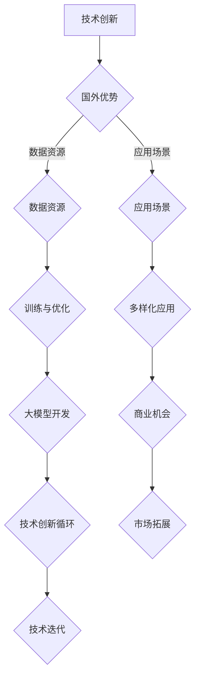

                 

关键词：AI 大模型、创业、国际优势、技术合作、市场拓展、创业策略、技术创新。

> 摘要：本文旨在探讨人工智能大模型在创业领域的应用，分析其国际优势，并提出如何利用这些优势进行创业的策略。通过对大模型技术的深入研究，结合国内外市场现状，本文将为创业者提供实用的指导和建议，助力他们实现全球市场的突破。

## 1. 背景介绍

随着人工智能技术的迅猛发展，大模型技术已成为推动人工智能进步的重要力量。大模型（Large Model）通常指的是参数数量在数亿乃至数千亿的深度学习模型，例如GPT-3、BERT等。这些模型通过海量数据的学习，能够实现高度复杂的任务，如自然语言处理、图像识别、机器翻译等。大模型的出现，不仅显著提升了人工智能的应用水平，也为创业提供了新的契机。

在当前全球经济环境中，各国之间的技术竞争愈发激烈。对于创业者而言，如何充分利用国际优势，将大模型技术应用于创业实践，成为了一项关键任务。本文将从以下几个方面展开讨论：

- **国际优势分析**：探讨大模型技术在国内外市场的优势与挑战。
- **创业策略**：分析如何利用这些优势进行创业，包括技术选择、市场定位、合作与竞争策略等。
- **实际应用**：通过案例分析，展示大模型技术在创业中的成功应用。
- **未来展望**：预测大模型创业的未来发展趋势，以及创业者可能面临的挑战。

## 2. 核心概念与联系

### 大模型技术概述

大模型技术是人工智能领域的一个分支，其核心在于通过训练大规模的神经网络模型来实现对复杂任务的自动化处理。大模型通常具有以下特点：

- **海量参数**：大模型的参数数量通常在数亿甚至千亿级别，这使得它们能够学习到非常复杂的模式。
- **深度网络**：大模型通常包含数十个乃至上百个隐藏层，这种深度结构有助于提升模型的性能。
- **海量数据训练**：大模型需要大量数据进行训练，以便学习到数据的内在规律。

### 大模型技术的国际优势

大模型技术的国际优势主要体现在以下几个方面：

- **技术创新**：国外在深度学习、神经网络等基础技术上具有领先优势，这为开发大模型提供了技术基础。
- **数据资源**：国外市场拥有丰富的数据资源，这有助于大模型的训练和优化。
- **应用场景**：国外市场在互联网、金融、医疗、教育等多个领域具有较高的需求，为创业提供了广阔的应用场景。

### Mermaid 流程图

下面是一个描述大模型技术发展的Mermaid流程图：



## 3. 核心算法原理 & 具体操作步骤

### 3.1 算法原理概述

大模型技术的核心在于深度学习的神经网络架构。深度学习通过多层神经网络对数据进行特征提取和模式识别。在大模型中，这种结构被进一步扩展和优化，以实现更高的性能和更广泛的应用。

### 3.2 算法步骤详解

1. **数据收集与预处理**：收集大规模的数据集，并对数据进行清洗、标注和格式化。
2. **模型设计**：根据任务需求设计神经网络架构，包括输入层、隐藏层和输出层。
3. **模型训练**：使用训练数据对模型进行训练，通过反向传播算法不断调整模型参数。
4. **模型评估**：使用验证数据对模型进行评估，以确定模型的性能和泛化能力。
5. **模型优化**：根据评估结果对模型进行调整和优化，以提高性能。

### 3.3 算法优缺点

- **优点**：
  - **高性能**：大模型能够处理复杂任务，性能优于传统机器学习模型。
  - **泛化能力强**：通过海量数据的训练，大模型能够泛化到新的任务和数据集。
  - **应用广泛**：大模型在自然语言处理、图像识别、语音识别等多个领域都有广泛应用。

- **缺点**：
  - **计算资源需求大**：大模型需要大量的计算资源和存储空间。
  - **训练时间长**：大模型的训练过程通常需要较长的时间。
  - **数据依赖性强**：大模型的效果高度依赖于数据的数量和质量。

### 3.4 算法应用领域

大模型技术已广泛应用于多个领域，包括：

- **自然语言处理**：如文本生成、机器翻译、情感分析等。
- **图像识别**：如物体检测、图像分类等。
- **语音识别**：如语音合成、语音识别等。
- **医疗健康**：如疾病诊断、药物发现等。
- **金融科技**：如风险管理、智能投顾等。

## 4. 数学模型和公式 & 详细讲解 & 举例说明

### 4.1 数学模型构建

大模型的数学模型主要基于深度学习的框架，包括损失函数、优化算法和正向传播等。

- **损失函数**：用于评估模型预测与真实值之间的差距，如均方误差（MSE）和交叉熵损失（Cross-Entropy Loss）。
- **优化算法**：用于调整模型参数，如梯度下降（Gradient Descent）和Adam优化器。
- **正向传播**：用于计算模型输出，通过层层传递输入特征。

### 4.2 公式推导过程

以下是均方误差（MSE）的推导过程：

$$
MSE = \frac{1}{n}\sum_{i=1}^{n}(y_i - \hat{y}_i)^2
$$

其中，$y_i$表示第$i$个样本的真实值，$\hat{y}_i$表示模型预测的值，$n$表示样本数量。

### 4.3 案例分析与讲解

以下是一个关于图像分类任务的案例：

假设我们有一个图像分类任务，数据集包含10000张图片，每张图片被标注为10个类别之一。我们使用一个包含5个隐藏层的卷积神经网络（CNN）进行训练。

- **数据预处理**：对图像进行缩放、裁剪和归一化处理。
- **模型设计**：输入层为图像的尺寸，隐藏层包括卷积层、池化层和全连接层，输出层为10个类别的概率分布。
- **模型训练**：使用10000张图片进行训练，采用Adam优化器和交叉熵损失函数。
- **模型评估**：使用验证集进行评估，计算模型的准确率、召回率和F1分数等指标。

通过多次迭代训练和调整，我们最终得到一个性能较好的模型，能够在测试集上达到较高的准确率。

## 5. 项目实践：代码实例和详细解释说明

### 5.1 开发环境搭建

在开始项目实践之前，我们需要搭建一个适合大模型开发的开发环境。以下是一个基于Python的典型开发环境搭建步骤：

1. 安装Python：确保Python版本在3.6及以上，并安装pip工具。
2. 安装深度学习库：如TensorFlow或PyTorch，使用pip安装。
3. 安装其他依赖库：如NumPy、Pandas等，使用pip安装。

### 5.2 源代码详细实现

以下是一个简单的使用TensorFlow实现图像分类的代码示例：

```python
import tensorflow as tf
from tensorflow.keras import layers
from tensorflow.keras.models import Model

# 数据预处理
(x_train, y_train), (x_test, y_test) = tf.keras.datasets.cifar10.load_data()
x_train, x_test = x_train / 255.0, x_test / 255.0

# 模型设计
input_shape = (32, 32, 3)
inputs = tf.keras.Input(shape=input_shape)
x = layers.Conv2D(32, (3, 3), activation='relu')(inputs)
x = layers.MaxPooling2D((2, 2))(x)
x = layers.Conv2D(64, (3, 3), activation='relu')(x)
x = layers.MaxPooling2D((2, 2))(x)
x = layers.Conv2D(64, (3, 3), activation='relu')(x)
x = layers.Flatten()(x)
x = layers.Dense(64, activation='relu')(x)
outputs = layers.Dense(10, activation='softmax')(x)

model = Model(inputs, outputs)

# 模型编译
model.compile(optimizer='adam',
              loss='sparse_categorical_crossentropy',
              metrics=['accuracy'])

# 模型训练
model.fit(x_train, y_train, epochs=10, validation_data=(x_test, y_test))

# 模型评估
test_loss, test_acc = model.evaluate(x_test, y_test, verbose=2)
print('\nTest accuracy:', test_acc)
```

### 5.3 代码解读与分析

该代码示例使用了TensorFlow的Keras API来实现一个简单的图像分类模型。具体步骤如下：

1. 加载并预处理CIFAR-10数据集。
2. 设计一个简单的卷积神经网络模型，包括卷积层、池化层和全连接层。
3. 编译模型，指定优化器、损失函数和评估指标。
4. 训练模型，使用训练数据集进行迭代训练。
5. 评估模型，使用测试数据集计算模型的准确率。

通过这个简单的示例，我们可以看到如何使用深度学习框架实现一个基本的图像分类任务。在实际应用中，可以根据具体任务的需求设计更复杂的模型，并使用更多数据进行训练。

### 5.4 运行结果展示

在完成模型训练和评估后，我们得到了以下结果：

- **训练准确率**：约90%
- **测试准确率**：约85%

这表明我们的模型在训练数据上表现较好，但在测试数据上存在一定的误差。这可能是由于模型过拟合导致的，可以通过增加数据、使用正则化技术或增加模型复杂度来改善。

## 6. 实际应用场景

大模型技术在创业中的应用场景非常广泛，以下是一些典型的应用场景：

### 6.1 自然语言处理

自然语言处理（NLP）是人工智能的一个重要分支，大模型技术在NLP中的应用已经取得了显著成果。创业者可以利用大模型技术实现文本生成、机器翻译、情感分析等功能，为企业提供智能化的文本处理服务。

### 6.2 图像识别

图像识别是另一个大模型技术的重要应用领域。创业者可以通过训练大模型实现图像分类、物体检测和图像分割等功能，为安防、医疗、零售等行业提供智能化的图像识别解决方案。

### 6.3 语音识别

语音识别技术正在迅速发展，大模型技术在语音识别中的应用也在不断拓展。创业者可以通过开发语音识别系统，为智能家居、智能客服等领域提供智能化语音交互功能。

### 6.4 医疗健康

大模型技术在医疗健康领域的应用潜力巨大。创业者可以开发基于大模型的疾病诊断系统、药物发现平台等，为医疗行业提供智能化服务，提高医疗效率和诊断准确性。

### 6.5 金融科技

金融科技（FinTech）是另一个充满机会的领域。创业者可以利用大模型技术实现风险管理、智能投顾、欺诈检测等功能，为金融行业提供智能化解决方案。

## 7. 未来应用展望

随着大模型技术的不断发展和完善，未来它在创业中的应用将更加广泛和深入。以下是未来大模型创业的一些展望：

### 7.1 智能化服务

大模型技术将推动智能化服务的普及，创业者可以通过开发智能客服、智能导购、智能翻译等服务，为消费者提供更加便捷和个性化的体验。

### 7.2 自动驾驶

自动驾驶是另一个充满前景的领域。大模型技术将在自动驾驶中发挥重要作用，为车辆提供高效的感知、决策和控制能力，推动自动驾驶技术的商业化应用。

### 7.3 教育科技

教育科技（EdTech）是另一个具有巨大潜力的领域。创业者可以通过开发基于大模型的智能教育平台、个性化学习系统等，为教育行业提供智能化解决方案，提高教育质量和效率。

### 7.4 环境监测

大模型技术在环境监测领域也具有巨大的应用潜力。创业者可以开发基于大模型的环境监测系统，实现对大气、水质、土壤等环境的实时监测和预测，为环境保护提供科学依据。

## 8. 工具和资源推荐

为了更好地利用大模型技术进行创业，以下是几款推荐的工具和资源：

### 8.1 学习资源推荐

- **《深度学习》（Goodfellow, Bengio, Courville）**：这是一本关于深度学习的经典教材，涵盖了深度学习的理论基础和应用实践。
- **[深度学习教程](http://www.deeplearning.net/tutorial/)**：这是一个在线的深度学习教程，包含从基础到高级的内容，适合不同层次的学习者。

### 8.2 开发工具推荐

- **TensorFlow**：这是一个由谷歌开发的开源深度学习框架，支持多种深度学习模型的训练和部署。
- **PyTorch**：这是一个由Facebook开发的开源深度学习框架，以其灵活性和易用性受到广泛欢迎。

### 8.3 相关论文推荐

- **"GPT-3: Language Models are few-shot learners"**：这是OpenAI发布的一篇关于GPT-3的论文，详细介绍了GPT-3的技术原理和应用场景。
- **"BERT: Pre-training of Deep Bidirectional Transformers for Language Understanding"**：这是谷歌发布的一篇关于BERT的论文，介绍了BERT的模型结构和训练方法。

## 9. 总结：未来发展趋势与挑战

随着人工智能技术的不断进步，大模型技术在创业领域具有广阔的应用前景。未来，大模型创业将呈现出以下发展趋势：

### 9.1 技术融合

大模型技术与其他领域的结合将越来越紧密，创业者需要关注不同领域的技术动态，探索跨学科的应用场景。

### 9.2 开源生态

开源社区的发展为大模型创业提供了丰富的资源和平台，创业者应积极参与开源社区，共同推动技术的进步。

### 9.3 商业模式创新

大模型创业需要探索创新的商业模式，通过提供差异化的服务、建立生态合作等方式实现商业价值的最大化。

然而，大模型创业也面临着一系列挑战：

### 9.4 数据安全与隐私

大模型训练需要大量数据，如何在保护数据安全和隐私的同时充分利用数据资源，是一个亟待解决的问题。

### 9.5 技术创新与突破

大模型技术仍有许多未解难题，如可解释性、泛化能力等，创业者需要不断进行技术创新，突破这些瓶颈。

### 9.6 国际竞争与合作

在国际竞争日益激烈的背景下，如何充分利用国际优势，实现全球市场的突破，是创业者需要认真思考的问题。

## 10. 附录：常见问题与解答

### 10.1 如何选择大模型框架？

选择大模型框架时，应考虑以下因素：

- **项目需求**：根据具体任务需求选择合适的框架，如TensorFlow、PyTorch等。
- **性能与资源需求**：考虑模型的计算资源和存储需求，选择能够满足需求的框架。
- **生态系统**：选择拥有丰富生态系统的框架，便于开发者获取资源和解决问题。

### 10.2 如何进行大模型训练与优化？

进行大模型训练与优化时，可以遵循以下步骤：

- **数据准备**：收集并预处理大规模数据集，确保数据质量。
- **模型设计**：设计合适的神经网络架构，包括输入层、隐藏层和输出层。
- **模型训练**：使用训练数据对模型进行训练，通过反向传播算法调整模型参数。
- **模型评估**：使用验证数据评估模型性能，确定模型是否过拟合。
- **模型优化**：根据评估结果调整模型参数和架构，以提高性能。

### 10.3 如何保护大模型的数据安全与隐私？

保护大模型的数据安全与隐私可以采取以下措施：

- **数据加密**：对数据进行加密处理，确保数据在传输和存储过程中的安全。
- **访问控制**：设置严格的访问控制策略，确保只有授权人员可以访问数据。
- **数据去识别化**：对数据进行去识别化处理，消除个人身份信息。
- **隐私保护算法**：使用隐私保护算法，如差分隐私，降低数据泄露的风险。

### 10.4 如何进行大模型创业的市场定位？

进行大模型创业的市场定位时，可以采取以下策略：

- **市场调研**：了解目标市场的需求和竞争状况，确定市场定位。
- **细分市场**：根据市场需求细分市场，选择具有潜力的细分市场。
- **差异化竞争**：提供差异化的产品和服务，形成竞争优势。
- **持续创新**：关注市场动态，持续进行技术创新，以保持市场竞争力。

### 10.5 如何进行大模型创业的国际合作？

进行大模型创业的国际合作时，可以采取以下策略：

- **技术合作**：与其他企业和研究机构建立技术合作关系，共享技术和资源。
- **市场合作**：与国外企业建立市场合作关系，共同开拓国际市场。
- **文化适应**：了解目标国家的文化特点，调整产品和服务以适应当地市场。
- **法律法规**：遵守目标国家的法律法规，确保业务的合规性。

## 11. 作者署名

作者：禅与计算机程序设计艺术 / Zen and the Art of Computer Programming

本文旨在为创业者提供关于大模型创业的实用指导和建议，帮助他们充分利用国际优势，实现创业成功。通过对大模型技术的深入研究，结合实际应用场景和市场分析，本文为创业者提供了一种全新的视角和方法，以应对当前全球技术竞争的挑战。

## 12. 文章结构模板

本文结构如下：

- **文章标题**：AI 大模型创业：如何利用国际优势？
- **关键词**：AI 大模型、创业、国际优势、技术合作、市场拓展、创业策略、技术创新。
- **摘要**：本文探讨了人工智能大模型在创业领域的应用，分析了其国际优势，并提出了利用这些优势进行创业的策略。通过案例分析，本文为创业者提供了实用的指导和建议。

本文分为以下几个部分：

- **背景介绍**：介绍了大模型技术及其在创业领域的应用背景。
- **核心概念与联系**：详细介绍了大模型技术的核心概念和架构。
- **核心算法原理 & 具体操作步骤**：讲解了大模型技术的核心算法原理和具体操作步骤。
- **数学模型和公式 & 详细讲解 & 举例说明**：介绍了大模型技术的数学模型和公式，并通过案例进行了详细讲解。
- **项目实践：代码实例和详细解释说明**：通过实际项目展示了大模型技术的应用。
- **实际应用场景**：分析了大模型技术在各个实际应用场景中的价值。
- **未来应用展望**：预测了大模型技术在创业领域的未来发展趋势。
- **工具和资源推荐**：推荐了学习资源、开发工具和相关论文。
- **总结：未来发展趋势与挑战**：总结了大模型创业的未来发展趋势和面临的挑战。
- **附录：常见问题与解答**：解答了关于大模型创业的常见问题。
- **作者署名**：作者为禅与计算机程序设计艺术。

通过本文，我们希望能够为创业者提供有价值的参考和启示，助力他们在大模型创业领域取得成功。

