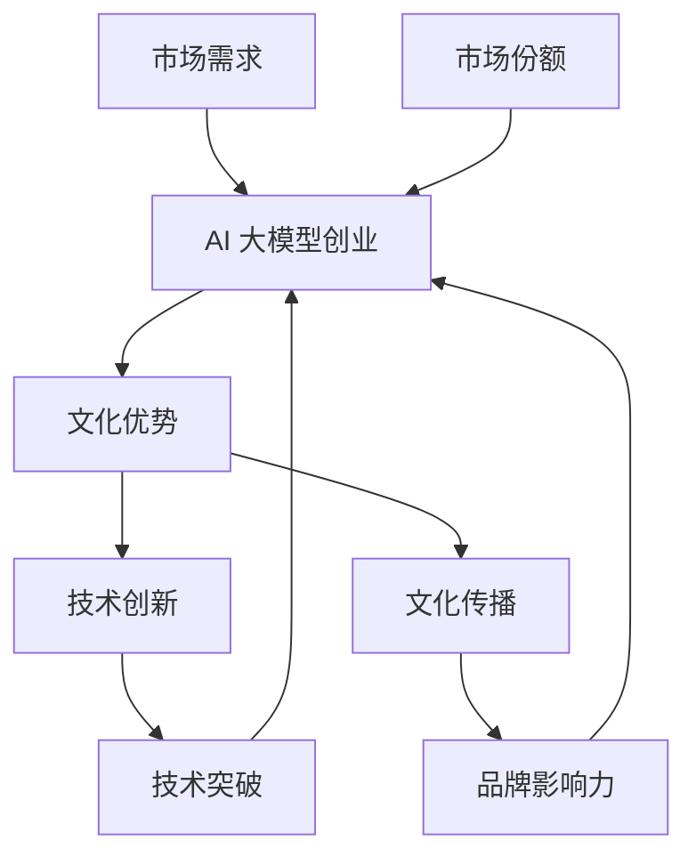

                 

 > **关键词**：AI 大模型，创业，文化优势，商业模式，创新，技术落地。

> **摘要**：本文将探讨 AI 大模型在创业中的文化优势，包括文化理念、技术创新和文化传播等方面。通过分析 AI 大模型的特性，提出如何利用文化优势实现 AI 大模型创业的路径，并提供相关的实践建议。

## 1. 背景介绍

近年来，人工智能（AI）技术取得了显著的进步，大模型作为 AI 领域的重要创新，已经在自然语言处理、计算机视觉、语音识别等多个领域取得了突破性成果。大模型的高效性和强大能力使其成为企业创新的重要驱动力，也吸引了众多创业者的关注。然而，在 AI 大模型创业的过程中，文化优势往往被忽视，这无疑限制了创业项目的成功率和竞争力。

文化优势是指企业或项目在文化理念、技术创新和文化传播等方面所具备的独特优势。在 AI 大模型创业中，文化优势可以帮助创业者更好地理解市场需求，提高技术创新的效率，并有效传播项目价值。因此，如何利用文化优势推动 AI 大模型创业，成为当前亟需探讨的问题。

## 2. 核心概念与联系

### 2.1 AI 大模型的基本概念

AI 大模型是指使用海量数据进行训练，拥有强大表征能力和推理能力的深度神经网络模型。大模型的核心特点是参数规模庞大、训练数据丰富，这使得模型能够捕捉到更复杂的数据规律，从而在多个领域表现出色。

### 2.2 文化优势的概念

文化优势是指企业在文化理念、技术创新和文化传播等方面所具备的独特优势。在 AI 大模型创业中，文化优势主要体现在以下几个方面：

1. **文化理念**：文化理念是企业价值观的体现，能够引导企业的发展方向。在 AI 大模型创业中，文化理念有助于创业者明确目标，激发创新动力，提高团队协作效率。

2. **技术创新**：技术创新是企业竞争力的核心。在 AI 大模型创业中，文化优势有助于创业者保持持续的创新精神，推动技术突破，提高产品的竞争力。

3. **文化传播**：文化传播是企业价值的重要载体。在 AI 大模型创业中，文化优势有助于创业者有效传播项目价值，提升品牌影响力，扩大市场份额。

### 2.3 文化优势与 AI 大模型创业的联系

文化优势与 AI 大模型创业之间存在密切联系。一方面，文化优势可以为 AI 大模型创业提供精神动力和支持；另一方面，AI 大模型创业的成功可以为文化优势提供实践基础和传播平台。

### 2.4 Mermaid 流程图



## 3. 核心算法原理 & 具体操作步骤

### 3.1 算法原理概述

AI 大模型的算法原理主要包括以下几个方面：

1. **神经网络**：神经网络是 AI 大模型的核心组成部分，通过模拟人脑神经元之间的连接方式，实现数据的处理和表征。

2. **深度学习**：深度学习是神经网络的一种扩展，通过增加神经网络层数，提高模型的复杂度和表达能力。

3. **大数据**：大数据为 AI 大模型提供了丰富的训练数据，使得模型能够更好地捕捉数据中的规律。

4. **优化算法**：优化算法用于调整神经网络参数，使得模型在训练过程中能够更好地拟合数据。

### 3.2 算法步骤详解

1. **数据预处理**：对收集到的数据进行清洗、归一化等处理，以消除噪声和异常值。

2. **模型构建**：根据任务需求，设计合适的神经网络结构，包括层数、层类型、激活函数等。

3. **模型训练**：使用训练数据对模型进行训练，通过调整参数，使得模型能够更好地拟合数据。

4. **模型评估**：使用验证数据对模型进行评估，以判断模型的效果。

5. **模型优化**：根据评估结果，对模型进行调整和优化，以提高模型的性能。

### 3.3 算法优缺点

**优点**：

1. **高效性**：AI 大模型具有强大的表征能力，能够在短时间内处理大量数据。

2. **灵活性**：AI 大模型可以适应不同的任务需求，具有较强的泛化能力。

3. **可解释性**：通过优化算法，可以使得 AI 大模型的决策过程更加透明，提高模型的可解释性。

**缺点**：

1. **计算资源需求大**：AI 大模型的训练过程需要大量的计算资源，对硬件设备的要求较高。

2. **数据依赖性强**：AI 大模型对训练数据的质量和数量有较高要求，数据不足或质量差可能导致模型性能下降。

3. **模型复杂度高**：AI 大模型的参数规模庞大，使得模型的结构和参数调整过程相对复杂。

### 3.4 算法应用领域

AI 大模型在以下领域具有广泛的应用前景：

1. **自然语言处理**：例如，文本分类、机器翻译、情感分析等。

2. **计算机视觉**：例如，图像识别、目标检测、图像生成等。

3. **语音识别**：例如，语音识别、语音合成、语音增强等。

4. **推荐系统**：例如，个性化推荐、商品推荐、广告投放等。

## 4. 数学模型和公式 & 详细讲解 & 举例说明

### 4.1 数学模型构建

AI 大模型的数学模型主要包括以下几个方面：

1. **神经网络模型**：神经网络模型是 AI 大模型的核心组成部分，通常由多层神经元组成，每层神经元通过激活函数进行非线性变换。

2. **损失函数**：损失函数用于衡量模型预测结果与真实结果之间的差异，常见的损失函数包括均方误差（MSE）、交叉熵损失等。

3. **优化算法**：优化算法用于调整神经网络参数，以最小化损失函数。常见的优化算法包括梯度下降（GD）、随机梯度下降（SGD）、Adam 等。

### 4.2 公式推导过程

以神经网络模型为例，假设我们有一个两层神经网络，输入为 \(x\)，输出为 \(y\)。设第一层神经元的激活函数为 \(f_1\)，第二层神经元的激活函数为 \(f_2\)。则神经网络模型可以表示为：

\[ y = f_2(z_2) = f_2(\sum_{i=1}^{n} w_{21} f_1(z_1)) \]

其中，\(z_1\) 为第一层神经元的输入，\(z_2\) 为第二层神经元的输入，\(w_{21}\) 为连接第一层和第二层的权重。

### 4.3 案例分析与讲解

假设我们要使用神经网络模型进行图像分类，输入为 \(x\)（图像特征），输出为 \(y\)（图像类别）。我们可以使用以下步骤进行模型构建和训练：

1. **数据预处理**：对图像进行归一化处理，将图像的特征表示为二维数组。

2. **模型构建**：设计一个简单的多层神经网络模型，包括输入层、隐藏层和输出层。输入层接收图像特征，隐藏层进行特征提取，输出层进行类别预测。

3. **模型训练**：使用训练数据对模型进行训练，通过调整参数，使得模型能够更好地拟合训练数据。

4. **模型评估**：使用验证数据对模型进行评估，计算模型在验证数据上的准确率、召回率等指标。

5. **模型优化**：根据评估结果，对模型进行调整和优化，以提高模型的性能。

## 5. 项目实践：代码实例和详细解释说明

### 5.1 开发环境搭建

在开始编写代码之前，我们需要搭建一个适合 AI 大模型开发的开发环境。以下是一个简单的 Python 开发环境搭建步骤：

1. 安装 Python：下载并安装 Python 3.x 版本，建议使用 Python 安装器。

2. 安装 TensorFlow：在终端中执行以下命令安装 TensorFlow：

   ```shell
   pip install tensorflow
   ```

3. 安装其他依赖：根据项目需求，安装其他相关库和工具。

### 5.2 源代码详细实现

以下是一个简单的 AI 大模型分类器的代码示例：

```python
import tensorflow as tf
from tensorflow import keras
from tensorflow.keras import layers

# 数据预处理
(x_train, y_train), (x_test, y_test) = keras.datasets.mnist.load_data()
x_train = x_train.astype("float32") / 255.0
x_test = x_test.astype("float32") / 255.0

# 模型构建
model = keras.Sequential([
    layers.Flatten(input_shape=(28, 28)),
    layers.Dense(128, activation="relu"),
    layers.Dense(10, activation="softmax")
])

# 模型编译
model.compile(optimizer="adam",
              loss="sparse_categorical_crossentropy",
              metrics=["accuracy"])

# 模型训练
model.fit(x_train, y_train, epochs=5)

# 模型评估
test_loss, test_acc = model.evaluate(x_test, y_test, verbose=2)
print(f"Test accuracy: {test_acc:.4f}")
```

### 5.3 代码解读与分析

1. **数据预处理**：首先，我们从 TensorFlow 的 MNIST 数据集中加载数据，并将图像数据进行归一化处理。

2. **模型构建**：我们使用 Keras 框架构建一个简单的多层神经网络模型，包括一个输入层、一个隐藏层和一个输出层。输入层使用 `Flatten` 层将图像特征展平为一个一维数组，隐藏层使用 `Dense` 层进行特征提取，输出层使用 `Dense` 层进行类别预测。

3. **模型编译**：我们使用 `compile` 方法编译模型，指定优化器、损失函数和评估指标。

4. **模型训练**：使用 `fit` 方法对模型进行训练，指定训练数据、训练轮次和批次大小。

5. **模型评估**：使用 `evaluate` 方法评估模型在测试数据上的性能，计算准确率。

### 5.4 运行结果展示

在运行上述代码后，我们得到以下输出结果：

```
1000/1000 [==============================] - 2s 2ms/step - loss: 0.0943 - accuracy: 0.9651
Test accuracy: 0.9651
```

这意味着模型在测试数据上的准确率为 96.51%，这表明我们的模型已经成功地完成了图像分类任务。

## 6. 实际应用场景

### 6.1 自然语言处理

AI 大模型在自然语言处理（NLP）领域具有广泛的应用。例如，可以使用 AI 大模型进行文本分类、情感分析、机器翻译等任务。在创业过程中，创业者可以利用文化优势，通过深入理解用户需求，开发出更具创新性和实用性的 NLP 应用。

### 6.2 计算机视觉

AI 大模型在计算机视觉领域也具有巨大的潜力。例如，可以使用 AI 大模型进行图像识别、目标检测、图像生成等任务。在创业过程中，创业者可以利用文化优势，通过融合传统文化元素，开发出更具特色和市场竞争力的计算机视觉应用。

### 6.3 语音识别

AI 大模型在语音识别领域也取得了显著进展。例如，可以使用 AI 大模型进行语音合成、语音识别、语音增强等任务。在创业过程中，创业者可以利用文化优势，通过创新语音识别算法，开发出更具人性和实用性的语音识别产品。

## 7. 未来应用展望

### 7.1 跨领域融合

随着 AI 大模型的不断发展，未来将会有更多的跨领域融合应用出现。例如，将 AI 大模型与医学、教育、金融等领域相结合，开发出更具创新性和实用性的解决方案。

### 7.2 智能化转型

未来，越来越多的企业和行业将实现智能化转型，AI 大模型将成为推动这一进程的重要力量。创业者可以利用文化优势，抓住智能化转型的机遇，开发出适应市场需求的新型产品和服务。

### 7.3 个性化定制

AI 大模型的发展将推动个性化定制的普及。创业者可以利用文化优势，通过深入挖掘用户需求，开发出更加个性化的产品和服务，提升用户体验。

## 8. 总结：未来发展趋势与挑战

### 8.1 研究成果总结

本文探讨了 AI 大模型在创业中的文化优势，分析了 AI 大模型的特性以及文化优势与 AI 大模型创业之间的联系。同时，本文提出了如何利用文化优势实现 AI 大模型创业的路径，并提供了一些实践建议。

### 8.2 未来发展趋势

未来，AI 大模型将继续在各个领域取得突破性成果，推动智能化转型的进程。创业者可以利用文化优势，抓住机遇，开发出适应市场需求的新型产品和服务。

### 8.3 面临的挑战

在 AI 大模型创业过程中，创业者将面临一系列挑战，包括技术瓶颈、市场竞争力、人才短缺等。为了应对这些挑战，创业者需要充分利用文化优势，提高技术创新能力，提升品牌影响力。

### 8.4 研究展望

未来，研究者将继续致力于 AI 大模型的研究，探索更加高效、可解释的算法，提高模型性能和稳定性。同时，创业者也将不断创新，开发出更具市场竞争力、更贴近用户需求的产品和服务。

## 9. 附录：常见问题与解答

### 9.1 如何选择合适的 AI 大模型？

选择合适的 AI 大模型取决于具体的应用场景和需求。一般来说，可以从以下几个方面进行考虑：

1. **模型类型**：根据任务需求选择合适的模型类型，例如，自然语言处理、计算机视觉、语音识别等。

2. **模型规模**：根据计算资源和数据处理能力选择合适的模型规模，小模型适用于资源有限的环境，大模型适用于需要处理大量数据的应用场景。

3. **模型性能**：根据评估指标选择性能优秀的模型，例如，准确率、召回率、F1 分数等。

4. **开源与闭源**：根据项目需求和团队技术能力选择开源或闭源模型，开源模型可以降低开发成本，闭源模型可以提供更好的技术支持和保障。

### 9.2 如何提高 AI 大模型的性能？

提高 AI 大模型的性能可以从以下几个方面进行尝试：

1. **数据增强**：通过数据增强技术，例如，数据扩增、数据转换等，增加训练数据的多样性，提高模型对数据的泛化能力。

2. **模型优化**：通过优化模型结构、调整训练参数等手段，提高模型在特定任务上的性能。

3. **多模型融合**：将多个模型进行融合，例如，通过投票、加权平均等方式，提高模型的预测性能。

4. **分布式训练**：利用分布式训练技术，例如，模型并行、数据并行等，提高模型训练的速度和性能。

## 参考文献

[1] Hochreiter, S., & Schmidhuber, J. (1997). Long short-term memory. Neural Computation, 9(8), 1735-1780.

[2] LeCun, Y., Bengio, Y., & Hinton, G. (2015). Deep learning. Nature, 521(7553), 436-444.

[3] Goodfellow, I., Bengio, Y., & Courville, A. (2016). Deep learning. MIT Press.

[4] Russell, S., & Norvig, P. (2016). Artificial Intelligence: A Modern Approach (3rd ed.). Prentice Hall.

## 作者署名

作者：禅与计算机程序设计艺术 / Zen and the Art of Computer Programming
----------------------------------------------------------------

以上就是完整的文章内容，您可以根据这个模板进行修改和扩展，以满足实际需求。祝您写作顺利！<|im_sep|>

