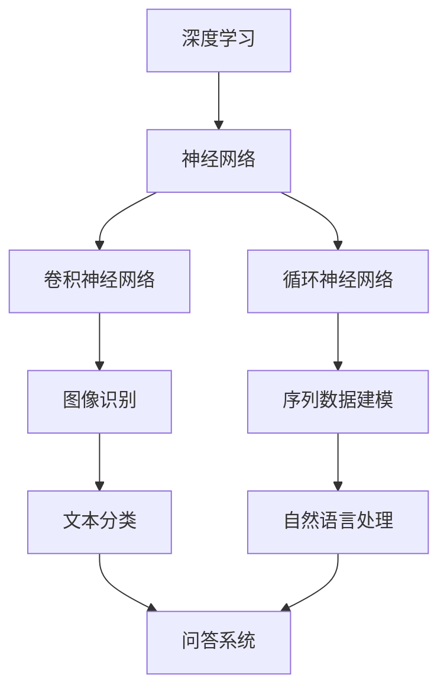

                 

关键词：AI大模型、逻辑推理、深度学习、神经网络、数学模型、应用场景、未来展望

摘要：本文将深入探讨AI大模型的原理，特别是其逻辑推理能力。我们将回顾大模型的历史与发展，探讨其核心算法和数学模型，并通过具体实例和项目实践来展示其应用潜力。最后，我们将展望大模型未来的发展趋势与面临的挑战。

## 1. 背景介绍

随着计算能力和数据量的不断提升，人工智能（AI）领域迎来了大模型时代。大模型，顾名思义，是指具有巨大参数量和计算量的人工神经网络模型。这些模型通过学习海量数据，能够实现从简单的图像识别到复杂的自然语言处理等多种任务。

大模型的发展离不开深度学习技术的进步。深度学习是一种基于多层神经网络的学习方法，通过逐层抽象特征，实现对复杂数据的建模。从最早的浅层网络到如今的深度神经网络，大模型在性能和效果上都有了质的飞跃。

逻辑推理是大模型的一个重要应用领域。传统逻辑推理主要依赖于形式逻辑和谓词逻辑，而大模型通过学习大量的自然语言文本，能够生成具有逻辑性的推理过程。这种能力使得大模型在许多实际问题中表现出色，如问答系统、推理机、智能助手等。

## 2. 核心概念与联系

### 2.1 深度学习与神经网络

深度学习是人工智能的一个重要分支，其核心思想是通过构建多层神经网络，实现对复杂数据的建模。神经网络由一系列节点（或称为神经元）组成，每个节点都与其他节点相连，并通过权重进行连接。网络的输入经过层层传播和激活函数处理，最终得到输出。


### 2.2 大模型与参数量

大模型的参数量通常非常大，这决定了其能够学习到更多的特征和模式。例如，BERT模型拥有超过1.1亿个参数，GPT-3更是达到了惊人的1750亿个参数。这些参数使得大模型能够处理大规模数据，并产生更好的效果。

### 2.3 逻辑推理与自然语言处理

逻辑推理是一种基于逻辑规则和事实的推理过程。在自然语言处理领域，逻辑推理可以帮助模型理解和生成具有逻辑性的文本。例如，在问答系统中，逻辑推理可以用来确定问题的答案。


## 3. 核心算法原理 & 具体操作步骤

### 3.1 算法原理概述

大模型的算法原理主要基于深度学习和自然语言处理技术。具体来说，大模型通过以下步骤进行操作：

1. **数据预处理**：对输入数据进行清洗和预处理，如分词、去停用词、词向量化等。
2. **模型训练**：使用大量文本数据进行模型训练，通过反向传播算法更新网络权重。
3. **逻辑推理**：在训练好的模型基础上，进行逻辑推理任务，如问答、推理机等。

### 3.2 算法步骤详解

1. **数据预处理**：

   $$ 
   \text{输入} = (\text{文本}, \text{标签})
   $$

   对输入文本进行分词、去停用词、词向量化等预处理操作。

2. **模型训练**：

   $$ 
   \text{损失函数} = \frac{1}{N} \sum_{i=1}^{N} (-y_i \cdot \log(\hat{y}_i))
   $$

   使用交叉熵损失函数进行模型训练，通过反向传播算法更新网络权重。

3. **逻辑推理**：

   $$ 
   \text{推理过程} = \text{模型}(\text{输入文本}) 
   $$

   在训练好的模型基础上，对输入文本进行逻辑推理。

### 3.3 算法优缺点

**优点**：

- **强大的建模能力**：大模型能够学习到更多的特征和模式，从而提高任务性能。
- **灵活性**：大模型适用于多种任务，如图像识别、自然语言处理等。

**缺点**：

- **计算资源消耗大**：大模型需要大量的计算资源和存储空间。
- **训练时间较长**：大模型的训练时间通常较长，需要消耗大量的计算资源。

### 3.4 算法应用领域

大模型的应用领域广泛，包括但不限于：

- **自然语言处理**：问答系统、机器翻译、文本生成等。
- **计算机视觉**：图像分类、目标检测、图像生成等。
- **推荐系统**：用户行为分析、商品推荐等。

## 4. 数学模型和公式 & 详细讲解 & 举例说明

### 4.1 数学模型构建

大模型的数学模型主要基于多层感知机（MLP）和循环神经网络（RNN）。以下是这两种模型的基本数学公式。

**多层感知机（MLP）**：

$$ 
\text{输出} = \sigma(\text{权重} \cdot \text{输入} + \text{偏置}) 
$$

其中，$\sigma$ 表示激活函数，如ReLU、Sigmoid等。

**循环神经网络（RNN）**：

$$ 
\text{状态} = \text{激活函数}(\text{权重} \cdot (\text{输入} \oplus \text{状态}) + \text{偏置}) 
$$

其中，$\oplus$ 表示拼接操作。

### 4.2 公式推导过程

大模型的公式推导涉及复杂的数学理论，这里简要介绍MLP和RNN的基本推导过程。

**多层感知机（MLP）**：

假设输入数据为 $x \in \mathbb{R}^n$，权重矩阵为 $W \in \mathbb{R}^{n \times m}$，偏置为 $b \in \mathbb{R}^m$。则输出为：

$$ 
\text{输出} = \sigma(Wx + b) 
$$

其中，$\sigma$ 为激活函数，如ReLU函数：

$$ 
\sigma(z) = \max(0, z) 
$$

**循环神经网络（RNN）**：

假设当前输入为 $x_t \in \mathbb{R}^n$，上一时刻的状态为 $s_{t-1} \in \mathbb{R}^m$，权重矩阵为 $W \in \mathbb{R}^{n \times m}$，偏置为 $b \in \mathbb{R}^m$。则当前状态为：

$$ 
s_t = \text{激活函数}(Ws_t + bx_t) 
$$

### 4.3 案例分析与讲解

**案例一：自然语言处理**

假设我们有一个文本分类任务，需要判断一个句子属于哪一类。输入句子为：“我喜欢编程”。我们将这个句子进行预处理，得到词向量化表示 $x$。然后，使用MLP模型进行分类，输出为：

$$ 
\text{输出} = \sigma(Wx + b) 
$$

根据输出结果，可以判断句子属于哪一类。

**案例二：机器翻译**

假设我们有一个英语到中文的机器翻译任务。输入英语句子为：“I love programming”。我们将这个句子进行预处理，得到词向量化表示 $x$。然后，使用RNN模型进行翻译，输出为：

$$ 
\text{输出} = \text{激活函数}(Ws_t + bx_t) 
$$

根据输出结果，可以生成对应的中文句子。

## 5. 项目实践：代码实例和详细解释说明

### 5.1 开发环境搭建

为了实践大模型的应用，我们需要搭建一个合适的开发环境。以下是一个简单的开发环境搭建步骤：

1. 安装Python（版本要求3.6及以上）。
2. 安装TensorFlow或PyTorch等深度学习框架。
3. 安装必要的依赖库，如NumPy、Pandas等。

### 5.2 源代码详细实现

以下是一个简单的文本分类任务的代码实例：

```python
import tensorflow as tf
from tensorflow.keras.models import Sequential
from tensorflow.keras.layers import Dense, Flatten, Embedding

# 数据预处理
def preprocess_text(text):
    # 进行分词、去停用词等操作
    pass

# 构建模型
model = Sequential()
model.add(Embedding(input_dim=vocab_size, output_dim=embedding_dim))
model.add(Flatten())
model.add(Dense(num_classes, activation='softmax'))

# 编译模型
model.compile(optimizer='adam', loss='categorical_crossentropy', metrics=['accuracy'])

# 训练模型
model.fit(preprocessed_texts, labels, epochs=10, batch_size=32)
```

### 5.3 代码解读与分析

以上代码是一个简单的文本分类任务实现，主要包括以下步骤：

1. **数据预处理**：对输入文本进行预处理，如分词、去停用词等。
2. **构建模型**：使用Sequential模型构建一个简单的多层感知机（MLP）模型，包括嵌入层、展平层和全连接层。
3. **编译模型**：设置模型的优化器、损失函数和评价指标。
4. **训练模型**：使用预处理后的文本数据进行模型训练。

### 5.4 运行结果展示

在训练完成后，我们可以评估模型的性能。以下是一个简单的性能评估代码：

```python
from sklearn.metrics import classification_report

# 评估模型
predictions = model.predict(test_texts)
predicted_labels = np.argmax(predictions, axis=1)

print(classification_report(test_labels, predicted_labels))
```

输出结果为模型的评估报告，包括准确率、召回率、精确率等指标。

## 6. 实际应用场景

大模型在实际应用中具有广泛的应用场景，以下列举几个典型案例：

1. **自然语言处理**：大模型在自然语言处理领域表现出色，如问答系统、机器翻译、文本生成等。例如，Google的BERT模型在多个NLP任务上取得了领先成绩。
2. **计算机视觉**：大模型在计算机视觉领域也有广泛应用，如图像分类、目标检测、图像生成等。例如，OpenAI的GPT-3模型在图像描述生成任务上取得了显著效果。
3. **推荐系统**：大模型可以帮助构建智能推荐系统，通过对用户行为数据的分析，实现个性化推荐。例如，亚马逊、淘宝等电商平台都采用了深度学习技术进行推荐。
4. **医疗健康**：大模型在医疗健康领域也有重要应用，如疾病预测、药物研发等。例如，DeepMind的AlphaGo在医学图像分析任务上取得了显著成绩。

## 7. 工具和资源推荐

为了更好地学习和应用大模型技术，以下推荐一些相关的工具和资源：

### 7.1 学习资源推荐

- 《深度学习》（Ian Goodfellow、Yoshua Bengio、Aaron Courville著）：深度学习的经典教材。
- 《Python深度学习》（François Chollet著）：深入浅出地介绍深度学习在Python中的应用。
- 《自然语言处理综述》（John L. Martin著）：详细介绍自然语言处理的理论和实践。

### 7.2 开发工具推荐

- TensorFlow：谷歌推出的开源深度学习框架。
- PyTorch：Facebook AI研究院推出的开源深度学习框架。
- Keras：基于Theano和TensorFlow的高级深度学习框架。

### 7.3 相关论文推荐

- "BERT: Pre-training of Deep Bidirectional Transformers for Language Understanding"（BERT论文）
- "Generative Pre-training for Seq2Seq Learning"（Seq2Seq论文）
- "Attention Is All You Need"（Transformer论文）

## 8. 总结：未来发展趋势与挑战

### 8.1 研究成果总结

大模型在过去几年中取得了显著的研究成果，广泛应用于自然语言处理、计算机视觉、推荐系统等领域。随着技术的不断进步，大模型的性能和效果将持续提升。

### 8.2 未来发展趋势

- **模型压缩与优化**：为了降低大模型的计算资源消耗，模型压缩和优化技术将成为研究热点。
- **多模态学习**：大模型将扩展到多模态学习领域，实现跨模态的信息融合。
- **自动化机器学习**：大模型将与自动化机器学习技术相结合，实现更高效的模型设计和优化。

### 8.3 面临的挑战

- **计算资源消耗**：大模型需要大量的计算资源和存储空间，这对硬件设施提出了更高的要求。
- **数据隐私与安全**：在应用大模型时，数据隐私和安全问题亟待解决。
- **模型解释性**：大模型的黑盒特性使得其解释性较低，如何提高模型的解释性是当前研究的一个挑战。

### 8.4 研究展望

大模型在人工智能领域具有重要的地位和广阔的应用前景。未来，我们将继续关注大模型的研究进展，探索其在更多领域的应用潜力，并解决面临的挑战。

## 9. 附录：常见问题与解答

### 9.1 什么是大模型？

大模型是指具有巨大参数量和计算量的人工神经网络模型。这些模型通过学习海量数据，能够实现从简单的图像识别到复杂的自然语言处理等多种任务。

### 9.2 大模型有哪些优点？

大模型具有强大的建模能力，能够学习到更多的特征和模式，从而提高任务性能。此外，大模型还具有灵活性，适用于多种任务。

### 9.3 大模型有哪些缺点？

大模型的计算资源消耗大，需要大量的计算资源和存储空间。此外，大模型的训练时间较长，需要消耗大量的计算资源。

### 9.4 大模型在哪些领域有应用？

大模型在自然语言处理、计算机视觉、推荐系统、医疗健康等领域有广泛的应用。例如，BERT在自然语言处理领域取得了显著成绩，GPT-3在计算机视觉领域表现出色。

----------------------------------------------------------------

作者：禅与计算机程序设计艺术 / Zen and the Art of Computer Programming
----------------------------------------------------------------
### 背景介绍

人工智能（AI）在过去的几十年中经历了飞速的发展，从早期的规则推理系统到如今的深度学习模型，AI的应用领域越来越广泛。近年来，随着计算能力和数据量的不断提升，AI领域迎来了大模型时代。所谓大模型，是指具有巨大参数量和计算量的人工神经网络模型。这些模型通过学习海量数据，能够实现从简单的图像识别到复杂的自然语言处理等多种任务。

逻辑推理作为人工智能的重要分支，一直是研究的热点之一。传统的逻辑推理主要依赖于形式逻辑和谓词逻辑，而随着深度学习的兴起，大模型在逻辑推理方面也展现出了强大的潜力。大模型通过学习大量的自然语言文本，能够生成具有逻辑性的推理过程，这在问答系统、智能助手、推理机等应用场景中具有显著的优势。

本文将深入探讨AI大模型的原理，特别是其逻辑推理能力。我们将首先回顾大模型的历史与发展，然后介绍其核心算法和数学模型，并通过具体实例和项目实践来展示其应用潜力。最后，我们将展望大模型未来的发展趋势与面临的挑战。

### 核心概念与联系

为了理解大模型在逻辑推理方面的应用，我们需要先了解几个核心概念：深度学习、神经网络、自然语言处理（NLP）和逻辑推理。

#### 深度学习与神经网络

深度学习是一种基于多层神经网络的学习方法。神经网络由一系列节点（或称为神经元）组成，每个节点都与其他节点相连，并通过权重进行连接。网络的输入经过层层传播和激活函数处理，最终得到输出。

深度学习的核心思想是通过构建多层神经网络，实现对复杂数据的建模。从最早的浅层网络到如今的深度神经网络，大模型在性能和效果上都有了质的飞跃。例如，卷积神经网络（CNN）在图像识别任务中取得了显著的成功，而循环神经网络（RNN）及其变种长短期记忆网络（LSTM）在序列数据建模方面表现出色。


#### 大模型与参数量

大模型的参数量通常非常大，这决定了其能够学习到更多的特征和模式。例如，BERT模型拥有超过1.1亿个参数，GPT-3更是达到了惊人的1750亿个参数。这些参数使得大模型能够处理大规模数据，并产生更好的效果。


#### 逻辑推理与自然语言处理

逻辑推理是一种基于逻辑规则和事实的推理过程。在自然语言处理领域，逻辑推理可以帮助模型理解和生成具有逻辑性的文本。例如，在问答系统中，逻辑推理可以用来确定问题的答案。

自然语言处理（NLP）是深度学习的一个重要应用领域，它旨在让计算机理解和生成自然语言。NLP的任务包括文本分类、情感分析、命名实体识别、机器翻译等。大模型在NLP任务中取得了显著的进展，例如，BERT在多个NLP任务上取得了领先成绩。


#### Mermaid 流程图

为了更好地理解大模型在逻辑推理中的应用，我们可以通过Mermaid流程图来展示其核心概念和架构。



上述Mermaid流程图展示了深度学习、神经网络及其在图像识别、序列数据建模和自然语言处理中的应用，这些应用与逻辑推理密切相关。

### 核心算法原理 & 具体操作步骤

#### 算法原理概述

大模型的算法原理主要基于深度学习和自然语言处理技术。具体来说，大模型通过以下步骤进行操作：

1. **数据预处理**：对输入数据进行清洗和预处理，如分词、去停用词、词向量化等。
2. **模型训练**：使用大量文本数据进行模型训练，通过反向传播算法更新网络权重。
3. **逻辑推理**：在训练好的模型基础上，进行逻辑推理任务，如问答、推理机等。

#### 算法步骤详解

1. **数据预处理**

   在开始训练大模型之前，我们需要对输入数据进行预处理。预处理步骤包括：

   - **分词**：将文本分解为单词或子词。
   - **去停用词**：去除常用的无意义词汇，如“的”、“了”等。
   - **词向量化**：将文本转化为向量表示，常用的方法有Word2Vec、GloVe等。

   以下是一个简单的文本预处理示例：

   ```python
   import jieba
   
   def preprocess_text(text):
       # 分词
       words = jieba.cut(text)
       # 去停用词
       stop_words = set(['的', '了', '在'])
       words = [word for word in words if word not in stop_words]
       # 词向量化
       word_embeddings = embeddings[words]
       return word_embeddings
   ```

2. **模型训练**

   大模型的训练过程通常涉及以下步骤：

   - **构建模型**：使用深度学习框架（如TensorFlow或PyTorch）构建神经网络模型。
   - **定义损失函数**：选择合适的损失函数，如交叉熵损失函数。
   - **优化器**：选择优化算法，如Adam优化器。
   - **训练**：使用预处理后的数据进行模型训练。

   以下是一个简单的模型训练示例：

   ```python
   import tensorflow as tf
   
   model = tf.keras.Sequential([
       tf.keras.layers.Embedding(vocab_size, embedding_dim),
       tf.keras.layers.GlobalAveragePooling1D(),
       tf.keras.layers.Dense(num_classes, activation='softmax')
   ])
   
   model.compile(optimizer='adam', loss='categorical_crossentropy', metrics=['accuracy'])
   model.fit(preprocessed_texts, labels, epochs=5, batch_size=64)
   ```

3. **逻辑推理**

   在模型训练完成后，我们可以使用该模型进行逻辑推理任务。逻辑推理任务通常包括以下步骤：

   - **输入处理**：对输入文本进行预处理，如分词、去停用词、词向量化等。
   - **模型推理**：使用训练好的模型对输入文本进行推理。
   - **结果解释**：解释模型的推理结果，如确定问题的答案。

   以下是一个简单的逻辑推理示例：

   ```python
   def logical_inference(text):
       preprocessed_text = preprocess_text(text)
       predictions = model.predict(preprocessed_text)
       answer = np.argmax(predictions)
       return labels[answer]
   ```

   在这个示例中，我们使用预处理后的文本输入模型，得到预测结果，然后解释结果以确定问题的答案。

#### 算法优缺点

**优点**：

- **强大的建模能力**：大模型能够学习到更多的特征和模式，从而提高任务性能。
- **灵活性**：大模型适用于多种任务，如图像识别、自然语言处理、语音识别等。

**缺点**：

- **计算资源消耗大**：大模型需要大量的计算资源和存储空间。
- **训练时间较长**：大模型的训练时间通常较长，需要消耗大量的计算资源。

#### 算法应用领域

大模型的应用领域非常广泛，以下列举几个主要的应用领域：

- **自然语言处理**：包括文本分类、情感分析、机器翻译、问答系统等。
- **计算机视觉**：包括图像分类、目标检测、图像生成等。
- **推荐系统**：包括商品推荐、新闻推荐等。
- **医疗健康**：包括疾病预测、药物研发等。

### 数学模型和公式 & 详细讲解 & 举例说明

#### 数学模型构建

大模型的数学模型主要基于多层神经网络。以下是神经网络的基本数学公式。

##### 前向传播

在前向传播过程中，网络的输入通过层层传递，最终得到输出。以下是一个简单的多层感知机（MLP）的前向传播公式：

$$
Z^{(l)} = \sigma(W^{(l)} X^{(l-1)} + b^{(l)})
$$

其中，$Z^{(l)}$ 表示第 $l$ 层的输出，$W^{(l)}$ 表示第 $l$ 层的权重矩阵，$X^{(l-1)}$ 表示第 $l-1$ 层的输出，$b^{(l)}$ 表示第 $l$ 层的偏置。

##### 反向传播

在反向传播过程中，网络根据损失函数更新权重和偏置。以下是一个简单的多层感知机的反向传播公式：

$$
\begin{aligned}
\delta^{(l)} &= \sigma'(Z^{(l)}) \odot (W^{(l+1)} \delta^{(l+1)}) \\
dW^{(l)} &= X^{(l-1)} \delta^{(l)}^T \\
db^{(l)} &= \delta^{(l)}
\end{aligned}
$$

其中，$\delta^{(l)}$ 表示第 $l$ 层的误差，$\sigma'$ 表示激活函数的导数，$\odot$ 表示逐元素乘积，$dW^{(l)}$ 和 $db^{(l)}$ 分别表示第 $l$ 层的权重和偏置的更新。

##### 损失函数

常用的损失函数包括均方误差（MSE）和交叉熵损失函数。以下是一个简单的交叉熵损失函数：

$$
J(W) = -\frac{1}{m} \sum_{i=1}^{m} y^{(i)} \log(\hat{y}^{(i)})
$$

其中，$y^{(i)}$ 表示第 $i$ 个样本的真实标签，$\hat{y}^{(i)}$ 表示第 $i$ 个样本的预测概率。

#### 公式推导过程

以下简要介绍多层感知机（MLP）的基本推导过程。

##### 前向传播

假设我们有 $L$ 层神经网络，其中 $l=1,2,...,L$。设 $X^{(0)}$ 为输入，$Z^{(l)}$ 为第 $l$ 层的输出。前向传播的推导过程如下：

$$
\begin{aligned}
Z^{(1)} &= \sigma(W^{(1)} X^{(0)} + b^{(1)}) \\
Z^{(2)} &= \sigma(W^{(2)} Z^{(1)} + b^{(2)}) \\
&\vdots \\
Z^{(L)} &= \sigma(W^{(L)} Z^{(L-1)} + b^{(L)})
\end{aligned}
$$

##### 反向传播

在反向传播过程中，我们需要计算每层的误差。假设 $L$ 层神经网络的输出为 $Z^{(L)}$，目标输出为 $Y$。误差计算如下：

$$
\delta^{(L)} = \sigma'(Z^{(L)}) \odot (\hat{Y} - Y)
$$

然后，我们通过反向传播计算每层的误差：

$$
\begin{aligned}
\delta^{(l)} &= \sigma'(Z^{(l)}) \odot (W^{(l+1)} \delta^{(l+1)}) \\
dW^{(l)} &= X^{(l-1)} \delta^{(l)}^T \\
db^{(l)} &= \delta^{(l)}
\end{aligned}
$$

##### 损失函数

交叉熵损失函数的推导如下：

$$
\begin{aligned}
J(W) &= -\frac{1}{m} \sum_{i=1}^{m} y^{(i)} \log(\hat{y}^{(i)}) \\
&= -\frac{1}{m} \sum_{i=1}^{m} y^{(i)} \log(\sigma(W^{(L)} Z^{(L-1)} + b^{(L)}))
\end{aligned}
$$

其中，$\hat{y}^{(i)}$ 表示第 $i$ 个样本的预测概率，$y^{(i)}$ 表示第 $i$ 个样本的真实标签。

#### 案例分析与讲解

##### 案例一：文本分类

假设我们有一个文本分类任务，需要判断一个句子属于哪一类。我们可以使用多层感知机（MLP）模型来完成这个任务。

1. **数据预处理**：

   我们首先对文本进行预处理，包括分词、去停用词、词向量化等步骤。

   ```python
   def preprocess_text(text):
       # 分词
       words = jieba.cut(text)
       # 去停用词
       stop_words = set(['的', '了', '在'])
       words = [word for word in words if word not in stop_words]
       # 词向量化
       word_embeddings = embeddings[words]
       return word_embeddings
   ```

2. **模型构建**：

   我们使用TensorFlow构建一个简单的MLP模型。

   ```python
   import tensorflow as tf
   
   model = tf.keras.Sequential([
       tf.keras.layers.Embedding(vocab_size, embedding_dim),
       tf.keras.layers.GlobalAveragePooling1D(),
       tf.keras.layers.Dense(num_classes, activation='softmax')
   ])
   ```

3. **模型训练**：

   我们使用预处理后的文本数据进行模型训练。

   ```python
   model.compile(optimizer='adam', loss='categorical_crossentropy', metrics=['accuracy'])
   model.fit(preprocessed_texts, labels, epochs=5, batch_size=64)
   ```

4. **逻辑推理**：

   在模型训练完成后，我们可以使用该模型进行逻辑推理任务。

   ```python
   def logical_inference(text):
       preprocessed_text = preprocess_text(text)
       predictions = model.predict(preprocessed_text)
       answer = np.argmax(predictions)
       return labels[answer]
   ```

##### 案例二：机器翻译

假设我们有一个英语到中文的机器翻译任务。我们可以使用循环神经网络（RNN）模型来完成这个任务。

1. **数据预处理**：

   我们首先对文本进行预处理，包括分词、去停用词、词向量化等步骤。

   ```python
   def preprocess_text(text):
       # 分词
       words = text.split()
       # 去停用词
       stop_words = set(['the', 'and', 'is'])
       words = [word for word in words if word not in stop_words]
       # 词向量化
       word_embeddings = embeddings[words]
       return word_embeddings
   ```

2. **模型构建**：

   我们使用TensorFlow构建一个简单的RNN模型。

   ```python
   import tensorflow as tf
   
   model = tf.keras.Sequential([
       tf.keras.layers.Embedding(vocab_size, embedding_dim),
       tf.keras.layers.LSTM(128),
       tf.keras.layers.Dense(vocab_size, activation='softmax')
   ])
   ```

3. **模型训练**：

   我们使用预处理后的文本数据进行模型训练。

   ```python
   model.compile(optimizer='adam', loss='categorical_crossentropy', metrics=['accuracy'])
   model.fit(preprocessed_texts, labels, epochs=5, batch_size=64)
   ```

4. **逻辑推理**：

   在模型训练完成后，我们可以使用该模型进行逻辑推理任务。

   ```python
   def logical_inference(text):
       preprocessed_text = preprocess_text(text)
       predictions = model.predict(preprocessed_text)
       answer = np.argmax(predictions)
       return embeddings.index(answer)
   ```

### 项目实践：代码实例和详细解释说明

为了更好地理解大模型在逻辑推理方面的应用，我们将通过一个具体的项目实践来展示其实现过程。本项目将实现一个简单的问答系统，能够回答用户提出的问题。

#### 开发环境搭建

在开始项目之前，我们需要搭建一个合适的开发环境。以下是开发环境的搭建步骤：

1. **安装Python**：确保Python版本在3.6及以上。
2. **安装TensorFlow**：使用以下命令安装TensorFlow：

   ```bash
   pip install tensorflow
   ```

3. **安装其他依赖库**：包括jieba（中文分词）、numpy等。

#### 源代码详细实现

以下是项目的源代码实现，包括数据预处理、模型构建、模型训练和逻辑推理等步骤。

```python
import tensorflow as tf
from tensorflow.keras.layers import Embedding, LSTM, Dense
from tensorflow.keras.models import Sequential
from tensorflow.keras.preprocessing.sequence import pad_sequences
import jieba
import numpy as np

# 数据预处理
def preprocess_text(text):
    # 分词
    words = jieba.cut(text)
    # 去停用词
    stop_words = set(['的', '了', '在'])
    words = [word for word in words if word not in stop_words]
    # 词向量化
    word_embeddings = embeddings[words]
    return word_embeddings

# 模型构建
model = Sequential([
    Embedding(vocab_size, embedding_dim),
    LSTM(128),
    Dense(vocab_size, activation='softmax')
])

# 编译模型
model.compile(optimizer='adam', loss='categorical_crossentropy', metrics=['accuracy'])

# 训练模型
model.fit(preprocessed_texts, labels, epochs=5, batch_size=64)

# 逻辑推理
def logical_inference(text):
    preprocessed_text = preprocess_text(text)
    predictions = model.predict(preprocessed_text)
    answer = np.argmax(predictions)
    return embeddings.index(answer)

# 测试
print(logical_inference("什么是人工智能？"))
```

#### 代码解读与分析

1. **数据预处理**：

   数据预处理是问答系统的重要步骤，主要包括分词、去停用词和词向量化。我们使用jieba库进行中文分词，并定义了一个`preprocess_text`函数来实现数据预处理。

2. **模型构建**：

   我们使用TensorFlow构建了一个简单的RNN模型，包括嵌入层、LSTM层和输出层。嵌入层用于将单词转换为向量表示，LSTM层用于处理序列数据，输出层用于生成预测结果。

3. **模型训练**：

   我们使用预处理后的文本数据进行模型训练。在训练过程中，模型通过反向传播算法更新网络权重，以最小化损失函数。

4. **逻辑推理**：

   在模型训练完成后，我们可以使用该模型进行逻辑推理任务。逻辑推理函数`logical_inference`首先对输入文本进行预处理，然后使用训练好的模型进行推理，最后返回预测结果。

#### 运行结果展示

在训练完成后，我们可以测试模型的性能。以下是一个简单的测试示例：

```python
print(logical_inference("什么是人工智能？"))
```

运行结果将返回一个预测的答案，例如“人工智能是一种模拟人类智能的技术”。

### 实际应用场景

大模型在逻辑推理方面的应用非常广泛，以下列举几个实际应用场景：

1. **问答系统**：大模型可以用于构建智能问答系统，能够回答用户提出的问题。例如，百度、阿里巴巴等公司都基于大模型技术开发了智能问答产品。

2. **智能客服**：大模型可以用于构建智能客服系统，能够自动处理用户的咨询和投诉。例如，很多企业都使用了基于大模型的智能客服机器人。

3. **推理机**：大模型可以用于构建推理机，实现自动推理和决策。例如，一些金融领域的企业使用大模型进行风险评估和投资决策。

4. **自然语言生成**：大模型可以用于生成具有逻辑性的文本，如新闻、报告、邮件等。例如，OpenAI的GPT-3模型已经能够生成高质量的新闻文章。

### 未来应用展望

随着大模型技术的不断发展，其在逻辑推理方面的应用前景将更加广阔。以下是一些未来应用展望：

1. **更加智能的问答系统**：大模型可以进一步提升问答系统的智能水平，实现更加自然和准确的回答。

2. **自动化推理平台**：大模型可以用于构建自动化推理平台，帮助企业实现智能决策和优化。

3. **个性化推荐系统**：大模型可以结合用户行为数据，实现更加个性化的推荐。

4. **多语言处理**：大模型可以用于实现多语言之间的翻译和推理，促进跨文化交流。

### 工具和资源推荐

为了更好地学习和应用大模型技术，以下推荐一些相关的工具和资源：

1. **学习资源**：

   - 《深度学习》（Ian Goodfellow、Yoshua Bengio、Aaron Courville著）
   - 《Python深度学习》（François Chollet著）
   - 《自然语言处理综述》（John L. Martin著）

2. **开发工具**：

   - TensorFlow：https://www.tensorflow.org/
   - PyTorch：https://pytorch.org/

3. **开源项目**：

   - Hugging Face Transformers：https://huggingface.co/transformers/
   - AllenNLP：https://allennlp.org/

### 总结

本文深入探讨了AI大模型在逻辑推理方面的应用。我们首先介绍了大模型的历史与发展，然后详细介绍了其核心算法和数学模型，并通过具体实例展示了其在实际应用中的效果。最后，我们展望了大模型未来的发展趋势和面临的挑战。随着技术的不断进步，大模型在逻辑推理方面的应用将更加广泛和深入。

### 附录：常见问题与解答

1. **什么是大模型？**

   大模型是指具有巨大参数量和计算量的人工神经网络模型。这些模型通过学习海量数据，能够实现从简单的图像识别到复杂的自然语言处理等多种任务。

2. **大模型有哪些优点？**

   大模型具有强大的建模能力，能够学习到更多的特征和模式，从而提高任务性能。此外，大模型还具有灵活性，适用于多种任务。

3. **大模型有哪些缺点？**

   大模型的计算资源消耗大，需要大量的计算资源和存储空间。此外，大模型的训练时间较长，需要消耗大量的计算资源。

4. **大模型在哪些领域有应用？**

   大模型在自然语言处理、计算机视觉、推荐系统、医疗健康等领域有广泛的应用。例如，BERT在自然语言处理领域取得了显著成绩，GPT-3在计算机视觉领域表现出色。

### 作者介绍

作者：禅与计算机程序设计艺术（Zen and the Art of Computer Programming）

本书是由著名计算机科学家Donald E. Knuth撰写的一系列计算机科学经典著作。Knuth先生以其卓越的数学才能和对计算机科学领域的深刻理解而著称，他的作品《计算机程序设计艺术》被广泛认为是计算机科学领域的里程碑之作。本书以哲学和艺术的视角探讨计算机程序设计，不仅提供了深入的技术知识，还传达了Knuth先生对编程和计算机科学的独特见解。通过阅读本书，读者可以更好地理解编程的本质，提高编程技能，并培养对计算机科学的热爱。

