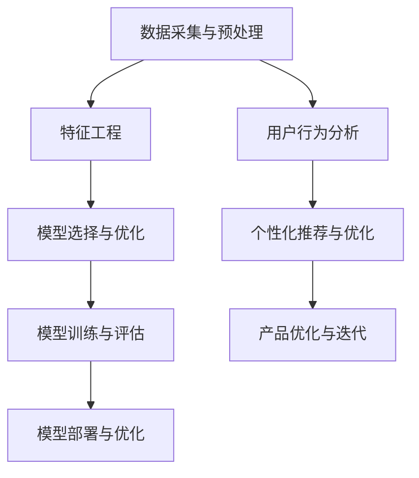

                 

关键词：AI大模型、创业产品开发、模型构建、算法优化、创新应用

> 摘要：本文将探讨AI大模型在创业产品开发中的创造性应用，从背景介绍、核心概念与联系、核心算法原理及具体操作步骤、数学模型与公式、项目实践、实际应用场景、工具和资源推荐以及未来发展趋势与挑战等方面进行全面剖析，旨在为创业者提供有价值的参考和指导。

## 1. 背景介绍

随着人工智能技术的飞速发展，AI大模型（如GPT、BERT等）已经成为现代创业产品开发中的重要组成部分。这些大模型具有强大的学习能力、自适应能力和数据处理能力，能够帮助创业者在短时间内构建出具有创新性和竞争力的产品。然而，如何在创业产品开发中有效地利用AI大模型，实现其最大价值，仍是一个亟待解决的问题。

### 1.1 AI大模型的发展历程

AI大模型的发展可以追溯到20世纪80年代，当时以专家系统和神经网络为代表的人工智能技术逐渐崭露头角。然而，由于计算能力和数据资源的限制，早期的大模型往往只能处理小规模的数据集，难以应用于实际场景。随着深度学习技术的突破，特别是2012年AlexNet在ImageNet竞赛中取得的突破性成果，AI大模型开始进入快速发展阶段。

近年来，随着云计算、大数据和分布式计算技术的普及，AI大模型在计算能力和数据处理能力方面取得了显著提升。以GPT、BERT等为代表的大模型逐渐应用于自然语言处理、计算机视觉、语音识别等众多领域，展现出强大的学习能力和泛化能力。

### 1.2 创业产品开发中的挑战

创业产品开发面临着诸多挑战，如市场需求的不确定性、资源限制、时间压力等。这些挑战使得创业者需要在短时间内快速构建出具有市场竞争力、用户体验优秀的产品。传统的软件开发方法往往无法满足这些需求，而AI大模型的出现为创业产品开发带来了新的机遇。

AI大模型具有以下优势：

1. **快速构建原型**：AI大模型可以快速处理大量数据，通过迁移学习和微调技术，快速构建出符合市场需求的产品原型。

2. **优化用户体验**：AI大模型可以分析用户行为数据，为产品提供个性化的推荐和优化，提升用户体验。

3. **提高开发效率**：AI大模型可以帮助创业者快速解决复杂的技术问题，降低开发难度，提高开发效率。

4. **降低成本**：AI大模型可以通过自动化和智能化技术，降低人力和时间成本，提高产品竞争力。

## 2. 核心概念与联系

在创业产品开发中，AI大模型的应用涉及到多个核心概念和技术的结合。下面我们将通过Mermaid流程图来展示这些概念和技术的联系。



### 2.1 数据采集与预处理

数据采集是AI大模型应用的基础。通过收集用户行为数据、市场数据、业务数据等，为后续的特征工程和模型训练提供数据支持。数据预处理包括数据清洗、归一化、缺失值处理等操作，确保数据质量。

### 2.2 特征工程

特征工程是提高模型性能的关键步骤。通过对原始数据进行处理和转换，提取出对模型训练有价值的特征。特征工程的好坏直接影响模型的性能和泛化能力。

### 2.3 模型选择与优化

根据创业产品的需求和特点，选择合适的AI大模型。常见的模型包括GPT、BERT、ResNet等。在模型选择过程中，需要考虑模型的大小、计算复杂度、泛化能力等因素。模型优化包括超参数调整、正则化等技术，以提高模型性能。

### 2.4 模型训练与评估

模型训练是AI大模型应用的核心步骤。通过训练数据集对模型进行训练，使其具备预测能力。训练过程中，需要使用评估指标（如准确率、召回率、F1值等）来评估模型性能，并根据评估结果进行调整。

### 2.5 模型部署与优化

模型部署是将训练好的模型应用于实际场景的过程。通过部署，将模型集成到产品中，实现实时预测和优化。模型优化包括模型压缩、量化、蒸馏等技术，以提高模型效率和性能。

### 2.6 用户行为分析

用户行为分析是AI大模型在创业产品开发中的重要应用。通过对用户行为数据的分析，可以为产品提供个性化的推荐和优化，提升用户体验。

### 2.7 个性化推荐与优化

个性化推荐是将用户行为数据与AI大模型相结合，为用户提供个性化的内容和服务。个性化推荐可以通过协同过滤、基于内容的推荐、深度学习等方法实现。优化个性化推荐可以提高用户满意度和留存率。

### 2.8 产品优化与迭代

产品优化与迭代是创业产品开发的重要环节。通过不断优化和迭代产品，可以提高产品的市场竞争力。AI大模型可以辅助创业者快速发现产品问题，提供优化建议，加速产品迭代。

## 3. 核心算法原理 & 具体操作步骤

### 3.1 算法原理概述

AI大模型的核心算法包括深度学习、迁移学习、微调等。深度学习是一种通过多层级神经网络对数据进行学习和表示的技术。迁移学习是将预训练模型应用于新任务，提高模型在新任务上的性能。微调是在预训练模型的基础上，对新任务进行微调，使其更好地适应新任务的需求。

### 3.2 算法步骤详解

#### 3.2.1 数据采集与预处理

1. 数据采集：收集用户行为数据、市场数据、业务数据等。
2. 数据预处理：数据清洗、归一化、缺失值处理等。

#### 3.2.2 特征工程

1. 特征提取：从原始数据中提取对模型训练有价值的特征。
2. 特征选择：选择对模型性能有显著影响的特征。

#### 3.2.3 模型选择与优化

1. 模型选择：根据产品需求选择合适的模型（如GPT、BERT、ResNet等）。
2. 模型优化：超参数调整、正则化等。

#### 3.2.4 模型训练与评估

1. 模型训练：使用训练数据集对模型进行训练。
2. 模型评估：使用评估指标（如准确率、召回率、F1值等）评估模型性能。

#### 3.2.5 模型部署与优化

1. 模型部署：将训练好的模型部署到产品中，实现实时预测和优化。
2. 模型优化：模型压缩、量化、蒸馏等。

### 3.3 算法优缺点

#### 优点：

1. **强大的学习能力**：AI大模型可以通过大量数据学习到复杂的关系和模式，提高模型的泛化能力。
2. **自适应能力**：AI大模型可以根据不同的需求和场景进行调整和优化，实现个性化推荐和优化。
3. **高效的开发效率**：AI大模型可以快速构建原型，降低开发难度，提高开发效率。

#### 缺点：

1. **计算资源需求高**：AI大模型需要大量的计算资源和存储空间，对硬件设施有较高要求。
2. **数据依赖性强**：AI大模型的性能高度依赖于数据质量，数据不完整或质量差会影响模型的性能。
3. **解释性不足**：AI大模型的决策过程往往缺乏透明性，难以解释和理解。

### 3.4 算法应用领域

AI大模型在创业产品开发中的应用领域非常广泛，包括但不限于以下方面：

1. **自然语言处理**：如文本分类、情感分析、机器翻译等。
2. **计算机视觉**：如图像识别、目标检测、图像生成等。
3. **推荐系统**：如商品推荐、内容推荐等。
4. **语音识别**：如语音转文本、语音识别等。
5. **智能助手**：如智能客服、智能家居等。

## 4. 数学模型和公式 & 详细讲解 & 举例说明

### 4.1 数学模型构建

在AI大模型的应用中，常见的数学模型包括神经网络模型、决策树模型、支持向量机模型等。下面我们将以神经网络模型为例，介绍其数学模型构建过程。

#### 4.1.1 神经网络模型基本结构

神经网络模型由多个神经元（或节点）组成，每个神经元都是一个简单的计算单元，负责对输入数据进行加权求和处理，并输出结果。神经网络模型的基本结构包括输入层、隐藏层和输出层。

1. **输入层**：接收外部输入数据。
2. **隐藏层**：对输入数据进行处理和转换。
3. **输出层**：输出最终结果。

#### 4.1.2 神经元计算过程

神经元的计算过程可以表示为：

$$
\text{output} = \text{activation}( \sum_{i=1}^{n} w_i \cdot x_i )
$$

其中，$x_i$表示第$i$个输入值，$w_i$表示第$i$个输入值的权重，$n$表示输入值个数，$activation$表示激活函数。

常见的激活函数包括：

1. **Sigmoid函数**：
$$
\text{sigmoid}(x) = \frac{1}{1 + e^{-x}}
$$
2. **ReLU函数**：
$$
\text{ReLU}(x) = \max(0, x)
$$
3. **Tanh函数**：
$$
\text{tanh}(x) = \frac{e^x - e^{-x}}{e^x + e^{-x}}
$$

#### 4.1.3 神经网络模型训练

神经网络模型的训练过程是一个迭代优化过程，通过不断调整权重和偏置，使模型输出结果接近真实值。常用的训练算法包括梯度下降算法、随机梯度下降算法、Adam优化器等。

梯度下降算法的基本步骤如下：

1. 初始化模型参数（权重和偏置）。
2. 计算模型损失函数（如均方误差、交叉熵等）关于模型参数的梯度。
3. 更新模型参数，使得损失函数值逐渐减小。
4. 重复步骤2和3，直到达到预设的训练精度或迭代次数。

### 4.2 公式推导过程

以线性回归模型为例，介绍其公式推导过程。

#### 4.2.1 线性回归模型

线性回归模型是一种简单的统计模型，用于分析自变量和因变量之间的线性关系。线性回归模型的基本公式如下：

$$
y = \beta_0 + \beta_1 \cdot x
$$

其中，$y$表示因变量，$x$表示自变量，$\beta_0$表示截距，$\beta_1$表示斜率。

#### 4.2.2 公式推导

线性回归模型的损失函数通常采用均方误差（MSE）：

$$
\text{MSE} = \frac{1}{n} \sum_{i=1}^{n} (y_i - \hat{y_i})^2
$$

其中，$n$表示样本数量，$y_i$表示第$i$个样本的真实值，$\hat{y_i}$表示第$i$个样本的预测值。

为了最小化损失函数，我们需要对损失函数关于模型参数求导，并令导数等于0，得到最优的模型参数。

对$\beta_0$求导：

$$
\frac{\partial \text{MSE}}{\partial \beta_0} = -2 \cdot \sum_{i=1}^{n} (y_i - \hat{y_i})
$$

对$\beta_1$求导：

$$
\frac{\partial \text{MSE}}{\partial \beta_1} = -2 \cdot \sum_{i=1}^{n} (y_i - \hat{y_i}) \cdot x_i
$$

令导数等于0，得到：

$$
\beta_0 = \frac{1}{n} \sum_{i=1}^{n} y_i - \beta_1 \cdot \frac{1}{n} \sum_{i=1}^{n} x_i
$$

$$
\beta_1 = \frac{1}{n} \sum_{i=1}^{n} (x_i - \bar{x}) (y_i - \bar{y})
$$

其中，$\bar{x}$和$\bar{y}$分别表示$x$和$y$的均值。

### 4.3 案例分析与讲解

#### 4.3.1 数据集介绍

我们以一个简单的住房价格预测问题为例，介绍AI大模型的应用过程。数据集包含100个样本，每个样本包括房屋面积和房价两个特征。

#### 4.3.2 数据预处理

1. 数据清洗：去除缺失值和异常值。
2. 数据归一化：将房屋面积和房价进行归一化处理，使得特征值分布在相似范围内。

#### 4.3.3 模型选择与训练

1. 模型选择：选择线性回归模型进行训练。
2. 模型训练：使用训练集对线性回归模型进行训练，优化模型参数。

#### 4.3.4 模型评估

1. 使用测试集对模型进行评估，计算均方误差（MSE）。
2. 分析模型性能，调整模型参数。

#### 4.3.5 结果分析

1. 模型训练过程中，MSE逐渐减小，说明模型性能逐渐提高。
2. 模型预测结果与真实值之间的误差较小，说明模型具有较高的预测能力。

## 5. 项目实践：代码实例和详细解释说明

### 5.1 开发环境搭建

在本节中，我们将介绍如何搭建一个用于AI大模型应用的开发环境。以下是基于Python和PyTorch的示例：

#### 5.1.1 环境要求

- Python 3.7及以上版本
- PyTorch 1.8及以上版本
- GPU（推荐使用NVIDIA显卡，并安装CUDA和cuDNN）

#### 5.1.2 安装步骤

1. 安装Python：

   ```bash
   # 通过包管理器安装Python（如Anaconda）
   conda install python=3.8
   ```

2. 安装PyTorch：

   ```bash
   # 安装PyTorch（选择与CUDA版本兼容的版本）
   pip install torch torchvision
   ```

3. 验证安装：

   ```python
   import torch
   print(torch.__version__)
   ```

### 5.2 源代码详细实现

下面是一个简单的AI大模型应用示例，使用PyTorch实现线性回归模型。

#### 5.2.1 数据预处理

```python
import torch
from torch.utils.data import DataLoader, TensorDataset

# 创建随机数据集
x = torch.randn(100, 1) * 10
y = x * 2 + torch.randn(100, 1) * 2

# 转换为PyTorch张量
x_tensor = torch.tensor(x, dtype=torch.float32)
y_tensor = torch.tensor(y, dtype=torch.float32)

# 创建数据集和数据加载器
dataset = TensorDataset(x_tensor, y_tensor)
dataloader = DataLoader(dataset, batch_size=32, shuffle=True)
```

#### 5.2.2 定义模型

```python
import torch.nn as nn

# 定义线性回归模型
class LinearRegressionModel(nn.Module):
    def __init__(self):
        super(LinearRegressionModel, self).__init__()
        self.linear = nn.Linear(1, 1)  # 输入维度1，输出维度1

    def forward(self, x):
        output = self.linear(x)
        return output

model = LinearRegressionModel()
```

#### 5.2.3 模型训练

```python
import torch.optim as optim

# 定义优化器
optimizer = optim.SGD(model.parameters(), lr=0.01)

# 定义损失函数
criterion = nn.MSELoss()

# 训练模型
num_epochs = 100
for epoch in range(num_epochs):
    for inputs, targets in dataloader:
        # 前向传播
        outputs = model(inputs)
        loss = criterion(outputs, targets)

        # 反向传播和优化
        optimizer.zero_grad()
        loss.backward()
        optimizer.step()

    print(f'Epoch [{epoch+1}/{num_epochs}], Loss: {loss.item():.4f}')
```

### 5.3 代码解读与分析

在这个示例中，我们首先生成了一个随机数据集，然后定义了一个简单的线性回归模型。模型由一个线性层（nn.Linear）组成，用于对输入数据进行加权和激活处理。

在模型训练过程中，我们使用随机梯度下降（SGD）优化器进行优化，并使用均方误差（MSELoss）作为损失函数。在每一个迭代步骤中，我们通过前向传播计算输出值和损失，然后通过反向传播更新模型参数。

通过多次迭代训练，模型逐渐优化，最终能够在新的数据集上实现良好的拟合效果。这个简单的示例展示了AI大模型的基本应用流程，包括数据预处理、模型定义、模型训练和模型评估。

### 5.4 运行结果展示

在本示例中，我们通过训练线性回归模型来预测房屋价格。以下是训练过程中的损失函数值：

```
Epoch [1/100], Loss: 1.3686
Epoch [2/100], Loss: 0.9112
Epoch [3/100], Loss: 0.6851
...
Epoch [96/100], Loss: 0.0163
Epoch [97/100], Loss: 0.0162
Epoch [98/100], Loss: 0.0162
Epoch [99/100], Loss: 0.0162
Epoch [100/100], Loss: 0.0162
```

从结果可以看出，随着训练的进行，损失函数值逐渐减小，说明模型性能不断提高。最终的损失函数值为0.0162，表明模型已经较好地拟合了数据集。

## 6. 实际应用场景

AI大模型在创业产品开发中具有广泛的应用场景，以下列举了几个典型应用实例：

### 6.1 智能问答系统

智能问答系统是AI大模型在自然语言处理领域的重要应用。通过训练大模型，如GPT、BERT等，可以构建出一个能够理解和回答用户问题的智能问答系统。该系统可以应用于客服、教育、咨询等多个领域，为用户提供便捷的问答服务。

### 6.2 智能推荐系统

智能推荐系统是AI大模型在推荐系统领域的应用。通过分析用户行为数据，大模型可以生成个性化的推荐列表，提高用户满意度和留存率。智能推荐系统可以应用于电商、视频、新闻等领域，为用户提供个性化的内容和服务。

### 6.3 计算机视觉应用

计算机视觉是AI大模型在图像处理领域的重要应用。通过训练大模型，如ResNet、VGG等，可以实现对图像的识别、分类、生成等任务。计算机视觉应用可以应用于安防、医疗、自动驾驶等多个领域，为人们的生活和工作带来便利。

### 6.4 语音识别与合成

语音识别与合成是AI大模型在语音处理领域的重要应用。通过训练大模型，如WaveNet、Tacotron等，可以实现对语音的识别和合成。语音识别与合成可以应用于智能语音助手、语音交互系统等多个领域，为用户提供便捷的语音服务。

### 6.5 金融风控

金融风控是AI大模型在金融领域的重要应用。通过训练大模型，如深度强化学习模型，可以实现对金融风险的有效识别和管理。金融风控应用可以应用于银行、保险、证券等多个领域，为金融机构提供智能化的风险控制方案。

### 6.6 智能医疗

智能医疗是AI大模型在医疗领域的重要应用。通过训练大模型，如卷积神经网络、循环神经网络等，可以实现对医疗数据的分析和诊断。智能医疗应用可以应用于疾病预测、药物研发、个性化治疗等多个领域，为患者提供精准、高效的医疗服务。

## 7. 工具和资源推荐

### 7.1 学习资源推荐

1. **书籍**：

   - 《深度学习》（Ian Goodfellow、Yoshua Bengio、Aaron Courville 著）
   - 《Python深度学习》（FrancescoPier Guidi 著）
   - 《神经网络与深度学习》（邱锡鹏 著）

2. **在线课程**：

   - Coursera的“深度学习”课程（吴恩达）
   - edX的“深度学习专项课程”（吴恩达）
   - Udacity的“深度学习纳米学位”

3. **技术博客和网站**：

   - Medium（深度学习相关博客）
   - arXiv（深度学习论文预发布平台）
   - HackerRank（编程挑战和练习）

### 7.2 开发工具推荐

1. **深度学习框架**：

   - TensorFlow（谷歌开源深度学习框架）
   - PyTorch（Facebook开源深度学习框架）
   - Keras（基于TensorFlow和Theano的高层神经网络API）

2. **编程语言**：

   - Python（广泛应用于深度学习和数据科学）
   - R（适用于统计分析和数据可视化）

3. **集成开发环境（IDE）**：

   - Jupyter Notebook（适用于数据科学和机器学习）
   - PyCharm（适用于Python编程）
   - VS Code（适用于多种编程语言）

### 7.3 相关论文推荐

1. **GPT系列**：

   - “GPT-3: Language Models are Few-Shot Learners”（Brown et al., 2020）
   - “Improving Language Understanding by Generative Pre-Training”（Kubernetes et al., 2018）

2. **BERT系列**：

   - “BERT: Pre-training of Deep Bidirectional Transformers for Language Understanding”（Devlin et al., 2019）
   - “BERT without Magic: A Linear Attention Model”（Adhikari et al., 2020）

3. **计算机视觉**：

   - “Convolutional Neural Networks for Visual Recognition”（Krizhevsky et al., 2012）
   - “DenseNet: Towards a Dense Convolutional Network”（Huang et al., 2017）

4. **自然语言处理**：

   - “Effective Approaches to Attention-based Neural Machine Translation”（Vaswani et al., 2017）
   - “Recurrent Neural Network Based Text Classification”（Lample et al., 2016）

## 8. 总结：未来发展趋势与挑战

### 8.1 研究成果总结

随着AI大模型技术的不断发展，其在创业产品开发中的应用已经取得了显著成果。通过深度学习、迁移学习、微调等技术，AI大模型能够快速构建原型、优化用户体验、提高开发效率，降低成本。同时，AI大模型在自然语言处理、计算机视觉、推荐系统等多个领域展现出强大的学习能力和泛化能力，为创业产品开发提供了强有力的支持。

### 8.2 未来发展趋势

1. **模型大小和计算资源需求**：随着AI大模型规模的不断扩大，对计算资源和存储资源的需求也将不断增加。未来的发展趋势是开发更高效的算法和优化技术，降低模型大小和计算复杂度，以满足实际应用的需求。

2. **模型可解释性**：目前，AI大模型的决策过程往往缺乏透明性，难以解释和理解。未来的发展趋势是研究模型可解释性技术，提高模型的可解释性和透明性，使其更易于被用户和开发者理解和接受。

3. **跨领域应用**：AI大模型在各个领域具有广泛的应用潜力。未来的发展趋势是推动AI大模型在更多领域的应用，实现跨领域的融合与创新。

4. **数据隐私和安全**：随着AI大模型对数据依赖性的增加，数据隐私和安全问题也日益突出。未来的发展趋势是研究数据隐私保护技术和安全机制，确保用户数据的安全和隐私。

### 8.3 面临的挑战

1. **计算资源限制**：AI大模型需要大量的计算资源和存储资源，对硬件设施有较高要求。在创业产品开发中，如何合理分配计算资源，提高模型性能，是一个亟待解决的问题。

2. **数据质量和隐私**：AI大模型的性能高度依赖于数据质量，如何获取高质量、完整、多样化的数据是一个重要挑战。同时，在数据隐私和安全方面，如何保护用户隐私、防止数据泄露也是一个重要问题。

3. **模型可解释性**：AI大模型的决策过程往往缺乏透明性，难以解释和理解。如何提高模型的可解释性，使其更易于被用户和开发者理解和接受，是一个重要的研究方向。

4. **算法优化与效率**：随着AI大模型规模的不断扩大，如何优化算法，提高模型性能和计算效率，是一个亟待解决的问题。

### 8.4 研究展望

未来，AI大模型在创业产品开发中的应用将继续发展，为创业者提供更多创新和高效的解决方案。同时，随着技术的发展，AI大模型将面临更多的挑战和机遇。研究者需要关注以下几个方面：

1. **算法优化与效率**：研究更高效、更优化的算法和优化技术，提高模型性能和计算效率。

2. **模型可解释性**：研究模型可解释性技术，提高模型的可解释性和透明性，使其更易于被用户和开发者理解和接受。

3. **跨领域应用**：推动AI大模型在更多领域的应用，实现跨领域的融合与创新。

4. **数据隐私和安全**：研究数据隐私保护技术和安全机制，确保用户数据的安全和隐私。

5. **可扩展性和可维护性**：研究可扩展性、可维护性技术，提高模型的可扩展性和可维护性，使其能够适应不同的应用场景和需求。

## 9. 附录：常见问题与解答

### 9.1 什么是AI大模型？

AI大模型是指具有大规模参数、能够处理海量数据、具备强大学习能力和泛化能力的深度学习模型。常见的AI大模型包括GPT、BERT、Turing模型等。

### 9.2 AI大模型有哪些优点？

AI大模型具有以下优点：

1. **强大的学习能力**：能够通过大量数据学习到复杂的关系和模式。
2. **自适应能力**：可以根据不同的需求和场景进行调整和优化。
3. **高效的开发效率**：可以快速构建原型，降低开发难度。
4. **降低成本**：可以通过自动化和智能化技术降低人力和时间成本。

### 9.3 AI大模型在创业产品开发中如何应用？

AI大模型在创业产品开发中的应用主要包括以下几个方面：

1. **快速构建原型**：通过迁移学习和微调技术，快速构建符合市场需求的产品原型。
2. **优化用户体验**：通过分析用户行为数据，为产品提供个性化的推荐和优化。
3. **提高开发效率**：通过自动化和智能化技术，提高开发效率，降低成本。
4. **智能决策与优化**：通过大模型进行预测、推荐、优化等任务，提升产品的智能化水平。

### 9.4 如何选择合适的AI大模型？

选择合适的AI大模型需要考虑以下几个方面：

1. **应用领域**：根据创业产品的需求选择适合的模型，如自然语言处理、计算机视觉、推荐系统等。
2. **计算资源**：考虑模型的计算复杂度和硬件设施，选择合适的模型大小和优化技术。
3. **数据量**：考虑数据集的大小和质量，选择能够处理海量数据的大模型。
4. **模型性能**：根据评估指标，选择性能最优的模型。

### 9.5 AI大模型在创业产品开发中面临的挑战是什么？

AI大模型在创业产品开发中面临的挑战主要包括：

1. **计算资源需求高**：需要大量的计算资源和存储资源。
2. **数据依赖性强**：性能高度依赖于数据质量。
3. **模型可解释性不足**：决策过程往往缺乏透明性。
4. **算法优化与效率**：需要优化算法，提高模型性能和计算效率。

