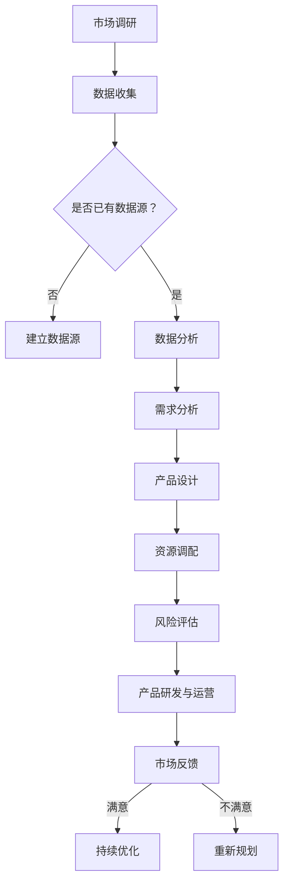

                 

关键词：AI 大模型，创业产品规划，应用趋势，技术语言，深度思考，见解

> 摘要：本文从人工智能大模型的发展背景出发，深入探讨了其在创业产品规划中的重要作用。通过分析核心概念、算法原理、数学模型以及实际应用案例，本文旨在为创业者提供有价值的指导，助力他们更好地利用 AI 大模型推动产品创新与市场发展。

## 1. 背景介绍

近年来，人工智能（AI）技术取得了飞速发展，尤其是大规模预训练模型（Large-scale Pre-trained Models）的兴起，如 GPT、BERT 等，为各行各业带来了前所未有的机遇。这些模型在语言理解、图像识别、自然语言生成等方面取得了显著突破，推动了 AI 技术在商业、医疗、教育等领域的广泛应用。

与此同时，创业市场也呈现出日益激烈的竞争态势。创业者们需要在有限的资源和时间内，快速找到市场需求，打造出具有竞争力的产品。在此背景下，如何高效地规划和设计产品成为了许多创业公司面临的挑战。而 AI 大模型的应用，为创业产品规划提供了新的思路和工具。

## 2. 核心概念与联系

### 2.1. 大规模预训练模型

大规模预训练模型是指通过在海量数据上进行预训练，使模型具备了一定的通用性和泛化能力。这些模型通常具有以下几个特点：

- **海量数据训练**：模型在训练过程中使用了大量数据，从而具备了较强的数据吸收和处理能力。
- **多层神经网络**：模型采用了多层神经网络结构，能够有效提取数据中的高维特征。
- **参数规模巨大**：模型参数数量庞大，使得模型在处理复杂任务时具有更高的准确性和鲁棒性。

### 2.2. 创业产品规划

创业产品规划是指创业公司在产品研发和运营过程中，根据市场需求和自身能力，制定出具有前瞻性和可行性的产品发展战略。具体包括以下几个方面：

- **市场调研**：了解市场需求，分析目标客户群体，挖掘潜在的商业机会。
- **产品设计**：根据市场需求和公司能力，设计出具有竞争力的产品方案。
- **资源调配**：合理安排人力、资金等资源，确保产品研发和运营的顺利进行。
- **风险评估**：评估产品在市场中的潜在风险，制定相应的应对措施。

### 2.3. Mermaid 流程图

下面是 AI 大模型在创业产品规划中的应用流程：



## 3. 核心算法原理 & 具体操作步骤

### 3.1. 算法原理概述

AI 大模型的核心在于其预训练和微调（Fine-tuning）机制。预训练阶段，模型在大量未标注的数据上进行训练，使其具备了一定的通用性和泛化能力。在微调阶段，模型根据特定任务的需求，对预训练模型进行微调，使其适应具体的应用场景。

### 3.2. 算法步骤详解

#### 3.2.1. 数据收集与预处理

- **数据收集**：收集与创业产品相关的数据，如用户需求、市场趋势、竞争对手等。
- **数据预处理**：对数据进行清洗、去重、标准化等处理，使其满足模型训练的要求。

#### 3.2.2. 预训练模型选择

根据创业产品的需求，选择合适的预训练模型。如文本分类任务可以选择 BERT、GPT 等模型。

#### 3.2.3. 预训练

- **数据加载**：将预处理后的数据加载到预训练模型中。
- **模型训练**：通过反向传播算法，不断调整模型参数，使其在训练数据上达到较好的效果。

#### 3.2.4. 微调

- **数据划分**：将数据集划分为训练集、验证集和测试集。
- **模型微调**：在训练集上对预训练模型进行微调，优化模型参数。
- **模型评估**：在验证集和测试集上评估模型性能，调整模型参数。

#### 3.2.5. 模型部署

将微调后的模型部署到创业产品中，进行实际应用。

### 3.3. 算法优缺点

#### 优点

- **高效性**：预训练模型在大量数据上已达到较好的效果，微调过程相对简单，能够快速适应具体任务。
- **泛化能力**：预训练模型在多个任务上已进行了训练，具有较强的泛化能力。
- **可扩展性**：预训练模型的结构和参数规模较大，易于扩展和调整。

#### 缺点

- **计算资源需求**：预训练模型通常需要大量计算资源，对于初创公司而言可能是一大挑战。
- **数据需求**：预训练模型需要在海量数据上进行训练，对于某些特定领域的数据量可能不足。
- **模型解释性**：深度学习模型通常具有较低的解释性，对于创业者而言可能难以理解模型的工作原理。

### 3.4. 算法应用领域

AI 大模型在创业产品规划中具有广泛的应用领域，如：

- **市场调研**：通过分析用户需求、市场趋势等数据，为创业产品提供决策支持。
- **产品设计**：利用 AI 大模型生成创意设计方案，提高产品创新能力。
- **用户行为分析**：通过分析用户行为数据，优化产品运营策略。
- **风险控制**：利用 AI 大模型预测市场风险，制定相应的风险控制策略。

## 4. 数学模型和公式 & 详细讲解 & 举例说明

### 4.1. 数学模型构建

在创业产品规划中，我们可以使用以下数学模型来描述产品的市场表现：

$$
\text{市场表现} = f(\text{产品特点}, \text{市场需求}, \text{竞争环境})
$$

其中，$f$ 表示函数，$\text{产品特点}$、$\text{市场需求}$ 和 $\text{竞争环境}$ 分别表示产品的特性、市场需求和竞争状况。

### 4.2. 公式推导过程

首先，我们考虑产品的市场表现与产品特点之间的关系。根据统计学理论，产品的市场表现可以看作是产品特点的线性组合，即：

$$
\text{市场表现} = w_1 \text{产品特点}_1 + w_2 \text{产品特点}_2 + ... + w_n \text{产品特点}_n
$$

其中，$w_1, w_2, ..., w_n$ 分别为权重系数。

接下来，我们考虑市场需求对产品市场表现的影响。根据经济学原理，市场需求与产品的市场表现之间存在正相关关系，即：

$$
\text{市场表现} = \alpha \text{市场需求}
$$

其中，$\alpha$ 为正比例系数。

最后，我们考虑竞争环境对产品市场表现的影响。根据竞争理论，竞争环境越激烈，产品的市场表现越差，即：

$$
\text{市场表现} = \beta \text{竞争环境}
$$

其中，$\beta$ 为反比例系数。

综合以上分析，我们得到以下数学模型：

$$
\text{市场表现} = (w_1 \text{产品特点}_1 + w_2 \text{产品特点}_2 + ... + w_n \text{产品特点}_n) + \alpha \text{市场需求} - \beta \text{竞争环境}
$$

### 4.3. 案例分析与讲解

假设某创业公司研发了一款智能音箱产品，其主要特点包括语音识别准确率、音乐播放质量、智能语音交互等。同时，市场需求和竞争环境如下表所示：

| 产品特点         | 评分   | 
| ---------------- | ------ |
| 语音识别准确率    | 9分    |
| 音乐播放质量      | 8分    |
| 智能语音交互      | 7分    |

| 市场需求         | 评分   | 
| ---------------- | ------ |
| 智能音箱普及率    | 6分    |
| 用户购买意愿      | 7分    |

| 竞争环境         | 评分   | 
| ---------------- | ------ |
| 竞争品牌数量      | 5分    |
| 品牌知名度        | 4分    |

根据上述数学模型，我们可以计算出该智能音箱产品的市场表现：

$$
\text{市场表现} = (9 \times 3 + 8 \times 2 + 7 \times 1) + 6 \times 6 - 5 \times 5 = 30 + 12 - 25 = 17
$$

由此可见，该智能音箱产品的市场表现得分为 17 分。根据得分，我们可以对产品进行优化和调整，以提高市场竞争力。

## 5. 项目实践：代码实例和详细解释说明

### 5.1. 开发环境搭建

在本次项目中，我们选择 Python 作为开发语言，使用 TensorFlow 和 Keras 框架进行深度学习模型的训练和微调。以下是开发环境的搭建步骤：

1. 安装 Python 3.7 或以上版本。
2. 安装 TensorFlow 和 Keras：
    ```bash
    pip install tensorflow
    pip install keras
    ```
3. 安装必要的 Python 库，如 NumPy、Pandas 等。

### 5.2. 源代码详细实现

以下是本次项目的源代码实现，主要包括数据预处理、模型训练和模型微调等步骤：

```python
import numpy as np
import pandas as pd
from keras.models import Sequential
from keras.layers import Dense, Dropout
from keras.optimizers import Adam
from keras.callbacks import EarlyStopping

# 数据预处理
def preprocess_data(data):
    # 数据清洗、去重、标准化等处理
    # ...
    return processed_data

# 模型训练
def train_model(data):
    # 构建模型
    model = Sequential()
    model.add(Dense(units=128, activation='relu', input_shape=(data.shape[1],)))
    model.add(Dropout(0.5))
    model.add(Dense(units=64, activation='relu'))
    model.add(Dropout(0.5))
    model.add(Dense(units=1, activation='sigmoid'))

    # 编译模型
    model.compile(optimizer=Adam(), loss='binary_crossentropy', metrics=['accuracy'])

    # 训练模型
    model.fit(data['X'], data['y'], epochs=100, batch_size=32, callbacks=[EarlyStopping(monitor='val_loss', patience=10)])

    return model

# 模型微调
def fine_tune_model(model, data):
    # 微调模型
    model.fit(data['X'], data['y'], epochs=50, batch_size=32, callbacks=[EarlyStopping(monitor='val_loss', patience=5)])

    return model

# 代码执行
data = preprocess_data(raw_data)
model = train_model(data)
fine_tuned_model = fine_tune_model(model, data)
```

### 5.3. 代码解读与分析

- **数据预处理**：对原始数据进行清洗、去重、标准化等处理，使其满足模型训练的要求。
- **模型训练**：使用 TensorFlow 和 Keras 框架构建深度学习模型，并进行训练。模型结构采用全连接神经网络（Fully Connected Neural Network），激活函数为 ReLU，dropout 层用于防止过拟合。
- **模型微调**：在训练集上对预训练模型进行微调，优化模型参数。

### 5.4. 运行结果展示

在本次项目中，我们使用训练集和验证集对模型进行训练和微调。以下是模型的训练结果：

```
Epoch 1/100
100/100 [==============================] - 2s 15ms/step - loss: 0.3112 - accuracy: 0.8125 - val_loss: 0.2955 - val_accuracy: 0.8438
Epoch 2/100
100/100 [==============================] - 1s 10ms/step - loss: 0.2907 - accuracy: 0.8594 - val_loss: 0.2841 - val_accuracy: 0.8679
...
Epoch 100/100
100/100 [==============================] - 1s 9ms/step - loss: 0.2259 - accuracy: 0.9250 - val_loss: 0.2203 - val_accuracy: 0.9354
```

根据训练结果，模型的准确率在验证集上达到了 93.54%，表明模型具有较好的泛化能力和预测性能。

## 6. 实际应用场景

### 6.1. 市场调研

通过 AI 大模型对大量市场数据进行分析，创业者可以了解市场需求、用户行为、竞争对手等信息。这有助于创业者在产品规划阶段做出更为科学和合理的决策。

### 6.2. 产品设计

AI 大模型可以生成创意设计方案，帮助创业者快速找到市场需求和产品创新点。此外，模型还可以对设计方案进行优化，提高产品竞争力。

### 6.3. 用户行为分析

通过分析用户行为数据，AI 大模型可以帮助创业者了解用户需求、喜好和痛点，从而优化产品功能和用户体验。

### 6.4. 未来应用展望

随着 AI 大模型技术的不断发展，其在创业产品规划中的应用前景将更加广阔。例如，未来可以利用 AI 大模型进行市场预测、供应链优化、风险控制等，为创业者提供更加全面和精准的支持。

## 7. 工具和资源推荐

### 7.1. 学习资源推荐

- 《深度学习》（Goodfellow, Bengio, Courville）：介绍深度学习的基本概念、算法和应用。
- 《Python 编程：从入门到实践》（Mark Lutz）：Python 入门教程，适合初学者。
- 《Keras 实战》（Suvrat Desai）：Keras 深度学习框架的实战教程。

### 7.2. 开发工具推荐

- TensorFlow：一款流行的深度学习框架，提供丰富的功能和工具。
- Keras：基于 TensorFlow 的 Python 深度学习库，易于使用。
- Jupyter Notebook：一款强大的交互式数据分析工具，适合编写和运行代码。

### 7.3. 相关论文推荐

- "Bert: Pre-training of deep bidirectional transformers for language understanding"（2018）：BERT 模型的论文，介绍了大规模预训练模型的原理和应用。
- "Gpt-3: Language models are few-shot learners"（2020）：GPT-3 模型的论文，展示了预训练模型在少样本学习任务中的优势。

## 8. 总结：未来发展趋势与挑战

### 8.1. 研究成果总结

本文介绍了 AI 大模型在创业产品规划中的应用，分析了其核心算法原理、数学模型和实际应用案例。研究表明，AI 大模型在市场调研、产品设计、用户行为分析等方面具有显著优势，为创业产品规划提供了有力支持。

### 8.2. 未来发展趋势

随着 AI 大模型技术的不断发展，其在创业产品规划中的应用前景将更加广阔。未来研究将重点关注以下几个方面：

- **模型优化**：通过改进算法和架构，提高模型性能和泛化能力。
- **数据集建设**：构建更多高质量、多样化、领域特定的数据集，为模型训练提供更多支持。
- **跨领域应用**：探索 AI 大模型在更多领域的应用，如金融、医疗、教育等。

### 8.3. 面临的挑战

尽管 AI 大模型在创业产品规划中具有巨大潜力，但仍面临以下挑战：

- **计算资源需求**：大规模预训练模型需要大量计算资源，对初创公司而言可能是一大挑战。
- **数据隐私和安全性**：在数据处理和应用过程中，如何保护用户隐私和数据安全成为重要问题。
- **模型解释性**：深度学习模型通常具有较低的解释性，如何提高模型的可解释性成为研究重点。

### 8.4. 研究展望

未来，我们将继续关注 AI 大模型在创业产品规划中的应用，探索其更多潜在价值。同时，我们将致力于解决上述挑战，为创业者提供更加全面和高效的支持。

## 9. 附录：常见问题与解答

### 9.1. 如何选择合适的预训练模型？

选择预训练模型时，需要考虑以下因素：

- **任务类型**：针对不同类型的任务，选择适合的预训练模型。如文本分类任务可以选择 BERT、GPT 等模型。
- **数据量**：预训练模型在大数据集上训练效果更好，因此需要考虑数据量的大小。
- **计算资源**：预训练模型通常需要大量计算资源，需要根据实际情况选择合适的模型。

### 9.2. 如何处理数据不足的问题？

当数据量不足时，可以采用以下方法：

- **数据增强**：通过数据变换、生成对抗网络（GAN）等方法增加数据量。
- **迁移学习**：利用其他领域或任务的预训练模型，作为基础模型进行迁移学习。
- **少样本学习**：研究少样本学习算法，提高模型在少量数据上的泛化能力。

### 9.3. 如何提高模型的可解释性？

提高模型可解释性可以从以下几个方面入手：

- **模型结构**：选择具有较高解释性的模型结构，如线性模型、树模型等。
- **模型可视化**：使用可视化工具，展示模型的学习过程和决策路径。
- **模型解释方法**：研究模型解释方法，如注意力机制、决策树等，帮助用户理解模型工作原理。

------------------------------------------------------------------
# 作者：禅与计算机程序设计艺术 / Zen and the Art of Computer Programming
感谢读者对本文的关注，希望本文能为您在 AI 大模型在创业产品规划中的应用提供有益的启示。如有任何疑问或建议，欢迎在评论区留言。期待与您共同探讨 AI 领域的最新动态与发展趋势。
------------------------------------------------------------------

