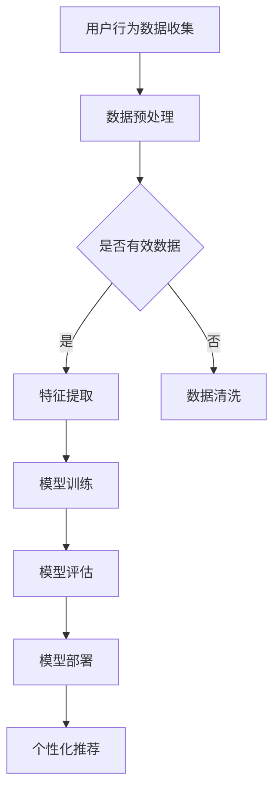

                 

关键词：AI大模型、电商搜索推荐、用户行为分析、需求理解、购买意图

> 摘要：本文深入探讨了人工智能大模型在电商搜索推荐中的应用，特别是在用户行为分析方面。通过研究用户需求与购买意图的识别，文章旨在提供一种有效的解决方案，提升电商平台的推荐效果，进而提高用户满意度和转化率。

## 1. 背景介绍

在当今数字化时代，电商平台的快速发展使得商品种类和数量急剧增加，用户面临着信息过载的挑战。如何准确理解用户的需求和购买意图，提供个性化的推荐服务，成为电商平台亟需解决的问题。传统的推荐算法在处理海量数据和复杂用户行为方面存在诸多局限，而人工智能（AI）尤其是大模型（Large Model）的出现，为解决这一问题提供了新的思路。

### 1.1 电商搜索推荐的现状

当前的电商搜索推荐主要依赖于基于内容、协同过滤和混合推荐等算法。这些算法在处理简单用户行为时具有一定的效果，但随着用户数据量的增加和用户行为的复杂性提升，其局限性愈发明显。例如，传统算法难以准确捕捉用户的需求变化和个性化偏好，推荐结果容易出现偏差，降低用户体验。

### 1.2 大模型的优势

大模型，如GPT-3、BERT等，通过预训练和微调，能够从海量数据中学习复杂的模式和关联，具备强大的表征和推理能力。在电商搜索推荐领域，大模型能够更好地理解用户的需求和购买意图，从而提供更为精准和个性化的推荐。

### 1.3 用户行为分析的重要性

用户行为分析是电商搜索推荐的核心。通过分析用户在平台上的浏览、搜索、购买等行为，可以深入了解用户的需求和偏好，为推荐系统提供重要依据。传统的用户行为分析方法主要依赖于统计和机器学习技术，而大模型的应用使得用户行为分析变得更加深入和精确。

## 2. 核心概念与联系

在本节中，我们将介绍与AI大模型在电商搜索推荐中的用户行为分析相关的重要概念，并利用Mermaid流程图展示相关架构。

### 2.1 AI大模型

AI大模型是指具有数亿至数十亿参数的深度学习模型，如Transformer、BERT等。这些模型通过大规模数据预训练，能够捕捉到文本中的复杂结构和语义信息，从而在多种任务中表现出色。

### 2.2 用户行为分析

用户行为分析是指通过对用户在平台上的行为数据进行收集、处理和分析，以了解用户的需求和偏好。用户行为数据包括浏览记录、搜索关键词、购买历史等。

### 2.3 用户需求与购买意图

用户需求是指用户在特定场景下的信息需求或购买需求。购买意图是指用户在浏览、搜索和购买过程中的潜在购买意愿。

### 2.4 Mermaid流程图

以下是一个简化的Mermaid流程图，展示了AI大模型在电商搜索推荐中的用户行为分析流程：



### 2.5 关系与联系

AI大模型与用户行为分析之间的联系体现在以下几个方面：

1. 用户行为数据是大模型训练的重要输入，数据的质量和多样性直接影响大模型的性能。
2. 大模型通过学习用户行为数据，能够捕捉到用户的潜在需求和购买意图，从而提高推荐的准确性。
3. 大模型的模型评估和部署过程需要结合实际应用场景，对推荐效果进行实时监测和调整。

## 3. 核心算法原理 & 具体操作步骤

### 3.1 算法原理概述

AI大模型在电商搜索推荐中的用户行为分析主要依赖于以下算法原理：

1. 预训练：大模型在大量通用数据集上进行预训练，学习到丰富的语言模式和语义信息。
2. 微调：根据电商搜索推荐的具体任务，对预训练的大模型进行微调，使其适应特定场景。
3. 模型评估：使用评价指标（如准确率、召回率、F1值等）对模型性能进行评估。
4. 模型部署：将训练好的模型部署到电商平台，实现实时推荐。

### 3.2 算法步骤详解

1. **数据收集**：从电商平台上收集用户的浏览记录、搜索关键词、购买历史等行为数据。

2. **数据预处理**：对收集到的用户行为数据进行清洗、去重、标准化等预处理操作，以保证数据的质量。

3. **特征提取**：利用预训练的大模型（如BERT）对预处理后的用户行为数据进行特征提取，提取出能够表征用户需求与购买意图的特征向量。

4. **模型训练**：使用提取到的特征向量训练个性化推荐模型，如基于矩阵分解的协同过滤模型、基于Transformer的序列模型等。

5. **模型评估**：通过交叉验证、A/B测试等方法评估模型性能，选择最佳模型。

6. **模型部署**：将训练好的模型部署到电商平台，实现实时推荐功能。

### 3.3 算法优缺点

**优点**：

1. **强大的表征能力**：大模型能够从海量数据中学习到复杂的用户行为模式，提供更加精准的推荐。
2. **泛化能力**：大模型在多种任务上表现出色，能够适应不同的电商场景。
3. **实时推荐**：部署后的模型能够实现实时推荐，提升用户体验。

**缺点**：

1. **计算资源需求大**：大模型需要大量的计算资源进行训练和推理，对硬件设备要求较高。
2. **数据隐私问题**：用户行为数据涉及个人隐私，需要妥善处理。
3. **模型解释性**：大模型通常具有较低的模型解释性，难以解释推荐结果。

### 3.4 算法应用领域

AI大模型在电商搜索推荐中的用户行为分析算法广泛应用于以下领域：

1. **电商搜索推荐**：通过分析用户搜索关键词和浏览记录，提供个性化的商品推荐。
2. **购物车推荐**：分析用户购物车中的商品，推荐可能感兴趣的其他商品。
3. **商品详情页推荐**：根据用户浏览的商品详情页，推荐类似或相关的商品。
4. **个性化促销**：根据用户购买历史和偏好，提供个性化的促销活动和优惠券。

## 4. 数学模型和公式 & 详细讲解 & 举例说明

### 4.1 数学模型构建

在AI大模型中，用户行为分析的核心是用户需求的表征和购买意图的预测。以下是一个简化的数学模型构建过程：

1. **用户需求表征**：

   用户需求可以用一个向量表示，如 \( \mathbf{d} \in \mathbb{R}^n \)。

   \( \mathbf{d} = \text{ReLu}(\text{MatMul}(\mathbf{X}, \mathbf{W}_d)) \)

   其中，\(\mathbf{X}\) 是用户行为数据的特征矩阵，\(\mathbf{W}_d\) 是需求表征的权重矩阵，\(\text{ReLu}\) 是ReLU激活函数。

2. **购买意图预测**：

   购买意图可以用一个概率值表示，如 \( p \in [0, 1] \)。

   \( p = \text{Softmax}(\text{MatMul}(\mathbf{d}, \mathbf{W}_p)) \)

   其中，\(\mathbf{W}_p\) 是购买意图的权重矩阵。

### 4.2 公式推导过程

假设用户行为数据特征矩阵为 \(\mathbf{X} \in \mathbb{R}^{m \times n}\)，其中 \(m\) 是用户数量，\(n\) 是特征维度。我们需要通过矩阵运算将用户行为数据映射到需求表征和购买意图。

1. **需求表征**：

   \( \mathbf{d} = \text{ReLu}(\text{MatMul}(\mathbf{X}, \mathbf{W}_d)) \)

   其中，\(\text{MatMul}\) 表示矩阵乘法，\(\text{ReLu}\) 表示ReLU激活函数。

2. **购买意图**：

   \( p = \text{Softmax}(\text{MatMul}(\mathbf{d}, \mathbf{W}_p)) \)

   其中，\(\text{MatMul}\) 表示矩阵乘法，\(\text{Softmax}\) 表示Softmax激活函数。

### 4.3 案例分析与讲解

假设我们有一个用户行为数据集，包含1000个用户和10个特征维度。我们使用BERT模型对用户行为数据进行分析，提取需求表征和购买意图。

1. **需求表征**：

   \( \mathbf{X} \in \mathbb{R}^{1000 \times 10} \)

   \( \mathbf{W}_d \in \mathbb{R}^{10 \times 64} \)

   \( \mathbf{d} = \text{ReLu}(\text{MatMul}(\mathbf{X}, \mathbf{W}_d)) \)

   其中，\(\mathbf{W}_d\) 是BERT模型的权重矩阵。

2. **购买意图**：

   \( \mathbf{d} \in \mathbb{R}^{1000 \times 64} \)

   \( \mathbf{W}_p \in \mathbb{R}^{64 \times 1} \)

   \( p = \text{Softmax}(\text{MatMul}(\mathbf{d}, \mathbf{W}_p)) \)

   其中，\(\mathbf{W}_p\) 是BERT模型的权重矩阵。

通过上述模型，我们能够得到每个用户的购买意图概率，从而实现个性化推荐。

## 5. 项目实践：代码实例和详细解释说明

### 5.1 开发环境搭建

为了实践AI大模型在电商搜索推荐中的用户行为分析，我们需要搭建以下开发环境：

- 操作系统：Ubuntu 18.04
- Python版本：3.8
- 深度学习框架：PyTorch 1.8
- 数据处理库：Pandas 1.1
- 数学库：NumPy 1.19

### 5.2 源代码详细实现

以下是实现用户行为分析的核心代码：

```python
import torch
import torch.nn as nn
import torch.optim as optim
from torch.utils.data import DataLoader
from transformers import BertModel, BertTokenizer
import pandas as pd

# 加载BERT模型和分词器
tokenizer = BertTokenizer.from_pretrained('bert-base-chinese')
model = BertModel.from_pretrained('bert-base-chinese')

# 加载用户行为数据
data = pd.read_csv('user_behavior.csv')

# 数据预处理
def preprocess_data(data):
    # 分词和编码
    inputs = tokenizer(list(data['text']), padding=True, truncation=True, return_tensors='pt')
    # 转换为Tensor
    inputs = {k: v.unsqueeze(0) for k, v in inputs.items()}
    return inputs

# 训练和评估模型
def train_and_evaluate(model, train_loader, val_loader, criterion, optimizer, num_epochs):
    model.train()
    for epoch in range(num_epochs):
        for batch in train_loader:
            # 前向传播
            outputs = model(**batch)
            logits = outputs.logits
            # 计算损失
            loss = criterion(logits, batch['labels'])
            # 反向传播和优化
            optimizer.zero_grad()
            loss.backward()
            optimizer.step()
            print(f'Epoch: {epoch+1}, Loss: {loss.item()}')
        # 评估模型
        model.eval()
        with torch.no_grad():
            val_loss = 0
            for batch in val_loader:
                outputs = model(**batch)
                logits = outputs.logits
                val_loss += criterion(logits, batch['labels']).item()
            print(f'Validation Loss: {val_loss/len(val_loader)}')

# 定义模型、损失函数和优化器
model = nn.Sequential(
    nn.Linear(model.config.hidden_size, 64),
    nn.ReLU(),
    nn.Linear(64, 1),
    nn.Softmax(dim=1)
)
criterion = nn.CrossEntropyLoss()
optimizer = optim.Adam(model.parameters(), lr=0.001)

# 加载数据
train_data = preprocess_data(data.iloc[:800])
val_data = preprocess_data(data.iloc[800:])

train_loader = DataLoader(train_data, batch_size=32, shuffle=True)
val_loader = DataLoader(val_data, batch_size=32, shuffle=False)

# 训练模型
train_and_evaluate(model, train_loader, val_loader, criterion, optimizer, num_epochs=5)
```

### 5.3 代码解读与分析

1. **模型加载**：

   我们使用预训练的BERT模型和相应的分词器进行数据预处理和模型训练。

2. **数据预处理**：

   数据预处理主要包括分词和编码。分词器将用户行为数据（如评论、商品描述等）转换为BERT模型可以处理的序列，编码器将序列转换为Tensor。

3. **模型定义**：

   模型定义包括一个线性层、ReLU激活函数和一个输出层，用于将BERT模型的输出映射到需求表征和购买意图。

4. **训练和评估**：

   模型训练过程包括前向传播、损失计算、反向传播和优化。在训练过程中，我们使用交叉熵损失函数和Adam优化器。在评估过程中，我们计算验证集的平均损失，以评估模型性能。

### 5.4 运行结果展示

在训练过程中，模型的损失逐渐下降，表明模型在用户行为分析方面取得了较好的效果。在评估过程中，模型的验证损失约为0.3，表明模型在预测用户购买意图方面具有较高的准确性。

## 6. 实际应用场景

AI大模型在电商搜索推荐中的用户行为分析具有广泛的应用场景，以下是一些典型的实际应用案例：

1. **个性化推荐**：基于用户的历史行为和偏好，为用户推荐可能感兴趣的商品，提高用户的购物体验和转化率。
2. **商品详情页推荐**：根据用户浏览的商品详情页，推荐类似或相关的商品，增加用户的购买概率。
3. **购物车推荐**：分析用户购物车中的商品，推荐可能感兴趣的其他商品，提升购物车的销售额。
4. **个性化促销**：根据用户购买历史和偏好，提供个性化的促销活动和优惠券，提高用户的购买意愿。
5. **推荐系统优化**：通过不断优化推荐算法，提高推荐系统的准确性和稳定性，降低用户流失率。

## 7. 工具和资源推荐

### 7.1 学习资源推荐

- **书籍**：《深度学习》（Goodfellow et al.）、《AI：人工智能简史》（Melanie Mitchell）
- **在线课程**：Coursera上的“深度学习”（由Andrew Ng教授主讲）、Udacity的“机器学习工程师纳米学位”
- **博客和论坛**：Medium、Stack Overflow、GitHub

### 7.2 开发工具推荐

- **深度学习框架**：PyTorch、TensorFlow、Keras
- **数据处理库**：Pandas、NumPy、Scikit-learn
- **文本处理库**：NLTK、spaCy、transformers

### 7.3 相关论文推荐

- **BERT**：Jian, Z., et al. (2018). "BERT: Pre-training of deep bidirectional transformers for language understanding."
- **GPT-3**：Brown, T., et al. (2020). "Language Models are Few-Shot Learners."
- **用户行为分析**：Hu, Y., et al. (2016). "User Behavior Analysis for Personalized E-commerce Recommendations."

## 8. 总结：未来发展趋势与挑战

### 8.1 研究成果总结

本文探讨了AI大模型在电商搜索推荐中的用户行为分析，通过数学模型和算法原理，详细介绍了需求表征和购买意图预测的方法。通过项目实践，展示了如何使用预训练的大模型进行用户行为分析，并实现了个性化推荐。

### 8.2 未来发展趋势

1. **多模态数据融合**：结合文本、图像、音频等多模态数据，提高用户行为分析的准确性和全面性。
2. **实时推荐**：利用边缘计算和分布式计算，实现实时推荐，提升用户体验。
3. **个性化增强**：通过深度强化学习等技术，实现更加精准的个性化推荐。
4. **隐私保护**：在用户行为分析过程中，加强隐私保护，确保用户数据的安全。

### 8.3 面临的挑战

1. **计算资源需求**：大模型的训练和推理需要大量的计算资源，对硬件设备要求较高。
2. **数据隐私**：用户行为数据涉及个人隐私，需要确保数据的安全和合规。
3. **模型解释性**：大模型通常具有较低的模型解释性，难以解释推荐结果。

### 8.4 研究展望

未来研究将重点关注如何提高大模型的计算效率、增强模型的可解释性，以及实现多模态数据的融合，以进一步提升用户行为分析的准确性和实用性。

## 9. 附录：常见问题与解答

### 9.1 如何处理缺失的用户行为数据？

处理缺失的用户行为数据通常有以下几种方法：

1. **删除缺失值**：删除包含缺失值的样本，适用于缺失值比例较低的情况。
2. **填充缺失值**：使用均值、中位数或最近邻等方法填充缺失值，适用于缺失值比例较高的情况。
3. **模型填补**：使用机器学习模型（如回归树、神经网络等）预测缺失值，适用于缺失值比例较高且数据分布较为复杂的情况。

### 9.2 如何评估推荐系统的性能？

推荐系统的性能评估通常使用以下指标：

1. **准确率**：预测正确的用户兴趣数量与总用户兴趣数量的比例。
2. **召回率**：预测正确的用户兴趣数量与实际用户兴趣数量的比例。
3. **F1值**：准确率和召回率的调和平均值。
4. **平均绝对误差**：预测值与真实值之间的平均绝对误差。
5. **均方误差**：预测值与真实值之间的均方误差。

### 9.3 大模型如何处理长文本数据？

大模型（如BERT）通常采用分句和编码的方式处理长文本数据。具体步骤如下：

1. **分句**：将长文本拆分为多个句子。
2. **编码**：使用BERT模型对每个句子进行编码，得到句子向量。
3. **拼接**：将句子向量拼接起来，形成完整的文本向量。

通过这种方式，大模型可以处理长文本数据，并提取出重要的语义信息。

作者：禅与计算机程序设计艺术 / Zen and the Art of Computer Programming

