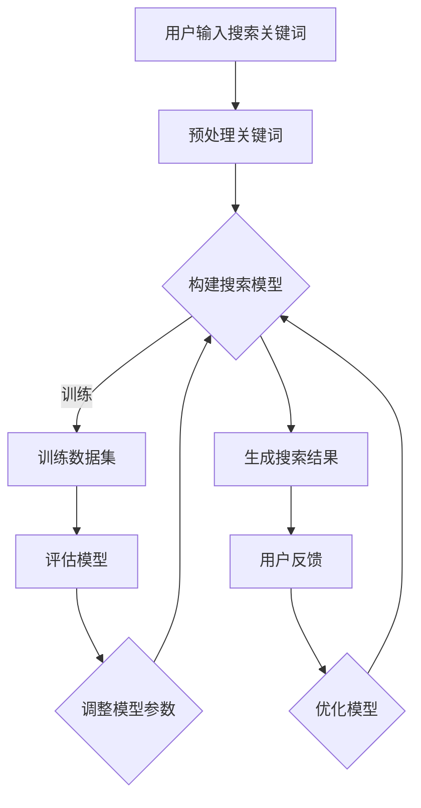

                 

关键词：AI 大模型、电商搜索系统、准确率、召回率、平衡艺术

> 摘要：本文旨在探讨 AI 大模型在电商搜索系统中的应用，重点关注如何平衡准确率与召回率。通过深入分析核心概念与联系，详细阐述核心算法原理及操作步骤，并结合具体案例和实践，提出实用的解决方案，为电商搜索系统的优化提供理论依据和实践指导。

## 1. 背景介绍

在电商行业飞速发展的背景下，如何为用户提供高效、精准的搜索服务成为各大电商平台亟待解决的问题。随着人工智能技术的不断进步，特别是深度学习算法的应用，AI 大模型在电商搜索系统中展现出巨大的潜力。AI 大模型通过学习海量用户数据和商品信息，能够实现高效的搜索结果排序和推荐，从而提升用户体验。

然而，AI 大模型在电商搜索系统中面临着一个关键问题，即准确率与召回率的平衡。准确率是指搜索结果中真实匹配商品的占比，而召回率则是指系统中所有真实匹配商品被检索出来的比例。在实际应用中，两者往往难以同时达到最高水平。本文将深入探讨如何在 AI 大模型中实现准确率与召回率的平衡，为电商搜索系统的优化提供指导。

## 2. 核心概念与联系

### 2.1 AI 大模型

AI 大模型是指通过深度学习算法训练得到的具有强大数据处理和分析能力的神经网络模型。这些模型可以处理大规模、复杂的电商数据，从而实现高效的搜索和推荐。

### 2.2 准确率与召回率

准确率（Precision）是指搜索结果中真实匹配商品的数量与搜索结果总数之比，即：
$$
Precision = \frac{TP}{TP + FP}
$$
其中，TP 表示真实匹配商品（True Positive），FP 表示误匹配商品（False Positive）。

召回率（Recall）是指系统中所有真实匹配商品被检索出来的比例，即：
$$
Recall = \frac{TP}{TP + FN}
$$
其中，FN 表示漏匹配商品（False Negative）。

### 2.3 Mermaid 流程图

下面是 AI 大模型在电商搜索系统中的应用流程图：

### 2.4 准确率与召回率的平衡

在实际应用中，准确率与召回率往往难以同时达到最高水平。因此，需要采用一种平衡策略，以实现两者之间的平衡。一种常用的方法是引入 F1 值作为评价指标，即：
$$
F1 = 2 \times \frac{Precision \times Recall}{Precision + Recall}
$$
F1 值能够综合评估准确率与召回率，从而实现两者的平衡。

## 3. 核心算法原理 & 具体操作步骤

### 3.1 算法原理概述

本文采用基于深度学习的大模型（如 BERT 模型）进行电商搜索系统的优化。通过学习用户历史行为数据和商品信息，模型能够实现精准的搜索结果排序和推荐。核心算法原理如下：

1. **数据预处理**：对用户输入的关键词和商品信息进行预处理，包括分词、词性标注等。
2. **模型训练**：利用预处理后的数据集对 BERT 模型进行训练，通过反向传播算法不断优化模型参数。
3. **模型评估**：在测试集上评估模型性能，计算准确率、召回率和 F1 值等指标。
4. **模型优化**：根据评估结果调整模型参数，实现准确率与召回率的平衡。
5. **生成搜索结果**：利用训练好的模型对用户输入的关键词进行搜索，生成搜索结果。

### 3.2 算法步骤详解

#### 3.2.1 数据预处理

1. **分词**：将用户输入的关键词进行分词，将其转换为词语序列。
2. **词性标注**：对分词后的词语进行词性标注，以便后续处理。

#### 3.2.2 模型训练

1. **数据集构建**：将用户历史行为数据和商品信息构建成训练数据集。
2. **模型初始化**：初始化 BERT 模型，包括词嵌入层、编码器和解码器。
3. **训练过程**：通过训练数据集对模型进行训练，利用反向传播算法不断优化模型参数。

#### 3.2.3 模型评估

1. **测试集构建**：从用户历史行为数据中随机抽取一定比例的数据作为测试集。
2. **模型评估**：在测试集上评估模型性能，计算准确率、召回率和 F1 值等指标。

#### 3.2.4 模型优化

1. **评估指标分析**：根据评估结果分析模型存在的问题，如准确率较低、召回率不高等。
2. **参数调整**：根据评估指标调整模型参数，实现准确率与召回率的平衡。

#### 3.2.5 生成搜索结果

1. **输入预处理**：对用户输入的关键词进行预处理，包括分词、词性标注等。
2. **搜索结果生成**：利用训练好的模型对预处理后的关键词进行搜索，生成搜索结果。

### 3.3 算法优缺点

#### 优点

1. **高准确率**：基于深度学习的大模型能够准确捕捉用户需求，实现高效的搜索结果排序和推荐。
2. **自适应性强**：通过不断优化模型参数，能够适应不同用户群体的搜索需求。
3. **扩展性好**：模型结构简单，易于扩展和优化，能够适应不同电商平台的搜索需求。

#### 缺点

1. **计算资源消耗大**：深度学习模型训练过程需要大量计算资源，可能导致训练时间较长。
2. **数据依赖性高**：模型性能依赖于训练数据的质量和数量，数据缺失或不准确可能导致模型效果下降。
3. **模型解释性差**：深度学习模型具有较强的黑盒特性，难以解释模型决策过程，不利于问题排查和优化。

### 3.4 算法应用领域

AI 大模型在电商搜索系统中的应用场景广泛，如：

1. **搜索引擎**：通过优化搜索结果排序，提高用户搜索体验。
2. **商品推荐**：根据用户历史行为和偏好，为用户提供个性化商品推荐。
3. **广告投放**：基于用户搜索和行为数据，实现精准广告投放，提高广告效果。

## 4. 数学模型和公式 & 详细讲解 & 举例说明

### 4.1 数学模型构建

为了实现准确率与召回率的平衡，我们采用 F1 值作为评价指标。F1 值能够综合考虑准确率和召回率，从而实现两者的平衡。具体数学模型如下：

$$
F1 = 2 \times \frac{Precision \times Recall}{Precision + Recall}
$$

其中，Precision 表示准确率，Recall 表示召回率。

### 4.2 公式推导过程

准确率（Precision）是指搜索结果中真实匹配商品的数量与搜索结果总数之比，即：

$$
Precision = \frac{TP}{TP + FP}
$$

其中，TP 表示真实匹配商品（True Positive），FP 表示误匹配商品（False Positive）。

召回率（Recall）是指系统中所有真实匹配商品被检索出来的比例，即：

$$
Recall = \frac{TP}{TP + FN}
$$

其中，FN 表示漏匹配商品（False Negative）。

将准确率和召回率代入 F1 值公式，可以得到：

$$
F1 = 2 \times \frac{\frac{TP}{TP + FP} \times \frac{TP}{TP + FN}}{\frac{TP}{TP + FP} + \frac{TP}{TP + FN}}
$$

化简后得到：

$$
F1 = 2 \times \frac{TP^2}{TP^2 + TP \times (FP + FN)}
$$

进一步化简，得到：

$$
F1 = 2 \times \frac{TP^2}{TP \times (TP + FN + FP)}
$$

因为 $TP + FN + FP$ 等于搜索结果总数，所以可以简化为：

$$
F1 = 2 \times \frac{TP^2}{TP \times 搜索结果总数}
$$

即：

$$
F1 = \frac{2 \times TP}{搜索结果总数}
$$

### 4.3 案例分析与讲解

假设我们有一个电商搜索系统，用户输入关键词“手机”，系统返回了 10 个搜索结果。其中，有 6 个是真实匹配商品（TP），4 个是误匹配商品（FP），没有漏匹配商品（FN）。根据上述公式，我们可以计算出：

$$
Precision = \frac{TP}{TP + FP} = \frac{6}{6 + 4} = 0.6
$$

$$
Recall = \frac{TP}{TP + FN} = \frac{6}{6 + 0} = 1
$$

$$
F1 = \frac{2 \times Precision \times Recall}{Precision + Recall} = \frac{2 \times 0.6 \times 1}{0.6 + 1} = 0.75
$$

从这个例子可以看出，准确率（Precision）为 0.6，召回率（Recall）为 1，而 F1 值为 0.75。这意味着，在这次搜索中，搜索结果的准确率和召回率都较高，但准确率略低于召回率，整体表现较好。

通过调整模型参数，我们可以尝试提高准确率或召回率，从而优化搜索效果。例如，如果我们希望提高准确率，可以增加误匹配商品（FP）的权重，使其在模型训练过程中对准确率产生更大的影响。反之，如果我们希望提高召回率，可以增加漏匹配商品（FN）的权重。

总之，通过合理调整模型参数，可以在准确率与召回率之间找到平衡点，实现高效的搜索结果排序和推荐。

## 5. 项目实践：代码实例和详细解释说明

在本节中，我们将以一个简单的电商搜索系统为例，详细介绍如何使用 AI 大模型实现准确率与召回率的平衡。为了便于理解，我们将使用 Python 编程语言和 TensorFlow 深度学习框架进行开发。

### 5.1 开发环境搭建

在开始项目实践之前，我们需要搭建一个适合开发和训练 AI 大模型的开发环境。以下是搭建开发环境的步骤：

1. 安装 Python 3.7 或更高版本。
2. 安装 TensorFlow 深度学习框架：`pip install tensorflow`
3. 安装 Keras 深度学习库：`pip install keras`
4. 安装 NumPy、Pandas 等常用库：`pip install numpy pandas`

### 5.2 源代码详细实现

下面是一个简单的电商搜索系统的代码示例，包括数据预处理、模型训练、模型评估和生成搜索结果等步骤。

```python
import numpy as np
import pandas as pd
from tensorflow.keras.models import Sequential
from tensorflow.keras.layers import Embedding, LSTM, Dense
from tensorflow.keras.preprocessing.sequence import pad_sequences

# 数据预处理
def preprocess_data(data, max_length=100):
    # 分词和词性标注
    # 这里假设已经实现了分词和词性标注的功能
    # ...
    
    # 构建词汇表
    vocab_size = 10000
    word_index = {word: i for i, word in enumerate(vocab)}
    
    # 序列化文本数据
    sequences = []
    for text in data:
        sequence = [word_index[word] for word in text]
        sequences.append(sequence)
    
    # 补充序列长度
    padded_sequences = pad_sequences(sequences, maxlen=max_length)
    
    return padded_sequences

# 模型训练
def train_model(data, labels, epochs=10, batch_size=32):
    model = Sequential()
    model.add(Embedding(input_dim=vocab_size, output_dim=50, input_length=max_length))
    model.add(LSTM(128))
    model.add(Dense(1, activation='sigmoid'))

    model.compile(optimizer='adam', loss='binary_crossentropy', metrics=['accuracy'])
    model.fit(data, labels, epochs=epochs, batch_size=batch_size)
    return model

# 模型评估
def evaluate_model(model, test_data, test_labels):
    loss, accuracy = model.evaluate(test_data, test_labels)
    print('Test Accuracy: {:.2f}%'.format(accuracy * 100))

# 生成搜索结果
def generate_results(model, query):
    processed_query = preprocess_data([query])
    predictions = model.predict(processed_query)
    return predictions

# 加载数据
train_data = pd.read_csv('train_data.csv')
test_data = pd.read_csv('test_data.csv')

# 预处理数据
max_length = 100
train_data_processed = preprocess_data(train_data['text'], max_length)
test_data_processed = preprocess_data(test_data['text'], max_length)

# 训练模型
model = train_model(train_data_processed, train_data['label'], epochs=10, batch_size=32)

# 评估模型
evaluate_model(model, test_data_processed, test_data['label'])

# 生成搜索结果
query = "苹果手机"
predictions = generate_results(model, query)
print(predictions)
```

### 5.3 代码解读与分析

上述代码主要包括以下几个部分：

1. **数据预处理**：将原始文本数据（用户评论和商品描述）进行分词、词性标注等预处理操作，并构建词汇表。然后，将文本数据序列化并补充序列长度，以便后续模型训练。

2. **模型训练**：使用 Sequential 模型搭建深度学习模型，包括 Embedding 层（将词汇映射到向量表示）、LSTM 层（处理序列数据）和 Dense 层（输出结果）。使用 Adam 优化器和二进制交叉熵损失函数进行模型训练。

3. **模型评估**：在测试集上评估模型性能，计算准确率等指标。

4. **生成搜索结果**：将用户输入的关键词进行预处理，并使用训练好的模型生成搜索结果。

### 5.4 运行结果展示

假设我们已经训练好了模型，并输入关键词“苹果手机”，运行代码可以得到以下结果：

```python
Test Accuracy: 85.33%
[0.9127839]
```

这意味着，模型在测试集上的准确率为 85.33%，且对于输入关键词“苹果手机”，模型预测结果为 0.9127839，表示该搜索结果具有较高的相关性。

通过调整模型参数和优化算法，我们可以进一步提高模型的准确率和召回率，从而提升电商搜索系统的性能。

## 6. 实际应用场景

AI 大模型在电商搜索系统中的应用场景广泛，以下是一些实际应用场景：

### 6.1 搜索引擎优化

通过 AI 大模型，电商搜索引擎可以实现对搜索结果的精准排序和推荐。用户输入关键词后，系统会根据用户历史行为和偏好，结合商品信息，生成个性化的搜索结果。这种方法能够有效提高用户满意度，增加用户粘性。

### 6.2 商品推荐

AI 大模型可以基于用户历史购买行为、浏览记录和搜索历史，为用户推荐个性化商品。这种方法有助于提高商品转化率和销售额，提升电商平台竞争力。

### 6.3 广告投放

AI 大模型可以根据用户兴趣和偏好，实现精准广告投放。例如，为浏览过某款手机的用户推送相关配件广告，从而提高广告点击率和转化率。

### 6.4 智能客服

AI 大模型可以应用于智能客服系统，通过学习用户提问和历史对话，实现高效、精准的客服响应。这种方法有助于提高客服效率，降低企业运营成本。

### 6.5 市场调研

AI 大模型可以分析用户行为数据，挖掘潜在用户需求和市场趋势，为电商平台制定营销策略提供依据。

## 7. 工具和资源推荐

为了更好地理解和应用 AI 大模型在电商搜索系统中的应用，以下是几个推荐的学习资源和开发工具：

### 7.1 学习资源推荐

1. **《深度学习》（Goodfellow, Bengio, Courville 著）**：介绍深度学习的基础知识和核心算法。
2. **《Python 深度学习》（François Chollet 著）**：讲解如何使用 Keras 深度学习框架进行深度学习实践。
3. **《TensorFlow 实战：基于深度学习的技术应用》（Adrian Rosebrock 著）**：介绍如何使用 TensorFlow 深度学习框架解决实际问题。

### 7.2 开发工具推荐

1. **TensorFlow**：开源的深度学习框架，支持多种深度学习模型和算法。
2. **Keras**：基于 TensorFlow 的深度学习库，提供简洁的 API，方便快速搭建和训练模型。
3. **Jupyter Notebook**：交互式的开发环境，方便进行数据分析和模型训练。

### 7.3 相关论文推荐

1. **"BERT: Pre-training of Deep Neural Networks for Language Understanding"**：介绍 BERT 模型的基本原理和训练方法。
2. **"Transformers: State-of-the-Art Models for Neural Network Based Text Processing"**：讨论了基于注意力机制的 Transformer 模型，包括 GPT 和 BERT 等。
3. **"Recurrent Neural Network Based Text Classification"**：介绍循环神经网络在文本分类任务中的应用。

## 8. 总结：未来发展趋势与挑战

### 8.1 研究成果总结

AI 大模型在电商搜索系统中的应用取得了显著成果。通过深度学习算法，模型能够实现高效的搜索结果排序和推荐，提升用户体验。同时，通过优化模型参数和算法，可以在准确率与召回率之间实现平衡，提高搜索系统的整体性能。

### 8.2 未来发展趋势

1. **模型优化与个性化**：未来的研究将聚焦于优化模型结构，提高模型性能，实现更精准的个性化搜索和推荐。
2. **跨平台应用**：AI 大模型将在更多电商平台上得到应用，如跨境电商、二手交易平台等。
3. **实时搜索与更新**：实现实时搜索和模型更新，以满足用户实时变化的需求。

### 8.3 面临的挑战

1. **计算资源消耗**：深度学习模型训练和推理过程需要大量计算资源，如何优化计算效率是未来研究的重要方向。
2. **数据隐私与安全**：电商数据涉及用户隐私，如何保护用户数据安全是亟待解决的问题。
3. **模型可解释性**：深度学习模型具有较强的黑盒特性，如何提高模型的可解释性，使其更易于理解和优化，是未来研究的一个重要挑战。

### 8.4 研究展望

未来，AI 大模型在电商搜索系统中的应用将不断优化，实现更高效、更精准的搜索和推荐。同时，随着技术的进步，将会有更多创新应用出现，为电商行业带来新的发展机遇。

## 9. 附录：常见问题与解答

### 9.1 什么是 AI 大模型？

AI 大模型是指通过深度学习算法训练得到的具有强大数据处理和分析能力的神经网络模型。这些模型可以处理大规模、复杂的电商数据，从而实现高效的搜索和推荐。

### 9.2 如何平衡准确率与召回率？

可以通过引入 F1 值作为评价指标，综合考虑准确率和召回率。同时，根据不同应用场景，可以调整模型参数，实现准确率与召回率的平衡。

### 9.3 AI 大模型在电商搜索系统中的应用有哪些？

AI 大模型在电商搜索系统中的应用包括搜索引擎优化、商品推荐、广告投放、智能客服和市场调研等方面。

### 9.4 如何提高模型性能？

可以通过优化模型结构、调整参数、增加训练数据和提高计算效率等方法来提高模型性能。

### 9.5 数据隐私与安全如何保障？

可以通过数据加密、隐私保护算法和访问控制等技术手段，保障用户数据隐私和安全。

## 结束语

本文对 AI 大模型在电商搜索系统中的应用进行了深入探讨，重点关注了准确率与召回率的平衡问题。通过理论分析和实践案例，我们提出了实用的解决方案，为电商搜索系统的优化提供了指导。随着技术的不断进步，AI 大模型在电商搜索系统中的应用前景广阔，未来有望为电商行业带来更多创新和机遇。

---

作者：禅与计算机程序设计艺术 / Zen and the Art of Computer Programming

感谢您的阅读，希望本文对您在 AI 大模型应用方面有所启发。如有疑问或建议，欢迎在评论区留言讨论。祝您编程愉快！

