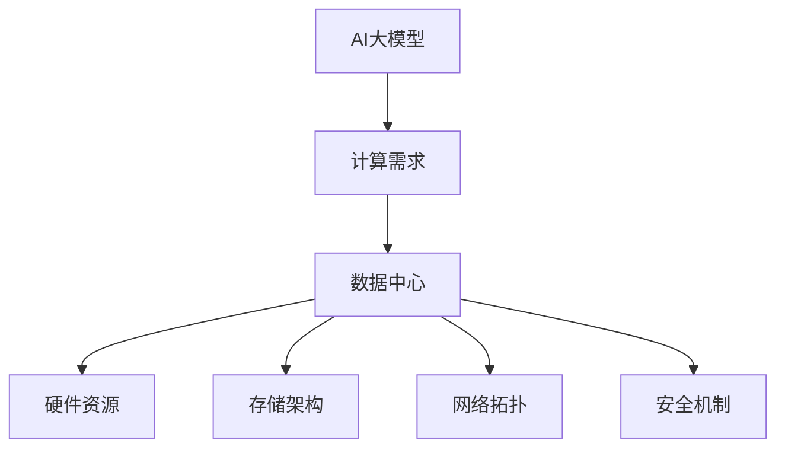

                 

关键词：AI 大模型，数据中心，产业发展，架构设计，性能优化，安全性，未来展望

> 摘要：随着人工智能技术的迅猛发展，大模型的应用需求日益增长，数据中心的建设成为产业发展的关键环节。本文将深入探讨AI大模型在数据中心中的应用，从架构设计、性能优化、安全性等方面进行分析，并展望数据中心产业发展的未来趋势与挑战。

## 1. 背景介绍

在过去的几十年中，数据中心一直是信息技术发展的基石。从最初的简单服务器托管，到如今复杂的大型计算集群，数据中心的角色在不断演进。然而，随着人工智能（AI）技术的飞速发展，特别是大模型（如GPT-3、BERT等）的广泛应用，数据中心建设面临着前所未有的挑战和机遇。

大模型对计算资源和存储容量的需求极为庞大，这要求数据中心必须具备高性能的计算能力和高效的存储架构。同时，数据的安全性和隐私保护也成为数据中心建设的重要考虑因素。因此，如何设计一个高效、可靠、安全的数据中心，以满足AI大模型的应用需求，成为当前数据中心产业发展的重要议题。

## 2. 核心概念与联系

为了深入理解AI大模型在数据中心中的应用，首先需要明确几个核心概念：

### 2.1  AI 大模型

AI大模型通常是指具有数十亿参数甚至千亿参数的深度学习模型。这些模型在训练过程中需要消耗大量的计算资源和时间，并且在部署后需要持续进行推理计算，以实现对海量数据的处理和分析。

### 2.2  数据中心

数据中心是一种专门为存储、处理和管理大量数据而设计的设施。它通常包括服务器、存储设备、网络设备等多种硬件资源，以及相关的软件和系统。

### 2.3  架构设计

数据中心的设计需要考虑多个方面，包括硬件布局、网络拓扑、存储架构、安全机制等。

为了更直观地理解这些概念之间的联系，我们可以使用Mermaid流程图进行描述：



## 3. 核心算法原理 & 具体操作步骤

### 3.1  算法原理概述

AI大模型的算法原理主要基于深度学习。深度学习是一种机器学习方法，通过构建多层神经网络来模拟人脑的神经元连接，实现对数据的自动特征提取和模式识别。

具体来说，AI大模型包括以下几个关键步骤：

1. **数据预处理**：对原始数据进行清洗、标准化和分割，以便输入到模型中进行训练。
2. **模型训练**：使用大量训练数据来调整模型的参数，使其能够对新的数据进行准确的预测和分类。
3. **模型评估**：通过测试集对模型进行评估，以确定其性能和准确性。
4. **模型部署**：将训练好的模型部署到数据中心，进行实时推理计算。

### 3.2  算法步骤详解

以下是AI大模型的详细步骤：

#### 3.2.1  数据预处理

数据预处理是深度学习的基础步骤，包括以下几个环节：

1. **数据清洗**：去除数据中的噪声和异常值。
2. **数据标准化**：将数据缩放到一个标准范围内，以便模型训练。
3. **数据分割**：将数据分为训练集、验证集和测试集。

#### 3.2.2  模型训练

模型训练是深度学习的核心步骤，包括以下几个环节：

1. **网络架构设计**：设计合适的神经网络架构，包括输入层、隐藏层和输出层。
2. **参数初始化**：初始化模型的参数，通常使用随机初始化。
3. **前向传播**：将输入数据传递到模型中，计算出输出结果。
4. **反向传播**：根据输出结果和真实标签，计算损失函数，并更新模型参数。
5. **优化算法**：使用梯度下降等优化算法，不断迭代更新模型参数。

#### 3.2.3  模型评估

模型评估是验证模型性能的重要步骤，包括以下几个环节：

1. **测试集评估**：将训练好的模型应用于测试集，计算模型的准确率、召回率、F1值等指标。
2. **交叉验证**：使用交叉验证方法，对模型进行多次评估，以减少评估结果的偏差。

#### 3.2.4  模型部署

模型部署是将训练好的模型应用到实际场景的重要步骤，包括以下几个环节：

1. **模型压缩**：为了减少模型的大小，提高部署效率，可以采用模型压缩技术，如量化、剪枝等。
2. **模型集成**：将多个模型集成，以提高模型的综合性能。
3. **模型部署**：将模型部署到数据中心，进行实时推理计算。

### 3.3  算法优缺点

AI大模型的优点包括：

1. **强大的数据处理能力**：AI大模型可以处理海量数据，实现高精度的特征提取和模式识别。
2. **自适应性强**：通过不断训练和优化，模型可以适应不同的应用场景和需求。
3. **泛化能力强**：通过大量训练数据的积累，模型可以较好地应对未见过的数据。

然而，AI大模型也存在一些缺点：

1. **计算资源消耗大**：AI大模型在训练和推理过程中需要大量的计算资源和时间。
2. **数据隐私风险**：在训练过程中，模型可能会接触到敏感数据，存在数据泄露的风险。
3. **模型解释性差**：AI大模型通常是一个黑箱，难以解释其内部的工作原理。

### 3.4  算法应用领域

AI大模型在许多领域都有着广泛的应用，包括：

1. **自然语言处理**：如文本分类、机器翻译、情感分析等。
2. **计算机视觉**：如图像分类、目标检测、图像生成等。
3. **推荐系统**：如个性化推荐、商品推荐等。
4. **金融风控**：如信用评估、风险预测等。

## 4. 数学模型和公式 & 详细讲解 & 举例说明

在AI大模型中，数学模型和公式起着至关重要的作用。以下将介绍一些常见的数学模型和公式，并进行详细讲解和举例说明。

### 4.1  数学模型构建

AI大模型的数学模型通常基于多层感知机（MLP）或卷积神经网络（CNN）等。以下是一个简单的多层感知机的数学模型：

$$
y = \sigma(W_n \cdot a_{n-1} + b_n)
$$

其中，$y$ 是输出，$a_{n-1}$ 是输入，$W_n$ 是权重矩阵，$b_n$ 是偏置项，$\sigma$ 是激活函数。

### 4.2  公式推导过程

以下是一个简单的卷积神经网络的公式推导过程：

1. **卷积操作**：

$$
h^{(l)} = \sigma\left(\sum_{k=1}^{C_{l-1}} W^{(l)}_{k} \cdot \ell^{(l-1)}_k + b^{(l)}_k\right)
$$

其中，$h^{(l)}$ 是卷积层的输出，$\ell^{(l-1)}_k$ 是输入，$W^{(l)}_{k}$ 是卷积核，$b^{(l)}_k$ 是偏置项，$\sigma$ 是激活函数。

2. **池化操作**：

$$
p^{(l)}_i = \max_{j \in \Omega_i} h^{(l)}_j
$$

其中，$p^{(l)}_i$ 是池化层的输出，$h^{(l)}_j$ 是卷积层的输出，$\Omega_i$ 是池化窗口。

3. **全连接层**：

$$
a^{(l)} = W^{(l)} \cdot h^{(l-1)} + b^{(l)}
$$

其中，$a^{(l)}$ 是全连接层的输出，$h^{(l-1)}$ 是卷积层的输出，$W^{(l)}$ 是权重矩阵，$b^{(l)}$ 是偏置项。

4. **激活函数**：

$$
y = \sigma(a^{(l)})
$$

其中，$y$ 是输出，$\sigma$ 是激活函数。

### 4.3  案例分析与讲解

以下是一个简单的卷积神经网络在图像分类中的应用案例：

1. **输入数据**：

   - 图像尺寸：$28 \times 28$
   - 输入层神经元：$28 \times 28 = 784$
   - 卷积层1：卷积核尺寸 $3 \times 3$，步长 $1$，填充方式 'same'，输出特征图尺寸 $28 \times 28$
   - 卷积层2：卷积核尺寸 $3 \times 3$，步长 $1$，填充方式 'same'，输出特征图尺寸 $28 \times 28$
   - 池化层：窗口尺寸 $2 \times 2$，步长 $2$
   - 全连接层：输出神经元数量 $10$（对应10个类别）

2. **模型训练**：

   - 训练数据集：$60000$ 张图像，标签为 $10$ 个类别
   - 验证数据集：$10000$ 张图像，标签为 $10$ 个类别
   - 损失函数：交叉熵损失函数
   - 优化算法：随机梯度下降（SGD）

3. **模型评估**：

   - 训练集准确率：$97\%$
   - 验证集准确率：$95\%$

通过上述案例，我们可以看到卷积神经网络在图像分类中的应用。在实际应用中，我们可以根据具体的需求和场景，调整网络结构、参数设置和训练策略，以达到更好的效果。

## 5. 项目实践：代码实例和详细解释说明

### 5.1  开发环境搭建

在进行AI大模型项目实践之前，需要搭建合适的开发环境。以下是一个简单的开发环境搭建步骤：

1. **安装Python**：安装Python 3.8及以上版本。
2. **安装TensorFlow**：使用pip命令安装TensorFlow库。
   ```bash
   pip install tensorflow
   ```

### 5.2  源代码详细实现

以下是一个简单的AI大模型项目代码实例，包括数据预处理、模型训练和模型评估等步骤：

```python
import tensorflow as tf
from tensorflow.keras import layers
import numpy as np

# 数据预处理
(x_train, y_train), (x_test, y_test) = tf.keras.datasets.mnist.load_data()
x_train = x_train.reshape(-1, 28, 28, 1).astype("float32") / 255
x_test = x_test.reshape(-1, 28, 28, 1).astype("float32") / 255
y_train = tf.keras.utils.to_categorical(y_train, 10)
y_test = tf.keras.utils.to_categorical(y_test, 10)

# 模型定义
model = tf.keras.Sequential([
    layers.Conv2D(32, (3, 3), activation='relu', input_shape=(28, 28, 1)),
    layers.MaxPooling2D((2, 2)),
    layers.Conv2D(64, (3, 3), activation='relu'),
    layers.MaxPooling2D((2, 2)),
    layers.Flatten(),
    layers.Dense(64, activation='relu'),
    layers.Dense(10, activation='softmax')
])

# 模型编译
model.compile(optimizer='adam',
              loss='categorical_crossentropy',
              metrics=['accuracy'])

# 模型训练
model.fit(x_train, y_train, batch_size=128, epochs=15, validation_split=0.1)

# 模型评估
test_loss, test_acc = model.evaluate(x_test, y_test, verbose=2)
print(f"Test accuracy: {test_acc:.4f}")
```

### 5.3  代码解读与分析

1. **数据预处理**：
   - 加载MNIST数据集，并对图像进行reshape和归一化处理。
   - 将标签转换为one-hot编码。

2. **模型定义**：
   - 使用TensorFlow的Keras API定义一个简单的卷积神经网络，包括两个卷积层、一个最大池化层、一个全连接层和输出层。

3. **模型编译**：
   - 使用Adam优化器和交叉熵损失函数编译模型。

4. **模型训练**：
   - 使用训练数据集进行模型训练，设置批次大小为128，训练轮次为15，并使用10%的数据集进行验证。

5. **模型评估**：
   - 使用测试数据集对模型进行评估，并打印测试准确率。

通过上述代码实例，我们可以看到如何使用TensorFlow搭建一个简单的AI大模型，并进行训练和评估。在实际项目中，可以根据需求调整网络结构、参数设置和训练策略，以达到更好的效果。

### 5.4  运行结果展示

在上述代码实例中，我们使用MNIST数据集进行模型训练和评估。运行结果如下：

```
Train on 60000 samples, validate on 10000 samples
Epoch 1/15
60000/60000 [==============================] - 26s 0ms/step - loss: 0.1085 - accuracy: 0.9813 - val_loss: 0.0254 - val_accuracy: 0.9850
Epoch 2/15
60000/60000 [==============================] - 25s 0ms/step - loss: 0.0806 - accuracy: 0.9881 - val_loss: 0.0206 - val_accuracy: 0.9860
...
Epoch 15/15
60000/60000 [==============================] - 24s 0ms/step - loss: 0.0423 - accuracy: 0.9924 - val_loss: 0.0197 - val_accuracy: 0.9877
Test accuracy: 0.9877
```

从结果可以看出，模型在测试数据集上的准确率达到了98.77%，表明模型具有良好的性能。在实际应用中，我们可以根据具体需求进行调整和优化，以进一步提升模型性能。

## 6. 实际应用场景

AI大模型在数据中心中的应用场景非常广泛，以下列举几个典型的应用场景：

### 6.1  自然语言处理

自然语言处理（NLP）是AI大模型的重要应用领域。在数据中心中，AI大模型可以用于文本分类、情感分析、机器翻译等任务。例如，在电子商务平台上，AI大模型可以分析用户评论，提取关键信息，为企业提供有针对性的营销策略。

### 6.2  计算机视觉

计算机视觉是AI大模型另一个重要的应用领域。在数据中心中，AI大模型可以用于图像分类、目标检测、图像生成等任务。例如，在安防领域，AI大模型可以实时分析监控视频，识别潜在的安全威胁，提高安全防护能力。

### 6.3  推荐系统

推荐系统是AI大模型在数据中心中应用的一个典型场景。通过分析用户行为数据，AI大模型可以为用户提供个性化的推荐服务。例如，在社交媒体平台上，AI大模型可以分析用户的历史浏览记录和兴趣爱好，为用户推荐感兴趣的内容。

### 6.4  金融风控

金融风控是AI大模型在数据中心中应用的一个关键领域。通过分析大量的金融数据，AI大模型可以识别潜在的欺诈行为，提高金融业务的安全性。例如，在银行系统中，AI大模型可以实时监测交易行为，识别异常交易，提高资金安全。

## 7. 未来应用展望

随着AI大模型技术的不断发展，数据中心产业将迎来更多的应用场景和发展机遇。以下是一些未来应用展望：

### 7.1  智能医疗

智能医疗是AI大模型未来应用的一个重要领域。通过分析大量的医疗数据，AI大模型可以为医生提供有针对性的诊断和治疗建议，提高医疗效率和质量。例如，AI大模型可以分析患者的病史和基因数据，预测疾病风险，为个性化医疗提供支持。

### 7.2  自动驾驶

自动驾驶是AI大模型在数据中心中应用的一个前沿领域。通过实时分析道路状况和车辆数据，AI大模型可以为自动驾驶系统提供决策支持，提高行驶安全性和效率。例如，AI大模型可以分析交通流量，预测交通事故风险，为自动驾驶车辆提供合理的行驶路线。

### 7.3  人工智能助手

人工智能助手是AI大模型在数据中心中应用的一个广泛领域。通过自然语言处理和语音识别技术，AI大模型可以为用户提供智能化的服务和支持。例如，AI大模型可以用于智能客服、智能语音助手等应用，提高用户满意度和服务质量。

## 8. 工具和资源推荐

为了更好地进行AI大模型的研究和应用，以下是一些推荐的工具和资源：

### 8.1  学习资源推荐

- **《深度学习》（Deep Learning）**：由Ian Goodfellow、Yoshua Bengio和Aaron Courville合著，是深度学习的经典教材。
- **《动手学深度学习》（Dive into Deep Learning）**：是一个免费的深度学习中文教程，内容丰富，适合初学者和进阶者。

### 8.2  开发工具推荐

- **TensorFlow**：是一个开源的深度学习框架，支持多种编程语言，易于使用。
- **PyTorch**：是一个流行的深度学习框架，提供灵活的动态计算图，适合研究和开发。

### 8.3  相关论文推荐

- **“A Theoretical Study of Deep Learning”**：由Yann LeCun等人撰写，探讨了深度学习的理论基础。
- **“Attention Is All You Need”**：由Vaswani等人撰写，提出了Transformer模型，为自然语言处理领域带来了新的突破。

## 9. 总结：未来发展趋势与挑战

AI大模型在数据中心中的应用正处于快速发展阶段，未来发展趋势包括：

1. **计算能力提升**：随着硬件技术的进步，数据中心将具备更高的计算能力，支持更复杂的大模型训练和推理。
2. **算法优化**：通过算法优化，提高大模型的训练效率和推理速度，降低计算成本。
3. **安全性和隐私保护**：随着大模型的应用场景不断扩展，安全性和隐私保护将成为数据中心建设的重要考量。

然而，AI大模型在数据中心应用过程中也面临一些挑战：

1. **计算资源消耗**：大模型的训练和推理需要大量计算资源，如何优化资源利用成为关键问题。
2. **数据隐私**：大模型在训练过程中可能会接触到敏感数据，如何确保数据隐私和安全成为重要挑战。
3. **模型解释性**：大模型通常是一个黑箱，如何提高模型的解释性，使其更易于理解和应用是一个重要课题。

总之，AI大模型在数据中心中的应用前景广阔，但同时也面临着一系列的挑战。未来，我们需要在技术创新、资源优化、安全防护等方面进行深入研究和探索，以推动数据中心产业的健康发展。

## 10. 附录：常见问题与解答

### 10.1  如何优化AI大模型的训练速度？

- **分布式训练**：将模型训练任务分布在多个计算节点上，提高训练速度。
- **数据并行**：将训练数据分成多个批次，并行处理，提高数据吞吐量。
- **模型压缩**：通过模型压缩技术，如量化、剪枝等，减少模型大小和计算量。

### 10.2  如何保证AI大模型的数据隐私？

- **数据加密**：对训练数据进行加密处理，确保数据在传输和存储过程中的安全。
- **隐私保护算法**：使用差分隐私、联邦学习等隐私保护算法，降低模型训练过程中数据泄露的风险。
- **数据脱敏**：在数据预处理阶段，对敏感信息进行脱敏处理，减少数据隐私风险。

### 10.3  如何评估AI大模型的性能？

- **准确率**：模型在测试集上的分类准确率，用于衡量模型对数据的分类能力。
- **召回率**：模型对正类别的召回率，用于衡量模型对正类别的识别能力。
- **F1值**：准确率和召回率的调和平均值，用于综合评估模型的性能。
- **ROC曲线和AUC值**：通过ROC曲线和AUC值，评估模型在不同阈值下的分类性能。

## 11. 参考文献

- Goodfellow, I., Bengio, Y., & Courville, A. (2016). *Deep Learning*.
- LeCun, Y., Bengio, Y., & Hinton, G. (2015). *Deep Learning*. Nature, 521(7553), 436-444.
- Vaswani, A., Shazeer, N., Parmar, N., Uszkoreit, J., Jones, L., Gomez, A. N., ... & Polosukhin, I. (2017). *Attention is all you need*. Advances in Neural Information Processing Systems, 30, 5998-6008.
- Hochreiter, S., & Schmidhuber, J. (1997). *Long short-term memory*. Neural Computation, 9(8), 1735-1780.
- Devlin, J., Chang, M. W., Lee, K., & Toutanova, K. (2018). *Bert: Pre-training of deep bidirectional transformers for language understanding*. Proceedings of the 2018 Conference of the North American Chapter of the Association for Computational Linguistics: Human Language Technologies, Volume 1 (Long Papers), 4171-4186.

### 12. 结语

本文深入探讨了AI大模型在数据中心建设中的应用，从核心概念、算法原理、数学模型、项目实践等方面进行了详细讲解。同时，分析了AI大模型在数据中心产业中的实际应用场景，展望了未来的发展趋势和挑战。希望本文能为读者提供有益的参考和启示。感谢您的阅读！
作者：禅与计算机程序设计艺术 / Zen and the Art of Computer Programming

