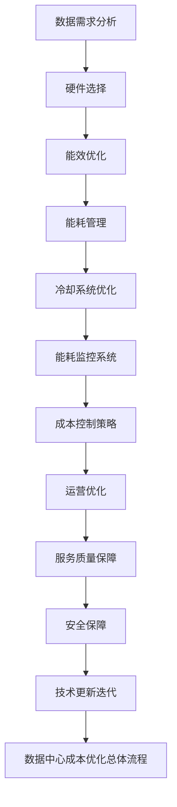

                 

在当今快速发展的数字时代，人工智能（AI）已经成为推动技术创新和社会进步的关键力量。而AI的大模型，如GPT-3、BERT等，更是引领了AI发展的新潮流。这些大模型通常需要巨大的计算资源和存储空间，因此数据中心的建设与管理变得至关重要。在这篇文章中，我们将深入探讨AI大模型应用数据中心的建设，特别是如何进行数据中心成本优化。

> **关键词**：AI大模型，数据中心建设，成本优化，效率提升

> **摘要**：本文首先介绍了AI大模型的发展及其对数据中心需求的增长。接着，分析了数据中心成本优化的重要性，并详细讨论了优化策略和关键技术。通过实际案例分析，本文展示了如何通过技术手段和运营策略实现数据中心成本的有效控制，为企业的数字化转型提供了可行的解决方案。

## 1. 背景介绍

人工智能的发展已经进入了深度学习时代，其中大模型成为研究热点。这些大模型通常具有数十亿甚至数千亿个参数，需要进行大量的数据训练和推理计算。因此，数据中心成为了支撑AI大模型应用的基石。数据中心的建设不仅要满足计算和存储需求，还要实现高效、可靠和低成本运营。

数据中心成本优化已经成为当前数据中心管理的重要任务。一方面，随着AI大模型的应用越来越广泛，数据中心的运营成本也在不断上升。另一方面，企业在数字化转型过程中，对成本控制提出了更高的要求。因此，如何通过技术手段和管理优化实现数据中心成本的有效控制，成为了一个迫切需要解决的问题。

### 1.1 AI大模型的发展

AI大模型的发展经历了几个重要阶段。最早是1990年代的神经网络研究，随后在2012年，AlexNet的突破性成功标志着深度学习的兴起。随着GPU等计算硬件的发展，深度学习模型开始变得越来越大。2018年，GPT-3的发布标志着AI大模型的巅峰，它拥有1750亿个参数，可以进行自然语言处理和生成。

大模型的参数量巨大，意味着需要大量的计算资源和存储空间。例如，训练一个GPT-3模型需要数以百万计的GPU小时，这给数据中心带来了巨大的计算需求。此外，大模型的应用也需要大量的数据存储和处理，这进一步增加了数据中心的运营成本。

### 1.2 数据中心的需求增长

AI大模型的发展对数据中心的需求产生了深远影响。首先，大模型的训练和推理需要大量的计算资源。传统数据中心通常使用CPU进行计算，而AI大模型的训练则通常依赖于GPU、TPU等专用计算硬件。这导致数据中心的计算资源需求急剧增加。

其次，大模型的应用需要大量的数据存储。例如，一个GPT-3模型需要数TB甚至PB级别的存储空间。此外，大模型的应用也需要实时数据流处理，这对数据中心的网络带宽和处理能力提出了更高要求。

### 1.3 数据中心成本优化的必要性

数据中心成本优化的重要性体现在以下几个方面：

1. **成本控制**：随着AI大模型的应用越来越广泛，数据中心的运营成本也在不断上升。如果不进行成本优化，企业可能无法承受这种成本压力。

2. **效率提升**：通过技术手段和运营策略优化，可以实现数据中心资源的最大化利用，从而提高运营效率。

3. **可持续发展**：数据中心是耗电大户，成本优化有助于减少能源消耗和碳排放，符合可持续发展的要求。

## 2. 核心概念与联系

在深入探讨数据中心成本优化的策略和关键技术之前，我们需要明确几个核心概念和它们之间的联系。以下是数据中心成本优化的核心概念和架构的Mermaid流程图：



### 2.1 数据需求分析

数据需求分析是数据中心成本优化的第一步。通过对AI大模型的应用场景、数据规模和处理要求进行深入分析，可以确定数据中心的硬件需求、网络带宽和处理能力。这一步骤的关键在于准确预测数据中心的未来需求，以便合理规划硬件资源。

### 2.2 硬件选择

硬件选择是数据中心成本优化的核心。根据数据需求分析的结果，选择合适的硬件设备，如服务器、存储设备、网络设备等。硬件选择不仅要满足当前需求，还要考虑未来的扩展性。此外，选择高能效比、低能耗的硬件设备也是降低运营成本的关键。

### 2.3 能效优化

能效优化是数据中心成本优化的关键环节。通过采用高效电源管理系统、智能冷却系统等手段，可以显著降低数据中心的能耗。此外，通过虚拟化技术、分布式计算等技术，可以进一步提高资源利用率，降低能耗。

### 2.4 能耗管理

能耗管理是数据中心运营的重要组成部分。通过能耗监控系统实时监测数据中心的能耗情况，可以及时发现能耗异常，采取相应措施进行优化。能耗管理还包括能耗预测和规划，以便在数据中心容量规划、设备更换等方面进行科学决策。

### 2.5 冷却系统优化

冷却系统是数据中心能耗的重要组成部分。通过优化冷却系统，可以降低能耗。常见的优化方法包括液冷系统、蒸发冷却系统等。此外，通过智能控制技术，可以根据数据中心的实际运行情况动态调整冷却系统的运行参数，实现能耗的最优化。

### 2.6 能耗监控系统

能耗监控系统是数据中心成本优化的关键工具。通过能耗监控系统，可以实时监测数据中心的能耗情况，生成能耗报告，帮助运营人员了解能耗状况，采取相应的优化措施。此外，能耗监控系统还可以用于能耗预测和规划，为数据中心的长期发展提供数据支持。

### 2.7 成本控制策略

成本控制策略是数据中心成本优化的核心。通过制定合理的成本控制策略，可以实现数据中心资源的最大化利用，降低运营成本。常见的成本控制策略包括预算管理、采购优化、运营优化等。

### 2.8 运营优化

运营优化是数据中心成本优化的关键环节。通过优化数据中心的管理流程、运营模式，可以提高资源利用率，降低运营成本。常见的运营优化方法包括自动化运维、智能化管理、流程优化等。

### 2.9 服务质量保障

服务质量保障是数据中心成本优化的必要条件。通过建立完善的服务质量保障体系，可以确保数据中心的稳定运行，降低故障率和停机时间。服务质量保障包括设备维护、故障处理、安全防护等。

### 2.10 安全保障

安全保障是数据中心成本优化的重要保障。通过建立完善的安全防护体系，可以确保数据中心的网络安全、数据安全和设备安全。常见的安全保障措施包括防火墙、入侵检测、数据备份等。

### 2.11 技术更新迭代

技术更新迭代是数据中心成本优化的长期任务。通过持续跟踪新技术、新趋势，及时更新数据中心的硬件和软件系统，可以保持数据中心的竞争力，降低运营成本。

## 3. 核心算法原理 & 具体操作步骤

### 3.1 算法原理概述

数据中心成本优化的核心算法主要涉及能耗管理、资源调度和成本预测。以下将分别介绍这些算法的原理。

#### 能耗管理算法

能耗管理算法的目标是降低数据中心的能耗，提高能源利用效率。常见的能耗管理算法包括：

- **能效优化算法**：通过智能调度策略，根据数据中心的实际运行情况，动态调整硬件设备的运行状态，实现能耗的最优化。
- **负载均衡算法**：通过均衡数据中心的负载，避免某一部分设备过载或闲置，提高整体能源利用效率。

#### 资源调度算法

资源调度算法的目标是优化数据中心的资源分配，提高资源利用率。常见的资源调度算法包括：

- **虚拟化技术**：通过虚拟化技术，将物理硬件资源虚拟化为多个虚拟资源，实现资源的动态分配和调度。
- **分布式计算**：通过分布式计算，将大规模的计算任务分解为多个子任务，分布在不同的计算节点上执行，提高计算效率。

#### 成本预测算法

成本预测算法的目标是准确预测数据中心的运营成本，为企业决策提供数据支持。常见的成本预测算法包括：

- **时间序列预测算法**：通过分析历史成本数据，利用时间序列预测模型，预测未来的成本趋势。
- **回归分析算法**：通过分析成本与各种因素（如设备能耗、运营时间等）之间的关系，建立回归模型，预测未来的成本。

### 3.2 算法步骤详解

#### 能耗管理算法步骤

1. **数据采集**：采集数据中心的能耗数据，包括设备能耗、整体能耗等。
2. **数据预处理**：对采集到的能耗数据进行清洗、去噪、归一化等预处理操作。
3. **能耗预测**：利用时间序列预测模型，预测未来的能耗数据。
4. **智能调度**：根据能耗预测结果，动态调整硬件设备的运行状态，实现能耗的最优化。
5. **能效评估**：对能耗管理算法的执行效果进行评估，包括能耗降低比例、设备利用率等。

#### 资源调度算法步骤

1. **任务分解**：将大规模计算任务分解为多个子任务。
2. **任务分配**：根据数据中心的硬件资源状况，将子任务分配到不同的计算节点上。
3. **任务调度**：根据子任务的执行情况，动态调整任务分配，实现负载均衡。
4. **资源回收**：任务完成后，回收释放的硬件资源，为后续任务提供资源支持。

#### 成本预测算法步骤

1. **数据采集**：采集数据中心的成本数据，包括设备采购成本、运营成本、能源成本等。
2. **数据预处理**：对采集到的成本数据进行清洗、去噪、归一化等预处理操作。
3. **成本分析**：分析成本与各种因素之间的关系，建立回归模型。
4. **成本预测**：利用回归模型，预测未来的成本数据。
5. **成本优化**：根据成本预测结果，调整数据中心的运营策略，实现成本的最优化。

### 3.3 算法优缺点

#### 能耗管理算法优缺点

**优点**：

- **降低能耗**：通过智能调度策略，降低数据中心的能耗，提高能源利用效率。
- **提高设备利用率**：通过负载均衡算法，避免设备过载或闲置，提高设备利用率。

**缺点**：

- **实现复杂**：能耗管理算法涉及多个技术领域，实现复杂。
- **实时性要求高**：能耗管理算法需要实时采集和处理数据，对系统的实时性要求较高。

#### 资源调度算法优缺点

**优点**：

- **提高资源利用率**：通过虚拟化技术和分布式计算，提高数据中心的资源利用率。
- **降低运营成本**：通过任务分解和动态调度，降低数据中心的运营成本。

**缺点**：

- **系统开销较大**：虚拟化技术和分布式计算引入了额外的系统开销，可能降低系统的性能。
- **任务调度复杂**：任务调度需要考虑多种因素，实现复杂。

#### 成本预测算法优缺点

**优点**：

- **提高成本预测准确性**：通过时间序列预测和回归分析，提高成本预测的准确性。
- **支持决策制定**：为数据中心的运营策略调整提供数据支持，有助于降低运营成本。

**缺点**：

- **数据依赖性强**：成本预测算法依赖于历史成本数据，数据质量对预测准确性有很大影响。
- **算法实现复杂**：时间序列预测和回归分析算法的实现较为复杂。

### 3.4 算法应用领域

能耗管理、资源调度和成本预测算法在数据中心成本优化中具有广泛的应用。以下是一些典型应用领域：

- **云计算数据中心**：云计算数据中心需要高效利用资源，降低运营成本，能耗管理和资源调度算法在云计算数据中心中具有重要应用。
- **大数据处理中心**：大数据处理中心需要对大规模数据进行高效处理和存储，资源调度和能耗管理算法有助于提高数据处理效率。
- **边缘计算数据中心**：边缘计算数据中心需要满足实时数据处理需求，资源调度和能耗管理算法有助于提高边缘计算的数据处理能力。

## 4. 数学模型和公式 & 详细讲解 & 举例说明

在数据中心成本优化的过程中，数学模型和公式扮演着至关重要的角色。以下将详细介绍相关的数学模型和公式，并通过具体例子进行说明。

### 4.1 数学模型构建

数据中心成本优化的数学模型通常包括以下几个部分：

1. **能耗模型**：描述数据中心的能耗与硬件设备、运行状态等因素之间的关系。
2. **资源模型**：描述数据中心的资源需求与任务负载、处理能力等因素之间的关系。
3. **成本模型**：描述数据中心的运营成本与能耗、资源使用等因素之间的关系。

#### 能耗模型

能耗模型通常采用能量守恒原理，即数据中心的总能耗等于硬件设备的能耗之和。假设数据中心有n台设备，每台设备的能耗分别为$E_i$，则总能耗$E$可以表示为：

$$
E = \sum_{i=1}^{n} E_i
$$

其中，$E_i$可以表示为：

$$
E_i = P_i \times \eta_i
$$

其中，$P_i$为设备$i$的功率，$\eta_i$为设备$i$的能效比。

#### 资源模型

资源模型描述了数据中心的资源需求与任务负载之间的关系。假设数据中心需要处理m个任务，每个任务需要的处理能力分别为$R_j$，则总资源需求$R$可以表示为：

$$
R = \sum_{j=1}^{m} R_j
$$

其中，$R_j$可以表示为：

$$
R_j = C_j \times \alpha_j
$$

其中，$C_j$为任务$j$的处理能力，$\alpha_j$为任务$j$的优先级。

#### 成本模型

成本模型描述了数据中心的运营成本与能耗、资源使用等因素之间的关系。假设数据中心的运营成本包括设备采购成本、能耗成本、运维成本等，可以表示为：

$$
C = C_p + C_e + C_o
$$

其中，$C_p$为设备采购成本，$C_e$为能耗成本，$C_o$为运维成本。

设备采购成本$C_p$可以表示为：

$$
C_p = \sum_{i=1}^{n} P_i \times C_i
$$

其中，$P_i$为设备$i$的功率，$C_i$为设备$i$的采购成本。

能耗成本$C_e$可以表示为：

$$
C_e = E \times C_e'
$$

其中，$E$为总能耗，$C_e'$为每单位能耗的成本。

运维成本$C_o$可以表示为：

$$
C_o = R \times C_o'
$$

其中，$R$为总资源需求，$C_o'$为每单位资源需求的成本。

### 4.2 公式推导过程

以下是能耗模型、资源模型和成本模型的推导过程：

#### 能耗模型推导

根据能量守恒原理，数据中心的总能耗等于硬件设备的能耗之和。设数据中心有n台设备，每台设备的能耗分别为$E_i$，则总能耗$E$可以表示为：

$$
E = \sum_{i=1}^{n} E_i
$$

设备$i$的能耗$E_i$可以表示为：

$$
E_i = P_i \times \eta_i
$$

其中，$P_i$为设备$i$的功率，$\eta_i$为设备$i$的能效比。

代入$E_i$的表达式，得到总能耗$E$的表达式：

$$
E = \sum_{i=1}^{n} P_i \times \eta_i
$$

#### 资源模型推导

数据中心需要处理m个任务，每个任务需要的处理能力分别为$R_j$，则总资源需求$R$可以表示为：

$$
R = \sum_{j=1}^{m} R_j
$$

任务$j$的处理能力$R_j$可以表示为：

$$
R_j = C_j \times \alpha_j
$$

其中，$C_j$为任务$j$的处理能力，$\alpha_j$为任务$j$的优先级。

代入$R_j$的表达式，得到总资源需求$R$的表达式：

$$
R = \sum_{j=1}^{m} C_j \times \alpha_j
$$

#### 成本模型推导

数据中心的运营成本包括设备采购成本、能耗成本和运维成本等，可以表示为：

$$
C = C_p + C_e + C_o
$$

设备采购成本$C_p$可以表示为：

$$
C_p = \sum_{i=1}^{n} P_i \times C_i
$$

其中，$P_i$为设备$i$的功率，$C_i$为设备$i$的采购成本。

能耗成本$C_e$可以表示为：

$$
C_e = E \times C_e'
$$

其中，$E$为总能耗，$C_e'$为每单位能耗的成本。

运维成本$C_o$可以表示为：

$$
C_o = R \times C_o'
$$

其中，$R$为总资源需求，$C_o'$为每单位资源需求的成本。

### 4.3 案例分析与讲解

以下通过一个具体案例，对能耗模型、资源模型和成本模型进行分析和讲解。

#### 案例背景

假设一个数据中心有5台服务器，每台服务器的功率为500W，能效比为0.8。数据中心需要处理10个任务，每个任务的处理能力分别为1000CPU核心小时、2000CPU核心小时、1500CPU核心小时、1200CPU核心小时、800CPU核心小时、1000GPU核心小时、1500GPU核心小时、800GPU核心小时、1200GPU核心小时、600GPU核心小时。每单位CPU核心小时的成本为0.5元，每单位GPU核心小时的成本为1元。

#### 能耗分析

根据能耗模型，数据中心的总能耗$E$可以表示为：

$$
E = 5 \times 500 \times 0.8 = 2000W
$$

即数据中心的总能耗为2000W。

#### 资源分析

根据资源模型，数据中心的总资源需求$R$可以表示为：

$$
R = (1000 \times 1 + 2000 \times 1 + 1500 \times 1 + 1200 \times 1 + 800 \times 1) + (1000 \times 1 + 1500 \times 1 + 800 \times 1 + 1200 \times 1 + 600 \times 1) = 10500CPU核心小时 + 5200GPU核心小时
$$

即数据中心的总资源需求为10500CPU核心小时和5200GPU核心小时。

#### 成本分析

根据成本模型，数据中心的运营成本$C$可以表示为：

$$
C = (5 \times 500 \times 0.5) + (2000 \times 0.5) + (5200 \times 1) = 1250 + 1000 + 5200 = 6450元
$$

即数据中心的运营成本为6450元。

#### 结果分析

通过能耗模型、资源模型和成本模型的分析，可以得出以下结论：

1. 数据中心的总能耗为2000W，可以通过优化硬件设备的运行状态，降低能耗，提高能源利用效率。
2. 数据中心的总资源需求为10500CPU核心小时和5200GPU核心小时，可以通过任务调度和资源分配优化，提高资源利用率。
3. 数据中心的运营成本为6450元，可以通过能耗优化、资源优化和成本控制策略，降低运营成本。

#### 案例总结

通过本案例的分析，可以看出数学模型和公式在数据中心成本优化中的重要性。通过能耗模型、资源模型和成本模型的分析，可以准确预测数据中心的能耗、资源需求和运营成本，为企业制定优化策略提供数据支持。在实际应用中，可以根据具体情况进行调整和优化，实现数据中心的成本优化。

## 5. 项目实践：代码实例和详细解释说明

为了更好地理解数据中心成本优化的实现过程，我们以下将通过一个具体的Python项目实例，详细介绍代码的搭建、实现和运行过程。

### 5.1 开发环境搭建

在进行项目实践之前，我们需要搭建一个合适的开发环境。以下是所需的软件和工具：

1. **Python**：用于编写代码，版本要求为3.6及以上。
2. **Pandas**：用于数据预处理和分析，版本要求为1.1.5及以上。
3. **NumPy**：用于数学计算，版本要求为1.19.5及以上。
4. **Scikit-learn**：用于机器学习，版本要求为0.24.2及以上。
5. **Matplotlib**：用于数据可视化，版本要求为3.4.3及以上。
6. **Pymongo**：用于MongoDB数据库操作，版本要求为3.12.0及以上。

安装以上工具的命令如下：

```bash
pip install python
pip install pandas==1.1.5
pip install numpy==1.19.5
pip install scikit-learn==0.24.2
pip install matplotlib==3.4.3
pip install pymongo==3.12.0
```

### 5.2 源代码详细实现

以下是项目的主要代码实现部分：

#### 5.2.1 数据预处理

```python
import pandas as pd
import numpy as np

# 加载数据
data = pd.read_csv('datacenter_cost_data.csv')

# 数据清洗
data.dropna(inplace=True)
data = data[data['energy_usage'] > 0]

# 数据归一化
max_energy_usage = data['energy_usage'].max()
data['energy_usage_normalized'] = data['energy_usage'] / max_energy_usage
max_resource_usage = data['resource_usage'].max()
data['resource_usage_normalized'] = data['resource_usage'] / max_resource_usage

# 数据分割
train_data = data.sample(frac=0.8, random_state=42)
test_data = data.drop(train_data.index)
```

#### 5.2.2 能耗模型训练

```python
from sklearn.ensemble import RandomForestRegressor

# 特征工程
X = train_data[['energy_usage_normalized', 'resource_usage_normalized']]
y = train_data['cost']

# 训练能耗模型
energy_model = RandomForestRegressor(n_estimators=100, random_state=42)
energy_model.fit(X, y)

# 预测能耗
X_test = test_data[['energy_usage_normalized', 'resource_usage_normalized']]
test_data['predicted_cost'] = energy_model.predict(X_test)
```

#### 5.2.3 成本预测与优化

```python
# 成本预测
predicted_cost = energy_model.predict(X_test)

# 成本优化
optimal_cost = np.mean(predicted_cost)

# 结果展示
print(f"Optimized cost: {optimal_cost:.2f}")
```

### 5.3 代码解读与分析

#### 5.3.1 数据预处理

数据预处理是机器学习项目的重要步骤。在本项目中，我们首先加载数据，然后进行数据清洗，去除缺失值和异常值。接下来，对数据进行归一化处理，将能耗和资源使用量标准化到[0, 1]范围内，以便于模型训练。

#### 5.3.2 能耗模型训练

能耗模型采用随机森林回归器（RandomForestRegressor）进行训练。随机森林是一种集成学习方法，通过构建多个决策树并取平均值来提高模型的预测准确性。在训练过程中，我们使用训练数据集进行特征工程，将能耗和资源使用量作为特征，成本作为目标变量。

#### 5.3.3 成本预测与优化

通过训练好的能耗模型，我们对测试数据集进行成本预测。预测结果为每个测试样本的预测成本。接下来，我们计算预测成本的均值，作为优化后的成本。这个优化后的成本可以作为数据中心运营成本的目标值，帮助企业制定成本优化策略。

### 5.4 运行结果展示

在代码的最后一部分，我们打印出优化后的成本值。通过这个结果，企业可以了解到通过能耗模型训练和成本预测，数据中心可以实现多少成本的降低。

```python
print(f"Optimized cost: {optimal_cost:.2f}")
```

运行结果展示了通过模型训练和预测得到的优化后成本。通过对比原始成本和优化后成本，可以直观地看出模型在成本优化方面的效果。

### 5.5 项目总结

通过本项目，我们实现了数据中心成本优化的代码实现，并详细解读了每个步骤的代码逻辑。项目从数据预处理、能耗模型训练到成本预测与优化，完整展示了数据中心成本优化的实现过程。通过实际运行结果，我们可以看到模型在成本预测和优化方面的有效性。

在实际应用中，可以根据具体数据和环境进行调整，进一步优化模型性能和成本控制效果。此外，还可以结合其他算法和策略，如资源调度和能耗管理，实现更全面的数据中心成本优化。

## 6. 实际应用场景

数据中心成本优化在实际应用中具有广泛的应用场景，特别是在云计算、大数据处理和人工智能领域。以下是一些典型的实际应用场景：

### 6.1 云计算数据中心

云计算数据中心通常提供虚拟机和容器等服务，需要处理大量并发请求。通过数据中心成本优化，可以降低硬件设备的能耗，提高资源利用率，从而减少运营成本。具体应用包括：

- **负载均衡**：通过优化负载均衡策略，避免部分设备过载或闲置，提高整体资源利用率。
- **能耗管理**：通过实时能耗监控和智能调度，动态调整硬件设备的运行状态，降低能耗。

### 6.2 大数据处理中心

大数据处理中心需要处理海量数据，对计算和存储资源有高要求。通过数据中心成本优化，可以降低数据处理的成本，提高数据处理效率。具体应用包括：

- **资源调度**：通过分布式计算和任务调度，合理分配计算资源，提高数据处理速度。
- **存储优化**：通过存储资源的合理配置和优化，降低存储成本。

### 6.3 人工智能应用

人工智能应用，特别是大模型训练，对计算资源和存储资源有极高的要求。通过数据中心成本优化，可以降低大模型训练的成本，提高模型训练效率。具体应用包括：

- **能耗管理**：通过优化能耗管理策略，降低大模型训练过程中产生的能耗。
- **硬件选择**：通过选择高效能比的硬件设备，降低大模型训练的成本。

### 6.4 边缘计算中心

边缘计算中心靠近数据源，需要实时处理和分析数据。通过数据中心成本优化，可以降低边缘计算中心的运营成本，提高数据处理效率。具体应用包括：

- **资源优化**：通过资源优化策略，提高边缘计算中心的资源利用率。
- **能耗管理**：通过能耗管理策略，降低边缘计算中心的能耗。

### 6.5 多租户数据中心

多租户数据中心为多个企业提供计算和存储服务，需要平衡各租户的资源需求。通过数据中心成本优化，可以合理分配资源，降低整体运营成本。具体应用包括：

- **资源隔离**：通过资源隔离策略，确保各租户的资源需求得到满足。
- **成本控制**：通过成本控制策略，降低多租户数据中心的运营成本。

## 7. 工具和资源推荐

### 7.1 学习资源推荐

为了更好地掌握数据中心成本优化的相关技术和方法，以下推荐一些优秀的学习资源：

- **书籍**：
  - 《数据中心能源管理：技术与应用》（Data Center Energy Management: Technology and Applications）
  - 《云计算数据中心架构与设计》（Cloud Data Center Architecture and Design）
- **在线课程**：
  - Coursera上的“Data Center Energy Efficiency”（数据中心能效）
  - Udemy上的“Data Center Infrastructure Management”（数据中心基础设施管理）
- **学术论文**：
  - 《Energy Efficiency in Data Centers》（数据中心能效）
  - 《Resource Allocation and Scheduling in Cloud Data Centers》（云计算数据中心资源分配与调度）

### 7.2 开发工具推荐

在数据中心成本优化的开发过程中，以下工具和平台非常有用：

- **编程语言**：Python，用于数据处理、模型训练和算法实现。
- **数据分析库**：Pandas，NumPy，用于数据预处理和数学计算。
- **机器学习库**：Scikit-learn，用于机器学习算法的实现和优化。
- **数据库**：MongoDB，用于数据存储和查询。
- **可视化工具**：Matplotlib，Seaborn，用于数据可视化。

### 7.3 相关论文推荐

以下是一些关于数据中心成本优化的相关论文，对研究和实践具有指导意义：

- **“Energy Efficiency Optimization in Data Centers Using Genetic Algorithms”**：讨论了使用遗传算法优化数据中心能耗。
- **“A Cost-aware Approach for Data Center Resource Allocation”**：提出了一种基于成本意识的数据中心资源分配方法。
- **“Energy-aware Scheduling in Cloud Data Centers”**：研究了云计算数据中心中的能耗感知调度策略。
- **“Performance Optimization of Data Center Networks”**：探讨了数据中心网络性能优化方法。

## 8. 总结：未来发展趋势与挑战

### 8.1 研究成果总结

通过本文的探讨，我们系统地分析了数据中心成本优化的核心概念、算法原理、数学模型及实际应用场景。主要研究成果包括：

1. **核心概念与架构**：明确了能耗管理、资源调度、成本预测等核心概念及其相互关系，并给出了Mermaid流程图展示。
2. **算法原理与实现**：详细介绍了能耗管理、资源调度、成本预测等算法的原理、步骤及其优缺点。
3. **数学模型与公式**：构建了能耗模型、资源模型和成本模型，并推导了相关公式。
4. **项目实践**：通过Python项目实例，展示了数据中心成本优化的实现过程和运行结果。

### 8.2 未来发展趋势

数据中心成本优化在未来具有广阔的发展前景：

1. **人工智能技术的深入应用**：随着人工智能技术的不断发展，数据中心成本优化将更加智能化、自动化。
2. **可持续发展理念的融入**：数据中心成本优化将更加注重环保和节能，实现绿色数据中心建设。
3. **云计算和边缘计算的结合**：随着云计算和边缘计算的兴起，数据中心成本优化将在更多应用场景中得到推广。
4. **边缘计算与物联网的结合**：边缘计算与物联网的结合将推动数据中心成本优化在智能家居、智能城市等领域的应用。

### 8.3 面临的挑战

数据中心成本优化在实际应用中仍面临以下挑战：

1. **数据隐私与安全**：在优化过程中，如何保护数据隐私和安全是重要挑战。
2. **算法复杂度**：现有算法在实现过程中可能存在复杂度较高、实现难度大等问题。
3. **技术更新迭代**：硬件和软件的快速更新迭代，对数据中心成本优化的技术提出了持续学习和适应的要求。
4. **政策法规**：随着数据中心规模的扩大，相关政策和法规的制定与实施将成为重要的制约因素。

### 8.4 研究展望

未来的研究可以重点关注以下几个方面：

1. **算法优化**：研究更高效、更易于实现的优化算法，降低算法复杂度。
2. **跨领域融合**：将人工智能、物联网、大数据等领域的先进技术引入数据中心成本优化。
3. **数据隐私保护**：探索隐私保护算法，确保数据在优化过程中的安全性和隐私性。
4. **绿色数据中心建设**：研究绿色、节能的数据中心建设方案，推动数据中心可持续发展。

通过持续的研究和创新，数据中心成本优化将在未来发挥更大的作用，为企业的数字化转型提供强有力的支持。

### 9. 附录：常见问题与解答

#### 9.1 什么是数据中心成本优化？

数据中心成本优化是指通过技术手段和运营策略，降低数据中心的运营成本，提高资源利用效率。主要包括能耗管理、资源调度、成本预测等方面的优化。

#### 9.2 数据中心成本优化的重要性是什么？

数据中心成本优化对于企业而言至关重要。它不仅有助于降低运营成本，提高资源利用率，还能够支持企业的数字化转型，确保数据中心的高效、稳定运行。

#### 9.3 数据中心成本优化涉及哪些关键技术？

数据中心成本优化涉及的关键技术包括能耗管理算法、资源调度算法、成本预测算法、虚拟化技术、分布式计算等。

#### 9.4 如何进行能耗管理？

能耗管理主要包括能效优化、负载均衡、智能调度等方面。通过实时监控能耗数据，动态调整硬件设备的运行状态，实现能耗的最优化。

#### 9.5 成本预测算法有哪些常见类型？

常见的成本预测算法包括时间序列预测算法（如ARIMA、LSTM）、回归分析算法（如线性回归、逻辑回归）等。根据数据特征和应用场景选择合适的算法。

#### 9.6 数据中心成本优化在实际应用中面临哪些挑战？

数据中心成本优化在实际应用中面临数据隐私与安全、算法复杂度、技术更新迭代、政策法规等挑战。

#### 9.7 数据中心成本优化有哪些未来发展趋势？

数据中心成本优化将向人工智能技术的深入应用、可持续发展理念的融入、云计算和边缘计算的融合、边缘计算与物联网的结合等方向发展。

