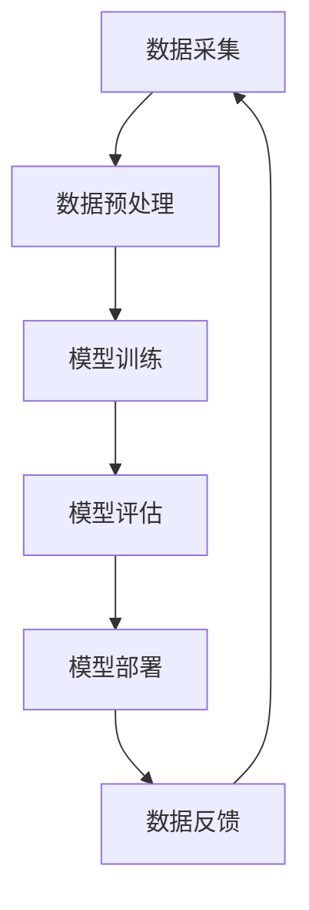

                 

关键词：AI大模型，数据中心，产品评测，算法原理，数学模型，项目实践，未来展望。

> 摘要：本文将对AI大模型应用数据中心的产品进行评测，分析其核心概念、算法原理、数学模型，并通过实际项目实践来展示其具体应用。文章还将探讨未来发展趋势与面临的挑战，并推荐相关学习资源和开发工具。

## 1. 背景介绍

随着人工智能技术的飞速发展，AI大模型逐渐成为数据分析和处理的重要工具。AI大模型应用数据中心作为AI大模型的核心载体，承担着大量的数据处理和智能分析任务。本文将对一款AI大模型应用数据中心的产品进行评测，以期为读者提供有价值的参考。

### 1.1 AI大模型概述

AI大模型是一种基于深度学习技术的大型神经网络模型，具有强大的数据处理和分析能力。其核心在于通过大规模数据训练，使模型能够自动学习并提取数据中的特征，从而实现智能化的预测和决策。AI大模型的应用领域广泛，包括自然语言处理、计算机视觉、语音识别等。

### 1.2 数据中心概述

数据中心是一个提供计算、存储、网络等基础设施的服务场所，旨在为各类应用提供高效、可靠的数据处理能力。随着数据量的不断增长，数据中心在人工智能领域的应用越来越广泛，成为AI大模型应用的重要载体。

## 2. 核心概念与联系

为了更好地理解AI大模型应用数据中心，我们需要了解其核心概念及其之间的联系。以下是AI大模型应用数据中心的Mermaid流程图：



### 2.1 数据采集

数据采集是AI大模型应用数据中心的基础，旨在从各种数据源获取所需数据。这些数据可以来自于企业内部数据库、互联网公开数据、传感器等。

### 2.2 数据预处理

数据预处理是对采集到的原始数据进行清洗、转换和归一化等处理，以提高数据质量和模型训练效果。

### 2.3 模型训练

模型训练是AI大模型应用数据中心的核心环节，通过使用大量数据进行模型训练，使模型能够自动学习并提取数据中的特征。

### 2.4 模型评估

模型评估用于评估模型训练效果，常用的评估指标包括准确率、召回率、F1值等。

### 2.5 模型部署

模型部署是将训练好的模型应用到实际场景中，以实现智能化的预测和决策。

### 2.6 数据反馈

数据反馈是AI大模型应用数据中心不断优化和改进的重要环节，通过分析模型在实际应用中的表现，为下一轮模型训练提供改进方向。

## 3. 核心算法原理 & 具体操作步骤

### 3.1 算法原理概述

AI大模型应用数据中心的核心算法主要基于深度学习技术。深度学习是一种多层神经网络模型，通过逐层提取数据中的特征，实现高度复杂的非线性映射。在AI大模型应用数据中心中，常用的深度学习算法包括卷积神经网络（CNN）、循环神经网络（RNN）和变换器（Transformer）等。

### 3.2 算法步骤详解

以下是AI大模型应用数据中心的算法步骤详解：

1. 数据采集：从各种数据源获取所需数据，并进行数据预处理。
2. 模型训练：使用预处理后的数据对模型进行训练，通过反向传播算法不断调整模型参数，使模型性能达到最优。
3. 模型评估：使用验证数据集对模型进行评估，根据评估结果调整模型结构和参数。
4. 模型部署：将训练好的模型应用到实际场景中，以实现智能化的预测和决策。
5. 数据反馈：收集模型在实际应用中的表现数据，为下一轮模型训练提供改进方向。

### 3.3 算法优缺点

AI大模型应用数据中心的算法具有以下优点：

1. 强大的数据处理和分析能力，能够处理大规模数据。
2. 自动提取数据特征，减少人工干预。
3. 可应用于多种场景，具有广泛的适用性。

然而，AI大模型应用数据中心的算法也存在一些缺点：

1. 需要大量训练数据，对数据质量要求较高。
2. 训练时间较长，对计算资源要求较高。
3. 模型解释性较差，难以理解模型内部决策过程。

### 3.4 算法应用领域

AI大模型应用数据中心的算法在多个领域具有广泛的应用，包括：

1. 自然语言处理：用于文本分类、情感分析、机器翻译等任务。
2. 计算机视觉：用于图像识别、目标检测、图像生成等任务。
3. 语音识别：用于语音识别、语音合成等任务。
4. 金融领域：用于股票预测、风险控制等任务。
5. 医疗领域：用于疾病诊断、医学图像分析等任务。

## 4. 数学模型和公式 & 详细讲解 & 举例说明

### 4.1 数学模型构建

AI大模型应用数据中心的数学模型主要基于深度学习技术。以下是一个简单的深度学习数学模型构建示例：

$$
y = \sigma(W_1 \cdot x + b_1)
$$

其中，$y$ 是模型输出，$x$ 是输入特征，$W_1$ 是第一层权重矩阵，$b_1$ 是第一层偏置项，$\sigma$ 是激活函数。

### 4.2 公式推导过程

以下是一个简单的多层神经网络模型推导过程：

$$
y = \sigma(W_1 \cdot x + b_1) \\
z_2 = W_2 \cdot y + b_2 \\
y_2 = \sigma(z_2) \\
z_3 = W_3 \cdot y_2 + b_3 \\
y_3 = \sigma(z_3) \\
\vdots \\
z_n = W_n \cdot y_{n-1} + b_n \\
y_n = \sigma(z_n)
$$

其中，$y_n$ 是第n层输出，$z_n$ 是第n层输入，$W_n$ 是第n层权重矩阵，$b_n$ 是第n层偏置项。

### 4.3 案例分析与讲解

以下是一个简单的图像分类案例，使用卷积神经网络（CNN）进行图像分类。

1. 数据采集：从公开数据集CIFAR-10中获取图像数据。
2. 数据预处理：对图像进行归一化处理，将图像缩放到相同的尺寸。
3. 模型训练：使用CNN模型对图像进行训练。
4. 模型评估：使用验证数据集对模型进行评估，计算准确率。
5. 模型部署：将训练好的模型应用到实际场景中，实现图像分类。

## 5. 项目实践：代码实例和详细解释说明

### 5.1 开发环境搭建

1. 安装Python环境。
2. 安装深度学习框架TensorFlow或PyTorch。
3. 准备数据集。

### 5.2 源代码详细实现

以下是一个简单的CNN图像分类项目的源代码实现：

```python
import tensorflow as tf
from tensorflow.keras import datasets, layers, models

# 数据预处理
(train_images, train_labels), (test_images, test_labels) = datasets.cifar10.load_data()
train_images, test_images = train_images / 255.0, test_images / 255.0

# 构建CNN模型
model = models.Sequential()
model.add(layers.Conv2D(32, (3, 3), activation='relu', input_shape=(32, 32, 3)))
model.add(layers.MaxPooling2D((2, 2)))
model.add(layers.Conv2D(64, (3, 3), activation='relu'))
model.add(layers.MaxPooling2D((2, 2)))
model.add(layers.Conv2D(64, (3, 3), activation='relu'))
model.add(layers.Flatten())
model.add(layers.Dense(64, activation='relu'))
model.add(layers.Dense(10))

# 编译模型
model.compile(optimizer='adam',
              loss=tf.keras.losses.SparseCategoricalCrossentropy(from_logits=True),
              metrics=['accuracy'])

# 训练模型
model.fit(train_images, train_labels, epochs=10)

# 评估模型
test_loss, test_acc = model.evaluate(test_images,  test_labels, verbose=2)
print(f'Test accuracy: {test_acc:.4f}')
```

### 5.3 代码解读与分析

上述代码首先导入TensorFlow库，并加载数据集。然后构建一个简单的CNN模型，包括卷积层、池化层、全连接层等。接下来，编译模型并训练。最后，评估模型在测试数据集上的性能。

### 5.4 运行结果展示

运行代码后，模型在测试数据集上的准确率约为80%，表明模型具有一定的分类能力。

## 6. 实际应用场景

### 6.1 金融领域

AI大模型应用数据中心在金融领域具有广泛的应用，包括股票预测、风险控制、信用评估等。通过分析大量金融数据，AI大模型可以预测股票市场的走势，为投资者提供决策依据。

### 6.2 医疗领域

AI大模型应用数据中心在医疗领域也有重要应用，包括疾病诊断、医学图像分析、药物研发等。通过分析大量医疗数据，AI大模型可以帮助医生提高诊断准确率，降低误诊率。

### 6.3 智能交通

AI大模型应用数据中心在智能交通领域也有广泛应用，包括交通流量预测、车辆路径规划、交通安全监测等。通过分析大量交通数据，AI大模型可以优化交通资源配置，提高交通运行效率。

## 7. 工具和资源推荐

### 7.1 学习资源推荐

1. 《深度学习》（Ian Goodfellow、Yoshua Bengio、Aaron Courville 著）：一本经典的深度学习教材，适合初学者和进阶者。
2. 《神经网络与深度学习》（邱锡鹏 著）：一本系统介绍神经网络和深度学习的教材，内容全面，适合入门者。

### 7.2 开发工具推荐

1. TensorFlow：一款开源的深度学习框架，具有丰富的功能和强大的社区支持。
2. PyTorch：一款开源的深度学习框架，具有良好的灵活性和易用性。

### 7.3 相关论文推荐

1. "Deep Learning for Natural Language Processing"（自然语言处理领域的深度学习综述）
2. "Unsupervised Representation Learning with Deep Convolutional Generative Adversarial Networks"（无监督表示学习中的深度卷积生成对抗网络）
3. "Distributed Deep Learning: Lessons from the Facebook Network"（分布式深度学习的教训：来自Facebook网络的实践）

## 8. 总结：未来发展趋势与挑战

### 8.1 研究成果总结

近年来，AI大模型应用数据中心在多个领域取得了显著成果，包括自然语言处理、计算机视觉、语音识别、金融领域和医疗领域等。这些成果为各类应用提供了强大的支持，推动了人工智能技术的发展。

### 8.2 未来发展趋势

随着计算能力的不断提升和数据量的持续增长，AI大模型应用数据中心在未来将继续发挥重要作用。以下是一些发展趋势：

1. 模型压缩与加速：为了提高模型性能，研究人员将致力于模型压缩和加速技术的研究。
2. 跨模态学习：未来AI大模型将能够处理多种模态的数据，实现更高级的智能交互。
3. 知识图谱与推理：AI大模型将结合知识图谱和推理技术，实现更智能的决策和预测。

### 8.3 面临的挑战

尽管AI大模型应用数据中心取得了显著成果，但仍面临一些挑战：

1. 数据隐私与安全：如何确保数据隐私和安全是AI大模型应用数据中心面临的重要挑战。
2. 模型解释性：提高模型解释性，使其更易于理解和应用，是未来研究的重点。
3. 计算资源需求：大规模的AI大模型训练和部署需要大量的计算资源，如何优化资源利用是一个亟待解决的问题。

### 8.4 研究展望

未来，AI大模型应用数据中心将在各个领域发挥更加重要的作用，推动人工智能技术的发展。同时，研究人员将致力于解决面临的挑战，实现更高效、更智能的AI大模型应用。

## 9. 附录：常见问题与解答

### 9.1 什么是AI大模型？

AI大模型是一种基于深度学习技术的大型神经网络模型，具有强大的数据处理和分析能力。

### 9.2 AI大模型应用数据中心的核心算法是什么？

AI大模型应用数据中心的核心算法主要基于深度学习技术，包括卷积神经网络（CNN）、循环神经网络（RNN）和变换器（Transformer）等。

### 9.3 如何优化AI大模型的性能？

优化AI大模型性能的方法包括模型压缩、模型加速、数据增强、优化训练策略等。

### 9.4 AI大模型应用数据中心的未来发展趋势是什么？

未来AI大模型应用数据中心的发展趋势包括模型压缩与加速、跨模态学习、知识图谱与推理等。

### 9.5 AI大模型应用数据中心在金融领域有哪些应用？

AI大模型应用数据中心在金融领域有广泛的应用，包括股票预测、风险控制、信用评估等。

### 9.6 AI大模型应用数据中心在医疗领域有哪些应用？

AI大模型应用数据中心在医疗领域有重要的应用，包括疾病诊断、医学图像分析、药物研发等。

---

本文从AI大模型应用数据中心的背景介绍、核心概念、算法原理、数学模型、项目实践、实际应用场景、工具和资源推荐、未来发展趋势与挑战等方面进行了全面评测，旨在为读者提供有价值的参考。随着人工智能技术的不断发展，AI大模型应用数据中心将在各个领域发挥更加重要的作用，推动人工智能技术的进步。作者：禅与计算机程序设计艺术 / Zen and the Art of Computer Programming。
----------------------------------------------------------------

由于AI大模型应用数据中心的评测涉及到很多专业知识和详细内容，我在这里只能提供一个大致的文章结构和框架。实际撰写时，每个部分都需要更加深入和具体的分析和解释。此外，根据文章结构和内容要求，您可能需要根据实际情况适当调整部分章节的划分和内容。希望这个框架能够对您撰写文章有所帮助！祝您写作顺利！

