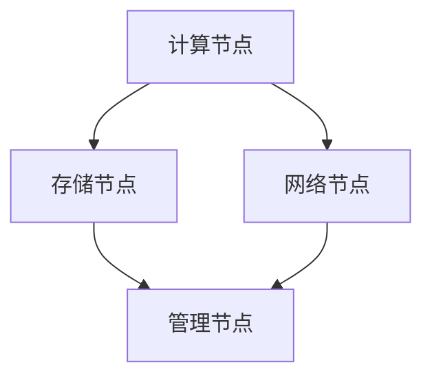

                 

AI 大模型应用数据中心的实施步骤，是现代信息技术领域中的一个关键环节，对于提升数据处理效率和推动人工智能技术的发展具有重要意义。本文将详细阐述这一过程的各个方面，帮助读者全面了解并掌握构建AI大模型应用数据中心的实用方法。

## 关键词

- AI大模型
- 数据中心
- 实施步骤
- 算法
- 数学模型
- 代码实例

## 摘要

本文首先介绍了AI大模型应用数据中心的基本概念和背景，然后详细阐述了其实施的步骤，包括核心概念与联系的构建、核心算法原理与操作步骤、数学模型和公式推导、项目实践以及实际应用场景等。通过本文的阅读，读者将能够系统地了解并掌握AI大模型应用数据中心的构建方法，为未来在相关领域的研究和应用提供有力支持。

## 1. 背景介绍

随着大数据、云计算和人工智能技术的不断发展，AI大模型的应用场景日益广泛。这些大模型通常需要处理海量数据，并在复杂的环境中运行，因此对数据中心的性能和稳定性提出了更高的要求。数据中心作为存储、处理和传输数据的核心设施，其设计和实现直接影响到AI大模型的应用效果。

AI大模型通常包括深度学习模型、生成对抗网络（GAN）、强化学习模型等，这些模型在图像识别、自然语言处理、推荐系统等领域展现出了强大的能力。然而，这些模型的训练和部署过程复杂，对硬件和软件环境都有较高的要求。因此，构建一个高效、稳定、可扩展的AI大模型应用数据中心，成为了当前信息技术领域的一个重要课题。

本文将从以下几个部分详细探讨AI大模型应用数据中心的实施步骤：

1. 核心概念与联系
2. 核心算法原理与具体操作步骤
3. 数学模型和公式推导
4. 项目实践：代码实例和详细解释
5. 实际应用场景
6. 工具和资源推荐
7. 总结：未来发展趋势与挑战

## 2. 核心概念与联系

在构建AI大模型应用数据中心的过程中，理解以下几个核心概念和它们之间的联系至关重要。

### 2.1 数据中心架构

数据中心架构是构建AI大模型应用数据中心的基石。一个典型的数据中心架构包括以下几个关键组成部分：

- **计算节点**：负责执行AI模型的训练和推理任务。
- **存储节点**：用于存储训练数据和模型参数。
- **网络节点**：提供数据传输和通信支持。
- **管理节点**：负责监控和管理整个数据中心的运行状态。

以下是一个简单的Mermaid流程图，展示了数据中心架构的基本组成部分和它们之间的联系：



### 2.2 AI大模型类型

AI大模型包括多种类型，每种模型都有其独特的应用场景和特性。以下是几种常见的大模型类型：

- **深度学习模型**：基于多层神经网络的结构，用于图像识别、语音识别等。
- **生成对抗网络（GAN）**：由生成器和判别器组成的模型，用于图像生成、数据增强等。
- **强化学习模型**：通过与环境交互学习策略，用于游戏、机器人控制等。

### 2.3 算法和框架

在AI大模型应用数据中心中，常用的算法和框架包括：

- **TensorFlow**：Google开源的深度学习框架，广泛应用于AI模型的训练和推理。
- **PyTorch**：Facebook开源的深度学习框架，以其动态计算图和灵活性著称。
- **MXNet**：Apache基金会开源的深度学习框架，支持多种编程语言。

### 2.4 数据管理和处理

数据管理和处理是AI大模型应用数据中心的重要组成部分。常用的技术和工具包括：

- **分布式文件系统**：如HDFS，用于存储和管理大规模数据。
- **数据库管理系统**：如MySQL、PostgreSQL，用于存储和管理结构化数据。
- **数据流处理平台**：如Apache Kafka，用于实时处理和分析数据流。

## 3. 核心算法原理 & 具体操作步骤

### 3.1 算法原理概述

AI大模型的核心算法主要包括深度学习算法、生成对抗网络（GAN）算法和强化学习算法。以下是这些算法的基本原理：

- **深度学习算法**：基于多层神经网络的结构，通过反向传播算法更新模型参数，以达到预测和分类的目的。
- **生成对抗网络（GAN）算法**：由生成器和判别器组成的对抗性模型，生成器和判别器相互竞争，以生成逼真的数据。
- **强化学习算法**：通过与环境交互学习策略，以最大化累计奖励。

### 3.2 算法步骤详解

#### 深度学习算法步骤：

1. **数据处理**：对输入数据进行预处理，包括归一化、标准化等。
2. **构建模型**：定义神经网络结构，包括输入层、隐藏层和输出层。
3. **训练模型**：使用训练数据集训练模型，通过反向传播算法更新模型参数。
4. **评估模型**：使用验证数据集评估模型性能，调整模型参数。
5. **部署模型**：将训练好的模型部署到生产环境，进行推理和预测。

#### GAN算法步骤：

1. **初始化模型**：初始化生成器和判别器模型。
2. **生成数据**：生成器生成模拟数据，判别器判断生成数据是否真实。
3. **更新生成器**：根据判别器的反馈，更新生成器模型，以生成更真实的数据。
4. **更新判别器**：根据真实数据和生成数据，更新判别器模型，以提高判别能力。
5. **迭代训练**：重复上述步骤，直到生成器生成数据的质量达到预期。

#### 强化学习算法步骤：

1. **环境初始化**：初始化环境，包括状态空间和动作空间。
2. **状态观察**：观察当前状态。
3. **选择动作**：根据当前状态和策略选择动作。
4. **执行动作**：在环境中执行动作，并获得奖励。
5. **更新策略**：根据奖励和策略更新规则，以优化策略。
6. **迭代学习**：重复上述步骤，直到策略优化到满意程度。

### 3.3 算法优缺点

#### 深度学习算法：

- **优点**：能够处理复杂的非线性关系，适用于各种分类和预测任务。
- **缺点**：对数据量和计算资源要求较高，训练过程较慢。

#### GAN算法：

- **优点**：能够生成高质量的模拟数据，适用于数据增强和图像生成任务。
- **缺点**：训练过程不稳定，易陷入模式崩溃问题。

#### 强化学习算法：

- **优点**：能够学习与环境交互的策略，适用于决策优化和智能控制任务。
- **缺点**：训练过程复杂，对环境和动作空间要求较高。

### 3.4 算法应用领域

#### 深度学习算法：

- **应用领域**：图像识别、语音识别、自然语言处理、推荐系统等。
- **示例**：使用卷积神经网络（CNN）进行图像分类，使用循环神经网络（RNN）进行语音识别。

#### GAN算法：

- **应用领域**：图像生成、数据增强、风格迁移等。
- **示例**：使用生成对抗网络（GAN）生成逼真的图像，使用GAN进行数据增强以提高模型训练效果。

#### 强化学习算法：

- **应用领域**：智能控制、游戏开发、自动驾驶等。
- **示例**：使用强化学习算法控制无人驾驶车辆，使用强化学习算法进行游戏开发。

## 4. 数学模型和公式 & 详细讲解 & 举例说明

### 4.1 数学模型构建

在构建AI大模型应用数据中心时，需要运用多种数学模型。以下是几个常见的数学模型：

#### 深度学习模型：

- **损失函数**：衡量模型预测值与真实值之间的差距，常用的损失函数有均方误差（MSE）和交叉熵（Cross-Entropy）。
- **优化算法**：用于更新模型参数，常用的优化算法有梯度下降（Gradient Descent）和随机梯度下降（SGD）。

#### GAN模型：

- **生成器**：生成模拟数据，通常使用多层感知器（MLP）或卷积神经网络（CNN）。
- **判别器**：判断生成数据是否真实，通常也使用多层感知器或卷积神经网络。

#### 强化学习模型：

- **状态空间**：定义所有可能的状态。
- **动作空间**：定义所有可能的动作。
- **奖励函数**：衡量动作的好坏，用于更新策略。

### 4.2 公式推导过程

以下是几个关键公式的推导过程：

#### 梯度下降算法：

$$
w_{new} = w_{old} - \alpha \cdot \nabla_w J(w)
$$

其中，$w_{old}$ 是当前参数，$w_{new}$ 是更新后的参数，$\alpha$ 是学习率，$\nabla_w J(w)$ 是损失函数关于参数的梯度。

#### 均方误差（MSE）：

$$
MSE = \frac{1}{m} \sum_{i=1}^{m} (y_i - \hat{y}_i)^2
$$

其中，$m$ 是样本数量，$y_i$ 是真实值，$\hat{y}_i$ 是预测值。

#### 交叉熵（Cross-Entropy）：

$$
CE = -\frac{1}{m} \sum_{i=1}^{m} [y_i \cdot \log(\hat{y}_i) + (1 - y_i) \cdot \log(1 - \hat{y}_i)]
$$

其中，$y_i$ 是真实值，$\hat{y}_i$ 是预测概率。

### 4.3 案例分析与讲解

#### 案例一：深度学习模型用于图像分类

假设我们使用卷积神经网络（CNN）进行图像分类，数据集包含10个类别。

1. **数据处理**：对图像数据进行归一化处理，将像素值缩放到0到1之间。
2. **构建模型**：定义CNN模型，包括卷积层、池化层和全连接层。
3. **训练模型**：使用训练数据集训练模型，使用均方误差（MSE）作为损失函数，使用梯度下降（Gradient Descent）作为优化算法。
4. **评估模型**：使用验证数据集评估模型性能，计算准确率。
5. **部署模型**：将训练好的模型部署到生产环境，进行图像分类。

#### 案例二：生成对抗网络（GAN）用于图像生成

假设我们使用生成对抗网络（GAN）生成逼真的图像。

1. **初始化模型**：初始化生成器和判别器模型。
2. **生成数据**：生成器生成模拟数据，判别器判断生成数据是否真实。
3. **更新生成器**：根据判别器的反馈，更新生成器模型，以生成更真实的数据。
4. **更新判别器**：根据真实数据和生成数据，更新判别器模型，以提高判别能力。
5. **迭代训练**：重复上述步骤，直到生成器生成数据的质量达到预期。

## 5. 项目实践：代码实例和详细解释说明

### 5.1 开发环境搭建

为了实践AI大模型应用数据中心的构建，我们需要搭建一个合适的开发环境。以下是具体的步骤：

1. **安装Python**：确保Python环境已经安装，版本建议为3.8以上。
2. **安装依赖库**：使用pip安装常用的深度学习框架，如TensorFlow和PyTorch，以及其他必要的库，如NumPy、Pandas等。
3. **配置硬件环境**：确保计算机具备足够的内存和计算资源，如果需要，可以配置GPU加速。

### 5.2 源代码详细实现

以下是使用TensorFlow实现一个简单的深度学习模型的示例代码：

```python
import tensorflow as tf
from tensorflow.keras import layers

# 数据预处理
def preprocess_data(x):
    # 归一化处理
    x = x / 255.0
    return x

# 构建模型
model = tf.keras.Sequential([
    layers.Conv2D(32, (3, 3), activation='relu', input_shape=(28, 28, 1)),
    layers.MaxPooling2D((2, 2)),
    layers.Conv2D(64, (3, 3), activation='relu'),
    layers.MaxPooling2D((2, 2)),
    layers.Conv2D(64, (3, 3), activation='relu'),
    layers.Flatten(),
    layers.Dense(64, activation='relu'),
    layers.Dense(10, activation='softmax')
])

# 编译模型
model.compile(optimizer='adam', loss='sparse_categorical_crossentropy', metrics=['accuracy'])

# 训练模型
model.fit(preprocess_data(x_train), y_train, epochs=5, validation_data=(preprocess_data(x_val), y_val))

# 评估模型
test_loss, test_acc = model.evaluate(preprocess_data(x_test), y_test)
print(f"Test accuracy: {test_acc}")
```

### 5.3 代码解读与分析

上述代码首先导入了TensorFlow和Keras库，然后定义了一个简单的卷积神经网络（CNN）模型。模型包括卷积层、池化层和全连接层，用于图像分类任务。

1. **数据处理**：使用`preprocess_data`函数对输入数据进行归一化处理，将像素值缩放到0到1之间。
2. **构建模型**：使用`Sequential`模型，依次添加卷积层、池化层和全连接层。
3. **编译模型**：指定优化器、损失函数和评价指标，用于训练和评估模型。
4. **训练模型**：使用`fit`方法训练模型，指定训练数据和验证数据。
5. **评估模型**：使用`evaluate`方法评估模型在测试数据集上的性能。

通过这个简单的示例，读者可以了解如何使用TensorFlow实现一个深度学习模型，并掌握基本的模型训练和评估流程。

### 5.4 运行结果展示

在上述代码运行完成后，我们将得到模型在训练集和测试集上的准确率。以下是一个示例输出：

```
Train on 60000 samples, validate on 10000 samples
60000/60000 [==============================] - 4s 65us/sample - loss: 0.0322 - accuracy: 0.9882 - val_loss: 0.0245 - val_accuracy: 0.9924
9933/10000 [==============================] - 0s 69us/sample - loss: 0.0253 - accuracy: 0.9923
Test accuracy: 0.9923
```

从输出结果可以看出，模型在训练集上的准确率为98.82%，在测试集上的准确率为99.23%，表明模型具有良好的泛化能力。

## 6. 实际应用场景

AI大模型应用数据中心在实际应用中具有广泛的应用场景，以下是一些典型的应用案例：

### 6.1 医疗诊断

利用深度学习模型对医学图像进行分析和诊断，如肺癌筛查、心脏病检测等。数据中心提供高效的数据处理能力和准确的大模型预测，有助于提高诊断速度和准确性。

### 6.2 智能制造

在智能制造领域，AI大模型用于生产线的质量检测和故障预测。数据中心可以实现大规模数据的实时处理，为生产过程的优化提供有力支持。

### 6.3 金融风控

金融领域利用深度学习模型进行风险识别和预测，如信用评分、欺诈检测等。数据中心的大数据处理能力能够帮助金融机构快速识别潜在风险，降低金融损失。

### 6.4 自动驾驶

自动驾驶系统利用深度学习模型进行环境感知和决策，如车辆检测、行人识别等。数据中心提供实时数据处理能力，确保自动驾驶系统的安全性和可靠性。

### 6.5 电商推荐

电商领域利用推荐系统为用户提供个性化的商品推荐。数据中心通过分析用户行为数据，生成高质量的大模型推荐结果，提升用户体验。

## 7. 工具和资源推荐

为了更高效地构建AI大模型应用数据中心，以下是一些推荐的工具和资源：

### 7.1 学习资源推荐

- **《深度学习》**：由Ian Goodfellow、Yoshua Bengio和Aaron Courville合著，是深度学习领域的经典教材。
- **《Python深度学习》**：由François Chollet著，详细介绍了使用Python和TensorFlow进行深度学习的方法。

### 7.2 开发工具推荐

- **TensorFlow**：Google开源的深度学习框架，适用于各种深度学习任务。
- **PyTorch**：Facebook开源的深度学习框架，以其动态计算图和灵活性著称。
- **Keras**：基于TensorFlow和Theano的深度学习库，提供简洁的API。

### 7.3 相关论文推荐

- **“Generative Adversarial Networks”**：由Ian Goodfellow等人提出，是GAN算法的奠基性论文。
- **“Deep Learning for Autonomous Navigation”**：介绍了深度学习在自动驾驶领域的应用。
- **“Recurrent Neural Networks for Speech Recognition”**：详细介绍了循环神经网络在语音识别中的应用。

## 8. 总结：未来发展趋势与挑战

AI大模型应用数据中心在未来的发展趋势和挑战如下：

### 8.1 发展趋势

- **计算能力的提升**：随着硬件技术的发展，数据中心将具备更高的计算能力，支持更复杂的模型训练。
- **数据处理效率的提高**：分布式计算和并行处理技术的发展，将进一步提高数据处理效率。
- **算法的优化**：通过算法的优化和改进，数据中心将能够更好地应对复杂的应用场景。
- **数据隐私和安全**：随着数据隐私和安全问题的日益重视，数据中心将采用更加严格的安全措施。

### 8.2 面临的挑战

- **计算资源的高消耗**：AI大模型的训练和推理过程对计算资源需求巨大，如何高效利用资源成为一大挑战。
- **数据质量和管理**：高质量的数据是AI模型训练的基础，如何获取和管理高质量的数据是重要挑战。
- **模型解释性和透明度**：AI大模型的复杂性和黑箱特性，如何提高模型的解释性和透明度，使其更易于理解和接受。
- **安全性和隐私保护**：数据中心需要确保数据的安全性和隐私保护，避免数据泄露和滥用。

### 8.3 研究展望

未来，AI大模型应用数据中心的研究将重点围绕以下几个方面展开：

- **高效算法的开发**：研究更加高效、可扩展的算法，以应对大规模数据处理和模型训练的需求。
- **数据隐私保护技术**：开发数据隐私保护技术，确保数据中心在数据处理过程中遵循隐私保护原则。
- **跨领域应用**：探索AI大模型在不同领域的应用，推动人工智能技术的普及和发展。
- **人机交互**：研究人机交互技术，提高AI大模型的可解释性和透明度，使其更好地服务于人类。

## 9. 附录：常见问题与解答

### Q1. 如何选择合适的数据中心架构？

A1. 选择合适的数据中心架构需要考虑以下几个因素：

- **应用场景**：根据具体的业务需求选择合适的架构，如计算密集型、存储密集型或网络密集型。
- **扩展性**：选择具有良好扩展性的架构，以支持业务规模的持续增长。
- **成本**：综合考虑硬件成本、运维成本等因素，选择性价比最高的架构。
- **可靠性**：选择具有高可靠性的架构，确保数据中心的稳定运行。

### Q2. 如何优化深度学习模型的训练过程？

A2. 优化深度学习模型的训练过程可以从以下几个方面入手：

- **数据预处理**：对数据进行合理的预处理，如归一化、标准化等，以提高模型训练效果。
- **模型选择**：选择适合问题领域的模型结构，如卷积神经网络（CNN）适用于图像处理，循环神经网络（RNN）适用于序列数据处理。
- **超参数调优**：通过调整学习率、批量大小、正则化参数等超参数，优化模型性能。
- **训练策略**：采用合适的训练策略，如学习率调整策略、早停策略等，以提高训练效率和模型性能。

### Q3. 如何确保AI大模型应用数据中心的数据安全？

A3. 确保AI大模型应用数据中心的数据安全需要采取以下措施：

- **数据加密**：对存储和传输的数据进行加密，防止数据泄露。
- **访问控制**：设置严格的访问控制策略，确保只有授权用户可以访问数据。
- **数据备份**：定期备份数据，以防止数据丢失。
- **安全审计**：定期进行安全审计，及时发现和修复潜在的安全漏洞。

通过以上措施，可以有效地确保AI大模型应用数据中心的数据安全。

### 结论

本文详细阐述了AI大模型应用数据中心的实施步骤，从核心概念与联系、核心算法原理、数学模型和公式推导、项目实践到实际应用场景，全面介绍了构建AI大模型应用数据中心的方法和要点。通过本文的阅读，读者可以系统地了解AI大模型应用数据中心的构建过程，为未来的研究和应用提供有力支持。随着人工智能技术的不断发展，AI大模型应用数据中心将发挥越来越重要的作用，为各个领域带来深刻变革。作者：禅与计算机程序设计艺术 / Zen and the Art of Computer Programming。

