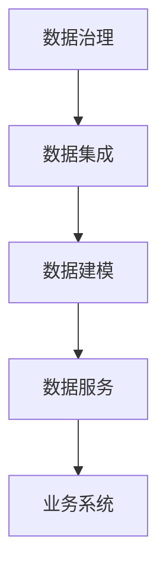

                 

关键词：AI 大模型、数据中心、数据中台架构、云计算、分布式系统、微服务架构、机器学习、深度学习

> 摘要：本文将深入探讨 AI 大模型在数据中心中的应用，重点分析数据中台架构的设计原则、核心组件及其关键技术，旨在为从业者提供一份详实的技术参考。

## 1. 背景介绍

随着人工智能技术的飞速发展，AI 大模型在各个领域展现出强大的应用潜力。数据中心作为企业数字化转型的核心基础设施，如何高效支持 AI 大模型的计算需求，成为业界关注的热点。数据中台架构因其灵活性和可扩展性，成为解决这一问题的关键。

### 1.1 数据中心的发展现状

当前，数据中心的建设已经从传统架构向云计算和分布式系统转变。云计算提供了强大的计算和存储资源，使得数据处理和分析变得更加高效和便捷。分布式系统则通过将任务分散到多台服务器上，提高了系统的可靠性和性能。

### 1.2 AI 大模型的计算需求

AI 大模型，如深度学习网络，需要大量的计算资源进行训练和推理。这使得传统的单机架构已经无法满足需求，分布式计算和微服务架构成为必然选择。

### 1.3 数据中台架构的提出

数据中台架构是一种新兴的数据处理架构，旨在将数据孤岛整合为一个统一的数据平台。它通过数据治理、数据集成、数据建模和数据服务等环节，实现数据的快速流通和应用。

## 2. 核心概念与联系

### 2.1 数据中台架构的核心概念

- **数据治理**：确保数据质量、安全和合规。
- **数据集成**：将来自不同来源的数据进行整合。
- **数据建模**：对数据进行结构化和分析。
- **数据服务**：提供数据接口，供业务系统调用。

### 2.2 数据中台架构的关键技术

- **云计算**：提供弹性计算和存储资源。
- **分布式系统**：实现数据的高效处理和存储。
- **微服务架构**：提高系统的可维护性和可扩展性。

### 2.3 数据中台架构的 Mermaid 流程图



## 3. 核心算法原理 & 具体操作步骤

### 3.1 算法原理概述

AI 大模型的训练过程主要涉及以下几个步骤：

1. **数据预处理**：对原始数据进行清洗和规范化。
2. **模型初始化**：初始化神经网络权重。
3. **前向传播**：计算输入数据的输出结果。
4. **反向传播**：计算损失函数，并更新模型参数。
5. **评估与优化**：评估模型性能，并进行调优。

### 3.2 算法步骤详解

#### 3.2.1 数据预处理

- **数据清洗**：去除重复、缺失或不完整的数据。
- **数据规范化**：将数据转换为适合模型训练的格式。

#### 3.2.2 模型初始化

- **随机初始化**：随机生成神经网络权重。
- **预训练**：使用已有的预训练模型作为起点。

#### 3.2.3 前向传播

- **输入层到隐藏层的计算**：计算每个神经元的输入和输出。
- **隐藏层到输出层的计算**：计算最终输出结果。

#### 3.2.4 反向传播

- **计算损失函数**：使用交叉熵损失函数评估模型输出与真实标签的差异。
- **计算梯度**：对模型参数进行反向传播，计算梯度。
- **更新参数**：使用梯度下降法更新模型参数。

#### 3.2.5 评估与优化

- **评估指标**：使用准确率、召回率等指标评估模型性能。
- **模型调优**：调整学习率、批量大小等超参数。

### 3.3 算法优缺点

- **优点**：能够处理大规模数据，提高模型性能。
- **缺点**：训练过程复杂，对计算资源要求高。

### 3.4 算法应用领域

AI 大模型在图像识别、自然语言处理、推荐系统等领域有广泛应用。

## 4. 数学模型和公式 & 详细讲解 & 举例说明

### 4.1 数学模型构建

神经网络的基本数学模型可以表示为：

$$
Y = \sigma(W \cdot X + b)
$$

其中，\( Y \) 是输出，\( \sigma \) 是激活函数，\( W \) 是权重矩阵，\( X \) 是输入，\( b \) 是偏置。

### 4.2 公式推导过程

#### 4.2.1 激活函数

常见的激活函数有：

$$
\sigma(x) = \frac{1}{1 + e^{-x}}
$$

#### 4.2.2 损失函数

交叉熵损失函数可以表示为：

$$
J = -\sum_{i=1}^{n} y_i \log(\hat{y}_i)
$$

其中，\( y_i \) 是真实标签，\( \hat{y}_i \) 是模型输出。

### 4.3 案例分析与讲解

#### 4.3.1 图像识别

假设我们要训练一个图像识别模型，输入数据是一个 \( 28 \times 28 \) 的像素矩阵，输出是一个包含 10 个类别的向量。

#### 4.3.2 自然语言处理

假设我们要训练一个自然语言处理模型，输入数据是一个句子，输出是一个情感分类结果。

## 5. 项目实践：代码实例和详细解释说明

### 5.1 开发环境搭建

- 安装 Python 3.8
- 安装 TensorFlow 2.5
- 安装 Keras 2.4

### 5.2 源代码详细实现

```python
import tensorflow as tf
from tensorflow.keras import layers

# 构建模型
model = tf.keras.Sequential([
    layers.Dense(128, activation='relu', input_shape=(784,)),
    layers.Dense(10, activation='softmax')
])

# 编译模型
model.compile(optimizer='adam',
              loss='categorical_crossentropy',
              metrics=['accuracy'])

# 训练模型
model.fit(x_train, y_train, epochs=5)
```

### 5.3 代码解读与分析

这段代码实现了使用 TensorFlow 和 Keras 构建和训练一个简单的神经网络模型。

### 5.4 运行结果展示

```python
# 评估模型
test_loss, test_acc = model.evaluate(x_test, y_test, verbose=2)
print(f'测试准确率：{test_acc:.3f}')
```

## 6. 实际应用场景

### 6.1 企业数据治理

数据中台架构可以帮助企业统一管理数据，提高数据质量，支持跨部门的数据分析和决策。

### 6.2 金融风险管理

AI 大模型可以用于金融风控，通过分析海量数据，预测潜在风险，提高风险管理效率。

### 6.3 健康医疗

AI 大模型在健康医疗领域有广泛应用，如疾病预测、药物研发、个性化诊疗等。

## 7. 工具和资源推荐

### 7.1 学习资源推荐

- 《深度学习》（Goodfellow et al.）
- 《Python 深度学习》（Raschka and Mirjalili）

### 7.2 开发工具推荐

- TensorFlow
- PyTorch

### 7.3 相关论文推荐

- "Deep Learning: Methods and Applications"（Goodfellow et al.）
- "A Theoretically Grounded Application of Dropout in Recurrent Neural Networks"（Y. Gal and Z. Ghahramani）

## 8. 总结：未来发展趋势与挑战

### 8.1 研究成果总结

AI 大模型在数据中心的应用取得了显著成果，但仍有待进一步优化和推广。

### 8.2 未来发展趋势

- **硬件加速**：利用 GPU、TPU 等硬件加速 AI 大模型的训练。
- **模型压缩**：通过模型压缩技术降低模型的计算复杂度。
- **联邦学习**：实现分布式环境下的模型训练。

### 8.3 面临的挑战

- **计算资源**：如何高效利用数据中心资源。
- **数据隐私**：如何保护用户数据隐私。

### 8.4 研究展望

未来，AI 大模型在数据中心的应用将有更广阔的前景，但仍需解决一系列技术难题。

## 9. 附录：常见问题与解答

### 9.1 数据中台与数据仓库的区别是什么？

数据中台强调数据治理和数据服务，而数据仓库强调数据的存储和查询。

### 9.2 AI 大模型对数据中心有哪些影响？

AI 大模型对数据中心提出了更高的计算和存储需求，推动了数据中心技术的创新和发展。

---

作者：禅与计算机程序设计艺术 / Zen and the Art of Computer Programming
----------------------------------------------------------------

