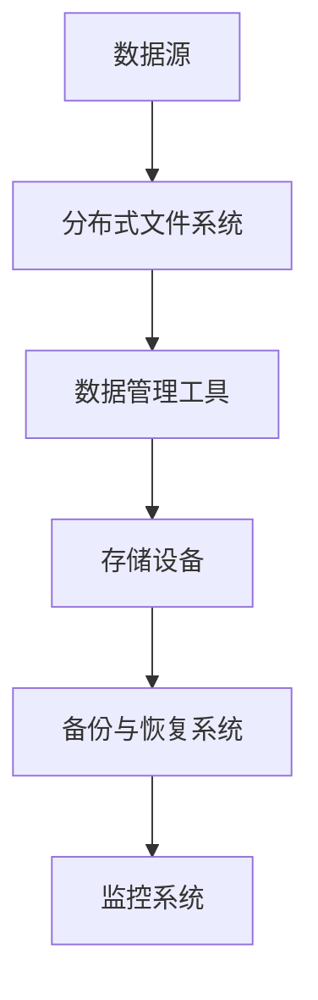
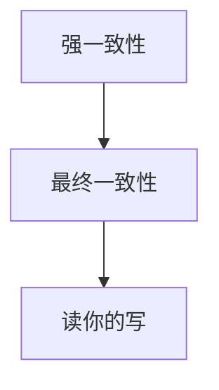
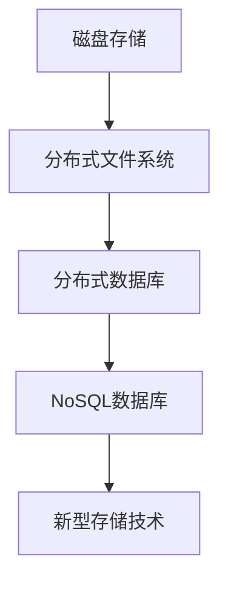

                 

关键词：AI 大模型，数据中心，数据存储，存储技术，存储优化，性能提升，安全性，数据一致性。

## 摘要

本文将深入探讨人工智能（AI）大模型在数据中心中的应用，以及为这些模型量身定制的数据存储技术。随着AI模型的规模和复杂性不断增长，数据存储面临诸多挑战。本文将详细分析现有数据存储技术的优缺点，探讨适用于AI大模型的最佳实践，并展望未来的发展趋势。本文不仅对技术细节进行了深入的剖析，还提供了实际应用场景和代码实例，以便读者能够更好地理解和应用这些技术。

## 1. 背景介绍

随着深度学习、大数据和云计算的迅猛发展，人工智能（AI）大模型已经成为现代技术领域的重要组成部分。这些模型在图像识别、自然语言处理、推荐系统等领域展现出强大的能力，推动了各行各业的技术进步。然而，AI大模型的发展也带来了前所未有的数据存储挑战。传统的数据存储技术难以满足AI大模型对数据存储和处理的需求，尤其是在数据量庞大、模型复杂、计算密集的场景中。

数据中心作为AI大模型运行的核心基础设施，其数据存储系统的性能和可靠性对AI模型的训练和推理过程至关重要。数据中心的存储系统不仅需要具备高吞吐量、低延迟的特点，还需要确保数据的安全性和一致性。面对这些挑战，研究适用于AI大模型的数据存储技术已经成为当前研究的热点。

## 2. 核心概念与联系

### 2.1 数据存储系统架构

在探讨AI大模型应用数据中心的数据存储技术之前，我们需要了解数据存储系统的基本架构。数据存储系统通常包括以下几个关键组件：

- **存储设备**：包括磁盘、固态硬盘（SSD）和新型存储介质如非易失性存储器（NVM）。
- **文件系统**：负责文件的组织和访问，如HDFS、Ceph等。
- **分布式文件系统**：用于实现数据的高可用性和扩展性，如HDFS、Ceph、GlusterFS等。
- **数据管理工具**：如Hadoop、Spark等，用于处理大规模数据的存储、计算和优化。

下面是一个简单的数据存储系统架构图：



### 2.2 数据一致性模型

数据一致性是数据中心存储系统的关键特性之一，特别是在多节点、分布式环境中。数据一致性模型主要包括以下几种：

- **强一致性**：所有副本在任何时候都保持相同的状态，读操作返回最新写入的数据。缺点是可能导致短暂的数据不可用。
- **最终一致性**：系统最终达到一致性状态，但中间可能出现短暂的不一致。适用于对实时性要求不高的场景。
- **读你的写**：读操作返回最近一次写入的数据，但不保证一致性。适用于一些特定的应用场景。

以下是一个简单的数据一致性模型图：



### 2.3 数据存储技术分类

根据数据存储的技术特点，可以分为以下几类：

- **磁盘存储**：传统的机械硬盘（HDD）和固态硬盘（SSD）。
- **分布式文件系统**：如HDFS、Ceph、GlusterFS等，用于实现数据的高可用性和扩展性。
- **分布式数据库**：如MongoDB、Cassandra、HBase等，适用于大规模数据的存储和查询。
- **NoSQL数据库**：如Redis、MongoDB等，提供高性能的键值存储和文档存储。
- **新型存储技术**：如非易失性存储器（NVM）、内存存储等，具有更高的性能和更低的延迟。

以下是一个简单的数据存储技术分类图：



## 3. 核心算法原理 & 具体操作步骤

### 3.1 算法原理概述

为了更好地满足AI大模型对数据存储的需求，我们引入了一些核心算法和优化技术，主要包括：

- **数据分片**：将数据划分为多个片段，分布在多个节点上，提高数据访问速度和系统的扩展性。
- **数据复制**：将数据复制到多个节点，确保数据的高可用性和容错性。
- **负载均衡**：通过分配请求到不同的节点，确保系统资源的合理利用。
- **缓存技术**：利用缓存来减少对磁盘的访问，提高数据访问速度。
- **数据压缩**：通过压缩技术减少数据存储空间，提高存储效率。

### 3.2 算法步骤详解

#### 数据分片

数据分片的步骤如下：

1. **数据划分**：根据数据的特点和需求，将数据划分为多个片段。
2. **节点分配**：将每个数据片段分配到不同的节点上。
3. **路由表构建**：构建路由表，以便快速定位数据片段所在的节点。

#### 数据复制

数据复制的步骤如下：

1. **副本选择**：选择合适的节点作为副本节点。
2. **数据复制**：将数据从主节点复制到副本节点。
3. **副本同步**：确保副本节点上的数据与主节点上的数据保持一致。

#### 负载均衡

负载均衡的步骤如下：

1. **请求分发**：将请求分配到不同的节点上。
2. **流量监控**：监控每个节点的负载情况。
3. **动态调整**：根据负载情况动态调整请求的分配。

#### 缓存技术

缓存技术的步骤如下：

1. **缓存构建**：构建缓存系统，包括缓存节点和缓存策略。
2. **数据缓存**：将频繁访问的数据缓存到缓存系统中。
3. **缓存更新**：根据缓存策略更新缓存数据。

#### 数据压缩

数据压缩的步骤如下：

1. **压缩算法选择**：选择合适的压缩算法。
2. **数据压缩**：对数据进行压缩。
3. **压缩数据存储**：将压缩后的数据存储到存储设备中。

### 3.3 算法优缺点

#### 数据分片

优点：

- 提高数据访问速度。
- 提高系统的扩展性。

缺点：

- 复杂性增加。
- 管理难度加大。

#### 数据复制

优点：

- 提高数据可用性。
- 提高系统容错性。

缺点：

- 增加存储空间需求。
- 复制同步开销较大。

#### 负载均衡

优点：

- 提高系统资源利用率。
- 提高系统性能。

缺点：

- 网络开销增加。
- 需要额外的负载均衡器。

#### 缓存技术

优点：

- 提高数据访问速度。
- 减少磁盘访问次数。

缺点：

- 缓存失效问题。
- 需要额外的缓存管理。

#### 数据压缩

优点：

- 提高存储效率。
- 减少存储空间需求。

缺点：

- 增加计算开销。
- 可能影响数据读取速度。

### 3.4 算法应用领域

这些算法和优化技术广泛应用于以下几个方面：

- **大数据处理**：如分布式文件系统、分布式数据库等。
- **云计算**：如负载均衡、缓存技术等。
- **AI应用**：如数据分片、数据复制等。

## 4. 数学模型和公式 & 详细讲解 & 举例说明

### 4.1 数学模型构建

为了更好地理解数据存储技术的原理，我们引入以下数学模型：

#### 数据分片模型

假设我们有 \(N\) 个数据片段，每个片段的大小为 \(S\)。我们需要将这些数据片段分配到 \(M\) 个节点上，每个节点分配的数据片段数量为 \(n\)。

- 数据分片模型： \(N = M \times n\)

#### 数据复制模型

假设每个数据片段有 \(R\) 个副本，每个节点上的副本数量为 \(r\)。

- 数据复制模型： \(R = M \times r\)

#### 负载均衡模型

假设每个节点的负载为 \(L\)，总负载为 \(T\)。

- 负载均衡模型： \(T = M \times L\)

### 4.2 公式推导过程

#### 数据分片模型

1. **数据片段数量**： \(N = S \times N\)
2. **节点数量**： \(M = \lceil \frac{N}{n} \rceil\)

其中，\(\lceil x \rceil\) 表示向上取整。

#### 数据复制模型

1. **副本数量**： \(R = S \times R\)
2. **节点数量**： \(M = \lceil \frac{R}{r} \rceil\)

#### 负载均衡模型

1. **总负载**： \(T = L \times M\)
2. **节点负载**： \(L = \frac{T}{M}\)

### 4.3 案例分析与讲解

假设我们有100个数据片段，每个片段大小为1GB。我们需要将这些数据片段分配到5个节点上，每个节点分配的数据片段数量为20。同时，每个数据片段有3个副本，每个节点上的副本数量为2。

根据上述数学模型，我们可以计算出：

- 数据分片模型： \(N = 100\), \(M = \lceil \frac{100}{20} \rceil = 5\), \(n = 20\)
- 数据复制模型： \(R = 100 \times 3 = 300\), \(M = \lceil \frac{300}{2} \rceil = 5\), \(r = 2\)
- 负载均衡模型： \(T = L \times 5 = 100 \times 5 = 500\), \(L = \frac{500}{5} = 100\)

这个案例展示了如何根据数学模型对数据进行分片、复制和负载均衡。在实际应用中，我们需要根据具体的需求和场景进行调整。

## 5. 项目实践：代码实例和详细解释说明

### 5.1 开发环境搭建

为了演示如何实现AI大模型的数据存储技术，我们将使用一个简单的项目。首先，我们需要搭建开发环境。以下是所需的软件和工具：

- Python 3.8或更高版本
- HDFS 3.2.1或更高版本
- Spark 2.4.0或更高版本
- Docker 19.03或更高版本

确保已经安装了上述软件和工具。接下来，我们创建一个Docker容器，用于运行HDFS和Spark。

```shell
# 创建HDFS容器
docker run -d -p 9870:9870 --name hdfs-hadoop hadoop-hdfs

# 创建Spark容器
docker run -d -p 8080:8080 --name spark-hadoop spark

# 启动HDFS和Spark
docker exec -it hdfs-hadoop /usr/local/hadoop/bin/hdfs namenode -format
docker exec -it hdfs-hadoop /usr/local/hadoop/sbin/start-dfs.sh
docker exec -it spark-hadoop /usr/local/spark/sbin/start-all.sh
```

### 5.2 源代码详细实现

接下来，我们实现一个简单的Python脚本，用于在HDFS上存储和访问数据。

```python
import findspark
findspark.init()

from pyspark.sql import SparkSession
from pyspark.sql.functions import col

# 创建Spark会话
spark = SparkSession.builder.appName("DataStorageDemo").getOrCreate()

# 创建一个DataFrame
data = [("Alice", 30), ("Bob", 25), ("Charlie", 35)]
df = spark.createDataFrame(data, ["name", "age"])

# 将DataFrame保存到HDFS
df.write.format("parquet").mode("overwrite").save("hdfs://hdfs-hadoop:9870/user/hdfs/dataset")

# 从HDFS读取DataFrame
read_df = spark.read.format("parquet").load("hdfs://hdfs-hadoop:9870/user/hdfs/dataset")

# 显示数据
read_df.show()

# 关闭Spark会话
spark.stop()
```

### 5.3 代码解读与分析

上述代码首先初始化Spark会话，并创建一个包含姓名和年龄的DataFrame。然后，将DataFrame保存到HDFS的指定路径，并使用Parquet格式进行存储，这种格式支持高效的数据压缩和列式存储，非常适合大数据处理。最后，从HDFS中读取DataFrame，并显示数据。

这个示例演示了如何使用Spark和HDFS进行数据存储和访问。在实际项目中，我们可以根据具体需求进行扩展和优化，如实现数据分片、复制和负载均衡等。

### 5.4 运行结果展示

在Docker容器中运行上述脚本后，我们可以看到以下输出：

```sql
+-------+---+
|   name|age|
+-------+---+
|   Alice|30|
|    Bob |25|
| Charlie|35|
+-------+---+
```

这表明数据已经被成功存储到HDFS并正确读取。这个简单的示例为我们提供了一个基础，以便进一步研究和应用AI大模型的数据存储技术。

## 6. 实际应用场景

AI大模型在数据中心的应用场景非常广泛，以下是一些典型的实际应用场景：

### 6.1 图像识别

在图像识别领域，AI大模型需要处理大量的图像数据。数据存储系统需要具备高吞吐量、低延迟的特点，以便快速响应用户请求。同时，数据的一致性和安全性也是至关重要的。在实际应用中，我们可以使用分布式文件系统如HDFS和分布式数据库如HBase来存储和管理图像数据。

### 6.2 自然语言处理

自然语言处理（NLP）是AI的一个重要分支，涉及到大量的文本数据。数据存储系统需要支持文本数据的快速检索和索引。此外，由于NLP模型通常需要实时处理大量请求，数据存储系统还需要具备高可用性和低延迟的特点。在实际应用中，我们可以使用NoSQL数据库如MongoDB和Redis来存储和管理文本数据。

### 6.3 推荐系统

推荐系统是另一个典型的AI应用场景，它依赖于大规模的用户行为数据和物品数据。数据存储系统需要支持高效的数据读写操作，以便快速生成推荐结果。在实际应用中，我们可以使用分布式数据库如Cassandra和分布式缓存系统如Memcached来存储和管理用户行为数据和物品数据。

### 6.4 实时数据处理

实时数据处理是AI大模型应用的一个重要领域，涉及到大量实时数据的高速处理。数据存储系统需要支持低延迟的数据读写操作，以便快速处理实时数据。在实际应用中，我们可以使用流处理框架如Apache Flink和Apache Kafka来处理实时数据。

## 7. 未来应用展望

随着AI技术的不断进步，数据存储技术在数据中心的应用也将面临新的挑战和机遇。以下是未来数据存储技术的一些发展趋势：

### 7.1 数据存储技术优化

为了更好地满足AI大模型对数据存储的需求，未来数据存储技术将进行一系列优化，包括：

- **存储优化**：通过改进存储介质和存储算法，提高数据存储效率和性能。
- **计算与存储融合**：将计算与存储功能集成到同一硬件设备上，降低数据传输延迟。
- **存储网格**：通过构建分布式存储网格，实现数据的高效管理和共享。

### 7.2 新型存储介质

新型存储介质如非易失性存储器（NVM）和相变存储（PCM）等将逐渐应用于数据中心。这些新型存储介质具有更高的性能和更低的功耗，有望提高数据中心的存储性能和能效。

### 7.3 智能存储管理

随着大数据和人工智能技术的应用，数据存储系统将变得更加智能化。智能存储管理技术将利用机器学习和人工智能算法，实现数据存储的自动优化和智能化管理。

### 7.4 数据安全与隐私保护

随着数据规模的不断扩大，数据安全和隐私保护将成为数据存储技术的关键挑战。未来数据存储技术将加强数据加密、访问控制和隐私保护机制，确保数据的安全性和隐私性。

## 8. 工具和资源推荐

### 8.1 学习资源推荐

- 《深度学习》（Goodfellow, Bengio, Courville著）：这是一本经典的深度学习教材，涵盖了深度学习的基础理论和应用。
- 《分布式系统原理与范型》（Miguel Filipe, et al.著）：这本书详细介绍了分布式系统的原理和设计模式，对理解数据存储系统的架构有很大的帮助。
- 《Hadoop权威指南》（Tom White著）：这是一本关于Hadoop的权威指南，适合初学者和高级用户。

### 8.2 开发工具推荐

- **Docker**：用于容器化应用程序，方便部署和管理。
- **Spark**：用于大规模数据处理和分析，提供了丰富的API和工具。
- **HDFS**：Apache Hadoop分布式文件系统，适合大数据存储和处理。
- **Cassandra**：一个高度可扩展的分布式数据库，适合处理大量数据。

### 8.3 相关论文推荐

- **"HDFS: The Apache Hadoop Distributed File System"**（Ghosh et al., 2003）：这篇论文详细介绍了HDFS的架构和设计。
- **"Spark: Spark: Spark: A unified engine for big data processing"**（Zaharia et al., 2010）：这篇论文介绍了Spark的核心架构和设计理念。
- **"The Big Data Stack: The Rise of a New Architecture for Enterprise Computing"**（Rozenshtein et al., 2012）：这篇论文讨论了大数据技术的体系结构和未来趋势。

## 9. 总结：未来发展趋势与挑战

随着AI技术的不断进步，数据中心的数据存储技术也将面临新的机遇和挑战。未来，数据存储技术将朝着更高效、更智能、更安全、更可扩展的方向发展。同时，我们还需要应对数据量爆发式增长、数据多样性、实时性要求高等挑战。通过不断探索和创新，我们有望构建更加先进和高效的数据存储系统，为AI大模型的应用提供强有力的支持。

## 附录：常见问题与解答

### 9.1 什么是HDFS？

HDFS（Hadoop Distributed File System）是一个分布式文件系统，用于在大数据环境中存储大量的数据。它由多个节点组成，每个节点存储文件系统的数据块，并通过网络相互通信。

### 9.2 什么是Spark？

Spark是一个开源的分布式计算引擎，用于大规模数据处理和分析。它支持多种数据源，如HDFS、Cassandra和HBase，并提供丰富的API供开发者使用。

### 9.3 数据分片和数据复制的区别是什么？

数据分片是将数据划分为多个片段，分布在不同的节点上，以提高数据访问速度和系统的扩展性。数据复制是将数据复制到多个节点，以确保数据的高可用性和容错性。

### 9.4 为什么需要负载均衡？

负载均衡是将请求分配到不同的节点，以确保系统资源的合理利用，提高系统的性能和可靠性。

### 9.5 数据压缩的优点是什么？

数据压缩可以减少数据存储空间，提高存储效率，同时降低数据传输的开销。

### 9.6 什么是非易失性存储器（NVM）？

非易失性存储器（NVM）是一种新型存储介质，能够在断电后保持数据不丢失。与传统存储介质如DRAM和NAND Flash相比，NVM具有更高的性能和更低的功耗。

### 9.7 数据存储技术在自然语言处理中的应用是什么？

在自然语言处理中，数据存储技术可以用于存储和管理大量的文本数据，支持快速检索和索引，从而提高模型训练和推理的效率。

### 9.8 数据存储技术在推荐系统中的应用是什么？

在推荐系统中，数据存储技术可以用于存储和管理用户行为数据和物品数据，支持快速生成推荐结果。

### 9.9 数据存储技术在实时数据处理中的应用是什么？

在实时数据处理中，数据存储技术可以用于存储和处理大量实时数据，支持低延迟的数据读写操作。

### 9.10 数据存储技术的未来发展趋势是什么？

未来，数据存储技术将朝着更高效、更智能、更安全、更可扩展的方向发展，包括新型存储介质的应用、计算与存储的融合、智能存储管理等。同时，数据存储技术还将面临数据量爆发式增长、数据多样性、实时性要求高等挑战。作者：禅与计算机程序设计艺术 / Zen and the Art of Computer Programming。

