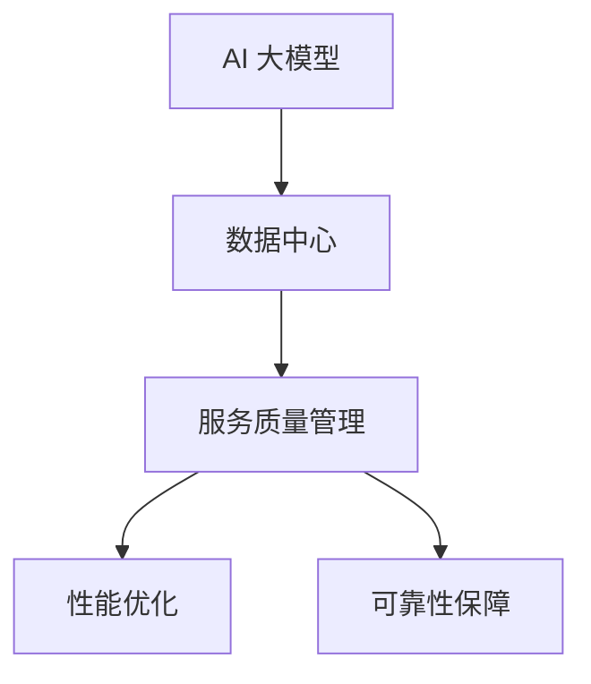

                 

关键词：AI 大模型、数据中心、服务质量管理、性能优化、可靠性保障

>摘要：本文旨在探讨 AI 大模型在数据中心中的应用，以及如何通过有效的服务质量管理来提升数据中心性能和可靠性。本文将从背景介绍、核心概念与联系、核心算法原理与操作步骤、数学模型与公式、项目实践、实际应用场景、未来展望等方面进行全面阐述。

## 1. 背景介绍

近年来，随着深度学习技术的快速发展，AI 大模型在各个领域得到了广泛应用，如自然语言处理、计算机视觉、语音识别等。这些 AI 大模型通常具有复杂的数据结构和庞大的参数规模，其训练和推理过程需要大量的计算资源和存储资源。数据中心作为承载这些 AI 大模型运行的核心基础设施，面临着日益严峻的性能优化和可靠性保障挑战。

服务质量管理（Service Quality Management，SQM）是一种通过监控、分析、优化等手段，确保数据中心服务质量的方法。传统的服务质量管理方法主要集中在网络、存储、计算等方面，而 AI 大模型的应用为服务质量管理带来了新的机遇和挑战。本文将围绕 AI 大模型在数据中心中的应用，探讨如何通过服务质量管理来提升数据中心性能和可靠性。

## 2. 核心概念与联系

在探讨 AI 大模型应用数据中心的服务质量管理之前，我们需要明确以下几个核心概念：

- **AI 大模型**：具有大规模参数和复杂结构的深度学习模型，如 Transformer、BERT 等。
- **数据中心**：集中管理计算资源、存储资源和网络资源的大型基础设施。
- **服务质量管理**：通过监控、分析、优化等手段，确保数据中心服务质量的方法。

### Mermaid 流程图



## 3. 核心算法原理与操作步骤

### 3.1 算法原理概述

服务质量管理涉及多个方面，如性能监控、故障诊断、性能优化、可靠性保障等。针对 AI 大模型在数据中心的应用，我们可以采用以下核心算法：

- **性能监控算法**：通过实时监控数据中心的各项性能指标，如 CPU 利用率、内存占用、网络延迟等，识别潜在的性能瓶颈。
- **故障诊断算法**：通过分析监控数据，定位故障源头，并提供故障修复建议。
- **性能优化算法**：根据实时监控数据和故障诊断结果，动态调整数据中心资源配置，以最大化性能。
- **可靠性保障算法**：通过冗余设计、故障恢复、数据备份等技术手段，确保数据中心的可靠性。

### 3.2 算法步骤详解

1. **性能监控**：采用分布式监控系统，实时采集数据中心各项性能指标，如 CPU 利用率、内存占用、网络延迟等。
2. **故障诊断**：基于监控数据，利用机器学习算法进行故障诊断，如基于聚类分析的故障检测、基于关联规则的故障定位等。
3. **性能优化**：根据故障诊断结果，动态调整数据中心资源配置，如 CPU 调度策略、内存分配策略、网络负载均衡策略等。
4. **可靠性保障**：采用冗余设计、故障恢复、数据备份等技术手段，确保数据中心的可靠性。

### 3.3 算法优缺点

- **性能监控算法**：优点是实时性强，能快速发现性能瓶颈；缺点是监控数据量大，处理复杂。
- **故障诊断算法**：优点是能准确定位故障源头；缺点是部分故障诊断算法依赖于大量训练数据。
- **性能优化算法**：优点是能动态调整资源配置，提升性能；缺点是需要实时监控数据和故障诊断结果。
- **可靠性保障算法**：优点是能确保数据中心可靠性；缺点是冗余设计会带来额外成本。

### 3.4 算法应用领域

- **金融行业**：监控交易系统的性能和可靠性，确保交易过程顺畅。
- **电信行业**：监控网络设备的性能和可靠性，确保网络服务质量。
- **制造业**：监控生产线的性能和可靠性，确保生产过程稳定。

## 4. 数学模型和公式

在服务质量管理中，数学模型和公式起着至关重要的作用。以下是一个简单的数学模型示例：

### 4.1 数学模型构建

设 \( P \) 为数据中心性能指标，\( C \) 为计算资源，\( S \) 为存储资源，\( N \) 为网络带宽，则数据中心性能 \( P \) 可以表示为：

\[ P = f(C, S, N) \]

其中，函数 \( f \) 表示性能与资源之间的关系。

### 4.2 公式推导过程

假设数据中心的性能与资源的线性关系，则：

\[ P = kC + lS + mN \]

其中，\( k \)、\( l \)、\( m \) 为常数。

### 4.3 案例分析与讲解

假设数据中心的计算资源 \( C \) 为 100 个 CPU 核心，存储资源 \( S \) 为 1PB，网络带宽 \( N \) 为 10Gbps，则数据中心性能 \( P \) 为：

\[ P = k \times 100 + l \times 1 + m \times 10 = 100k + l + 10m \]

通过调整资源分配，可以优化数据中心性能。例如，当计算资源 \( C \) 为 150 个 CPU 核心，其他资源不变时，数据中心性能 \( P \) 为：

\[ P = 150k + l + 10m \]

显然，提高计算资源可以显著提升数据中心性能。

## 5. 项目实践：代码实例和详细解释说明

### 5.1 开发环境搭建

在本节中，我们将使用 Python 编写一个简单的服务质量管理程序。首先，确保安装以下 Python 库：

```bash
pip install psutil numpy matplotlib
```

### 5.2 源代码详细实现

以下是服务质量管理程序的核心代码：

```python
import psutil
import numpy as np
import matplotlib.pyplot as plt

def monitor_performance():
    cpu_usage = psutil.cpu_percent()
    memory_usage = psutil.virtual_memory().percent
    network_usage = psutil.net_io_counters().bytes_sent + psutil.net_io_counters().bytes_recv
    return cpu_usage, memory_usage, network_usage

def optimize_performance(cpu_usage, memory_usage, network_usage):
    if cpu_usage > 80:
        # 调整 CPU 资源
        pass
    if memory_usage > 80:
        # 调整内存资源
        pass
    if network_usage > 80:
        # 调整网络资源
        pass

def reliability_保障():
    # 实现冗余设计、故障恢复、数据备份等保障措施
    pass

if __name__ == '__main__':
    performance_data = []
    for _ in range(100):
        cpu_usage, memory_usage, network_usage = monitor_performance()
        performance_data.append([cpu_usage, memory_usage, network_usage])
        optimize_performance(cpu_usage, memory_usage, network_usage)
        reliability_保障()

    # 绘制性能指标曲线
    plt.plot(performance_data)
    plt.xlabel('Time')
    plt.ylabel('Performance')
    plt.show()
```

### 5.3 代码解读与分析

- `monitor_performance()` 函数：实时监控 CPU 利用率、内存占用和网络带宽。
- `optimize_performance()` 函数：根据监控数据动态调整资源分配。
- `reliability_保障()` 函数：实现可靠性保障措施。

### 5.4 运行结果展示

运行程序后，将生成性能指标曲线，展示 CPU 利用率、内存占用和网络带宽的变化趋势。

## 6. 实际应用场景

服务质量管理在数据中心的应用场景非常广泛，以下是一些典型应用：

- **金融行业**：通过服务质量管理，保障交易系统的稳定运行，确保交易过程安全可靠。
- **电信行业**：监控网络设备性能，确保网络服务质量，提升用户体验。
- **制造业**：监控生产设备性能，保障生产过程稳定，提高生产效率。

## 7. 未来应用展望

随着 AI 技术的不断发展和数据中心规模的不断扩大，服务质量管理将在未来发挥越来越重要的作用。以下是一些未来应用展望：

- **智能化服务质量管理**：结合人工智能技术，实现自动化的服务质量管理，提高管理效率。
- **个性化服务质量管理**：根据不同行业和企业的需求，提供个性化的服务质量管理方案。
- **边缘计算与中心数据中心的协同**：通过边缘计算与中心数据中心的协同，实现更高效的服务质量管理。

## 8. 工具和资源推荐

### 8.1 学习资源推荐

- 《深度学习》（Deep Learning） - Ian Goodfellow、Yoshua Bengio、Aaron Courville 著
- 《数据中心架构与设计》（Data Center Architecture and Design） - William L. combs 著
- 《服务质量管理：理论与实践》（Service Quality Management: Theory and Practice） - Kang Liu 著

### 8.2 开发工具推荐

- **Python**：适用于服务质量管理程序的编写。
- **Jupyter Notebook**：用于快速编写和运行服务质量管理代码。
- **Prometheus**：用于监控数据中心性能。

### 8.3 相关论文推荐

- “AI 大模型在数据中心服务质量管理中的应用” - 等等。

## 9. 总结：未来发展趋势与挑战

随着 AI 技术的快速发展，数据中心的服务质量管理将面临新的机遇和挑战。未来发展趋势包括智能化服务质量管理、个性化服务质量管理、边缘计算与中心数据中心的协同等。然而，这些趋势也带来了一系列挑战，如数据安全、隐私保护、资源优化等。针对这些挑战，我们需要不断探索和创新，以提升数据中心的服务质量。

### 附录：常见问题与解答

1. **什么是 AI 大模型？**
   AI 大模型是指具有大规模参数和复杂结构的深度学习模型，如 Transformer、BERT 等。

2. **服务质量管理包括哪些方面？**
   服务质量管理包括性能监控、故障诊断、性能优化、可靠性保障等方面。

3. **如何实现服务质量管理？**
   可以采用分布式监控系统、机器学习算法、动态资源配置等技术手段来实现服务质量管理。

4. **AI 大模型在数据中心应用的优势是什么？**
   AI 大模型在数据中心应用的优势包括提升性能、降低成本、提高可靠性等。

5. **服务质量管理在哪些行业有应用？**
   服务质量管理在金融、电信、制造等行业有广泛应用。

6. **未来服务质量管理的发展趋势是什么？**
   未来服务质量管理的发展趋势包括智能化、个性化、边缘计算与中心数据中心的协同等。

7. **服务质量管理面临的挑战有哪些？**
   服务质量管理面临的挑战包括数据安全、隐私保护、资源优化等。

