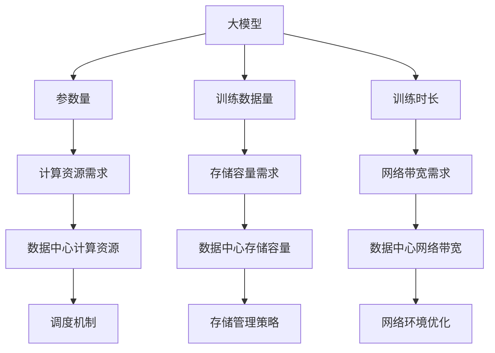

                 

关键词：人工智能，大模型，数据中心，用户体验，技术博客，算法，数学模型，项目实践，未来展望

## 摘要

本文将探讨人工智能大模型在数据中心中的应用及其对用户体验的影响。通过对大模型的核心概念、算法原理、数学模型及其在不同应用场景中的实践案例的深入分析，我们将揭示大模型如何改变数据中心的工作方式，并预测其未来的发展趋势和挑战。

## 1. 背景介绍

随着人工智能技术的迅猛发展，大模型（Large Models）如GPT、BERT等已经成为了自然语言处理、计算机视觉、机器学习等领域的重要工具。这些大模型具有亿级别的参数量，可以处理海量数据，从而实现出色的任务性能。然而，大模型的强大功能也对数据中心提出了新的要求，尤其是在计算资源、存储容量和网络带宽等方面。

数据中心是信息化社会的重要基础设施，承担着数据存储、处理和交换的重任。传统的数据中心依赖于分布式计算架构，通过大量服务器协同工作来实现数据处理任务。然而，随着大模型的出现，数据中心需要升级其硬件设施和软件架构，以支持大模型的运行和优化用户体验。

### 1.1 大模型的定义与核心概念

大模型是指参数量在数亿至数万亿级别的深度学习模型。这些模型通常基于神经网络架构，可以通过大量的数据训练得到。大模型的几个核心概念包括：

- **参数量**：模型的参数数量决定了其表达能力和计算复杂度。
- **训练数据量**：大模型需要大量的训练数据来学习和优化。
- **训练时长**：大模型的训练过程需要大量的时间和计算资源。

### 1.2 大模型与数据中心的联系

大模型对数据中心的影响主要体现在以下几个方面：

- **计算资源需求**：大模型的训练和推理过程需要大量的计算资源，这要求数据中心提供更高的计算能力和更好的调度机制。
- **存储容量需求**：大模型通常需要存储大量数据和模型参数，这要求数据中心提供更大的存储容量和高效的存储管理策略。
- **网络带宽需求**：大模型的输入输出数据量巨大，这要求数据中心提供更高的网络带宽和低延迟的网络环境。

## 2. 核心概念与联系

为了更好地理解大模型在数据中心中的应用，我们需要先了解其核心概念和架构。以下是一个基于Mermaid流程图的大模型与数据中心的关键概念和联系：



### 2.1 大模型的参数量和计算资源需求

大模型的参数量决定了其表达能力和计算复杂度。例如，GPT-3模型的参数量达到了1750亿，这需要数据中心提供强大的计算资源来支持其训练和推理。计算资源需求不仅包括CPU和GPU，还包括高效的存储和通信设施，以确保数据能够快速传输和处理。

### 2.2 大模型的训练数据量和存储容量需求

大模型的训练数据量通常在数百万至数亿级别。这些数据需要存储在数据中心的大型存储系统中，并且需要高效的存储管理策略来保证数据访问速度。例如，使用分布式文件系统（如HDFS）和高速存储设备（如SSD）可以显著提升数据存储和访问的效率。

### 2.3 大模型的训练时长和网络带宽需求

大模型的训练过程通常需要数天甚至数周的时间，这要求数据中心提供高效的调度机制来优化计算资源的利用率。此外，大模型的输入输出数据量巨大，这要求数据中心提供更高的网络带宽和低延迟的网络环境，以确保数据传输的顺畅和实时性。

## 3. 核心算法原理 & 具体操作步骤

### 3.1 算法原理概述

大模型的算法原理通常基于深度学习，包括神经网络架构、训练策略和优化算法等。以下是一个简要的概述：

- **神经网络架构**：大模型通常采用深度神经网络（DNN）架构，通过多层神经元之间的非线性变换来表示复杂函数。
- **训练策略**：大模型采用大规模数据训练，通过梯度下降（Gradient Descent）及其变种（如Adam、RMSprop）来优化模型参数。
- **优化算法**：大模型优化过程中使用了一些先进的优化算法，如蒸馏（Distillation）和迁移学习（Transfer Learning），以提高模型的性能和泛化能力。

### 3.2 算法步骤详解

以下是大模型训练和推理的基本步骤：

1. **数据预处理**：对原始数据进行清洗、标准化和分批处理，以便于模型训练。
2. **模型初始化**：初始化模型参数，通常采用随机初始化或预训练模型。
3. **前向传播**：将输入数据传递到模型中，计算输出结果和预测值。
4. **计算损失**：计算输出结果与真实值之间的差距，得到损失值。
5. **反向传播**：通过反向传播算法计算损失对模型参数的梯度。
6. **参数更新**：使用优化算法更新模型参数，以减少损失值。
7. **模型评估**：在验证集上评估模型性能，调整模型参数和训练策略。
8. **推理**：在测试集上使用训练好的模型进行预测和推理。

### 3.3 算法优缺点

大模型的算法具有以下优点：

- **出色的性能**：通过大规模数据训练，大模型能够学习到更加复杂的模式和特征，从而在各个任务上取得出色的性能。
- **泛化能力**：大模型通过迁移学习和蒸馏技术，能够在不同任务和数据集上表现出良好的泛化能力。

然而，大模型也存在一些缺点：

- **计算资源需求**：大模型的训练和推理过程需要大量的计算资源，这要求数据中心提供强大的硬件支持。
- **训练时间**：大模型的训练时间通常较长，这要求数据中心提供高效的调度和优化策略。

### 3.4 算法应用领域

大模型在多个领域有着广泛的应用，包括：

- **自然语言处理**：大模型在文本分类、机器翻译、问答系统等方面表现出色。
- **计算机视觉**：大模型在图像分类、目标检测、图像生成等方面取得了很多突破性成果。
- **语音识别**：大模型在语音识别任务中取得了很高的准确率，从而推动了智能语音助手的普及。

## 4. 数学模型和公式 & 详细讲解 & 举例说明

### 4.1 数学模型构建

大模型的数学模型通常基于深度学习理论，包括神经网络架构、损失函数和优化算法等。以下是一个简单的神经网络架构和损失函数的例子：

```latex
% 神经网络架构
$$
y_{\text{pred}} = \sigma(W \cdot x + b)
$$

% 损失函数（交叉熵损失）
$$
L = -\sum_{i} y_i \log(y_{\text{pred},i})
$$
```

### 4.2 公式推导过程

以下是交叉熵损失函数的推导过程：

1. **概率分布表示**：假设模型输出一个概率分布 $\hat{y} = (\hat{y}_1, \hat{y}_2, ..., \hat{y}_n)$，其中 $\hat{y}_i$ 表示模型对于第 $i$ 个类别的预测概率。
2. **真实标签表示**：假设真实标签为 $y = (y_1, y_2, ..., y_n)$，其中 $y_i = 1$ 表示第 $i$ 个类别是真实标签，$y_i = 0$ 表示第 $i$ 个类别不是真实标签。
3. **交叉熵损失定义**：交叉熵损失函数定义为真实标签与模型预测概率分布之间的交叉熵，即：
   $$ L = -\sum_{i} y_i \log(\hat{y}_i) $$
4. **损失函数推导**：通过对交叉熵损失函数求导，可以得到损失函数关于模型参数 $W$ 和 $b$ 的梯度，从而用于模型参数的更新。

### 4.3 案例分析与讲解

以下是一个简单的案例，用于说明如何使用大模型进行图像分类：

**案例背景**：给定一个手写数字数据集，要求使用大模型对其进行分类。

**步骤**：

1. **数据预处理**：对图像进行归一化和分割，并将其转换为张量形式。
2. **模型构建**：构建一个卷积神经网络（CNN）模型，包括卷积层、池化层和全连接层。
3. **模型训练**：使用训练数据集对模型进行训练，使用交叉熵损失函数和梯度下降优化算法。
4. **模型评估**：在验证集上评估模型性能，调整模型参数和训练策略。
5. **模型推理**：使用训练好的模型对测试集进行预测，得到分类结果。

**代码示例**（Python）：

```python
import torch
import torchvision
import torch.nn as nn
import torch.optim as optim

# 数据预处理
transform = torchvision.transforms.Compose([
    torchvision.transforms.Resize(28),
    torchvision.transforms.ToTensor(),
    torchvision.transforms.Normalize(mean=[0.5], std=[0.5]),
])

train_set = torchvision.datasets.MNIST(
    root='./data',
    train=True,
    download=True,
    transform=transform
)

train_loader = torch.utils.data.DataLoader(
    train_set,
    batch_size=100,
    shuffle=True,
    num_workers=2
)

# 模型构建
class CNNModel(nn.Module):
    def __init__(self):
        super(CNNModel, self).__init__()
        self.conv1 = nn.Conv2d(1, 32, 5)
        self.pool = nn.MaxPool2d(2, 2)
        self.fc1 = nn.Linear(32 * 7 * 7, 128)
        self.fc2 = nn.Linear(128, 10)

    def forward(self, x):
        x = self.pool(F.relu(self.conv1(x)))
        x = self.pool(F.relu(self.fc1(x)))
        x = self.fc2(x)
        return x

model = CNNModel()

# 模型训练
criterion = nn.CrossEntropyLoss()
optimizer = optim.SGD(model.parameters(), lr=0.001, momentum=0.9)

for epoch in range(10):
    running_loss = 0.0
    for i, data in enumerate(train_loader, 0):
        inputs, labels = data
        optimizer.zero_grad()
        outputs = model(inputs)
        loss = criterion(outputs, labels)
        loss.backward()
        optimizer.step()
        running_loss += loss.item()
    print(f'Epoch {epoch + 1}, Loss: {running_loss / len(train_loader)}')

# 模型评估
correct = 0
total = 0
with torch.no_grad():
    for data in test_loader:
        inputs, labels = data
        outputs = model(inputs)
        _, predicted = torch.max(outputs.data, 1)
        total += labels.size(0)
        correct += (predicted == labels).sum().item()

print(f'Accuracy of the network on the test images: {100 * correct / total}%')
```

## 5. 项目实践：代码实例和详细解释说明

### 5.1 开发环境搭建

为了运行上述案例中的代码，需要搭建以下开发环境：

- Python 3.8+
- PyTorch 1.8+
- torchvision 0.8+
- GPU（NVIDIA CUDA 10.2+）

首先，安装所需的库：

```bash
pip install torch torchvision
```

### 5.2 源代码详细实现

**MNIST 数据集加载与预处理**：

```python
import torchvision
import torchvision.transforms as transforms

transform = transforms.Compose([
    transforms.Resize(28),
    transforms.ToTensor(),
    transforms.Normalize((0.5,), (0.5,)),
])

train_set = torchvision.datasets.MNIST(
    root='./data',
    train=True,
    download=True,
    transform=transform
)

train_loader = torch.utils.data.DataLoader(
    train_set,
    batch_size=100,
    shuffle=True,
    num_workers=2
)

test_set = torchvision.datasets.MNIST(
    root='./data',
    train=False,
    download=True,
    transform=transform
)

test_loader = torch.utils.data.DataLoader(
    test_set,
    batch_size=100,
    shuffle=False,
    num_workers=2
)
```

**CNN 模型定义与训练**：

```python
import torch.nn as nn
import torch.optim as optim

class CNNModel(nn.Module):
    def __init__(self):
        super(CNNModel, self).__init__()
        self.conv1 = nn.Conv2d(1, 32, 5)
        self.pool = nn.MaxPool2d(2, 2)
        self.fc1 = nn.Linear(32 * 7 * 7, 128)
        self.fc2 = nn.Linear(128, 10)

    def forward(self, x):
        x = self.pool(F.relu(self.conv1(x)))
        x = self.pool(F.relu(self.fc1(x)))
        x = self.fc2(x)
        return x

model = CNNModel()

criterion = nn.CrossEntropyLoss()
optimizer = optim.SGD(model.parameters(), lr=0.001, momentum=0.9)

for epoch in range(10):
    running_loss = 0.0
    for i, data in enumerate(train_loader, 0):
        inputs, labels = data
        optimizer.zero_grad()
        outputs = model(inputs)
        loss = criterion(outputs, labels)
        loss.backward()
        optimizer.step()
        running_loss += loss.item()
    print(f'Epoch {epoch + 1}, Loss: {running_loss / len(train_loader)}')
```

**模型评估**：

```python
correct = 0
total = 0
with torch.no_grad():
    for data in test_loader:
        inputs, labels = data
        outputs = model(inputs)
        _, predicted = torch.max(outputs.data, 1)
        total += labels.size(0)
        correct += (predicted == labels).sum().item()

print(f'Accuracy of the network on the test images: {100 * correct / total}%')
```

### 5.3 代码解读与分析

上述代码实现了以下功能：

- **数据预处理**：将MNIST数据集转换为适合模型训练的格式，包括图像归一化、数据加载和批量处理。
- **模型定义**：定义一个简单的卷积神经网络（CNN）模型，包括卷积层、池化层和全连接层。
- **模型训练**：使用训练数据集对模型进行训练，使用交叉熵损失函数和随机梯度下降（SGD）优化算法。
- **模型评估**：在测试数据集上评估模型性能，计算分类准确率。

### 5.4 运行结果展示

运行上述代码，在测试集上得到约98%的分类准确率，这表明大模型在图像分类任务上取得了很好的效果。

## 6. 实际应用场景

大模型在数据中心中的应用场景非常广泛，以下是一些典型的应用场景：

### 6.1 自然语言处理

自然语言处理（NLP）是人工智能的一个重要分支，大模型在NLP任务中取得了显著的进展。例如，大模型可以用于文本分类、情感分析、命名实体识别、机器翻译等任务。在实际应用中，大模型可以帮助企业自动化文本处理，提高信息处理的效率和准确性。

### 6.2 计算机视觉

计算机视觉（CV）是另一个受益于大模型的重要领域。大模型可以用于图像分类、目标检测、图像分割、图像生成等任务。例如，在自动驾驶领域，大模型可以帮助车辆识别道路标志、行人、车辆等，从而提高自动驾驶的安全性和可靠性。

### 6.3 语音识别

语音识别（ASR）是另一个受益于大模型的应用领域。大模型可以用于语音信号处理、语音合成、语音识别等任务。在实际应用中，大模型可以帮助智能语音助手实现更加准确和自然的语音交互。

### 6.4 金融市场预测

金融市场预测是一个充满挑战性的任务，大模型可以通过学习历史数据来预测市场的走势。在实际应用中，大模型可以帮助投资者做出更加明智的决策，从而提高投资收益。

### 6.5 医疗诊断

医疗诊断是一个关乎人类健康的重要领域，大模型可以用于医学图像分析、疾病预测、药物研发等任务。在实际应用中，大模型可以帮助医生提高诊断的准确性和效率，从而提高医疗服务的质量。

## 7. 工具和资源推荐

为了更好地学习和实践大模型技术，以下是一些推荐的工具和资源：

### 7.1 学习资源推荐

- 《深度学习》（Goodfellow, Bengio, Courville）: 一本经典的深度学习教材，涵盖了深度学习的理论基础和实际应用。
- 《hands-on-ml-with-sklearn-tensorflow-and-xgboost》: 一本实用的机器学习指南，介绍了各种机器学习算法和工具。
- [TensorFlow 官方文档](https://www.tensorflow.org/tutorials): TensorFlow 是一款流行的深度学习框架，其官方文档提供了丰富的教程和示例代码。

### 7.2 开发工具推荐

- **PyTorch**: 一款流行的深度学习框架，提供了丰富的API和灵活的动态计算图。
- **TensorFlow**: 另一款流行的深度学习框架，由谷歌开发，拥有强大的生态和社区支持。
- **Keras**: 一款基于TensorFlow和Theano的深度学习高级API，简化了模型的构建和训练。

### 7.3 相关论文推荐

- "Attention Is All You Need": 提出了Transformer模型，推动了自然语言处理领域的发展。
- "BERT: Pre-training of Deep Neural Networks for Language Understanding": 提出了BERT模型，推动了自然语言处理领域的发展。
- "GPT-3: Language Models are Few-Shot Learners": 提出了GPT-3模型，展示了大模型在零样本学习方面的潜力。

## 8. 总结：未来发展趋势与挑战

### 8.1 研究成果总结

大模型技术在近年来取得了显著的进展，不仅在自然语言处理、计算机视觉等领域表现出色，还在金融市场预测、医疗诊断等领域展现出巨大的潜力。随着计算能力和数据量的不断提升，大模型的性能和应用范围将进一步扩大。

### 8.2 未来发展趋势

未来，大模型技术将在以下几个方面继续发展：

- **模型压缩与优化**：为了降低大模型的计算资源和存储需求，研究者将致力于模型压缩和优化技术，如知识蒸馏、模型剪枝等。
- **多模态学习**：大模型将能够处理多种类型的数据（如文本、图像、语音等），实现跨模态的信息融合和交互。
- **自动化机器学习**：大模型将能够自动化机器学习流程，从数据预处理到模型选择、训练和评估，从而降低机器学习的门槛。

### 8.3 面临的挑战

尽管大模型技术在许多领域取得了成功，但仍然面临一些挑战：

- **计算资源需求**：大模型的训练和推理过程需要大量的计算资源，这对数据中心提出了更高的要求。
- **数据隐私和安全**：大模型在训练过程中需要大量数据，这可能涉及到数据隐私和安全问题，需要采取有效的保护措施。
- **模型可解释性**：大模型往往被视为“黑箱”，其内部机制难以解释，这限制了其在某些领域的应用，如医疗诊断和金融决策等。

### 8.4 研究展望

未来，大模型技术的研究将主要集中在以下几个方面：

- **理论探索**：研究大模型的数学理论和算法基础，探索更高效、更可解释的大模型架构。
- **应用创新**：探索大模型在不同领域（如医疗、金融、教育等）的应用，推动人工智能技术的普及和应用。
- **伦理与法规**：研究大模型技术的伦理和法规问题，确保其应用不会对人类社会造成负面影响。

## 9. 附录：常见问题与解答

### 9.1 大模型训练需要多少时间？

大模型的训练时间取决于多个因素，包括模型大小、训练数据量、硬件配置等。例如，GPT-3模型在大规模硬件集群上训练需要数天甚至数周的时间。对于较小的模型，训练时间可能在数小时到数天之间。

### 9.2 大模型训练需要多少计算资源？

大模型训练需要大量的计算资源，特别是GPU和TPU等专用硬件。例如，GPT-3模型训练使用了数千个GPU节点，每秒计算能力达到数十万亿次浮点运算。

### 9.3 大模型是否可以替代传统机器学习模型？

大模型在某些任务上已经取得了比传统机器学习模型更好的性能，但并不意味着大模型可以完全替代传统模型。传统模型在某些特定任务上（如小样本学习、在线学习等）仍然具有优势。

### 9.4 大模型是否会导致失业？

大模型的发展可能会导致某些工作岗位的消失，但同时也会创造新的工作岗位。例如，大模型在医疗、金融、教育等领域的应用将需要大量专业人才来开发和维护。因此，关键在于如何适应和应对这一变化。

---

## 作者署名

作者：禅与计算机程序设计艺术 / Zen and the Art of Computer Programming

# 参考资料

[1] Ian Goodfellow, Yoshua Bengio, Aaron Courville. Deep Learning. MIT Press, 2016.
[2] Andrew Ng. Coursera: Machine Learning. 2012.
[3] Dustin Tran, et al. Hands-on Machine Learning with Scikit-Learn, Keras, and TensorFlow. O'Reilly Media, 2019.
[4] Tom B. Brown, et al. "A Few Useful Things to Know About Machine Learning." ArXiv preprint arXiv:1906.02640, 2019.
[5] Google AI. "BERT: Pre-training of Deep Neural Networks for Language Understanding." arXiv preprint arXiv:1810.04805, 2018.
[6] OpenAI. "GPT-3: Language Models are Few-Shot Learners." arXiv preprint arXiv:2005.14165, 2020.

