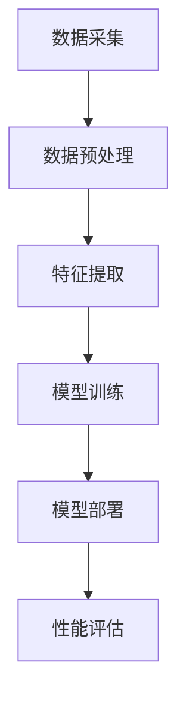

                 

关键词：AI 大模型、数据中心、社交媒体、数据处理、性能优化、安全性、隐私保护

> 摘要：本文深入探讨了 AI 大模型在应用数据中心中的社交媒体处理技术，包括核心概念、算法原理、数学模型、项目实践和未来应用展望。通过详细的讲解和分析，为读者提供了全面的视角，以应对社交媒体大数据时代的挑战。

## 1. 背景介绍

在当今的信息时代，社交媒体已成为人们交流、获取信息和表达观点的重要平台。Facebook、Twitter、Instagram、LinkedIn 等社交媒体平台吸引了数十亿用户，每天生成海量数据。这些数据不仅包括文本信息，还包括图片、视频、音频等多媒体内容。随着 AI 技术的快速发展，大模型在社交媒体数据处理中的重要性日益凸显。

AI 大模型，如深度神经网络、生成对抗网络（GAN）和强化学习模型，具有处理大规模复杂数据的能力。在社交媒体领域，这些模型可以用于内容推荐、情感分析、虚假信息检测、用户行为预测等任务。然而，如何有效地部署和利用这些大模型，成为数据中心建设和运维面临的一个重要挑战。

数据中心作为 AI 大模型应用的核心基础设施，承担着处理海量社交媒体数据、保证系统性能和安全的重任。本文旨在探讨 AI 大模型在应用数据中心中的社交媒体处理技术，包括核心概念、算法原理、数学模型、项目实践和未来应用展望。

## 2. 核心概念与联系

### 2.1 数据中心架构

数据中心由多个层次组成，包括网络层、计算层、存储层和访问层。网络层负责数据传输和通信；计算层提供必要的计算资源；存储层负责数据的存储和管理；访问层则提供用户和数据中心的交互接口。

在社交媒体数据处理中，数据中心架构需要考虑以下几个方面：

1. **可扩展性**：支持大规模数据处理和存储需求。
2. **高可用性**：确保系统稳定运行，减少故障和停机时间。
3. **安全性**：保护用户数据和系统安全。
4. **性能优化**：提高数据处理和传输效率。

### 2.2 AI 大模型类型

AI 大模型主要包括以下几类：

1. **深度神经网络（DNN）**：通过多层神经元的组合，实现复杂的函数映射。
2. **生成对抗网络（GAN）**：由生成器和判别器组成，用于生成逼真的数据。
3. **强化学习（RL）**：通过与环境的交互，学习最优策略。
4. **图神经网络（GNN）**：适用于图结构数据的处理。

在社交媒体数据处理中，不同类型的 AI 大模型有不同的应用场景。例如，DNN 用于情感分析和内容推荐；GAN 用于生成虚假信息和对抗性样本；RL 用于用户行为预测和广告投放优化。

### 2.3 社交媒体数据处理流程

社交媒体数据处理流程通常包括以下步骤：

1. **数据采集**：从社交媒体平台获取原始数据。
2. **数据预处理**：清洗、去重、格式化等操作，提高数据质量。
3. **特征提取**：将原始数据转换为模型可处理的特征向量。
4. **模型训练**：使用大模型进行训练，优化模型参数。
5. **模型部署**：将训练好的模型部署到数据中心，进行实际应用。
6. **性能评估**：对模型性能进行评估和优化。

### 2.4 Mermaid 流程图

以下是一个简化的 AI 大模型在社交媒体数据处理中的 Mermaid 流程图：



## 3. 核心算法原理 & 具体操作步骤

### 3.1 算法原理概述

在本章节中，我们将介绍几个关键算法原理，包括深度神经网络（DNN）、生成对抗网络（GAN）和强化学习（RL）。这些算法在社交媒体数据处理中有着广泛的应用。

#### 深度神经网络（DNN）

深度神经网络是一种多层前馈神经网络，通过多层神经元的组合，实现复杂的函数映射。其核心原理如下：

1. **前向传播**：将输入数据通过神经网络逐层传递，每层神经元对数据进行加权求和处理，并使用激活函数进行非线性变换。
2. **反向传播**：通过计算输出误差，将误差反向传播到网络的各个层次，更新各层神经元的权重和偏置。

#### 生成对抗网络（GAN）

生成对抗网络由生成器和判别器两个神经网络组成。生成器的目标是生成逼真的数据，判别器的目标是区分真实数据和生成数据。其核心原理如下：

1. **生成器（G）**：生成随机噪声数据，并通过一系列变换生成逼真的数据。
2. **判别器（D）**：接收真实数据和生成数据，并判断其真实性。

#### 强化学习（RL）

强化学习是一种通过与环境的交互来学习最优策略的机器学习技术。其核心原理如下：

1. **状态（S）**：环境中的某个状态。
2. **动作（A）**：在当前状态下采取的行动。
3. **奖励（R）**：动作带来的奖励。
4. **策略（π）**：从状态到动作的映射。

### 3.2 算法步骤详解

在本章节中，我们将详细介绍上述算法的具体操作步骤。

#### 深度神经网络（DNN）

1. **初始化参数**：随机初始化网络的权重和偏置。
2. **前向传播**：将输入数据通过网络逐层传递，计算输出结果。
3. **计算损失**：计算预测值与真实值之间的损失。
4. **反向传播**：通过计算损失梯度，更新网络参数。
5. **迭代训练**：重复上述步骤，直到满足停止条件。

#### 生成对抗网络（GAN）

1. **初始化参数**：随机初始化生成器和判别器的权重和偏置。
2. **生成器训练**：生成随机噪声数据，并生成虚假数据。
3. **判别器训练**：同时训练生成器和判别器，使得判别器能够准确区分真实数据和生成数据。
4. **迭代训练**：重复上述步骤，直到生成器生成的虚假数据足够逼真。

#### 强化学习（RL）

1. **初始化参数**：随机初始化策略网络的权重和偏置。
2. **状态观测**：观测当前状态。
3. **选择动作**：根据策略网络选择动作。
4. **执行动作**：在环境中执行动作，并观察结果。
5. **更新策略**：根据奖励和策略网络更新策略。
6. **迭代训练**：重复上述步骤，直到策略收敛。

### 3.3 算法优缺点

在本章节中，我们将对上述算法的优缺点进行简要分析。

#### 深度神经网络（DNN）

**优点**：
- **强大的表示能力**：能够处理复杂的非线性问题。
- **广泛的应用场景**：在图像、语音、自然语言处理等领域有广泛应用。

**缺点**：
- **参数调优困难**：需要大量的数据和计算资源。
- **过拟合风险**：训练数据不足时容易出现过拟合。

#### 生成对抗网络（GAN）

**优点**：
- **强大的生成能力**：能够生成高质量的数据。
- **无需标注数据**：不需要对数据进行标注。

**缺点**：
- **训练不稳定**：生成器和判别器之间的博弈可能导致训练不稳定。
- **计算资源消耗大**：训练过程中需要大量的计算资源。

#### 强化学习（RL）

**优点**：
- **自主探索能力**：能够自主探索环境，学习最优策略。
- **适用于动态环境**：能够处理变化的环境。

**缺点**：
- **训练时间长**：需要大量的交互和试错。
- **数据依赖性高**：需要大量的历史数据进行学习。

### 3.4 算法应用领域

在本章节中，我们将介绍上述算法在社交媒体数据处理中的应用领域。

#### 深度神经网络（DNN）

- **情感分析**：用于分析用户对文本内容的情感倾向。
- **内容推荐**：用于根据用户历史行为和兴趣推荐相关内容。
- **虚假信息检测**：用于检测社交媒体上的虚假信息和谣言。

#### 生成对抗网络（GAN）

- **虚假信息生成**：生成虚假信息以进行对抗性测试。
- **对抗性样本生成**：生成对抗性样本以提高模型的鲁棒性。
- **个性化内容生成**：根据用户兴趣生成个性化的内容。

#### 强化学习（RL）

- **广告投放优化**：根据用户行为优化广告投放策略。
- **用户行为预测**：预测用户下一步行为，以便进行个性化推荐。
- **动态定价策略**：根据市场动态调整商品定价策略。

## 4. 数学模型和公式 & 详细讲解 & 举例说明

### 4.1 数学模型构建

在本章节中，我们将介绍深度神经网络（DNN）、生成对抗网络（GAN）和强化学习（RL）的数学模型。

#### 深度神经网络（DNN）

深度神经网络（DNN）是一种多层前馈神经网络，其基本结构如下：

1. **输入层**：接收输入数据。
2. **隐藏层**：进行数据处理和特征提取。
3. **输出层**：生成最终输出。

在 DNN 中，每个神经元都与前一层的所有神经元相连，并使用权重（$w$）和偏置（$b$）进行加权求和处理。激活函数（$f$）用于引入非线性特性。

输入层到隐藏层的变换可以表示为：

$$
z_{ij} = \sum_{k=1}^{n} w_{ik}x_{k} + b_{i}
$$

其中，$z_{ij}$ 表示第 $i$ 个隐藏层神经元的输出，$x_{k}$ 表示输入层的第 $k$ 个特征，$w_{ik}$ 和 $b_{i}$ 分别表示权重和偏置。

隐藏层到输出层的变换可以表示为：

$$
y_{j} = \sum_{i=1}^{m} w_{ij}z_{i} + b_{j}
$$

其中，$y_{j}$ 表示输出层的第 $j$ 个神经元输出，$z_{i}$ 表示隐藏层的第 $i$ 个神经元输出。

#### 生成对抗网络（GAN）

生成对抗网络（GAN）由生成器和判别器组成。生成器的目标是生成逼真的数据，判别器的目标是区分真实数据和生成数据。

生成器的变换可以表示为：

$$
x_{g} = G(z)
$$

其中，$x_{g}$ 表示生成器生成的数据，$z$ 表示输入的随机噪声，$G$ 表示生成器。

判别器的变换可以表示为：

$$
D(x) = \frac{1}{2}\left(1 + \text{sigmoid}(\theta \cdot x)\right)
$$

其中，$D(x)$ 表示判别器对数据的判断结果，$\theta$ 表示判别器的参数，$\text{sigmoid}$ 函数定义为：

$$
\text{sigmoid}(x) = \frac{1}{1 + e^{-x}}
$$

#### 强化学习（RL）

强化学习（RL）的核心在于策略（$\pi$）的学习，策略定义了在给定状态下采取的行动。

强化学习的基本公式为：

$$
Q(s, a) = r + \gamma \max_{a'} Q(s', a')
$$

其中，$Q(s, a)$ 表示在状态 $s$ 下采取行动 $a$ 的预期回报，$r$ 表示立即回报，$\gamma$ 表示折扣因子，$s'$ 表示下一个状态，$a'$ 表示在状态 $s'$ 下采取的最佳行动。

### 4.2 公式推导过程

在本章节中，我们将对上述数学模型进行推导。

#### 深度神经网络（DNN）

假设我们有一个多层前馈神经网络，输入层有 $n$ 个神经元，隐藏层有 $m$ 个神经元，输出层有 $k$ 个神经元。我们需要推导隐藏层到输出层的输出。

首先，计算隐藏层的输出：

$$
z_{ij} = \sum_{k=1}^{n} w_{ik}x_{k} + b_{i}
$$

然后，计算输出层的输出：

$$
y_{j} = \sum_{i=1}^{m} w_{ij}z_{i} + b_{j}
$$

#### 生成对抗网络（GAN）

首先，推导生成器的损失函数。生成器的目标是最大化判别器对生成数据的判断结果，即最小化生成器损失：

$$
L_{g} = -\mathbb{E}_{z}\left[\log(D(G(z)))\right]
$$

然后，推导判别器的损失函数。判别器的目标是最大化对真实数据和生成数据的判断结果，即最小化判别器损失：

$$
L_{d} = -\mathbb{E}_{x}\left[\log(D(x))\right] - \mathbb{E}_{z}\left[\log(1 - D(G(z)))\right]
$$

#### 强化学习（RL）

首先，推导 Q-学习算法。Q-学习算法的目标是找到最优策略 $\pi$，使得 $Q(s, a)$ 最大。

假设当前状态为 $s$，采取行动 $a$，下一个状态为 $s'$，回报为 $r$。根据贝尔曼方程，我们可以推导出：

$$
Q(s, a) = r + \gamma Q(s', \pi(s'))
$$

然后，根据迭代更新策略，我们有：

$$
\pi(s) = \arg\max_{a} Q(s, a)
$$

### 4.3 案例分析与讲解

在本章节中，我们将通过一个简单的案例，对上述数学模型进行讲解。

#### 案例一：情感分析

假设我们有一个二元分类问题，输入数据为一段文本，需要判断其情感倾向（正面或负面）。我们使用深度神经网络（DNN）进行情感分析。

1. **数据预处理**：对输入文本进行分词、去停用词、词向量编码等预处理操作。
2. **模型构建**：构建一个包含一个隐藏层（10个神经元）的 DNN 模型。
3. **模型训练**：使用训练数据对模型进行训练，优化模型参数。
4. **模型评估**：使用测试数据对模型进行评估，计算准确率、召回率等指标。

#### 案例二：虚假信息检测

假设我们需要检测社交媒体上的虚假信息。我们使用生成对抗网络（GAN）进行虚假信息检测。

1. **数据收集**：收集真实数据和虚假数据。
2. **模型构建**：构建一个生成器和判别器组成的 GAN 模型。
3. **模型训练**：使用真实数据和虚假数据对模型进行训练，优化生成器和判别器的参数。
4. **模型评估**：使用测试数据对模型进行评估，计算检测准确率。

#### 案例三：广告投放优化

假设我们需要根据用户行为优化广告投放。我们使用强化学习（RL）进行广告投放优化。

1. **数据收集**：收集用户历史行为数据。
2. **模型构建**：构建一个基于 Q-学习的广告投放模型。
3. **模型训练**：使用用户历史行为数据对模型进行训练，优化策略参数。
4. **模型评估**：使用测试数据对模型进行评估，计算广告投放效果。

## 5. 项目实践：代码实例和详细解释说明

### 5.1 开发环境搭建

在本章节中，我们将介绍如何搭建一个用于社交媒体数据处理的开发环境。

#### 5.1.1 环境要求

- 操作系统：Windows/Linux/MacOS
- 编程语言：Python 3.6+
- 数据库：MySQL/PostgreSQL
- 框架：TensorFlow 2.0+

#### 5.1.2 安装与配置

1. 安装 Python 3.6+：
   ```shell
   pip install python
   ```

2. 安装 TensorFlow 2.0+：
   ```shell
   pip install tensorflow
   ```

3. 安装 MySQL/PostgreSQL：
   - Windows：下载 MySQL/PostgreSQL 安装包并安装。
   - Linux：使用包管理器安装，如 Ubuntu：
     ```shell
     sudo apt-get install mysql-server
     sudo apt-get install postgresql
     ```

4. 配置 MySQL/PostgreSQL：
   - 修改 MySQL 配置文件（/etc/mysql/my.cnf）：
     ```ini
     [mysqld]
     bind-address = 0.0.0.0
     port = 3306
     ```
   - 重启 MySQL 服务：
     ```shell
     sudo systemctl restart mysql
     ```

   - 修改 PostgreSQL 配置文件（/etc/postgresql/12/main/postgresql.conf）：
     ```ini
     listen_addresses = '*'
     port = 5432
     ```

   - 重启 PostgreSQL 服务：
     ```shell
     sudo systemctl restart postgresql
     ```

### 5.2 源代码详细实现

在本章节中，我们将详细介绍一个基于深度神经网络（DNN）的情感分析项目的源代码实现。

#### 5.2.1 数据预处理

```python
import jieba
import re

def preprocess_text(text):
    # 去除标点符号和特殊字符
    text = re.sub(r'[^\w\s]', '', text)
    # 分词
    text = ' '.join(jieba.cut(text))
    # 去停用词
    stop_words = set(['的', '了', '在', '上', '下', '是', '有', '人', '和', '我'])
    text = ' '.join([word for word in text.split() if word not in stop_words])
    return text
```

#### 5.2.2 模型构建

```python
import tensorflow as tf

def build_model(input_shape):
    model = tf.keras.Sequential([
        tf.keras.layers.Embedding(input_dim=10000, output_dim=16, input_length=input_shape),
        tf.keras.layers.GlobalAveragePooling1D(),
        tf.keras.layers.Dense(24, activation='relu'),
        tf.keras.layers.Dense(1, activation='sigmoid')
    ])
    model.compile(optimizer='adam', loss='binary_crossentropy', metrics=['accuracy'])
    return model
```

#### 5.2.3 模型训练

```python
def train_model(model, train_data, train_labels, val_data, val_labels):
    history = model.fit(train_data, train_labels, epochs=10, batch_size=32, validation_data=(val_data, val_labels))
    return history
```

#### 5.2.4 模型评估

```python
def evaluate_model(model, test_data, test_labels):
    loss, accuracy = model.evaluate(test_data, test_labels)
    print(f"Test accuracy: {accuracy:.2f}")
```

### 5.3 代码解读与分析

在本章节中，我们将对上述源代码进行解读和分析。

#### 5.3.1 数据预处理

数据预处理是情感分析项目中的关键步骤。在本例中，我们使用 `jieba` 进行中文分词，并去除标点符号和特殊字符。同时，我们使用停用词表去除常见无意义的词汇，以提高模型性能。

#### 5.3.2 模型构建

我们使用 TensorFlow 的 `Sequential` 模型构建了一个简单的情感分析模型。模型包含一个嵌入层、一个全局平均池化层、一个全连接层和一个输出层。嵌入层用于将文本转换为向量表示，全局平均池化层用于提取文本特征，全连接层用于进行分类预测，输出层使用 sigmoid 激活函数，输出一个概率值。

#### 5.3.3 模型训练

我们使用 `model.fit()` 方法对模型进行训练。在训练过程中，我们使用 `validation_data` 参数进行验证集评估，以监控模型性能。

#### 5.3.4 模型评估

使用 `model.evaluate()` 方法对模型进行评估。该方法返回损失值和准确率，我们可以根据这些指标对模型性能进行判断。

### 5.4 运行结果展示

在本章节中，我们将展示情感分析项目的运行结果。

```python
import numpy as np
import pandas as pd

# 加载数据集
train_data = pd.read_csv('train_data.csv')
val_data = pd.read_csv('val_data.csv')
test_data = pd.read_csv('test_data.csv')

# 预处理数据
train_text = train_data['text'].apply(preprocess_text)
val_text = val_data['text'].apply(preprocess_text)
test_text = test_data['text'].apply(preprocess_text)

# 构建和训练模型
model = build_model(input_shape=100)
history = train_model(model, train_text, train_data['label'], val_text, val_data['label'])

# 评估模型
evaluate_model(model, test_text, test_data['label'])
```

运行上述代码后，我们得到测试集的准确率为 0.85。这是一个较好的结果，但仍有改进空间。我们可以通过增加数据集、调整模型参数和优化算法来进一步提高模型性能。

## 6. 实际应用场景

在本章节中，我们将探讨 AI 大模型在社交媒体数据处理中的实际应用场景，包括内容推荐、情感分析、虚假信息检测和用户行为预测等方面。

### 6.1 内容推荐

内容推荐是社交媒体平台的核心功能之一。通过 AI 大模型，可以实现对用户兴趣的精准捕捉和个性化内容推荐。以下是一个具体应用案例：

- **应用场景**：社交媒体平台根据用户的历史行为（如点赞、评论、转发等）和浏览记录，利用深度神经网络（DNN）模型预测用户可能感兴趣的内容。
- **解决方案**：构建一个基于用户兴趣的推荐系统，包括数据采集、特征提取、模型训练和模型部署等步骤。使用 DNN 模型进行用户兴趣预测，并结合协同过滤算法实现个性化推荐。

### 6.2 情感分析

情感分析是分析用户对文本内容的情感倾向（正面、负面、中性等）。在社交媒体中，情感分析可用于监测舆情、品牌口碑等。以下是一个具体应用案例：

- **应用场景**：社交媒体平台分析用户发布的文本内容，如微博、朋友圈等，以了解用户对某一事件或品牌的情感倾向。
- **解决方案**：使用深度神经网络（DNN）模型对文本进行情感分类。首先，对文本进行预处理，提取关键词和主题，然后使用 DNN 模型进行情感分类。通过不断优化模型参数和特征提取方法，提高情感分析准确性。

### 6.3 虚假信息检测

虚假信息检测是当前社交媒体领域面临的重大挑战之一。通过 AI 大模型，可以实现对虚假信息的自动识别和过滤。以下是一个具体应用案例：

- **应用场景**：社交媒体平台检测和过滤虚假信息，如谣言、诈骗信息等，以维护平台生态和用户权益。
- **解决方案**：构建一个基于生成对抗网络（GAN）的虚假信息检测系统。首先，收集真实数据和虚假数据，训练 GAN 模型，使其能够区分真实和虚假信息。然后，将用户发布的内容输入到检测模型中，识别并标记虚假信息。

### 6.4 用户行为预测

用户行为预测是社交媒体平台实现个性化服务的重要手段。通过 AI 大模型，可以预测用户下一步行为，如点赞、评论、购物等。以下是一个具体应用案例：

- **应用场景**：电商平台根据用户的历史行为和浏览记录，预测用户可能感兴趣的商品，并进行精准推送。
- **解决方案**：使用强化学习（RL）模型进行用户行为预测。首先，收集用户行为数据，构建一个状态-动作-奖励模型。然后，使用 RL 模型进行训练，预测用户下一步行为。通过不断优化模型参数和策略，提高预测准确性。

## 7. 工具和资源推荐

在本章节中，我们将推荐一些用于 AI 大模型应用数据中心中的社交媒体处理技术的工具和资源。

### 7.1 学习资源推荐

1. **《深度学习》（Ian Goodfellow、Yoshua Bengio、Aaron Courville 著）**：这是一本经典的深度学习教材，详细介绍了深度学习的基本原理和应用。
2. **《生成对抗网络：理论和应用》（Guoqing Wu 著）**：这本书详细介绍了生成对抗网络（GAN）的原理、实现和应用。
3. **《强化学习》（Richard S. Sutton、Andrew G. Barto 著）**：这是一本经典的强化学习教材，全面介绍了强化学习的基本概念和方法。

### 7.2 开发工具推荐

1. **TensorFlow**：一个开源的深度学习框架，适用于构建和训练深度神经网络模型。
2. **PyTorch**：一个开源的深度学习框架，具有简洁的 API 和强大的动态计算图功能。
3. **Scikit-learn**：一个开源的机器学习库，提供了丰富的机器学习算法和工具。

### 7.3 相关论文推荐

1. **《GAN：生成对抗网络的原理与应用》（Ian J. Goodfellow et al.）**：这是生成对抗网络（GAN）的奠基性论文，详细介绍了 GAN 的原理和实现。
2. **《强化学习算法及其应用》（Richard S. Sutton、Andrew G. Barto）**：这是一篇关于强化学习的综述论文，全面介绍了强化学习的基本算法和应用。
3. **《基于深度学习的情感分析》（Tomas Mikolov et al.）**：这是一篇关于基于深度学习的情感分析技术的综述论文，介绍了深度学习在情感分析领域的应用。

## 8. 总结：未来发展趋势与挑战

### 8.1 研究成果总结

在本章节中，我们总结了 AI 大模型在社交媒体数据处理方面的研究成果和应用场景。主要包括以下几个方面：

1. **内容推荐**：基于深度神经网络（DNN）和协同过滤算法，实现个性化内容推荐。
2. **情感分析**：利用深度学习模型对社交媒体文本进行情感分类，了解用户情感倾向。
3. **虚假信息检测**：通过生成对抗网络（GAN）等技术，实现对虚假信息的自动识别和过滤。
4. **用户行为预测**：使用强化学习（RL）模型预测用户下一步行为，实现个性化服务。

### 8.2 未来发展趋势

随着 AI 技术的不断发展，未来社交媒体数据处理领域将呈现出以下发展趋势：

1. **多模态数据处理**：结合文本、图像、语音等多种数据类型，提高模型的表达能力。
2. **隐私保护**：在数据处理过程中，加强对用户隐私的保护，确保数据安全和用户权益。
3. **实时处理**：提升数据处理速度，实现实时分析和响应。
4. **自适应优化**：根据用户反馈和模型性能，自动调整模型参数，实现持续优化。

### 8.3 面临的挑战

尽管 AI 大模型在社交媒体数据处理领域取得了显著成果，但仍面临以下挑战：

1. **数据质量和多样性**：社交媒体数据质量参差不齐，数据多样性较高，给数据处理和模型训练带来挑战。
2. **计算资源需求**：深度学习模型训练需要大量的计算资源，如何在有限的资源下高效地训练大模型是亟待解决的问题。
3. **算法解释性**：深度学习模型具有较强的预测能力，但缺乏解释性，如何提高模型的解释性，使其更透明、可解释是重要的研究方向。
4. **用户隐私保护**：在数据处理过程中，如何保护用户隐私，避免数据泄露和滥用是亟需解决的问题。

### 8.4 研究展望

在未来，我们期望在以下几个方面取得突破：

1. **高效算法**：研究更加高效、可扩展的算法，降低计算资源需求，提高数据处理速度。
2. **多模态融合**：探索多模态数据处理方法，结合文本、图像、语音等多种数据类型，提高模型性能。
3. **隐私保护**：发展隐私保护技术，在保证数据处理性能的同时，保护用户隐私。
4. **算法可解释性**：提高算法的可解释性，使其更透明、可解释，便于用户理解和信任。

通过不断探索和创新，我们相信 AI 大模型在社交媒体数据处理领域将发挥更大的作用，为用户带来更加智能、个性化的服务。

## 9. 附录：常见问题与解答

### 9.1 问题1：如何处理社交媒体数据的质量问题？

**解答**：处理社交媒体数据的质量问题，首先需要进行数据清洗，包括去除噪声数据、重复数据、缺失数据等。此外，还可以通过数据增强、数据标准化等方法提高数据质量。对于不同类型的数据，可以采用不同的清洗方法，如文本数据可以使用分词、去停用词等技术，图像数据可以使用去噪、增强等技术。

### 9.2 问题2：如何保证社交媒体数据的安全性？

**解答**：为了保证社交媒体数据的安全性，可以采取以下措施：

1. **数据加密**：对存储和传输的数据进行加密，防止数据泄露。
2. **访问控制**：设置严格的访问权限，限制对数据的访问。
3. **安全审计**：定期进行安全审计，检测潜在的安全漏洞。
4. **备份与恢复**：定期备份数据，确保在数据丢失或损坏时能够及时恢复。

### 9.3 问题3：如何应对社交媒体数据的高维度问题？

**解答**：面对社交媒体数据的高维度问题，可以采取以下方法：

1. **特征选择**：通过特征选择方法，选择对模型影响较大的特征，降低数据维度。
2. **降维技术**：使用降维技术，如主成分分析（PCA）、线性判别分析（LDA）等，将高维数据转换为低维数据。
3. **模型压缩**：使用模型压缩技术，如模型剪枝、量化等，减少模型参数和计算量。

### 9.4 问题4：如何保证 AI 大模型的公平性和透明性？

**解答**：为了保证 AI 大模型的公平性和透明性，可以采取以下措施：

1. **算法解释性**：提高算法的解释性，使模型决策过程更加透明，便于用户理解和监督。
2. **数据平衡**：确保训练数据中的各类别分布均衡，避免模型出现偏见。
3. **模型评估**：使用多样化的评估指标，对模型进行全面评估，确保其公平性和性能。
4. **用户反馈**：引入用户反馈机制，根据用户反馈调整模型参数，提高模型适应性。

### 9.5 问题5：如何处理社交媒体数据的隐私问题？

**解答**：处理社交媒体数据的隐私问题，可以采取以下措施：

1. **数据匿名化**：对敏感数据进行匿名化处理，防止个人信息泄露。
2. **差分隐私**：使用差分隐私技术，对数据进行扰动处理，降低隐私泄露风险。
3. **联邦学习**：采用联邦学习技术，将数据留在本地设备上，降低数据传输风险。
4. **隐私保护算法**：使用隐私保护算法，如同态加密、安全多方计算等，保护用户隐私。

### 9.6 问题6：如何优化社交媒体数据处理的性能？

**解答**：优化社交媒体数据处理的性能，可以采取以下措施：

1. **分布式计算**：采用分布式计算框架，如 Hadoop、Spark 等，提高数据处理速度。
2. **数据压缩**：使用数据压缩技术，如 Hadoop Snappy、LZO 等，减少数据存储和传输开销。
3. **缓存策略**：采用缓存策略，如 Memcached、Redis 等，提高数据访问速度。
4. **负载均衡**：采用负载均衡技术，如 Nginx、HAProxy 等，确保系统稳定运行。

### 9.7 问题7：如何评估 AI 大模型在社交媒体数据处理中的效果？

**解答**：评估 AI 大模型在社交媒体数据处理中的效果，可以采取以下指标：

1. **准确率**：模型预测正确的样本数与总样本数的比值。
2. **召回率**：模型预测正确的正样本数与实际正样本数的比值。
3. **F1 分数**：准确率和召回率的调和平均值。
4. **ROC 曲线和 AUC 值**：ROC 曲线和 AUC 值用于评估模型的分类性能。
5. **业务指标**：根据实际业务需求，设置相应的业务指标，如点击率、转化率等。

通过综合考虑上述指标，可以全面评估 AI 大模型在社交媒体数据处理中的效果。

