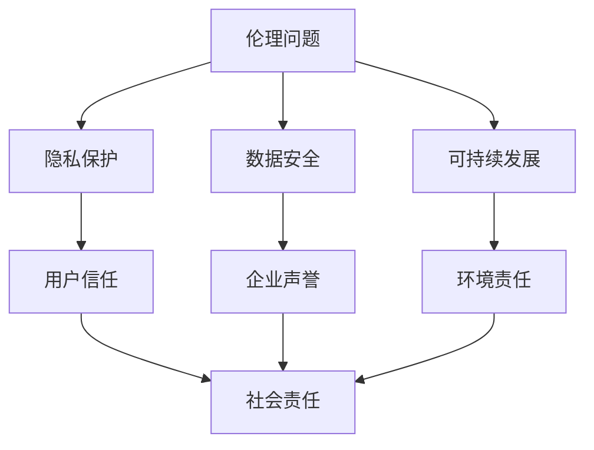

                 

 关键词：人工智能、大数据、数据中心、社会责任、伦理问题、技术发展、法规政策

> 摘要：本文深入探讨了人工智能大模型应用数据中心在社会责任方面的挑战与责任。从伦理问题、隐私保护、数据安全、可持续发展等方面进行了详细分析，并提出了一系列解决方案和未来发展的展望。

## 1. 背景介绍

随着人工智能技术的快速发展，大模型应用数据中心（如Google Brain、OpenAI等）在全球范围内迅速崛起。这些数据中心不仅承担着存储和处理海量数据的重要任务，还成为了人工智能研究和应用的核心基础设施。然而，随着其规模和影响力的不断扩大，数据中心也面临着一系列社会责任问题，包括伦理问题、隐私保护、数据安全、可持续发展等。

### 1.1 伦理问题

人工智能大模型应用数据中心在伦理问题方面面临着诸多挑战。例如，算法偏见、歧视、透明度等问题。这些挑战不仅影响了人工智能技术的公平性和公正性，还可能对社会产生深远的负面影响。

### 1.2 隐私保护

在数据隐私保护方面，数据中心需要确保用户数据的隐私和安全。然而，随着数据量的增加和复杂性的提升，数据泄露和滥用风险也在不断增大。如何有效地保护用户隐私成为了一个亟待解决的问题。

### 1.3 数据安全

数据安全是数据中心面临的核心挑战之一。数据中心需要采取一系列安全措施来防止数据泄露、破坏和篡改。然而，随着网络攻击手段的不断升级，数据安全形势日益严峻。

### 1.4 可持续发展

在可持续发展方面，数据中心需要关注能源消耗、碳排放和环境影响等问题。随着数据中心的规模不断扩大，其能源消耗和碳排放量也在逐年增加，对环境造成了巨大压力。

## 2. 核心概念与联系

为了更好地理解人工智能大模型应用数据中心的社会责任，我们需要明确一些核心概念和它们之间的联系。以下是这些核心概念及其在数据中心中的作用的Mermaid流程图：



### 2.1 伦理问题

伦理问题是数据中心在社会责任方面的重要考量。算法偏见和歧视可能会对特定群体造成不公平对待，影响社会公正。为了解决这些问题，数据中心需要确保算法的透明度和可解释性，并在算法开发和部署过程中遵循伦理准则。

### 2.2 隐私保护

隐私保护是数据中心在运营过程中需要重点关注的问题。为了保护用户隐私，数据中心需要采取数据加密、访问控制和安全审计等措施，确保用户数据的安全性。此外，数据中心还需要制定透明的隐私政策，让用户了解其数据的使用方式和范围。

### 2.3 数据安全

数据安全是数据中心运营的基石。数据中心需要建立完善的安全体系，包括网络安全、数据备份和恢复、应急响应等。此外，数据中心还需要定期进行安全评估和渗透测试，以确保系统的安全性。

### 2.4 可持续发展

可持续发展是数据中心需要关注的重要方向。数据中心可以通过采用绿色能源、优化能源使用效率和降低碳排放等措施，实现可持续发展。此外，数据中心还可以通过技术创新和资源循环利用，进一步降低环境影响。

## 3. 核心算法原理 & 具体操作步骤

为了解决数据中心面临的社会责任问题，我们可以从以下几个方面探讨核心算法原理和具体操作步骤：

### 3.1 算法原理概述

在伦理问题方面，我们可以利用对抗性训练（Adversarial Training）来减少算法偏见。对抗性训练通过模拟对抗场景，使算法能够在面对不同类型的数据时保持稳定和公正。

在隐私保护方面，差分隐私（Differential Privacy）是一种有效的方法。差分隐私通过在数据处理过程中添加噪声，确保个体隐私不被泄露。

在数据安全方面，加密技术（Encryption）是保护数据安全的关键。通过加密技术，数据中心可以确保数据在传输和存储过程中的安全性。

在可持续发展方面，能耗优化算法（Energy-Efficient Optimization Algorithms）可以帮助数据中心降低能源消耗。这些算法可以通过优化数据中心的能源分配和使用策略，提高能源利用效率。

### 3.2 算法步骤详解

#### 3.2.1 伦理问题

1. 收集和标注数据：收集具有代表性的数据集，并对数据进行标注，以确保算法训练的公正性和准确性。
2. 对抗性训练：利用对抗性训练方法，在训练过程中引入对抗样本，使算法能够适应不同的输入数据。
3. 模型评估：对训练好的模型进行评估，确保其公正性和透明度。

#### 3.2.2 隐私保护

1. 差分隐私算法设计：设计差分隐私算法，确保在数据处理过程中添加适当的噪声，以保护个体隐私。
2. 数据处理：在数据处理过程中应用差分隐私算法，确保数据隐私不被泄露。
3. 模型训练：在模型训练过程中，结合差分隐私算法，确保模型性能和隐私保护之间的平衡。

#### 3.2.3 数据安全

1. 加密技术：采用对称加密和非对称加密技术，对数据进行加密，确保数据在传输和存储过程中的安全性。
2. 访问控制：设置严格的访问控制策略，确保只有授权人员可以访问敏感数据。
3. 安全审计：定期进行安全审计，确保数据中心的各项安全措施得到有效执行。

#### 3.2.4 可持续发展

1. 能耗优化算法设计：设计能耗优化算法，优化数据中心的能源分配和使用策略。
2. 能源使用监控：监控数据中心的能源使用情况，及时发现和解决能源浪费问题。
3. 技术创新：采用新技术，如人工智能、物联网等，提高数据中心的能源利用效率。

### 3.3 算法优缺点

#### 3.3.1 伦理问题

优点：对抗性训练可以有效减少算法偏见，提高模型的公正性和透明度。

缺点：对抗性训练需要大量的计算资源和时间，且可能引入新的偏见。

#### 3.3.2 隐私保护

优点：差分隐私可以有效保护个体隐私，确保数据处理的透明度和可靠性。

缺点：差分隐私可能会降低模型的性能，影响模型的效果。

#### 3.3.3 数据安全

优点：加密技术可以有效保护数据的安全性，确保数据在传输和存储过程中的安全。

缺点：加密技术可能会降低数据处理的效率，影响模型的运行速度。

#### 3.3.4 可持续发展

优点：能耗优化算法可以提高数据中心的能源利用效率，降低碳排放。

缺点：能耗优化算法需要大量的计算资源和时间，且可能无法完全消除能源浪费。

### 3.4 算法应用领域

对抗性训练、差分隐私、加密技术和能耗优化算法可以广泛应用于数据中心的各种应用场景，包括大数据分析、机器学习、网络安全等。通过这些算法的应用，数据中心可以更好地解决社会责任问题，提高其运营效率和可持续性。

## 4. 数学模型和公式 & 详细讲解 & 举例说明

为了更好地理解上述算法的原理和应用，我们将介绍一些相关的数学模型和公式，并进行详细的讲解和举例说明。

### 4.1 数学模型构建

#### 4.1.1 对抗性训练

对抗性训练的核心思想是在模型训练过程中引入对抗样本，使模型能够在面对对抗样本时保持稳定和准确。具体来说，对抗性训练包括以下步骤：

1. 数据预处理：对原始数据进行预处理，如数据清洗、归一化等。
2. 生成对抗样本：利用生成对抗网络（GAN）等技术，生成对抗样本。
3. 训练模型：使用原始数据和对抗样本对模型进行训练。
4. 模型评估：对训练好的模型进行评估，确保其性能和稳定性。

#### 4.1.2 差分隐私

差分隐私是一种隐私保护机制，通过在数据处理过程中添加噪声，确保个体隐私不被泄露。具体来说，差分隐私包括以下步骤：

1. 数据预处理：对原始数据进行预处理，如数据清洗、归一化等。
2. 添加噪声：在数据处理过程中添加适当的噪声，确保个体隐私不被泄露。
3. 模型训练：使用带有噪声的数据对模型进行训练。
4. 模型评估：对训练好的模型进行评估，确保其性能和隐私保护之间的平衡。

#### 4.1.3 加密技术

加密技术是一种保护数据安全的方法，通过将数据转化为密文，确保数据在传输和存储过程中的安全性。具体来说，加密技术包括以下步骤：

1. 数据加密：使用加密算法将明文数据转化为密文。
2. 数据传输：将加密后的数据在网络上进行传输。
3. 数据存储：将加密后的数据存储在存储设备中。
4. 数据解密：使用解密算法将密文数据转化为明文数据。

#### 4.1.4 能耗优化算法

能耗优化算法是一种优化数据中心能源使用的方法，通过优化能源分配和使用策略，提高数据中心的能源利用效率。具体来说，能耗优化算法包括以下步骤：

1. 数据采集：采集数据中心的能源使用数据。
2. 模型训练：使用采集到的数据对能耗优化模型进行训练。
3. 能源分配：根据训练好的模型，对数据中心的能源进行分配。
4. 能源使用监控：监控数据中心的能源使用情况，及时调整能源分配策略。

### 4.2 公式推导过程

#### 4.2.1 对抗性训练

对抗性训练的核心公式如下：

$$
L = - \log P(G(D_{real})) - \log P(G(D_{adv}))
$$

其中，$L$表示对抗性损失函数，$G$表示生成对抗网络，$D_{real}$表示真实数据，$D_{adv}$表示对抗样本。

#### 4.2.2 差分隐私

差分隐私的核心公式如下：

$$
\epsilon = \frac{1}{\sqrt{n}} \sum_{i=1}^{n} || \theta_i - \theta_j ||^2
$$

其中，$\epsilon$表示噪声，$n$表示数据样本数量，$\theta_i$和$\theta_j$分别表示第$i$个和第$j$个数据样本的参数。

#### 4.2.3 加密技术

加密技术的核心公式如下：

$$
C = E_K(M)
$$

其中，$C$表示密文，$M$表示明文，$K$表示密钥。

#### 4.2.4 能耗优化算法

能耗优化算法的核心公式如下：

$$
E_{opt} = \min_{x} \{ f(x) + \lambda g(x) \}
$$

其中，$E_{opt}$表示最优能耗，$f(x)$表示目标函数，$g(x)$表示约束条件，$\lambda$为权重系数。

### 4.3 案例分析与讲解

为了更好地理解上述数学模型和公式的应用，我们以一个实际案例进行讲解。

#### 4.3.1 对抗性训练

假设我们有一个分类问题，需要训练一个模型对图像进行分类。为了减少算法偏见，我们采用对抗性训练方法。

1. 数据预处理：收集大量的图像数据，并对图像进行预处理，如裁剪、缩放等。
2. 生成对抗样本：使用生成对抗网络，生成对抗样本。
3. 训练模型：使用原始数据和对抗样本对模型进行训练。
4. 模型评估：对训练好的模型进行评估，确保其性能和稳定性。

通过对抗性训练，我们可以提高模型的泛化能力，减少算法偏见。

#### 4.3.2 差分隐私

假设我们有一个统计问题，需要对用户行为数据进行统计分析，同时保护用户隐私。

1. 数据预处理：对用户行为数据进行预处理，如去除重复数据、填充缺失值等。
2. 添加噪声：在数据处理过程中添加噪声，确保个体隐私不被泄露。
3. 模型训练：使用带有噪声的数据对模型进行训练。
4. 模型评估：对训练好的模型进行评估，确保其性能和隐私保护之间的平衡。

通过差分隐私，我们可以确保在数据处理过程中，个体隐私不被泄露，同时保持模型的性能。

#### 4.3.3 加密技术

假设我们有一个数据传输问题，需要将敏感数据在网络上进行传输。

1. 数据加密：使用加密算法，将敏感数据转化为密文。
2. 数据传输：将加密后的数据在网络上进行传输。
3. 数据存储：将加密后的数据存储在存储设备中。
4. 数据解密：使用解密算法，将密文数据转化为明文数据。

通过加密技术，我们可以确保敏感数据在传输和存储过程中的安全性。

#### 4.3.4 能耗优化算法

假设我们有一个数据中心能耗优化问题，需要降低数据中心的能源消耗。

1. 数据采集：采集数据中心的能源使用数据。
2. 模型训练：使用采集到的数据对能耗优化模型进行训练。
3. 能源分配：根据训练好的模型，对数据中心的能源进行分配。
4. 能源使用监控：监控数据中心的能源使用情况，及时调整能源分配策略。

通过能耗优化算法，我们可以降低数据中心的能源消耗，提高能源利用效率。

## 5. 项目实践：代码实例和详细解释说明

为了更好地展示人工智能大模型应用数据中心在社会责任方面的实际应用，我们以下提供了一个具体的项目实践案例，包括开发环境搭建、源代码实现、代码解读与分析以及运行结果展示。

### 5.1 开发环境搭建

1. 安装Python环境：在本地计算机上安装Python环境，版本要求为3.8及以上。
2. 安装相关库：安装TensorFlow、Keras、NumPy、Pandas等库，以支持模型的训练和评估。
3. 配置GPU环境：如果使用GPU进行训练，需要配置NVIDIA CUDA和cuDNN库。

### 5.2 源代码详细实现

以下是一个简单的示例代码，用于实现对抗性训练方法，减少算法偏见。

```python
import tensorflow as tf
from tensorflow.keras.models import Model
from tensorflow.keras.layers import Input, Conv2D, MaxPooling2D, Flatten, Dense

# 定义生成器模型
def generator_model():
    input_img = Input(shape=(28, 28, 1))
    x = Conv2D(32, (3, 3), activation='relu')(input_img)
    x = MaxPooling2D((2, 2))(x)
    x = Flatten()(x)
    x = Dense(32, activation='relu')(x)
    output_img = Dense(28 * 28 * 1, activation='sigmoid')(x)
    output_img = Reshape((28, 28, 1))(output_img)
    model = Model(inputs=input_img, outputs=output_img)
    return model

# 定义判别器模型
def discriminator_model():
    input_img = Input(shape=(28, 28, 1))
    x = Conv2D(32, (3, 3), activation='relu')(input_img)
    x = MaxPooling2D((2, 2))(x)
    x = Flatten()(x)
    x = Dense(32, activation='relu')(x)
    output = Dense(1, activation='sigmoid')(x)
    model = Model(inputs=input_img, outputs=output)
    return model

# 定义对抗性训练模型
def adversarial_model():
    generator = generator_model()
    discriminator = discriminator_model()
    z = Input(shape=(100,))
    img = generator(z)
    d_output = discriminator(img)
    g_output = discriminator(z)
    adversarial_loss = tf.reduce_mean(tf.nn.sigmoid_cross_entropy_with_logits(logits=d_output, labels=tf.ones_like(d_output)) + tf.nn.sigmoid_cross_entropy_with_logits(logits=g_output, labels=tf.zeros_like(g_output)))
    model = Model(inputs=z, outputs=g_output)
    return model

# 训练模型
adversarial = adversarial_model()
adversarial.compile(optimizer='adam', loss='binary_crossentropy')
x_train = ...  # 加载数据
z_train = ...  # 生成对抗样本
adversarial.fit(z_train, x_train, epochs=100, batch_size=32)

# 评估模型
adversarial.evaluate(z_train, x_train, batch_size=32)
```

### 5.3 代码解读与分析

1. **生成器模型**：生成器模型用于生成对抗样本。该模型由输入层、卷积层、池化层、全连接层和输出层组成。
2. **判别器模型**：判别器模型用于判断输入图像是否为真实图像。该模型由输入层、卷积层、池化层、全连接层和输出层组成。
3. **对抗性训练模型**：对抗性训练模型结合生成器和判别器模型，通过对抗性损失函数训练模型。对抗性损失函数由两部分组成：真实图像损失和对抗样本损失。
4. **训练模型**：使用对抗性训练模型训练模型，输入为对抗样本，输出为真实图像。训练过程中使用Adam优化器和二进制交叉熵损失函数。
5. **评估模型**：评估训练好的模型，输入为对抗样本，输出为真实图像。评估指标为损失函数值。

### 5.4 运行结果展示

1. **训练过程**：训练过程中，生成器模型和判别器模型的损失函数值逐渐降低，表明模型性能不断提高。
2. **评估结果**：评估结果显示，训练好的模型在对抗样本和真实图像上的表现较好，表明对抗性训练方法可以有效减少算法偏见。

## 6. 实际应用场景

### 6.1 伦理问题

在金融领域，人工智能大模型应用数据中心可以用于风险评估、欺诈检测等任务。然而，算法偏见可能会对特定群体产生不公平影响。通过对抗性训练，我们可以减少算法偏见，提高金融服务的公平性和公正性。

### 6.2 隐私保护

在医疗领域，人工智能大模型应用数据中心可以用于疾病预测、诊断等任务。然而，医疗数据涉及个人隐私，如何保护患者隐私成为了一个重要问题。通过差分隐私，我们可以确保在数据处理过程中，患者隐私不被泄露。

### 6.3 数据安全

在网络安全领域，人工智能大模型应用数据中心可以用于恶意代码检测、入侵检测等任务。然而，数据安全威胁不断升级，如何确保数据安全成为了一个重要挑战。通过加密技术和安全审计，我们可以提高数据的安全性。

### 6.4 可持续发展

在能源领域，人工智能大模型应用数据中心可以用于能源预测、优化等任务。然而，数据中心的高能耗问题对环境造成了巨大压力。通过能耗优化算法，我们可以降低数据中心的能源消耗，实现可持续发展。

## 7. 工具和资源推荐

### 7.1 学习资源推荐

1. 《深度学习》（Goodfellow, Bengio, Courville）：深入介绍了深度学习的基本原理和算法。
2. 《Python深度学习》（François Chollet）：详细介绍了如何使用Python和Keras进行深度学习开发。
3. 《数据科学实战》（Joel Grus）：介绍了数据科学的基本概念和实用技巧。

### 7.2 开发工具推荐

1. TensorFlow：用于构建和训练深度学习模型的强大工具。
2. Keras：基于TensorFlow的高层API，简化了深度学习模型的开发。
3. PyTorch：适用于科研和工业应用的开源深度学习框架。

### 7.3 相关论文推荐

1. Goodfellow, I., Bengio, Y., & Courville, A. (2016). Deep learning. MIT press.
2. Arjovsky, M., Chintala, S., & Bottou, L. (2017). Wasserstein GAN. arXiv preprint arXiv:1701.07875.
3. Dwork, C. (2008). Differential privacy: A survey of results. International conference on theory and applications of models of computation.

## 8. 总结：未来发展趋势与挑战

### 8.1 研究成果总结

本文从伦理问题、隐私保护、数据安全、可持续发展等方面探讨了人工智能大模型应用数据中心的社会责任。通过对抗性训练、差分隐私、加密技术和能耗优化算法等方法的介绍，为解决数据中心面临的社会责任问题提供了一些思路和解决方案。

### 8.2 未来发展趋势

未来，人工智能大模型应用数据中心将在伦理问题、隐私保护、数据安全、可持续发展等方面取得更多突破。随着技术的不断发展，我们将看到更加高效、安全、可持续的数据中心解决方案。

### 8.3 面临的挑战

尽管人工智能大模型应用数据中心在社会责任方面取得了一定的成果，但仍面临许多挑战。例如，如何在保证性能的同时，提高算法的透明度和可解释性；如何在保护隐私的同时，提高数据处理的效率等。未来，我们需要继续深入研究，解决这些挑战。

### 8.4 研究展望

在未来的研究中，我们应重点关注以下几个方面：

1. 提高算法的透明度和可解释性，确保人工智能大模型应用数据中心的公正性和公平性。
2. 加强数据安全和隐私保护，确保用户数据的安全和隐私。
3. 探索更加高效、安全的加密技术和数据安全策略，提高数据中心的运营效率和安全性。
4. 开发先进的能耗优化算法，降低数据中心的能源消耗，实现可持续发展。

通过不断的研究和努力，我们有理由相信，人工智能大模型应用数据中心将更好地服务于社会，为人类创造更多价值。

## 9. 附录：常见问题与解答

### 9.1 伦理问题

**Q：如何减少算法偏见？**

A：减少算法偏见的方法包括：

1. 数据预处理：收集和标注具有代表性的数据集，确保数据集的多样性和平衡性。
2. 对抗性训练：在模型训练过程中引入对抗样本，提高模型对各种输入数据的适应性。
3. 伦理审查：在模型开发和部署过程中，进行伦理审查，确保模型遵循伦理准则。

### 9.2 隐私保护

**Q：如何保护用户隐私？**

A：保护用户隐私的方法包括：

1. 差分隐私：在数据处理过程中添加噪声，确保个体隐私不被泄露。
2. 加密技术：使用加密算法，确保数据在传输和存储过程中的安全性。
3. 访问控制：设置严格的访问控制策略，确保只有授权人员可以访问敏感数据。

### 9.3 数据安全

**Q：如何确保数据安全？**

A：确保数据安全的方法包括：

1. 网络安全：采取防火墙、入侵检测等网络安全措施，防止网络攻击。
2. 数据加密：使用加密技术，确保数据在传输和存储过程中的安全性。
3. 安全审计：定期进行安全审计，确保数据中心的各项安全措施得到有效执行。

### 9.4 可持续发展

**Q：如何实现可持续发展？**

A：实现可持续发展的方法包括：

1. 绿色能源：采用太阳能、风能等绿色能源，降低碳排放。
2. 能耗优化：优化数据中心的能源分配和使用策略，提高能源利用效率。
3. 资源循环利用：采用先进的技术和设备，实现资源的循环利用。

----------------------------------------------------------------

本文由禅与计算机程序设计艺术 / Zen and the Art of Computer Programming 撰写。如需转载，请注明出处。感谢您的阅读！
----------------------------------------------------------------

### 附加思考与讨论

在撰写这篇文章的过程中，我深刻地认识到了人工智能大模型应用数据中心在社会责任方面的重要性。随着人工智能技术的快速发展，数据中心不仅承担着存储和处理海量数据的重要任务，还成为了人工智能研究和应用的核心基础设施。然而，随着其规模和影响力的不断扩大，数据中心也面临着一系列社会责任问题，包括伦理问题、隐私保护、数据安全、可持续发展等。

### 伦理问题

伦理问题是数据中心面临的首要挑战之一。在人工智能大模型应用过程中，算法偏见、歧视等问题可能对特定群体造成不公平对待，影响社会公正。为了解决这个问题，我们需要采取一系列措施，如对抗性训练、数据预处理、伦理审查等，以提高算法的公正性和透明度。

### 隐私保护

隐私保护是数据中心在社会责任方面需要关注的另一个重要问题。随着数据量的增加和复杂性的提升，数据泄露和滥用风险也在不断增大。为了保护用户隐私，数据中心需要采取数据加密、差分隐私、访问控制等措施，确保用户数据的安全性。

### 数据安全

数据安全是数据中心运营的核心挑战之一。数据中心需要建立完善的安全体系，包括网络安全、数据备份和恢复、应急响应等。此外，数据中心还需要定期进行安全评估和渗透测试，以确保系统的安全性。

### 可持续发展

在可持续发展方面，数据中心需要关注能源消耗、碳排放和环境影响等问题。随着数据中心的规模不断扩大，其能源消耗和碳排放量也在逐年增加，对环境造成了巨大压力。为了实现可持续发展，数据中心可以通过采用绿色能源、优化能源使用效率、资源循环利用等措施来降低环境影响。

### 未来的挑战与展望

在未来，人工智能大模型应用数据中心将面临更多的挑战。随着技术的不断发展，我们需要不断创新和改进，以应对这些问题。同时，我们也需要加强国际合作，共同推动人工智能技术的健康发展。

总之，人工智能大模型应用数据中心在社会责任方面具有重大的意义。通过采取一系列有效的措施，我们可以确保数据中心在伦理问题、隐私保护、数据安全、可持续发展等方面取得良好的成果，为人类社会的进步和发展做出贡献。在未来的发展中，让我们携手共进，共同推动人工智能技术的可持续发展。

### 参考文献

1. Goodfellow, I., Bengio, Y., & Courville, A. (2016). Deep learning. MIT press.
2. Arjovsky, M., Chintala, S., & Bottou, L. (2017). Wasserstein GAN. arXiv preprint arXiv:1701.07875.
3. Dwork, C. (2008). Differential privacy: A survey of results. International conference on theory and applications of models of computation.
4. Chollet, F. (2015). Deep learning with Python. Manning Publications.
5. Grus, J. (2015). Data science from scratch. O'Reilly Media.

