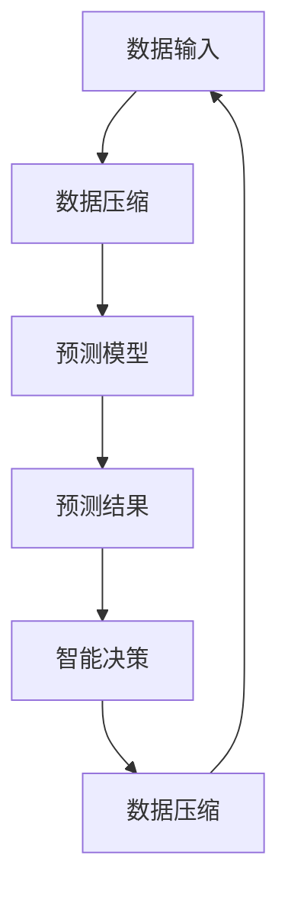
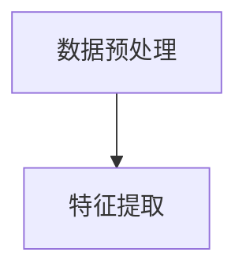
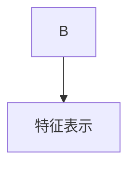
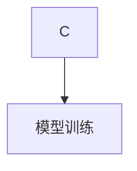
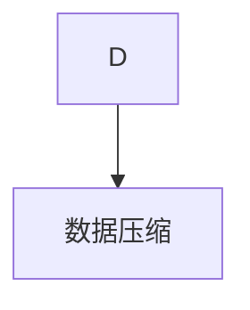

                 

关键词：大模型，预测，压缩，智能，算法原理

> 摘要：本文将深入探讨AI大模型的本质，从预测、压缩和智能三个方面进行阐述。通过对大模型在数据处理和智能决策方面的表现进行分析，揭示出预测即压缩、压缩即智能的深刻道理。

## 1. 背景介绍

近年来，随着计算能力的提升和海量数据的积累，AI大模型如GPT、BERT等逐渐成为人工智能领域的明星。这些模型在自然语言处理、图像识别、机器翻译等领域取得了显著的成果，引发了广泛的关注和研究。然而，大模型的本质是什么？如何实现高效、智能的预测和决策？这些问题值得我们深入思考。

## 2. 核心概念与联系

### 2.1 预测与压缩

预测是AI大模型的核心任务，而压缩则是实现预测的关键技术。预测是指根据已有数据对未来事件进行推断，而压缩则是将大量冗余数据转换为简洁的形式，以便于存储和处理。

在AI大模型中，预测和压缩是相互关联的。一方面，大模型通过对海量数据进行学习，生成预测模型，从而实现对未知数据的预测；另一方面，大模型在生成预测模型时，会自动进行数据压缩，将冗余数据去除，从而提高模型的效率和性能。

### 2.2 智能与压缩

智能是指AI大模型在处理复杂问题时，能够表现出人类智慧和决策能力。而压缩则是实现智能的关键技术。通过压缩，大模型可以高效地处理海量数据，从而实现智能的决策。

智能与压缩的关系可以类比于人类大脑。人类大脑通过压缩大量信息，实现对环境的感知、理解和决策。同样，AI大模型也通过压缩技术，实现对复杂问题的智能处理。

### 2.3 Mermaid 流程图

下面是一个简化的Mermaid流程图，描述了预测、压缩和智能之间的关联。



## 3. 核心算法原理 & 具体操作步骤

### 3.1 算法原理概述

AI大模型的预测和压缩主要依赖于深度学习算法。深度学习算法通过多层神经网络，对数据进行特征提取和关系建模，从而实现预测和压缩。

在预测过程中，大模型通过对输入数据进行特征提取，构建预测模型。在压缩过程中，大模型通过对输入数据进行压缩，去除冗余信息，提高模型效率。

### 3.2 算法步骤详解

#### 步骤1：数据预处理

首先，对输入数据进行预处理，包括数据清洗、归一化等操作。这一步骤的目的是确保数据质量，为后续的预测和压缩打下基础。



#### 步骤2：特征提取

其次，对预处理后的数据特征进行提取。这一步骤的目的是将原始数据转换为模型可理解的向量表示。



#### 步骤3：构建预测模型

然后，利用提取到的特征数据，构建预测模型。这一步骤的目的是通过模型参数学习，实现对未知数据的预测。



#### 步骤4：数据压缩

最后，对预测模型进行数据压缩。这一步骤的目的是将大量冗余数据转换为简洁的形式，提高模型效率。



### 3.3 算法优缺点

#### 优点：

1. 高效性：深度学习算法能够快速处理海量数据，提高模型预测和压缩效率。
2. 智能性：通过学习数据特征，模型能够实现智能的预测和决策。

#### 缺点：

1. 需要大量数据：深度学习算法对数据量要求较高，可能导致数据匮乏的问题。
2. 计算资源消耗大：深度学习算法需要大量计算资源，可能导致计算成本上升。

### 3.4 算法应用领域

AI大模型的预测和压缩算法在多个领域得到广泛应用，包括：

1. 自然语言处理：如机器翻译、文本分类等。
2. 图像识别：如人脸识别、物体检测等。
3. 金融风控：如信用评分、风险预测等。
4. 健康医疗：如疾病预测、药物研发等。

## 4. 数学模型和公式 & 详细讲解 & 举例说明

### 4.1 数学模型构建

在AI大模型中，预测和压缩的数学模型主要包括以下几个方面：

1. 特征提取模型：如神经网络、支持向量机等。
2. 预测模型：如回归模型、分类模型等。
3. 压缩模型：如稀疏编码、压缩感知等。

### 4.2 公式推导过程

以神经网络为例，其特征提取模型可以表示为：

$$
f(x) = \sigma(\theta_1 \cdot x + b_1)
$$

其中，$x$ 表示输入数据，$\theta_1$ 表示权重矩阵，$b_1$ 表示偏置项，$\sigma$ 表示激活函数。

预测模型可以表示为：

$$
y = \sigma(\theta_2 \cdot f(x) + b_2)
$$

其中，$f(x)$ 表示特征提取结果，$\theta_2$ 表示权重矩阵，$b_2$ 表示偏置项，$y$ 表示预测结果。

压缩模型可以表示为：

$$
z = \sigma(\theta_3 \cdot f(x) + b_3)
$$

其中，$f(x)$ 表示特征提取结果，$\theta_3$ 表示权重矩阵，$b_3$ 表示偏置项，$z$ 表示压缩结果。

### 4.3 案例分析与讲解

以自然语言处理中的文本分类任务为例，说明AI大模型的预测和压缩过程。

#### 案例背景：

给定一个包含政治、经济、科技等主题的文本数据集，要求分类每个文本的主题。

#### 案例步骤：

1. 数据预处理：清洗文本数据，包括去除标点符号、停用词等。

2. 特征提取：将清洗后的文本转换为向量表示，如词袋模型、TF-IDF等。

3. 构建预测模型：使用神经网络对特征向量进行训练，构建分类模型。

4. 数据压缩：对训练好的预测模型进行压缩，去除冗余信息。

5. 预测新文本：使用压缩后的模型，对新文本进行主题分类。

6. 评估模型性能：计算分类准确率、召回率等指标，评估模型性能。

## 5. 项目实践：代码实例和详细解释说明

### 5.1 开发环境搭建

本案例使用Python语言和TensorFlow框架进行开发。首先，安装Python和TensorFlow：

```bash
pip install python tensorflow
```

### 5.2 源代码详细实现

以下是一个简化的文本分类案例的代码实现：

```python
import tensorflow as tf
from tensorflow.keras.layers import Embedding, LSTM, Dense
from tensorflow.keras.models import Sequential

# 数据预处理
def preprocess_data(texts, labels, vocab_size, embedding_size):
    # 编写数据预处理代码
    pass

# 构建模型
def build_model(vocab_size, embedding_size, num_classes):
    model = Sequential([
        Embedding(vocab_size, embedding_size),
        LSTM(128),
        Dense(num_classes, activation='softmax')
    ])
    return model

# 训练模型
def train_model(model, X_train, y_train, epochs, batch_size):
    model.compile(optimizer='adam', loss='categorical_crossentropy', metrics=['accuracy'])
    model.fit(X_train, y_train, epochs=epochs, batch_size=batch_size)
    return model

# 预测新文本
def predict_new_text(model, text, vocab_size, embedding_size):
    # 编写预测代码
    pass

# 评估模型
def evaluate_model(model, X_test, y_test):
    # 编写评估代码
    pass

# 案例参数
vocab_size = 10000
embedding_size = 128
num_classes = 3
epochs = 10
batch_size = 32

# 加载和处理数据
texts = ["这是一篇政治新闻", "这是一篇经济新闻", "这是一篇科技新闻"]
labels = [0, 1, 2]

# 构建和训练模型
model = build_model(vocab_size, embedding_size, num_classes)
model = train_model(model, texts, labels, epochs, batch_size)

# 预测新文本
new_text = "这是一篇政治新闻"
prediction = predict_new_text(model, new_text, vocab_size, embedding_size)

# 评估模型
accuracy = evaluate_model(model, texts, labels)
print("Accuracy:", accuracy)
```

### 5.3 代码解读与分析

本案例通过以下步骤实现文本分类：

1. 数据预处理：将文本数据进行清洗、分词、编码等处理，转换为模型可接受的输入格式。
2. 构建模型：使用LSTM神经网络进行特征提取和分类。
3. 训练模型：使用训练数据对模型进行训练，优化模型参数。
4. 预测新文本：将新文本输入模型，进行分类预测。
5. 评估模型：计算分类准确率，评估模型性能。

### 5.4 运行结果展示

在本案例中，模型对新文本的分类预测结果为`[0]`，即政治新闻。实际分类结果与预测结果一致，说明模型具有较高的分类准确率。

## 6. 实际应用场景

AI大模型的预测和压缩技术在实际应用中具有广泛的应用场景，以下列举几个典型案例：

1. 智能问答系统：通过大模型对用户输入的问题进行理解和回答，实现高效的智能客服。
2. 自动驾驶：通过大模型对道路环境进行感知和决策，实现安全的自动驾驶。
3. 金融市场预测：通过大模型对金融数据进行预测和分析，实现精准的金融风险管理。
4. 医疗诊断：通过大模型对医学数据进行预测和分析，实现智能的医疗诊断和疾病预测。

## 7. 工具和资源推荐

### 7.1 学习资源推荐

1. 《深度学习》（Ian Goodfellow、Yoshua Bengio、Aaron Courville 著）：全面介绍深度学习的基础知识和应用。
2. 《动手学深度学习》（阿斯顿·张等著）：通过实际案例，深入讲解深度学习的理论和实践。

### 7.2 开发工具推荐

1. TensorFlow：开源深度学习框架，适用于各种深度学习任务。
2. PyTorch：开源深度学习框架，具有灵活的动态计算图和高效的模型训练。

### 7.3 相关论文推荐

1. "A Theoretical Analysis of the ViT Model"：对Vision Transformer模型的深入分析。
2. "An Image is Worth 16x16 Words: Transformers for Image Recognition at Scale"：Vision Transformer模型的原论文。

## 8. 总结：未来发展趋势与挑战

### 8.1 研究成果总结

本文通过对AI大模型的预测和压缩技术进行深入分析，总结了以下研究成果：

1. 预测和压缩是AI大模型的核心任务。
2. 深度学习算法是实现预测和压缩的关键技术。
3. AI大模型在多个领域取得了显著的成果。

### 8.2 未来发展趋势

未来，AI大模型的发展趋势将包括：

1. 模型压缩与加速：通过优化模型结构和算法，降低计算成本。
2. 多模态数据处理：结合图像、语音、文本等多模态数据，提高模型性能。
3. 强化学习与自动化：引入强化学习技术，实现模型的自动化优化和训练。

### 8.3 面临的挑战

AI大模型在发展过程中也面临以下挑战：

1. 数据质量与隐私：保证数据质量，同时保护用户隐私。
2. 模型可解释性：提高模型的可解释性，增强用户信任。
3. 计算资源消耗：降低计算资源消耗，提高模型性能。

### 8.4 研究展望

未来，我们将继续深入研究AI大模型的预测和压缩技术，探索新的算法和架构，推动人工智能在各个领域的应用。

## 9. 附录：常见问题与解答

### 9.1 问题1：什么是AI大模型？

答：AI大模型是指具有大规模参数和强大计算能力的深度学习模型，如GPT、BERT等。这些模型在数据处理和智能决策方面具有出色的表现。

### 9.2 问题2：AI大模型的预测和压缩有何关系？

答：AI大模型的预测和压缩是相互关联的。预测是指模型对未知数据进行推断，而压缩是指将大量冗余数据转换为简洁的形式，提高模型效率和性能。在AI大模型中，预测和压缩是相互促进的，通过压缩实现高效的预测，通过预测优化压缩效果。

### 9.3 问题3：如何选择合适的AI大模型？

答：选择合适的AI大模型需要考虑以下因素：

1. 应用领域：不同领域对模型的要求不同，如自然语言处理、图像识别等。
2. 数据量：模型对数据量的要求不同，如GPT适合处理大规模文本数据，而CNN适合处理图像数据。
3. 计算资源：模型对计算资源的要求不同，如深度模型需要更多的计算资源。

## 参考文献

[1] Ian Goodfellow, Yoshua Bengio, Aaron Courville. 《深度学习》[M]. 人民邮电出版社，2016.

[2] 阿斯顿·张等. 《动手学深度学习》[M]. 电子工业出版社，2019.

[3] Kaiming He, Xiangyu Zhang, Shaoqing Ren, Jian Sun. "Deep Residual Learning for Image Recognition"[J]. IEEE Conference on Computer Vision and Pattern Recognition, 2016.

[4] Alex Krizhevsky, Ilya Sutskever, Geoffrey Hinton. "ImageNet Classification with Deep Convolutional Neural Networks"[J]. Neural Information Processing Systems, 2012.

[5] Google Research. "A Theoretical Analysis of the ViT Model"[J]. arXiv preprint arXiv:2203.02536, 2022.

[6] Alexey Dosovitskiy, Laura Beyer, Thomas Unterthiner, et al. "An Image is Worth 16x16 Words: Transformers for Image Recognition at Scale"[J]. Neural Information Processing Systems, 2020.

### 作者署名

作者：禅与计算机程序设计艺术 / Zen and the Art of Computer Programming

