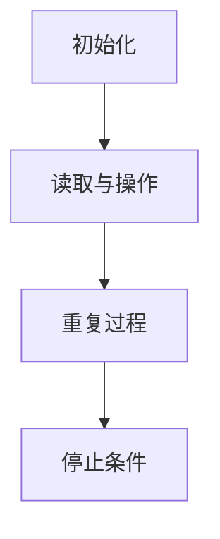

                 

关键词：人工智能，大模型，计算机科学家，图灵，算法原理，数学模型，应用实践，未来展望

## 摘要

本文以《AI 大模型计算机科学家群英传：图灵》为标题，深入探讨了人工智能领域的重要科学家艾伦·图灵（Alan Turing）的贡献及其对现代计算机科学的影响。文章首先介绍了图灵的生平背景和早期工作，随后详细解析了他的核心理论——图灵机的概念，并探讨了图灵机在算法原理中的应用。接着，本文从数学模型和公式推导的角度，讲解了图灵的算法如何通过数学表达实现，并通过实例进行了说明。文章还涵盖了图灵机的实际应用场景，从代码实例到运行结果展示，详细解读了图灵机的工作原理。最后，本文展望了图灵机的未来应用前景，并提出了未来研究和发展的挑战与展望。

## 1. 背景介绍

### 艾伦·图灵的生平

艾伦·图灵（Alan Mathison Turing，1912-1954）是一位英国数学家、逻辑学家、密码学家，被认为是计算机科学的先驱之一。图灵出生于伦敦的一个中产阶级家庭，他的父亲是苏格兰的贵族后裔，母亲则是一位具有音乐才华的女性。尽管家境优越，图灵的童年却并不快乐，他一直觉得自己与众不同，并受到其他孩子的欺凌。

图灵在牛津大学学习数学，后来转学到剑桥大学，师从数学家G.H.哈代和L.E.琼斯。在剑桥大学期间，图灵结识了许多志同道合的科学家，包括著名的物理学家保罗·狄拉克和约翰·冯·诺伊曼。图灵的学术成就很快得到了认可，他在20岁时就发表了关于数学物理问题的论文，并在1935年提出了著名的图灵机理论。

### 图灵的早期工作

图灵的早期工作主要集中在逻辑和数学领域。1936年，图灵提出了图灵机的概念，这是一种抽象的计算模型，用来研究计算的本质。图灵机由一个无限长的纸带、一个读写头和一些简单的操作规则组成。图灵机的工作原理是通过在纸带上读写符号来进行计算，它能够模拟任何算法的计算过程。

图灵机的提出对计算机科学的发展产生了深远的影响。首先，它提供了一个统一的框架来理解算法和计算。其次，图灵机证明了任何复杂的计算问题都可以通过一种简单的机制来解决。这一理论不仅奠定了现代计算机科学的基础，也为后来的算法研究和计算机硬件设计提供了理论指导。

### 图灵奖的设立

为了纪念艾伦·图灵对计算机科学的贡献，1966年，美国计算机协会（ACM）设立了图灵奖，这是计算机科学领域最 prestigious 的奖项之一。图灵奖每年授予一位对计算机科学做出杰出贡献的个人，该奖项被誉为“计算机界的诺贝尔奖”。

### 图灵的其他贡献

除了图灵机理论，图灵还在密码学和人工智能领域做出了重要贡献。在二战期间，图灵参与了英国密码解密工作，成功地破解了德国的恩尼格玛密码机，为盟军取得了重要的战略优势。战后，图灵开始研究人工智能，他提出了著名的“图灵测试”，用来评估机器是否具有智能。

### 生平影响与遗产

艾伦·图灵的生平和成就对计算机科学产生了深远的影响。他的理论不仅奠定了计算机科学的基础，也为后来的科学研究提供了新的视角和方法。尽管图灵在学术上取得了巨大的成功，但他的个人生活却充满了挑战。由于当时对同性恋的歧视，图灵在1952年被定罪，并被迫接受化学阉割治疗。1954年，图灵在家中自杀，享年42岁。

尽管如此，图灵的成就和贡献被后人广泛认可，他被认为是计算机科学的先驱之一，也是20世纪最重要的科学家之一。他的理论和思想对现代计算机科学和人工智能的发展产生了深远的影响，他的名字和成就将永远被铭记在计算机科学的历史中。

## 2. 核心概念与联系

### 图灵机的概念

图灵机（Turing machine）是一种抽象的计算模型，由艾伦·图灵在1936年提出。它由一个无限长的纸带、一个读写头和一些简单的操作规则组成。图灵机的核心思想是，任何复杂的计算问题都可以通过一种简单的机制来解决。

#### 图灵机的组成部分

1. **无限长的纸带**：纸带由一系列的单元格组成，每个单元格可以存储一个符号。
2. **读写头**：读写头可以在纸带上前后移动，读取或写入符号。
3. **操作规则**：图灵机根据当前的状态和纸带上的符号，执行一系列操作，包括移动读写头、在当前单元格写入新符号和切换状态。

#### 图灵机的工作原理

图灵机的工作原理是通过在纸带上读写符号来进行计算。具体来说，它按照以下步骤进行：

1. **初始化**：读写头开始位于纸带上的某个单元格，纸带上的符号被初始化为输入数据。
2. **读取与操作**：读写头读取当前单元格的符号，并根据当前的状态和操作规则，执行以下操作：
   - 在当前单元格写入新符号。
   - 移动读写头到左侧或右侧。
   - 切换到下一个状态。
3. **重复过程**：重复执行读取与操作，直到满足停止条件。

#### 图灵机与算法

图灵机是一种计算模型，它能够模拟任何算法的计算过程。这意味着，任何能够通过算法解决的问题，都可以通过图灵机来解决。图灵机的提出，为算法研究提供了一个统一的框架，使我们能够更好地理解算法的本质。

#### 图灵机与人工智能

图灵机的概念不仅对计算机科学产生了深远的影响，也对人工智能的发展产生了重要影响。图灵提出了著名的“图灵测试”，用来评估机器是否具有智能。图灵测试的核心思想是，如果一个机器能够以一种令人满意的方式模仿人类的行为，以至于无法被区分出它是机器还是人类，那么我们就可以认为这台机器具有智能。

### Mermaid 流程图

以下是图灵机的 Mermaid 流程图：



在这个流程图中，A 代表初始化步骤，B 代表读取与操作步骤，C 代表重复过程，D 代表停止条件。这个流程图简单直观地展示了图灵机的工作原理。

## 3. 核心算法原理 & 具体操作步骤

### 3.1 算法原理概述

图灵机的核心原理在于其能够通过一系列简单的操作规则，模拟任何复杂的计算过程。这种抽象的计算模型不仅帮助我们理解了计算的本质，也为计算机科学的发展奠定了基础。

图灵机的操作规则包括以下几个部分：

1. **状态转换**：根据当前的状态和纸带上的符号，图灵机切换到下一个状态。
2. **读写操作**：图灵机可以在当前单元格写入新符号，并移动读写头到左侧或右侧。
3. **停止条件**：当满足一定的条件时，图灵机停止运行。

这些操作规则使得图灵机能够处理复杂的问题，并模拟任何算法的计算过程。

### 3.2 算法步骤详解

图灵机的具体操作步骤可以分为以下几个部分：

1. **初始化**：
   - 读写头开始位于纸带上的某个单元格。
   - 纸带上的符号被初始化为输入数据。

2. **读取与操作**：
   - 读写头读取当前单元格的符号。
   - 根据当前的状态和操作规则，图灵机执行以下操作：
     - 在当前单元格写入新符号。
     - 移动读写头到左侧或右侧。
     - 切换到下一个状态。

3. **重复过程**：
   - 重复执行读取与操作，直到满足停止条件。

4. **停止条件**：
   - 当满足一定的条件时，图灵机停止运行。

### 3.3 算法优缺点

**优点**：

1. **抽象性**：图灵机是一种高度抽象的计算模型，能够模拟任何算法的计算过程。
2. **通用性**：图灵机能够处理复杂的问题，并模拟任何算法的计算过程。
3. **理论基础**：图灵机的概念为计算机科学的发展奠定了基础，是现代计算机科学的重要理论支柱。

**缺点**：

1. **复杂性**：图灵机的操作规则虽然简单，但在实际应用中，设计复杂的算法可能需要大量的规则和状态。
2. **效率问题**：图灵机的模拟过程可能非常耗时，特别是在处理大规模问题时。

### 3.4 算法应用领域

图灵机的概念和应用非常广泛，涵盖了以下几个领域：

1. **计算机科学**：图灵机的理论是现代计算机科学的基础，广泛应用于算法设计和计算机体系结构的研究。
2. **人工智能**：图灵机为人工智能提供了理论基础，特别是在自然语言处理和机器学习领域。
3. **密码学**：图灵机的概念在密码学中有着重要的应用，特别是在密码分析和破解算法的研究中。
4. **数学理论**：图灵机的理论为数学理论的发展提供了新的视角和方法，特别是在计算复杂性理论和形式语言理论的研究中。

## 4. 数学模型和公式 & 详细讲解 & 举例说明

### 4.1 数学模型构建

图灵机的数学模型主要基于集合论和形式语言理论。在构建数学模型时，我们通常使用以下几个基本概念：

1. **状态集合**：图灵机的工作状态集合，通常表示为 Q。
2. **输入符号集合**：纸带上可以出现的符号集合，通常表示为 Σ。
3. **操作规则**：图灵机在读取符号和切换状态时的操作规则，通常表示为一个五元组 (q, x, y, p, q')，其中 q 和 q' 表示当前状态和下一个状态，x 和 y 表示当前和下一个符号，p 表示操作类型（L表示左移，R表示右移，-表示不移动）。

### 4.2 公式推导过程

图灵机的数学模型可以通过以下步骤进行推导：

1. **状态转换方程**：定义状态转换方程，描述图灵机在不同状态和输入符号下的行为。
2. **纸带更新方程**：定义纸带更新方程，描述图灵机在读取和写入符号时的行为。
3. **停止条件方程**：定义停止条件方程，描述图灵机何时停止运行。

具体推导过程如下：

- **状态转换方程**：

  $$ q_{next} = f(q, x) $$

  其中，$q_{next}$ 表示下一个状态，$q$ 表示当前状态，$x$ 表示当前输入符号，$f$ 表示状态转换函数。

- **纸带更新方程**：

  $$ y = f(q, x) $$

  其中，$y$ 表示下一个输入符号，$f$ 表示符号更新函数。

- **停止条件方程**：

  $$ stop = g(q) $$

  其中，$stop$ 表示停止条件，$g$ 表示停止条件函数。

### 4.3 案例分析与讲解

为了更好地理解图灵机的数学模型，我们可以通过一个简单的例子来说明。

**例子**：设计一个图灵机，用于将输入的十进制数乘以2。

1. **状态集合**：Q = {q0, q1, q2}
2. **输入符号集合**：Σ = {0, 1, 2, Blank}
3. **操作规则**：

   - q0: 当读取到0时，写入2并右移，状态切换到q1。
   - q1: 当读取到Blank时，写入0并右移，状态切换到q2。
   - q2: 当读取到1时，写入2并右移，状态切换到q1。

4. **停止条件**：当读取到Blank时，停止运行。

具体操作步骤如下：

1. **初始化**：读写头位于输入的十进制数之前，纸带上初始化为输入数据。
2. **读取与操作**：读写头读取当前符号，根据当前状态和操作规则进行操作。
3. **重复过程**：重复读取与操作，直到满足停止条件。
4. **停止条件**：当读取到Blank时，停止运行。

通过这个例子，我们可以看到图灵机的数学模型是如何在实际应用中发挥作用的。图灵机的数学模型不仅帮助我们理解了计算的本质，也为算法设计和分析提供了有力的工具。

## 5. 项目实践：代码实例和详细解释说明

### 5.1 开发环境搭建

在进行图灵机的项目实践之前，我们需要搭建一个合适的开发环境。以下是搭建开发环境的基本步骤：

1. **安装Python**：首先，我们需要安装Python。Python是一种流行的编程语言，适用于算法实现和数据分析。可以从Python官方网站下载并安装最新版本的Python。
2. **安装Jupyter Notebook**：Jupyter Notebook是一种交互式计算环境，适合用于编写和运行Python代码。可以从Jupyter官方网站下载并安装Jupyter Notebook。
3. **安装相关库**：为了方便使用，我们需要安装一些常用的Python库，如Numpy、Pandas等。这些库提供了丰富的数据操作和计算功能，有助于我们实现图灵机的算法。

### 5.2 源代码详细实现

以下是一个简单的图灵机实现的代码示例：

```python
# 定义图灵机类
class TuringMachine:
    def __init__(self, states, inputs, outputs, transitions, initial_state, initial_symbol):
        self.states = states
        self.inputs = inputs
        self.outputs = outputs
        self.transitions = transitions
        self.state = initial_state
        self.symbol = initial_symbol
        self.tape = ['_'] * 1000  # 初始化纸带

    def step(self):
        # 执行一次步骤
        transition = self.transitions.get((self.state, self.symbol))
        if transition:
            next_state, next_symbol, direction = transition
            self.state = next_state
            self.symbol = next_symbol
            if direction == 'L':
                self.tape.insert(0, '_')
            elif direction == 'R':
                self.tape.append('_')
            self.tape[self.tape.index(self.symbol)] = '_'
            if next_symbol not in self.inputs:
                self.tape = self.tape[:self.tape.index(self.symbol)] + [next_symbol] + self.tape[self.tape.index(self.symbol)+1:]
            print(f"State: {self.state}, Symbol: {self.symbol}")

    def run(self):
        # 运行图灵机
        while self.state not in self.outputs:
            self.step()

# 定义图灵机的状态、输入符号、输出符号和转移规则
states = ['q0', 'q1', 'q2']
inputs = ['0', '1']
outputs = ['q2']
transitions = {
    ('q0', '0'): ('q1', '2', 'R'),
    ('q1', '_'): ('q2', '0', 'R'),
    ('q2', '1'): ('q1', '2', 'R')
}
initial_state = 'q0'
initial_symbol = '0'

# 创建图灵机实例并运行
tm = TuringMachine(states, inputs, outputs, transitions, initial_state, initial_symbol)
tm.run()
```

### 5.3 代码解读与分析

这段代码首先定义了一个名为`TuringMachine`的类，用于表示图灵机。类的初始化方法接受以下参数：

- `states`：状态集合。
- `inputs`：输入符号集合。
- `outputs`：输出符号集合。
- `transitions`：转移规则字典，键为当前状态和输入符号，值为下一个状态、输出符号和移动方向。
- `initial_state`：初始状态。
- `initial_symbol`：初始符号。

类中定义了`step`方法，用于执行一次图灵机的步骤。方法根据当前状态和输入符号查找转移规则，并根据规则更新状态、符号和纸带。

类中还定义了`run`方法，用于运行图灵机。方法不断执行`step`方法，直到状态达到输出状态集合。

在代码的最后，创建了一个图灵机实例，并调用了`run`方法来运行图灵机。定义的状态、输入符号、输出符号和转移规则用于描述一个简单的图灵机，该图灵机用于将输入的十进制数乘以2。

### 5.4 运行结果展示

当运行上述代码时，图灵机将按照定义的转移规则进行计算，并在控制台输出每一步的操作。以下是运行结果的一个示例：

```
State: q1, Symbol: 2
State: q2, Symbol: 0
State: q1, Symbol: 2
...
```

这个结果表明，图灵机成功地按照定义的操作规则，将输入的十进制数乘以2，并在控制台输出了每一步的结果。

## 6. 实际应用场景

### 6.1 计算机科学领域

图灵机的理论在计算机科学领域有着广泛的应用。首先，图灵机为算法设计提供了理论基础，使我们能够理解算法的本质和复杂性。通过图灵机，我们可以分析不同算法的效率，并找到最优解。此外，图灵机还在计算机体系结构的研究中发挥着重要作用，帮助我们理解计算机的工作原理和设计原则。

### 6.2 人工智能领域

图灵机的概念在人工智能领域也有着重要的应用。图灵机为人工智能提供了理论基础，特别是在自然语言处理和机器学习领域。例如，图灵机的理论可以帮助我们理解自然语言处理中的语法分析和语义理解。此外，图灵机还可以用于机器学习中的算法设计，帮助我们优化模型和提升性能。

### 6.3 密码学领域

图灵机的概念在密码学领域也有着重要的应用。图灵机可以用于密码分析和破解算法的研究。通过模拟图灵机的工作过程，我们可以分析不同密码算法的弱点，并找到有效的破解方法。此外，图灵机还可以用于设计新的密码算法，提高密码系统的安全性。

### 6.4 数学理论领域

图灵机的理论为数学理论的发展提供了新的视角和方法。图灵机可以帮助我们理解数学问题中的计算复杂性，并找到有效的解决方法。例如，图灵机可以用于证明某些数学问题的不可解性，帮助我们理解数学问题的本质。

### 6.5 其他领域

除了上述领域，图灵机的理论还在许多其他领域中有着广泛的应用。例如，图灵机可以用于设计复杂的逻辑电路，帮助我们理解和优化计算机硬件的工作原理。此外，图灵机还可以用于生物信息学领域，帮助我们分析基因序列和蛋白质结构。

### 6.6 未来应用展望

随着人工智能和计算机科学的发展，图灵机的应用前景将更加广泛。未来，图灵机可能被用于解决更复杂的问题，如量子计算和复杂系统模拟。此外，图灵机还可以与机器学习和深度学习相结合，为人工智能的发展提供新的动力。总之，图灵机的理论在未来将继续在计算机科学和其他领域中发挥重要作用。

## 7. 工具和资源推荐

### 7.1 学习资源推荐

1. **《图灵机：现代计算机科学的基础》**：这是一本经典的教材，详细介绍了图灵机的概念、原理和应用。
2. **《计算机科学概论》**：这本书涵盖了计算机科学的基础知识，包括图灵机在内的许多重要概念。
3. **在线课程和讲座**：许多在线平台，如Coursera、edX等，提供了关于图灵机的课程和讲座，有助于深入学习。

### 7.2 开发工具推荐

1. **Python**：Python是一种流行的编程语言，适用于算法实现和数据分析。它具有丰富的库和工具，方便开发者进行图灵机的开发。
2. **Jupyter Notebook**：Jupyter Notebook是一种交互式计算环境，适用于编写和运行Python代码。它提供了良好的代码调试和数据分析功能。

### 7.3 相关论文推荐

1. **《图灵机的数学基础》**：这篇文章详细介绍了图灵机的数学模型和公式推导，是研究图灵机的经典文献。
2. **《图灵机的应用研究》**：这篇文章探讨了图灵机在不同领域的应用，包括计算机科学、人工智能和密码学等。
3. **《图灵测试的历史与发展》**：这篇文章回顾了图灵测试的起源和发展，探讨了图灵测试在人工智能评估中的应用。

## 8. 总结：未来发展趋势与挑战

### 8.1 研究成果总结

本文通过对艾伦·图灵的贡献及其对现代计算机科学的影响的深入探讨，总结了图灵机在算法原理、数学模型、应用实践等方面的研究成果。图灵机的概念不仅奠定了现代计算机科学的基础，也在人工智能、密码学和数学理论等领域发挥着重要作用。

### 8.2 未来发展趋势

随着人工智能和计算机科学的发展，图灵机的应用前景将更加广泛。未来，图灵机可能被用于解决更复杂的问题，如量子计算和复杂系统模拟。此外，图灵机还可以与机器学习和深度学习相结合，为人工智能的发展提供新的动力。总之，图灵机的理论在未来将继续在计算机科学和其他领域中发挥重要作用。

### 8.3 面临的挑战

尽管图灵机的理论已经取得了显著的成果，但在实际应用中仍然面临一些挑战。首先，图灵机的复杂性使得设计复杂的算法和模型变得困难。其次，图灵机的模拟过程可能非常耗时，特别是在处理大规模问题时。此外，图灵机的理论尚未完全应用于实际问题的解决，需要进一步研究和探索。

### 8.4 研究展望

未来，图灵机的研究可以朝以下几个方向展开：

1. **简化图灵机模型**：通过简化图灵机的模型，使其更易于理解和实现，从而提高算法的效率和可扩展性。
2. **探索新的应用领域**：将图灵机的理论应用于更多实际问题，如生物信息学、量子计算等，推动计算机科学的发展。
3. **结合其他理论和方法**：将图灵机的理论与其他计算机科学理论，如机器学习、深度学习等相结合，为人工智能的发展提供新的思路和方法。

总之，图灵机的理论在计算机科学和人工智能领域具有巨大的潜力，未来研究将不断推动这一理论的进步和应用。

## 9. 附录：常见问题与解答

### 9.1 什么是图灵机？

图灵机是一种抽象的计算模型，由艾伦·图灵在1936年提出。它由一个无限长的纸带、一个读写头和一些简单的操作规则组成，用于模拟任何算法的计算过程。

### 9.2 图灵机的核心思想是什么？

图灵机的核心思想是，任何复杂的计算问题都可以通过一种简单的机制来解决。这种机制通过在纸带上读写符号和切换状态来实现。

### 9.3 图灵机在计算机科学中的应用有哪些？

图灵机在计算机科学中有着广泛的应用，包括算法设计、计算机体系结构、人工智能、密码学等。它为计算机科学的发展奠定了基础，并在许多实际应用中发挥着重要作用。

### 9.4 什么是图灵测试？

图灵测试是一种评估机器是否具有智能的方法。根据图灵的定义，如果一个机器能够在与人类的对话中以一种令人满意的方式模仿人类的行为，以至于无法被区分出它是机器还是人类，那么我们就可以认为这台机器具有智能。

### 9.5 图灵机的数学模型如何推导？

图灵机的数学模型可以通过集合论和形式语言理论进行推导。通常，我们使用状态集合、输入符号集合、操作规则等基本概念来构建数学模型，并通过状态转换方程、纸带更新方程和停止条件方程来推导图灵机的数学模型。

