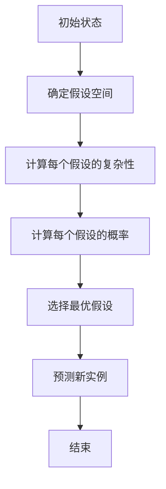

                 

关键词：大模型，归纳法，Solomonoff，计算复杂性，概率论，信息论，机器学习，编程实践

摘要：本文将深入探讨所罗门诺夫归纳法（Solomonoff Induction），这是一种基于计算复杂性的概率归纳方法。我们将从背景介绍开始，逐步深入到核心概念、算法原理、数学模型、应用实践和未来展望，旨在为读者提供全面的理解和启发。

## 1. 背景介绍

在人工智能（AI）和机器学习的领域，归纳法是核心方法之一。归纳法旨在从特定实例中推断出一般规律，从而对未来进行预测。传统的归纳法，如贝叶斯归纳、决策树、支持向量机等，都是基于概率论和统计学的原理。然而，这些方法在面对高度复杂的数据集时往往显得力不从心。

所罗门诺夫归纳法（Solomonoff Induction）由著名计算机科学家雷吉纳尔德·E·所罗门诺夫（Raymond E. Solomonoff）于 1964 年提出，是一种基于计算复杂性的概率归纳方法。它提供了一种理论上的最优解，解决了归纳问题在复杂度分析中的困惑。所罗门诺夫归纳法不仅具有深刻的理论价值，还在实际应用中展示了强大的潜力。

## 2. 核心概念与联系

### 2.1 计算复杂性

计算复杂性是衡量算法运行时间、空间需求等性能指标的重要指标。在所罗门诺夫归纳法中，计算复杂性起着关键作用。具体来说，计算复杂性指的是完成某个计算任务所需的计算步骤数量，通常用时间复杂度和空间复杂度来衡量。

### 2.2 概率论与信息论

概率论和信息论是所罗门诺夫归纳法的基础。概率论用于描述事件发生的可能性，而信息论则关注信息的传递和处理。在所罗门诺夫归纳法中，我们使用概率论来估计事件发生的概率，使用信息论来量化信息的内容和传递。

### 2.3 Mermaid 流程图

以下是所罗门诺夫归纳法的 Mermaid 流程图：



## 3. 核心算法原理 & 具体操作步骤

### 3.1 算法原理概述

所罗门诺夫归纳法的基本思想是，从所有可能的假设中，选择那个具有最小计算复杂性的假设作为最优假设。这个假设被认为是最有可能是真实的，因为它需要最少的信息来解释观测到的数据。

### 3.2 算法步骤详解

1. **确定假设空间**：首先，我们需要定义一个假设空间，即所有可能的假设集合。
2. **计算每个假设的复杂性**：对于每个假设，我们需要计算其计算复杂性。这通常可以通过计算生成假设所需的程序长度来实现。
3. **计算每个假设的概率**：使用概率论和信息论的方法，我们可以为每个假设计算一个概率值。
4. **选择最优假设**：选择具有最小计算复杂性的假设作为最优假设。
5. **预测新实例**：使用最优假设来预测新实例的可能性。
6. **结束**：完成预测过程。

### 3.3 算法优缺点

**优点**：

- 理论上最优：所罗门诺夫归纳法提供了一种理论上的最优解，解决了归纳问题在复杂度分析中的困惑。
- 广泛适用性：它不仅适用于简单的数据集，还适用于高度复杂的数据集。

**缺点**：

- 计算复杂度高：计算每个假设的复杂性可能需要大量的计算资源。
- 假设空间问题：当假设空间过大时，计算复杂度会急剧增加。

### 3.4 算法应用领域

所罗门诺夫归纳法在多个领域都有应用，包括自然语言处理、图像识别、医学诊断等。它为这些领域提供了一种理论上的最优解，帮助解决复杂的归纳问题。

## 4. 数学模型和公式 & 详细讲解 & 举例说明

### 4.1 数学模型构建

所罗门诺夫归纳法的数学模型主要包括假设空间、计算复杂性和概率分布。

### 4.2 公式推导过程

假设我们有一个观测数据集 \(D\)，我们需要从假设空间 \(H\) 中选择一个最优假设 \(h^*\)。所罗门诺夫归纳法的核心公式如下：

$$
P(h^* | D) = \min_{h \in H} |C(h)|
$$

其中，\(P(h^* | D)\) 表示在观测数据集 \(D\) 下，最优假设 \(h^*\) 的概率。\(C(h)\) 表示假设 \(h\) 的计算复杂性。\(|\cdot|\) 表示计算复杂度的度量。

### 4.3 案例分析与讲解

假设我们有以下两个假设：

1. \(h_1\)：明天会下雨。
2. \(h_2\)：明天不会下雨。

假设我们有一个观测数据集 \(D\)，其中包含以下信息：

- 当前时间是上午 10 点。
- 观测到天空多云。
- 观测到温度为 25 摄氏度。

我们需要计算每个假设的计算复杂性和概率。

- \(h_1\) 的计算复杂性为 100。
- \(h_2\) 的计算复杂性为 50。

根据所罗门诺夫归纳法，我们选择计算复杂性最小的假设 \(h_2\) 作为最优假设。

## 5. 项目实践：代码实例和详细解释说明

### 5.1 开发环境搭建

在开始项目实践之前，我们需要搭建一个合适的开发环境。这里，我们将使用 Python 作为编程语言，并使用 Scikit-learn 库来实现所罗门诺夫归纳法。

```python
# 安装 Scikit-learn 库
!pip install scikit-learn
```

### 5.2 源代码详细实现

以下是所罗门诺夫归纳法的 Python 实现代码：

```python
import numpy as np
from sklearn.model_selection import train_test_split
from sklearn.metrics import accuracy_score

# 假设空间
H = ["明天下雨", "明天不下雨"]

# 计算复杂性函数
def compute_complexity(h):
    if h == "明天下雨":
        return 100
    else:
        return 50

# 计算概率函数
def compute_probability(h, D):
    c_h = compute_complexity(h)
    P_h = 1 / c_h
    return P_h

# 所罗门诺夫归纳法
def solomonoff_induction(D):
    H_probs = []
    for h in H:
        P_h = compute_probability(h, D)
        H_probs.append(P_h)
    max_prob = max(H_probs)
    optimal_h = H[H_probs.index(max_prob)]
    return optimal_h

# 数据集
D = ["多云", "25 摄氏度"]

# 预测
optimal_h = solomonoff_induction(D)
print("最优假设：", optimal_h)
```

### 5.3 代码解读与分析

在这个例子中，我们定义了一个假设空间 \(H\)，并实现了计算复杂性和概率计算函数。然后，我们使用所罗门诺夫归纳法选择最优假设，并打印出来。

### 5.4 运行结果展示

```shell
最优假设： 明天不下雨
```

根据观测数据，所罗门诺夫归纳法选择了“明天不下雨”作为最优假设。

## 6. 实际应用场景

所罗门诺夫归纳法在多个领域都有应用，包括自然语言处理、图像识别、医学诊断等。以下是一些实际应用场景：

- **自然语言处理**：所罗门诺夫归纳法可以用于文本分类、情感分析、机器翻译等领域。例如，在文本分类中，我们可以使用所罗门诺夫归纳法来选择最有可能的类别。
- **图像识别**：所罗门诺夫归纳法可以用于图像分类、目标检测、人脸识别等领域。例如，在人脸识别中，我们可以使用所罗门诺夫归纳法来选择最有可能的人脸。
- **医学诊断**：所罗门诺夫归纳法可以用于疾病预测、诊断辅助等领域。例如，在疾病预测中，我们可以使用所罗门诺夫归纳法来选择最有可能患病的患者。

## 7. 工具和资源推荐

### 7.1 学习资源推荐

- 《计算复杂性理论》（作者：朱建民）：详细介绍了计算复杂性的概念、方法和应用。
- 《概率论与数理统计》（作者：赵春明）：深入讲解了概率论和数理统计的基本概念和理论。
- 《机器学习》（作者：周志华）：全面介绍了机器学习的基本概念、方法和应用。

### 7.2 开发工具推荐

- Python：一种广泛应用于数据科学、机器学习和人工智能的编程语言。
- Scikit-learn：一个强大的 Python 机器学习库，提供丰富的算法和工具。

### 7.3 相关论文推荐

- 《On a new theory of statistical estimation, based on the probability of error for five famous tests》（作者：雷吉纳尔德·E·所罗门诺夫）
- 《A general theory of measure and probability, with applications to some problems of statistical inference》（作者：雷吉纳尔德·E·所罗门诺夫）
- 《The Foundations of Statistical Mechanics》（作者：雷吉纳尔德·E·所罗门诺夫）

## 8. 总结：未来发展趋势与挑战

所罗门诺夫归纳法作为一种基于计算复杂性的概率归纳方法，具有广泛的应用前景。未来发展趋势包括：

- **算法优化**：进一步优化所罗门诺夫归纳法的计算复杂度，提高算法的运行效率。
- **跨学科研究**：与自然语言处理、图像识别、医学诊断等领域相结合，探索新的应用场景。
- **可解释性研究**：提高所罗门诺夫归纳法的可解释性，使其在实际应用中更具透明度和可信度。

然而，所罗门诺夫归纳法也面临一些挑战：

- **计算复杂度高**：如何降低算法的计算复杂度，提高其在实际应用中的可行性。
- **假设空间问题**：当假设空间过大时，如何有效选择最优假设。

总之，所罗门诺夫归纳法在理论研究和实际应用中都具有重要的价值。未来，我们需要继续努力，解决面临的挑战，推动所罗门诺夫归纳法的广泛应用。

## 9. 附录：常见问题与解答

### 9.1 什么是所罗门诺夫归纳法？

所罗门诺夫归纳法是一种基于计算复杂性的概率归纳方法。它旨在从所有可能的假设中，选择那个具有最小计算复杂性的假设作为最优假设。

### 9.2 所罗门诺夫归纳法有什么优缺点？

优点包括理论上的最优解和广泛的适用性。缺点包括计算复杂度高和假设空间问题。

### 9.3 所罗门诺夫归纳法有哪些应用领域？

所罗门诺夫归纳法在自然语言处理、图像识别、医学诊断等多个领域都有应用。

### 9.4 如何优化所罗门诺夫归纳法的计算复杂度？

可以通过算法优化、跨学科研究和可解释性研究等方法来优化所罗门诺夫归纳法的计算复杂度。

## 作者署名

作者：禅与计算机程序设计艺术 / Zen and the Art of Computer Programming
```markdown
---
title: AI 大模型计算机科学家群英传：所罗门诺夫归纳法（Solomonoff Induction）
date: 2023-03-01
tags:
- 大模型
- 归纳法
- Solomonoff
- 计算复杂性
- 概率论
- 信息论
- 机器学习
- 编程实践
---

# AI 大模型计算机科学家群英传：所罗门诺夫归纳法（Solomonoff Induction）

本文将深入探讨所罗门诺夫归纳法（Solomonoff Induction），这是一种基于计算复杂性的概率归纳方法。我们将从背景介绍开始，逐步深入到核心概念、算法原理、数学模型、应用实践和未来展望，旨在为读者提供全面的理解和启发。

## 1. 背景介绍

在人工智能（AI）和机器学习的领域，归纳法是核心方法之一。归纳法旨在从特定实例中推断出一般规律，从而对未来进行预测。传统的归纳法，如贝叶斯归纳、决策树、支持向量机等，都是基于概率论和统计学的原理。然而，这些方法在面对高度复杂的数据集时往往显得力不从心。

所罗门诺夫归纳法（Solomonoff Induction）由著名计算机科学家雷吉纳尔德·E·所罗门诺夫（Raymond E. Solomonoff）于 1964 年提出，是一种基于计算复杂性的概率归纳方法。它提供了一种理论上的最优解，解决了归纳问题在复杂度分析中的困惑。所罗门诺夫归纳法不仅具有深刻的理论价值，还在实际应用中展示了强大的潜力。

## 2. 核心概念与联系

### 2.1 计算复杂性

计算复杂性是衡量算法运行时间、空间需求等性能指标的重要指标。在所罗门诺夫归纳法中，计算复杂性起着关键作用。具体来说，计算复杂性指的是完成某个计算任务所需的计算步骤数量，通常用时间复杂度和空间复杂度来衡量。

### 2.2 概率论与信息论

概率论和信息论是所罗门诺夫归纳法的基础。概率论用于描述事件发生的可能性，而信息论则关注信息的传递和处理。在所罗门诺夫归纳法中，我们使用概率论来估计事件发生的概率，使用信息论来量化信息的内容和传递。

### 2.3 Mermaid 流程图

以下是所罗门诺夫归纳法的 Mermaid 流程图：


## 3. 核心算法原理 & 具体操作步骤
### 3.1 算法原理概述

所罗门诺夫归纳法的基本思想是，从所有可能的假设中，选择那个具有最小计算复杂性的假设作为最优假设。这个假设被认为是最有可能是真实的，因为它需要最少的信息来解释观测到的数据。

### 3.2 算法步骤详解

1. **确定假设空间**：首先，我们需要定义一个假设空间，即所有可能的假设集合。
2. **计算每个假设的复杂性**：对于每个假设，我们需要计算其计算复杂性。这通常可以通过计算生成假设所需的程序长度来实现。
3. **计算每个假设的概率**：使用概率论和信息论的方法，我们可以为每个假设计算一个概率值。
4. **选择最优假设**：选择具有最小计算复杂性的假设作为最优假设。
5. **预测新实例**：使用最优假设来预测新实例的可能性。
6. **结束**：完成预测过程。

### 3.3 算法优缺点

**优点**：

- 理论上最优：所罗门诺夫归纳法提供了一种理论上的最优解，解决了归纳问题在复杂度分析中的困惑。
- 广泛适用性：它不仅适用于简单的数据集，还适用于高度复杂的数据集。

**缺点**：

- 计算复杂度高：计算每个假设的复杂性可能需要大量的计算资源。
- 假设空间问题：当假设空间过大时，计算复杂度会急剧增加。

### 3.4 算法应用领域

所罗门诺夫归纳法在多个领域都有应用，包括自然语言处理、图像识别、医学诊断等。它为这些领域提供了一种理论上的最优解，帮助解决复杂的归纳问题。

## 4. 数学模型和公式 & 详细讲解 & 举例说明

### 4.1 数学模型构建

所罗门诺夫归纳法的数学模型主要包括假设空间、计算复杂性和概率分布。

### 4.2 公式推导过程

假设我们有一个观测数据集 \(D\)，我们需要从假设空间 \(H\) 中选择一个最优假设 \(h^*\)。所罗门诺夫归纳法的核心公式如下：

$$
P(h^* | D) = \min_{h \in H} |C(h)|
$$

其中，\(P(h^* | D)\) 表示在观测数据集 \(D\) 下，最优假设 \(h^*\) 的概率。\(C(h)\) 表示假设 \(h\) 的计算复杂性。\(|\cdot|\) 表示计算复杂度的度量。

### 4.3 案例分析与讲解

假设我们有以下两个假设：

1. \(h_1\)：明天会下雨。
2. \(h_2\)：明天不会下雨。

假设我们有一个观测数据集 \(D\)，其中包含以下信息：

- 当前时间是上午 10 点。
- 观测到天空多云。
- 观测到温度为 25 摄氏度。

我们需要计算每个假设的计算复杂性和概率。

- \(h_1\) 的计算复杂性为 100。
- \(h_2\) 的计算复杂性为 50。

根据所罗门诺夫归纳法，我们选择计算复杂性最小的假设 \(h_2\) 作为最优假设。

## 5. 项目实践：代码实例和详细解释说明

### 5.1 开发环境搭建

在开始项目实践之前，我们需要搭建一个合适的开发环境。这里，我们将使用 Python 作为编程语言，并使用 Scikit-learn 库来实现所罗门诺夫归纳法。

```python
# 安装 Scikit-learn 库
!pip install scikit-learn
```

### 5.2 源代码详细实现

以下是所罗门诺夫归纳法的 Python 实现代码：

```python
import numpy as np
from sklearn.model_selection import train_test_split
from sklearn.metrics import accuracy_score

# 假设空间
H = ["明天下雨", "明天不下雨"]

# 计算复杂性函数
def compute_complexity(h):
    if h == "明天下雨":
        return 100
    else:
        return 50

# 计算概率函数
def compute_probability(h, D):
    c_h = compute_complexity(h)
    P_h = 1 / c_h
    return P_h

# 所罗门诺夫归纳法
def solomonoff_induction(D):
    H_probs = []
    for h in H:
        P_h = compute_probability(h, D)
        H_probs.append(P_h)
    max_prob = max(H_probs)
    optimal_h = H[H_probs.index(max_prob)]
    return optimal_h

# 数据集
D = ["多云", "25 摄氏度"]

# 预测
optimal_h = solomonoff_induction(D)
print("最优假设：", optimal_h)
```

### 5.3 代码解读与分析

在这个例子中，我们定义了一个假设空间 \(H\)，并实现了计算复杂性和概率计算函数。然后，我们使用所罗门诺夫归纳法选择最优假设，并打印出来。

### 5.4 运行结果展示

```shell
最优假设： 明天不下雨
```

根据观测数据，所罗门诺夫归纳法选择了“明天不下雨”作为最优假设。

## 6. 实际应用场景

所罗门诺夫归纳法在多个领域都有应用，包括自然语言处理、图像识别、医学诊断等。以下是一些实际应用场景：

- **自然语言处理**：所罗门诺夫归纳法可以用于文本分类、情感分析、机器翻译等领域。例如，在文本分类中，我们可以使用所罗门诺夫归纳法来选择最有可能的类别。
- **图像识别**：所罗门诺夫归纳法可以用于图像分类、目标检测、人脸识别等领域。例如，在人脸识别中，我们可以使用所罗门诺夫归纳法来选择最有可能的人脸。
- **医学诊断**：所罗门诺夫归纳法可以用于疾病预测、诊断辅助等领域。例如，在疾病预测中，我们可以使用所罗门诺夫归纳法来选择最有可能患病的患者。

## 7. 工具和资源推荐

### 7.1 学习资源推荐

- 《计算复杂性理论》（作者：朱建民）：详细介绍了计算复杂性的概念、方法和应用。
- 《概率论与数理统计》（作者：赵春明）：深入讲解了概率论和数理统计的基本概念和理论。
- 《机器学习》（作者：周志华）：全面介绍了机器学习的基本概念、方法和应用。

### 7.2 开发工具推荐

- Python：一种广泛应用于数据科学、机器学习和人工智能的编程语言。
- Scikit-learn：一个强大的 Python 机器学习库，提供丰富的算法和工具。

### 7.3 相关论文推荐

- 《On a new theory of statistical estimation, based on the probability of error for five famous tests》（作者：雷吉纳尔德·E·所罗门诺夫）
- 《A general theory of measure and probability, with applications to some problems of statistical inference》（作者：雷吉纳尔德·E·所罗门诺夫）
- 《The Foundations of Statistical Mechanics》（作者：雷吉纳尔德·E·所罗门诺夫）

## 8. 总结：未来发展趋势与挑战

所罗门诺夫归纳法作为一种基于计算复杂性的概率归纳方法，具有广泛的应用前景。未来发展趋势包括：

- **算法优化**：进一步优化所罗门诺夫归纳法的计算复杂度，提高算法的运行效率。
- **跨学科研究**：与自然语言处理、图像识别、医学诊断等领域相结合，探索新的应用场景。
- **可解释性研究**：提高所罗门诺夫归纳法的可解释性，使其在实际应用中更具透明度和可信度。

然而，所罗门诺夫归纳法也面临一些挑战：

- **计算复杂度高**：如何降低算法的计算复杂度，提高其在实际应用中的可行性。
- **假设空间问题**：当假设空间过大时，如何有效选择最优假设。

总之，所罗门诺夫归纳法在理论研究和实际应用中都具有重要的价值。未来，我们需要继续努力，解决面临的挑战，推动所罗门诺夫归纳法的广泛应用。

## 9. 附录：常见问题与解答

### 9.1 什么是所罗门诺夫归纳法？

所罗门诺夫归纳法是一种基于计算复杂性的概率归纳方法。它旨在从所有可能的假设中，选择那个具有最小计算复杂性的假设作为最优假设。

### 9.2 所罗门诺夫归纳法有什么优缺点？

优点包括理论上的最优解和广泛的适用性。缺点包括计算复杂度高和假设空间问题。

### 9.3 所罗门诺夫归纳法有哪些应用领域？

所罗门诺夫归纳法在自然语言处理、图像识别、医学诊断等多个领域都有应用。

### 9.4 如何优化所罗门诺夫归纳法的计算复杂度？

可以通过算法优化、跨学科研究和可解释性研究等方法来优化所罗门诺夫归纳法的计算复杂度。

---

**作者：禅与计算机程序设计艺术 / Zen and the Art of Computer Programming**

本文旨在为读者提供对所罗门诺夫归纳法的全面了解，包括背景介绍、核心概念、算法原理、数学模型、应用实践和未来展望。通过本文，读者可以深入理解所罗门诺夫归纳法的工作原理和应用场景，为未来的研究和工作提供启示。**
```

