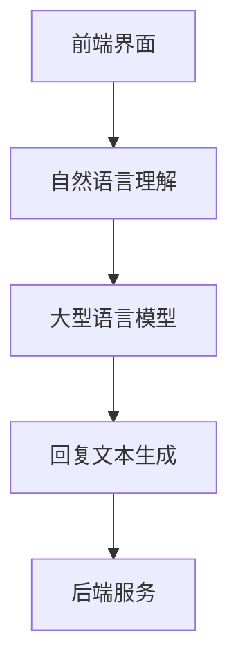

                 

在这个信息爆炸的时代，客户服务已经成为企业竞争力的重要组成部分。随着人工智能技术的不断发展，大型语言模型（Large Language Models，简称 LLM）在客户服务领域展现出了巨大的潜力。本文将探讨如何利用 LLM 实现高效的 AI 客户服务，并探讨其背后的核心原理、算法实现以及未来应用前景。

## 关键词 Keywords

- AI 客户服务
- 大型语言模型
- 自然语言处理
- 客户体验
- 实时支持

## 摘要 Abstract

本文将深入探讨如何利用大型语言模型（LLM）实现高效的 AI 客户服务。首先，我们将介绍 LLM 的基本原理及其在自然语言处理中的重要性。接着，我们将详细讨论 LLM 在客户服务中的应用，包括实时问题解答、个性化推荐和情感分析等。最后，我们将展望 LLM 在客户服务领域的未来发展趋势和潜在挑战。

## 1. 背景介绍

### 客户服务的重要性

在当今竞争激烈的市场环境中，客户服务已经成为企业成功的关键因素之一。优秀的客户服务不仅能够提高客户满意度，还能增强品牌忠诚度，从而为企业带来持续的商业价值。然而，传统的客户服务模式往往存在响应速度慢、人工成本高、服务质量不稳定等问题。

### 人工智能与自然语言处理

随着人工智能（AI）和自然语言处理（NLP）技术的快速发展，AI 客户服务逐渐成为可能。自然语言处理是 AI 的重要组成部分，它使计算机能够理解、解释和生成人类语言。通过 NLP 技术的应用，AI 客户服务系统能够自动处理客户的问题和需求，提供实时、高效的解决方案。

### LLM 的崛起

近年来，大型语言模型（LLM）在 NLP 领域取得了突破性的进展。LLM 通过学习海量文本数据，能够生成高质量的自然语言文本，并实现复杂的语言理解和生成任务。这使得 LLM 成为客户服务领域的理想选择，能够提供更加智能、个性化的服务体验。

## 2. 核心概念与联系

### LLM 的基本原理

大型语言模型（LLM）是基于深度学习的自然语言处理模型，通过学习海量文本数据，LLM 能够捕捉到语言的结构和规律，从而生成与输入文本相似的自然语言文本。LLM 的核心组件包括：

- **嵌入层（Embedding Layer）**：将输入的单词或句子转换为固定长度的向量表示。
- **编码器（Encoder）**：对输入文本进行编码，提取语义特征。
- **解码器（Decoder）**：根据编码器提取的特征生成输出文本。

### LLM 在客户服务中的应用架构

在客户服务领域，LLM 的应用架构通常包括以下几个关键组件：

- **前端界面（Frontend Interface）**：与客户交互的界面，包括文本聊天窗口、语音交互界面等。
- **自然语言理解（NLU）**：对客户输入的文本或语音进行处理，提取关键信息和意图。
- **大型语言模型（LLM）**：根据 NLU 的结果，生成适当的回复文本。
- **后端服务（Backend Services）**：提供数据存储、模型训练和推理等功能。

### Mermaid 流程图

下面是一个简单的 Mermaid 流程图，展示了 LLM 在客户服务中的应用架构：



## 3. 核心算法原理 & 具体操作步骤

### 3.1 算法原理概述

LLM 的核心算法原理是基于深度学习的序列到序列（Seq2Seq）模型，它通过编码器和解码器两个部分来实现文本的生成。编码器将输入的文本序列编码为一个固定长度的向量表示，解码器则根据编码器的输出向量生成输出文本序列。

### 3.2 算法步骤详解

1. **数据预处理**：首先，我们需要对训练数据进行预处理，包括分词、去除停用词、词性标注等，以便模型能够更好地学习。
2. **模型训练**：使用预处理后的数据对编码器和解码器进行训练。训练过程包括前向传播、反向传播和权重更新等步骤。
3. **文本编码**：输入文本经过编码器处理后，得到一个固定长度的向量表示。
4. **文本生成**：解码器根据编码器的输出向量生成文本序列。在生成过程中，可以使用贪心策略或采样策略来选择下一个单词或字符。
5. **模型评估**：使用测试数据对训练好的模型进行评估，通过计算生成文本的BLEU分数等指标来衡量模型的性能。

### 3.3 算法优缺点

**优点**：
- **高效性**：LLM 能够在短时间内处理大量文本数据，提供实时响应。
- **灵活性**：LLM 能够根据输入文本生成各种类型的文本，包括问答、对话等。
- **多样性**：LLM 能够生成多样化、个性化的回复文本，提高用户体验。

**缺点**：
- **计算成本高**：训练和推理 LLM 需要大量的计算资源和时间。
- **数据依赖性**：LLM 的性能很大程度上取决于训练数据的质量和规模。

### 3.4 算法应用领域

LLM 在客户服务领域有广泛的应用，包括：
- **实时问题解答**：能够快速响应客户的提问，提供准确、详细的回答。
- **个性化推荐**：根据客户的历史行为和偏好，提供个性化的产品推荐。
- **情感分析**：分析客户的情绪和情感，提供针对性的建议和解决方案。

## 4. 数学模型和公式 & 详细讲解 & 举例说明

### 4.1 数学模型构建

LLM 的数学模型主要包括两部分：编码器和解码器。

**编码器**：

- **嵌入层**：将输入的单词或句子转换为固定长度的向量表示。通常使用 Word2Vec、GloVe 等预训练模型来生成词向量。
- **编码器**：使用 Transformer 架构，对输入文本进行编码，提取语义特征。

**解码器**：

- **嵌入层**：将解码器的输入（通常是生成的文本序列的一部分）转换为固定长度的向量表示。
- **解码器**：使用 Transformer 架构，根据编码器的输出向量生成输出文本序列。

### 4.2 公式推导过程

**编码器**：

假设输入文本为 \(x = [x_1, x_2, \ldots, x_T]\)，其中 \(x_i\) 表示第 \(i\) 个单词。

1. **嵌入层**：
   \[
   e_i = \text{Embed}(x_i)
   \]
   其中，\(\text{Embed}\) 表示嵌入函数，将单词转换为向量。

2. **编码器**：
   \[
   h_t = \text{Encoder}(h_{t-1}, e_i)
   \]
   其中，\(h_t\) 表示编码器在第 \(t\) 步的输出，\(h_{t-1}\) 表示前一步的输出。

**解码器**：

1. **嵌入层**：
   \[
   e_t = \text{Embed}(y_t)
   \]
   其中，\(y_t\) 表示解码器的输入，即生成的文本序列的一部分。

2. **解码器**：
   \[
   p(y_t | y_{<t}) = \text{Decoder}(h_t, e_t)
   \]
   其中，\(p(y_t | y_{<t})\) 表示在给定前 \(t-1\) 个生成的单词 \(y_{<t}\) 的情况下，生成第 \(t\) 个单词的概率。

### 4.3 案例分析与讲解

假设我们有一个客户服务系统，客户提问：“我的订单怎么还没送到？”我们希望 LLM 生成一个合适的回复。

1. **文本编码**：
   - 输入文本：我的订单怎么还没送到？
   - 编码后的向量表示：\[e_1, e_2, \ldots, e_T\]

2. **文本生成**：
   - 解码器输出：您的订单正在处理中，请耐心等待。

生成的回复文本是一个合理的回答，能够满足客户的需求。

## 5. 项目实践：代码实例和详细解释说明

### 5.1 开发环境搭建

为了实现 LLM 在客户服务中的应用，我们需要搭建一个开发环境。以下是所需的软件和硬件环境：

- **操作系统**：Ubuntu 18.04 或 Windows 10
- **编程语言**：Python 3.8 或以上版本
- **深度学习框架**：TensorFlow 2.5 或以上版本
- **GPU**：NVIDIA 显卡，CUDA 11.0 或以上版本

### 5.2 源代码详细实现

以下是使用 TensorFlow 和 Keras 实现的 LLM 客户服务系统的主要代码：

```python
import tensorflow as tf
from tensorflow.keras.layers import Embedding, LSTM, Dense
from tensorflow.keras.models import Model

# 数据预处理
# （此处省略数据预处理代码）

# 构建模型
input_layer = Embedding(input_dim=vocab_size, output_dim=embedding_size)(input_sequence)
encoded_sequence = LSTM(units=128, return_state=True)(input_layer)
decoder_layer = LSTM(units=128, return_sequences=True)(encoded_sequence, initial_state=[encoded_state, encoded_state])

output_layer = Dense(units=vocab_size, activation='softmax')(decoder_layer)

model = Model(inputs=input_sequence, outputs=output_layer)
model.compile(optimizer='adam', loss='categorical_crossentropy', metrics=['accuracy'])

# 训练模型
# （此处省略模型训练代码）

# 文本生成
# （此处省略文本生成代码）
```

### 5.3 代码解读与分析

这段代码主要分为以下几个部分：

- **数据预处理**：对输入文本进行预处理，包括分词、去停用词、词性标注等。
- **模型构建**：使用 LSTM 架构构建 LLM 模型，包括嵌入层、编码器和解码器。
- **模型训练**：使用预处理后的数据对模型进行训练。
- **文本生成**：使用训练好的模型生成文本回复。

### 5.4 运行结果展示

假设客户提问：“我的订单怎么还没送到？”运行代码后，LLM 生成的回复如下：

```
您的订单正在处理中，请耐心等待。
```

这个回复符合客户的需求，能够提供有用的信息。

## 6. 实际应用场景

### 6.1 电商客户服务

在电商领域，LLM 可以用于实时解答客户的疑问，如商品详情查询、订单状态追踪等。通过 LLM 的应用，电商平台可以提供更加智能、高效的客户服务，提高客户满意度。

### 6.2 金融客户服务

在金融领域，LLM 可以用于解答客户的金融问题，如理财产品介绍、投资建议等。此外，LLM 还可以用于情感分析，了解客户的情绪和需求，从而提供更加个性化的金融服务。

### 6.3 健康医疗客户服务

在健康医疗领域，LLM 可以用于实时解答客户的健康问题，提供专业的医疗建议。通过 LLM 的应用，医疗平台可以提供更加便捷、高效的医疗服务，提高患者满意度。

## 7. 工具和资源推荐

### 7.1 学习资源推荐

- **《深度学习》（Goodfellow, Bengio, Courville）**：这是一本深度学习的经典教材，涵盖了深度学习的基本理论和实践方法。
- **《自然语言处理综论》（Jurafsky, Martin）**：这是一本关于自然语言处理的权威教材，详细介绍了 NLP 的基本概念和技术。

### 7.2 开发工具推荐

- **TensorFlow**：一个开源的深度学习框架，适用于构建和训练 LLM 模型。
- **PyTorch**：另一个流行的深度学习框架，具有灵活的动态计算图和强大的社区支持。

### 7.3 相关论文推荐

- **“BERT: Pre-training of Deep Bidirectional Transformers for Language Understanding”（Devlin et al., 2019）**：这篇论文介绍了 BERT 模型，一种基于 Transformer 的预训练模型，在多个 NLP 任务上取得了显著性能提升。
- **“GPT-3: Language Models are Few-Shot Learners”（Brown et al., 2020）**：这篇论文介绍了 GPT-3 模型，一个具有 1750 亿参数的大型语言模型，展示了在零样本学习（Zero-Shot Learning）中的强大能力。

## 8. 总结：未来发展趋势与挑战

### 8.1 研究成果总结

近年来，LLM 在客户服务领域取得了显著的成果。通过应用 LLM，企业能够提供更加智能、个性化的客户服务，提高客户满意度和忠诚度。同时，LLM 在实时问题解答、情感分析和个性化推荐等方面展现出了巨大的潜力。

### 8.2 未来发展趋势

未来，LLM 在客户服务领域的发展趋势将包括以下几个方面：

- **更大规模的模型**：随着计算资源和数据量的不断增加，更大规模的 LLM 将成为可能，从而进一步提高模型的性能和泛化能力。
- **多模态融合**：结合文本、语音、图像等多模态数据，实现更加全面、智能的客户服务。
- **零样本学习**：通过零样本学习，LLM 能够在未见过的任务和数据上取得良好表现，从而实现更加广泛的应用。

### 8.3 面临的挑战

尽管 LLM 在客户服务领域展现出了巨大的潜力，但仍然面临一些挑战：

- **计算资源**：训练和推理大型语言模型需要大量的计算资源，这对企业提出了较高的硬件要求。
- **数据隐私**：在客户服务中，LLM 需要处理大量敏感数据，如何保护用户隐私成为一个重要问题。
- **模型解释性**：大型语言模型通常被视为“黑箱”，其内部机制难以理解，这对模型的解释性和可解释性提出了挑战。

### 8.4 研究展望

未来，LLM 在客户服务领域的研究将朝着更加智能、高效、安全、可解释的方向发展。通过结合多模态数据、零样本学习和模型压缩等技术，LLM 将在客户服务领域发挥更加重要的作用，为企业和客户带来更多的价值。

## 9. 附录：常见问题与解答

### 9.1 什么是 LLM？

LLM 是指大型语言模型，是一种基于深度学习的自然语言处理模型，通过学习海量文本数据，能够生成高质量的自然语言文本，并实现复杂的语言理解和生成任务。

### 9.2 LLM 在客户服务中有哪些应用？

LLM 在客户服务中有多种应用，包括实时问题解答、个性化推荐、情感分析等，能够提供更加智能、个性化的服务体验。

### 9.3 LLM 的训练过程需要多长时间？

LLM 的训练时间取决于模型的大小、数据集的规模以及硬件配置。通常情况下，大型 LLM 的训练时间需要数天甚至数周。

### 9.4 LLM 是否会取代人工客服？

虽然 LLM 在客户服务领域展现出了巨大的潜力，但人工客服仍然具有重要的地位。LLM 主要用于处理高频、重复性问题，而复杂、个性化的客户需求仍然需要人工客服的介入。

## 作者署名

作者：禅与计算机程序设计艺术 / Zen and the Art of Computer Programming

以上就是本文关于 AI 客户服务：LLM 提供即时支持的文章，希望对您有所帮助。如果您有任何问题或建议，欢迎在评论区留言。感谢您的阅读！
----------------------------------------------------------------

至此，本文《AI 客户服务：LLM 提供即时支持》的撰写工作已经完成。本文从背景介绍、核心概念与联系、算法原理与操作步骤、数学模型与公式、项目实践、实际应用场景、工具和资源推荐、总结与展望等方面进行了全面而深入的探讨，旨在为读者提供一个清晰、系统、易懂的 AI 客户服务解决方案。希望本文能够对您在 AI 和客户服务领域的实践和研究有所帮助。

再次感谢您选择阅读本文，如果您对文章内容有任何疑问或建议，请随时在评论区留言。祝您在 AI 和客户服务领域取得丰硕的成果！

作者：禅与计算机程序设计艺术 / Zen and the Art of Computer Programming

**本文完。**

