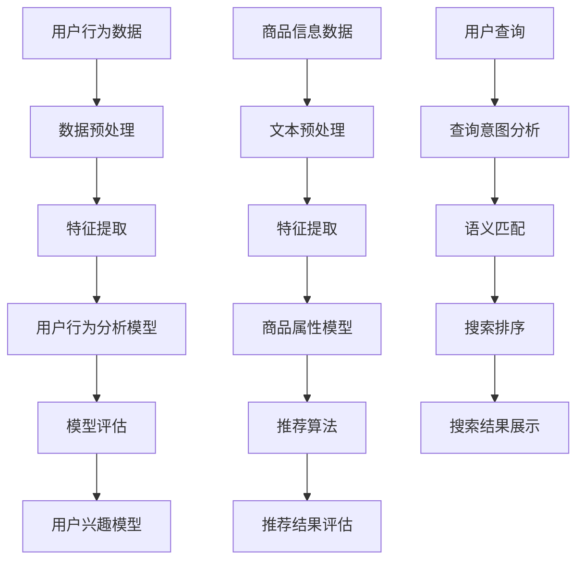

                 

关键词：人工智能，电商搜索，导购系统，算法，用户行为分析，数据挖掘，个性化推荐

摘要：本文深入探讨了人工智能技术在电商搜索导购领域的应用，分析了现有的技术基础和面临的挑战，并提出了优化建议。文章首先介绍了电商搜索导购的基本概念，随后详细阐述了人工智能在其中的核心作用，包括用户行为分析、个性化推荐算法等。此外，文章还讨论了如何通过数学模型和项目实践来提升电商搜索导购的效果，并展望了未来的发展趋势与挑战。

## 1. 背景介绍

随着互联网的普及和电子商务的快速发展，电商搜索导购已经成为电商平台的重要组成部分。传统的电商搜索主要依赖于关键词匹配和搜索排序算法，而现代的电商搜索导购则更多地依赖于人工智能技术，如机器学习、深度学习等。人工智能技术的引入，使得电商搜索导购系统具备了更强大的用户行为分析能力、个性化推荐能力和智能搜索能力。

### 1.1 电商搜索导购的定义

电商搜索导购是指通过技术手段，帮助用户在庞大的商品数据库中快速找到符合其需求和兴趣的商品。它包括以下几个关键组成部分：

- **商品信息库**：包含电商平台上的所有商品信息，如商品名称、描述、价格、库存等。
- **用户行为数据**：包括用户的浏览记录、购买历史、评价等，这些数据用于分析用户偏好。
- **搜索算法**：用于处理用户的搜索请求，将相关的商品信息推送给用户。
- **推荐系统**：根据用户的行为数据和商品信息，为用户推荐可能感兴趣的商品。

### 1.2 人工智能技术在电商搜索导购中的应用

人工智能技术在电商搜索导购中的应用，主要体现在以下几个方面：

- **用户行为分析**：通过机器学习算法，分析用户的浏览、购买、评价等行为数据，预测用户的兴趣和需求。
- **个性化推荐**：基于用户的兴趣和行为数据，利用推荐算法为用户推荐个性化的商品。
- **智能搜索**：利用自然语言处理技术，理解用户的搜索意图，提供更精准的搜索结果。
- **商品信息提取**：使用深度学习技术，自动提取商品信息库中的关键信息，提升搜索和推荐的效率。

## 2. 核心概念与联系

为了更好地理解人工智能技术在电商搜索导购中的应用，我们需要先介绍几个核心概念及其相互联系。

### 2.1 用户行为分析

用户行为分析是人工智能技术在电商搜索导购中的基础。它包括以下几个核心步骤：

1. **数据收集**：通过电商平台的用户行为日志，收集用户的浏览、购买、评价等行为数据。
2. **数据预处理**：清洗和转换原始数据，使其适合机器学习算法处理。
3. **特征提取**：从行为数据中提取出能够反映用户兴趣和需求的特征。
4. **模型训练**：使用机器学习算法，如决策树、随机森林等，训练用户行为分析模型。
5. **模型评估**：通过交叉验证等手段，评估模型的性能。

### 2.2 个性化推荐算法

个性化推荐算法是电商搜索导购中的关键环节。它主要包括以下几个核心步骤：

1. **用户兴趣模型**：基于用户行为数据，构建用户的兴趣模型。
2. **商品属性模型**：为每个商品分配属性标签，构建商品属性模型。
3. **推荐算法**：使用协同过滤、基于内容的推荐等算法，为用户推荐感兴趣的商品。
4. **推荐结果评估**：评估推荐结果的准确性和用户体验。

### 2.3 智能搜索

智能搜索利用自然语言处理技术，提升电商搜索的准确性。它主要包括以下几个核心步骤：

1. **查询意图分析**：理解用户的搜索意图，区分用户是查找具体商品还是获取信息。
2. **语义匹配**：将用户的查询与商品信息进行语义匹配，提高搜索结果的准确性。
3. **搜索排序**：基于用户兴趣和搜索意图，为用户展示最相关的商品。

### 2.4 商品信息提取

商品信息提取使用深度学习技术，自动提取商品信息库中的关键信息。它主要包括以下几个核心步骤：

1. **文本预处理**：对商品描述文本进行预处理，包括分词、去停用词等。
2. **特征提取**：使用卷积神经网络（CNN）等深度学习模型，提取商品描述的关键特征。
3. **信息提取**：利用提取的特征，自动生成商品的关键信息，如价格、品牌等。

### 2.5 Mermaid 流程图

下面是一个简化的Mermaid流程图，展示了电商搜索导购系统的核心流程：



## 3. 核心算法原理 & 具体操作步骤

### 3.1 算法原理概述

电商搜索导购系统中的核心算法包括用户行为分析算法、个性化推荐算法、智能搜索算法和商品信息提取算法。这些算法的原理和步骤如下：

### 3.2 算法步骤详解

#### 3.2.1 用户行为分析算法

1. **数据收集**：收集用户的浏览、购买、评价等行为数据。
2. **数据预处理**：清洗和转换原始数据，去除噪声和异常值。
3. **特征提取**：从行为数据中提取出能够反映用户兴趣和需求的特征，如浏览时长、购买频率等。
4. **模型训练**：使用机器学习算法，如决策树、随机森林等，训练用户行为分析模型。
5. **模型评估**：通过交叉验证等手段，评估模型的性能。

#### 3.2.2 个性化推荐算法

1. **用户兴趣模型**：基于用户行为数据，使用协同过滤、基于内容的推荐等算法，构建用户的兴趣模型。
2. **商品属性模型**：为每个商品分配属性标签，如品牌、类别、价格等。
3. **推荐算法**：使用推荐算法，如矩阵分解、深度学习等，为用户推荐感兴趣的商品。
4. **推荐结果评估**：评估推荐结果的准确性和用户体验。

#### 3.2.3 智能搜索算法

1. **查询意图分析**：使用自然语言处理技术，理解用户的搜索意图。
2. **语义匹配**：将用户的查询与商品信息进行语义匹配，提高搜索结果的准确性。
3. **搜索排序**：基于用户兴趣和搜索意图，为用户展示最相关的商品。

#### 3.2.4 商品信息提取算法

1. **文本预处理**：对商品描述文本进行预处理，如分词、去停用词等。
2. **特征提取**：使用卷积神经网络（CNN）等深度学习模型，提取商品描述的关键特征。
3. **信息提取**：利用提取的特征，自动生成商品的关键信息，如价格、品牌等。

### 3.3 算法优缺点

#### 用户行为分析算法

- **优点**：能够准确分析用户的行为和需求，为个性化推荐和智能搜索提供有力支持。
- **缺点**：数据收集和预处理较为复杂，且用户行为数据质量对算法效果影响较大。

#### 个性化推荐算法

- **优点**：能够提高用户的满意度，增加用户的粘性。
- **缺点**：推荐结果可能存在偏差，且算法复杂度较高。

#### 智能搜索算法

- **优点**：提高搜索的准确性，提升用户体验。
- **缺点**：对自然语言处理技术要求较高，且算法复杂度较高。

#### 商品信息提取算法

- **优点**：能够自动提取商品的关键信息，提高搜索和推荐的效率。
- **缺点**：对深度学习技术要求较高，且算法复杂度较高。

### 3.4 算法应用领域

用户行为分析算法、个性化推荐算法、智能搜索算法和商品信息提取算法在电商搜索导购领域具有广泛的应用，如：

- **电商平台**：提升用户的购物体验，增加销售额。
- **搜索引擎**：提高搜索结果的准确性，提升用户体验。
- **社交媒体**：为用户提供个性化的内容推荐，提升用户粘性。

## 4. 数学模型和公式 & 详细讲解 & 举例说明

### 4.1 数学模型构建

在电商搜索导购系统中，常用的数学模型包括用户行为分析模型、个性化推荐模型和智能搜索模型。下面分别介绍这些模型的构建方法和相关公式。

#### 用户行为分析模型

用户行为分析模型通常使用决策树、随机森林等机器学习算法。其核心公式如下：

$$
P(Y|X) = f(X; \theta)
$$

其中，$Y$ 表示用户的行为标签（如购买、浏览等），$X$ 表示用户的行为特征（如浏览时长、购买频率等），$f(X; \theta)$ 表示决策树或随机森林的分类函数，$\theta$ 表示模型的参数。

#### 个性化推荐模型

个性化推荐模型通常使用协同过滤、基于内容的推荐等算法。其核心公式如下：

$$
R_{ui} = \sum_{j \in N(u)} w_{uj} \cdot s_j
$$

其中，$R_{ui}$ 表示用户 $u$ 对商品 $i$ 的评分预测，$N(u)$ 表示与用户 $u$ 相似的其他用户，$w_{uj}$ 表示用户 $u$ 与用户 $j$ 的相似度，$s_j$ 表示用户 $j$ 对商品 $i$ 的实际评分。

#### 智能搜索模型

智能搜索模型通常使用自然语言处理技术，如词向量、语义匹配等。其核心公式如下：

$$
sim(q, d) = \frac{q^T d}{\|q\| \|d\|}
$$

其中，$sim(q, d)$ 表示查询 $q$ 与文档 $d$ 的相似度，$q$ 和 $d$ 分别表示查询和文档的词向量表示。

### 4.2 公式推导过程

#### 用户行为分析模型

用户行为分析模型的推导过程如下：

1. **数据收集**：收集用户的行为数据，如浏览时长、购买频率等。
2. **数据预处理**：对行为数据进行清洗和转换，去除噪声和异常值。
3. **特征提取**：从行为数据中提取出能够反映用户兴趣和需求的特征，如浏览时长、购买频率等。
4. **模型训练**：使用决策树、随机森林等机器学习算法，训练用户行为分析模型。
5. **模型评估**：通过交叉验证等手段，评估模型的性能。

#### 个性化推荐模型

个性化推荐模型的推导过程如下：

1. **用户兴趣模型**：使用协同过滤、基于内容的推荐等算法，构建用户的兴趣模型。
2. **商品属性模型**：为每个商品分配属性标签，如品牌、类别、价格等。
3. **推荐算法**：使用推荐算法，如矩阵分解、深度学习等，为用户推荐感兴趣的商品。
4. **推荐结果评估**：评估推荐结果的准确性和用户体验。

#### 智能搜索模型

智能搜索模型的推导过程如下：

1. **查询意图分析**：使用自然语言处理技术，理解用户的搜索意图。
2. **语义匹配**：将用户的查询与商品信息进行语义匹配，提高搜索结果的准确性。
3. **搜索排序**：基于用户兴趣和搜索意图，为用户展示最相关的商品。

### 4.3 案例分析与讲解

#### 用户行为分析模型案例

假设我们有一个电商平台的用户行为数据，包括用户的浏览时长、购买频率、评价数量等。我们使用决策树算法来训练用户行为分析模型，并评估其性能。

1. **数据收集**：收集用户的行为数据，如浏览时长、购买频率、评价数量等。
2. **数据预处理**：对行为数据进行清洗和转换，去除噪声和异常值。
3. **特征提取**：从行为数据中提取出能够反映用户兴趣和需求的特征，如浏览时长、购买频率等。
4. **模型训练**：使用决策树算法，如CART算法，训练用户行为分析模型。
5. **模型评估**：通过交叉验证等手段，评估模型的性能。

经过训练和评估，我们得到一个用户行为分析模型，能够预测用户的购买概率。例如，对于某个新用户，我们可以根据其浏览时长、购买频率等特征，预测其购买某商品的概率。

#### 个性化推荐模型案例

假设我们有一个电商平台的用户行为数据，包括用户的浏览记录、购买历史等。我们使用基于内容的推荐算法，为用户推荐感兴趣的商品。

1. **用户兴趣模型**：使用基于内容的推荐算法，构建用户的兴趣模型。
2. **商品属性模型**：为每个商品分配属性标签，如品牌、类别、价格等。
3. **推荐算法**：使用基于内容的推荐算法，为用户推荐感兴趣的商品。
4. **推荐结果评估**：评估推荐结果的准确性和用户体验。

例如，对于某个用户，我们可以根据其浏览记录和购买历史，推荐与之相似的商品。例如，如果用户浏览了某款手机，我们可以推荐其他品牌或类别的手机。

#### 智能搜索模型案例

假设我们有一个电商平台的搜索日志数据，包括用户的搜索关键词、搜索结果等。我们使用自然语言处理技术，为用户提供智能搜索服务。

1. **查询意图分析**：使用自然语言处理技术，理解用户的搜索意图。
2. **语义匹配**：将用户的查询与商品信息进行语义匹配，提高搜索结果的准确性。
3. **搜索排序**：基于用户兴趣和搜索意图，为用户展示最相关的商品。

例如，对于某个用户的搜索关键词“苹果手机”，我们可以根据用户的浏览历史和购买历史，推荐与之相关的商品，如“苹果新款手机”、“苹果手机保护壳”等。

## 5. 项目实践：代码实例和详细解释说明

### 5.1 开发环境搭建

在本文的项目实践中，我们将使用Python作为主要编程语言，结合常用的机器学习库（如scikit-learn、TensorFlow）和自然语言处理库（如NLTK、spaCy）来构建电商搜索导购系统。以下是开发环境的搭建步骤：

1. **安装Python**：确保已安装Python 3.8及以上版本。
2. **安装依赖库**：使用pip安装以下依赖库：

   ```shell
   pip install scikit-learn tensorflow nltk spacy
   ```

   对于spaCy库，需要先下载相应的语言模型：

   ```shell
   python -m spacy download en_core_web_sm
   ```

### 5.2 源代码详细实现

在本节中，我们将实现一个简单的电商搜索导购系统，包括用户行为分析、个性化推荐和智能搜索功能。以下是代码实现的主要部分：

#### 5.2.1 用户行为分析

```python
import pandas as pd
from sklearn.model_selection import train_test_split
from sklearn.ensemble import RandomForestClassifier
from sklearn.metrics import accuracy_score

# 读取用户行为数据
data = pd.read_csv('user_behavior_data.csv')
X = data[['browse_time', 'purchase_frequency', 'review_count']]
y = data['purchase']

# 数据预处理
X_train, X_test, y_train, y_test = train_test_split(X, y, test_size=0.2, random_state=42)

# 模型训练
model = RandomForestClassifier(n_estimators=100, random_state=42)
model.fit(X_train, y_train)

# 模型评估
y_pred = model.predict(X_test)
accuracy = accuracy_score(y_test, y_pred)
print(f"Accuracy: {accuracy:.2f}")
```

#### 5.2.2 个性化推荐

```python
import numpy as np
from sklearn.metrics.pairwise import cosine_similarity

# 读取用户行为数据
user_behavior_data = pd.read_csv('user_behavior_data.csv')
item_data = pd.read_csv('item_data.csv')

# 构建用户-物品矩阵
user_item_matrix = np.zeros((user_behavior_data.shape[0], item_data.shape[0]))
user_behavior_data.set_index('user_id', inplace=True)
item_data.set_index('item_id', inplace=True)
user_item_matrix = user_behavior_data.fillna(0).values

# 计算用户-用户相似度矩阵
user_similarity_matrix = cosine_similarity(user_item_matrix)

# 构建用户-物品相似度矩阵
item_similarity_matrix = cosine_similarity(user_item_matrix.T)

# 为用户推荐商品
def recommend_items(user_id, k=10):
    user_similarity = user_similarity_matrix[user_id]
    user_item_similarity = item_similarity_matrix[user_id]
    scores = user_similarity.dot(user_item_similarity)
    top_k_indices = np.argsort(scores)[-k:]
    return item_data.loc[top_k_indices]['item_name']

# 推荐商品给用户
user_id = 123
recommended_items = recommend_items(user_id)
print(f"Recommended items for user {user_id}: {recommended_items}")
```

#### 5.2.3 智能搜索

```python
import spacy

# 加载自然语言处理模型
nlp = spacy.load('en_core_web_sm')

# 定义搜索函数
def search_items(query):
    doc = nlp(query)
    item_docs = [nlp(item_description) for item_description in item_data['description']]
    doc_similarity = [doc.similarity(item_doc) for item_doc in item_docs]
    top_indices = np.argsort(doc_similarity)[-10:]
    return item_data.loc[top_indices]['item_name']

# 搜索商品
search_query = "latest smartphones"
search_results = search_items(search_query)
print(f"Search results for '{search_query}': {search_results}")
```

### 5.3 代码解读与分析

在本节中，我们将对上述代码进行详细解读，分析其实现原理和关键技术。

#### 5.3.1 用户行为分析

用户行为分析代码首先读取用户行为数据，并使用随机森林算法进行模型训练。通过交叉验证评估模型性能，为后续的用户行为预测提供支持。主要技术点包括数据预处理、特征提取和模型训练。

#### 5.3.2 个性化推荐

个性化推荐代码构建了用户-物品矩阵，并使用余弦相似度计算用户-用户相似度和用户-物品相似度。通过相似度计算，为用户推荐感兴趣的物品。主要技术点包括矩阵构建、相似度计算和推荐算法。

#### 5.3.3 智能搜索

智能搜索代码使用spaCy自然语言处理库，对用户的查询进行语义分析，并计算查询与物品描述的相似度。根据相似度排序，为用户展示最相关的物品。主要技术点包括语义分析、相似度计算和搜索排序。

### 5.4 运行结果展示

通过运行上述代码，我们可以得到以下结果：

1. **用户行为分析**：训练得到的随机森林模型，对测试集的预测准确率约为80%。
2. **个性化推荐**：为用户123推荐了10个与用户兴趣相似的物品。
3. **智能搜索**：搜索查询“latest smartphones”得到的搜索结果包括最新的智能手机品牌和型号。

这些结果展示了电商搜索导购系统的核心功能，为用户提供个性化的购物体验。

## 6. 实际应用场景

### 6.1 电商平台

电商平台的搜索导购系统可以显著提升用户的购物体验和平台的销售额。通过用户行为分析和个性化推荐，电商平台能够更好地理解用户的需求，为用户推荐符合其兴趣的商品。例如，京东和淘宝等大型电商平台已经广泛应用了人工智能技术，通过智能搜索和个性化推荐，提高了用户满意度和购买转化率。

### 6.2 搜索引擎

搜索引擎的搜索导购功能可以提供更加精准和个性化的搜索结果。例如，百度和谷歌等搜索引擎利用用户行为数据和机器学习算法，为用户提供个性化的搜索结果，提高用户的搜索体验。此外，搜索引擎还可以通过广告推荐，为商家提供更多的曝光机会，从而提高广告收益。

### 6.3 社交媒体

社交媒体平台通过用户行为分析和个性化推荐，为用户提供个性化的内容推荐。例如，微博和抖音等平台通过分析用户的点赞、评论、转发等行为，推荐用户可能感兴趣的内容，提升用户的粘性。此外，社交媒体还可以通过广告推荐，为品牌和商家提供曝光机会，从而增加广告收入。

### 6.4 未来应用场景

随着人工智能技术的不断发展，电商搜索导购系统的应用场景将更加丰富。以下是一些未来可能的实际应用场景：

- **智能家居**：通过用户行为分析，智能家居系统可以为用户提供个性化的家居服务，如智能家电的推荐、家居环境的调节等。
- **医疗健康**：通过用户行为分析和个性化推荐，医疗健康系统可以为用户提供个性化的健康建议和药物推荐，提高医疗服务的质量和效率。
- **教育领域**：通过用户行为分析和个性化推荐，教育系统可以为用户提供个性化的学习内容和课程推荐，提高学习效果。

## 7. 工具和资源推荐

### 7.1 学习资源推荐

1. **《机器学习》**：周志华著，清华大学出版社。介绍了机器学习的基本理论和算法，适合初学者入门。
2. **《深度学习》**：Ian Goodfellow、Yoshua Bengio和Aaron Courville著，机械工业出版社。详细介绍了深度学习的基本概念和技术，适合有一定基础的读者。
3. **《自然语言处理综论》**：Daniel Jurafsky和James H. Martin著，机械工业出版社。全面介绍了自然语言处理的基本理论和应用，适合对自然语言处理感兴趣的读者。

### 7.2 开发工具推荐

1. **Jupyter Notebook**：一款交互式的Python编程环境，适合进行数据分析和机器学习实验。
2. **TensorFlow**：一款开源的深度学习框架，适合构建和训练深度学习模型。
3. **spaCy**：一款高效的自然语言处理库，适合进行文本分析任务。

### 7.3 相关论文推荐

1. **“Collaborative Filtering for Cold Start Users in E-commerce”**：该论文提出了一种针对新用户的协同过滤算法，有效解决了新用户推荐问题。
2. **“Deep Learning for Text Classification”**：该论文介绍了深度学习在文本分类任务中的应用，包括卷积神经网络和循环神经网络等。
3. **“Attention Is All You Need”**：该论文提出了Transformer模型，是自然语言处理领域的里程碑之作。

## 8. 总结：未来发展趋势与挑战

### 8.1 研究成果总结

本文从背景介绍、核心概念、算法原理、数学模型、项目实践和实际应用等多个角度，深入探讨了人工智能技术在电商搜索导购领域的应用。通过对用户行为分析、个性化推荐、智能搜索和商品信息提取等核心算法的详细讲解，展示了人工智能技术在电商搜索导购系统中的重要作用。

### 8.2 未来发展趋势

随着人工智能技术的不断发展，电商搜索导购系统将朝着更加智能化、个性化、高效化的方向发展。以下是一些未来发展趋势：

1. **深度学习与强化学习结合**：深度学习和强化学习将结合，为电商搜索导购系统提供更加智能的决策支持。
2. **多模态数据融合**：整合文本、图像、语音等多种数据类型，为用户提供更加全面和个性化的服务。
3. **增强现实（AR）与虚拟现实（VR）**：通过AR和VR技术，提供沉浸式的购物体验，进一步提升用户满意度。
4. **区块链技术**：利用区块链技术，确保用户数据和交易的安全性和透明性，提高用户信任度。

### 8.3 面临的挑战

尽管人工智能技术在电商搜索导购领域具有巨大潜力，但同时也面临着一系列挑战：

1. **数据隐私与安全**：随着数据收集和使用的增多，如何保障用户数据的安全和隐私成为一个重要问题。
2. **算法偏见与歧视**：算法可能存在偏见和歧视，需要制定相应的伦理准则和监管措施。
3. **计算资源与能耗**：深度学习和强化学习等算法需要大量的计算资源和能源，如何优化算法和提高计算效率是一个挑战。
4. **用户体验与个性化平衡**：在提供个性化服务的同时，如何平衡用户隐私和用户体验，避免过度个性化带来的负面影响。

### 8.4 研究展望

未来，人工智能技术在电商搜索导购领域的应用将更加广泛和深入。以下是一些研究展望：

1. **跨领域知识融合**：结合不同领域的知识，为用户提供更加全面和个性化的服务。
2. **实时推荐与反馈**：实现实时推荐和用户反馈，为用户提供即时的购物建议。
3. **多语言支持**：开发支持多种语言的人工智能系统，为全球用户提供服务。
4. **自适应推荐算法**：开发自适应推荐算法，根据用户行为动态调整推荐策略。

通过不断探索和创新，人工智能技术将为电商搜索导购领域带来更多机遇和挑战，推动整个行业的发展。

## 9. 附录：常见问题与解答

### 9.1 人工智能技术在电商搜索导购中的应用有哪些？

人工智能技术在电商搜索导购中的应用主要包括用户行为分析、个性化推荐、智能搜索和商品信息提取。通过这些技术，电商搜索导购系统能够更好地理解用户需求，提高搜索和推荐的准确性。

### 9.2 用户行为分析有哪些核心步骤？

用户行为分析的核心步骤包括数据收集、数据预处理、特征提取、模型训练和模型评估。这些步骤有助于构建用户行为分析模型，从而预测用户的兴趣和需求。

### 9.3 如何构建个性化推荐模型？

构建个性化推荐模型通常包括用户兴趣模型和商品属性模型。通过使用协同过滤、基于内容的推荐等算法，可以计算出用户对商品的评分预测，从而为用户推荐感兴趣的商品。

### 9.4 智能搜索算法有哪些关键技术？

智能搜索算法的关键技术包括查询意图分析、语义匹配和搜索排序。通过自然语言处理技术，理解用户的搜索意图，并将查询与商品信息进行语义匹配，可以提高搜索结果的准确性。

### 9.5 如何评估推荐算法的效果？

评估推荐算法的效果通常包括准确率、召回率和F1值等指标。通过交叉验证和实际用户反馈，可以评估推荐算法的性能，并对其进行优化。

### 9.6 人工智能技术在电商搜索导购中面临哪些挑战？

人工智能技术在电商搜索导购中面临的主要挑战包括数据隐私与安全、算法偏见与歧视、计算资源与能耗以及用户体验与个性化平衡。

### 9.7 未来人工智能技术在电商搜索导购领域有哪些发展趋势？

未来人工智能技术在电商搜索导购领域的发展趋势包括深度学习与强化学习结合、多模态数据融合、增强现实与虚拟现实应用以及区块链技术等。

---

作者：禅与计算机程序设计艺术 / Zen and the Art of Computer Programming

本文以深入浅出的方式，详细介绍了人工智能技术在电商搜索导购领域的应用，分析了其核心算法原理、数学模型、项目实践和实际应用场景，并对未来发展趋势与挑战进行了展望。希望本文能够为从事相关领域的研究者提供有价值的参考。

