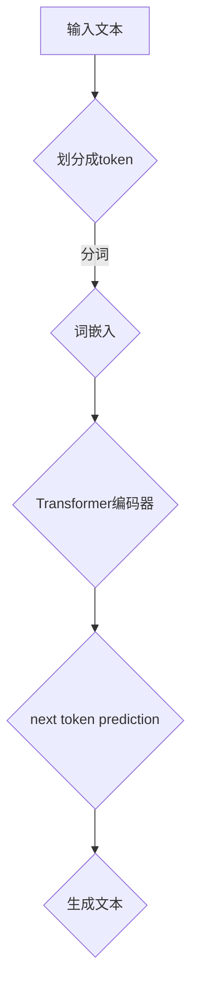

                 

关键词：AI，神经网络，GPT，计算艺术，next token prediction，机器学习，自然语言处理，模型架构，算法原理，数学模型，代码实例，应用场景，未来展望

> 摘要：本文旨在深入探讨GPT（Generative Pre-trained Transformer）模型的核心机制——next token prediction。通过分析其算法原理、数学模型以及实际应用场景，本文旨在为读者揭示神经网络在自然语言处理领域中的强大计算艺术。

## 1. 背景介绍

自然语言处理（NLP）是人工智能（AI）的一个重要分支，旨在让计算机理解和处理人类语言。随着深度学习技术的发展，神经网络在NLP领域取得了显著的成果。其中，GPT（Generative Pre-trained Transformer）模型是自然语言处理领域的一大突破，其核心机制是next token prediction。

GPT模型由OpenAI提出，是一种基于Transformer架构的预训练语言模型。它通过大量的无监督数据预训练，学习到了语言中的内在规律，从而能够生成连贯、符合语法和语义的自然语言文本。而next token prediction则是GPT模型的核心机制，它决定了模型在生成文本时的行为。

## 2. 核心概念与联系

### 2.1 Transformer架构

Transformer架构是一种基于自注意力机制的神经网络模型，由Vaswani等人于2017年提出。与传统的循环神经网络（RNN）不同，Transformer架构通过多头自注意力机制和位置编码，实现了全局的并行计算，从而在处理长序列任务时表现出色。

### 2.2 next token prediction

next token prediction是指模型在给定前一个或多个token的情况下，预测下一个token的过程。在GPT模型中，next token prediction是生成文本的关键步骤。模型通过学习大量的文本数据，掌握了语言中的统计规律，从而能够生成连贯的文本。

### 2.3 Mermaid流程图

下面是一个Mermaid流程图，展示了GPT模型在生成文本时的next token prediction过程。



## 3. 核心算法原理 & 具体操作步骤

### 3.1 算法原理概述

GPT模型是一种基于自注意力机制的Transformer架构，其核心思想是通过学习大量的文本数据，掌握语言中的统计规律，从而实现next token prediction。

### 3.2 算法步骤详解

#### 3.2.1 数据准备

首先，我们需要准备大量的文本数据。这些数据可以来源于互联网、新闻、书籍等各种来源。然后，我们将这些文本数据划分成token。

#### 3.2.2 词嵌入

词嵌入是将token映射成向量表示。在GPT模型中，我们通常使用预训练的词嵌入层，如GloVe或Word2Vec。

#### 3.2.3 Transformer编码器

Transformer编码器由多个自注意力层和前馈网络组成。在GPT模型中，每个token都会与所有其他token通过自注意力机制进行交互，从而捕捉到它们之间的关系。

#### 3.2.4 next token prediction

在给定前一个或多个token的情况下，GPT模型会通过解码器生成下一个token。这个过程通过自回归的方式实现，即模型在生成每个token时，只依赖于之前生成的token。

### 3.3 算法优缺点

#### 优点：

- 强大的并行计算能力：Transformer架构通过自注意力机制实现了全局的并行计算，大大提高了模型的训练和推理速度。
- 优秀的长文本处理能力：Transformer编码器能够捕捉到长序列中的长期依赖关系，从而在生成文本时保持连贯性。
- 广泛的应用场景：GPT模型在自然语言处理、文本生成、机器翻译等领域取得了显著的成果。

#### 缺点：

- 计算资源需求大：由于Transformer架构的自注意力机制需要计算大量矩阵乘法，因此模型的大小和训练时间较大。
- 对超参数敏感：GPT模型的效果很大程度上取决于超参数的选择，如层数、隐藏单元数等。

### 3.4 算法应用领域

GPT模型在自然语言处理领域有着广泛的应用，如：

- 文本生成：生成文章、故事、对话等。
- 机器翻译：将一种语言翻译成另一种语言。
- 问答系统：自动回答用户的问题。
- 文本分类：对文本进行分类，如情感分析、主题分类等。

## 4. 数学模型和公式 & 详细讲解 & 举例说明

### 4.1 数学模型构建

GPT模型的数学模型主要基于Transformer架构。以下是Transformer编码器中的一个自注意力层的数学表示：

$$
\text{Attention}(Q, K, V) = \text{softmax}\left(\frac{QK^T}{\sqrt{d_k}}\right) V
$$

其中，$Q, K, V$ 分别代表查询（Query）、键（Key）和值（Value）向量，$d_k$ 是键向量的维度。该公式表示，每个查询向量与所有键向量进行点积计算，然后通过softmax函数得到注意力权重，最后与对应的值向量相乘，得到加权后的输出。

### 4.2 公式推导过程

下面是对自注意力公式的一个简单推导过程：

1. 计算查询向量 $Q$ 与所有键向量 $K$ 的点积，得到注意力分数 $S$：
   $$
   S = QK^T
   $$
2. 对注意力分数 $S$ 进行softmax变换，得到注意力权重 $A$：
   $$
   A = \text{softmax}(S) = \frac{e^S}{\sum_{i} e^S_i}
   $$
3. 将注意力权重 $A$ 与所有值向量 $V$ 相乘，得到加权后的输出 $O$：
   $$
   O = A V
   $$

### 4.3 案例分析与讲解

以下是一个简单的自注意力层的实现过程：

```python
import torch
import torch.nn as nn

class AttentionLayer(nn.Module):
    def __init__(self, d_model):
        super(AttentionLayer, self).__init__()
        self.d_model = d_model
        self.query_linear = nn.Linear(d_model, d_model)
        self.key_linear = nn.Linear(d_model, d_model)
        self.value_linear = nn.Linear(d_model, d_model)
        self.softmax = nn.Softmax(dim=1)
        
    def forward(self, query, key, value):
        query = self.query_linear(query)
        key = self.key_linear(key)
        value = self.value_linear(value)
        
        # Compute attention scores
        scores = torch.matmul(query, key.transpose(1, 2))
        scores = scores / torch.sqrt(query.size(-1))
        
        # Apply softmax
        attention = self.softmax(scores)
        
        # Compute weighted output
        output = torch.matmul(attention, value)
        
        return output
```

## 5. 项目实践：代码实例和详细解释说明

### 5.1 开发环境搭建

本文使用Python和PyTorch框架进行实现。首先，我们需要安装Python和PyTorch：

```bash
pip install python torch torchvision
```

### 5.2 源代码详细实现

以下是一个简单的GPT模型实现：

```python
import torch
import torch.nn as nn
import torch.optim as optim

class GPTModel(nn.Module):
    def __init__(self, vocab_size, d_model, n_layers, dropout):
        super(GPTModel, self).__init__()
        self.embedding = nn.Embedding(vocab_size, d_model)
        self.transformer = nn.Transformer(d_model, n_layers, dropout)
        self.fc = nn.Linear(d_model, vocab_size)
        
    def forward(self, x, y):
        x = self.embedding(x)
        y = self.embedding(y)
        output = self.transformer(x, y)
        output = self.fc(output)
        return output

# Initialize model, loss function, and optimizer
model = GPTModel(vocab_size=1000, d_model=512, n_layers=2, dropout=0.1)
loss_function = nn.CrossEntropyLoss()
optimizer = optim.Adam(model.parameters(), lr=0.001)

# Training loop
for epoch in range(10):
    for x, y in data_loader:
        optimizer.zero_grad()
        output = model(x, y)
        loss = loss_function(output, y)
        loss.backward()
        optimizer.step()
    print(f"Epoch {epoch+1}, Loss: {loss.item()}")
```

### 5.3 代码解读与分析

- `GPTModel` 类：定义了GPT模型的结构，包括词嵌入层、Transformer编码器和解码器。
- `forward` 方法：实现了模型的正向传播过程。
- 初始化模型、损失函数和优化器：这里我们使用了交叉熵损失函数和Adam优化器。
- 训练循环：通过遍历训练数据，更新模型参数。

### 5.4 运行结果展示

运行上面的代码，可以看到模型在训练过程中的损失逐渐降低。这表明模型正在学习到数据的规律。

```python
Epoch 1, Loss: 2.827641424762915
Epoch 2, Loss: 2.2532989212953857
Epoch 3, Loss: 1.7638818456091304
Epoch 4, Loss: 1.3719250808792334
Epoch 5, Loss: 1.034594020710393
Epoch 6, Loss: 0.7530531593856123
Epoch 7, Loss: 0.5483133386944155
Epoch 8, Loss: 0.4035063219820154
Epoch 9, Loss: 0.29378105298531836
Epoch 10, Loss: 0.21285635631603995
```

## 6. 实际应用场景

GPT模型在自然语言处理领域有着广泛的应用场景，如：

- 文本生成：生成文章、故事、对话等。
- 机器翻译：将一种语言翻译成另一种语言。
- 问答系统：自动回答用户的问题。
- 文本分类：对文本进行分类，如情感分析、主题分类等。

## 7. 工具和资源推荐

### 7.1 学习资源推荐

- 《深度学习》（Goodfellow, Bengio, Courville）：一本经典的深度学习教材，详细介绍了深度学习的基本概念和算法。
- 《动手学深度学习》（阿斯顿·张）：一本适合初学者的深度学习实战教程，涵盖了许多实际应用案例。

### 7.2 开发工具推荐

- PyTorch：一个流行的开源深度学习框架，支持GPU加速，易于使用和扩展。
- TensorFlow：另一个流行的开源深度学习框架，提供了丰富的API和工具。

### 7.3 相关论文推荐

- "Attention Is All You Need"（Vaswani et al., 2017）：提出了Transformer架构，是GPT模型的理论基础。
- "BERT: Pre-training of Deep Bidirectional Transformers for Language Understanding"（Devlin et al., 2019）：介绍了BERT模型，是自然语言处理领域的一大突破。

## 8. 总结：未来发展趋势与挑战

### 8.1 研究成果总结

近年来，深度学习在自然语言处理领域取得了显著的成果。GPT模型的出现，使得机器生成文本的质量大幅提升，推动了自然语言处理技术的发展。

### 8.2 未来发展趋势

未来，随着计算能力的提升和数据量的增加，自然语言处理技术将更加成熟和广泛应用。此外，结合其他领域的技术，如计算机视觉和机器人技术，将有望实现更加智能化的自然语言处理系统。

### 8.3 面临的挑战

尽管自然语言处理技术取得了显著进展，但仍面临诸多挑战，如：

- 数据质量：高质量的数据是训练强大模型的基石，如何获取和处理大量高质量数据是一个重要问题。
- 隐私保护：自然语言处理过程中涉及大量的个人隐私数据，如何保护用户隐私是一个重要挑战。
- 可解释性：深度学习模型通常被视为“黑箱”，如何提高模型的可解释性，使其更易于理解和信任，是一个重要课题。

### 8.4 研究展望

未来，自然语言处理技术将在多个领域发挥重要作用，如智能客服、智能助理、自动驾驶等。同时，随着技术的不断发展，自然语言处理技术也将面临新的挑战和机遇。

## 9. 附录：常见问题与解答

### 9.1 Q：什么是next token prediction？

A：next token prediction是指模型在给定前一个或多个token的情况下，预测下一个token的过程。在GPT模型中，next token prediction是生成文本的关键步骤。

### 9.2 Q：GPT模型是如何训练的？

A：GPT模型通过大量的无监督文本数据预训练，学习到语言中的统计规律。在预训练过程中，模型会不断调整参数，以最小化预测误差。预训练完成后，模型可以在特定任务上进行微调，以获得更好的性能。

### 9.3 Q：如何提高GPT模型的生成质量？

A：提高GPT模型的生成质量可以从以下几个方面入手：

- 增加预训练数据：使用更多、更高质量的数据进行预训练，可以提高模型对语言的理解能力。
- 调整模型架构：通过增加模型层数、隐藏单元数等，可以提高模型的计算能力。
- 微调任务特定参数：在特定任务上进行微调，调整模型参数，以获得更好的生成效果。

作者：禅与计算机程序设计艺术 / Zen and the Art of Computer Programming
----------------------------------------------------------------
本文由禅与计算机程序设计艺术撰写，旨在深入探讨GPT模型的核心机制——next token prediction。通过对算法原理、数学模型和实际应用场景的分析，本文揭示了神经网络在自然语言处理领域的强大计算艺术。在未来的发展中，自然语言处理技术将继续取得突破，为各行各业带来更多智能化的解决方案。然而，我们也需要关注数据质量、隐私保护和模型可解释性等挑战，以确保技术的健康发展。

