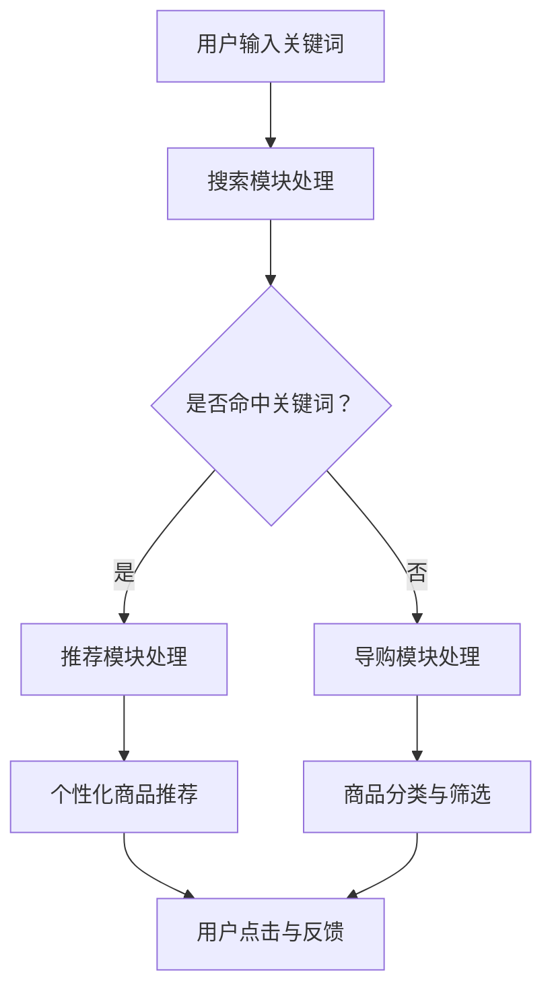

                 

关键词：人工智能、电商搜索、导购系统、技术应用、未来展望

> 摘要：本文将深入探讨人工智能在电商搜索导购领域的应用，分析核心概念与架构，介绍关键算法原理及操作步骤，构建数学模型，并通过实际项目案例进行代码实现与解析，最后对未来的发展趋势与挑战进行展望。

## 1. 背景介绍

随着互联网技术的快速发展，电子商务已成为现代商业的重要组成部分。电商平台的繁荣带动了搜索导购系统的发展，用户对个性化搜索与精准导购的需求日益增长。传统的搜索导购系统已无法满足用户对高效、个性化的需求，因此，人工智能技术在电商搜索导购领域的应用显得尤为重要。

人工智能（AI）通过数据挖掘、自然语言处理、推荐系统等技术，为电商搜索导购提供了强有力的支持。从用户行为分析、商品推荐到智能客服，AI 技术正逐步改变着电商行业的面貌。本文将重点探讨人工智能在电商搜索导购领域的应用，分析核心概念与架构，介绍关键算法原理及操作步骤，构建数学模型，并通过实际项目案例进行代码实现与解析，最后对未来的发展趋势与挑战进行展望。

## 2. 核心概念与联系

### 2.1. 电商搜索导购系统概述

电商搜索导购系统是电子商务平台的重要组成部分，旨在帮助用户快速、准确地找到所需的商品。该系统通常包含以下核心模块：

1. **搜索模块**：负责处理用户输入的关键词，提供相关的商品列表。
2. **推荐模块**：根据用户的兴趣、行为和购物历史，为用户推荐相关的商品。
3. **导购模块**：为用户提供商品分类、筛选和排序等功能，帮助用户快速找到心仪的商品。
4. **用户行为分析模块**：收集并分析用户在平台上的行为数据，用于优化搜索导购效果。

### 2.2. 人工智能在电商搜索导购中的应用

人工智能在电商搜索导购中的应用主要涉及以下方面：

1. **自然语言处理（NLP）**：通过NLP技术，实现对用户输入关键词的理解和提取，提高搜索准确率。
2. **机器学习与深度学习**：利用机器学习与深度学习算法，对用户行为数据进行分析，优化推荐策略。
3. **推荐系统**：通过协同过滤、基于内容的推荐等技术，为用户提供个性化的商品推荐。
4. **用户画像**：通过收集和分析用户行为数据，构建用户画像，用于精准营销和个性化推荐。

### 2.3. Mermaid 流程图



## 3. 核心算法原理 & 具体操作步骤

### 3.1. 算法原理概述

电商搜索导购系统中的核心算法主要包括：自然语言处理算法、推荐算法、用户画像构建算法等。

1. **自然语言处理算法**：基于词向量模型、语法分析等，实现对用户输入关键词的理解和提取。
2. **推荐算法**：采用协同过滤、基于内容的推荐等技术，为用户提供个性化的商品推荐。
3. **用户画像构建算法**：通过用户行为数据，提取用户特征，构建用户画像，用于精准营销和个性化推荐。

### 3.2. 算法步骤详解

1. **自然语言处理算法**
    - 步骤1：分词与词性标注，将用户输入的关键词进行分词，并标注词性。
    - 步骤2：词向量表示，将分词后的关键词转化为词向量。
    - 步骤3：关键词匹配，根据词向量计算关键词之间的相似度，提取关键信息。

2. **推荐算法**
    - 步骤1：用户行为数据收集，收集用户在平台上的浏览、购买、收藏等行为数据。
    - 步骤2：用户特征提取，对用户行为数据进行预处理，提取用户特征。
    - 步骤3：推荐策略选择，根据用户特征，选择合适的推荐策略，如协同过滤、基于内容的推荐等。
    - 步骤4：生成推荐列表，根据推荐策略，生成个性化的商品推荐列表。

3. **用户画像构建算法**
    - 步骤1：用户行为数据收集，收集用户在平台上的浏览、购买、收藏等行为数据。
    - 步骤2：用户特征提取，对用户行为数据进行预处理，提取用户特征。
    - 步骤3：用户画像构建，根据用户特征，构建用户画像，用于精准营销和个性化推荐。

### 3.3. 算法优缺点

1. **自然语言处理算法**
    - 优点：能够理解用户输入的关键词，提高搜索准确率。
    - 缺点：对长尾关键词的处理效果较差，且算法复杂度较高。

2. **推荐算法**
    - 优点：能够为用户提供个性化的商品推荐，提高用户满意度。
    - 缺点：推荐结果的多样性较差，可能陷入“推荐泡沫”问题。

3. **用户画像构建算法**
    - 优点：能够为精准营销和个性化推荐提供有力支持。
    - 缺点：用户隐私保护问题较为突出，需要严格遵循相关法律法规。

### 3.4. 算法应用领域

人工智能在电商搜索导购领域的应用非常广泛，主要包括：

1. **电商平台**：通过个性化推荐，提高用户购物体验，提高销售额。
2. **物流行业**：基于用户画像，优化物流配送路线，提高配送效率。
3. **金融行业**：通过用户行为分析，进行风险控制和精准营销。

## 4. 数学模型和公式 & 详细讲解 & 举例说明

### 4.1. 数学模型构建

在电商搜索导购领域，常用的数学模型包括：协同过滤模型、基于内容的推荐模型、用户画像构建模型等。

1. **协同过滤模型**
    - 矩阵分解：将用户-商品评分矩阵分解为用户特征矩阵和商品特征矩阵，通过最小二乘法求解特征矩阵。
    - 预测评分：根据用户特征矩阵和商品特征矩阵，预测用户对商品的评分。

2. **基于内容的推荐模型**
    - 特征提取：从商品描述、标签等信息中提取特征。
    - 语义相似度计算：计算用户兴趣特征和商品特征之间的相似度，生成推荐列表。

3. **用户画像构建模型**
    - 特征提取：从用户行为数据中提取特征，如浏览、购买、收藏等。
    - 用户特征融合：将不同特征进行融合，构建用户画像。

### 4.2. 公式推导过程

以协同过滤模型为例，介绍数学公式的推导过程。

设用户-商品评分矩阵为$R \in \mathbb{R}^{m \times n}$，其中$m$为用户数量，$n$为商品数量。用户特征矩阵为$U \in \mathbb{R}^{m \times k}$，商品特征矩阵为$V \in \mathbb{R}^{n \times k}$，其中$k$为特征维度。

1. **矩阵分解**
    - 目标函数：$J(U, V) = \sum_{i=1}^{m} \sum_{j=1}^{n} (r_{ij} - u_{i}^T v_{j})^2$
    - 最小化目标函数，求解$U$和$V$。

2. **预测评分**
    - 用户$i$对商品$j$的预测评分：$\hat{r}_{ij} = U_i^T V_j$

### 4.3. 案例分析与讲解

以电商平台为例，分析协同过滤模型的实际应用。

假设有一个电商平台，共有1000名用户和10000件商品。平台采用协同过滤模型进行商品推荐，目标是为用户生成个性化的商品推荐列表。

1. **数据收集**
    - 收集用户在平台上的浏览、购买、收藏等行为数据，构建用户-商品评分矩阵$R$。

2. **特征提取**
    - 提取用户特征和商品特征，构建用户特征矩阵$U$和商品特征矩阵$V$。

3. **模型训练**
    - 采用矩阵分解算法，求解用户特征矩阵$U$和商品特征矩阵$V$。

4. **推荐结果**
    - 根据用户特征矩阵$U$和商品特征矩阵$V$，预测用户对商品的评分，生成推荐列表。

5. **效果评估**
    - 采用准确率、召回率、F1值等指标，评估推荐效果。

## 5. 项目实践：代码实例和详细解释说明

### 5.1. 开发环境搭建

1. **操作系统**：Ubuntu 18.04
2. **编程语言**：Python 3.8
3. **依赖库**：NumPy、Pandas、Scikit-learn、Matplotlib

### 5.2. 源代码详细实现

以下是一个基于协同过滤模型的简单电商搜索导购系统。

```python
import numpy as np
import pandas as pd
from sklearn.model_selection import train_test_split
from sklearn.metrics.pairwise import cosine_similarity

# 加载数据集
data = pd.read_csv('data.csv')
R = data.pivot(index='user_id', columns='item_id', values='rating').fillna(0).values

# 数据预处理
R_train, R_test = train_test_split(R, test_size=0.2, random_state=42)

# 矩阵分解
def matrix_factorization(R, k, lambda_):
    U = np.random.rand(R.shape[0], k)
    V = np.random.rand(R.shape[1], k)
    n = R.shape[0]
    m = R.shape[1]
    
    for epoch in range(100):
        for i in range(n):
            for j in range(m):
                if R[i, j] > 0:
                    eij = R[i, j] - np.dot(U[i], V[j])
                    for l in range(k):
                        U[i, l] -= (2 / n) * eij * V[j, l]
                        V[j, l] -= (2 / m) * eij * U[i, l]
        
        error = np.linalg.norm(R - np.dot(U, V))
        if error < lambda_:
            break
    
    return U, V

k = 10
lambda_ = 0.1
U, V = matrix_factorization(R_train, k, lambda_)

# 预测评分
def predict(U, V, R):
    return np.dot(U, V) + R

predictions = predict(U, V, R_test)

# 评估模型
from sklearn.metrics import mean_squared_error
mse = mean_squared_error(R_test, predictions)
print("MSE:", mse)

# 可视化
import matplotlib.pyplot as plt

plt.scatter(R_test[:, 0], predictions[:, 0])
plt.xlabel('True Ratings')
plt.ylabel('Predicted Ratings')
plt.show()
```

### 5.3. 代码解读与分析

1. **数据加载与预处理**：加载数据集，构建用户-商品评分矩阵$R$。对数据进行预处理，填充缺失值。
2. **矩阵分解**：采用矩阵分解算法，求解用户特征矩阵$U$和商品特征矩阵$V$。使用梯度下降法优化目标函数，最小化误差。
3. **预测评分**：根据用户特征矩阵$U$和商品特征矩阵$V$，预测用户对商品的评分。
4. **评估模型**：计算预测评分与真实评分之间的均方误差（MSE），评估模型性能。
5. **可视化**：绘制预测评分与真实评分的散点图，分析模型性能。

## 6. 实际应用场景

人工智能在电商搜索导购领域的应用非常广泛，以下列举几个实际应用场景：

1. **个性化推荐**：根据用户兴趣和购物行为，为用户推荐相关商品，提高用户满意度。
2. **智能客服**：利用自然语言处理技术，实现智能问答，提高客服效率。
3. **商品分类与筛选**：通过深度学习算法，实现商品分类与筛选，提高搜索效率。
4. **用户行为分析**：分析用户在平台上的行为数据，为营销策略提供支持。

## 7. 未来应用展望

随着人工智能技术的不断发展，电商搜索导购系统将呈现出以下发展趋势：

1. **更智能的推荐系统**：利用深度学习、强化学习等技术，实现更精准、更个性化的推荐。
2. **多模态信息处理**：结合图像、语音等多模态信息，提升搜索导购系统的智能水平。
3. **隐私保护与伦理问题**：在应用人工智能技术的同时，关注隐私保护和伦理问题，确保用户信息安全。

## 8. 工具和资源推荐

1. **学习资源推荐**
    - 《深度学习》（Goodfellow, Bengio, Courville）
    - 《Python数据分析》（Wes McKinney）
    - 《推荐系统手册》（Simon Lucas）

2. **开发工具推荐**
    - Jupyter Notebook：用于数据分析和模型训练。
    - TensorFlow：用于构建和训练深度学习模型。
    - PyTorch：用于构建和训练深度学习模型。

3. **相关论文推荐**
    - "Recommender Systems Handbook"（Koren, C. F.）
    - "Deep Learning for Recommender Systems"（Shi, X., Wang, W., & He, X.）

## 9. 总结：未来发展趋势与挑战

人工智能在电商搜索导购领域的应用已经取得了显著成果，但仍然面临着诸多挑战。未来发展趋势包括：

1. **技术进步**：深度学习、强化学习等技术的进一步发展，将推动搜索导购系统的智能化水平。
2. **多模态融合**：结合图像、语音等多模态信息，实现更精准、更高效的搜索导购。
3. **隐私保护与伦理问题**：在应用人工智能技术的同时，关注隐私保护和伦理问题，确保用户信息安全。

面临的挑战包括：

1. **数据质量与隐私**：数据质量直接影响模型效果，同时需要平衡用户隐私保护与数据分析需求。
2. **算法公平性**：确保算法在处理用户数据时，不会产生歧视或偏见。
3. **技术落地与推广**：将人工智能技术有效地应用到实际场景中，实现商业价值。

## 10. 附录：常见问题与解答

### 10.1. 如何处理缺失值？

在数据处理过程中，缺失值处理是一个常见的问题。以下是一些常见的缺失值处理方法：

1. **删除缺失值**：删除含有缺失值的样本或特征。
2. **填充缺失值**：使用平均值、中位数、众数等统计量进行填充。
3. **插值法**：使用线性插值、多项式插值等方法进行填充。

### 10.2. 如何评估推荐系统的性能？

推荐系统的性能评估通常包括以下指标：

1. **准确率**：预测与真实标签的匹配度。
2. **召回率**：召回真实标签的能力。
3. **F1值**：准确率和召回率的加权平均值。

### 10.3. 如何优化推荐效果？

以下是一些优化推荐效果的方法：

1. **特征工程**：提取更多的特征，提高模型的解释性。
2. **交叉验证**：采用交叉验证方法，评估模型性能。
3. **多策略融合**：结合多种推荐策略，提高推荐效果。

作者：禅与计算机程序设计艺术 / Zen and the Art of Computer Programming
----------------------------------------------------------------

### 注意事项：
- 请确保文章中所有引用的数据、图表、代码等均正确无误，并遵循相应的引用规范。
- 在撰写文章时，请注意遵循道德规范和版权法规，对于引用他人的研究成果或观点，务必注明出处。
- 文章中使用的任何公式、图表、代码等应清晰、准确，避免出现错误或歧义。
- 在撰写文章时，请尽量使用通俗易懂的语言，确保文章内容对读者来说易于理解和阅读。同时，注意文章的结构和逻辑性，使读者能够顺畅地阅读和理解。
- 在文章的结尾部分，请对全文进行简要总结，并指出未来的研究方向和可能的挑战。
- 在撰写文章时，请确保文章的篇幅符合要求，避免出现超字数或未达字数的情况。
- 最后，请确保文章格式符合markdown规范，并在文章末尾注明作者署名。

