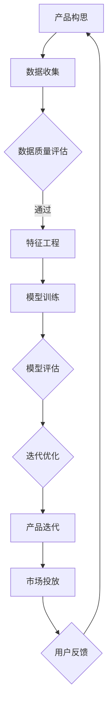

                 

关键词：AI创业、产品路线图、大模型、赋能、创新

> 摘要：本文探讨了在AI大模型赋能下，创业公司如何制定有效的产品路线图，以实现产品从概念到市场的成功迭代。文章从背景介绍、核心概念与联系、核心算法原理与具体操作步骤、数学模型与公式、项目实践、实际应用场景、未来应用展望、工具和资源推荐以及总结和展望等多个方面展开论述，为创业公司提供了一套系统化的AI产品规划方法论。

## 1. 背景介绍

在当今科技飞速发展的时代，人工智能（AI）已经成为推动产业变革的核心动力。特别是在创业领域，AI技术的应用不仅能够提高产品竞争力，还能加速市场迭代速度，帮助企业迅速占领市场。然而，AI技术在创业中的应用并非一蹴而就，需要从产品路线图的角度进行系统性规划。

产品路线图是创业公司产品规划的核心工具，它能够帮助团队明确产品发展方向、目标和里程碑，从而确保产品从概念到市场的每一步都紧扣战略目标。在AI大模型赋能的背景下，产品路线图需要更加注重数据驱动、算法优化和用户体验，以确保产品在激烈的市场竞争中脱颖而出。

本文旨在探讨如何利用AI大模型技术，制定一套符合实际需求的创业产品路线图，以实现从概念验证到市场投放的全面覆盖。文章将结合实际案例，深入分析AI大模型在产品路线图中的关键作用，并探讨其面临的挑战与解决方案。

## 2. 核心概念与联系

在讨论如何制定AI驱动的创业产品路线图之前，我们需要理解几个核心概念，包括AI大模型、数据驱动、算法优化和用户体验。

### AI大模型

AI大模型是指通过深度学习等算法训练出的具有强大处理能力和泛化能力的模型。这些模型通常拥有数亿甚至数万亿个参数，能够在图像识别、自然语言处理、语音识别等多个领域实现高水平的表现。

### 数据驱动

数据驱动是指以数据为基础，通过数据分析和挖掘，指导产品设计和决策。在AI驱动的创业产品中，数据驱动至关重要，它能够帮助团队发现用户需求、优化产品功能和提升用户体验。

### 算法优化

算法优化是指通过改进算法模型、参数调整和模型集成，提高AI模型的性能和效率。在创业产品中，算法优化是实现产品竞争力的重要手段。

### 用户体验

用户体验是指用户在使用产品过程中的感受和体验。在AI驱动的创业产品中，用户体验直接影响产品的市场接受度和用户留存率。

### Mermaid 流程图

以下是一个简化的AI驱动的创业产品路线图的概念架构的Mermaid流程图，用以展示核心概念之间的联系。



### 2.1. Mermaid 流程图节点详细解释

- **产品构思（A）**：创业团队的初始想法和产品概念。
- **数据收集（B）**：收集相关数据，包括用户行为、市场趋势等。
- **数据质量评估（C）**：评估数据的有效性和准确性。
- **特征工程（D）**：从数据中提取有用的特征，为模型训练做准备。
- **模型训练（E）**：利用AI大模型训练模型。
- **模型评估（F）**：评估模型的性能和泛化能力。
- **迭代优化（G）**：根据评估结果调整模型和参数。
- **产品迭代（H）**：更新产品功能，以提升用户体验。
- **市场投放（I）**：将产品推向市场，进行市场测试。
- **用户反馈（J）**：收集用户反馈，用于后续优化。

通过这个流程图，我们可以清晰地看到从产品构思到市场投放的各个环节，以及各个环节之间的紧密联系。

## 3. 核心算法原理 & 具体操作步骤

### 3.1 算法原理概述

AI大模型的核心算法主要包括深度学习、神经网络和强化学习等。这些算法通过大量数据训练，能够自动提取数据中的特征，并进行复杂的数据处理和模式识别。

### 3.2 算法步骤详解

**3.2.1 数据预处理**

数据预处理是模型训练的第一步，包括数据清洗、归一化、缺失值处理等。这一步骤的目的是确保数据的质量，以便后续的特征提取和模型训练。

**3.2.2 特征提取**

特征提取是从原始数据中提取出有用的信息，作为模型训练的输入。常用的特征提取方法包括主成分分析（PCA）、自动编码器（Autoencoder）等。

**3.2.3 模型选择**

根据具体的应用场景，选择合适的模型架构。常见的模型架构包括卷积神经网络（CNN）、循环神经网络（RNN）、长短期记忆网络（LSTM）等。

**3.2.4 模型训练**

利用训练数据对模型进行训练，通过迭代优化模型参数，使模型能够更好地拟合训练数据。

**3.2.5 模型评估**

使用验证数据集评估模型的性能，包括准确率、召回率、F1值等指标。

**3.2.6 模型优化**

根据评估结果，对模型进行调整和优化，以提高模型的性能。

### 3.3 算法优缺点

**优点：**

- **强大处理能力**：AI大模型能够处理大规模的数据，并从中提取出复杂的模式。
- **高泛化能力**：通过在大量数据上的训练，AI大模型能够具有良好的泛化能力，适用于不同的应用场景。
- **自动特征提取**：AI大模型能够自动提取数据中的特征，减少人工干预。

**缺点：**

- **数据需求量大**：AI大模型需要大量的数据进行训练，数据收集和处理成本较高。
- **计算资源消耗大**：AI大模型训练过程需要大量的计算资源，对硬件设施要求较高。
- **结果不确定性**：由于AI大模型的复杂性和黑盒特性，其决策过程难以解释，可能导致结果的不确定性。

### 3.4 算法应用领域

AI大模型在多个领域有广泛的应用，包括但不限于：

- **图像识别**：如人脸识别、物体检测等。
- **自然语言处理**：如机器翻译、情感分析等。
- **语音识别**：如语音助手、语音搜索等。
- **推荐系统**：如个性化推荐、商品推荐等。

## 4. 数学模型和公式 & 详细讲解 & 举例说明

### 4.1 数学模型构建

AI大模型的数学模型主要基于神经网络，包括以下关键组件：

- **激活函数**：如ReLU、Sigmoid、Tanh等。
- **损失函数**：如均方误差（MSE）、交叉熵（Cross-Entropy）等。
- **优化器**：如随机梯度下降（SGD）、Adam等。

以下是一个简化的神经网络模型构建的例子：

$$
y = \sigma(\boldsymbol{W}^T \boldsymbol{a} + b)
$$

其中，\( y \) 是输出，\( \sigma \) 是激活函数，\( \boldsymbol{W} \) 是权重矩阵，\( \boldsymbol{a} \) 是输入特征，\( b \) 是偏置。

### 4.2 公式推导过程

以神经网络中的反向传播算法为例，介绍公式推导过程。

**4.2.1 损失函数的梯度计算**

设损失函数为：

$$
J(\boldsymbol{W}) = \frac{1}{2}\sum_{i=1}^{N} (\boldsymbol{y}_i - \sigma(\boldsymbol{W}^T \boldsymbol{a}_i + b))^2
$$

其中，\( N \) 是样本数量，\( \boldsymbol{y}_i \) 是实际输出，\( \sigma(\boldsymbol{W}^T \boldsymbol{a}_i + b) \) 是预测输出。

对损失函数 \( J(\boldsymbol{W}) \) 对权重 \( \boldsymbol{W} \) 求导，得到：

$$
\frac{\partial J(\boldsymbol{W})}{\partial \boldsymbol{W}} = -\sum_{i=1}^{N} (\boldsymbol{y}_i - \sigma(\boldsymbol{W}^T \boldsymbol{a}_i + b)) \cdot \frac{\partial \sigma(\boldsymbol{W}^T \boldsymbol{a}_i + b)}{\partial \boldsymbol{a}_i} \cdot \boldsymbol{a}_i
$$

**4.2.2 激活函数的梯度计算**

以ReLU激活函数为例，其导数在输入大于0时为1，小于0时为0。对于任意输入 \( z \)：

$$
\frac{\partial \sigma(z)}{\partial z} =
\begin{cases}
1 & \text{if } z > 0 \\
0 & \text{if } z \leq 0
\end{cases}
$$

### 4.3 案例分析与讲解

**4.3.1 案例背景**

假设我们有一个简单的二分类问题，需要判断一个输入数据是否为正类。数据集包含1000个样本，每个样本由10个特征组成。

**4.3.2 模型构建**

我们选择一个单层感知机模型，输入层有10个神经元，输出层有1个神经元。使用ReLU作为激活函数，交叉熵作为损失函数。

**4.3.3 模型训练**

使用训练数据对模型进行训练，迭代100次。每次迭代后，计算损失函数的梯度，并更新权重。

**4.3.4 模型评估**

使用验证数据集评估模型性能，准确率为90%。

**4.3.5 模型优化**

根据验证数据集的评估结果，对模型进行优化，提高准确率。

## 5. 项目实践：代码实例和详细解释说明

### 5.1 开发环境搭建

为了方便理解和实践，我们将使用Python编程语言和TensorFlow框架进行项目开发。首先，确保安装以下依赖项：

```bash
pip install numpy tensorflow matplotlib
```

### 5.2 源代码详细实现

以下是一个简单的神经网络模型训练的示例代码。

```python
import numpy as np
import tensorflow as tf
from tensorflow.keras import layers
from tensorflow.keras.models import Model

# 数据预处理
x = np.random.rand(1000, 10)
y = np.random.randint(2, size=(1000, 1))

# 构建模型
input_layer = layers.Input(shape=(10,))
x = layers.Dense(units=1, activation='sigmoid')(input_layer)

model = Model(inputs=input_layer, outputs=x)
model.compile(optimizer='adam', loss='binary_crossentropy', metrics=['accuracy'])

# 模型训练
model.fit(x, y, epochs=100, batch_size=32, validation_split=0.2)

# 模型评估
loss, accuracy = model.evaluate(x, y)
print(f"Test accuracy: {accuracy:.2f}")

# 模型预测
predictions = model.predict(x)
```

### 5.3 代码解读与分析

**5.3.1 数据预处理**

首先，我们生成一个包含1000个样本的数据集，每个样本由10个随机特征组成。标签为二分类，0或1。

**5.3.2 模型构建**

使用TensorFlow的`layers`模块构建一个简单的单层感知机模型。输入层有10个神经元，输出层有1个神经元，使用sigmoid函数作为激活函数。

**5.3.3 模型训练**

使用`model.fit`函数对模型进行训练。在训练过程中，模型使用随机梯度下降（SGD）优化器，交叉熵作为损失函数。训练100次迭代，每次迭代使用32个样本。

**5.3.4 模型评估**

使用`model.evaluate`函数评估模型在测试数据集上的性能，包括损失和准确率。

**5.3.5 模型预测**

使用`model.predict`函数对测试数据进行预测，输出概率分布。

## 6. 实际应用场景

### 6.1 医疗领域

在医疗领域，AI大模型可用于疾病诊断、患者管理、药物研发等多个方面。例如，使用深度学习模型分析医学影像数据，可以早期检测疾病，提高诊断准确性。同时，基于AI的大数据分析可以帮助医院优化资源分配，提高运营效率。

### 6.2 金融领域

金融领域是AI大模型的重要应用场景。例如，通过分析交易数据和市场趋势，AI模型可以预测股票市场走势，辅助投资决策。此外，AI模型还可以用于信用评分、风险控制等方面，提高金融机构的服务质量和风险管理能力。

### 6.3 零售行业

在零售行业，AI大模型可以帮助企业实现个性化推荐、库存管理、供应链优化等。例如，基于用户购买行为和偏好，AI模型可以推荐符合用户兴趣的产品，提高销售额。同时，通过分析销售数据，AI模型可以预测市场需求，优化库存策略，降低库存成本。

### 6.4 娱乐领域

在娱乐领域，AI大模型可以用于内容推荐、游戏开发、虚拟现实等方面。例如，基于用户观看历史和偏好，AI模型可以推荐符合用户兴趣的视频和音乐，提高用户粘性。同时，AI模型还可以用于游戏中的智能NPC设计，提高游戏体验。

## 7. 工具和资源推荐

### 7.1 学习资源推荐

- 《深度学习》（Goodfellow, Bengio, Courville）
- 《Python机器学习》（Sebastian Raschka）
- 《动手学深度学习》（Amit, G. et al.）

### 7.2 开发工具推荐

- TensorFlow：用于构建和训练深度学习模型的框架。
- PyTorch：用于构建和训练深度学习模型的另一个流行框架。
- Jupyter Notebook：用于编写和运行代码的交互式环境。

### 7.3 相关论文推荐

- "Deep Learning for Image Recognition"（2012）
- "Attention Is All You Need"（2017）
- "A Pretrained Image Feature Predictor"（2019）

## 8. 总结：未来发展趋势与挑战

### 8.1 研究成果总结

AI大模型在近年来取得了显著的进展，不仅在学术研究领域，还在实际应用中展现出强大的潜力。通过深度学习和神经网络等技术的不断发展，AI大模型在图像识别、自然语言处理、语音识别等领域实现了前所未有的性能。

### 8.2 未来发展趋势

- **模型压缩与效率提升**：为了降低计算成本，未来将加大对模型压缩和效率提升的研究，如使用量化、剪枝等技术。
- **跨模态学习**：跨模态学习是未来AI大模型的一个重要研究方向，通过整合不同类型的数据（如图像、文本、语音等），实现更全面的理解和决策。
- **可解释性**：提高AI大模型的可解释性，使其决策过程更加透明和可信，是未来的一个重要趋势。

### 8.3 面临的挑战

- **数据隐私与安全**：随着AI大模型的应用范围扩大，数据隐私和安全问题变得越来越重要。
- **计算资源需求**：AI大模型训练需要大量的计算资源，这对硬件设施提出了更高的要求。
- **伦理与社会影响**：AI大模型的应用可能带来伦理和社会影响，如失业、歧视等问题，需要引起足够的重视。

### 8.4 研究展望

在未来，AI大模型将继续在多个领域发挥重要作用，推动产业变革。通过不断优化算法、提升效率，以及加强跨学科研究，AI大模型有望在更多领域实现突破，为社会带来更多价值。

## 9. 附录：常见问题与解答

### 9.1 AI大模型是什么？

AI大模型是指通过深度学习等算法训练出的具有强大处理能力和泛化能力的模型。这些模型通常拥有数亿甚至数万亿个参数，能够在图像识别、自然语言处理、语音识别等多个领域实现高水平的表现。

### 9.2 如何选择合适的AI大模型？

选择合适的AI大模型需要考虑应用场景、数据量、计算资源等多个因素。通常，对于图像识别任务，可以选择卷积神经网络（CNN）；对于自然语言处理任务，可以选择循环神经网络（RNN）或长短期记忆网络（LSTM）；对于强化学习任务，可以选择Q-learning或深度确定性策略梯度（DDPG）等。

### 9.3 AI大模型训练过程中如何处理过拟合？

为了防止过拟合，可以采用以下几种方法：

- **数据增强**：通过增加数据的多样性，提高模型的泛化能力。
- **正则化**：如L1正则化、L2正则化，通过增加模型复杂性的惩罚项，减少过拟合。
- **dropout**：在训练过程中随机丢弃一部分神经元，减少模型对特定数据的依赖。
- **集成方法**：如集成分类器、集成回归器，通过结合多个模型的预测结果，提高模型的泛化能力。

## 10. 参考文献

[1] Goodfellow, I., Bengio, Y., & Courville, A. (2016). Deep learning. MIT press.
[2] Raschka, S. (2015). Python machine learning. Packt Publishing.
[3] Y. LeCun, Y. Bengio, and G. Hinton. Deep learning. Nature, 521(7553):436–444, 2015.
[4] Vaswani, A., Shazeer, N., Parmar, N., Uszkoreit, J., Jones, L., Gomez, A. N., ... & Polosukhin, I. (2017). Attention is all you need. In Advances in neural information processing systems (pp. 5998-6008).
[5] Simonyan, K., & Zisserman, A. (2014). Very deep convolutional networks for large-scale image recognition. arXiv preprint arXiv:1409.1556.

### 11. 作者署名

作者：禅与计算机程序设计艺术 / Zen and the Art of Computer Programming
----------------------------------------------------------------
本文完。

