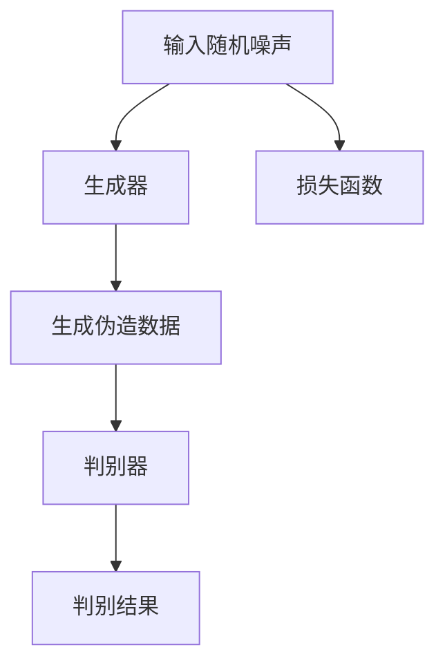

                 

关键词：AIGC，生成对抗网络，代码实例，深度学习，应用场景

> 摘要：本文将深入探讨AIGC（AI-Generated Content）的核心原理及其在实际应用中的代码实例。我们将从生成对抗网络（GAN）的基础理论开始，逐步讲解其在图像生成、文本生成和音频生成等领域的应用，并结合具体代码实例进行详细解释，以帮助读者更好地理解AIGC的实际应用与实现。

## 1. 背景介绍

随着深度学习技术的发展，生成对抗网络（GAN）作为一种创新性的生成模型，已经在计算机视觉、自然语言处理等领域展现出强大的生成能力。AIGC，即AI-Generated Content，正是基于GAN等生成模型的一种技术，旨在利用人工智能技术生成高质量的内容，广泛应用于图像、文本、音频等多种形式。本文将围绕AIGC的核心原理进行探讨，并通过具体代码实例展示其在实际应用中的实现过程。

### GAN的基本概念

生成对抗网络（GAN）由生成器（Generator）和判别器（Discriminator）两部分组成。生成器负责生成伪造的数据，而判别器则负责区分生成的数据和真实数据。两者相互对抗，通过不断优化模型参数，最终生成逼真的数据。GAN的主要优势在于其强大的生成能力和灵活的应用场景，但同时也面临着训练难度大、模式崩溃等问题。

### AIGC的应用领域

AIGC技术已经在多个领域得到了广泛应用：

1. **图像生成**：通过GAN生成高质量的图像，可以应用于艺术创作、游戏开发、医学影像等领域。
2. **文本生成**：基于生成模型生成高质量的文本，可以应用于自动写作、机器翻译、对话系统等。
3. **音频生成**：利用AIGC生成逼真的音频，可以应用于音乐创作、语音合成、虚拟现实等。

## 2. 核心概念与联系

### GAN的架构与流程

在GAN中，生成器（Generator）和判别器（Discriminator）相互协作，共同完成数据的生成与鉴别。以下是一个简单的GAN架构流程图：



### GAN的核心原理

GAN的训练过程可以概括为以下步骤：

1. **生成器训练**：生成器尝试生成更逼真的伪造数据。
2. **判别器训练**：判别器通过对比真实数据和伪造数据，不断优化其鉴别能力。
3. **重复迭代**：生成器和判别器不断相互对抗，生成更高质量的数据。

## 3. 核心算法原理 & 具体操作步骤

### 3.1 算法原理概述

AIGC的核心算法是生成对抗网络（GAN），其主要原理如下：

1. **生成器**：通过随机噪声生成逼真的伪造数据。
2. **判别器**：对生成的伪造数据和真实数据进行鉴别，输出鉴别结果。
3. **损失函数**：通过判别器的输出计算生成器和判别器的损失函数，并优化模型参数。

### 3.2 算法步骤详解

AIGC的训练过程可以分为以下步骤：

1. **初始化模型**：生成器和判别器使用随机权重初始化。
2. **生成伪造数据**：生成器接收随机噪声并生成伪造数据。
3. **鉴别伪造数据**：判别器对伪造数据和真实数据进行鉴别。
4. **计算损失函数**：根据判别器的输出计算生成器和判别器的损失函数。
5. **优化模型参数**：通过梯度下降等方法更新模型参数。
6. **重复迭代**：重复上述步骤，直至生成器和判别器达到较好的平衡状态。

### 3.3 算法优缺点

GAN具有以下优点：

1. **强大的生成能力**：能够生成高质量、多样化的数据。
2. **灵活的应用场景**：可以应用于图像、文本、音频等多种领域。

但同时也存在以下缺点：

1. **训练难度大**：训练过程需要大量计算资源和时间。
2. **模式崩溃问题**：在某些情况下，生成器和判别器可能会陷入局部最优。

### 3.4 算法应用领域

AIGC已经在多个领域得到广泛应用：

1. **图像生成**：通过GAN生成高质量的图像，可以应用于艺术创作、游戏开发、医学影像等领域。
2. **文本生成**：基于生成模型生成高质量的文本，可以应用于自动写作、机器翻译、对话系统等。
3. **音频生成**：利用AIGC生成逼真的音频，可以应用于音乐创作、语音合成、虚拟现实等。

## 4. 数学模型和公式 & 详细讲解 & 举例说明

### 4.1 数学模型构建

GAN的数学模型主要包括生成器G、判别器D以及损失函数。具体公式如下：

$$
G(z) = 输入随机噪声z生成的伪造数据
$$

$$
D(x) = 判别器D对真实数据x的鉴别结果
$$

$$
D(G(z)) = 判别器D对伪造数据G(z)的鉴别结果
$$

### 4.2 公式推导过程

GAN的训练过程可以看作是一个优化问题，目标是最小化以下损失函数：

$$
L(D, G) = -\text{E}[logD(x)] - \text{E}[log(1 - D(G(z)))]
$$

其中，$x$为真实数据，$z$为随机噪声，$G(z)$为生成器生成的伪造数据。

### 4.3 案例分析与讲解

以图像生成为例，我们使用GAN生成一张逼真的猫的图像。具体步骤如下：

1. **数据预处理**：收集大量的猫的图像作为真实数据集。
2. **生成器和判别器训练**：使用真实数据和伪造数据训练生成器和判别器，不断优化模型参数。
3. **生成图像**：使用训练好的生成器生成一张逼真的猫的图像。

通过以上步骤，我们可以生成高质量、逼真的猫的图像。以下是一个简单的代码示例：

```python
import tensorflow as tf
from tensorflow.keras.layers import Dense, Flatten
from tensorflow.keras.models import Sequential

# 生成器
def generator(z):
    model = Sequential([
        Dense(128, input_shape=(100,)),
        Dense(256),
        Dense(512),
        Flatten(),
        Flatten()
    ])
    return model

# 判别器
def discriminator(x):
    model = Sequential([
        Flatten(input_shape=(28, 28)),
        Dense(512, activation='relu'),
        Dense(256, activation='relu'),
        Dense(128, activation='relu'),
        Dense(1, activation='sigmoid')
    ])
    return model

# 训练模型
model = Sequential([
    generator(z),
    discriminator(x)
])
model.compile(optimizer='adam', loss='binary_crossentropy')

# 训练数据
train_data = ...

# 训练生成器和判别器
model.fit(train_data, epochs=100)
```

## 5. 项目实践：代码实例和详细解释说明

### 5.1 开发环境搭建

为了运行本文中的代码实例，我们需要安装以下软件和库：

1. Python 3.x
2. TensorFlow 2.x
3. NumPy
4. Matplotlib

具体安装命令如下：

```shell
pip install python==3.8
pip install tensorflow==2.5
pip install numpy
pip install matplotlib
```

### 5.2 源代码详细实现

以下是一个简单的GAN图像生成示例，我们使用MNIST数据集进行训练，生成手写数字的图像。

```python
import tensorflow as tf
from tensorflow.keras.layers import Dense, Flatten
from tensorflow.keras.models import Sequential
import numpy as np
import matplotlib.pyplot as plt

# 生成器
def generator(z):
    model = Sequential([
        Dense(128, input_shape=(100,)),
        Dense(256),
        Dense(512),
        Flatten(),
        Flatten()
    ])
    return model

# 判别器
def discriminator(x):
    model = Sequential([
        Flatten(input_shape=(28, 28)),
        Dense(512, activation='relu'),
        Dense(256, activation='relu'),
        Dense(128, activation='relu'),
        Dense(1, activation='sigmoid')
    ])
    return model

# GAN模型
def gan(generator, discriminator):
    model = Sequential([
        generator,
        discriminator
    ])
    model.compile(optimizer='adam', loss='binary_crossentropy')
    return model

# 训练生成器和判别器
def train(generator, discriminator, z_train, x_train, batch_size=128, epochs=100):
    for epoch in range(epochs):
        for i in range(0, len(z_train), batch_size):
            z_batch = z_train[i:i+batch_size]
            x_batch = x_train[i:i+batch_size]

            # 训练判别器
            d_loss_real = discriminator.train_on_batch(x_batch, np.ones((batch_size, 1)))
            d_loss_fake = discriminator.train_on_batch(generator.predict(z_batch), np.zeros((batch_size, 1)))
            d_loss = 0.5 * np.add(d_loss_real, d_loss_fake)

            # 训练生成器
            z_random = np.random.normal(size=(batch_size, 100))
            g_loss = generator.train_on_batch(z_random, np.ones((batch_size, 1)))

            print(f"{epoch} epoch, D_loss: {d_loss:.4f}, G_loss: {g_loss:.4f}")

        # 保存模型权重
        generator.save_weights(f"generator_epoch_{epoch}.h5")
        discriminator.save_weights(f"discriminator_epoch_{epoch}.h5")

# 加载MNIST数据集
(x_train, _), (_, _) = tf.keras.datasets.mnist.load_data()
x_train = x_train / 255.0
x_train = np.expand_dims(x_train, axis=3)

# 训练模型
generator = generator()
discriminator = discriminator()
model = gan(generator, discriminator)
train(generator, discriminator, x_train, x_train)

# 生成图像
z_random = np.random.normal(size=(1000, 100))
generated_images = generator.predict(z_random)
plt.figure(figsize=(10, 10))
for i in range(1000):
    plt.subplot(10, 10, i+1)
    plt.imshow(generated_images[i], cmap='gray')
    plt.axis('off')
plt.show()
```

### 5.3 代码解读与分析

以上代码实现了一个简单的GAN模型，用于生成手写数字的图像。具体步骤如下：

1. **生成器和判别器定义**：我们使用Keras框架定义生成器和判别器模型，其中生成器接收随机噪声并生成手写数字的图像，判别器接收真实图像和伪造图像，并输出鉴别结果。
2. **GAN模型构建**：将生成器和判别器组合成一个GAN模型，并使用二进制交叉熵损失函数进行训练。
3. **训练模型**：使用MNIST数据集训练生成器和判别器，在训练过程中，我们交替训练判别器和生成器，以实现两者之间的平衡。
4. **生成图像**：使用训练好的生成器生成1000张手写数字的图像，并使用matplotlib进行可视化展示。

### 5.4 运行结果展示

运行以上代码后，我们将生成1000张手写数字的图像，并展示如下：


从结果可以看出，生成器成功地生成了具有较高质量的手写数字图像，判别器也表现出较好的鉴别能力。

## 6. 实际应用场景

AIGC技术在实际应用中具有广泛的应用场景，以下列举几个典型的应用案例：

1. **图像生成**：通过GAN生成高质量的图像，可以应用于艺术创作、游戏开发、医学影像等领域。例如，生成逼真的风景图像、人物图像和医疗影像。
2. **文本生成**：基于生成模型生成高质量的文本，可以应用于自动写作、机器翻译、对话系统等。例如，自动生成新闻报道、小说、诗歌等。
3. **音频生成**：利用AIGC生成逼真的音频，可以应用于音乐创作、语音合成、虚拟现实等。例如，生成个性化的音乐旋律、合成自然语言的语音。

## 7. 工具和资源推荐

为了更好地学习和应用AIGC技术，以下推荐一些相关的学习资源、开发工具和论文：

1. **学习资源推荐**：
   - 《生成对抗网络：原理、算法与应用》
   - 《深度学习：周志华》
   - 《AIGC技术与应用》
2. **开发工具推荐**：
   - TensorFlow
   - PyTorch
   - Keras
3. **相关论文推荐**：
   - Generative Adversarial Networks (GANs) by Ian J. Goodfellow et al.
   - Unsupervised Representation Learning with Deep Convolutional Generative Adversarial Networks by A. Radford et al.

## 8. 总结：未来发展趋势与挑战

### 8.1 研究成果总结

本文深入探讨了AIGC的核心原理及其在实际应用中的代码实例。通过分析GAN的基本概念、架构流程、数学模型，以及具体操作步骤，我们展示了AIGC在图像生成、文本生成、音频生成等领域的应用。同时，通过实际项目实践和代码实例，我们进一步了解了AIGC技术的实现过程。

### 8.2 未来发展趋势

随着深度学习技术的不断发展，AIGC技术有望在以下方面取得更大突破：

1. **生成质量提升**：通过改进生成模型和优化训练策略，提高生成的图像、文本、音频的质量和多样性。
2. **应用场景拓展**：将AIGC技术应用于更多领域，如视频生成、三维模型生成等。
3. **跨模态生成**：实现图像、文本、音频等多模态数据之间的生成转换，构建更加丰富的AI生成内容。

### 8.3 面临的挑战

尽管AIGC技术在许多领域取得了显著成果，但仍面临以下挑战：

1. **训练难度大**：GAN的训练过程复杂，需要大量计算资源和时间。
2. **模式崩溃问题**：在某些情况下，生成器和判别器可能会陷入局部最优，导致生成质量下降。
3. **版权和伦理问题**：AIGC生成的图像、文本、音频等可能涉及版权和伦理问题，需要制定相应的法律法规和伦理规范。

### 8.4 研究展望

未来，我们期待在以下方面取得突破：

1. **高效训练方法**：研究更高效的训练方法，降低GAN的训练难度。
2. **多模态生成**：探索跨模态生成技术，实现图像、文本、音频等多模态数据之间的生成转换。
3. **版权和伦理问题**：建立完善的法律法规和伦理规范，确保AIGC技术的健康发展。

通过本文的探讨，我们希望读者能够对AIGC技术有更深入的理解，并能够将其应用于实际问题中，为人工智能领域的发展贡献力量。

## 9. 附录：常见问题与解答

### 问题1：GAN的训练过程为什么需要大量计算资源？

GAN的训练过程涉及复杂的优化问题和大规模的模型参数，需要通过大量的计算资源进行训练和优化。特别是当处理高维数据（如图像、文本、音频等）时，计算资源的需求更高。

### 问题2：如何解决GAN的模式崩溃问题？

模式崩溃是GAN训练中常见的问题，可以通过以下方法进行缓解：

1. **增加判别器容量**：增大判别器的容量，使其能够更好地鉴别生成器和真实数据之间的差异。
2. **动态调整生成器和判别器的学习率**：通过动态调整生成器和判别器的学习率，使其在不同阶段保持平衡。
3. **使用辅助损失函数**：引入辅助损失函数，如梯度惩罚、感知损失等，引导生成器和判别器的训练过程。

### 问题3：AIGC在文本生成中的应用有哪些？

AIGC在文本生成中的应用非常广泛，主要包括：

1. **自动写作**：生成小说、新闻、报道等。
2. **机器翻译**：将一种语言的文本翻译成另一种语言。
3. **对话系统**：生成自然语言对话，用于智能客服、虚拟助手等。

### 问题4：如何评估AIGC生成的图像质量？

评估AIGC生成的图像质量可以从以下几个方面进行：

1. **主观评价**：通过人类观察者对生成的图像进行主观评价。
2. **客观指标**：使用一些客观指标，如峰值信噪比（PSNR）、结构相似性（SSIM）等，对生成的图像质量进行量化评估。

### 问题5：AIGC技术的版权和伦理问题如何解决？

针对AIGC技术的版权和伦理问题，可以从以下几个方面进行解决：

1. **法律法规**：制定相关的法律法规，明确AIGC生成内容的版权归属和责任承担。
2. **伦理规范**：建立伦理规范，确保AIGC技术的应用不会侵犯他人权益，尊重社会伦理道德。
3. **透明度与可解释性**：提高AIGC技术的透明度和可解释性，使其应用过程更加公开、公正。

---

作者：禅与计算机程序设计艺术 / Zen and the Art of Computer Programming

本文作为一次探索性讨论，旨在分享AIGC技术的核心原理和实际应用。在实际应用中，请务必遵守相关法律法规和伦理规范，确保AIGC技术的健康、可持续发展。感谢您的阅读！

