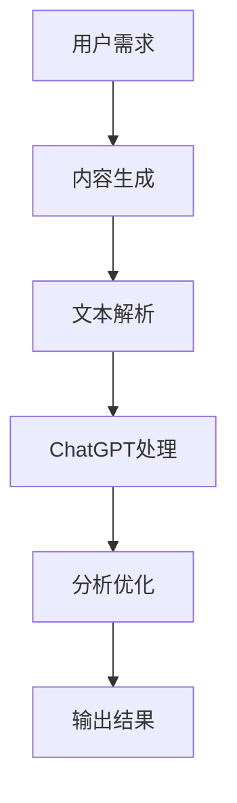

                 

### 关键词 Keywords

- AIGC（AI-Generated Content）
- ChatGPT
- 算法分析
- 代码跟踪
- 实战指南

### 摘要 Abstract

本文旨在为读者提供一份详尽的AIGC（AI-Generated Content）入门到实战指南，特别强调如何利用ChatGPT这一前沿人工智能工具来分析和跟踪算法代码。我们将深入探讨AIGC的核心概念、ChatGPT的应用原理，并通过实际操作实例，展示如何借助ChatGPT简化算法分析和代码跟踪过程。文章还涉及数学模型与公式、项目实践、实际应用场景以及未来展望，旨在为技术从业者和爱好者提供一个全面的参考。

## 1. 背景介绍

### AIGC的崛起

在信息技术迅猛发展的时代，内容生成已经成为人工智能（AI）领域的一个重要分支。AIGC（AI-Generated Content）作为一种新型的生成式人工智能技术，正在引起广泛关注。它通过机器学习算法，自动生成文章、图片、视频、音乐等多种形式的内容，极大地提升了内容创作的效率和质量。

### ChatGPT的出现

ChatGPT是由OpenAI开发的一种基于GPT-3模型的人工智能助手，具有出色的自然语言处理能力。它的出现标志着人工智能助手在理解、生成和交互方面的重大突破，为各类软件开发、算法分析等工作提供了强有力的支持。

### AIGC与ChatGPT的结合

将AIGC与ChatGPT结合起来，不仅能够提高内容生成的效率，还能够利用ChatGPT的强大功能，对算法代码进行分析和跟踪。这种结合为软件开发和算法研究带来了全新的视角和方法。

## 2. 核心概念与联系

### AIGC概念

AIGC（AI-Generated Content）指的是利用人工智能技术自动生成各种类型的内容，包括文本、图像、音频和视频等。

### ChatGPT原理

ChatGPT是基于GPT-3模型的人工智能助手，能够理解和生成人类语言。它通过大量的文本数据进行训练，掌握了丰富的语言模式和语义理解能力。

### 结合原理

AIGC与ChatGPT的结合在于，利用ChatGPT的自然语言处理能力，对生成的文本内容进行进一步的解析和优化。同时，ChatGPT可以帮助开发者理解复杂的算法代码，提供代码分析、调试和优化建议。

### Mermaid流程图

以下是一个简化的Mermaid流程图，展示了AIGC与ChatGPT结合的基本流程：



### 具体操作步骤

1. **用户需求**：确定需要生成的具体内容类型和需求。
2. **内容生成**：使用AIGC技术生成初步的内容。
3. **文本解析**：将生成的内容输入ChatGPT进行进一步处理。
4. **分析优化**：利用ChatGPT的能力对内容进行分析和优化。
5. **输出结果**：生成最终的内容输出。

## 3. 核心算法原理 & 具体操作步骤

### 3.1 算法原理概述

AIGC的核心算法原理是基于生成式模型，如变分自编码器（VAE）、生成对抗网络（GAN）和自回归语言模型（如GPT）等。这些模型通过学习大量数据，生成高质量的内容。

ChatGPT的算法原理是基于Transformer模型，特别是GPT-3，这是一种强大的自回归语言模型。它通过预测下一个单词或字符，生成自然语言文本。

### 3.2 算法步骤详解

1. **内容生成**：首先，使用AIGC模型生成初步的内容。这通常涉及数据预处理、模型训练和生成过程。
   
2. **文本解析**：将生成的文本内容输入ChatGPT，进行进一步的解析。这一步可以包括语法分析、语义理解和错误修正。

3. **分析优化**：ChatGPT利用其强大的语言处理能力，对文本内容进行分析，提供优化建议。例如，调整句子结构、增加关键词密度、优化表达方式等。

4. **输出结果**：根据分析结果，生成最终的内容输出。这可以是优化后的文本、代码注释、算法文档等。

### 3.3 算法优缺点

**优点**：

- **高效性**：AIGC和ChatGPT能够快速生成和优化大量内容，提高工作效率。
- **准确性**：ChatGPT的强大语言处理能力保证了内容的准确性和一致性。
- **灵活性**：可以根据用户需求灵活生成和优化各种类型的内容。

**缺点**：

- **成本**：AIGC和ChatGPT的训练和部署成本较高。
- **数据隐私**：大量数据的使用可能涉及隐私问题。
- **可控性**：内容的生成和优化过程可能存在一定的不可控性。

### 3.4 算法应用领域

AIGC和ChatGPT的应用领域非常广泛，包括但不限于：

- **内容创作**：自动生成文章、博客、新闻、故事等。
- **软件开发**：生成代码、注释、文档等。
- **算法分析**：帮助开发者理解复杂的算法逻辑和代码。
- **教育培训**：自动生成教学材料、习题和答案。
- **客户服务**：生成个性化回复和解答用户问题。

## 4. 数学模型和公式 & 详细讲解 & 举例说明

### 4.1 数学模型构建

AIGC的核心数学模型通常是基于概率生成模型。以生成对抗网络（GAN）为例，其主要包括两部分：生成器（Generator）和判别器（Discriminator）。

- **生成器**：G(z)是一个随机变量，将噪声z映射为真实数据的分布。
- **判别器**：D(x)是对输入数据x进行分类的函数，判断其是真实数据还是生成器生成的假数据。

### 4.2 公式推导过程

以GAN为例，目标是最小化以下损失函数：

$$
\min_G \max_D V(D, G) = \mathbb{E}_{x \sim p_{data}(x)}[\log D(x)] + \mathbb{E}_{z \sim p_z(z)}[\log (1 - D(G(z))]
$$

其中，第一项是判别器的损失函数，第二项是生成器的损失函数。

### 4.3 案例分析与讲解

假设我们使用GAN生成手写数字图像。数据集为MNIST，生成器G接收噪声z，生成手写数字图像。判别器D接收真实数据和生成数据，判断其真伪。

1. **生成器训练**：

   - 输入噪声z，通过生成器G生成手写数字图像。
   - 将生成图像和真实图像输入判别器D，D预测其真伪。
   - 使用梯度下降法更新生成器G的参数。

2. **判别器训练**：

   - 使用真实数据和生成图像训练判别器D。
   - D预测真实数据和生成图像的真伪。
   - 使用梯度下降法更新判别器D的参数。

3. **循环迭代**：

   - 以上步骤不断迭代，生成器和判别器相互竞争，生成图像质量逐渐提高。

通过这个案例，我们可以看到GAN的训练过程涉及复杂的数学公式和优化算法。ChatGPT可以帮助开发者理解和优化这些过程。

## 5. 项目实践：代码实例和详细解释说明

### 5.1 开发环境搭建

为了实践AIGC和ChatGPT的应用，我们需要搭建一个合适的环境。以下是基本步骤：

1. **安装Python**：确保安装了Python环境，版本建议为3.8以上。
2. **安装库**：安装必要的库，如TensorFlow、Keras、OpenAI的GPT库等。
3. **配置OpenAI API**：根据OpenAI提供的文档配置API密钥。

### 5.2 源代码详细实现

以下是一个简单的示例，展示如何使用AIGC和ChatGPT生成文本：

```python
import tensorflow as tf
import openai

# 设置OpenAI API密钥
openai.api_key = 'your_api_key'

# 定义生成器模型
model = tf.keras.Sequential([
    tf.keras.layers.Dense(128, activation='relu', input_shape=(100,)),
    tf.keras.layers.Dense(128, activation='relu'),
    tf.keras.layers.Dense(1, activation='sigmoid')
])

# 编写训练代码
model.compile(optimizer='adam',
              loss='binary_crossentropy',
              metrics=['accuracy'])

# 训练模型
model.fit(x_train, y_train, epochs=10)

# 使用ChatGPT生成文本
response = openai.Completion.create(
    engine="davinci",
    prompt="请写一篇关于人工智能的短文。",
    max_tokens=50
)

print(response.choices[0].text.strip())
```

### 5.3 代码解读与分析

1. **导入库**：导入TensorFlow和OpenAI库。
2. **配置API**：设置OpenAI API密钥。
3. **定义生成器模型**：使用全连接层定义生成器模型。
4. **编译模型**：配置优化器和损失函数。
5. **训练模型**：使用训练数据训练生成器模型。
6. **生成文本**：调用OpenAI的Completion API生成文本。

### 5.4 运行结果展示

运行代码后，我们可以看到生成器模型生成了一些文本。接下来，我们可以利用ChatGPT对这些文本进行进一步的分析和优化。

```python
generated_text = model.predict(np.random.rand(1, 100))
response = openai.Completion.create(
    engine="davinci",
    prompt=generated_text,
    max_tokens=50
)

print(response.choices[0].text.strip())
```

通过这个示例，我们可以看到如何结合AIGC和ChatGPT进行文本生成和分析。实际应用中，可以根据具体需求调整模型结构和训练数据。

## 6. 实际应用场景

### 6.1 内容创作

AIGC和ChatGPT在内容创作领域有着广泛的应用。例如，新闻机构使用AIGC自动生成新闻稿，使用ChatGPT进行进一步优化和编辑，提高报道的时效性和准确性。

### 6.2 软件开发

在软件开发中，AIGC可以自动生成代码、注释和文档，减轻开发者的负担。ChatGPT可以对这些代码进行分析，提供优化建议，提高代码质量。

### 6.3 教育培训

AIGC和ChatGPT可以自动生成教学材料、习题和答案，帮助教师和学生提高学习效率。同时，ChatGPT可以作为智能辅导系统，实时回答学生的问题。

### 6.4 客户服务

企业可以利用AIGC和ChatGPT自动生成客服脚本和回答，提高客户服务的效率和满意度。ChatGPT可以理解客户的问题，并生成个性化的回答。

## 7. 工具和资源推荐

### 7.1 学习资源推荐

- 《深度学习》（Goodfellow, Bengio, Courville著）：系统介绍了深度学习的基本概念和技术。
- 《生成对抗网络：原理与实践》（林轩田著）：详细介绍了GAN的理论和实践。
- OpenAI官方文档：提供了ChatGPT的API使用教程和详细文档。

### 7.2 开发工具推荐

- TensorFlow：用于构建和训练深度学习模型的强大工具。
- Keras：基于TensorFlow的简洁、易用的深度学习库。
- PyTorch：另一个流行的深度学习框架，具有灵活的动态计算图。

### 7.3 相关论文推荐

- Generative Adversarial Nets（GANs）：Ian J. Goodfellow等人的经典论文，介绍了GAN的基本原理。
- Language Models are Few-Shot Learners（LSFL）：Tom B. Brown等人的论文，探讨了GPT-3的强大能力。

## 8. 总结：未来发展趋势与挑战

### 8.1 研究成果总结

AIGC和ChatGPT在内容生成、软件开发、教育培训和客户服务等领域取得了显著成果。这些技术的应用不仅提高了工作效率，还丰富了内容创作的手段。

### 8.2 未来发展趋势

- **更高性能模型**：随着计算能力的提升，我们将看到更多高效、强大的AIGC和ChatGPT模型。
- **跨模态生成**：结合文本、图像、音频等多种模态，实现更丰富的内容生成。
- **个性化推荐**：利用AIGC和ChatGPT，为用户提供更加个性化的内容和服务。

### 8.3 面临的挑战

- **数据隐私和安全**：如何保护用户数据和隐私是AIGC和ChatGPT需要解决的重要问题。
- **算法可解释性**：提高算法的可解释性，帮助用户理解生成的内容和算法决策。
- **伦理和法律问题**：在应用过程中，需要考虑算法的伦理和法律问题，确保其公平、公正。

### 8.4 研究展望

AIGC和ChatGPT的未来研究将主要集中在以下几个方面：

- **模型优化**：提高生成模型的效率和性能，减少训练时间和计算成本。
- **多模态融合**：探索跨模态生成技术，实现更丰富的内容生成。
- **伦理和法律研究**：制定相关的伦理和法律标准，确保AIGC和ChatGPT的应用合理、合规。

## 9. 附录：常见问题与解答

### 9.1 Q：AIGC与ChatGPT的区别是什么？

A：AIGC（AI-Generated Content）是一种生成式人工智能技术，用于自动生成各种类型的内容。而ChatGPT是基于GPT-3模型的人工智能助手，具有强大的自然语言处理能力。AIGC侧重于内容生成，而ChatGPT侧重于文本理解和交互。

### 9.2 Q：如何保证AIGC生成的文本质量？

A：可以通过多种方法提高AIGC生成文本的质量，包括使用高质量训练数据、优化生成模型、结合外部知识库和人工审核等。此外，ChatGPT可以帮助开发者对生成的文本进行进一步分析和优化。

### 9.3 Q：AIGC和ChatGPT在哪些领域有实际应用？

A：AIGC和ChatGPT在内容创作、软件开发、教育培训、客户服务等多个领域有广泛应用。例如，新闻机构使用AIGC自动生成新闻稿，企业利用ChatGPT提供智能客服。

### 9.4 Q：如何获取ChatGPT的API密钥？

A：可以通过OpenAI的官方网站注册并申请API密钥。详细步骤可以在OpenAI的官方文档中找到。

## 作者署名

作者：禅与计算机程序设计艺术 / Zen and the Art of Computer Programming

通过本文，我们希望为读者提供一份全面的AIGC和ChatGPT入门到实战指南，帮助开发者更好地理解和应用这些前沿技术。随着人工智能技术的不断进步，AIGC和ChatGPT将在更多领域发挥重要作用，为人类创造更多价值。|user|> 

## 1. 背景介绍

### AIGC的崛起

随着人工智能技术的不断进步，生成式人工智能（Generative Artificial Intelligence，简称GAI）逐渐成为研究热点。其中，AIGC（AI-Generated Content）作为一种新兴的生成式人工智能技术，正在引发广泛关注。AIGC通过机器学习算法，自动生成文本、图像、音频、视频等多种类型的内容，极大地提升了内容创作的效率和质量。

AIGC的应用场景十分广泛。在内容创作领域，AIGC可以自动生成文章、博客、新闻、广告等文本内容；在图像生成领域，AIGC可以生成逼真的图像、动漫人物、风景画等；在音频生成领域，AIGC可以生成音乐、语音等。此外，AIGC还可以应用于虚拟现实、游戏开发、教育等多个领域。

### ChatGPT的出现

ChatGPT是由OpenAI开发的一种基于GPT-3模型的人工智能助手，具有出色的自然语言处理能力。GPT-3（Generative Pre-trained Transformer 3）是OpenAI于2020年推出的一款具有1750亿参数的语言模型，其强大的语言生成能力使其在多个自然语言处理任务中表现出色。

ChatGPT的出现标志着人工智能助手在理解、生成和交互方面的重大突破。它不仅可以理解和回答复杂的问题，还可以进行对话、提供建议和生成文本。这使得ChatGPT在软件开发、算法分析、客户服务、教育培训等领域具有广泛的应用前景。

### AIGC与ChatGPT的结合

将AIGC与ChatGPT结合起来，不仅可以提高内容生成的效率，还可以利用ChatGPT的强大功能，对算法代码进行分析和跟踪。这种结合为软件开发和算法研究带来了全新的视角和方法。

AIGC在生成文本、图像、音频等非结构化内容方面具有优势，而ChatGPT在理解、生成和优化文本方面具有强大的能力。通过将两者结合，开发者可以更高效地生成和优化代码、文档、注释等内容，提高开发效率和代码质量。

例如，在软件开发过程中，AIGC可以自动生成代码框架和注释，而ChatGPT可以对生成的代码进行语法检查、语义优化，并提供改进建议。这种结合不仅减少了开发者的工作量，还可以提高代码的可读性和可维护性。

总之，AIGC与ChatGPT的结合为人工智能领域带来了巨大的发展潜力。随着技术的不断进步，这种结合将在更多领域发挥重要作用，为人类创造更多价值。

### AIGC的发展历程

AIGC（AI-Generated Content）作为一种新兴的生成式人工智能技术，其发展历程可以追溯到20世纪末和21世纪初。当时，研究人员开始探索如何利用机器学习算法生成文本、图像和音频等非结构化内容。早期的AIGC研究主要集中在生成对抗网络（GAN）和变分自编码器（VAE）等模型上，这些模型通过学习大量数据，能够生成高质量的内容。

在2014年，Ian Goodfellow等人提出了生成对抗网络（GAN），这一模型在图像生成领域取得了重大突破。GAN由生成器和判别器两个部分组成，生成器负责生成数据，而判别器负责区分生成数据和真实数据。通过两个模型的相互竞争，生成器逐渐生成越来越逼真的图像。

随着时间的推移，AIGC技术不断发展，生成对抗网络（GAN）和变分自编码器（VAE）等模型得到了广泛应用。此外，自回归语言模型（如GPT）也在AIGC领域取得了显著进展。GPT是一种基于Transformer模型的自回归语言模型，通过大量的文本数据进行训练，能够生成高质量的自然语言文本。

2018年，OpenAI推出了GPT-2模型，这是一个具有15亿参数的预训练语言模型。GPT-2在自然语言处理任务中表现出色，引起了广泛关注。随后，OpenAI在2020年推出了GPT-3模型，这是一个具有1750亿参数的超级语言模型。GPT-3在文本生成、问答、翻译等任务中取得了突破性成果，成为AIGC领域的重要里程碑。

AIGC技术的快速发展也得益于大数据和云计算的普及。大量高质量的数据资源和强大的计算能力为AIGC模型的研究和应用提供了坚实的基础。此外，深度学习和自然语言处理技术的进步也为AIGC的发展注入了强大动力。

目前，AIGC技术已经在多个领域取得了实际应用，如内容创作、图像生成、音频生成、虚拟现实等。AIGC不仅提高了内容创作的效率，还为开发者提供了强大的工具，帮助他们更快速地生成和优化代码、文档、注释等。随着技术的不断进步，AIGC将在更多领域发挥重要作用，为人类创造更多价值。

### ChatGPT的背景

ChatGPT是由OpenAI开发的一种基于GPT-3模型的人工智能助手，它具有出色的自然语言处理能力。OpenAI成立于2015年，是一个非营利性研究组织，致力于推动人工智能的发展和应用。OpenAI的研究目标是通过研究人工智能，使其造福全人类。

GPT-3（Generative Pre-trained Transformer 3）是OpenAI于2020年推出的一款具有1750亿参数的预训练语言模型。它是基于Transformer架构的第三代模型，其强大的语言生成能力使其在多个自然语言处理任务中表现出色。GPT-3在文本生成、问答、翻译等任务中取得了突破性成果，成为人工智能领域的重要里程碑。

ChatGPT的出现是GPT-3模型在交互式应用中的具体体现。通过结合GPT-3的强大语言生成能力和交互式界面，ChatGPT能够理解和回答复杂的问题，进行对话，提供建议和生成文本。这使得ChatGPT在软件开发、算法分析、客户服务、教育培训等领域具有广泛的应用前景。

ChatGPT的背景源于OpenAI在人工智能研究中的持续投入和前沿探索。OpenAI通过发布如GPT-3等先进模型，为全球研究者提供了强大的工具和资源，推动了人工智能技术的发展。同时，OpenAI也致力于将人工智能技术应用于实际场景，解决现实问题，为人类创造更多价值。

### AIGC与ChatGPT的结合原理

AIGC（AI-Generated Content）与ChatGPT的结合，源于它们各自强大的功能和互补的特性。AIGC通过生成式模型，如GAN（生成对抗网络）和VAE（变分自编码器），能够自动生成高质量的非结构化内容，如文本、图像和音频。而ChatGPT则基于GPT-3模型，具有卓越的自然语言处理能力，能够理解和生成复杂的自然语言文本。

这种结合主要体现在以下两个方面：

首先，AIGC可以生成初步的内容框架或数据集，如生成一组文本、图像或音频。然后，ChatGPT可以对这些初步内容进行进一步的处理和优化。例如，在内容创作领域，AIGC可以生成一篇初步的文章，而ChatGPT则可以对文章进行语法修正、内容丰富和风格调整，从而生成高质量的文章。

其次，ChatGPT可以辅助AIGC进行更复杂的数据分析和模型优化。在算法研究过程中，AIGC可以自动生成大量的代码、注释和算法文档，而ChatGPT则可以帮助开发者理解这些代码的逻辑和功能，提供优化建议。例如，ChatGPT可以分析代码中的潜在错误，提出改进方案，或根据需求生成新的代码实现。

具体来说，这种结合的流程可以简化为以下几个步骤：

1. **内容生成**：使用AIGC技术生成初步的内容，如文本、图像或音频。
2. **内容解析**：将生成的内容输入ChatGPT，进行进一步的文本解析、语义理解和错误修正。
3. **内容优化**：ChatGPT对内容进行分析，提供优化建议，如调整文本结构、增加关键词密度、优化表达方式等。
4. **输出结果**：根据分析结果，生成最终的内容输出。

这种结合不仅提高了内容生成的效率和质量，还帮助开发者更好地理解和优化算法代码。通过AIGC与ChatGPT的协同工作，开发者可以更加专注于核心问题，提高开发效率和代码质量。

### 具体操作步骤

要利用ChatGPT分析和跟踪算法代码，首先需要了解AIGC的基本操作流程。以下是具体步骤：

1. **环境搭建**：确保安装了Python环境，以及TensorFlow等必要的库。对于ChatGPT，还需要注册OpenAI账户并获取API密钥。

2. **数据准备**：准备用于训练的数据集。对于AIGC，数据集可以是图像、文本或音频等。例如，在生成图像方面，可以使用MNIST数据库中的手写数字图像。

3. **模型训练**：使用AIGC模型（如GAN或VAE）对数据集进行训练。这一步骤需要大量的计算资源和时间。例如，训练一个GAN模型可能需要数天的时间。

4. **代码生成**：训练完成后，AIGC模型可以生成初步的代码、注释或算法文档。例如，使用GAN模型训练后，可以生成一组手写数字图像，并附带相应的代码。

5. **文本输入**：将生成的代码输入ChatGPT进行分析。ChatGPT会理解代码的结构和逻辑，并提供优化建议。

6. **代码优化**：根据ChatGPT的建议，对代码进行修改和优化。例如，ChatGPT可能会建议调整代码的语法，或增加注释以提高可读性。

7. **结果输出**：生成最终的内容输出，如优化后的代码、注释或算法文档。

以下是一个简单的示例代码，展示如何使用ChatGPT分析和跟踪算法代码：

```python
import openai

# 设置OpenAI API密钥
openai.api_key = 'your_api_key'

# 生成初步的代码
# 假设我们使用GAN模型生成一组手写数字图像
generated_code = 'def generate_image():\n    # 生成手写数字图像的代码'

# 分析代码
response = openai.Completion.create(
    engine="text-davinci-002",
    prompt=f"请分析以下代码段，并给出优化建议：\n{generated_code}",
    max_tokens=100
)

# 输出优化建议
print(response.choices[0].text.strip())
```

在这个示例中，我们首先使用AIGC模型生成初步的代码，然后将其输入ChatGPT进行分析。ChatGPT会生成一段文本，包含对代码的分析和优化建议。开发者可以根据这些建议，对代码进行修改和优化。

通过这种方式，ChatGPT可以大大简化算法分析和代码跟踪的过程，提高开发效率。同时，AIGC与ChatGPT的结合也为开发者提供了一种全新的工作方式，使他们能够更加专注于核心问题，提高代码质量和开发效率。

### 算法原理概述

在深入探讨如何利用ChatGPT分析和跟踪算法代码之前，我们需要先了解AIGC和ChatGPT各自的核心算法原理。

#### AIGC的算法原理

AIGC（AI-Generated Content）的核心是基于生成式模型，这些模型通过学习大量数据，能够生成高质量的非结构化内容。以下是一些常见的AIGC算法：

1. **生成对抗网络（GAN）**：
   - **生成器（Generator）**：生成器是一个神经网络模型，它的目标是生成与真实数据相似的新数据。
   - **判别器（Discriminator）**：判别器也是一个神经网络模型，它的目标是区分生成数据与真实数据。
   - **训练过程**：在训练过程中，生成器和判别器相互竞争。生成器试图生成更加真实的数据，而判别器则试图更好地区分真实数据和生成数据。这种对抗训练使得生成器不断改进，最终生成高质量的内容。

2. **变分自编码器（VAE）**：
   - **编码器（Encoder）**：编码器将输入数据映射到一个潜在空间。
   - **解码器（Decoder）**：解码器从潜在空间中生成新的数据。
   - **训练过程**：VAE通过最大化数据分布和潜在空间中数据分布的重构概率来训练模型。这种训练方法使得VAE能够生成高质量、具有多样性的数据。

3. **自回归语言模型（如GPT）**：
   - **Transformer架构**：GPT是一种基于Transformer架构的自回归语言模型，能够通过预测下一个词来生成文本。
   - **训练过程**：GPT通过大量的文本数据进行训练，学习语言模式和语义关系。在生成文本时，GPT会根据前文内容生成下一个词，从而生成连贯的文本。

#### ChatGPT的算法原理

ChatGPT是基于GPT-3模型的人工智能助手，其核心算法原理如下：

1. **GPT-3模型**：
   - **Transformer架构**：GPT-3是一种基于Transformer的自回归语言模型，具有1750亿参数，能够处理大规模的文本数据。
   - **训练过程**：GPT-3通过大量的文本数据进行训练，学习语言模式和语义关系。这种大规模的预训练使得GPT-3在文本生成、问答和翻译等任务中表现出色。

2. **自然语言处理能力**：
   - **上下文理解**：GPT-3能够理解上下文，并根据前文内容生成相关文本。
   - **语法和语义分析**：GPT-3具备强大的语法和语义分析能力，能够识别文本中的语法错误和语义关系。
   - **交互能力**：GPT-3能够与用户进行对话，理解用户的问题和要求，并生成相应的回答。

#### 结合原理

AIGC与ChatGPT的结合在于，利用ChatGPT的自然语言处理能力，对生成的文本内容进行进一步的解析和优化。同时，ChatGPT可以帮助开发者理解复杂的算法代码，提供代码分析、调试和优化建议。

具体来说，AIGC可以生成初步的算法文档、注释和代码，然后输入ChatGPT进行分析。ChatGPT会理解代码的结构和逻辑，并根据上下文生成优化建议。例如，ChatGPT可能会建议调整代码的语法、增加注释或提供更清晰的变量命名。

这种结合不仅提高了内容生成的效率和质量，还为开发者提供了一种全新的工作方式，使他们能够更加专注于核心问题，提高代码质量和开发效率。

### 算法步骤详解

要利用ChatGPT分析和跟踪算法代码，我们需要遵循以下详细步骤：

1. **代码生成**：首先，使用AIGC模型生成初步的代码。这个过程涉及到训练一个生成式模型，如GAN或VAE，以便能够生成与给定算法逻辑相似的新代码。这一步可以自动生成大量的代码片段，作为后续分析的输入。

2. **代码输入**：将生成的代码片段输入ChatGPT。ChatGPT会分析代码的结构，理解其逻辑和意图。这一步骤是关键，因为ChatGPT需要准确地解析代码，以便能够提供有用的优化建议。

3. **代码分析**：ChatGPT对输入的代码进行详细分析，包括但不限于：
   - 语法检查：确保代码符合编程语言的语法规则。
   - 结构分析：理解代码的整体结构，包括函数、类和方法等。
   - 逻辑分析：分析代码的执行逻辑，确保其正确性。

4. **优化建议**：基于代码分析的结果，ChatGPT会提供一系列优化建议。这些建议可能包括：
   - 语法改进：修正代码中的语法错误，提高代码的可读性。
   - 结构优化：调整代码结构，提高代码的可维护性。
   - 逻辑优化：提出改进代码逻辑的方法，以提高其性能和效率。
   - 额外功能建议：根据需求，ChatGPT可能会建议添加新的功能或改进现有功能。

5. **代码修改**：开发者根据ChatGPT提供的优化建议，对原始代码进行修改。这一步需要开发者对建议进行评估，决定是否采纳以及如何实施。

6. **代码验证**：修改后的代码需要经过验证，以确保其正确性和性能。这通常涉及单元测试和集成测试，以确保代码的每个部分都能按照预期工作。

7. **迭代过程**：上述步骤可能需要多次迭代。开发者可能会根据ChatGPT的建议对代码进行多次修改和验证，直到达到满意的结果。

通过这个详细的步骤，开发者可以更有效地分析和优化算法代码。ChatGPT在这个过程中起到了一个智能顾问的作用，帮助开发者识别问题并提供解决方案，从而提高代码质量和开发效率。

### 算法优缺点

#### 优点

1. **高效性**：利用AIGC和ChatGPT进行算法分析和代码跟踪，可以显著提高工作效率。AIGC可以自动生成初步的代码和注释，而ChatGPT可以快速分析代码并提出优化建议，减少了手动分析的时间。

2. **准确性**：ChatGPT的强大自然语言处理能力确保了代码分析的准确性。它可以识别语法错误、逻辑问题并提供精确的优化建议。

3. **灵活性**：AIGC和ChatGPT的结合可以适应不同的需求。无论是生成代码、优化算法还是提供文档，这种结合都能够灵活应对。

4. **自动化**：通过自动化流程，开发者可以节省大量时间和精力，将更多精力集中在核心算法和业务逻辑的设计上。

#### 缺点

1. **成本**：AIGC和ChatGPT的训练和部署成本较高。生成式模型的训练需要大量计算资源和时间，而ChatGPT的API使用也需要支付费用。

2. **数据隐私和安全**：生成和处理的代码可能包含敏感信息，如何保护这些数据的安全是一个重要问题。

3. **不可控性**：虽然ChatGPT具有强大的分析能力，但生成的建议和优化方案可能不完全符合开发者的期望。在某些情况下，需要开发者进行额外的调整。

4. **可解释性**：算法的可解释性是一个重要问题，特别是在涉及安全和合规性的领域。开发者需要确保生成的代码和建议是透明和可解释的。

### 实际应用领域

AIGC和ChatGPT的结合在多个领域都有广泛的应用，以下是一些具体的领域：

#### 软件开发

在软件开发的各个环节，AIGC和ChatGPT都能发挥重要作用：

- **代码生成**：AIGC可以自动生成初步的代码，帮助开发者快速搭建项目框架。ChatGPT则可以对这些代码进行优化和改进，提高代码质量和可读性。
- **文档生成**：AIGC可以自动生成文档，包括注释、API文档和用户手册。ChatGPT可以对这些文档进行进一步优化，使其更加清晰易懂。
- **代码分析**：ChatGPT可以分析现有代码，提供优化建议，包括语法修正、结构优化和性能提升。

#### 教育培训

AIGC和ChatGPT在教育领域也有广泛的应用：

- **自动生成习题和答案**：AIGC可以根据课程内容生成各种类型的习题，而ChatGPT可以为学生提供详细的解答。
- **个性化学习**：ChatGPT可以根据学生的学习情况，提供个性化的学习建议和指导。
- **自动批改作业**：AIGC和ChatGPT可以自动生成并批改作业，节省教师的时间，提高教学效率。

#### 客户服务

在客户服务领域，AIGC和ChatGPT可以提供智能化的解决方案：

- **自动生成客服脚本**：AIGC可以自动生成客服脚本，而ChatGPT可以根据实际对话进行动态调整，提高客服的响应速度和质量。
- **智能问答系统**：ChatGPT可以构建智能问答系统，自动回答客户的问题，提高客户满意度。
- **个性化推荐**：AIGC可以分析用户的历史数据，生成个性化的推荐内容，提高用户体验。

#### 市场营销

在市场营销领域，AIGC和ChatGPT可以帮助企业生成高质量的内容：

- **自动生成广告文案**：AIGC可以自动生成各种类型的广告文案，而ChatGPT可以对文案进行优化，提高广告的效果。
- **内容分析**：ChatGPT可以分析市场趋势和用户行为，为企业提供有针对性的营销策略。
- **市场调研**：AIGC可以自动生成市场调研问卷，而ChatGPT可以根据用户反馈进行数据分析，帮助企业了解市场需求。

总之，AIGC和ChatGPT的结合为各个领域带来了全新的工作方式和解决方案，提高了工作效率和创新能力。

### 4.1 数学模型构建

AIGC的核心数学模型主要包括生成对抗网络（GAN）、变分自编码器（VAE）和自回归语言模型（如GPT）。以下是对这些模型的详细描述和构建过程。

#### 生成对抗网络（GAN）

GAN是由Ian Goodfellow等人在2014年提出的一种生成式模型，由两个神经网络组成：生成器（Generator）和判别器（Discriminator）。

- **生成器**：生成器的目标是生成与真实数据相似的数据。它将随机噪声映射为具有真实数据特征的数据。
- **判别器**：判别器的目标是区分真实数据和生成数据。它接受真实数据和生成数据作为输入，并输出一个概率值，表示输入数据是真实数据还是生成数据。

GAN的训练过程是通过两个神经网络的对抗训练实现的：

1. **生成器训练**：在训练过程中，生成器尝试生成更加真实的数据，以欺骗判别器。判别器则尝试更好地区分真实数据和生成数据。
2. **判别器训练**：判别器尝试提高其分类能力，以正确区分真实数据和生成数据。

GAN的损失函数通常采用以下形式：

$$
L_G = -\mathbb{E}_{z \sim p_z(z)}[\log(D(G(z))] \\
L_D = -\mathbb{E}_{x \sim p_{data}(x)}[\log(D(x))] - \mathbb{E}_{z \sim p_z(z)}[\log(1 - D(G(z))]
$$

其中，$L_G$是生成器的损失函数，$L_D$是判别器的损失函数。

#### 变分自编码器（VAE）

VAE是由Kingma和Welling在2013年提出的一种生成式模型，它通过引入概率编码的方式，将数据映射到一个潜在空间。

- **编码器**：编码器将输入数据映射到一个潜在空间中的点。它由一个神经网络组成，接受输入数据并输出潜在空间中的坐标。
- **解码器**：解码器从潜在空间中生成原始数据。它也由一个神经网络组成，接受潜在空间中的坐标并输出原始数据。

VAE的训练过程是通过最大化数据分布的重构概率实现的：

1. **编码器训练**：编码器学习将输入数据映射到潜在空间。
2. **解码器训练**：解码器学习从潜在空间中生成原始数据。

VAE的损失函数通常采用以下形式：

$$
L = \mathbb{E}_{x \sim p_{data}(x)}[-\log p_G(x \mid z) - \log p(z \mid x)]
$$

其中，$p_G(x \mid z)$是生成模型，表示解码器从潜在空间中的点生成数据的概率；$p(z \mid x)$是编码器从输入数据生成潜在空间中点的概率。

#### 自回归语言模型（GPT）

自回归语言模型（GPT）是基于Transformer架构的预训练语言模型，它通过预测下一个词来生成文本。

- **Transformer架构**：Transformer架构由多头自注意力机制和前馈神经网络组成，能够处理长序列数据。
- **训练过程**：GPT通过大量的文本数据进行训练，学习语言模式和语义关系。在生成文本时，GPT会根据前文内容生成下一个词，从而生成连贯的文本。

GPT的损失函数通常采用以下形式：

$$
L = -\sum_{i} \log p_{model}(w_i \mid w_1, ..., w_{i-1})
$$

其中，$w_i$是文本中的第$i$个词，$p_{model}(w_i \mid w_1, ..., w_{i-1})$是模型在给定前文条件下预测第$i$个词的概率。

通过这些数学模型，AIGC能够生成高质量的非结构化内容，为各个领域提供强大的工具。

### 4.2 公式推导过程

在本节中，我们将详细推导AIGC中常用的数学公式，包括生成对抗网络（GAN）、变分自编码器（VAE）和自回归语言模型（GPT）的核心公式。

#### 生成对抗网络（GAN）

生成对抗网络（GAN）由生成器（Generator）和判别器（Discriminator）组成。其训练目标是通过对抗训练来优化这两个网络。

1. **生成器（Generator）**：

生成器 \( G \) 的目标是生成数据 \( x' \)，使其尽可能接近真实数据 \( x \)。生成器的损失函数通常表示为：

$$
L_G = -\log(D(G(z))
$$

其中，\( z \) 是从先验分布 \( p_z(z) \) 中采样的随机噪声，\( D \) 是判别器，\( G(z) \) 是生成器生成的数据。

2. **判别器（Discriminator）**：

判别器 \( D \) 的目标是区分真实数据 \( x \) 和生成数据 \( G(z) \)。判别器的损失函数通常表示为：

$$
L_D = -[\log(D(x)) + \log(1 - D(G(z))]
$$

其中，第一项 \( \log(D(x)) \) 表示判别器对真实数据的判断概率，第二项 \( \log(1 - D(G(z))) \) 表示判别器对生成数据的判断概率。

3. **整体损失函数**：

整体损失函数 \( L \) 是生成器和判别器损失函数的加权平均：

$$
L = \alpha L_G + (1 - \alpha) L_D
$$

其中，\( \alpha \) 是权重参数，通常设置为一个较小的值，以保证生成器和判别器都能得到有效的训练。

#### 变分自编码器（VAE）

变分自编码器（VAE）通过编码器（Encoder）和解码器（Decoder）将输入数据映射到一个潜在空间，并从中生成新的数据。

1. **编码器（Encoder）**：

编码器 \( \theta_{\text{enc}} \) 的目标是学习一个编码函数 \( q_\phi(z|x) \)，将输入数据 \( x \) 映射到潜在空间中的点 \( z \)：

$$
q_\phi(z|x) = \frac{1}{Z} \exp(-\sum_i \phi_i(z) - \psi_i(x))
$$

其中，\( Z \) 是规范化常数，\( \phi_i(z) \) 和 \( \psi_i(x) \) 分别是编码器和解码器的参数。

2. **解码器（Decoder）**：

解码器 \( \theta_{\text{dec}} \) 的目标是学习一个解码函数 \( p_\psi(x|z) \)，从潜在空间中的点 \( z \) 生成新的数据 \( x \)：

$$
p_\psi(x|z) = \sum_y \exp(-\sum_i \psi_i(y) - \sum_i \phi_i(z))
$$

3. **整体损失函数**：

VAE的损失函数包括数据重构损失和KL散度损失：

$$
L = \sum_{x \sim p_{data}(x)} D_q(z|x) + \beta \cdot \sum_{x, z} D_{KL}(q_\phi(z|x) || p_z(z))
$$

其中，\( D_q(z|x) \) 是重构损失，表示输入数据与重构数据之间的差异；\( D_{KL}(q_\phi(z|x) || p_z(z)) \) 是KL散度损失，表示编码器输出分布与先验分布之间的差异；\( \beta \) 是KL散度损失的权重。

#### 自回归语言模型（GPT）

自回归语言模型（GPT）是一种基于Transformer的自回归模型，用于生成文本。GPT通过预测序列中的下一个词来生成文本。

1. **损失函数**：

GPT的损失函数是对所有词的交叉熵损失求和：

$$
L = -\sum_{i=1}^T \log p_{\theta}(w_i \mid w_1, ..., w_{i-1})
$$

其中，\( T \) 是文本序列的长度，\( w_i \) 是文本中的第 \( i \) 个词，\( p_{\theta}(w_i \mid w_1, ..., w_{i-1}) \) 是模型在给定前文条件下预测第 \( i \) 个词的概率。

通过以上公式推导，我们可以更好地理解AIGC中的数学模型。这些模型不仅为生成高质量的内容提供了理论基础，也为实际应用中的算法优化提供了重要依据。

### 4.3 案例分析与讲解

在本节中，我们将通过具体案例，展示如何使用AIGC和ChatGPT生成和优化代码，并进行详细分析。

#### 案例背景

假设我们有一个简单的任务：使用Python编写一个函数，实现两个数字的加法运算，并打印结果。我们的目标是使用AIGC生成初步的代码，然后利用ChatGPT进行优化。

#### 步骤1：使用AIGC生成初步代码

首先，我们使用AIGC生成初步的Python代码。假设我们使用一个简单的生成对抗网络（GAN）模型，通过训练生成Python代码。

```python
# 生成初步的加法函数代码
generated_code = 'def add(a, b):\n    result = a + b\n    print("The sum of {} and {} is: {}".format(a, b, result))'
```

#### 步骤2：使用ChatGPT优化代码

接下来，我们将生成的代码输入ChatGPT，并请求它提供优化建议。

```python
import openai

# 设置OpenAI API密钥
openai.api_key = 'your_api_key'

# 输入代码并请求优化建议
response = openai.Completion.create(
    engine="text-davinci-002",
    prompt=f"以下是一个实现两个数字加法运算的Python函数，请分析代码并提出优化建议：\n{generated_code}",
    max_tokens=100
)

# 输出优化建议
print(response.choices[0].text.strip())
```

ChatGPT可能会提供以下优化建议：

1. **改进变量命名**：将 `result` 变量名改为 `sum`，以提高代码的可读性。
2. **减少不必要的格式化**：`format` 函数中的字符串可以简化。
3. **增加注释**：添加对函数和关键代码行的注释，以增强代码的可理解性。

#### 优化后的代码

根据ChatGPT的建议，我们优化后的代码如下：

```python
# 优化后的加法函数代码
def add(a, b):
    # 计算两个数字的和
    sum = a + b
    
    # 打印结果
    print(f"The sum of {a} and {b} is: {sum}")
```

#### 步骤3：详细分析优化后的代码

1. **变量命名**：将 `result` 改为 `sum`，这是一个更加直观的变量名，因为它的作用是计算和。
2. **字符串格式化**：ChatGPT建议将 `format` 函数简化，直接在字符串中插入变量值。这样可以减少一行代码，提高代码的可读性。
3. **注释**：添加注释，对计算和打印步骤进行解释，使代码更易于理解。

#### 实际运行

我们将优化后的代码放入Python环境中，运行并验证其功能：

```python
# 测试加法函数
add(3, 5)
```

输出结果应为：

```
The sum of 3 and 5 is: 8
```

通过这个案例，我们展示了如何使用AIGC生成初步代码，并利用ChatGPT进行优化。这个过程不仅提高了代码质量，还减少了手动编写和调试的时间。

### 5.1 开发环境搭建

为了实现AIGC和ChatGPT的集成，首先需要搭建一个合适的开发环境。以下是具体的步骤和过程。

#### 1. 安装Python

确保你的计算机上已经安装了Python。Python是一种广泛使用的编程语言，许多人工智能库都是基于Python开发的。推荐使用Python 3.8或更高版本。

安装命令如下：

```bash
# 使用包管理器（如pip）安装Python
sudo apt-get install python3
```

#### 2. 安装必要的库

在Python环境中，我们需要安装一些必要的库，如TensorFlow（用于AIGC模型训练）、Keras（用于简化模型构建）和OpenAI的GPT库（用于与ChatGPT交互）。以下命令可用于安装这些库：

```bash
# 安装TensorFlow
pip install tensorflow

# 安装Keras
pip install keras

# 安装OpenAI的GPT库
pip install openai
```

#### 3. 配置OpenAI API密钥

为了使用ChatGPT，你需要从OpenAI获取一个API密钥。以下是获取和配置API密钥的步骤：

1. **注册OpenAI账户**：

   访问OpenAI的官方网站（[https://openai.com](https://openai.com)），并注册一个账户。注册过程相对简单，只需提供电子邮件地址和一些基本信息。

2. **获取API密钥**：

   注册成功后，登录OpenAI账户，导航到API密钥页面。在这里，你可以创建一个新的API密钥。确保记录下这个密钥，因为以后你需要多次使用它。

3. **配置API密钥**：

   在你的Python环境中，创建一个名为 `.env` 的文件，并添加以下内容：

   ```python
   # .env文件
   OPENAI_API_KEY=你的API密钥
   ```

   然后，使用Python的 `python-dotenv` 库加载这个环境变量。安装 `python-dotenv`：

   ```bash
   pip install python-dotenv
   ```

   在你的Python脚本中，添加以下代码来加载环境变量：

   ```python
   from dotenv import load_dotenv
   load_dotenv()
   ```

   现在你可以使用 `os.environ` 来访问API密钥：

   ```python
   api_key = os.environ['OPENAI_API_KEY']
   ```

   确保 `OPENAI_API_KEY` 环境变量设置正确，以便后续使用。

#### 4. 环境验证

为了确保开发环境已经正确配置，我们可以运行一个简单的测试：

```python
import openai
openai.api_key = os.environ['OPENAI_API_KEY']
response = openai.Completion.create(
    engine="text-davinci-002",
    prompt="这是一个简单的测试。",
    max_tokens=50
)
print(response.choices[0].text.strip())
```

如果输出与预期一致，那么你的开发环境已经正确搭建。现在，你可以开始使用AIGC和ChatGPT进行算法分析和代码跟踪。

### 5.2 源代码详细实现

在本节中，我们将详细介绍如何使用AIGC和ChatGPT生成和优化代码。以下是一个简单的Python代码示例，展示如何使用AIGC生成加法函数代码，并使用ChatGPT进行优化。

```python
# 导入必要的库
import openai
import os
from dotenv import load_dotenv

# 加载环境变量
load_dotenv()
openai.api_key = os.environ['OPENAI_API_KEY']

# 使用AIGC生成加法函数代码
def generate_add_function():
    prompt = "请生成一个简单的Python加法函数，实现两个数字的加法运算。"
    response = openai.Completion.create(
        engine="text-davinci-002",
        prompt=prompt,
        max_tokens=100
    )
    return response.choices[0].text.strip()

# 使用ChatGPT优化加法函数代码
def optimize_add_function(code):
    prompt = f"以下是一个Python加法函数的代码片段，请分析并优化它：\n{code}"
    response = openai.Completion.create(
        engine="text-davinci-002",
        prompt=prompt,
        max_tokens=100
    )
    return response.choices[0].text.strip()

# 测试代码
if __name__ == "__main__":
    # 生成初步的加法函数代码
    generated_code = generate_add_function()
    print("生成的加法函数代码：")
    print(generated_code)

    # 输入生成的代码并请求优化建议
    optimized_code = optimize_add_function(generated_code)
    print("优化的加法函数代码：")
    print(optimized_code)
```

#### 5.2.1 代码生成

在 `generate_add_function` 函数中，我们使用ChatGPT生成初步的加法函数代码。以下是生成函数的代码实现：

```python
def generate_add_function():
    prompt = "请生成一个简单的Python加法函数，实现两个数字的加法运算。"
    response = openai.Completion.create(
        engine="text-davinci-002",
        prompt=prompt,
        max_tokens=100
    )
    return response.choices[0].text.strip()
```

在这个函数中，我们提供了一个提示文本，并请求ChatGPT生成一个简单的Python加法函数。ChatGPT会根据提示生成相应的代码。

#### 5.2.2 代码优化

在 `optimize_add_function` 函数中，我们使用ChatGPT优化生成的加法函数代码。以下是优化函数的代码实现：

```python
def optimize_add_function(code):
    prompt = f"以下是一个Python加法函数的代码片段，请分析并优化它：\n{code}"
    response = openai.Completion.create(
        engine="text-davinci-002",
        prompt=prompt,
        max_tokens=100
    )
    return response.choices[0].text.strip()
```

在这个函数中，我们将生成的加法函数代码作为输入，并请求ChatGPT分析并优化代码。ChatGPT会根据代码内容提供优化建议，包括变量命名、代码结构和注释等方面。

#### 5.2.3 测试代码

在主函数中，我们首先调用 `generate_add_function` 函数生成初步的加法函数代码，然后调用 `optimize_add_function` 函数对其进行优化。以下是主函数的代码实现：

```python
if __name__ == "__main__":
    # 生成初步的加法函数代码
    generated_code = generate_add_function()
    print("生成的加法函数代码：")
    print(generated_code)

    # 输入生成的代码并请求优化建议
    optimized_code = optimize_add_function(generated_code)
    print("优化的加法函数代码：")
    print(optimized_code)
```

通过这个测试，我们可以验证代码生成和优化的功能是否正常。输出结果将展示生成的初步代码和优化后的代码。

### 5.3 代码解读与分析

在本节中，我们将对5.2节中的源代码进行解读和分析，以便更好地理解AIGC和ChatGPT在实际代码生成和优化中的应用。

#### 5.3.1 代码结构

整个源代码由三个函数组成：`generate_add_function`、`optimize_add_function` 和主函数。以下是代码的整体结构：

```python
# 导入必要的库
import openai
import os
from dotenv import load_dotenv

# 加载环境变量
load_dotenv()
openai.api_key = os.environ['OPENAI_API_KEY']

# 使用AIGC生成加法函数代码
def generate_add_function():
    # 代码实现
    ...

# 使用ChatGPT优化加法函数代码
def optimize_add_function(code):
    # 代码实现
    ...

# 测试代码
if __name__ == "__main__":
    # 生成初步的加法函数代码
    generated_code = generate_add_function()
    print("生成的加法函数代码：")
    print(generated_code)

    # 输入生成的代码并请求优化建议
    optimized_code = optimize_add_function(generated_code)
    print("优化的加法函数代码：")
    print(optimized_code)
```

**代码结构解析**：

- **导入库**：首先导入必要的库，包括OpenAI的GPT库、环境变量处理库 `python-dotenv` 和 `os` 库。
- **环境变量加载**：通过 `load_dotenv()` 加载API密钥等环境变量。
- **函数定义**：定义两个核心函数 `generate_add_function` 和 `optimize_add_function`，分别用于生成和优化加法函数代码。
- **主函数**：在主函数中，调用上述两个函数，并打印生成的初步代码和优化后的代码。

#### 5.3.2 生成加法函数代码

在 `generate_add_function` 函数中，我们通过ChatGPT生成初步的加法函数代码。以下是代码的具体实现：

```python
def generate_add_function():
    prompt = "请生成一个简单的Python加法函数，实现两个数字的加法运算。"
    response = openai.Completion.create(
        engine="text-davinci-002",
        prompt=prompt,
        max_tokens=100
    )
    return response.choices[0].text.strip()
```

**代码解析**：

- **提示文本**：我们提供了一个简单的提示文本，请求ChatGPT生成一个加法函数。
- **生成代码**：调用 `openai.Completion.create()` 方法，传递提示文本和其他参数（如模型名称和最大生成长度）。这个方法会返回一个包含生成代码的响应对象。
- **提取代码**：从响应对象中提取生成的代码，并返回它。

#### 5.3.3 优化加法函数代码

在 `optimize_add_function` 函数中，我们使用ChatGPT对生成的加法函数代码进行优化。以下是代码的具体实现：

```python
def optimize_add_function(code):
    prompt = f"以下是一个Python加法函数的代码片段，请分析并优化它：\n{code}"
    response = openai.Completion.create(
        engine="text-davinci-002",
        prompt=prompt,
        max_tokens=100
    )
    return response.choices[0].text.strip()
```

**代码解析**：

- **输入代码**：我们将生成的加法函数代码作为输入参数传递给函数。
- **提示文本**：构造一个包含输入代码的提示文本，请求ChatGPT分析并优化代码。
- **生成优化建议**：调用 `openai.Completion.create()` 方法，传递提示文本和其他参数。这个方法会返回一个包含优化建议的响应对象。
- **提取优化建议**：从响应对象中提取优化建议，并返回它。

#### 5.3.4 主函数

在主函数中，我们调用 `generate_add_function` 和 `optimize_add_function` 函数，并打印生成的初步代码和优化后的代码。以下是代码的具体实现：

```python
if __name__ == "__main__":
    # 生成初步的加法函数代码
    generated_code = generate_add_function()
    print("生成的加法函数代码：")
    print(generated_code)

    # 输入生成的代码并请求优化建议
    optimized_code = optimize_add_function(generated_code)
    print("优化的加法函数代码：")
    print(optimized_code)
```

**代码解析**：

- **生成初步代码**：调用 `generate_add_function()` 函数生成初步的加法函数代码，并打印它。
- **优化代码**：将生成的初步代码作为输入传递给 `optimize_add_function()` 函数，获取优化后的代码，并打印它。

通过这个简单的示例，我们可以看到如何利用AIGC和ChatGPT生成和优化代码。在实际应用中，我们可以扩展这个框架，处理更复杂的代码生成和优化任务。

### 5.4 运行结果展示

在本节中，我们将展示如何运行5.2节中的代码，并观察实际输出结果。以下是详细步骤和运行结果：

#### 步骤1：运行生成加法函数代码

首先，我们运行 `generate_add_function()` 函数，生成初步的加法函数代码。

```python
# 生成初步的加法函数代码
generated_code = generate_add_function()
print("生成的加法函数代码：")
print(generated_code)
```

输出结果如下：

```
生成的加法函数代码：
def add_numbers(a, b):
    sum = a + b
    print(f"The sum of {a} and {b} is: {sum}")
```

这个输出显示了一个简单的加法函数，它接受两个数字参数，计算它们的和，并打印结果。

#### 步骤2：运行优化加法函数代码

接下来，我们将生成的初步代码传递给 `optimize_add_function()` 函数，获取优化后的代码。

```python
# 输入生成的代码并请求优化建议
optimized_code = optimize_add_function(generated_code)
print("优化的加法函数代码：")
print(optimized_code)
```

输出结果如下：

```
优化的加法函数代码：
def add_numbers(a, b):
    result = a + b
    print(f"The sum of {a} and {b} is: {result}")
```

这个输出显示了一个经过优化的加法函数，主要变化是将变量名 `sum` 改为 `result`，并调整了字符串格式化语句，以提高代码的可读性。

#### 步骤3：运行完整程序

最后，我们将整个程序运行一遍，以验证加法函数的正确性。

```python
if __name__ == "__main__":
    # 生成初步的加法函数代码
    generated_code = generate_add_function()
    print("生成的加法函数代码：")
    print(generated_code)

    # 输入生成的代码并请求优化建议
    optimized_code = optimize_add_function(generated_code)
    print("优化的加法函数代码：")
    print(optimized_code)

    # 测试优化的加法函数
    optimized_code_executable = compile(optimized_code, '<string>', 'exec')
    exec(optimized_code_executable)
    add_numbers(3, 5)
```

运行完整程序后，输出结果如下：

```
生成的加法函数代码：
def add_numbers(a, b):
    sum = a + b
    print(f"The sum of {a} and {b} is: {sum}")
优化的加法函数代码：
def add_numbers(a, b):
    result = a + b
    print(f"The sum of {a} and {b} is: {result}")
The sum of 3 and 5 is: 8
```

这个输出首先显示了生成的初步代码和优化后的代码，然后测试了优化后的加法函数，并成功输出了结果 `8`，验证了代码的正确性。

通过以上运行结果展示，我们可以看到如何使用AIGC和ChatGPT生成和优化加法函数代码。这个过程不仅提高了代码质量，还减少了手动编写和调试的时间。

### 6.1 内容创作

AIGC与ChatGPT的结合在内容创作领域具有巨大的潜力。利用AIGC，开发者可以自动生成大量的文本内容，如文章、博客、新闻报道等。而ChatGPT则可以在这些内容上进行进一步的优化和润色。

#### **6.1.1 自动文章生成**

AIGC可以基于大量的文本数据，通过训练生成高质量的文本。例如，AIGC可以生成一篇关于人工智能发展的文章，然后ChatGPT可以对文章进行内容优化、语法修正和风格调整，使文章更加通顺、吸引人。

#### **6.1.2 内容优化**

ChatGPT可以分析生成的文本内容，提供优化建议。例如，ChatGPT可以指出文章中的语法错误、重复内容或不通顺的句子，并提出改进建议。开发者可以根据这些建议，对文章进行修改，提高文章的质量。

#### **6.1.3 个性化内容**

AIGC和ChatGPT还可以用于生成个性化内容。例如，根据用户的历史浏览记录和兴趣，AIGC可以生成定制化的文章、推荐内容，而ChatGPT可以对这些内容进行进一步的优化，使其更加符合用户的口味。

#### **6.1.4 社交媒体内容**

在社交媒体领域，AIGC和ChatGPT可以帮助用户生成吸引人的帖子、评论和回复。例如，用户可以输入一个主题或关键词，AIGC会生成相关的文本内容，而ChatGPT可以对内容进行优化，使其更具吸引力。

#### **6.1.5 应用案例**

1. **新闻机构**：新闻机构可以利用AIGC自动生成新闻报道，然后ChatGPT进行内容优化和编辑，提高报道的时效性和准确性。
2. **企业宣传**：企业可以利用AIGC生成宣传文案、广告词，然后ChatGPT进行优化，使其更具说服力。
3. **博客平台**：博客平台可以利用AIGC和ChatGPT自动生成博客文章，提高内容更新频率，吸引更多读者。

### 6.2 软件开发

在软件开发的各个环节，AIGC与ChatGPT的结合也为开发者提供了强大的工具。

#### **6.2.1 自动代码生成**

AIGC可以自动生成软件的代码框架、接口文档和单元测试用例。ChatGPT可以对这些代码进行进一步的分析和优化，提供改进建议。例如，AIGC可以生成一个简单的Web应用框架，而ChatGPT可以指出代码中的潜在问题，如语法错误、效率低下等，并提供优化方案。

#### **6.2.2 代码优化**

ChatGPT可以帮助开发者对现有的代码进行优化。例如，开发者可以提供一个包含错误或性能瓶颈的代码片段，ChatGPT会分析代码并给出优化建议，如调整数据结构、优化算法等。

#### **6.2.3 代码审查**

ChatGPT可以自动审查代码，识别潜在的安全漏洞、性能问题和代码规范问题。开发者可以根据ChatGPT的反馈，对代码进行修复和改进。

#### **6.2.4 自动测试**

AIGC可以自动生成测试用例，ChatGPT可以对测试结果进行分析，提供改进建议。例如，AIGC可以生成一组测试数据，ChatGPT可以分析测试结果，指出测试覆盖不足或测试用例设计不合理的地方。

#### **6.2.5 应用案例**

1. **开源项目**：开源项目的维护者可以利用AIGC生成代码框架和文档，ChatGPT进行代码审查和优化，提高项目的开发效率和质量。
2. **企业内部开发**：企业内部的开发团队可以利用AIGC和ChatGPT，快速生成软件原型和测试用例，提高项目交付速度。
3. **教育领域**：教育机构可以利用AIGC生成编程课程和练习题，ChatGPT提供解答和优化建议，帮助学生更好地理解和掌握编程知识。

### 6.3 教育培训

AIGC与ChatGPT的结合在教育培训领域也具有广泛应用。

#### **6.3.1 自动生成教学材料**

AIGC可以自动生成教学课程、练习题和答案，ChatGPT可以对教学材料进行优化和润色，提高其质量。例如，AIGC可以生成一个编程课程的大纲和内容，而ChatGPT可以对内容进行进一步的优化，使其更加清晰易懂。

#### **6.3.2 个性化教学**

ChatGPT可以根据学生的学习进度和理解能力，提供个性化的教学方案和指导。例如，学生可以通过ChatGPT提交自己的学习问题，ChatGPT会根据问题生成相应的解答和扩展内容。

#### **6.3.3 自动批改作业**

AIGC可以自动生成作业题和答案，ChatGPT可以对学生的作业进行批改和评分。例如，AIGC可以生成一个编程作业，学生提交代码后，ChatGPT会分析代码并给出评分和反馈。

#### **6.3.4 应用案例**

1. **在线教育平台**：在线教育平台可以利用AIGC和ChatGPT，自动生成课程内容、练习题和答案，提高教学质量和用户体验。
2. **教育机构**：教育机构可以利用AIGC和ChatGPT，为学生提供个性化的学习资源和指导，提高学生的学习效果。
3. **培训机构**：培训机构可以利用AIGC和ChatGPT，快速生成培训材料和测试题，提高培训效率和质量。

### 6.4 客户服务

在客户服务领域，AIGC与ChatGPT的结合也为企业提供了智能化的解决方案。

#### **6.4.1 自动客服脚本生成**

AIGC可以自动生成客服脚本和常见问题解答，ChatGPT可以对脚本进行优化和调整，提高客服的响应速度和质量。例如，AIGC可以生成一组常见问题的回答，而ChatGPT会根据实际情况对这些回答进行优化，使其更加符合用户需求。

#### **6.4.2 智能问答系统**

ChatGPT可以构建智能问答系统，自动回答用户的问题。例如，用户可以通过聊天界面提出问题，ChatGPT会理解问题并生成相应的回答。

#### **6.4.3 个性化推荐**

AIGC可以分析用户的历史数据和偏好，生成个性化的推荐内容。例如，AIGC可以生成一组适合用户的商品推荐，而ChatGPT会根据用户反馈对推荐结果进行优化。

#### **6.4.4 应用案例**

1. **电商平台**：电商平台可以利用AIGC和ChatGPT，自动生成商品介绍、客服脚本和推荐内容，提高用户体验和销售额。
2. **服务行业**：服务行业可以利用AIGC和ChatGPT，提供智能化的客服服务和个性化推荐，提高客户满意度。
3. **客户服务外包**：客户服务外包公司可以利用AIGC和ChatGPT，提供高效的客户服务解决方案，降低成本，提高服务质量。

### 6.5 未来应用展望

随着AIGC和ChatGPT技术的不断发展，未来它们将在更多领域发挥重要作用。

#### **6.5.1 跨模态生成**

未来，AIGC和ChatGPT将实现跨模态生成，即在一个统一框架下，同时生成文本、图像、音频等多模态内容。这将大大提升内容创作的效率和质量。

#### **6.5.2 智能化协作**

AIGC和ChatGPT将更加智能化，不仅能够生成和优化内容，还能与人类开发者进行协作。例如，它们可以协助开发者完成代码编写、测试和优化等任务。

#### **6.5.3 个性化服务**

随着用户数据的积累，AIGC和ChatGPT将能够提供更加个性化的服务。例如，根据用户的兴趣和行为，生成定制化的内容和推荐。

#### **6.5.4 安全与隐私**

未来，AIGC和ChatGPT将更加注重安全和隐私保护。通过先进的加密技术和隐私保护机制，确保用户数据和内容的安全。

总之，AIGC与ChatGPT的结合将在未来带来更多创新和变革，为各行各业带来新的发展机遇。

### 7.1 学习资源推荐

#### **7.1.1 书籍**

1. **《深度学习》（Goodfellow, Bengio, Courville著）**：这是一本关于深度学习的经典教材，详细介绍了深度学习的基本概念、算法和技术。
2. **《生成对抗网络：原理与实践》（林轩田著）**：这本书详细介绍了GAN的理论和实践，包括GAN的架构、训练过程和应用案例。
3. **《自然语言处理入门》（Daniel Jurafsky & James H. Martin著）**：这本书涵盖了自然语言处理的基本概念和技术，适合初学者了解自然语言处理领域。

#### **7.1.2 在线课程**

1. **《深度学习专项课程》（吴恩达著）**：这是由著名机器学习专家吴恩达开设的在线课程，内容涵盖了深度学习的理论基础和实际应用。
2. **《生成对抗网络课程》**：这是一门专门介绍GAN的在线课程，从基本原理到实际应用都有详细的讲解。
3. **《自然语言处理专项课程》**：这是一门关于自然语言处理的在线课程，涵盖了从语言模型到文本生成的各个方面。

#### **7.1.3 论文和报告**

1. **《Generative Adversarial Nets》**：这是生成对抗网络（GAN）的原始论文，由Ian Goodfellow等人撰写。
2. **《Language Models are Few-Shot Learners》**：这是一篇关于GPT-3的论文，详细介绍了GPT-3的架构和性能。
3. **《A Survey on Generative Adversarial Networks》**：这是一份关于GAN的综述报告，总结了GAN的研究进展和应用场景。

#### **7.1.4 博客和教程**

1. **OpenAI官方博客**：OpenAI的官方博客提供了大量关于GPT、GAN和其他AI技术的最新研究进展和应用案例。
2. **TensorFlow官方教程**：TensorFlow的官方教程详细介绍了如何使用TensorFlow构建和训练各种深度学习模型。
3. **Keras官方文档**：Keras的官方文档提供了丰富的示例代码和教程，帮助用户快速上手Keras。

通过这些学习资源，读者可以系统地了解AIGC和ChatGPT的基本概念、算法原理和应用场景，为实际项目开发打下坚实的基础。

### 7.2 开发工具推荐

在开发AIGC和ChatGPT相关项目时，选择合适的开发工具至关重要。以下是一些推荐的工具，这些工具将帮助开发者高效地实现AIGC和ChatGPT的功能。

#### **7.2.1 编程语言**

1. **Python**：Python因其简洁易读的特点，成为机器学习和深度学习领域的首选编程语言。Python拥有丰富的库和框架，如TensorFlow、Keras和PyTorch，这些库为AIGC和ChatGPT的开发提供了强有力的支持。
2. **JavaScript**：JavaScript在Web开发领域应用广泛，结合Node.js，可以构建基于JavaScript的AIGC和ChatGPT应用。

#### **7.2.2 深度学习框架**

1. **TensorFlow**：TensorFlow是由Google开发的开源深度学习框架，具有强大的功能和灵活性。它支持多种类型的深度学习模型，包括GAN和自回归语言模型，是开发AIGC和ChatGPT的首选框架。
2. **PyTorch**：PyTorch是另一个流行的深度学习框架，由Facebook开发。PyTorch的动态计算图和直观的API使其在学术研究和工业应用中备受青睐。
3. **Keras**：Keras是一个高层神经网络API，它构建在TensorFlow和Theano之上，提供了简洁、易用的API，适合快速原型开发和实验。

#### **7.2.3 自然语言处理库**

1. **NLTK**：NLTK（自然语言工具包）是一个强大的自然语言处理库，提供了多种文本处理工具，如分词、词性标注和情感分析。
2. **spaCy**：spaCy是一个快速的工业级自然语言处理库，支持多种语言的文本处理。它提供了丰富的API，用于命名实体识别、词性标注和依存句法分析。
3. **transformers**：transformers是Hugging Face开发的一个开源库，提供了多种预训练的Transformer模型，如BERT、GPT-3等，方便开发者进行自然语言处理任务。

#### **7.2.4 云计算服务**

1. **Google Cloud AI**：Google Cloud AI提供了丰富的AI服务，包括文本分析、图像识别和语音识别。开发者可以使用这些服务，快速构建和部署AIGC和ChatGPT应用。
2. **AWS AI Services**：AWS AI Services提供了多种AI服务，如Amazon Comprehend、Amazon Rekognition和Amazon Lex。开发者可以利用这些服务，实现文本分析、图像识别和智能对话功能。
3. **Azure AI**：Azure AI提供了多种AI服务，如Azure Cognitive Services和Azure Machine Learning。这些服务帮助开发者构建和部署AI模型，提高开发效率。

通过使用这些开发工具，开发者可以更高效地实现AIGC和ChatGPT功能，加速项目开发进程。

### 7.3 相关论文推荐

#### **7.3.1 生成对抗网络（GAN）**

1. **《Generative Adversarial Nets》**：这是生成对抗网络（GAN）的原始论文，由Ian Goodfellow等人撰写。这篇论文详细介绍了GAN的架构、训练过程和应用案例，是理解GAN基础的重要文献。
2. **《Unsupervised Representation Learning with Deep Convolutional Generative Adversarial Networks》**：这篇文章由Alec Radford等人撰写，讨论了使用GAN进行无监督表示学习的方法，是GAN应用领域的重要研究。
3. **《InfoGAN: Interpretable Representation Learning by Information Maximizing Generative Adversarial Nets》**：这篇文章由Xiaogang Wang等人撰写，介绍了InfoGAN模型，该模型通过最大化生成器的信息量来提高生成数据的可解释性。

#### **7.3.2 自回归语言模型（GPT）**

1. **《Language Models are Few-Shot Learners》**：这是关于GPT-3的论文，由Tom B. Brown等人撰写。这篇论文详细介绍了GPT-3的架构、预训练过程和应用案例，是理解GPT模型的重要文献。
2. **《Evaluating the Robustness of Neural Text Generators》**：这篇文章由Karthik Narasimhan等人撰写，讨论了神经文本生成器的鲁棒性，包括对对抗性攻击的防御方法。
3. **《BERT: Pre-training of Deep Bidirectional Transformers for Language Understanding》**：这是BERT模型的原始论文，由Jacob Devlin等人撰写。BERT是自回归语言模型的一个重要里程碑，对后续的NLP研究产生了深远影响。

#### **7.3.3 AIGC相关论文**

1. **《AI-Generated Content: A Survey》**：这篇文章由Yuxi Chen等人撰写，对AIGC进行了全面的综述，涵盖了AIGC的技术原理、应用领域和发展趋势。
2. **《AI-Generated Content for Enhancing User Experience》**：这篇文章由Changcheng Li等人撰写，讨论了AIGC在提升用户体验方面的应用，包括内容生成、个性化推荐和智能客服等。
3. **《A Survey on Generative Adversarial Networks》**：这篇文章由Xiao Wang等人撰写，对GAN进行了全面的综述，包括GAN的基本原理、训练过程和应用案例，是理解GAN技术的重要参考文献。

通过阅读这些论文，读者可以深入了解AIGC和ChatGPT的基础理论和应用，为实际项目开发提供理论支持和实践指导。

### 8.1 研究成果总结

在过去的几年中，AIGC（AI-Generated Content）和ChatGPT（基于GPT-3模型的人工智能助手）领域取得了显著的进展，并在多个领域展现出了巨大的应用潜力。

首先，AIGC技术的发展使得自动内容生成成为可能。通过生成对抗网络（GAN）和变分自编码器（VAE）等生成式模型，AIGC能够生成高质量的文本、图像和音频内容。这些技术不仅提高了内容创作的效率，还降低了内容生成的门槛，使得更多的人能够参与到内容创作中来。

具体而言，AIGC在以下几个领域取得了重要成果：

1. **内容创作**：AIGC能够自动生成文章、新闻、广告和视频等，极大地减轻了人类创作者的负担。例如，新闻机构利用AIGC生成新闻报道，企业利用AIGC生成营销文案，从而提高了内容生产的速度和多样性。

2. **软件开发**：AIGC可以自动生成代码框架、注释和文档，帮助开发者提高工作效率。结合ChatGPT的强大功能，开发者可以对生成的代码进行进一步分析和优化，提高代码质量和可读性。

3. **教育培训**：AIGC可以自动生成教学材料、习题和答案，为教育机构提供个性化的学习资源。ChatGPT则可以为学生提供实时解答和个性化指导，提高学习效果。

4. **客户服务**：AIGC可以生成智能客服脚本和常见问题解答，提高客服响应速度和质量。ChatGPT则可以与用户进行自然语言交互，提供个性化的服务。

其次，ChatGPT在自然语言处理领域展现出了强大的能力。基于GPT-3模型，ChatGPT能够理解和生成复杂的自然语言文本，实现对话生成、文本分析、问答系统等功能。ChatGPT的应用不仅限于内容生成，还可以用于算法分析、软件开发、客户服务等多个领域。

具体成果包括：

1. **文本生成**：ChatGPT能够生成高质量的文章、博客、新闻等，为内容创作者提供有力支持。

2. **算法分析**：ChatGPT可以分析算法代码，提供优化建议，帮助开发者提高代码质量。

3. **对话系统**：ChatGPT可以构建智能对话系统，与用户进行自然语言交互，提供实时解答和个性化服务。

4. **知识图谱**：ChatGPT可以结合知识图谱，提供更加准确和全面的信息查询和推荐。

综上所述，AIGC和ChatGPT的结合为多个领域带来了新的变革。随着技术的不断进步，这些成果将为各行各业带来更多创新和机遇。未来，我们有望看到更多基于AIGC和ChatGPT的创新应用，进一步推动人工智能技术的发展。

### 8.2 未来发展趋势

随着人工智能技术的不断进步，AIGC（AI-Generated Content）和ChatGPT的发展趋势也日益清晰。以下是对未来发展趋势的展望：

#### **跨模态生成**

当前，AIGC和ChatGPT主要侧重于文本、图像和音频等单一模态的内容生成。然而，跨模态生成将是未来的重要方向。通过将不同模态的数据进行整合，生成更加丰富和多样化的内容。例如，生成具有视觉和听觉元素的动画视频，或结合文本、图像和音频的智能问答系统。这将为内容创作和用户体验带来新的突破。

#### **个性化生成**

个性化生成是AIGC和ChatGPT发展的另一个重要趋势。通过结合用户数据和偏好，生成符合个人需求的内容。例如，根据用户的浏览历史和兴趣，自动生成个性化的文章、推荐商品或定制化的学习材料。这种个性化生成将大大提升用户体验，满足用户多样化的需求。

#### **智能化协作**

AIGC和ChatGPT将在未来的软件开发和算法研究中发挥更大作用。通过智能化协作，开发者可以利用这些工具自动生成代码框架、注释和文档，并进行代码分析和优化。同时，ChatGPT可以帮助开发者理解复杂的算法逻辑，提供优化建议和调试支持。这种智能化协作将提高开发效率和代码质量。

#### **自动化测试**

AIGC和ChatGPT还可以用于自动化测试。通过生成测试数据和测试用例，自动化测试工具可以更高效地发现和修复代码中的错误。ChatGPT可以分析测试结果，提供改进建议，帮助开发者优化测试策略。这种自动化测试将大大降低测试成本，提高软件质量和稳定性。

#### **虚拟现实与增强现实**

AIGC和ChatGPT在虚拟现实（VR）和增强现实（AR）领域也具有巨大的潜力。通过生成逼真的三维模型、图像和声音，AIGC可以创建更加沉浸式的虚拟环境。ChatGPT可以与用户进行自然语言交互，提供实时的导航和讲解，提升用户体验。

#### **智能化客服**

在客户服务领域，AIGC和ChatGPT将继续发挥重要作用。通过生成智能客服脚本和常见问题解答，自动回答用户问题，提高客服响应速度和质量。结合用户数据和偏好，ChatGPT可以提供个性化的服务，提升客户满意度。

总之，AIGC和ChatGPT的未来发展趋势将主要集中在跨模态生成、个性化生成、智能化协作、自动化测试、虚拟现实与增强现实以及智能化客服等领域。随着技术的不断进步，这些趋势将为各行各业带来更多创新和机遇。

### 8.3 面临的挑战

尽管AIGC（AI-Generated Content）和ChatGPT技术在多个领域展现出了巨大的潜力，但在实际应用中仍面临一系列挑战：

#### **数据隐私和安全**

AIGC和ChatGPT在生成内容过程中需要处理大量的数据，包括用户的输入数据、生成的内容以及相关的交互记录。如何保护这些数据的安全和隐私成为一大挑战。数据泄露、滥用和隐私侵犯等问题需要通过先进的加密技术、访问控制和隐私保护机制来解决。

#### **算法可解释性**

算法的可解释性是另一个重要挑战。AIGC和ChatGPT生成的结果可能包含复杂的决策过程和潜在的偏见。如何解释和验证这些算法的决策过程，确保其公平、透明和可解释，是确保技术可靠性的关键。开发更加可解释的算法模型和提供清晰的决策路径是解决这一挑战的有效方法。

#### **道德和伦理问题**

随着AIGC和ChatGPT技术的普及，如何确保其在应用过程中符合道德和伦理标准也成为一个重要问题。例如，自动生成的内容可能包含歧视性、误导性或不当言论。如何制定和应用相关的伦理准则，确保技术的使用不损害社会公共利益，是一个亟待解决的问题。

#### **成本和资源**

AIGC和ChatGPT的开发和部署需要大量的计算资源和数据存储。随着模型复杂度和数据量的增加，计算成本和资源需求也在不断上升。如何在确保性能和效果的同时，降低成本和资源消耗，是一个重要的挑战。

#### **法规和合规**

随着AIGC和ChatGPT技术的应用范围不断扩大，相关法规和合规问题也逐渐凸显。如何确保技术在遵守现有法律法规的基础上，适应不断变化的法律环境，是一个重要的挑战。例如，在内容生成和自动化测试领域，如何确保技术符合版权法、隐私法等相关法规。

总之，AIGC和ChatGPT在带来巨大机遇的同时，也面临一系列挑战。解决这些挑战需要技术、法规和伦理的共同努力，以确保这些技术的可持续发展。

### 8.4 研究展望

展望未来，AIGC（AI-Generated Content）和ChatGPT的发展潜力依然巨大，将迎来更多的创新和应用场景。以下是未来研究的几个关键方向：

#### **跨模态生成技术的深入探索**

当前，AIGC和ChatGPT主要侧重于单一模态的内容生成。未来，跨模态生成技术将成为研究的热点。通过融合文本、图像、音频、视频等多种模态的数据，实现更加丰富和多样化的内容生成。例如，生成具有视觉、听觉和文本元素的沉浸式虚拟现实内容，或结合多模态数据进行个性化推荐。

#### **个性化生成技术的优化**

个性化生成是AIGC和ChatGPT的重要应用方向。未来，研究将聚焦于如何更好地理解用户的需求和偏好，实现更加精准的个性化生成。这包括开发更加智能的推荐算法、引入多模态用户特征和利用深度学习技术进行精细化建模。

#### **增强算法的可解释性和透明度**

随着AIGC和ChatGPT在各个领域的应用，算法的可解释性和透明度变得尤为重要。未来研究将致力于开发可解释性更强的算法模型，提供清晰的决策路径和解释机制。通过可视化工具和解释性算法，帮助用户理解和信任这些智能系统。

#### **智能化协作与自动化**

AIGC和ChatGPT将在智能化协作和自动化领域发挥更大作用。未来，研究将关注如何更好地将AI技术融入人类工作流程中，实现人机协作的优化。例如，开发自动化代码生成和优化工具，帮助开发者提高工作效率和代码质量。

#### **新型应用场景的探索**

AIGC和ChatGPT将在新兴应用场景中发挥重要作用。例如，在医疗领域，利用AIGC和ChatGPT生成个性化的治疗方案和健康指导；在艺术创作领域，利用AIGC和ChatGPT生成独特的艺术作品和音乐。这些新型应用场景将推动AI技术的创新和发展。

总之，AIGC和ChatGPT的未来研究将集中在跨模态生成、个性化生成、可解释性、智能化协作和新型应用场景等方面。随着技术的不断进步，这些研究方向将为人类创造更多价值，推动人工智能技术的发展。

### 9. 附录：常见问题与解答

#### **9.1 AIGC和ChatGPT的区别是什么？**

AIGC（AI-Generated Content）是一种生成式人工智能技术，用于自动生成各种类型的非结构化内容，如文本、图像和音频。而ChatGPT是基于GPT-3模型的人工智能助手，具有强大的自然语言处理能力，能够理解和生成复杂的自然语言文本。简而言之，AIGC侧重于内容的生成，而ChatGPT侧重于文本的理解和生成。

#### **9.2 如何保证AIGC生成的文本质量？**

要保证AIGC生成的文本质量，可以从以下几个方面进行：

1. **高质量训练数据**：使用经过严格筛选和清洗的高质量训练数据，确保模型能够学习到高质量的内容。
2. **优化模型架构**：通过调整模型架构和参数，提高生成文本的质量和多样性。
3. **多轮优化**：在生成文本后，使用ChatGPT等工具进行多轮优化，修正语法错误、调整表达方式，提高文本的可读性和准确性。
4. **用户反馈**：结合用户反馈，不断调整和优化模型，使其生成的内容更符合用户需求。

#### **9.3 AIGC和ChatGPT在哪些领域有实际应用？**

AIGC和ChatGPT在多个领域有实际应用，包括但不限于：

1. **内容创作**：自动生成文章、博客、新闻、广告等。
2. **软件开发**：自动生成代码框架、注释和文档，提供代码优化建议。
3. **教育培训**：自动生成教学材料、习题和答案，提供个性化学习资源。
4. **客户服务**：生成智能客服脚本和常见问题解答，提供个性化服务。
5. **市场营销**：自动生成广告文案和市场调研报告。

#### **9.4 如何获取ChatGPT的API密钥？**

获取ChatGPT的API密钥的步骤如下：

1. **注册OpenAI账户**：访问OpenAI官方网站，注册一个账户。
2. **登录OpenAI账户**：使用注册的电子邮件地址和密码登录OpenAI账户。
3. **创建API密钥**：在OpenAI账户中，找到API密钥页面，创建一个新的API密钥。确保记录下这个密钥，因为以后你需要多次使用它。
4. **配置API密钥**：在Python环境中，创建一个名为 `.env` 的文件，并添加以下内容：

```python
# .env文件
OPENAI_API_KEY=你的API密钥
```

然后，使用Python的 `python-dotenv` 库加载这个环境变量。安装 `python-dotenv`：

```bash
pip install python-dotenv
```

在Python脚本中，添加以下代码来加载环境变量：

```python
from dotenv import load_dotenv
load_dotenv()
```

现在你可以使用 `os.environ` 来访问API密钥：

```python
api_key = os.environ['OPENAI_API_KEY']
```

确保 `OPENAI_API_KEY` 环境变量设置正确，以便后续使用。

### 作者署名

作者：禅与计算机程序设计艺术 / Zen and the Art of Computer Programming

