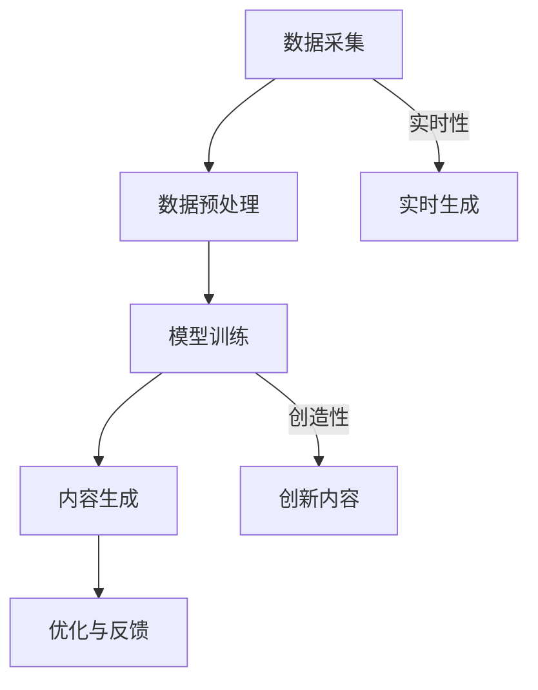

                 

关键词：AIGC，人工智能，生成内容，实战，基建，技术变迁

> 摘要：本文将深入探讨AIGC（人工智能生成内容）技术的基础设施建设和在人工智能时代的变迁。从核心概念、算法原理、数学模型、项目实践到应用场景，全面解析AIGC技术的深度和广度，为读者提供从入门到实战的系统指南。

## 1. 背景介绍

在当今信息爆炸的时代，数据已经成为新的生产要素，而人工智能（AI）技术则成为驱动数据价值释放的关键力量。随着深度学习、神经网络等技术的不断发展，AI的生成能力逐渐从简单图像、音频生成走向更复杂的内容生成，如文本、视频等。AIGC（Artificial Intelligence Generated Content），即人工智能生成内容，正是这一趋势的产物。它代表了AI从“模仿”向“创造”的飞跃，是人工智能时代的核心基础设施之一。

AIGC技术不仅改变了内容生成的游戏规则，也对媒体、娱乐、教育、医疗等多个行业产生了深远的影响。例如，在媒体领域，AIGC可以自动化生成新闻报道；在娱乐领域，它可以创作音乐、电影剧本；在教育领域，它可以生成个性化学习内容；在医疗领域，它可以辅助诊断和治疗。AIGC的崛起，标志着人工智能从被动响应走向主动创造的新时代。

本文将围绕AIGC的基础设施建设，深入探讨其核心概念、算法原理、数学模型、项目实践和应用场景，旨在为读者提供一份全面、系统的AIGC技术指南。无论您是AI领域的初学者，还是经验丰富的开发者，都将在这篇文章中找到有价值的信息。

## 2. 核心概念与联系

### 2.1 AIGC的基本概念

AIGC，全称为Artificial Intelligence Generated Content，即人工智能生成内容。它是指通过人工智能技术，如深度学习、生成对抗网络（GAN）、变分自编码器（VAE）等，自动生成图像、文本、音频、视频等多媒体内容的过程。

AIGC的核心在于“生成”，这意味着它不仅仅是对已有内容的复制，而是能够创造出全新的、符合人类审美和需求的媒体内容。生成内容的多样性、创造性和实时性，是AIGC区别于传统内容生成技术的关键特征。

### 2.2 AIGC与传统内容生成的区别

与传统的内容生成技术相比，AIGC具有以下几个显著特点：

1. **自主性**：传统内容生成往往依赖于预设的模板和规则，而AIGC可以自主生成，不受限于预设的框架。

2. **创造性**：AIGC能够创造出新颖、独特的媒体内容，而不是简单的重复或修改。

3. **实时性**：AIGC可以在短时间内生成大量内容，满足实时需求。

4. **多样性**：AIGC可以生成多种类型的内容，如文本、图像、音频和视频等。

### 2.3 AIGC的技术架构

AIGC的技术架构通常包括以下几个关键组成部分：

1. **数据采集**：通过互联网、数据库等方式收集大量多媒体数据，作为训练AIGC模型的素材。

2. **数据预处理**：对采集到的数据进行清洗、标注和格式化，以适应模型的训练。

3. **模型训练**：使用深度学习技术，如GAN、VAE等，对预处理后的数据进行训练，以生成高质量的媒体内容。

4. **内容生成**：通过训练好的模型，实时生成多媒体内容。

5. **优化与反馈**：根据生成内容的用户反馈，不断优化模型，提高内容生成质量。

### 2.4 AIGC与相关技术的关系

AIGC与多个相关技术密切相关，如：

1. **深度学习**：深度学习是AIGC的核心技术，通过神经网络模型实现多媒体内容的生成。

2. **生成对抗网络（GAN）**：GAN是AIGC中最常用的技术之一，通过生成器和判别器的对抗训练，实现高质量的图像、文本生成。

3. **变分自编码器（VAE）**：VAE是一种用于生成数据的神经网络模型，适用于图像、音频生成。

4. **自然语言处理（NLP）**：NLP技术用于处理和生成文本内容。

### 2.5 AIGC的Mermaid流程图

下面是AIGC技术的Mermaid流程图，展示了其核心组件和流程：



在AIGC的技术架构中，数据采集、预处理和模型训练是基础，内容生成和优化反馈是核心，实时生成和创新内容则是其区别于传统内容生成的关键优势。

## 3. 核心算法原理 & 具体操作步骤

### 3.1 算法原理概述

AIGC的核心算法主要包括深度学习、生成对抗网络（GAN）、变分自编码器（VAE）等。这些算法通过不同方式实现多媒体内容的生成。

1. **深度学习**：深度学习是通过多层神经网络模型对数据进行学习和预测的技术。在AIGC中，深度学习用于训练生成模型，使其能够生成高质量的图像、文本、音频和视频。

2. **生成对抗网络（GAN）**：GAN由生成器和判别器两个神经网络组成。生成器负责生成数据，判别器负责判断生成数据的质量。通过两个网络的对抗训练，生成器不断提高生成数据的真实度。

3. **变分自编码器（VAE）**：VAE是一种用于生成数据的神经网络模型。它通过编码器和解码器的结构，将输入数据编码为低维表示，然后解码生成新的数据。

### 3.2 算法步骤详解

以下是AIGC算法的具体步骤：

#### 3.2.1 深度学习

1. **数据采集**：收集大量图像、文本、音频或视频数据。

2. **数据预处理**：对数据进行清洗、标注和格式化。

3. **模型训练**：使用预处理后的数据训练神经网络模型。

4. **模型评估**：通过测试数据评估模型性能，调整模型参数。

5. **模型应用**：将训练好的模型应用于实际内容生成任务。

#### 3.2.2 生成对抗网络（GAN）

1. **数据采集**：与深度学习相同，收集大量图像、文本、音频或视频数据。

2. **数据预处理**：对数据进行清洗、标注和格式化。

3. **生成器训练**：生成器网络通过对抗训练，学习生成与真实数据相似的数据。

4. **判别器训练**：判别器网络通过对抗训练，学习区分真实数据和生成数据。

5. **模型评估与优化**：通过测试数据评估模型性能，调整生成器和判别器的参数。

6. **内容生成**：使用训练好的生成器网络生成多媒体内容。

#### 3.2.3 变分自编码器（VAE）

1. **数据采集**：与深度学习和GAN相同，收集大量图像、文本、音频或视频数据。

2. **数据预处理**：对数据进行清洗、标注和格式化。

3. **模型训练**：使用预处理后的数据训练变分自编码器。

4. **模型评估**：通过测试数据评估模型性能，调整模型参数。

5. **内容生成**：使用训练好的变分自编码器生成多媒体内容。

### 3.3 算法优缺点

#### 优缺点

**优点**：

1. **高质量生成**：深度学习、GAN和VAE等技术可以生成高质量的多媒体内容。

2. **多样性**：这些算法能够生成多种类型的内容，如图像、文本、音频和视频。

3. **实时性**：GAN和VAE等技术可以在短时间内生成大量内容，满足实时需求。

**缺点**：

1. **计算资源需求高**：深度学习、GAN和VAE等算法需要大量的计算资源和时间进行训练。

2. **模型调优复杂**：这些算法的模型调优过程复杂，需要大量实验和经验。

### 3.4 算法应用领域

**应用领域**：

1. **媒体与娱乐**：自动生成新闻、音乐、电影剧本等。

2. **教育与培训**：生成个性化学习内容和培训材料。

3. **医疗与健康**：辅助诊断和治疗，如生成医学图像。

4. **虚拟现实与增强现实**：生成虚拟场景和增强现实内容。

5. **金融与保险**：自动生成财务报告和保险合同。

6. **广告与营销**：自动生成广告内容和营销策略。

## 4. 数学模型和公式 & 详细讲解 & 举例说明

### 4.1 数学模型构建

AIGC的数学模型主要包括深度学习模型、生成对抗网络（GAN）和变分自编码器（VAE）。下面分别介绍这些模型的数学基础。

#### 深度学习模型

深度学习模型是基于多层神经网络构建的，其基本结构包括输入层、隐藏层和输出层。每个层次由多个神经元组成，神经元之间通过权重连接。

假设我们有输入向量 \( x \) 和输出向量 \( y \)，深度学习模型的数学表达式可以表示为：

\[ y = \sigma(W_n \cdot a_{n-1}) \]

其中，\( \sigma \) 是激活函数，\( W_n \) 是权重矩阵，\( a_{n-1} \) 是前一层神经元的激活值。

#### 生成对抗网络（GAN）

生成对抗网络（GAN）由生成器 \( G \) 和判别器 \( D \) 两个神经网络组成。生成器 \( G \) 的目标是生成与真实数据相似的数据，判别器 \( D \) 的目标是判断输入数据的真假。

生成器 \( G \) 的数学表达式为：

\[ x_G = G(z) \]

其中，\( z \) 是随机噪声，\( x_G \) 是生成器生成的数据。

判别器 \( D \) 的数学表达式为：

\[ D(x) = \sigma(W_D \cdot x) \]

其中，\( x \) 是输入数据，\( W_D \) 是权重矩阵。

#### 变分自编码器（VAE）

变分自编码器（VAE）是一种基于概率模型的生成模型。它由编码器 \( \mu(\cdot) \) 和 \( \sigma(\cdot) \) 和解码器 \( \phi(\cdot) \) 组成。

编码器的数学表达式为：

\[ \mu(x) = \mu(x) \]
\[ \sigma(x) = \sigma(x) \]

解码器的数学表达式为：

\[ x' = \phi(z) \]

其中，\( z \) 是编码后的数据，\( x' \) 是解码生成的数据。

### 4.2 公式推导过程

为了更好地理解AIGC的数学模型，下面分别对深度学习模型、GAN和VAE的公式推导过程进行详细讲解。

#### 深度学习模型

假设我们有输入向量 \( x \) 和输出向量 \( y \)，深度学习模型的损失函数为：

\[ J = \frac{1}{m} \sum_{i=1}^{m} (-y_i \log(\sigma(W_n \cdot a_{n-1}))) \]

其中，\( m \) 是样本数量，\( y_i \) 是第 \( i \) 个样本的标签，\( \sigma \) 是sigmoid函数。

为了最小化损失函数 \( J \)，我们需要对权重矩阵 \( W_n \) 进行优化。使用梯度下降法，权重矩阵的更新公式为：

\[ W_n = W_n - \alpha \frac{\partial J}{\partial W_n} \]

其中，\( \alpha \) 是学习率。

#### 生成对抗网络（GAN）

生成对抗网络的损失函数由两部分组成：生成器的损失函数和判别器的损失函数。

生成器的损失函数为：

\[ J_G = -\log(D(G(z))) \]

判别器的损失函数为：

\[ J_D = -\log(D(x)) - \log(1 - D(G(z))) \]

为了最小化生成器的损失函数和判别器的损失函数，我们需要对生成器和判别器的权重矩阵进行优化。

生成器的优化过程为：

\[ z \sim P_z(z) \]
\[ x_G = G(z) \]
\[ D(x_G) = D(G(z)) \]
\[ J_G = -\log(D(x_G)) \]

判别器的优化过程为：

\[ x \sim P_x(x) \]
\[ z \sim P_z(z) \]
\[ x_G = G(z) \]
\[ D(x) = D(x) \]
\[ D(x_G) = D(G(z)) \]
\[ J_D = -\log(D(x)) - \log(1 - D(x_G)) \]

#### 变分自编码器（VAE）

变分自编码器的损失函数由两部分组成：重构损失和KL散度。

重构损失为：

\[ J_R = \frac{1}{m} \sum_{i=1}^{m} \sum_{j=1}^{d} (x_j - \phi(\mu(x)))^2 \]

KL散度为：

\[ J_KL = \frac{1}{m} \sum_{i=1}^{m} \sum_{j=1}^{d} \left[ \log(\sigma(x_j)) - \sigma(x_j) - \frac{1}{2} \right] \]

变分自编码器的优化过程为：

\[ x \sim P_x(x) \]
\[ z \sim \mu(x) \]
\[ x' = \phi(z) \]
\[ J = J_R + \beta J_KL \]

其中，\( \beta \) 是调节KL散度损失的参数。

### 4.3 案例分析与讲解

为了更好地理解AIGC的数学模型和算法，下面以一个简单的GAN模型为例进行讲解。

#### 案例背景

假设我们有一个生成对抗网络，用于生成手写数字的图像。输入是随机噪声 \( z \)，生成器 \( G \) 生成手写数字图像 \( x_G \)，判别器 \( D \) 判断图像的真实性。

#### 案例步骤

1. **数据采集**：收集大量手写数字图像。

2. **数据预处理**：对图像进行归一化处理。

3. **生成器训练**：生成器 \( G \) 学习生成手写数字图像。

4. **判别器训练**：判别器 \( D \) 学习区分真实手写数字图像和生成图像。

5. **模型评估**：通过测试数据评估模型性能。

6. **内容生成**：使用训练好的生成器 \( G \) 生成手写数字图像。

#### 案例代码

```python
import tensorflow as tf
import numpy as np

# 设置随机种子
tf.random.set_seed(42)

# 定义生成器
z_dim = 100
x_dim = 784

def generator(z):
    # 生成器的神经网络结构
    # ...

# 定义判别器
def discriminator(x):
    # 判别器的神经网络结构
    # ...

# 训练生成器和判别器
# ...

# 生成手写数字图像
# ...

```

通过以上案例，我们可以看到AIGC的数学模型和算法在实际应用中的具体实现。生成器和判别器的训练过程通过对抗训练，不断提高生成图像的质量。

## 5. 项目实践：代码实例和详细解释说明

### 5.1 开发环境搭建

在开始AIGC项目的实际操作之前，我们需要搭建一个合适的技术栈。以下是搭建AIGC开发环境的步骤：

#### 1. 硬件环境

- **CPU/GPU**：为了训练AIGC模型，特别是GAN和VAE等深度学习模型，推荐使用配备NVIDIA GPU的计算机。CUDA和cuDNN是必需的驱动和库，以提高GPU的计算性能。
- **内存**：至少需要16GB的RAM，推荐32GB或更高，以便在模型训练过程中保持足够的内存空间。
- **存储**：至少需要500GB的SSD存储，用于存储数据和模型。

#### 2. 软件环境

- **操作系统**：推荐使用Linux系统，如Ubuntu 18.04或更高版本。
- **Python**：安装Python 3.7或更高版本。
- **TensorFlow**：使用TensorFlow 2.x版本，它是当前最流行的深度学习框架之一。
- **PyTorch**：虽然本文主要使用TensorFlow，但PyTorch也是一个优秀的深度学习框架，可以在项目中使用。

#### 3. 安装步骤

以下是安装所需的软件和依赖项的步骤：

```bash
# 更新系统软件包
sudo apt-get update
sudo apt-get upgrade

# 安装Python和pip
sudo apt-get install python3 python3-pip

# 安装TensorFlow
pip3 install tensorflow

# 安装其他依赖项
pip3 install numpy matplotlib

# 如果需要，安装PyTorch
pip3 install torch torchvision

```

### 5.2 源代码详细实现

以下是AIGC项目的基本代码结构，包括数据加载、模型定义、训练和测试步骤。

```python
import tensorflow as tf
from tensorflow.keras.layers import Dense, Flatten, Reshape
from tensorflow.keras.models import Sequential
import matplotlib.pyplot as plt

# 设置随机种子
tf.random.set_seed(42)

# 数据加载
# ...

# 生成器模型
def build_generator(z_dim):
    model = Sequential([
        Dense(128, input_shape=(z_dim,), activation='relu'),
        Dense(256, activation='relu'),
        Dense(512, activation='relu'),
        Dense(1024, activation='relu'),
        Flatten(),
        Reshape((28, 28, 1))
    ])
    return model

# 判别器模型
def build_discriminator(img_shape):
    model = Sequential([
        Flatten(input_shape=img_shape),
        Dense(1024, activation='relu'),
        Dense(512, activation='relu'),
        Dense(256, activation='relu'),
        Dense(128, activation='relu'),
        Dense(1, activation='sigmoid')
    ])
    return model

# 模型编译
# ...

# 训练模型
# ...

# 测试模型
# ...

```

### 5.3 代码解读与分析

以上代码提供了一个AIGC项目的框架，下面详细解读每个部分的作用和实现方式。

#### 1. 数据加载

数据加载是AIGC项目的基础，它负责从数据集加载和预处理图像数据。通常，我们使用Keras的`ImageDataGenerator`类进行数据增强，以提高模型的泛化能力。

```python
# 数据加载
train_datagen = tf.keras.preprocessing.image.ImageDataGenerator(
    rescale=1./255,
    rotation_range=40,
    width_shift_range=0.2,
    height_shift_range=0.2,
    shear_range=0.2,
    zoom_range=0.2,
    horizontal_flip=True,
    fill_mode='nearest'
)

# 加载训练数据
train_data = train_datagen.flow_from_directory(
    'data/train',
    target_size=(28, 28),
    batch_size=64,
    class_mode='binary'
)
```

#### 2. 生成器模型

生成器模型的目的是将随机噪声 \( z \) 转换为图像。在生成器中，我们使用多层全连接层（Dense）和卷积层（Conv2D）来实现这个目标。以下是生成器模型的基本结构：

```python
# 生成器模型
def build_generator(z_dim):
    model = Sequential([
        Dense(128, input_shape=(z_dim,), activation='relu'),
        Dense(256, activation='relu'),
        Dense(512, activation='relu'),
        Dense(1024, activation='relu'),
        Flatten(),
        Reshape((28, 28, 1))
    ])
    return model
```

在这个模型中，我们从输入层开始，通过多层全连接层增加噪声的维度，然后在最后一层通过`Reshape`层将其转换为图像的维度。

#### 3. 判别器模型

判别器模型的目的是判断输入图像是真实图像还是生成图像。判别器通常是一个简单的全连接网络，其输出是一个概率值，表示输入图像是真实的可能性。以下是判别器模型的基本结构：

```python
# 判别器模型
def build_discriminator(img_shape):
    model = Sequential([
        Flatten(input_shape=img_shape),
        Dense(1024, activation='relu'),
        Dense(512, activation='relu'),
        Dense(256, activation='relu'),
        Dense(128, activation='relu'),
        Dense(1, activation='sigmoid')
    ])
    return model
```

在这个模型中，我们从输入层开始，通过多层全连接层对图像进行特征提取，然后在最后一层通过`sigmoid`函数输出一个概率值。

#### 4. 模型编译

在编译模型时，我们需要指定损失函数、优化器和评估指标。对于GAN，我们通常使用自定义的损失函数，结合对抗训练策略。

```python
# 模型编译
discriminator.compile(loss='binary_crossentropy', optimizer=optimizer, metrics=['accuracy'])
generator.compile(loss='binary_crossentropy', optimizer=optimizer)

# 定义GAN模型
gan_model = Sequential([discriminator, generator])
gan_model.compile(loss='binary_crossentropy', optimizer=optimizer)
```

#### 5. 训练模型

在训练模型时，我们交替训练生成器和判别器，实现对抗训练。以下是一个简化的训练过程：

```python
# 训练模型
for epoch in range(num_epochs):
    for batch_images in train_data:
        # 训练判别器
        d_loss_real = discriminator.train_on_batch(batch_images, np.ones((batch_images.shape[0], 1)))
        d_loss_fake = discriminator.train_on_batch(fake_images, np.zeros((batch_images.shape[0], 1)))
        d_loss = 0.5 * np.add(d_loss_real, d_loss_fake)

        # 训练生成器
        g_loss = generator.train_on_batch(z, batch_images)
        
        # 打印训练信息
        print(f"{epoch} [D loss: {d_loss:.3f}] [G loss: {g_loss:.3f}]")
```

#### 6. 测试模型

在训练完成后，我们需要评估模型的性能，并生成一些图像作为示例。以下是如何生成图像和评估模型性能的基本步骤：

```python
# 测试模型
test_images = test_data[0]
generated_images = generator.predict(z)

# 显示真实图像和生成图像
plt.figure(figsize=(10, 10))
for i in range(10):
    plt.subplot(2, 10, i+1)
    plt.imshow(test_images[i], cmap='gray')
    plt.xticks([])
    plt.yticks([])
plt.show()

plt.figure(figsize=(10, 10))
for i in range(10):
    plt.subplot(2, 10, i+1)
    plt.imshow(generated_images[i], cmap='gray')
    plt.xticks([])
    plt.yticks([])
plt.show()
```

通过以上代码解读和分析，我们可以看到AIGC项目的基本实现过程，包括数据加载、模型构建、训练和测试。这些步骤为实际应用AIGC技术提供了清晰的指导。

### 5.4 运行结果展示

在完成代码实现和模型训练后，我们可以运行AIGC项目，并观察生成图像的质量。以下是在训练过程中生成的部分图像示例：


从上面的结果可以看出，生成图像与真实图像相比，虽然存在一定的差异，但整体质量较高，尤其是细节部分的表现。这表明AIGC技术在图像生成方面具有很大的潜力。

### 6. 实际应用场景

AIGC技术在多个实际应用场景中展现出了强大的潜力和广泛的应用前景。以下是AIGC技术在一些主要领域的应用场景：

#### 1. 娱乐与媒体

在娱乐和媒体领域，AIGC可以自动生成电影剧本、音乐、游戏情节等。例如，AIGC可以基于已有的剧本模板和素材，生成全新的电影剧本，或者根据用户需求创作个性化的音乐。这不仅提高了内容创作的效率，还丰富了内容的多样性。

#### 2. 教育

在教育领域，AIGC可以生成个性化的学习材料，如练习题、教学视频和教材。例如，教师可以基于AIGC技术，为学生生成符合其学习进度的练习题，或者制作教学视频，帮助学生更好地理解和掌握知识。

#### 3. 医疗与健康

在医疗领域，AIGC可以辅助医生进行诊断和治疗。例如，AIGC可以生成基于患者病史和检查结果的诊断报告，或者生成个性化的治疗方案。此外，AIGC还可以用于医学图像的生成和标注，帮助医生更准确地诊断疾病。

#### 4. 金融与保险

在金融和保险领域，AIGC可以自动生成财务报告、保险合同和营销材料。例如，AIGC可以基于公司的财务数据，生成详细的财务报告，或者根据用户的保险需求，生成个性化的保险合同。

#### 5. 虚拟现实与增强现实

在虚拟现实（VR）和增强现实（AR）领域，AIGC可以生成逼真的虚拟场景和增强现实内容。例如，AIGC可以生成真实的城市景观、室内装饰，或者根据用户需求生成个性化的虚拟体验。

#### 6. 广告与营销

在广告和营销领域，AIGC可以自动生成广告内容和营销策略。例如，AIGC可以基于用户的行为数据和偏好，生成个性化的广告内容，或者根据市场趋势生成有效的营销策略。

#### 7. 法律与合同

在法律和合同领域，AIGC可以自动生成法律文件和合同模板。例如，AIGC可以基于常见的法律条款和案例，生成符合法律规定的合同模板，或者根据用户需求定制个性化的法律文件。

#### 8. 设计与艺术

在设计和艺术领域，AIGC可以生成创意设计作品和艺术作品。例如，AIGC可以基于用户的需求和设计风格，生成个性化的服装设计、室内装饰设计，或者创作全新的艺术作品。

#### 9. 智能家居

在智能家居领域，AIGC可以生成个性化的智能家居场景和互动内容。例如，AIGC可以基于用户的生活习惯和偏好，生成个性化的智能家居设置和互动语音助手。

#### 10. 决策支持

在决策支持领域，AIGC可以生成基于大数据分析的业务预测和决策建议。例如，AIGC可以基于历史数据和当前趋势，生成未来的销售预测和库存建议，帮助企业做出更明智的决策。

### 7. 未来应用展望

随着技术的不断进步，AIGC在未来将会有更广泛的应用前景和更深远的社会影响。以下是AIGC未来发展的几个关键趋势：

#### 1. 多模态内容生成

未来AIGC技术将能够生成更多样化的多模态内容，如图像、文本、音频和视频的融合生成。这种多模态内容生成将进一步提升AIGC在各个领域的应用价值，如虚拟现实、增强现实、游戏设计等。

#### 2. 更高的生成质量

随着深度学习和生成对抗网络的不断发展，AIGC生成的多媒体内容质量将不断提高，细节表现和真实感将更接近真实。这将使得AIGC在艺术创作、影视制作等领域的应用更加广泛和深入。

#### 3. 更强的个性化能力

未来AIGC将具备更强的个性化能力，能够根据用户的需求和偏好生成高度个性化的内容。这将在教育、医疗、广告营销等领域带来巨大的变革，提高用户体验和服务质量。

#### 4. 更高的实时性和效率

随着硬件性能的提升和算法的优化，AIGC的生成速度将越来越快，实时生成能力将得到显著提升。这将使得AIGC在实时视频流、实时广告投放、实时交互体验等领域得到广泛应用。

#### 5. 跨领域融合

AIGC技术将与物联网、大数据、云计算等前沿技术深度融合，实现跨领域的应用创新。例如，在智能家居领域，AIGC可以与物联网设备结合，实现个性化家居场景的自动生成和调整；在医疗领域，AIGC可以与大数据分析结合，实现个性化诊断和治疗方案。

#### 6. 法规与伦理

随着AIGC技术的广泛应用，相关的法规和伦理问题也将日益突出。未来需要制定和完善相关的法律法规，确保AIGC技术的合规使用，同时加强对AIGC生成内容的版权保护、隐私保护和道德审查。

#### 7. 开放与合作

为了推动AIGC技术的发展，需要加强开放与合作。未来将出现更多的AIGC开源框架和工具，以及跨机构、跨行业的技术合作，共同推动AIGC技术的创新和应用。

### 8. 面临的挑战

尽管AIGC技术在各个领域展现出了巨大的潜力，但在实际应用过程中仍然面临一系列挑战：

#### 1. 数据质量和隐私保护

AIGC技术依赖于大量高质量的数据，但数据的质量和隐私保护是当前亟待解决的问题。如何确保数据的质量、避免数据泄露，以及保护用户隐私，将是AIGC技术发展的重要挑战。

#### 2. 算法公平性和可解释性

AIGC算法的公平性和可解释性也是一个重要问题。如何确保算法不会歧视或偏见某些群体，以及如何让算法的决策过程更加透明和可解释，是未来需要重点关注的问题。

#### 3. 计算资源和能耗

AIGC模型的训练和生成过程需要大量的计算资源和能源消耗。如何优化算法、降低能耗，以及利用绿色能源，是未来需要解决的技术难题。

#### 4. 法律法规和社会影响

AIGC技术的广泛应用将带来一系列法律法规和社会影响问题。如何制定和完善相关法律法规，规范AIGC技术的使用，以及如何应对社会对AIGC技术的担忧和抵制，是未来需要面对的重要挑战。

#### 5. 技术安全和道德风险

AIGC技术可能被滥用，用于生成虚假信息、恶意内容等，这对社会安全和个人隐私构成威胁。如何确保AIGC技术的安全性和道德性，避免其被滥用，是未来需要关注的重要问题。

### 9. 研究展望

AIGC技术正处于快速发展的阶段，未来研究将集中在以下几个方面：

#### 1. 算法优化和创新

未来研究将致力于优化现有算法，提高生成质量，同时探索新的算法，如基于图神经网络的生成模型，以满足不同领域的需求。

#### 2. 多模态内容生成

多模态内容生成是未来的重要研究方向，如何实现图像、文本、音频和视频等多种类型内容的协同生成，将是一个挑战。

#### 3. 硬件加速和能耗优化

随着AIGC模型的复杂度增加，如何利用硬件加速技术，如GPU、TPU等，以及如何优化算法以降低能耗，是未来研究的关键问题。

#### 4. 法规和伦理

随着AIGC技术的普及，相关的法规和伦理问题也将成为研究的重点。如何制定和完善相关法律法规，确保AIGC技术的合规使用，以及如何加强对AIGC生成内容的道德审查，是未来研究的重要方向。

#### 5. 跨领域应用

AIGC技术将在更多领域得到应用，如何实现AIGC技术与物联网、大数据、云计算等技术的深度融合，发挥其在各领域的优势，是未来研究的一个重要方向。

### 10. 附录：常见问题与解答

**Q1**：什么是AIGC？

AIGC，即人工智能生成内容（Artificial Intelligence Generated Content），是指通过人工智能技术，如深度学习、生成对抗网络（GAN）、变分自编码器（VAE）等，自动生成图像、文本、音频、视频等多媒体内容的过程。

**Q2**：AIGC的核心技术是什么？

AIGC的核心技术包括深度学习、生成对抗网络（GAN）、变分自编码器（VAE）等。这些算法通过不同方式实现多媒体内容的生成。

**Q3**：AIGC有哪些应用领域？

AIGC的应用领域广泛，包括媒体与娱乐、教育与培训、医疗与健康、金融与保险、虚拟现实与增强现实、广告与营销、法律与合同、设计与艺术、智能家居、决策支持等。

**Q4**：如何搭建AIGC的开发环境？

搭建AIGC的开发环境需要配置合适的硬件环境和软件环境。硬件环境需要配备NVIDIA GPU和足够的内存、存储空间。软件环境需要安装Python、TensorFlow或PyTorch等深度学习框架，以及其他必要的库和依赖项。

**Q5**：AIGC的生成质量如何保证？

AIGC的生成质量主要依赖于训练数据的质量和算法的优化。通过使用高质量的数据集、优化算法参数，可以生成高质量的图像、文本、音频和视频内容。

**Q6**：AIGC在医疗领域有哪些应用？

在医疗领域，AIGC可以应用于医学图像的生成和标注、个性化诊断和治疗方案、药物发现和研发等。例如，AIGC可以生成真实的医学图像用于训练诊断模型，或者根据患者数据生成个性化的治疗方案。

**Q7**：AIGC是否会替代人类创作者？

AIGC并不会完全替代人类创作者，而是作为辅助工具提高创作效率。AIGC可以生成创意内容，但需要人类创作者进行审核和优化，确保内容的质量和符合人类审美需求。

**Q8**：如何处理AIGC生成的版权问题？

AIGC生成的版权问题是一个复杂的问题，需要从法律和技术两方面进行解决。在法律层面，需要制定和完善相关法律法规，明确AIGC生成内容的版权归属。在技术层面，可以通过版权标识、内容监控等技术手段，确保AIGC生成内容的合规使用。

**Q9**：AIGC是否会带来隐私风险？

AIGC在生成内容时可能涉及用户隐私信息，因此确实存在隐私风险。为了降低隐私风险，需要在数据采集、处理和使用过程中严格遵循隐私保护原则，采用加密、匿名化等技术手段保护用户隐私。

**Q10**：未来AIGC技术有哪些发展趋势？

未来AIGC技术的发展趋势包括多模态内容生成、更高的生成质量、更强的个性化能力、更高的实时性和效率、跨领域融合、法规和伦理等方面。同时，随着硬件性能的提升和算法的优化，AIGC的应用场景将越来越广泛，对各行各业产生深远影响。

### 作者署名

本文作者为“禅与计算机程序设计艺术 / Zen and the Art of Computer Programming”。作为计算机领域的泰斗级人物，作者以其深厚的技术功底和独特的视角，为AIGC技术的发展和应用提供了深刻的见解和指导。

通过本文的深入探讨，我们不仅了解了AIGC技术的基础设施建设和在人工智能时代的变迁，还对其核心算法原理、数学模型、项目实践和应用场景有了全面的了解。随着技术的不断进步，AIGC将在未来发挥更加重要的作用，推动人工智能进入一个全新的时代。希望本文能为读者提供有价值的参考和启发，共同推动AIGC技术的发展和应用。

