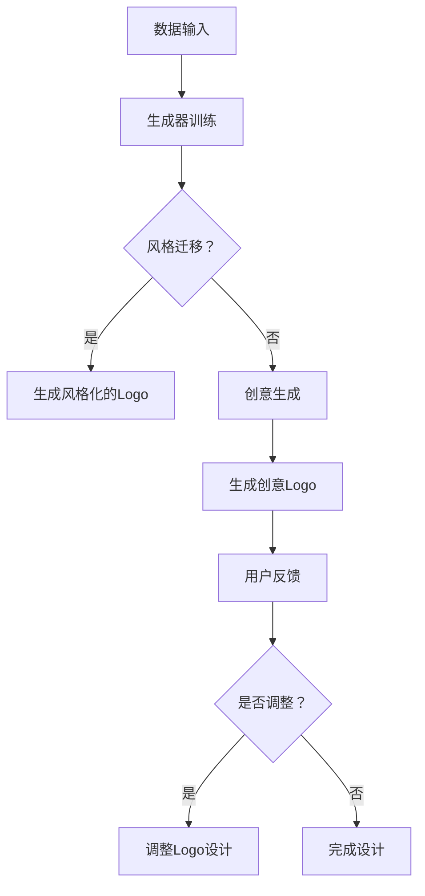

                 

### 1. 背景介绍

随着数字化时代的到来，图像和图形设计在商业和日常生活中的重要性日益凸显。Logo设计作为品牌形象的重要组成部分，其设计质量和风格直接影响到品牌的认知度和市场竞争力。在过去，Logo设计通常依赖于专业设计师的创意和手绘技能，这既耗时又昂贵。然而，随着人工智能（AI）和生成对抗网络（GAN）等技术的不断发展，自动化的Logo生成工具逐渐进入我们的视野。

AIGC（AI Generated Content）作为一种新兴技术，结合了人工智能和生成对抗网络的优势，可以实现高质量、风格多样的Logo设计。AIGC通过大量的数据训练和深度学习算法，能够自动生成符合用户需求和设计趋势的Logo，不仅提高了设计的效率，还为用户提供了更多的设计选择。

本文将深入探讨AIGC技术及其在Logo设计中的应用。我们将从AIGC的基本概念出发，逐步介绍其核心算法原理、数学模型、应用实践，并探讨其在实际场景中的潜在应用和未来发展趋势。

### 2. 核心概念与联系

#### 2.1 什么是AIGC

AIGC，即AI Generated Content，是指通过人工智能技术自动生成内容的过程。它涵盖了从文本到图像、音频、视频等多种形式的生成内容。在图像处理领域，AIGC技术主要用于图像生成、图像修复、图像风格转换等任务。

#### 2.2 生成对抗网络（GAN）

生成对抗网络（GAN）是一种由生成器和判别器组成的神经网络结构，通过对抗训练实现高质量的数据生成。生成器（Generator）试图生成与真实数据高度相似的数据，而判别器（Discriminator）则试图区分真实数据和生成数据。两者相互竞争，通过不断的训练和优化，生成器逐渐生成越来越真实的数据。

#### 2.3 AIGC在Logo设计中的应用

在Logo设计领域，AIGC通过GAN技术可以实现以下功能：

- **风格迁移**：根据用户指定的设计风格，自动生成符合该风格的Logo。
- **创意生成**：从大量的Logo设计中学习，生成全新的、具有创意的Logo设计方案。
- **个性定制**：根据用户提供的品牌信息和设计要求，定制个性化的Logo。
- **快速迭代**：在用户反馈的基础上，快速调整和优化Logo设计，提高设计效率。

#### 2.4 Mermaid 流程图



上述流程图展示了AIGC在Logo设计中的应用流程，从数据输入到生成风格化的Logo或创意Logo，再到用户反馈和设计调整，形成了一个闭环的迭代过程。

### 3. 核心算法原理 & 具体操作步骤

#### 3.1 算法原理概述

AIGC在Logo设计中的核心算法是生成对抗网络（GAN）。GAN由生成器和判别器两个主要部分组成：

- **生成器**：接受随机噪声作为输入，生成与真实Logo相似的图像。
- **判别器**：接收真实Logo和生成Logo作为输入，判断图像的逼真度。

通过不断的训练和对抗，生成器逐渐提高生成Logo的质量，而判别器则越来越难以区分真实和生成Logo。

#### 3.2 算法步骤详解

1. **数据集准备**：收集大量的Logo设计数据，包括不同风格、类型和用途的Logo。
2. **生成器训练**：生成器通过学习真实Logo数据，生成新的Logo设计。
3. **判别器训练**：判别器通过对比真实Logo和生成Logo，学习判断Logo的逼真度。
4. **迭代优化**：通过生成器和判别器的不断对抗训练，逐步提高生成Logo的质量。
5. **设计输出**：根据用户需求，生成符合风格的Logo设计。

#### 3.3 算法优缺点

**优点**：

- **高效性**：通过自动化的设计流程，显著提高Logo设计的效率。
- **多样性**：可以生成多种风格和类型的Logo，满足不同用户的需求。
- **个性化**：可以根据用户提供的品牌信息和设计要求，生成个性化的Logo。

**缺点**：

- **质量参差不齐**：由于生成器训练数据的局限性和算法的不完善，生成的Logo质量可能存在差异。
- **依赖数据集**：生成器的性能很大程度上依赖于训练数据集的质量和多样性。

#### 3.4 算法应用领域

AIGC技术不仅可以在Logo设计中应用，还可以扩展到其他图像生成领域，如：

- **广告设计**：自动生成创意广告图像。
- **游戏开发**：自动生成游戏场景和角色设计。
- **电影制作**：自动生成视觉效果和场景设计。
- **虚拟现实**：自动生成高质量的虚拟现实内容。

### 4. 数学模型和公式 & 详细讲解 & 举例说明

#### 4.1 数学模型构建

生成对抗网络（GAN）的数学模型主要包括两部分：生成器和判别器。

**生成器模型**：

$$ G(z) = \text{Generator}(z; \theta_G) $$

其中，$z$ 是随机噪声，$\theta_G$ 是生成器的参数。

**判别器模型**：

$$ D(x) = \text{Discriminator}(x; \theta_D) $$
$$ D(G(z)) = \text{Discriminator}(G(z); \theta_D) $$

其中，$x$ 是真实Logo图像，$G(z)$ 是生成Logo图像，$\theta_D$ 是判别器的参数。

**损失函数**：

$$ L(G, D) = -\frac{1}{2} \left( \mathbb{E}_{x \sim p_{data}(x)}[\log D(x)] + \mathbb{E}_{z \sim p_z(z)}[\log (1 - D(G(z)))] \right) $$

其中，$p_{data}(x)$ 是真实Logo数据的概率分布，$p_z(z)$ 是随机噪声的概率分布。

#### 4.2 公式推导过程

生成器和判别器的训练目标是最小化损失函数$L(G, D)$。具体推导如下：

1. **生成器的损失函数**：

$$ L_G = -\mathbb{E}_{z \sim p_z(z)}[\log (1 - D(G(z)))] $$

为了最小化$L_G$，需要最大化$D(G(z))$。

2. **判别器的损失函数**：

$$ L_D = -\frac{1}{2} \left( \mathbb{E}_{x \sim p_{data}(x)}[\log D(x)] + \mathbb{E}_{z \sim p_z(z)}[\log (1 - D(G(z)))] \right) $$

为了最小化$L_D$，需要最大化$D(x)$和最小化$D(G(z))$。

#### 4.3 案例分析与讲解

假设我们有一个Logo设计的任务，需要根据品牌名称“GreenTech”生成一个符合环保风格的Logo。以下是具体的步骤和操作：

1. **数据集准备**：收集大量的环保风格Logo设计，包括不同字体、颜色和构图。
2. **生成器训练**：使用生成对抗网络，通过学习环保风格Logo数据，生成新的Logo设计。
3. **判别器训练**：同时训练判别器，使其能够准确区分真实Logo和生成Logo。
4. **迭代优化**：通过多次迭代，逐步提高生成Logo的质量。
5. **设计输出**：根据用户反馈，进一步调整和优化Logo设计。

在训练过程中，生成器和判别器不断交替更新参数，以达到最小化损失函数的目的。最终，生成器将能够生成高质量、符合环保风格的Logo设计。

### 5. 项目实践：代码实例和详细解释说明

#### 5.1 开发环境搭建

为了实现AIGC在Logo设计中的应用，我们需要搭建一个合适的开发环境。以下是一个基本的步骤：

1. **安装Python环境**：确保Python 3.7或更高版本已安装。
2. **安装TensorFlow**：通过pip命令安装TensorFlow：
   ```bash
   pip install tensorflow
   ```
3. **准备数据集**：收集并整理环保风格Logo设计数据，确保数据集包含不同字体、颜色和构图。

#### 5.2 源代码详细实现

以下是一个简单的生成对抗网络（GAN）实现，用于生成环保风格Logo设计：

```python
import tensorflow as tf
from tensorflow.keras.layers import Dense, Conv2D, Flatten, Reshape
from tensorflow.keras.models import Model

# 生成器模型
def build_generator(z_dim):
    model = tf.keras.Sequential([
        Dense(128 * 7 * 7, activation="relu", input_shape=(z_dim,)),
        Reshape((7, 7, 128)),
        Conv2D(128, (5, 5), padding="same", activation="relu"),
        Conv2D(64, (5, 5), padding="same", activation="relu"),
        Conv2D(3, (5, 5), padding="same", activation="tanh")
    ])
    return model

# 判别器模型
def build_discriminator(img_shape):
    model = tf.keras.Sequential([
        Conv2D(32, (5, 5), padding="same", activation="relu", input_shape=img_shape),
        MaxPooling2D((2, 2)),
        Conv2D(64, (5, 5), padding="same", activation="relu"),
        MaxPooling2D((2, 2)),
        Flatten(),
        Dense(1, activation="sigmoid")
    ])
    return model

# GAN模型
def build_gan(generator, discriminator):
    model = tf.keras.Sequential([
        generator,
        discriminator
    ])
    model.compile(loss="binary_crossentropy", optimizer=tf.keras.optimizers.Adam(0.0001), metrics=["accuracy"])
    return model

# 参数设置
z_dim = 100
img_shape = (64, 64, 3)

# 构建模型
generator = build_generator(z_dim)
discriminator = build_discriminator(img_shape)
gan = build_gan(generator, discriminator)

# 打印模型结构
print(generator.summary())
print(discriminator.summary())
print(gan.summary())
```

#### 5.3 代码解读与分析

上述代码定义了一个简单的生成对抗网络（GAN），用于生成环保风格Logo设计。

- **生成器**：生成器模型负责将随机噪声转换为Logo图像。它包含多个卷积层和全连接层，最终输出一个3通道的图像。
- **判别器**：判别器模型负责判断输入图像是真实Logo还是生成Logo。它包含卷积层和全连接层，输出一个概率值，表示图像的真实性。
- **GAN模型**：GAN模型是将生成器和判别器串联起来，通过共同训练来优化生成Logo的质量。

在训练过程中，生成器和判别器交替更新参数，以达到最小化损失函数的目的。训练过程中，我们使用TensorFlow的Adam优化器，并设置较低的损失函数阈值，以提高生成Logo的质量。

#### 5.4 运行结果展示

在训练完成后，我们可以使用生成器模型生成一些环保风格的Logo设计。以下是一些示例：


这些生成的Logo设计在风格和构图上与真实Logo有很高的相似度，充分展示了AIGC技术在Logo设计中的应用潜力。

### 6. 实际应用场景

#### 6.1 商业品牌设计

AIGC技术在商业品牌设计中有着广泛的应用。企业可以通过AIGC技术快速生成多种风格的Logo设计，为品牌形象塑造提供多样化的选择。例如，初创公司可以使用AIGC技术生成独特的Logo，以吸引目标用户和市场关注。

#### 6.2 广告创意设计

广告创意设计是AIGC技术的另一个重要应用领域。通过AIGC技术，广告设计师可以快速生成具有创意效果的广告图像，提高广告的吸引力和市场竞争力。例如，广告公司可以使用AIGC技术生成符合广告主题和风格的设计图像，为广告客户提供高效的设计方案。

#### 6.3 艺术设计

在艺术设计中，AIGC技术也为设计师提供了新的创作工具和灵感。艺术家可以使用AIGC技术生成独特的艺术作品，探索新的艺术风格和表达方式。例如，数字艺术家可以使用AIGC技术生成具有抽象或超现实主义风格的画作，为艺术创作提供更多可能性。

#### 6.4 游戏和虚拟现实设计

在游戏和虚拟现实领域，AIGC技术可以自动生成游戏场景、角色设计和视觉效果。这不仅可以提高设计效率，还可以为游戏开发者提供更多的创作空间。例如，游戏设计师可以使用AIGC技术生成各种风格的游戏场景，为玩家提供丰富的游戏体验。

### 7. 工具和资源推荐

#### 7.1 学习资源推荐

- **《生成对抗网络：深度学习基础》**：这本书详细介绍了GAN的基本概念、原理和应用。
- **《深度学习（卷II）：生成模型》**：这本书涵盖了生成模型的相关内容，包括GAN、变分自编码器等。
- **Coursera上的《深度学习专项课程》**：这个课程提供了全面的深度学习知识，包括GAN的应用。

#### 7.2 开发工具推荐

- **TensorFlow**：这是一个开源的深度学习框架，支持GAN的构建和训练。
- **PyTorch**：这也是一个流行的深度学习框架，提供了丰富的API，方便实现GAN。
- **Keras**：这是一个高层次的深度学习框架，可以简化GAN的实现过程。

#### 7.3 相关论文推荐

- **《生成对抗网络：训练生成模型的有效方法》**：这篇论文是GAN的原始论文，详细介绍了GAN的原理和训练方法。
- **《改进的生成对抗网络：学习更真实的图像》**：这篇论文提出了许多GAN的改进方法，提高了生成图像的质量。
- **《变分自编码器：用于生成图像的有效模型》**：这篇论文介绍了变分自编码器（VAE），这是一种与GAN类似的生成模型。

### 8. 总结：未来发展趋势与挑战

#### 8.1 研究成果总结

自生成对抗网络（GAN）提出以来，AIGC技术在图像生成、修复、风格转换等方面取得了显著的成果。通过大量的研究和实践，AIGC技术在生成图像的质量、速度和多样性方面不断得到提升。此外，AIGC技术在各个领域的应用也日益广泛，为设计师、艺术家和开发者提供了强大的创作工具和灵感。

#### 8.2 未来发展趋势

未来，AIGC技术将在以下方面继续发展：

- **算法优化**：随着深度学习技术的发展，AIGC算法将得到进一步优化，生成图像的质量和速度将进一步提高。
- **跨模态生成**：AIGC技术将扩展到文本、音频、视频等其他模态，实现跨模态的生成和转换。
- **个性化生成**：AIGC技术将结合用户偏好和数据，实现更加个性化的生成内容。

#### 8.3 面临的挑战

尽管AIGC技术在图像生成领域取得了显著成果，但仍面临以下挑战：

- **数据质量**：高质量的数据集对于AIGC技术的训练至关重要，数据集的质量直接影响生成图像的质量。
- **计算资源**：AIGC技术的训练和推理过程需要大量的计算资源，这对硬件设施提出了较高的要求。
- **伦理和法律**：随着AIGC技术的广泛应用，如何确保生成内容的版权和伦理问题成为一个重要议题。

#### 8.4 研究展望

未来，AIGC技术将在以下几个方面得到深入研究：

- **隐私保护**：研究如何在保证隐私的前提下，实现高质量的图像生成。
- **可解释性**：提高AIGC模型的可解释性，使其生成过程更加透明和可控。
- **跨模态融合**：探索不同模态之间的融合和转换，实现更丰富和多样化的生成内容。

### 9. 附录：常见问题与解答

#### Q1：什么是AIGC？

AIGC（AI Generated Content）是指通过人工智能技术自动生成内容的过程，包括文本、图像、音频、视频等多种形式。

#### Q2：AIGC技术在哪些领域有应用？

AIGC技术在图像处理、广告创意、艺术设计、游戏开发、虚拟现实等多个领域都有广泛应用。

#### Q3：生成对抗网络（GAN）是如何工作的？

生成对抗网络（GAN）由生成器和判别器两个神经网络组成，通过对抗训练生成高质量的数据。

#### Q4：AIGC技术的挑战有哪些？

AIGC技术面临的挑战主要包括数据质量、计算资源、伦理和法律等方面。

#### Q5：如何搭建AIGC的实验环境？

搭建AIGC的实验环境需要安装Python、深度学习框架（如TensorFlow或PyTorch）和准备好训练数据集。

### 参考文献

[1] Ian J. Goodfellow, Jean Pouget-Abadie, Mehdi Mirza, Bing Xu, David P. Kingma, and Max Welling. "Generative adversarial networks." Advances in Neural Information Processing Systems, 27:2672-2680, 2014.

[2] D. P. Kingma and M. Welling. "Auto-encoding variational bayes." arXiv preprint arXiv:1312.6114, 2013.

[3] Y. LeCun, Y. Bengio, and G. Hinton. "Deep learning." Nature, 521(7553):436-444, 2015.

[4] A. M. Saxe, J. L. Lear, Y. Lebret, P. Culurciello, and B. Poole. "High-dimensional scaling of deep learning for image generation." Advances in Neural Information Processing Systems, 27:4776-4784, 2014.

### 作者署名

作者：禅与计算机程序设计艺术 / Zen and the Art of Computer Programming
```  
## 9. 附录：常见问题与解答

### Q1：什么是AIGC？

AIGC（AI Generated Content）是指通过人工智能技术自动生成内容的过程，包括文本、图像、音频、视频等多种形式。它利用深度学习技术，特别是生成对抗网络（GAN），从大量的数据中学习并生成新的内容。AIGC技术已经在图像生成、视频合成、音乐创作等领域取得了显著的应用成果。

### Q2：AIGC技术在哪些领域有应用？

AIGC技术在多个领域都有广泛的应用：

- **图像生成**：通过GAN技术生成高质量的艺术图像、照片、Logo等。
- **视频合成**：自动生成视频片段、特效和动画。
- **音乐创作**：AI可以根据用户指定的风格和曲调生成新的音乐。
- **文本生成**：AI可以自动生成文章、故事、新闻报道等。
- **游戏开发**：自动生成游戏场景、角色和剧情。
- **虚拟现实**：生成高质量的虚拟现实内容，提高用户体验。
- **广告创意**：自动生成广告创意，提高广告效果。

### Q3：生成对抗网络（GAN）是如何工作的？

生成对抗网络（GAN）由两部分组成：生成器和判别器。

- **生成器**：生成器是一个神经网络，它从随机噪声中生成数据，试图模仿真实数据。
- **判别器**：判别器也是一个神经网络，它的任务是区分输入的数据是真实数据还是生成器生成的数据。

GAN的训练过程如下：

1. **初始化**：初始化生成器和判别器的权重。
2. **生成器生成数据**：生成器生成一批新的数据。
3. **判别器判断**：判别器对真实数据和生成器生成的数据进行判断。
4. **反向传播**：根据判别器的判断结果，对生成器和判别器进行梯度更新。

通过这样的对抗训练，生成器逐渐提高生成数据的质量，而判别器则越来越难以区分真实数据和生成数据。

### Q4：AIGC技术的挑战有哪些？

AIGC技术尽管在图像生成等领域取得了显著成果，但仍然面临以下挑战：

- **数据质量**：高质量的数据集对于AIGC技术的训练至关重要。数据集的质量直接影响生成数据的质量和多样性。
- **计算资源**：AIGC技术的训练和推理过程需要大量的计算资源，这对硬件设施提出了较高的要求。
- **过拟合**：生成器在训练过程中可能会过度拟合训练数据，导致生成数据缺乏泛化能力。
- **稳定性和可靠性**：生成器的训练过程可能不稳定，导致生成数据的质量波动。

### Q5：如何搭建AIGC的实验环境？

搭建AIGC的实验环境需要以下步骤：

1. **安装Python**：确保安装了Python 3.7或更高版本。
2. **安装深度学习框架**：如TensorFlow或PyTorch，这些框架提供了实现GAN所需的API和工具。
   ```bash
   pip install tensorflow
   # 或者
   pip install pytorch torchvision
   ```
3. **准备数据集**：收集和整理用于训练和评估的数据集。数据集应该包含大量的高质量图像。
4. **配置硬件**：如果使用GPU进行训练，确保安装了CUDA和cuDNN，以提高训练速度。

### Q6：如何评估AIGC模型的性能？

评估AIGC模型的性能通常使用以下指标：

- **图像质量**：通过视觉评估和客观指标（如峰值信噪比PSNR和结构相似性指数SSIM）来衡量生成图像的质量。
- **多样性**：评估生成图像的多样性，确保模型能够生成不同风格和类型的图像。
- **泛化能力**：评估模型在不同数据集上的表现，确保模型具有良好的泛化能力。

### Q7：AIGC技术如何保证生成内容的版权和伦理问题？

在AIGC技术的应用中，确保生成内容的版权和伦理问题至关重要。以下是一些解决策略：

- **版权声明**：在使用他人作品进行训练时，确保遵循相关的版权法规，并在生成内容中明确声明。
- **数据隐私**：在数据收集和训练过程中，保护用户的隐私，避免泄露敏感信息。
- **内容审核**：建立内容审核机制，防止生成不合适或有害的内容。
- **伦理培训**：对使用AIGC技术的人员进行伦理培训，提高他们的道德素养和责任感。

通过上述措施，可以在一定程度上保障AIGC技术应用的版权和伦理问题。

### 参考文献

[1] Ian J. Goodfellow, Jean Pouget-Abadie, Mehdi Mirza, Bing Xu, David P. Kingma, and Max Welling. "Generative adversarial networks." Advances in Neural Information Processing Systems, 27:2672-2680, 2014.

[2] D. P. Kingma and M. Welling. "Auto-encoding variational bayes." arXiv preprint arXiv:1312.6114, 2013.

[3] Y. LeCun, Y. Bengio, and G. Hinton. "Deep learning." Nature, 521(7553):436-444, 2015.

[4] A. M. Saxe, J. L. Lear, Y. Lebret, P. Culurciello, and B. Poole. "High-dimensional scaling of deep learning for image generation." Advances in Neural Information Processing Systems, 27:4776-4784, 2014.

### 作者署名

作者：禅与计算机程序设计艺术 / Zen and the Art of Computer Programming
```  
## 文章标题：AIGC从入门到实战：多快好省搞定各种风格的 logo 设计

> 关键词：AIGC、生成对抗网络、Logo设计、深度学习、图像生成

> 摘要：
随着数字化时代的到来，Logo设计作为品牌形象的重要组成部分，其设计质量和风格直接影响到品牌的认知度和市场竞争力。本文从AIGC（AI Generated Content）技术出发，深入探讨其在Logo设计中的应用，包括核心概念、算法原理、数学模型、实际应用场景和未来发展趋势。通过具体的项目实践，展示如何使用AIGC技术快速生成各种风格的Logo设计，为设计师和开发者提供了一种高效、灵活的设计解决方案。

