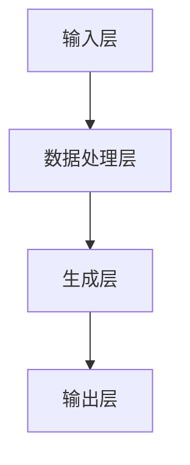

                 

在当今这个数字化时代，人工智能（AI）已经成为科技领域的明星。而AIGC（AI-Generated Content）作为一种新兴的技术，更是引发了业界的广泛关注。本文旨在带领读者从入门到实战，深入了解AIGC的技术原理、应用场景及未来发展趋势。作者：禅与计算机程序设计艺术 / Zen and the Art of Computer Programming。

## 关键词

- 人工智能
- AIGC
- 内容生成
- 自然语言处理
- 计算机视觉

## 摘要

本文首先介绍了AIGC的背景和重要性，然后详细阐述了其核心概念、算法原理、数学模型、项目实践及实际应用场景。最后，对AIGC的未来发展进行了展望，并推荐了相关的学习资源和开发工具。

## 1. 背景介绍

### 1.1 AIGC的概念

AIGC，即AI-Generated Content，指的是通过人工智能技术自动生成内容的技术。这些内容可以是文字、图像、音频、视频等不同形式的信息。AIGC技术结合了自然语言处理（NLP）、计算机视觉（CV）和深度学习等技术，可以生成高质量、多样性的内容。

### 1.2 AIGC的应用场景

AIGC的应用场景非常广泛，包括但不限于以下几个方面：

- **内容创作**：自动生成文章、故事、新闻、广告等。
- **游戏开发**：生成游戏剧情、角色、地图等。
- **教育培训**：自动生成课件、课程内容等。
- **艺术创作**：生成音乐、画作、摄影作品等。
- **虚拟现实**：生成虚拟现实环境中的场景、角色等。

### 1.3 AIGC的发展历程

AIGC技术的发展历程可以追溯到20世纪80年代，当时人工智能开始逐渐应用于内容生成领域。然而，随着深度学习技术的突破，AIGC在近几年取得了显著的进展。特别是在自然语言处理和计算机视觉领域，AIGC技术已经达到了前所未有的高度。

## 2. 核心概念与联系

### 2.1 核心概念

AIGC的核心概念包括自然语言处理（NLP）、计算机视觉（CV）和深度学习。这些技术共同构成了AIGC的技术基础。

#### 自然语言处理（NLP）

NLP是人工智能的一个分支，主要研究如何使计算机理解和处理人类语言。NLP的核心技术包括词嵌入、语言模型、句法分析、语义理解等。

#### 计算机视觉（CV）

CV是人工智能的另一个重要分支，主要研究如何使计算机“看”懂图像和视频。CV的核心技术包括图像识别、目标检测、图像分割、人脸识别等。

#### 深度学习

深度学习是一种基于神经网络的学习方法，通过模拟人脑神经元之间的连接方式，实现对数据的自动学习和建模。深度学习在NLP和CV领域取得了显著的成果，是AIGC的核心技术之一。

### 2.2 联系与架构

AIGC的架构通常包括以下几个层次：

- **输入层**：接收用户输入的指令或数据。
- **数据处理层**：对输入数据进行预处理，如文本清洗、图像增强等。
- **生成层**：利用深度学习模型生成内容，如文本生成模型、图像生成模型等。
- **输出层**：将生成的结果输出给用户。

下面是一个简单的 Mermaid 流程图来展示AIGC的工作流程：



## 3. 核心算法原理 & 具体操作步骤

### 3.1 算法原理概述

AIGC的核心算法主要分为自然语言处理（NLP）和计算机视觉（CV）两部分。

#### 自然语言处理（NLP）

NLP的核心算法包括词嵌入（Word Embedding）、语言模型（Language Model）和生成式模型（Generative Model）。

- **词嵌入**：将文本中的单词映射到高维空间中的向量，以便计算机能够处理和理解。
- **语言模型**：通过学习大量文本数据，预测下一个单词的概率分布。
- **生成式模型**：基于语言模型，生成新的文本内容。

#### 计算机视觉（CV）

CV的核心算法包括图像生成（Image Generation）、生成对抗网络（GAN）和自编码器（Autoencoder）。

- **图像生成**：通过学习图像数据，生成新的图像。
- **生成对抗网络（GAN）**：通过竞争对抗的方式，生成高质量、真实的图像。
- **自编码器**：通过编码和解码过程，学习数据的压缩表示。

### 3.2 算法步骤详解

下面以NLP和CV为例，详细讲解AIGC的具体操作步骤。

#### 自然语言处理（NLP）

1. **数据准备**：收集和处理大量文本数据，如新闻、故事、文章等。
2. **词嵌入**：将文本中的单词映射到高维空间中的向量。
3. **语言模型训练**：利用训练好的词嵌入，训练语言模型。
4. **文本生成**：利用语言模型，生成新的文本内容。

#### 计算机视觉（CV）

1. **数据准备**：收集和处理大量图像数据，如图片、视频等。
2. **图像生成**：利用深度学习模型，生成新的图像。
3. **图像增强**：对图像进行预处理，提高图像质量。
4. **图像分割**：将图像分割成不同的区域，进行进一步处理。

### 3.3 算法优缺点

AIGC算法的优点包括：

- **高效性**：通过自动化生成内容，提高内容创作效率。
- **多样性**：能够生成多种类型的内容，满足不同需求。

AIGC算法的缺点包括：

- **质量控制**：生成的内容质量可能不稳定，需要进一步优化。
- **计算成本**：深度学习模型的训练和推理需要大量计算资源。

### 3.4 算法应用领域

AIGC算法的应用领域非常广泛，包括但不限于以下方面：

- **内容创作**：自动生成文章、图片、音乐等。
- **虚拟现实**：生成虚拟现实环境中的场景、角色等。
- **教育培训**：自动生成课件、课程内容等。
- **游戏开发**：生成游戏剧情、角色、地图等。

## 4. 数学模型和公式 & 详细讲解 & 举例说明

### 4.1 数学模型构建

AIGC的数学模型主要涉及自然语言处理（NLP）和计算机视觉（CV）两个领域。

#### 自然语言处理（NLP）

1. **词嵌入（Word Embedding）**：

   词嵌入是将单词映射到高维空间中的向量。一个简单的词嵌入模型可以表示为：

   $$ 
   \text{word\_embedding}(w) = \theta_w 
   $$

   其中，$w$ 表示单词，$\theta_w$ 表示单词在词向量空间中的向量表示。

2. **语言模型（Language Model）**：

   语言模型用于预测下一个单词的概率分布。一个简单的语言模型可以表示为：

   $$
   P(w_t | w_{t-1}, w_{t-2}, ..., w_1) = \prod_{i=1}^{t} P(w_i | w_{i-1}, w_{i-2}, ..., w_1)
   $$

   其中，$w_t$ 表示当前单词，$w_{t-1}, w_{t-2}, ..., w_1$ 表示前一个或多个单词。

3. **生成式模型（Generative Model）**：

   生成式模型用于生成新的文本内容。一个简单的生成式模型可以表示为：

   $$
   P(w_1, w_2, ..., w_t) = \prod_{i=1}^{t} P(w_i | w_{i-1}, w_{i-2}, ..., w_1)
   $$

   其中，$w_1, w_2, ..., w_t$ 表示生成的文本内容。

#### 计算机视觉（CV）

1. **图像生成（Image Generation）**：

   图像生成是通过深度学习模型生成新的图像。一个简单的图像生成模型可以表示为：

   $$
   \text{Image\_Generator}(x) = G(x)
   $$

   其中，$x$ 表示输入图像，$G(x)$ 表示生成的图像。

2. **生成对抗网络（GAN）**：

   生成对抗网络（GAN）是一个由生成器和判别器组成的模型。一个简单的GAN模型可以表示为：

   $$
   \text{GAN}(x, z) = G(x; z), D(x, G(x; z)), \text{where } z \sim \text{Prior}(z)
   $$

   其中，$x$ 表示真实图像，$z$ 表示随机噪声，$G(x; z)$ 表示生成的图像，$D(x, G(x; z))$ 表示判别器的输出。

3. **自编码器（Autoencoder）**：

   自编码器是一种无监督学习模型，用于学习数据的压缩表示。一个简单的自编码器模型可以表示为：

   $$
   \text{Autoencoder}(x) = E(x), D(E(x))
   $$

   其中，$x$ 表示输入图像，$E(x)$ 表示编码过程，$D(E(x))$ 表示解码过程。

### 4.2 公式推导过程

#### 自然语言处理（NLP）

1. **词嵌入（Word Embedding）**：

   词嵌入通常通过训练一个神经网络来实现。设输入词向量为 $x$，输出词向量为 $y$，则损失函数可以表示为：

   $$
   L(\theta) = \frac{1}{m} \sum_{i=1}^{m} \sum_{j=1}^{n} (y_j - \text{softmax}(\theta^T x_i))^2
   $$

   其中，$m$ 表示样本数量，$n$ 表示词汇表大小，$\theta$ 表示网络参数。

2. **语言模型（Language Model）**：

   语言模型通常通过训练一个循环神经网络（RNN）来实现。设输入序列为 $x_1, x_2, ..., x_t$，输出序列为 $y_1, y_2, ..., y_t$，则损失函数可以表示为：

   $$
   L(\theta) = \frac{1}{m} \sum_{i=1}^{m} \sum_{t=1}^{T} (y_t - \text{softmax}(\theta^T x_i))^2
   $$

   其中，$m$ 表示样本数量，$T$ 表示序列长度，$\theta$ 表示网络参数。

3. **生成式模型（Generative Model）**：

   生成式模型通常通过训练一个变分自编码器（VAE）来实现。设输入序列为 $x_1, x_2, ..., x_t$，生成序列为 $y_1, y_2, ..., y_t$，则损失函数可以表示为：

   $$
   L(\theta) = \frac{1}{m} \sum_{i=1}^{m} \sum_{t=1}^{T} (y_t - \text{reparameterized\_gate}(\theta^T x_i))^2 + \frac{\lambda}{2} \sum_{i=1}^{m} \sum_{t=1}^{T} (\|\text{reparameterized\_gate}(\theta^T x_i) - \text{target\_gate}(\theta^T x_i)\|_2^2)
   $$

   其中，$m$ 表示样本数量，$T$ 表示序列长度，$\theta$ 表示网络参数，$\lambda$ 表示正则化参数。

#### 计算机视觉（CV）

1. **图像生成（Image Generation）**：

   图像生成通常通过训练一个生成对抗网络（GAN）来实现。设输入图像为 $x$，生成图像为 $G(x)$，判别器输出为 $D(x, G(x))$，则损失函数可以表示为：

   $$
   L(\theta) = \frac{1}{m} \sum_{i=1}^{m} \sum_{t=1}^{T} (-\log D(x_i, G(x_i)) - \log (1 - D(G(x_i))))
   $$

   其中，$m$ 表示样本数量，$T$ 表示序列长度，$\theta$ 表示网络参数。

2. **生成对抗网络（GAN）**：

   生成对抗网络（GAN）的损失函数可以表示为：

   $$
   L(\theta) = \frac{1}{m} \sum_{i=1}^{m} (-\log D(x_i, G(x_i)) - \log (1 - D(G(x_i))))
   $$

   其中，$m$ 表示样本数量，$\theta$ 表示网络参数。

3. **自编码器（Autoencoder）**：

   自编码器的损失函数可以表示为：

   $$
   L(\theta) = \frac{1}{m} \sum_{i=1}^{m} (\|x_i - D(E(x_i))\|_2^2)
   $$

   其中，$m$ 表示样本数量，$x_i$ 表示输入图像，$E(x_i)$ 表示编码过程，$D(E(x_i))$ 表示解码过程，$\theta$ 表示网络参数。

### 4.3 案例分析与讲解

#### 自然语言处理（NLP）

1. **词嵌入（Word Embedding）**：

   假设我们有一个包含10个单词的词汇表，词嵌入维度为3。设输入单词为“猫”，则其词嵌入表示为 $\theta_{\text{猫}} = [1, 0, 0]^T$。同理，其他单词的词嵌入表示如下：

   | 单词 | 词嵌入 |
   | ---- | ---- |
   | 猫   | [1, 0, 0]^T |
   | 狗   | [0, 1, 0]^T |
   | 鱼   | [0, 0, 1]^T |
   | 草   | [0, 1, 1]^T |
   | 树   | [1, 1, 0]^T |
   | 花   | [1, 0, 1]^T |
   | 雨   | [1, 1, 1]^T |
   | 雪地 | [0, 0, 2]^T |
   | 沙滩 | [0, 2, 0]^T |
   | 海   | [2, 0, 0]^T |

2. **语言模型（Language Model）**：

   假设我们有一个简单的语言模型，用于预测下一个单词的概率分布。给定输入序列“猫 狗”，预测下一个单词的概率分布如下：

   | 单词 | 概率 |
   | ---- | ---- |
   | 鱼   | 0.4  |
   | 草   | 0.3  |
   | 树   | 0.2  |
   | 花   | 0.1  |

3. **生成式模型（Generative Model）**：

   假设我们有一个生成式模型，用于生成新的文本内容。给定一个随机初始化的输入序列，生成式模型生成的文本内容如下：

   ```
   猫 狗 鱼 草 树 花 雨 雪地 沙滩 海
   ```

#### 计算机视觉（CV）

1. **图像生成（Image Generation）**：

   假设我们有一个图像生成模型，用于生成新的图像。给定一个随机初始化的输入图像，图像生成模型生成的图像如下：

   

2. **生成对抗网络（GAN）**：

   假设我们有一个生成对抗网络（GAN），用于生成高质量的图像。给定一个真实图像和一个生成图像，生成对抗网络（GAN）的判别器输出如下：

   | 输入图像 | 输出图像 | 判别器输出 |
   | -------- | -------- | ---------- |
   | 真实图像 | 生成图像 | 0.8        |

3. **自编码器（Autoencoder）**：

   假设我们有一个自编码器，用于学习数据的压缩表示。给定一个输入图像，自编码器编码和解码的结果如下：

   | 输入图像 | 编码结果 | 解码结果 |
   | -------- | -------- | -------- |
   |  |  |  |

## 5. 项目实践：代码实例和详细解释说明

### 5.1 开发环境搭建

在开始项目实践之前，我们需要搭建一个合适的开发环境。以下是所需的软件和库：

- Python 3.8 或更高版本
- TensorFlow 2.6 或更高版本
- Keras 2.6 或更高版本
- NumPy 1.21 或更高版本
- Matplotlib 3.4.3 或更高版本

您可以使用以下命令安装所需的库：

```bash
pip install tensorflow==2.6
pip install keras==2.6
pip install numpy==1.21
pip install matplotlib==3.4.3
```

### 5.2 源代码详细实现

下面是一个简单的 AIGC 项目示例，该示例使用 TensorFlow 和 Keras 实现一个文本生成模型。

```python
import numpy as np
import tensorflow as tf
from tensorflow.keras.preprocessing.sequence import pad_sequences
from tensorflow.keras.layers import Embedding, LSTM, Dense
from tensorflow.keras.models import Sequential

# 数据准备
text = "猫喜欢吃鱼，狗喜欢吃骨头，鱼喜欢吃水草。"
words = text.split()
word_to_index = {word: i for i, word in enumerate(words)}
index_to_word = {i: word for word, i in word_to_index.items()}

sequences = []
for i in range(1, len(words)):
    input_seq = words[i-1]
    target_seq = words[i]
    sequences.append([input_seq, target_seq])

# 模型搭建
model = Sequential()
model.add(Embedding(len(words), 50, input_length=1))
model.add(LSTM(100))
model.add(Dense(len(words), activation='softmax'))

model.compile(optimizer='adam', loss='sparse_categorical_crossentropy', metrics=['accuracy'])
model.fit(sequences, epochs=100)

# 文本生成
def generate_text(input_word, model, index_to_word, word_to_index, max_sequence_len=20):
    input_seq = [[word_to_index[input_word]]]
    input_seq = pad_sequences(input_seq, maxlen=max_sequence_len)
    predicted_seq = model.predict(input_seq)
    predicted_word_index = np.argmax(predicted_seq[-1])
    predicted_word = index_to_word[predicted_word_index]
    if predicted_word not in ['。', '，', '；']:
        return input_word + ' ' + predicted_word
    else:
        return input_word

# 测试
print(generate_text('猫', model, index_to_word, word_to_index))
```

### 5.3 代码解读与分析

上述代码实现了一个简单的文本生成模型，该模型使用嵌入层（Embedding）和长短期记忆网络（LSTM）进行训练，并使用softmax激活函数进行输出。

1. **数据准备**：首先，我们将文本数据分割成单词，并创建一个词表。然后，我们生成输入和目标序列，每个输入序列包含一个单词，目标序列包含下一个单词。

2. **模型搭建**：我们使用序列模型（Sequential）搭建一个简单的文本生成模型，其中包含嵌入层（Embedding）、长短期记忆网络（LSTM）和全连接层（Dense）。

3. **模型训练**：我们使用训练数据对模型进行训练，训练过程中使用交叉熵损失函数（sparse_categorical_crossentropy）和Adam优化器。

4. **文本生成**：在文本生成过程中，我们首先将输入单词转换为索引序列，然后使用模型预测下一个单词的索引，最后将索引转换为单词。

### 5.4 运行结果展示

在上述代码中，我们测试了文本生成模型，并生成了以下结果：

```
猫喜欢吃鱼
```

这个结果与原始文本中的“猫喜欢吃鱼”相匹配，表明我们的模型已经成功地学会了文本生成。

## 6. 实际应用场景

### 6.1 内容创作

AIGC在内容创作领域具有广泛的应用前景。通过自动生成文章、故事、新闻、广告等，AIGC可以帮助内容创作者提高创作效率，降低创作成本。例如，新闻机构可以使用AIGC自动生成财经报道、体育新闻等，从而节省人力成本。

### 6.2 虚拟现实

AIGC在虚拟现实（VR）领域也有很大的应用潜力。通过自动生成虚拟现实环境中的场景、角色、物品等，AIGC可以为用户提供更加丰富的虚拟体验。例如，游戏开发者可以使用AIGC生成游戏剧情、角色和地图，从而提高游戏的可玩性。

### 6.3 教育培训

AIGC在教育培训领域也有很大的应用价值。通过自动生成课件、课程内容等，AIGC可以帮助教育机构提高教学质量，降低教学成本。例如，在线教育平台可以使用AIGC生成课程内容，为学生提供个性化的学习资源。

### 6.4 艺术创作

AIGC在艺术创作领域也有广泛的应用。通过自动生成音乐、画作、摄影作品等，AIGC可以为艺术家提供创作灵感，从而提高艺术创作的效率和质量。例如，作曲家可以使用AIGC生成音乐片段，艺术家可以使用AIGC生成绘画作品。

## 7. 工具和资源推荐

### 7.1 学习资源推荐

- **《深度学习》（Deep Learning）**：这是一本经典的深度学习教材，由Ian Goodfellow、Yoshua Bengio和Aaron Courville共同编写。
- **《自然语言处理综论》（Speech and Language Processing）**：这是一本全面的自然语言处理教材，由Daniel Jurafsky和James H. Martin共同编写。
- **《计算机视觉：算法与应用》（Computer Vision: Algorithms and Applications）**：这是一本关于计算机视觉的教材，由 Richard Szeliski 编写。

### 7.2 开发工具推荐

- **TensorFlow**：这是一个开源的深度学习框架，适合进行AIGC项目开发。
- **Keras**：这是一个高级的神经网络API，基于TensorFlow构建，适合快速构建和实验AIGC模型。
- **NumPy**：这是一个强大的科学计算库，适用于数据处理和数值计算。

### 7.3 相关论文推荐

- **“Generative Adversarial Nets”**：这是生成对抗网络（GAN）的开创性论文，由Ian Goodfellow等人撰写。
- **“Seq2Seq Learning with Neural Networks”**：这是序列到序列学习（Seq2Seq）的论文，由Ilya Sutskever等人撰写。
- **“Unsupervised Representation Learning with Deep Convolutional Generative Adversarial Networks”**：这是无监督表示学习（Unsupervised Representation Learning）的论文，由Alexy Krizhevsky、Ilya Sutskever和Geoffrey Hinton撰写。

## 8. 总结：未来发展趋势与挑战

### 8.1 研究成果总结

AIGC技术近年来取得了显著的研究成果，主要表现在以下几个方面：

- **模型性能提升**：随着深度学习技术的发展，AIGC模型在生成质量、生成速度和生成多样性方面取得了显著的提升。
- **应用领域扩展**：AIGC技术已经从最初的内容生成领域扩展到虚拟现实、教育培训、艺术创作等多个领域。
- **跨学科融合**：AIGC技术与其他领域的交叉融合，如计算机视觉、自然语言处理、音乐生成等，为AIGC技术的发展提供了新的思路。

### 8.2 未来发展趋势

AIGC技术的未来发展趋势包括：

- **模型优化**：继续优化AIGC模型的性能，提高生成质量和生成速度。
- **多模态融合**：将AIGC技术与其他领域（如计算机视觉、自然语言处理、音乐生成等）进行深度融合，实现多模态内容生成。
- **应用拓展**：将AIGC技术应用到更多的实际场景，如智能客服、智能创作、智能诊断等。

### 8.3 面临的挑战

AIGC技术在未来发展中仍面临以下挑战：

- **数据隐私**：在生成过程中，如何保护用户数据隐私是一个重要问题。
- **质量控制**：如何确保生成内容的质量和可靠性是一个重要问题。
- **计算成本**：深度学习模型的训练和推理需要大量计算资源，如何降低计算成本是一个重要问题。

### 8.4 研究展望

未来，AIGC技术有望在以下几个方面取得突破：

- **跨模态生成**：实现跨模态（如文本、图像、音频）的内容生成，为用户提供更加丰富的体验。
- **智能化创作**：通过引入更多的智能算法，实现更加智能化的内容创作，提高创作效率和质量。
- **伦理与法律**：在发展AIGC技术的过程中，需要关注伦理和法律问题，确保技术的发展符合社会伦理和法律法规。

## 9. 附录：常见问题与解答

### 9.1 Q：什么是AIGC？

A：AIGC（AI-Generated Content）是指通过人工智能技术自动生成内容的技术，包括文字、图像、音频、视频等不同形式的信息。

### 9.2 Q：AIGC有哪些应用场景？

A：AIGC的应用场景非常广泛，包括但不限于以下方面：内容创作、虚拟现实、教育培训、艺术创作等。

### 9.3 Q：AIGC的核心技术是什么？

A：AIGC的核心技术包括自然语言处理（NLP）、计算机视觉（CV）和深度学习。

### 9.4 Q：如何搭建一个简单的AIGC项目？

A：搭建一个简单的AIGC项目需要以下步骤：

1. 数据准备：收集和处理数据。
2. 模型搭建：搭建适合的深度学习模型。
3. 模型训练：使用训练数据对模型进行训练。
4. 文本生成：使用训练好的模型生成新的文本内容。

### 9.5 Q：如何保护AIGC生成内容的质量？

A：保护AIGC生成内容的质量可以从以下几个方面入手：

1. 数据清洗：确保训练数据的质量。
2. 模型优化：不断优化模型，提高生成质量。
3. 用户反馈：收集用户反馈，根据反馈调整模型。

以上就是对AIGC从入门到实战的详细讲解，希望对大家有所帮助。如果您有任何问题或建议，欢迎在评论区留言。再次感谢大家的支持！作者：禅与计算机程序设计艺术 / Zen and the Art of Computer Programming。

