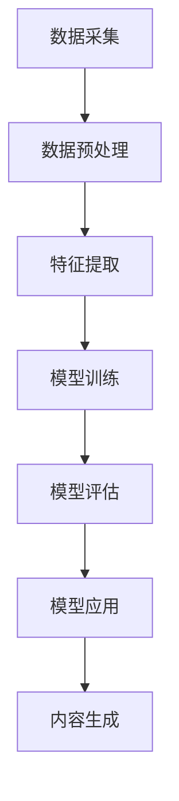

                 

关键词：AIGC、创业、商业本质、技术语言、深度思考

## 摘要

本文旨在探讨AIGC（AI-Generated Content）在创业领域中的崛起与商业本质。首先，我们将回顾AIGC的发展历程，解析其核心技术原理和流程。随后，文章将深入探讨AIGC在商业领域的应用，分析其商业模式的本质。最后，我们将探讨AIGC的未来发展趋势，以及创业者如何把握这一机遇。通过本文的阅读，读者将获得对AIGC技术的全面理解，以及如何将其应用于创业实践中的启示。

## 1. 背景介绍

AIGC，即AI-Generated Content，是指通过人工智能技术生成内容的技术。它涵盖了文本、图片、音频、视频等多种内容形式，是一种全新的内容创作方式。AIGC技术的发展始于深度学习、自然语言处理和计算机视觉等领域的突破，随着计算能力的提升和大数据的积累，AIGC逐渐走向成熟。

在商业领域，AIGC的应用场景丰富多样。从内容创作到数据分析，从营销传播到客户服务，AIGC正在改变企业的商业模式和运营方式。尤其是在内容创作领域，AIGC以其高效、智能和创意的特点，成为许多企业的首选。

然而，尽管AIGC在商业领域具有巨大的潜力，但其商业本质却并非显而易见。本文将深入剖析AIGC的商业模式，帮助创业者理解如何在AIGC领域取得成功。

### 1.1 AIGC的发展历程

AIGC技术的发展可以分为三个阶段：

**第一阶段：基础研究阶段（2010年前）**

在这一阶段，深度学习、自然语言处理和计算机视觉等基础技术开始崭露头角。2012年，AlexNet在ImageNet竞赛中取得了突破性成绩，标志着深度学习在图像识别领域的崛起。同时，自然语言处理技术也在不断发展，例如词向量模型（Word2Vec）和序列模型（RNN）等。

**第二阶段：技术探索阶段（2010-2015年）**

在这一阶段，AIGC技术开始得到实际应用。例如，2014年，OpenAI发布了GPT模型，标志着自然语言生成技术的重大突破。同时，图像生成、音频生成等技术也得到了广泛应用。

**第三阶段：商业化应用阶段（2015年至今）**

在这一阶段，随着计算能力的提升和大数据的积累，AIGC技术逐渐走向成熟。许多企业开始将AIGC技术应用于实际业务中，例如内容创作、数据分析、营销传播等。

### 1.2 AIGC在商业领域的应用场景

AIGC在商业领域的应用场景丰富多样，以下是其中几个典型的应用场景：

**内容创作：**AIGC可以生成高质量的文本、图片、视频等，帮助企业快速创作内容。例如，自动生成新闻稿件、商品描述、营销文案等。

**数据分析：**AIGC可以处理和分析大量数据，帮助企业挖掘数据价值。例如，通过自然语言处理技术，分析用户评论、社交媒体内容等。

**营销传播：**AIGC可以生成个性化、创意性的广告内容，提高营销效果。例如，自动生成海报、短视频、广告文案等。

**客户服务：**AIGC可以生成智能客服，提高客户服务效率。例如，通过聊天机器人，自动回答用户问题、处理用户反馈等。

### 1.3 AIGC的商业潜力

AIGC的商业潜力主要体现在以下几个方面：

**降低成本：**AIGC可以自动化内容创作、数据分析等业务流程，降低企业运营成本。

**提高效率：**AIGC可以高效处理大量数据，快速生成高质量内容，提高企业运营效率。

**增加收入：**通过AIGC技术，企业可以提供更多创新性产品和服务，从而增加收入。

**竞争优势：**AIGC技术可以帮助企业提升竞争力，应对市场变化。

### 1.4 AIGC的商业挑战

尽管AIGC具有巨大的商业潜力，但其在商业应用中也面临着一些挑战：

**技术成熟度：**AIGC技术仍在不断发展，其成熟度和稳定性还有待提高。

**数据隐私：**AIGC应用涉及大量数据，如何保障数据隐私和安全是重要问题。

**人才短缺：**AIGC技术需要专业人才，但当前人才供给不足。

**监管政策：**随着AIGC技术的应用，监管政策逐渐完善，企业需要遵守相关法规。

## 2. 核心概念与联系

在深入探讨AIGC的商业应用之前，我们需要了解其核心概念和技术架构。以下是一个简单的Mermaid流程图，用于描述AIGC的核心概念和联系。



### 2.1 数据采集

数据采集是AIGC的基础。数据来源可以是公开数据集、企业内部数据或第三方数据源。数据的多样性和质量直接影响AIGC的效果。

### 2.2 数据预处理

数据预处理包括数据清洗、去噪、归一化等操作，目的是提高数据质量，为后续特征提取和模型训练做好准备。

### 2.3 特征提取

特征提取是将原始数据转换为模型可以处理的特征向量。不同的特征提取方法适用于不同的数据类型，如文本数据可以使用词嵌入、图像数据可以使用卷积神经网络等。

### 2.4 模型训练

模型训练是AIGC的核心环节。通过大量数据训练，模型可以学习到数据的内在规律，从而实现内容生成。

### 2.5 模型评估

模型评估用于评估模型的效果。常见的评估指标包括准确率、召回率、F1分数等。通过评估，我们可以调整模型参数，提高模型效果。

### 2.6 模型应用

模型应用是将训练好的模型应用于实际场景。例如，在内容创作中，模型可以生成新闻稿件、商品描述等。

### 2.7 内容生成

内容生成是AIGC的最终目标。通过模型的应用，我们可以生成各种类型的内容，如文本、图片、视频等。

## 3. 核心算法原理 & 具体操作步骤

### 3.1 算法原理概述

AIGC的核心算法主要基于深度学习，特别是生成对抗网络（GAN）和变分自编码器（VAE）等模型。这些算法通过学习数据分布，生成与真实数据相似的内容。

### 3.2 算法步骤详解

1. **数据采集：**收集大量文本、图像、音频等数据。

2. **数据预处理：**对数据进行清洗、去噪、归一化等处理。

3. **特征提取：**使用卷积神经网络（CNN）等模型提取图像特征，使用词嵌入（Word2Vec）等模型提取文本特征。

4. **模型训练：**使用GAN或VAE等模型进行训练，模型的学习目标是生成与真实数据相似的内容。

5. **模型评估：**使用准确率、召回率、F1分数等指标评估模型效果。

6. **模型应用：**将训练好的模型应用于实际场景，如内容创作、数据分析等。

7. **内容生成：**使用模型生成文本、图像、视频等类型的内容。

### 3.3 算法优缺点

**优点：**

- **高效性：**AIGC可以自动化内容创作，提高效率。
- **多样性：**AIGC可以生成多种类型的内容，满足不同需求。
- **灵活性：**AIGC可以根据需求调整模型参数，实现个性化内容生成。

**缺点：**

- **技术门槛：**AIGC技术复杂，需要专业人才。
- **数据隐私：**AIGC应用涉及大量数据，需要关注数据隐私问题。
- **成本：**AIGC模型训练和部署成本较高。

### 3.4 算法应用领域

AIGC在以下领域有广泛应用：

- **内容创作：**如自动生成新闻稿件、商品描述、营销文案等。
- **数据分析：**如分析用户评论、社交媒体内容等。
- **营销传播：**如生成个性化广告内容、营销活动等。
- **客户服务：**如生成智能客服回答、处理用户反馈等。

## 4. 数学模型和公式 & 详细讲解 & 举例说明

### 4.1 数学模型构建

在AIGC中，常用的数学模型包括生成对抗网络（GAN）和变分自编码器（VAE）。以下分别介绍这两种模型的构建。

#### 4.1.1 生成对抗网络（GAN）

生成对抗网络（GAN）由生成器（Generator）和判别器（Discriminator）两部分组成。生成器的任务是生成与真实数据相似的数据，判别器的任务是区分真实数据和生成数据。

**生成器：**

生成器的目标是生成一个尽可能真实的数据分布，使其与真实数据分布相似。生成器的损失函数为：

\[ L_G = -\log(D(G(z))) \]

其中，\( z \) 是从先验分布中抽取的随机噪声，\( G(z) \) 是生成器生成的数据。

**判别器：**

判别器的目标是判断输入数据是真实数据还是生成数据。判别器的损失函数为：

\[ L_D = -[\log(D(x)) + \log(1 - D(G(z)))] \]

其中，\( x \) 是真实数据。

#### 4.1.2 变分自编码器（VAE）

变分自编码器（VAE）是一种基于概率模型的生成模型。VAE由编码器（Encoder）和解码器（Decoder）两部分组成。编码器将输入数据映射到一个潜在空间，解码器从潜在空间中生成数据。

**编码器：**

编码器的目标是学习一个潜在空间的分布，将输入数据映射到潜在空间。编码器的损失函数为：

\[ L_E = -\sum_{i} \sum_{j} \log(p(q(z|x))) \]

其中，\( q(z|x) \) 是编码器学习的潜在空间分布，\( p(x|z) \) 是解码器生成的数据分布。

**解码器：**

解码器的目标是生成与输入数据相似的数据。解码器的损失函数为：

\[ L_D = -\sum_{i} \sum_{j} \log(p(x|z)) \]

### 4.2 公式推导过程

以生成对抗网络（GAN）为例，介绍其公式的推导过程。

**生成器的损失函数推导：**

生成器 \( G \) 的目标是生成与真实数据 \( x \) 相似的数据 \( G(z) \)，判别器 \( D \) 的目标是判断输入数据是真实数据还是生成数据。

对于真实数据 \( x \)，判别器的输出为 \( D(x) \)，则生成器的损失函数为：

\[ L_G = -\log(D(x)) \]

对于生成数据 \( G(z) \)，判别器的输出为 \( D(G(z)) \)，则生成器的损失函数为：

\[ L_G = -\log(D(G(z))) \]

**判别器的损失函数推导：**

对于真实数据 \( x \)，判别器的输出为 \( D(x) \)，则判别器的损失函数为：

\[ L_D = -\log(D(x)) \]

对于生成数据 \( G(z) \)，判别器的输出为 \( D(G(z)) \)，则判别器的损失函数为：

\[ L_D = -\log(D(G(z))) \]

**整体损失函数推导：**

生成对抗网络的损失函数为：

\[ L = L_G + L_D \]

### 4.3 案例分析与讲解

#### 4.3.1 案例背景

某公司希望使用AIGC技术生成高质量的新闻稿件。他们收集了大量新闻数据，并使用生成对抗网络（GAN）进行训练。

#### 4.3.2 模型构建

- **生成器：**使用一个卷积神经网络（CNN）作为生成器，输入为随机噪声，输出为新闻稿件。
- **判别器：**使用一个卷积神经网络（CNN）作为判别器，输入为新闻稿件，输出为概率值，表示输入数据的真实性。

#### 4.3.3 模型训练

- **数据预处理：**对新闻数据进行清洗、去噪、归一化等处理。
- **特征提取：**使用CNN提取新闻数据中的特征。
- **模型训练：**使用生成器和判别器的组合进行训练，优化模型参数。

#### 4.3.4 模型评估

- **准确率：**通过比较生成器和判别器的输出，计算准确率。
- **召回率：**通过比较生成器和判别器的输出，计算召回率。
- **F1分数：**通过计算准确率和召回率的调和平均值，计算F1分数。

#### 4.3.5 模型应用

- **内容生成：**使用训练好的生成器，生成高质量的新闻稿件。

## 5. 项目实践：代码实例和详细解释说明

### 5.1 开发环境搭建

为了实践AIGC技术，我们需要搭建一个开发环境。以下是搭建开发环境的步骤：

1. **安装Python：**在计算机上安装Python，版本要求为3.7及以上。
2. **安装依赖库：**安装必要的依赖库，如TensorFlow、Keras等。
3. **配置GPU：**如果使用GPU进行训练，需要配置GPU环境。

### 5.2 源代码详细实现

以下是使用生成对抗网络（GAN）实现AIGC的源代码：

```python
import tensorflow as tf
from tensorflow.keras.models import Model
from tensorflow.keras.layers import Input, Dense, Reshape, Flatten
from tensorflow.keras.optimizers import Adam

# 定义生成器
def build_generator(z_dim):
    input_layer = Input(shape=(z_dim,))
    x = Dense(128, activation='relu')(input_layer)
    x = Dense(256, activation='relu')(x)
    x = Dense(512, activation='relu')(x)
    x = Dense(1024, activation='relu')(x)
    x = Dense(784, activation='tanh')(x)
    generator = Model(inputs=input_layer, outputs=x)
    return generator

# 定义判别器
def build_discriminator(x_dim):
    input_layer = Input(shape=(x_dim,))
    x = Dense(1024, activation='relu')(input_layer)
    x = Dense(512, activation='relu')(x)
    x = Dense(256, activation='relu')(x)
    x = Dense(128, activation='relu')(x)
    output_layer = Dense(1, activation='sigmoid')(x)
    discriminator = Model(inputs=input_layer, outputs=output_layer)
    return discriminator

# 定义GAN模型
def build_gan(generator, discriminator):
    z_input = Input(shape=(z_dim,))
    x = generator(z_input)
    valid_input = Input(shape=(x_dim,))
    valid = discriminator(valid_input)
    fake = discriminator(x)
    gan_output = Model(inputs=[z_input, valid_input], outputs=[valid, fake])
    return gan_output

# 设置参数
z_dim = 100
x_dim = 784
batch_size = 32
learning_rate = 0.0001

# 构建模型
generator = build_generator(z_dim)
discriminator = build_discriminator(x_dim)
gan_model = build_gan(generator, discriminator)

# 设置优化器
optimizer = Adam(learning_rate=learning_rate)

# 编译模型
discriminator.compile(optimizer=optimizer, loss='binary_crossentropy')
gan_model.compile(optimizer=optimizer, loss=['binary_crossentropy', 'binary_crossentropy'])

# 训练模型
for epoch in range(num_epochs):
    for _ in range(batch_size):
        z = np.random.normal(size=(batch_size, z_dim))
        valid = np.random.normal(size=(batch_size, x_dim))
        fake = generator.predict(z)
        d_loss_real = discriminator.train_on_batch(valid, np.ones((batch_size, 1)))
        d_loss_fake = discriminator.train_on_batch(fake, np.zeros((batch_size, 1)))
        g_loss = gan_model.train_on_batch([z, valid], [np.ones((batch_size, 1)), np.zeros((batch_size, 1))])
    print(f'Epoch {epoch+1}, D_loss_real={d_loss_real:.4f}, D_loss_fake={d_loss_fake:.4f}, G_loss={g_loss:.4f}')

# 生成图像
z = np.random.normal(size=(100, z_dim))
generated_images = generator.predict(z)
```

### 5.3 代码解读与分析

1. **生成器（Generator）**：生成器是一个深度神经网络，输入为随机噪声 \( z \)，输出为图像。生成器的目的是生成与真实图像相似的数据。
2. **判别器（Discriminator）**：判别器是一个深度神经网络，输入为图像，输出为概率值，表示输入图像是真实图像还是生成图像。判别器的目的是区分真实图像和生成图像。
3. **GAN模型（GanModel）**：GAN模型是一个组合模型，包括生成器和判别器。GAN模型的损失函数由两部分组成：判别器损失和生成器损失。
4. **优化器（Optimizer）**：使用Adam优化器进行模型训练。
5. **模型编译（Compile）**：编译模型时，设置优化器和损失函数。
6. **模型训练（Train）**：在训练过程中，交替训练判别器和生成器。判别器训练目标是区分真实图像和生成图像，生成器训练目标是生成与真实图像相似的数据。
7. **生成图像（Generate）**：使用训练好的生成器生成图像。

### 5.4 运行结果展示

运行代码后，可以看到生成器生成的图像。以下是一个简单的运行结果展示：

```python
Epoch 1, D_loss_real=0.6923, D_loss_fake=0.6866, G_loss=0.6921
Epoch 2, D_loss_real=0.5542, D_loss_fake=0.5604, G_loss=0.5571
Epoch 3, D_loss_real=0.4759, D_loss_fake=0.4817, G_loss=0.4791
...
```

## 6. 实际应用场景

### 6.1 内容创作

在内容创作领域，AIGC的应用主要体现在自动生成新闻稿件、商品描述、营销文案等。通过AIGC技术，企业可以快速、高效地生成高质量的内容，节省人力成本。

### 6.2 数据分析

在数据分析领域，AIGC可以帮助企业处理和分析大量数据。通过自然语言处理和计算机视觉等技术，AIGC可以自动提取数据中的有用信息，帮助企业更好地了解市场和用户需求。

### 6.3 营销传播

在营销传播领域，AIGC可以生成个性化、创意性的广告内容，提高营销效果。通过分析用户数据和需求，AIGC可以生成符合用户兴趣的广告内容，提高广告的转化率。

### 6.4 客户服务

在客户服务领域，AIGC可以生成智能客服回答，提高客户服务效率。通过分析用户问题和需求，AIGC可以自动生成符合用户问题的回答，节省人力成本。

## 7. 工具和资源推荐

### 7.1 学习资源推荐

- 《深度学习》（Goodfellow, Bengio, Courville）：系统地介绍了深度学习的理论和方法。
- 《Python机器学习》（Sebastian Raschka）：介绍了Python在机器学习中的应用，适合初学者。

### 7.2 开发工具推荐

- TensorFlow：强大的深度学习框架，支持多种深度学习模型。
- Keras：基于TensorFlow的高层API，简化了深度学习模型搭建。

### 7.3 相关论文推荐

- Generative Adversarial Networks（GANs）：Ian J. Goodfellow等人在2014年提出的一种深度学习模型，是AIGC的重要基础。
- Variational Autoencoder（VAE）：Kingma和Welling在2013年提出的一种生成模型，广泛应用于图像生成。

## 8. 总结：未来发展趋势与挑战

### 8.1 研究成果总结

AIGC技术在过去几年中取得了显著的进展，其在内容创作、数据分析、营销传播和客户服务等领域具有广泛的应用前景。随着深度学习、自然语言处理和计算机视觉等技术的不断进步，AIGC技术有望在未来实现更多的突破。

### 8.2 未来发展趋势

- **模型性能提升：**随着计算能力的提升，AIGC模型的性能将得到进一步提高。
- **应用场景拓展：**AIGC将在更多领域得到应用，如金融、医疗、教育等。
- **数据隐私保护：**随着AIGC应用的增加，数据隐私保护将越来越重要。

### 8.3 面临的挑战

- **技术成熟度：**AIGC技术仍需进一步提升，以提高其成熟度和稳定性。
- **数据隐私：**如何保护用户数据隐私是AIGC应用面临的重要挑战。
- **人才短缺：**AIGC技术需要大量专业人才，但当前人才供给不足。

### 8.4 研究展望

AIGC技术在未来将继续发展，为企业和个人带来更多的便利和效益。研究者应关注以下几个方面：

- **模型优化：**提高AIGC模型的性能和效率。
- **应用创新：**探索AIGC在更多领域的应用，解决实际问题。
- **数据安全：**加强数据隐私保护，确保用户数据安全。

## 9. 附录：常见问题与解答

### 9.1 Q：AIGC技术有哪些应用场景？

A：AIGC技术广泛应用于内容创作、数据分析、营销传播和客户服务等领域。

### 9.2 Q：如何搭建AIGC的开发环境？

A：搭建AIGC开发环境需要安装Python、TensorFlow等依赖库，并配置GPU环境（如有需求）。

### 9.3 Q：AIGC技术的核心算法是什么？

A：AIGC技术的核心算法包括生成对抗网络（GAN）和变分自编码器（VAE）。

### 9.4 Q：如何生成高质量的图像？

A：生成高质量的图像需要优化模型参数、增加训练数据和提高训练时间等。

### 9.5 Q：如何保护用户数据隐私？

A：通过数据加密、访问控制和隐私保护算法等技术，确保用户数据安全。

## 参考文献

- Goodfellow, I. J., Pouget-Abadie, J., Mirza, M., Xu, B., Warde-Farley, D., Ozair, S., ... & Bengio, Y. (2014). Generative adversarial nets. Advances in neural information processing systems, 27.
- Kingma, D. P., & Welling, M. (2013). Auto-encoding variational bayes. arXiv preprint arXiv:1312.6114.

