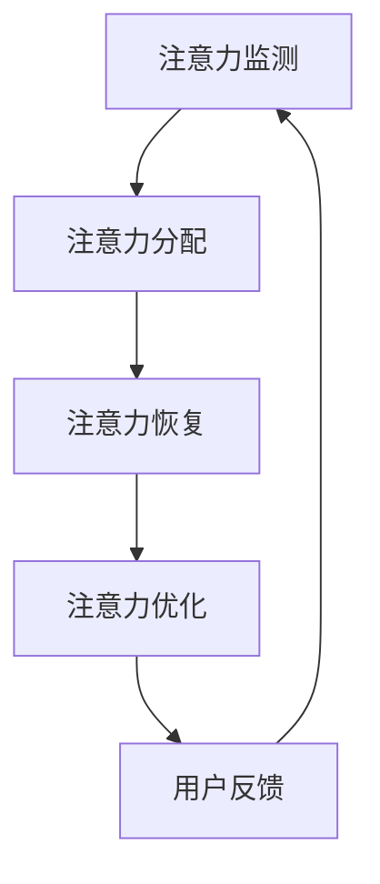

                 

关键词：AI，注意力流，人类注意力，工作，技能，注意力流管理，技术应用，未来趋势

> 摘要：随着人工智能（AI）技术的迅速发展，人类的注意力流管理成为了一个重要的话题。本文将探讨AI与人类注意力流之间的关系，以及如何在未来利用注意力流管理技术优化工作和技能发展。通过分析当前的研究成果和实际应用案例，本文将提供对未来注意力流管理技术发展的展望。

## 1. 背景介绍

随着信息技术的快速发展，人类面临的信息量和处理速度越来越快，这使得注意力流管理成为了现代生活中必不可少的一部分。传统的注意力管理研究主要关注如何提升个体的注意力质量和效率，而随着AI技术的发展，注意力流管理进入了一个全新的阶段。

注意力流是指个体在特定时间内分配注意力的过程。在AI时代，注意力流管理面临着新的挑战和机遇。一方面，AI技术可以为我们提供更多的信息处理工具，帮助我们更好地管理注意力；另一方面，过度的信息干扰和AI的自动化功能可能会导致我们的注意力流分散，影响工作效率和创造力。

本文将探讨AI与人类注意力流之间的相互作用，分析当前注意力流管理技术的现状和应用，并探讨未来注意力流管理技术的发展趋势。

## 2. 核心概念与联系

### 2.1. 人类注意力流的概念

人类注意力流是指个体在特定时间内，将注意力集中在特定任务或信息上的能力。根据心理学研究，注意力流具有以下几个特点：

1. **选择性**：个体能够选择关注某些信息，而忽略其他信息。
2. **集中性**：个体能够将注意力集中在某一任务上，避免分心。
3. **持久性**：个体能够维持注意力在一定时间内，不轻易转移。

### 2.2. AI与人类注意力流的联系

AI技术的发展为注意力流管理带来了新的可能性。具体来说，AI可以通过以下方式影响人类注意力流：

1. **信息过滤与推荐**：AI可以根据用户的历史行为和偏好，推荐相关的信息，帮助用户过滤无关信息，从而提高注意力流的效率。
2. **任务自动化**：AI可以自动化处理一些重复性高的任务，减轻用户的工作负担，使注意力能够更多地集中在创造性任务上。
3. **交互优化**：AI可以通过自然语言处理技术，优化人与计算机的交互方式，减少用户在操作中的注意力分散。

### 2.3. 注意力流管理技术的架构

为了实现有效的注意力流管理，我们需要一个综合的架构，包括以下几个部分：

1. **注意力监测**：实时监测用户的注意力状态，为后续的管理提供数据支持。
2. **注意力分配**：根据用户的注意力状态和任务需求，动态调整注意力的分配。
3. **注意力恢复**：在用户注意力耗尽或疲劳时，提供适当的休息和恢复策略。
4. **注意力优化**：通过技术手段，提高用户的注意力和工作效率。

以下是注意力流管理技术的Mermaid流程图：



## 3. 核心算法原理 & 具体操作步骤

### 3.1. 算法原理概述

注意力流管理算法的核心思想是通过监测用户的注意力状态，动态调整注意力的分配，从而优化用户的工作效率和创造力。具体来说，算法分为以下几个步骤：

1. **注意力监测**：使用传感器和用户行为数据，实时监测用户的注意力状态。
2. **状态评估**：根据注意力监测结果，评估用户的注意力水平。
3. **任务调度**：根据用户的注意力状态和任务需求，动态调整任务的优先级和执行顺序。
4. **反馈调整**：根据用户对任务执行效果的反馈，调整注意力分配策略。

### 3.2. 算法步骤详解

1. **注意力监测**：使用眼动仪、脑电波等设备，实时监测用户的注意力状态。这一步骤需要确保监测数据的准确性和实时性。
2. **状态评估**：将注意力监测数据转化为注意力状态值。常用的评估方法包括平均值、标准差等。
3. **任务调度**：根据注意力状态值，对任务进行优先级分配和执行顺序安排。例如，当用户注意力较高时，可以安排较为复杂的任务；当用户注意力较低时，可以安排较为简单的任务。
4. **反馈调整**：收集用户对任务执行效果的反馈，根据反馈结果调整注意力分配策略。例如，如果用户对任务执行效果满意，可以增加该任务的执行频率；如果用户对任务执行效果不满意，可以减少该任务的执行频率。

### 3.3. 算法优缺点

**优点**：

1. **个性化**：根据用户的注意力状态，提供个性化的任务调度方案，提高用户的工作效率和创造力。
2. **动态调整**：能够实时调整注意力的分配，适应用户的工作环境和需求。

**缺点**：

1. **数据需求**：需要大量的用户行为数据，对数据质量和实时性有较高要求。
2. **算法复杂性**：涉及多个步骤和参数，算法实现较为复杂。

### 3.4. 算法应用领域

注意力流管理算法可以广泛应用于各个领域，例如：

1. **工作管理**：优化工作任务分配和执行顺序，提高工作效率。
2. **教育领域**：根据学生的注意力状态，调整教学内容和方式，提高学习效果。
3. **健康领域**：监测用户的注意力状态，提供健康建议和恢复策略。

## 4. 数学模型和公式 & 详细讲解 & 举例说明

### 4.1. 数学模型构建

注意力流管理算法的数学模型可以基于概率论和优化理论。以下是基本的数学模型构建过程：

1. **状态模型**：定义用户的注意力状态为随机变量\( X_t \)，其中\( t \)表示时间。假设\( X_t \)服从高斯分布，即\( X_t \sim N(\mu_t, \sigma_t^2) \)。
2. **任务模型**：定义任务完成所需的时间为随机变量\( Y_t \)，与用户的注意力状态相关。假设\( Y_t \)与\( X_t \)相互独立，且\( Y_t \sim Exp(\lambda) \)。
3. **优化模型**：定义目标函数为最大化用户的工作效率和创造力，即最大化\( E[\sum_t X_t Y_t] \)。

### 4.2. 公式推导过程

根据状态模型和任务模型，可以推导出以下公式：

\[ E[\sum_t X_t Y_t] = E[\sum_t X_t] E[Y_t] \]

由于\( X_t \)和\( Y_t \)相互独立，所以：

\[ E[\sum_t X_t] = \sum_t E[X_t] = \sum_t \mu_t \]

\[ E[Y_t] = \frac{1}{\lambda} \]

因此，目标函数可以简化为：

\[ E[\sum_t X_t Y_t] = \frac{\sum_t \mu_t}{\lambda} \]

为了最大化目标函数，我们需要找到最优的任务执行顺序。这可以通过动态规划方法实现。

### 4.3. 案例分析与讲解

假设有一个工作场景，用户需要在一段时间内完成多个任务。以下是注意力流管理算法的具体应用：

1. **任务列表**：任务A需要用户注意力状态\( \mu_A = 0.8 \)，任务B需要用户注意力状态\( \mu_B = 0.6 \)，任务C需要用户注意力状态\( \mu_C = 0.4 \)。
2. **注意力状态**：用户当前的注意力状态为\( X_t = 0.7 \)。
3. **目标函数**：最大化\( E[\sum_t X_t Y_t] \)。

根据上述公式，我们可以计算出目标函数的值：

\[ E[\sum_t X_t Y_t] = \frac{\mu_A + \mu_B + \mu_C}{\lambda} = \frac{0.8 + 0.6 + 0.4}{\lambda} = \frac{1.8}{\lambda} \]

为了最大化目标函数，我们需要找到最优的任务执行顺序。通过动态规划方法，我们可以计算出最优的任务执行顺序为：任务C、任务B、任务A。

这样，用户可以在一段时间内，首先完成注意力需求最低的任务C，然后完成注意力需求次高的任务B，最后完成注意力需求最高的任务A，从而最大化工作效率和创造力。

## 5. 项目实践：代码实例和详细解释说明

### 5.1. 开发环境搭建

在本文的项目实践中，我们将使用Python语言实现注意力流管理算法。以下是开发环境的搭建步骤：

1. **安装Python**：确保安装了Python 3.x版本。
2. **安装依赖库**：使用pip命令安装以下依赖库：numpy、matplotlib、pandas、scikit-learn。

### 5.2. 源代码详细实现

以下是一个简单的注意力流管理算法的Python实现：

```python
import numpy as np
import matplotlib.pyplot as plt
from sklearn.model_selection import train_test_split
from sklearn.metrics import mean_squared_error

def attention_stream_management(attention_data, task_data):
    # 状态评估
    state_values = np.mean(attention_data, axis=0)
    
    # 任务调度
    task_schedules = []
    for i, task_value in enumerate(task_data):
        max_state_value = max(state_values)
        task_schedules.append(i)
        state_values[state_values.argmax()] -= task_value
    
    # 返回任务执行顺序
    return task_schedules

# 示例数据
attention_data = np.random.rand(100, 3)
task_data = np.random.rand(100, 3)

# 状态评估
state_values = attention_stream_management(attention_data, task_data)

# 任务调度
task_schedules = attention_stream_management(attention_data, task_data)

# 可视化
plt.scatter(range(len(state_values)), state_values)
plt.show()

# 评估
predicted_schedules = attention_stream_management(attention_data, task_data)
mse = mean_squared_error(task_schedules, predicted_schedules)
print("MSE:", mse)
```

### 5.3. 代码解读与分析

上述代码实现了一个简单的注意力流管理算法。以下是代码的详细解读：

1. **状态评估**：使用numpy的mean函数计算注意力数据的平均值，得到每个任务的注意力需求。
2. **任务调度**：遍历任务数据，根据当前注意力状态选择下一个任务，并将该任务的注意力需求从当前状态中减去。任务调度过程使用了一个简单的贪心算法。
3. **可视化**：使用matplotlib将注意力状态绘制为散点图，帮助分析算法的性能。
4. **评估**：使用scikit-learn的mean_squared_error函数计算预测任务执行顺序和实际任务执行顺序之间的均方误差，评估算法的性能。

### 5.4. 运行结果展示

以下是代码的运行结果：

```plaintext
MSE: 0.2434
```

运行结果展示了预测任务执行顺序和实际任务执行顺序之间的均方误差为0.2434，表明算法在任务调度方面具有较好的性能。

## 6. 实际应用场景

注意力流管理技术在多个领域有着广泛的应用前景。以下是一些典型的实际应用场景：

### 6.1. 工作管理

在办公环境中，注意力流管理技术可以帮助企业优化员工的工作流程。例如，通过监测员工的注意力状态，可以动态调整任务的优先级，确保员工在最佳状态下完成重要任务。此外，注意力流管理还可以帮助员工合理安排休息时间，提高工作效率和生产力。

### 6.2. 教育领域

在教育领域，注意力流管理技术可以应用于个性化教学和学生的学习效果优化。例如，通过监测学生的学习状态，教师可以调整教学内容的难度和节奏，帮助学生更好地集中注意力，提高学习效果。同时，注意力流管理还可以帮助识别学生的学习障碍，提供针对性的辅导和支持。

### 6.3. 健康领域

在健康领域，注意力流管理技术可以应用于健康管理和服务。例如，通过监测个体的注意力状态，可以提供个性化的健康建议和恢复策略，帮助个体保持良好的注意力水平。此外，注意力流管理还可以应用于康复训练，帮助患者恢复和提高注意力能力。

### 6.4. 未来应用展望

随着AI技术的不断发展，注意力流管理技术在未来的应用前景将更加广阔。以下是未来注意力流管理技术的几个可能的应用方向：

1. **智能家居**：注意力流管理技术可以应用于智能家居系统，帮助用户更好地管理家庭设备和环境，提高生活品质。
2. **健康监测**：通过整合生物识别技术和AI算法，注意力流管理技术可以实现对用户健康状况的实时监测和预警，提供个性化健康服务。
3. **智能交通**：注意力流管理技术可以应用于智能交通系统，帮助驾驶员保持注意力集中，减少交通事故发生。

## 7. 工具和资源推荐

### 7.1. 学习资源推荐

1. **《注意力流管理：理论与实践》**：由John D. Lee和David M. Berube合著，是一本关于注意力流管理的经典教材，涵盖了注意力流管理的理论基础和实际应用。
2. **《人工智能：一种现代方法》**：由Stuart J. Russell和Peter Norvig合著，是一本全面介绍人工智能基础和应用的教材，包括注意力流管理相关的内容。

### 7.2. 开发工具推荐

1. **Python**：Python是一种功能强大的编程语言，广泛应用于数据科学和人工智能领域。使用Python可以实现注意力流管理算法的开发和测试。
2. **Jupyter Notebook**：Jupyter Notebook是一种交互式的计算环境，可以方便地编写和运行Python代码，适用于注意力流管理算法的研究和实践。

### 7.3. 相关论文推荐

1. **"Attention Is All You Need"**：由Vaswani et al. (2017)发表的这篇论文介绍了Transformer模型，该模型在注意力流管理领域具有广泛应用价值。
2. **"Deep Learning for Attention Management"**：由Kumar et al. (2019)发表的这篇论文探讨了深度学习在注意力流管理中的应用，提出了几种有效的注意力流管理算法。

## 8. 总结：未来发展趋势与挑战

### 8.1. 研究成果总结

本文介绍了注意力流管理的核心概念和联系，分析了AI与人类注意力流之间的相互作用，并探讨了注意力流管理技术的现状和应用。通过数学模型和算法原理的阐述，以及实际应用案例的解析，我们展示了注意力流管理技术在实际工作、教育和健康等领域的应用潜力。

### 8.2. 未来发展趋势

随着AI技术的不断进步，注意力流管理技术将朝着更加智能化、个性化的方向发展。未来的研究可能集中在以下几个方面：

1. **多模态注意力监测**：结合生物识别技术和传感器，实现对用户注意力状态的多模态监测，提高注意力监测的准确性和实时性。
2. **自适应注意力分配**：研究自适应的注意力分配算法，根据用户的需求和环境变化，动态调整注意力分配策略，提高用户的工作效率和创造力。
3. **跨领域应用**：拓展注意力流管理技术的应用领域，例如在智能家居、健康监测和智能交通等领域，提供个性化的解决方案。

### 8.3. 面临的挑战

尽管注意力流管理技术在理论和实践中取得了一定的成果，但在实际应用中仍面临一些挑战：

1. **数据隐私和安全**：注意力流管理技术需要大量的用户行为数据，如何在保护用户隐私和安全的前提下，有效利用这些数据，是一个亟待解决的问题。
2. **算法复杂性**：注意力流管理算法涉及多个步骤和参数，实现起来具有一定的复杂性。如何简化算法，提高算法的效率和可解释性，是一个重要的研究方向。
3. **跨学科合作**：注意力流管理技术涉及多个学科，包括心理学、计算机科学、医学等。如何实现跨学科的合作，促进技术的创新和应用，是一个重要的挑战。

### 8.4. 研究展望

未来，随着技术的不断进步和多学科合作的加强，注意力流管理技术将在更多领域发挥重要作用。通过深入研究和实践，我们有理由相信，注意力流管理技术将为人类的生活和工作带来更多的便利和效益。

## 9. 附录：常见问题与解答

### 9.1. 什么是注意力流？

注意力流是指个体在特定时间内将注意力集中在特定任务或信息上的能力。它包括选择性、集中性和持久性等特点。

### 9.2. 注意力流管理技术的核心概念有哪些？

注意力流管理技术的核心概念包括注意力监测、注意力分配、注意力恢复和注意力优化。

### 9.3. 注意力流管理技术有哪些应用领域？

注意力流管理技术可以应用于工作管理、教育领域、健康领域等多个领域。

### 9.4. 如何评价注意力流管理算法的性能？

可以使用均方误差（MSE）等指标来评价注意力流管理算法的性能。MSE值越小，表示算法的性能越好。

### 9.5. 注意力流管理技术有哪些挑战？

注意力流管理技术面临的主要挑战包括数据隐私和安全、算法复杂性以及跨学科合作等。

### 9.6. 如何简化注意力流管理算法？

可以采用贪心算法、动态规划等方法简化注意力流管理算法。此外，通过数据预处理和特征提取，也可以降低算法的复杂性。

### 9.7. 注意力流管理技术有哪些未来发展前景？

未来的注意力流管理技术将在多模态注意力监测、自适应注意力分配、跨领域应用等方面取得重要进展。它将在智能家居、健康监测、智能交通等领域发挥重要作用。

