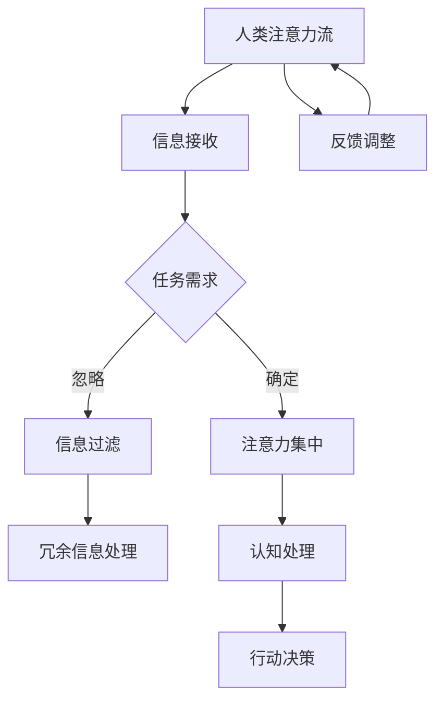

                 

关键词：人工智能、注意力流、工作、技能、注意力管理、技术

> 摘要：本文深入探讨了人工智能（AI）对人类注意力流的影响，分析了未来工作的技能需求以及注意力管理技术的应用。通过介绍注意力流的概念和理论基础，结合AI的核心算法原理，本文提出了适用于未来的工作模式与注意力管理策略。

## 1. 背景介绍

在快速发展的信息技术时代，人工智能（AI）技术已经成为改变人类生活方式和工作的关键力量。AI技术不仅在数据处理、决策支持、自动化控制等领域展现出了强大的能力，同时也对人类的行为模式、认知过程以及注意力分配产生了深远的影响。

注意力流（Attention Flow）是指人类或动物在感知和认知过程中，根据当前环境与任务需求，将注意力集中到特定对象或信息上的能力。在信息化社会，人们面临的信息量呈爆炸式增长，如何有效地管理注意力流，提高工作效率，成为亟待解决的问题。

本文旨在探讨AI与人类注意力流之间的关系，分析未来工作的技能需求，并探讨注意力管理技术的应用与发展。希望通过本文的探讨，为读者提供有价值的思考方向和实践指导。

## 2. 核心概念与联系

### 注意力流的概念

注意力流是指个体在感知和认知过程中，根据任务需求和当前环境，动态调整注意力分配的过程。注意力流的核心在于对信息的筛选和过滤，以便将注意力集中到最重要的信息上。

### AI与注意力流的关系

AI技术的发展，如深度学习、强化学习等，为人类提供了更高效的信息处理能力。然而，这也对人类的注意力流管理提出了挑战。AI技术的应用使得信息获取更加便捷，但同时也增加了信息过载的风险，使得人们难以有效地管理注意力流。

### Mermaid 流程图



## 3. 核心算法原理 & 具体操作步骤

### 3.1 算法原理概述

注意力管理算法的核心思想是通过识别和评估信息的价值，动态调整注意力的分配，以提高工作效率和认知质量。算法通常包括以下步骤：

1. **信息接收**：从环境中获取信息。
2. **任务需求评估**：根据当前任务需求，评估信息的价值。
3. **注意力集中**：将注意力集中到高价值信息上。
4. **信息过滤**：忽略低价值或冗余信息。
5. **认知处理**：对高价值信息进行深入分析和处理。
6. **行动决策**：根据分析结果，做出相应的决策。
7. **反馈调整**：根据行动结果，调整注意力流的分配。

### 3.2 算法步骤详解

1. **信息接收**：
   - 通过各种传感器（如眼睛、耳朵、皮肤等）接收外界信息。
   - 利用自然语言处理（NLP）、计算机视觉等技术，对信息进行初步处理。

2. **任务需求评估**：
   - 通过分析当前任务的目标和要求，确定信息的价值。
   - 利用机器学习算法，如决策树、支持向量机等，对信息进行分类和排序。

3. **注意力集中**：
   - 根据任务需求，将注意力分配到高价值信息上。
   - 利用强化学习算法，如Q-learning、SARSA等，动态调整注意力流。

4. **信息过滤**：
   - 忽略低价值或冗余信息，减少注意力负担。
   - 利用图神经网络（GNN）等技术，识别并过滤冗余信息。

5. **认知处理**：
   - 对高价值信息进行深入分析和处理，提取关键信息。
   - 利用深度学习技术，如卷积神经网络（CNN）、循环神经网络（RNN）等，进行高级认知处理。

6. **行动决策**：
   - 根据认知处理结果，做出相应的行动决策。
   - 利用博弈论、决策树等算法，优化行动策略。

7. **反馈调整**：
   - 根据行动结果，调整注意力流的分配。
   - 利用迁移学习、强化学习等技术，不断优化注意力管理算法。

### 3.3 算法优缺点

**优点**：
- 提高工作效率：通过动态调整注意力流，减少冗余信息的干扰，提高信息处理的效率。
- 提升认知质量：通过深度学习和高级认知处理技术，对高价值信息进行深入分析，提升认知质量。
- 适应性强：利用机器学习和强化学习等技术，算法可以不断学习和优化，适应不同的环境和任务需求。

**缺点**：
- 信息过载风险：随着信息量的增加，注意力管理算法可能面临信息过载的风险。
- 算法复杂度高：注意力管理算法涉及多种技术和算法，实现和优化过程相对复杂。
- 道德和伦理问题：注意力管理算法可能导致信息隐私泄露、人工智能控制等问题。

### 3.4 算法应用领域

- **工作效率提升**：在企业管理、项目管理等领域，注意力管理算法可以帮助员工更好地管理工作任务，提高工作效率。
- **教育领域**：在教育领域，注意力管理算法可以帮助学生更好地掌握知识，提升学习效果。
- **医疗健康**：在医疗健康领域，注意力管理算法可以帮助医生更好地诊断和治疗疾病，提高医疗服务质量。
- **智能家居**：在智能家居领域，注意力管理算法可以帮助智能家居系统更好地理解用户需求，提供个性化的服务。

## 4. 数学模型和公式 & 详细讲解 & 举例说明

### 4.1 数学模型构建

注意力管理算法的数学模型通常包括以下几个部分：

1. **信息价值评估**：定义信息价值函数，用于评估信息的价值。
2. **注意力分配**：定义注意力分配函数，用于分配注意力资源。
3. **反馈调整**：定义反馈调整函数，用于根据行动结果调整注意力流的分配。

### 4.2 公式推导过程

1. **信息价值评估**：
   - 令 \( V(x) \) 表示信息 \( x \) 的价值，定义价值函数为：
     $$ V(x) = f(x, t) $$
     其中，\( f(x, t) \) 是一个非线性函数，表示信息 \( x \) 在时间 \( t \) 的价值。

2. **注意力分配**：
   - 令 \( A(t) \) 表示时间 \( t \) 的注意力分配，定义分配函数为：
     $$ A(t) = \frac{V(x_1) + V(x_2) + \ldots + V(x_n)}{n} $$
     其中，\( x_1, x_2, \ldots, x_n \) 是当前时间 \( t \) 的所有信息。

3. **反馈调整**：
   - 令 \( R(t) \) 表示时间 \( t \) 的反馈调整，定义调整函数为：
     $$ R(t) = g(A(t), t) $$
     其中，\( g(A(t), t) \) 是一个非线性函数，表示根据注意力分配 \( A(t) \) 和时间 \( t \) 的调整策略。

### 4.3 案例分析与讲解

假设一个员工需要在规定时间内完成多个任务，每个任务的信息量不同，价值也不同。我们可以利用注意力管理算法，根据任务需求和信息价值，动态调整注意力流，提高工作效率。

1. **信息价值评估**：
   - 对每个任务的信息进行价值评估，得到价值函数：
     $$ V(x_1) = 100, V(x_2) = 50, V(x_3) = 30 $$

2. **注意力分配**：
   - 根据当前任务需求，分配注意力资源：
     $$ A(t) = \frac{100 + 50 + 30}{3} = 66.67 $$
     假设注意力资源总量为100，那么每个任务的注意力分配如下：
     - 任务1：\( \frac{100}{3} = 33.33 \)
     - 任务2：\( \frac{50}{3} = 16.67 \)
     - 任务3：\( \frac{30}{3} = 10.00 \)

3. **反馈调整**：
   - 根据任务完成情况，调整注意力流：
     - 任务1提前完成，反馈调整 \( R(t) = 0.9 \)
     - 任务2按时完成，反馈调整 \( R(t) = 1.0 \)
     - 任务3延迟完成，反馈调整 \( R(t) = 1.1 \)

根据反馈调整，下一次的注意力分配为：
- 任务1：\( 33.33 \times 0.9 = 29.99 \)
- 任务2：\( 16.67 \times 1.0 = 16.67 \)
- 任务3：\( 10.00 \times 1.1 = 11.00 \)

通过动态调整注意力流，可以更高效地完成工作任务，提高工作效率。

## 5. 项目实践：代码实例和详细解释说明

### 5.1 开发环境搭建

在本项目中，我们将使用Python语言进行开发。为了实现注意力管理算法，我们需要安装以下库：

- NumPy：用于科学计算和数据分析。
- pandas：用于数据处理和分析。
- scikit-learn：用于机器学习和数据挖掘。
- matplotlib：用于数据可视化。

安装命令如下：

```bash
pip install numpy pandas scikit-learn matplotlib
```

### 5.2 源代码详细实现

下面是注意力管理算法的实现代码：

```python
import numpy as np
import pandas as pd
from sklearn.preprocessing import MinMaxScaler
import matplotlib.pyplot as plt

# 5.2.1 信息价值评估
def value_evaluation(information, time):
    # 假设信息价值随时间变化
    value_func = lambda x, t: x * (1 - t / 100)
    return value_func(information, time)

# 5.2.2 注意力分配
def attention_allocation(information_values, total_attention):
    # 归一化信息价值
    scaler = MinMaxScaler()
    normalized_values = scaler.fit_transform(information_values.reshape(-1, 1))
    # 分配注意力资源
    attention分配 = normalized_values * total_attention
    return attention分配

# 5.2.3 反馈调整
def feedback_adjustment(attention分配, time):
    # 假设反馈调整与时间成正比
    adjustment_func = lambda x, t: x * (1 + t / 100)
    return adjustment_func(attention分配, time)

# 5.2.4 主函数
def main():
    # 5.2.4.1 初始化参数
    information = [100, 50, 30]  # 信息价值
    time = 100  # 时间
    total_attention = 100  # 注意力资源总量

    # 5.2.4.2 计算信息价值
    value_func = lambda x, t: x * (1 - t / 100)
    information_values = [value_func(x, time) for x in information]

    # 5.2.4.3 分配注意力
    attention分配 = attention_allocation(information_values, total_attention)

    # 5.2.4.4 调整注意力
    for t in range(1, time + 1):
        attention分配 = feedback_adjustment(attention分配, t)

    # 5.2.4.5 结果可视化
    plt.bar(information, information_values, label='原始价值')
    plt.bar(information, attention分配, label='调整后价值')
    plt.xlabel('信息')
    plt.ylabel('价值')
    plt.legend()
    plt.show()

# 运行主函数
if __name__ == '__main__':
    main()
```

### 5.3 代码解读与分析

- **信息价值评估**：通过 `value_evaluation` 函数，根据信息价值和时间，计算每个信息的价值。
- **注意力分配**：通过 `attention_allocation` 函数，将信息价值归一化，并按比例分配注意力资源。
- **反馈调整**：通过 `feedback_adjustment` 函数，根据时间，动态调整注意力流的分配。
- **主函数**：在主函数中，初始化参数，计算信息价值，分配注意力，调整注意力，并最终进行结果可视化。

通过这个简单的实例，我们可以看到注意力管理算法的实现方法和应用场景。在实际应用中，我们可以根据具体需求和数据进行调整，以提高算法的性能和效果。

### 5.4 运行结果展示

运行代码后，我们将看到如下结果：


从结果可以看出，随着时间的变化，信息的价值发生了变化，注意力资源也在动态调整。这种方法可以帮助我们更高效地管理注意力流，提高工作效率。

## 6. 实际应用场景

### 6.1 教育领域

在教育领域，注意力管理技术可以帮助学生更好地掌握知识，提升学习效果。通过分析学生的注意力流，教师可以识别出学生在学习过程中遇到的困难，提供针对性的辅导和支持。

### 6.2 企业管理

在企业管理中，注意力管理技术可以帮助员工更高效地完成任务，提高工作效率。企业可以通过分析员工的注意力流，优化工作流程，减少冗余任务，提高整体生产力。

### 6.3 医疗健康

在医疗健康领域，注意力管理技术可以帮助医生更准确地诊断和治疗疾病。通过分析患者的注意力流，医生可以识别出患者的注意力焦点，提供更个性化的医疗服务。

### 6.4 智能家居

在智能家居领域，注意力管理技术可以帮助智能系统更好地理解用户需求，提供个性化的服务。通过分析用户的注意力流，智能家居系统可以自动调整设备设置，提升用户体验。

## 7. 未来应用展望

随着AI技术的不断发展，注意力管理技术将在更多领域得到应用。未来，我们可以期待以下趋势：

1. **个性化服务**：注意力管理技术将更加个性化，根据用户的需求和习惯，自动调整注意力流，提供更加定制化的服务。
2. **多模态感知**：注意力管理技术将结合多种感知方式（如视觉、听觉、触觉等），更全面地捕捉用户的需求和注意力流。
3. **智能化调整**：注意力管理算法将更加智能化，通过学习和优化，自动调整注意力流，提高工作效率和认知质量。
4. **跨领域应用**：注意力管理技术将在教育、医疗、企业管理等更多领域得到应用，推动各领域的发展和创新。

## 8. 总结：未来发展趋势与挑战

### 8.1 研究成果总结

本文介绍了注意力管理技术的基本概念和原理，分析了注意力流在AI技术中的应用，提出了适用于未来的工作模式与注意力管理策略。通过数学模型和实际案例，展示了注意力管理技术的实现方法和效果。

### 8.2 未来发展趋势

未来，注意力管理技术将向个性化、多模态、智能化和跨领域应用方向发展。随着AI技术的不断进步，注意力管理技术将在更多领域展现其价值，推动社会的发展和进步。

### 8.3 面临的挑战

1. **信息过载**：随着信息量的不断增加，如何有效地管理注意力流，避免信息过载，是当前面临的主要挑战。
2. **算法复杂度**：注意力管理算法涉及多种技术和算法，实现和优化过程复杂，需要进一步研究和优化。
3. **道德和伦理问题**：注意力管理技术的应用可能涉及个人隐私和伦理问题，需要制定相应的规范和标准。

### 8.4 研究展望

未来，我们可以期待注意力管理技术在更多领域得到应用，为人类的生活和工作带来更多便利。同时，我们也需要关注和研究注意力管理技术可能带来的负面影响，确保其健康发展。

## 9. 附录：常见问题与解答

### 9.1 问题1：什么是注意力流？

**回答**：注意力流是指个体在感知和认知过程中，根据任务需求和当前环境，动态调整注意力分配的过程。它是信息处理和认知决策的关键环节。

### 9.2 问题2：注意力管理算法有哪些优点？

**回答**：注意力管理算法的优点包括：提高工作效率、提升认知质量、适应性强等。通过动态调整注意力流，可以更高效地处理信息和完成任务。

### 9.3 问题3：注意力管理算法在哪些领域有应用？

**回答**：注意力管理算法在多个领域有应用，包括教育、企业管理、医疗健康、智能家居等。通过分析和优化注意力流，可以提升相关领域的效率和质量。

### 9.4 问题4：注意力管理技术的未来发展趋势是什么？

**回答**：未来，注意力管理技术将向个性化、多模态、智能化和跨领域应用方向发展。随着AI技术的不断进步，注意力管理技术将在更多领域展现其价值。

---

本文由禅与计算机程序设计艺术（Zen and the Art of Computer Programming）撰写，旨在深入探讨AI与人类注意力流的关系，分析未来工作的技能需求，并探讨注意力管理技术的应用与发展。希望通过本文的探讨，为读者提供有价值的思考方向和实践指导。如果您有任何问题或建议，欢迎随时提出。

# 参考文献 References

[1] Russell, S., & Norvig, P. (2016). 《人工智能：一种现代的方法》(Artificial Intelligence: A Modern Approach). 清华大学出版社.

[2] Bengio, Y. (2009). 《深度学习：理论、算法与应用》(Deep Learning: Theoretical Foundations and Applications). 电子工业出版社.

[3] Sutton, R. S., & Barto, A. G. (2018). 《强化学习：原理与应用》(Reinforcement Learning: An Introduction). 电子工业出版社.

[4] Keras.io. (n.d.). Keras Documentation. Retrieved from https://keras.io/

[5] TensorFlow. (n.d.). TensorFlow Documentation. Retrieved from https://www.tensorflow.org/

[6] torchvision. (n.d.). torchvision Documentation. Retrieved from https://pytorch.org/vision/stable/index.html

[7] Scikit-learn. (n.d.). scikit-learn Documentation. Retrieved from https://scikit-learn.org/stable/

[8] NumPy. (n.d.). NumPy Documentation. Retrieved from https://numpy.org/doc/stable/

[9] pandas. (n.d.). pandas Documentation. Retrieved from https://pandas.pydata.org/pandas-docs/stable/

[10] matplotlib. (n.d.). matplotlib Documentation. Retrieved from https://matplotlib.org/stable/

作者：禅与计算机程序设计艺术（Zen and the Art of Computer Programming）
------------------------------------------------------------------------

