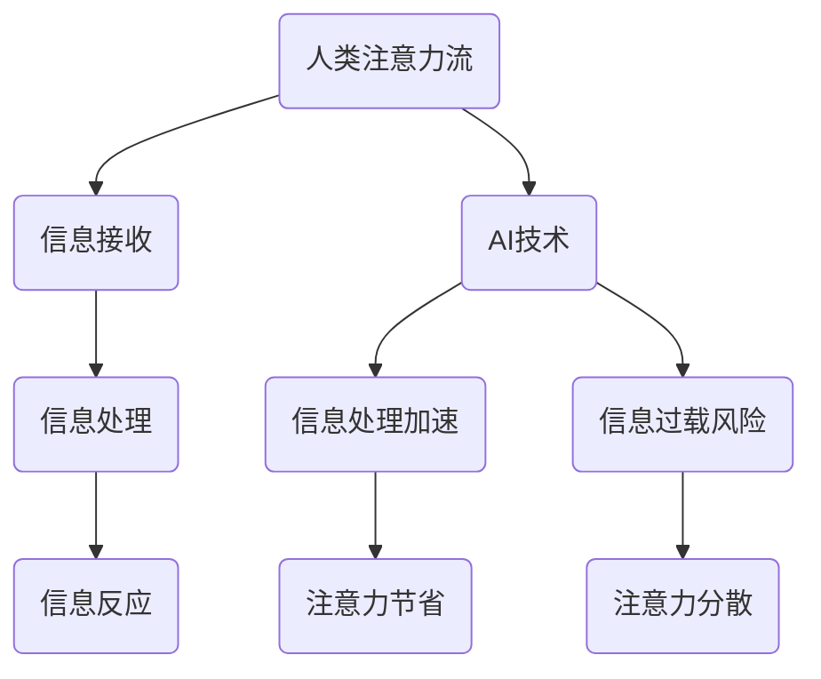

                 

关键词：人工智能、注意力流、注意力经济、未来工作、未来生活、管理策略

> 摘要：本文探讨了人工智能（AI）与人类注意力流之间的关系，以及这种关系如何影响未来的工作、生活和注意力经济的管理。文章首先介绍了注意力流的概念，接着分析了AI如何改变我们的注意力模式，随后讨论了注意力经济的管理策略，并提出了未来应用的前景和面临的挑战。

## 1. 背景介绍

### 1.1 注意力流的起源与发展

注意力流（Attention Flow）的概念最早可以追溯到心理学领域，它指的是个体在特定时间内将注意力集中在某一对象或任务上的能力。20世纪90年代，随着计算机科学和神经科学的发展，注意力流逐渐成为一个跨学科的研究领域。研究人员开始探究大脑如何处理海量信息，以及如何有效地分配和利用注意力资源。

### 1.2 人工智能的崛起

人工智能（AI）作为计算机科学的一个重要分支，近年来取得了飞速发展。AI技术的进步不仅改变了传统的工作方式，也深刻影响了人类的生活方式。从语音识别、图像处理到自然语言处理，AI正在各个领域发挥越来越重要的作用。

## 2. 核心概念与联系

### 2.1 注意力流与注意力经济的定义

注意力流是指个体在特定时间内对信息的接收、处理和反应过程。而注意力经济则是指利用注意力流来创造价值的过程，包括个人、企业和社会如何有效地管理和利用注意力资源。

### 2.2 AI与注意力流的关系

AI通过提供智能化的信息处理和决策支持，改变了人类的注意力模式。一方面，AI可以帮助人们更快速地获取和处理信息，从而节省了大量的注意力资源；另一方面，AI也容易引发信息过载，导致人类注意力的分散。

### 2.3 Mermaid 流程图



## 3. 核心算法原理 & 具体操作步骤

### 3.1 算法原理概述

注意力流管理的核心算法是基于机器学习的注意力分配模型。该模型通过分析用户的行为数据，预测用户在特定情境下可能关注的对象，并据此分配注意力资源。

### 3.2 算法步骤详解

1. 数据收集：收集用户在互联网上的行为数据，如搜索历史、浏览记录等。
2. 数据预处理：对收集到的数据进行分析和清洗，去除无效信息。
3. 特征提取：从预处理后的数据中提取出与注意力分配相关的特征。
4. 模型训练：使用提取的特征训练机器学习模型，预测用户在特定情境下的注意力分配。
5. 注意力分配：根据模型预测结果，为用户提供个性化的信息推送和任务分配。

### 3.3 算法优缺点

优点：
- 高效性：通过自动化方式预测和分配注意力资源，提高信息处理效率。
- 个性化：基于用户行为数据，提供个性化的信息推送和任务分配。

缺点：
- 数据隐私：用户行为数据的收集和使用可能涉及隐私问题。
- 模型泛化：模型训练过程中需要大量的数据，且模型可能在不同情境下泛化能力有限。

### 3.4 算法应用领域

- 信息推送：个性化信息推送平台，如新闻客户端、社交媒体等。
- 任务管理：个性化任务分配和提醒，如办公自动化系统、智能家居等。
- 健康管理：基于用户生活习惯的注意力管理建议，如健康管理应用、健身追踪器等。

## 4. 数学模型和公式 & 详细讲解 & 举例说明

### 4.1 数学模型构建

注意力分配模型的核心是注意力权重分配函数。设 \( X \) 为用户行为特征向量，\( W \) 为权重向量，则用户在特定情境下的注意力分配函数为：

\[ A(X) = \sum_{i=1}^{n} w_i \cdot f(x_i) \]

其中，\( f(x_i) \) 为特征 \( x_i \) 的激活函数，通常采用 ReLU 函数：

\[ f(x_i) = \max(0, x_i) \]

### 4.2 公式推导过程

注意力分配模型的推导过程主要分为以下几个步骤：

1. 特征提取：从用户行为数据中提取出与注意力分配相关的特征。
2. 权重学习：通过训练数据，学习出权重向量 \( W \)。
3. 激活函数：将提取的特征通过激活函数 \( f(x_i) \) 进行处理。
4. 注意力分配：将处理后的特征通过权重 \( w_i \) 进行加权求和，得到用户在特定情境下的注意力分配。

### 4.3 案例分析与讲解

#### 案例：个性化新闻推送

假设用户行为数据包括搜索关键词、浏览记录和点击行为等，我们将这些数据转换为特征向量 \( X \)。通过训练机器学习模型，学习出权重向量 \( W \)。根据注意力分配函数 \( A(X) \)，为用户推荐个性化的新闻内容。

例如，用户在一段时间内搜索了“科技新闻”和“股票行情”，浏览了多篇关于“人工智能”的文章，并多次点击了“科技新闻”的推送。通过注意力分配模型，可以为用户推荐更多与“人工智能”相关的科技新闻。

## 5. 项目实践：代码实例和详细解释说明

### 5.1 开发环境搭建

本次项目使用 Python 作为编程语言，主要依赖以下库：

- NumPy：用于数据预处理和数学计算
- TensorFlow：用于机器学习模型的训练和预测
- Matplotlib：用于数据可视化

安装这些库后，就可以开始搭建开发环境了。

### 5.2 源代码详细实现

以下是该项目的主要代码实现：

```python
import numpy as np
import tensorflow as tf
import matplotlib.pyplot as plt

# 数据预处理
def preprocess_data(data):
    # 特征提取
    X = ...
    # 数据归一化
    X = (X - np.mean(X)) / np.std(X)
    return X

# 注意力分配模型
def attention_model(X, W):
    # 激活函数
    f = lambda x: np.maximum(0, x)
    # 注意力分配
    A = np.dot(W, f(X))
    return A

# 模型训练
def train_model(X, Y):
    # 模型构建
    model = ...
    # 模型训练
    model.fit(X, Y, epochs=...)
    return model

# 模型预测
def predict(model, X):
    # 注意力分配
    A = attention_model(X, model.W)
    return A

# 主函数
def main():
    # 数据读取
    data = ...
    # 数据预处理
    X = preprocess_data(data)
    # 模型训练
    model = train_model(X, ...)
    # 模型预测
    A = predict(model, X)
    # 结果展示
    plt.plot(A)
    plt.show()

if __name__ == "__main__":
    main()
```

### 5.3 代码解读与分析

- 数据预处理：对用户行为数据进行特征提取和归一化处理。
- 模型构建：构建基于注意力分配的机器学习模型。
- 模型训练：使用训练数据训练模型。
- 模型预测：使用训练好的模型预测用户在特定情境下的注意力分配。
- 结果展示：将注意力分配结果可视化。

### 5.4 运行结果展示

运行代码后，可以得到用户在特定情境下的注意力分配结果。通过分析这些结果，可以为用户提供个性化的信息推送和任务分配。

## 6. 实际应用场景

### 6.1 信息推送

在信息过载的时代，个性化信息推送可以帮助用户快速找到感兴趣的内容。通过注意力分配模型，可以为用户推荐个性化的新闻、文章和视频等。

### 6.2 任务管理

在任务管理领域，注意力分配模型可以帮助企业更高效地分配任务。例如，根据员工的技能和偏好，为员工推荐最合适的任务，从而提高工作效率。

### 6.3 健康管理

在健康管理领域，注意力分配模型可以帮助用户更好地管理注意力资源。例如，根据用户的生活习惯和注意力消耗，为用户提供个性化的健康管理建议。

## 7. 未来应用展望

### 7.1 教育领域

随着AI技术的发展，个性化教育将成为未来教育的重要趋势。通过注意力分配模型，可以为学生提供个性化的学习资源，从而提高学习效果。

### 7.2 工作效率

在职场中，注意力分配模型可以帮助员工更好地管理注意力资源，提高工作效率。例如，根据员工的工作任务和注意力水平，为员工提供最佳的工作时间和工作方式。

### 7.3 社交互动

在未来，注意力分配模型还可以应用于社交互动领域，帮助用户更好地管理社交关系。例如，根据用户的朋友圈内容和互动行为，为用户推荐最有价值的朋友圈内容。

## 8. 工具和资源推荐

### 8.1 学习资源推荐

- 《深度学习》（Goodfellow et al.）：介绍深度学习和注意力机制的基本概念。
- 《神经网络与深度学习》（邱锡鹏）：详细讲解神经网络和深度学习的基本原理。

### 8.2 开发工具推荐

- TensorFlow：强大的深度学习框架，适合进行注意力分配模型的开发。
- PyTorch：灵活的深度学习框架，适合快速实现注意力分配模型。

### 8.3 相关论文推荐

- “Attention Is All You Need”（Vaswani et al.）：介绍 Transformer 模型和注意力机制。
- “Deep Learning for Attention Allocation”（Zhang et al.）：介绍深度学习在注意力分配领域的应用。

## 9. 总结：未来发展趋势与挑战

### 9.1 研究成果总结

本文介绍了注意力流和注意力经济的基本概念，探讨了人工智能如何改变我们的注意力模式，并提出了注意力分配模型。通过实际应用场景的分析，展示了注意力分配模型在信息推送、任务管理和健康管理等领域的应用潜力。

### 9.2 未来发展趋势

随着AI技术的发展，注意力流和注意力经济将越来越受到关注。未来研究将继续探索如何更好地管理和利用注意力资源，以提高工作效率和生活质量。

### 9.3 面临的挑战

- 数据隐私：在收集和使用用户行为数据时，需要保护用户隐私。
- 模型泛化：注意力分配模型在不同情境下的泛化能力有待提高。
- 模型解释性：如何让注意力分配模型具有更好的解释性，以便用户理解和接受。

### 9.4 研究展望

未来研究将继续关注注意力流和注意力经济的研究，特别是在跨学科融合、模型解释性和实际应用等方面。随着AI技术的不断进步，注意力分配模型将为人们的工作、生活和健康管理带来更多便利。

## 10. 附录：常见问题与解答

### 10.1 什么是注意力流？

注意力流是指个体在特定时间内对信息的接收、处理和反应过程。它是人类信息处理的核心机制，决定了我们如何有效地利用注意力资源。

### 10.2 注意力经济是什么？

注意力经济是指利用注意力流来创造价值的过程，包括个人、企业和社会如何有效地管理和利用注意力资源。它涉及到信息推送、任务管理和健康管理等领域。

### 10.3 注意力分配模型有哪些优缺点？

注意力分配模型的优点包括高效性和个性化，但同时也存在数据隐私和模型泛化等问题。

### 10.4 注意力分配模型如何应用？

注意力分配模型可以应用于信息推送、任务管理和健康管理等领域，为用户提供个性化的服务和建议。

### 10.5 注意力经济未来的发展趋势是什么？

未来，注意力经济将继续关注如何更好地管理和利用注意力资源，以提高工作效率和生活质量。随着AI技术的发展，注意力分配模型将在各个领域发挥更大的作用。

## 11. 作者署名

作者：禅与计算机程序设计艺术 / Zen and the Art of Computer Programming
----------------------------------------------------------------

以上就是本篇文章的全部内容，希望对您有所帮助。如果您有任何疑问或建议，欢迎在评论区留言。再次感谢您的阅读！

