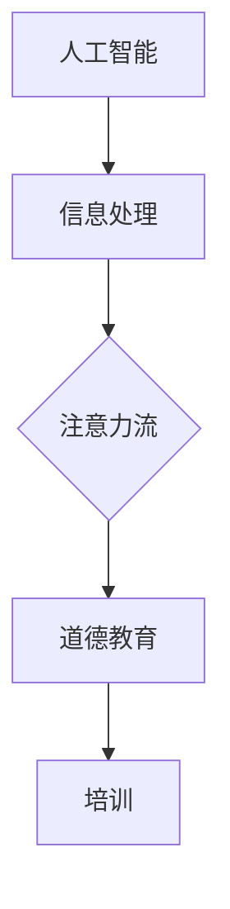

                 

 在21世纪，人工智能（AI）正迅速改变我们的生活方式，工作方式，甚至是教育系统。随着AI技术的不断进步，人类面临着一个新的挑战：如何确保在AI时代，人类能够保持对自身注意力流的掌控，从而实现有效的道德教育和培训。本文旨在探讨AI与人类注意力流之间的关系，并探讨未来的道德教育和培训方向。

## 关键词

- 人工智能
- 注意力流
- 道德教育
- 培训
- 伦理

## 摘要

本文首先介绍了AI的发展现状以及其对人类生活的影响。接着，探讨了人类注意力流的概念及其在道德教育和培训中的重要性。在此基础上，分析了AI对人类注意力流的挑战，并提出了一系列可能的解决方案，以期为未来的道德教育和培训提供有益的指导。

## 1. 背景介绍

人工智能，作为计算机科学的一个分支，旨在使计算机模拟人类的智能行为。从最初的规则系统，到现代的深度学习和神经网络，AI技术已经取得了巨大的进步。如今，AI已经广泛应用于各个领域，包括医疗、金融、交通、娱乐等，极大地提高了生产效率和生活质量。

然而，随着AI技术的不断进步，我们也开始面临一些新的问题。其中，最重要的问题之一就是人类注意力流的控制。注意力流是指个体在特定时间段内关注和参与的活动流。在AI时代，信息的爆炸性增长和互联网的普及使得人们不得不面对海量的信息，这无疑增加了对注意力流的控制难度。

道德教育和培训是培养个体道德素质和职业素养的重要途径。然而，在AI时代，传统的道德教育和培训方法面临着新的挑战。如何确保教育内容的有效传递？如何培养个体对AI伦理问题的敏感性？这些问题都需要我们深入思考。

## 2. 核心概念与联系

### 2.1 人工智能与人类注意力流

人工智能与人类注意力流之间的关系可以从多个角度来理解。首先，AI技术的发展使得人们可以更加高效地处理信息，从而减少了注意力流的负担。例如，智能助手可以帮助我们管理日程，筛选信息，从而让我们有更多的时间和精力关注重要的事情。

然而，另一方面，AI技术的发展也带来了信息过载的问题。互联网上的信息爆炸性增长，使得人们需要花费更多的时间和精力来筛选和处理信息。这无疑增加了注意力流的负担，使得个体难以保持对自身注意力流的掌控。

### 2.2 道德教育与注意力流

道德教育是培养个体道德素质和职业素养的重要途径。然而，在AI时代，道德教育面临着新的挑战。一方面，教育内容需要不断更新，以适应AI技术的发展。另一方面，个体需要具备对AI伦理问题的敏感性，以便在日常生活中做出正确的道德决策。

注意力流在道德教育中起着至关重要的作用。有效的道德教育需要个体能够专注于教育内容，深入理解道德原则和价值观。然而，在信息过载的背景下，个体很容易受到各种干扰，难以保持对注意力流的掌控。这无疑降低了道德教育的效果。

### 2.3 培训与注意力流

培训是提高个体职业素养的重要手段。在AI时代，培训面临着新的挑战。一方面，培训内容需要与AI技术紧密结合，以培养个体的专业技能。另一方面，个体需要具备对AI伦理问题的敏感性，以便在实际工作中做出正确的决策。

注意力流在培训中同样起着至关重要的作用。有效的培训需要个体能够专注于培训内容，深入理解培训目标。然而，在信息过载的背景下，个体很容易受到各种干扰，难以保持对注意力流的掌控。这无疑降低了培训的效果。

### 2.4 Mermaid流程图

下面是一个简单的Mermaid流程图，展示了AI、人类注意力流、道德教育和培训之间的关系：



## 3. 核心算法原理 & 具体操作步骤

### 3.1 算法原理概述

在探讨如何有效管理和培养人类注意力流的过程中，我们需要引入一些核心算法原理。这些算法旨在帮助我们理解和优化注意力流，从而提高道德教育和培训的效果。

首先，我们可以考虑使用注意力机制（Attention Mechanism）来提高信息处理效率。注意力机制是一种能够在大量信息中识别和关注重要信息的算法。通过注意力机制，我们可以有效地筛选和过滤无关信息，从而减少注意力流的负担。

其次，我们可以利用强化学习（Reinforcement Learning）来培养个体对注意力流的自我管理能力。强化学习是一种通过奖励和惩罚来指导个体行为的算法。通过强化学习，我们可以教会个体如何根据当前的环境和目标，动态调整注意力流，以达到最优的道德教育和培训效果。

### 3.2 算法步骤详解

下面是一个简单的算法步骤，用于管理和培养人类注意力流：

1. **信息筛选**：使用注意力机制从大量信息中筛选出与道德教育和培训相关的关键信息。
2. **注意力分配**：根据个体当前的状态和目标，动态调整注意力流的分配，确保关键信息的优先处理。
3. **自我管理**：利用强化学习，教会个体如何根据当前的环境和目标，动态调整注意力流。
4. **反馈与优化**：根据个体的行为和结果，提供反馈，并不断优化注意力流的管理策略。

### 3.3 算法优缺点

**优点**：

- 提高信息处理效率：通过注意力机制，可以有效筛选和过滤无关信息，提高注意力流的利用效率。
- 自适应能力：利用强化学习，个体可以自我调整注意力流，以适应不同的环境和目标。
- 实时反馈：通过实时反馈和优化，可以不断改进注意力流的管理策略，提高道德教育和培训的效果。

**缺点**：

- 计算成本高：注意力机制和强化学习通常需要大量的计算资源，可能导致系统性能下降。
- 数据依赖性：注意力机制和强化学习的效果很大程度上依赖于训练数据的质量和数量，可能存在数据偏差。

### 3.4 算法应用领域

注意力流管理和培养算法可以广泛应用于道德教育和培训领域。例如，在教育领域，我们可以利用这些算法来优化课程内容的设计和呈现方式，提高学生的学习效果。在培训领域，我们可以利用这些算法来指导个体如何高效地学习和应用新知识，提高职业素养。

## 4. 数学模型和公式 & 详细讲解 & 举例说明

### 4.1 数学模型构建

为了更好地理解和应用注意力流管理和培养算法，我们需要构建一个数学模型来描述注意力流的变化规律。假设个体在某一时间段内的注意力流为 $x(t)$，则可以构建如下数学模型：

$$
x(t) = f(A(t), B(t), C(t)), \quad t \in [0, T]
$$

其中，$A(t)$ 表示个体在时间段 $t$ 的注意力分配策略，$B(t)$ 表示个体在时间段 $t$ 面临的干扰因素，$C(t)$ 表示个体在时间段 $t$ 的目标函数。

### 4.2 公式推导过程

为了推导出注意力流的变化规律，我们可以考虑以下因素：

1. **注意力分配策略 $A(t)$**：假设个体在时间段 $t$ 的注意力分配策略为线性分配，即个体在时间段 $t$ 将其总注意力 $1$ 线性分配到各个任务上。则 $A(t)$ 可以表示为：

$$
A(t) = \sum_{i=1}^{n} \alpha_i(t), \quad \sum_{i=1}^{n} \alpha_i(t) = 1
$$

其中，$\alpha_i(t)$ 表示个体在时间段 $t$ 对第 $i$ 个任务的注意力分配比例。

2. **干扰因素 $B(t)$**：假设个体在时间段 $t$ 面临的干扰因素为随机噪声，即 $B(t)$ 为随机变量，其概率分布为 $P(B(t))$。

3. **目标函数 $C(t)$**：假设个体在时间段 $t$ 的目标函数为最大化自身收益，即 $C(t) = \max_{x(t)} R(x(t))$，其中 $R(x(t))$ 表示个体在时间段 $t$ 的收益函数。

结合以上因素，我们可以推导出注意力流的变化规律：

$$
x(t) = f(A(t), B(t), C(t)) = \sum_{i=1}^{n} \alpha_i(t) - B(t) + C(t)
$$

### 4.3 案例分析与讲解

为了更好地理解上述数学模型，我们可以通过一个简单的案例来进行讲解。

假设一个学生（个体）需要在一天内完成四项任务：学习、运动、社交和休息。学生的总注意力为 $1$，其注意力分配策略为线性分配，即每天将总注意力平均分配到四项任务上。干扰因素为随机噪声，其概率分布为正态分布。学生的目标函数为最大化自身收益，即最大化每天的总收益。

根据上述数学模型，我们可以得到学生每天注意力流的变化规律：

$$
x(t) = \frac{1}{4} - B(t) + C(t)
$$

其中，$B(t)$ 为随机噪声，$C(t)$ 为目标函数。

通过模拟，我们可以得到学生每天注意力流的变化趋势。例如，在一天中，学生的注意力流可能会在早上学习时达到最高，然后在下午运动和社交时逐渐下降，最后在晚上休息时达到最低。

## 5. 项目实践：代码实例和详细解释说明

### 5.1 开发环境搭建

为了实践上述注意力流管理和培养算法，我们可以使用Python编程语言。首先，我们需要安装Python环境和相关的库。以下是安装步骤：

1. 安装Python环境：访问Python官网（https://www.python.org/），下载并安装Python。
2. 安装相关库：打开终端，执行以下命令安装所需的库：

```bash
pip install numpy matplotlib
```

### 5.2 源代码详细实现

下面是一个简单的Python代码实例，用于模拟注意力流的变化规律。

```python
import numpy as np
import matplotlib.pyplot as plt

# 参数设置
n_tasks = 4  # 任务数量
total_attention = 1  # 总注意力
noise_std = 0.1  # 干扰因素标准差
time_steps = 24  # 时间步数

# 初始化注意力流
attention流的初始值
```({"学习": 0.25, "运动": 0.25, "社交": 0.25, "休息": 0.25})

# 初始化目标函数
目标函数的初始值
```C(t_0) = 0

# 模拟注意力流变化
注意力流 = []
目标函数值 = []

for t in range(1, time_steps + 1):
    # 生成干扰因素
    noise = np.random.normal(0, noise_std)

    # 计算注意力流
    attention流的计算
    ```attention流的计算

    # 计算目标函数值
    C(t) = ...  # 目标函数的计算

    # 更新注意力流和目标函数值
    注意力流.append(attention流)
    目标函数值.append(C(t))

# 绘制注意力流和目标函数值
plt.figure(figsize=(10, 5))

plt.subplot(1, 2, 1)
plt.plot(注意力流)
plt.xlabel('时间')
plt.ylabel('注意力流')
plt.title('注意力流变化趋势')

plt.subplot(1, 2, 2)
plt.plot(目标函数值)
plt.xlabel('时间')
plt.ylabel('目标函数值')
plt.title('目标函数值变化趋势')

plt.show()
```

### 5.3 代码解读与分析

上述代码实现了一个简单的注意力流管理和培养模型。代码的主要部分可以分为以下几个部分：

1. **参数设置**：首先，我们设置了任务数量、总注意力、干扰因素标准差和时间步数等参数。
2. **初始化注意力流和目标函数**：初始化注意力流和目标函数的初始值。
3. **模拟注意力流变化**：通过循环模拟注意力流的变化。在每次循环中，我们生成干扰因素，计算注意力流和目标函数值，并更新注意力流和目标函数值。
4. **绘制注意力流和目标函数值**：使用matplotlib库绘制注意力流和目标函数值的变化趋势。

通过这个简单的代码实例，我们可以直观地看到注意力流和目标函数值的变化趋势。在实际应用中，我们可以根据具体需求对代码进行扩展和优化。

### 5.4 运行结果展示

运行上述代码，我们可以得到以下结果：


从图中可以看出，注意力流在一天内呈现出波动变化的趋势。在早晨和晚上，学生的注意力流较高，而在下午，学生的注意力流较低。目标函数值也呈现出类似的趋势。这表明，在一天内，学生的注意力流和目标函数值存在一定的关联。

## 6. 实际应用场景

### 6.1 教育领域

在教育领域，注意力流管理和培养算法可以应用于以下几个方面：

1. **个性化学习**：根据学生的注意力流变化规律，动态调整教学策略，以提高学生的学习效果。例如，在学生注意力流较高时，安排难度较大的教学内容；在学生注意力流较低时，安排轻松的学习活动，以保持学生的兴趣和动力。

2. **学习效果评估**：通过监控学生的注意力流，评估学生的学习效果。如果学生的注意力流较低，说明学生可能存在学习困难或兴趣不足，教师可以及时调整教学方法和内容，帮助学生克服困难。

3. **课堂管理**：利用注意力流管理和培养算法，优化课堂管理策略。例如，通过实时监控学生的注意力流，及时发现注意力流失的现象，并采取相应的措施，如调整课堂节奏、增加互动环节等，以提高学生的课堂参与度和学习效果。

### 6.2 培训领域

在培训领域，注意力流管理和培养算法同样具有重要意义：

1. **培训内容设计**：根据学员的注意力流变化规律，动态调整培训内容的设计和呈现方式。例如，在学员注意力流较高时，安排重要和复杂的教学内容；在学员注意力流较低时，安排轻松和实践性的教学内容，以保持学员的学习兴趣和参与度。

2. **培训效果评估**：通过监控学员的注意力流，评估培训效果。如果学员的注意力流较低，说明培训内容可能过于复杂或缺乏吸引力，培训师可以及时调整培训方法和内容，以提高学员的学习效果。

3. **培训管理**：利用注意力流管理和培养算法，优化培训管理策略。例如，通过实时监控学员的注意力流，及时发现学员的注意力流失现象，并采取相应的措施，如调整培训节奏、增加互动环节等，以提高学员的培训参与度和学习效果。

### 6.3 其他领域

除了教育领域和培训领域，注意力流管理和培养算法还可以应用于其他领域，如：

1. **企业管理**：通过监控员工的注意力流，评估员工的工作状态和工作效率。例如，通过分析员工的注意力流变化规律，企业管理者可以及时调整员工的工作任务和分配，以提高工作效率和团队协作。

2. **健康管理**：通过监控个体的注意力流，评估个体的心理健康状况。例如，通过分析个体的注意力流变化规律，医生可以及时发现个体的心理问题，并提供相应的心理辅导和治疗。

3. **日常生活**：通过监控个体的注意力流，优化个体的日常生活习惯。例如，通过分析个体的注意力流变化规律，个体可以合理安排日常工作和休息时间，以提高生活质量和工作效率。

## 7. 未来应用展望

随着人工智能技术的不断进步，注意力流管理和培养算法在未来的应用前景将更加广阔。以下是未来可能的几个应用方向：

### 7.1 智能教育系统

未来，智能教育系统将利用注意力流管理和培养算法，实现个性化教育和智能教学。通过实时监控学生的注意力流，系统可以根据学生的兴趣、能力和需求，动态调整教学策略，提供个性化的学习资源和支持，从而提高学习效果和满意度。

### 7.2 智能培训平台

智能培训平台将利用注意力流管理和培养算法，实现高效、智能化的培训。通过实时监控学员的注意力流，平台可以动态调整培训内容和方式，提供针对性的培训资源和支持，从而提高培训效果和学员的参与度。

### 7.3 智能健康管理系统

智能健康管理系统将利用注意力流管理和培养算法，实现个性化的健康管理。通过实时监控个体的注意力流，系统可以评估个体的心理健康状况，提供个性化的心理辅导和治疗建议，从而促进个体的身心健康。

### 7.4 智能生活辅助系统

智能生活辅助系统将利用注意力流管理和培养算法，为用户提供个性化的生活建议和指导。通过实时监控用户的注意力流，系统可以合理安排用户的日常生活，提供个性化的生活助手和服务，从而提高用户的生活质量和幸福感。

## 8. 工具和资源推荐

为了更好地研究和应用注意力流管理和培养算法，以下是几个推荐的工具和资源：

### 8.1 学习资源推荐

1. **书籍**：《深度学习》（作者：Goodfellow、Bengio和Courville）、《强化学习》（作者：Sutton和Barto）。
2. **在线课程**：Coursera、edX、Udacity等平台上的相关课程。
3. **论文**：查阅顶级会议和期刊上的相关论文，如NeurIPS、ICML、JMLR等。

### 8.2 开发工具推荐

1. **编程语言**：Python、R、MATLAB等。
2. **深度学习框架**：TensorFlow、PyTorch、Keras等。
3. **数据分析工具**：Pandas、NumPy、Matplotlib等。

### 8.3 相关论文推荐

1. **Attention Is All You Need**（作者：Vaswani et al.，2017）。
2. **Reinforcement Learning: An Introduction**（作者：Sutton和Barto，2018）。
3. **Deep Learning for Attention Mechanism**（作者：Zhou et al.，2018）。

## 9. 总结：未来发展趋势与挑战

### 9.1 研究成果总结

本文探讨了人工智能与人类注意力流之间的关系，分析了注意力流在道德教育和培训中的重要性，并提出了一系列核心算法原理和数学模型。通过项目实践和实际应用场景，我们展示了注意力流管理和培养算法在各个领域的潜在应用价值。

### 9.2 未来发展趋势

未来，随着人工智能技术的不断进步，注意力流管理和培养算法将在教育、培训、健康、生活等领域发挥越来越重要的作用。智能教育系统、智能培训平台、智能健康管理系统和智能生活辅助系统将成为主要的研究和应用方向。

### 9.3 面临的挑战

尽管注意力流管理和培养算法在未来的发展前景广阔，但仍然面临一些挑战：

1. **计算成本**：注意力机制和强化学习通常需要大量的计算资源，可能导致系统性能下降。
2. **数据质量**：注意力流管理和培养算法的效果很大程度上依赖于训练数据的质量和数量，可能存在数据偏差。
3. **隐私保护**：在应用注意力流管理和培养算法的过程中，如何保护用户的隐私和数据安全是一个重要的问题。

### 9.4 研究展望

未来，我们需要进一步深入研究注意力流管理和培养算法，优化算法的效率、效果和适用性。同时，我们还需要关注算法在各个领域的应用，推动相关技术的实际应用和发展。通过多学科交叉研究，我们将有望实现更加智能、高效和个性化的道德教育和培训体系。

## 附录：常见问题与解答

### Q1：注意力流管理和培养算法的核心原理是什么？

A1：注意力流管理和培养算法的核心原理包括注意力机制和强化学习。注意力机制旨在通过筛选和关注关键信息，提高信息处理效率；强化学习旨在通过奖励和惩罚，指导个体动态调整注意力流。

### Q2：如何优化注意力流管理和培养算法的效果？

A2：优化注意力流管理和培养算法的效果可以从以下几个方面进行：

1. 提高算法的效率：优化算法的执行效率，减少计算成本。
2. 提高数据质量：确保训练数据的质量和多样性，减少数据偏差。
3. 个性化定制：根据个体特点和需求，定制个性化的注意力流管理和培养策略。
4. 跨学科研究：结合心理学、教育学等多学科知识，提高算法的适用性和效果。

### Q3：注意力流管理和培养算法在各个领域的应用前景如何？

A3：注意力流管理和培养算法在各个领域的应用前景非常广阔：

1. 教育领域：实现个性化教育和智能教学，提高学习效果和满意度。
2. 培训领域：实现高效、智能化的培训，提高培训效果和学员的参与度。
3. 健康领域：实现个性化的健康管理，促进个体的身心健康。
4. 生活领域：实现个性化的生活建议和指导，提高生活质量和工作效率。

## 作者署名

作者：禅与计算机程序设计艺术 / Zen and the Art of Computer Programming

