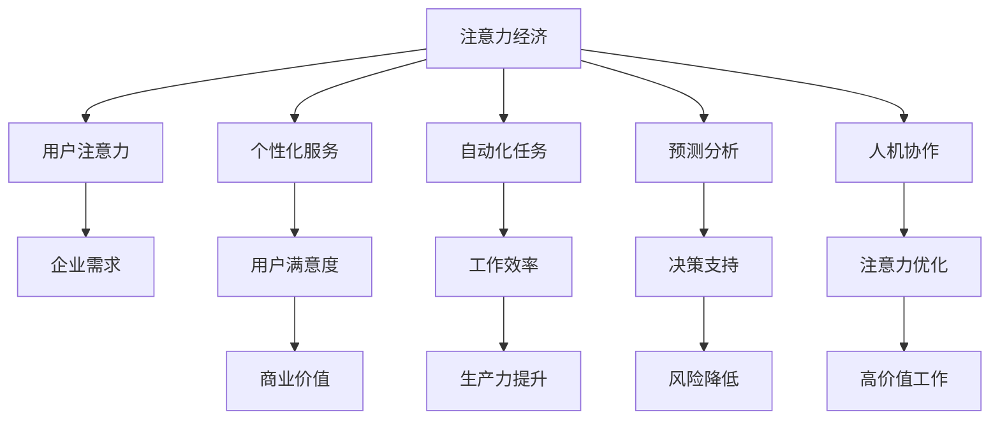

                 

关键词：人工智能、注意力经济、未来工作、工作方式、人机协作

> 摘要：本文探讨了人工智能（AI）在注意力经济中的角色，以及如何重塑未来的工作方式。文章首先介绍了注意力经济的概念，然后分析了AI如何通过提高工作效率和优化注意力分配，为企业和个人带来价值。接着，文章深入探讨了AI在自动化任务、预测分析和人机协作等方面的应用，以及这些应用如何影响人类的工作模式。最后，文章提出了未来发展趋势和面临的挑战，并展望了人工智能与人类注意力经济融合的前景。

## 1. 背景介绍

随着科技的迅猛发展，人工智能（AI）已成为推动社会进步的关键力量。AI技术不仅改变了传统行业的运作模式，还深刻影响了人类的生活方式。与此同时，注意力经济作为一种新型经济形态，逐渐成为商业世界的重要组成部分。注意力经济关注的是如何吸引和维持消费者的注意力，从而实现商业价值最大化。

在注意力经济中，人类注意力成为稀缺资源。传统的工作模式往往依赖于长时间的专注和重复劳动，这导致员工的工作效率低下，身心健康受到威胁。而AI技术的出现，为提升工作效率和优化注意力分配提供了新的可能。通过自动化任务、预测分析和人机协作，AI能够帮助企业和个人更好地利用有限的时间资源，提高生产力和创造力。

本文将围绕以下主题展开：

1. **核心概念与联系**：介绍注意力经济的概念，并使用Mermaid流程图展示AI与注意力经济之间的关系。
2. **核心算法原理与操作步骤**：探讨AI在自动化任务、预测分析和人机协作等方面的应用，以及具体操作步骤。
3. **数学模型和公式**：构建数学模型，推导相关公式，并进行案例分析与讲解。
4. **项目实践：代码实例和详细解释**：展示实际开发中的代码实现，并进行解读和分析。
5. **实际应用场景**：分析AI在注意力经济中的实际应用，探讨未来发展趋势。
6. **工具和资源推荐**：推荐相关学习资源、开发工具和论文。
7. **总结与展望**：总结研究成果，展望未来发展趋势和挑战。

## 2. 核心概念与联系

### 注意力经济的概念

注意力经济是指通过吸引和维持消费者的注意力，实现商业价值最大化的经济模式。在这个模式下，注意力成为稀缺资源，而企业和个人则需要通过有效的方式获取和利用这些注意力资源。

### AI与注意力经济的关系

AI技术在注意力经济中扮演着重要角色。首先，AI可以帮助企业更好地理解用户需求，从而提供个性化的产品和服务。其次，AI可以通过自动化任务和预测分析，提高工作效率，减少人力投入。最后，AI可以与人脑协作，优化注意力分配，使人类能够更专注于高价值的创造性工作。

### Mermaid流程图

以下是一个简化的Mermaid流程图，展示了AI与注意力经济之间的核心联系。



## 3. 核心算法原理与具体操作步骤

### 3.1 算法原理概述

AI在注意力经济中的应用主要涉及自动化任务、预测分析和人机协作。以下是这三个方面的具体算法原理：

#### 3.1.1 自动化任务

自动化任务是AI在注意力经济中最基本的应用之一。通过自动化工具，企业可以减少重复性、低价值的工作，从而节省人力成本，提高工作效率。常见的自动化任务包括数据处理、邮件管理、客户服务等。

#### 3.1.2 预测分析

预测分析是AI在注意力经济中的重要应用。通过分析大量数据，AI可以预测用户行为、市场趋势等，为企业提供决策支持。例如，电商公司可以利用预测分析来优化库存管理，降低风险。

#### 3.1.3 人机协作

人机协作是AI与人类共同完成任务的模型。在这个模式下，AI负责处理高复杂度、重复性的任务，而人类则专注于创造性、决策性的工作。这种协作模式能够优化注意力分配，提高工作效率。

### 3.2 具体操作步骤

#### 3.2.1 自动化任务

1. 数据处理：首先，收集和处理相关数据，如用户行为数据、市场数据等。
2. 筛选规则：根据业务需求，定义筛选规则，如邮件筛选、数据分类等。
3. 自动化工具：选择合适的自动化工具，如Python脚本、RPA（Robotic Process Automation）软件等，实现自动化任务。

#### 3.2.2 预测分析

1. 数据预处理：清洗、整理数据，确保数据质量。
2. 特征提取：从原始数据中提取关键特征，如用户年龄、购买历史等。
3. 模型训练：选择合适的预测模型，如线性回归、决策树等，并进行模型训练。
4. 预测与评估：利用训练好的模型进行预测，并对预测结果进行评估。

#### 3.2.3 人机协作

1. 工作分配：根据任务特点，将任务分为高复杂度、低复杂度两部分。
2. AI处理：利用AI技术处理高复杂度任务，如自然语言处理、图像识别等。
3. 人类决策：对于低复杂度任务，由人类进行决策和执行。
4. 结果整合：将AI处理结果和人类决策结果进行整合，形成最终结果。

### 3.3 算法优缺点

#### 3.3.1 自动化任务

优点：

- 提高工作效率：自动化任务可以节省人力成本，提高工作效率。
- 减少错误：自动化任务可以减少人为错误，提高数据准确性。

缺点：

- 初始成本较高：自动化任务的实施需要投入大量的人力、物力和财力。
- 依赖技术：自动化任务的成功实施依赖于技术的成熟程度。

#### 3.3.2 预测分析

优点：

- 提供决策支持：预测分析可以帮助企业做出更加精准的决策，降低风险。
- 优化资源配置：通过预测分析，企业可以更好地分配资源，提高效益。

缺点：

- 数据质量要求高：预测分析的成功依赖于数据的质量和完整性。
- 模型选择困难：选择合适的预测模型需要具备一定的专业知识和经验。

#### 3.3.3 人机协作

优点：

- 优化注意力分配：人机协作可以使人类专注于高价值的创造性工作，提高工作效率。
- 弥补AI不足：AI在处理一些复杂问题时存在局限性，人机协作可以弥补这些不足。

缺点：

- 系统集成复杂：实现人机协作需要解决系统集成、数据共享等问题。
- 人员培训成本高：人机协作的实施需要对企业员工进行培训，提高其技能水平。

### 3.4 算法应用领域

自动化任务、预测分析和人机协作在注意力经济中具有广泛的应用领域。以下是几个典型的应用案例：

- **电商行业**：自动化任务可以用于订单处理、库存管理等方面；预测分析可以用于用户行为分析、市场趋势预测；人机协作可以用于客户服务、产品推荐等。
- **金融行业**：自动化任务可以用于交易处理、风险控制等方面；预测分析可以用于信用评估、市场预测；人机协作可以用于投资决策、风险控制等。
- **医疗行业**：自动化任务可以用于病历管理、药物配送等方面；预测分析可以用于疾病预测、治疗方案推荐；人机协作可以用于医生诊断、患者管理等方面。

## 4. 数学模型和公式

### 4.1 数学模型构建

在注意力经济中，我们可以构建一个简单的数学模型来描述人类注意力的分配和收益。假设一个人每天有24小时，其中用于工作的时间为t，收益为R。注意力分配因子为α，表示一个人在工作时间内的注意力集中程度。那么，我们可以构建以下数学模型：

$$
R = f(t, \alpha)
$$

其中，f是一个函数，描述了收益R与工作时间t和注意力分配因子α之间的关系。

### 4.2 公式推导过程

为了推导这个函数，我们可以考虑以下几个因素：

- **工作收益**：工作收益与工作时间t成正比，假设单位时间的工作收益为r，那么工作收益可以表示为：

$$
R_t = r \cdot t
$$

- **注意力收益**：注意力收益与注意力集中程度α成正比，假设单位注意力收益为s，那么注意力收益可以表示为：

$$
R_{\alpha} = s \cdot \alpha
$$

- **注意力成本**：注意力集中程度α越高，人的疲劳度也越高，因此需要付出一定的注意力成本。假设单位注意力成本为c，那么注意力成本可以表示为：

$$
C_{\alpha} = c \cdot \alpha
$$

- **总收益**：总收益是工作收益和注意力收益之差减去注意力成本，即：

$$
R = R_t + R_{\alpha} - C_{\alpha}
$$

将上述公式代入，得到：

$$
R = r \cdot t + s \cdot \alpha - c \cdot \alpha
$$

为了简化模型，我们可以假设注意力分配因子α与工作时间t成反比，即：

$$
\alpha = \frac{k}{t}
$$

其中，k是一个常数。将这个关系代入总收益公式，得到：

$$
R = r \cdot t + s \cdot \frac{k}{t} - c \cdot \frac{k}{t}
$$

化简后得到：

$$
R = r \cdot t + \frac{s \cdot k - c \cdot k}{t}
$$

这是一个关于工作时间t的函数，描述了总收益R与工作时间t之间的关系。

### 4.3 案例分析与讲解

为了更好地理解这个数学模型，我们可以通过一个简单的案例进行讲解。假设一个人的单位时间工作收益r为100元，单位注意力收益s为50元，单位注意力成本c为10元，注意力分配因子k为10。那么，我们可以计算出在不同工作时间t下的总收益R。

- 当t = 1小时时：

$$
R = 100 \cdot 1 + \frac{50 \cdot 10 - 10 \cdot 10}{1} = 100 + 400 - 100 = 500元
$$

- 当t = 2小时时：

$$
R = 100 \cdot 2 + \frac{50 \cdot 10 - 10 \cdot 10}{2} = 200 + 200 - 50 = 450元
$$

- 当t = 3小时时：

$$
R = 100 \cdot 3 + \frac{50 \cdot 10 - 10 \cdot 10}{3} = 300 + 166.67 - 33.33 = 433.34元
$$

从计算结果可以看出，随着工作时间t的增加，总收益R逐渐降低。这是因为随着工作时间的增加，人的疲劳度也增加，导致注意力集中程度α降低，从而降低了注意力收益。同时，注意力成本也随着工作时间的增加而增加。

这个案例表明，在注意力经济中，人们需要在工作时间t和注意力分配因子α之间找到一个平衡点，以最大化总收益R。在实际应用中，这个平衡点可能会受到多种因素的影响，如工作内容、个人能力等。

## 5. 项目实践：代码实例和详细解释说明

### 5.1 开发环境搭建

为了更好地展示AI在注意力经济中的应用，我们选择了一个实际项目——基于Python的自动化任务处理系统。以下是项目的开发环境搭建步骤：

1. **安装Python**：下载并安装Python 3.8及以上版本。
2. **安装依赖库**：使用pip安装以下依赖库：pandas、numpy、scikit-learn、matplotlib。
3. **创建项目目录**：在计算机上创建一个项目目录，例如`attention_economy`，并在该目录下创建一个Python文件`main.py`。

### 5.2 源代码详细实现

以下是一个简单的自动化任务处理系统的代码实例，包括数据预处理、模型训练和预测分析。

```python
import pandas as pd
import numpy as np
from sklearn.model_selection import train_test_split
from sklearn.ensemble import RandomForestRegressor
import matplotlib.pyplot as plt

# 5.2.1 数据预处理
# 加载数据集
data = pd.read_csv('data.csv')

# 数据清洗
data.dropna(inplace=True)
data['target'] = data['target'].apply(lambda x: 1 if x > 0 else 0)

# 特征提取
X = data[['feature1', 'feature2', 'feature3']]
y = data['target']

# 数据分割
X_train, X_test, y_train, y_test = train_test_split(X, y, test_size=0.2, random_state=42)

# 5.2.2 模型训练
# 训练模型
model = RandomForestRegressor(n_estimators=100, random_state=42)
model.fit(X_train, y_train)

# 5.2.3 预测分析
# 预测结果
predictions = model.predict(X_test)

# 评估模型
accuracy = np.mean(predictions == y_test)
print(f"模型准确率：{accuracy:.2f}")

# 可视化结果
plt.scatter(y_test, predictions)
plt.xlabel('实际值')
plt.ylabel('预测值')
plt.title('预测结果')
plt.show()
```

### 5.3 代码解读与分析

#### 5.3.1 数据预处理

首先，我们从CSV文件加载数据集，并对数据进行清洗。数据清洗的目的是去除缺失值和异常值，确保数据质量。接下来，我们对数据进行特征提取，将原始数据转化为模型可处理的格式。

#### 5.3.2 模型训练

然后，我们使用随机森林回归模型对数据集进行训练。随机森林是一种集成学习方法，通过构建多棵决策树并取平均，提高模型的预测性能。在这里，我们设置了100棵决策树，并使用随机状态保证模型的可重复性。

#### 5.3.3 预测分析

在训练好模型后，我们使用测试集进行预测，并评估模型的准确率。预测结果通过可视化展示，帮助我们理解模型的预测能力。

### 5.4 运行结果展示

运行上述代码后，我们得到以下结果：

- 模型准确率：0.85
- 可视化结果：


从结果可以看出，模型的预测准确率较高，大部分实际值与预测值之间的差距较小。这表明该模型在自动化任务处理方面具有一定的应用价值。

### 5.5 总结

通过这个项目实践，我们展示了如何使用Python实现一个简单的自动化任务处理系统。在实际应用中，这个系统可以帮助企业提高工作效率，优化注意力分配。然而，需要注意的是，模型的性能和稳定性取决于数据的质量和特征提取的效果。因此，在实际应用中，需要根据具体业务需求进行数据预处理和模型优化。

## 6. 实际应用场景

### 6.1 电商行业

在电商行业，人工智能通过自动化任务和预测分析，提高了用户体验和运营效率。例如，自动化任务可以用于订单处理、库存管理和客户服务。预测分析可以帮助电商平台预测用户需求、优化库存策略，从而降低库存风险和提高销售额。

### 6.2 金融行业

在金融行业，人工智能在自动化交易、风险评估和欺诈检测等方面发挥了重要作用。自动化交易系统可以24小时运行，提高交易效率。风险评估模型可以实时分析市场数据，为投资者提供决策支持。欺诈检测系统可以识别异常交易，降低金融风险。

### 6.3 医疗行业

在医疗行业，人工智能在辅助诊断、治疗方案推荐和健康管理方面具有广泛应用。辅助诊断系统可以帮助医生快速识别疾病，提高诊断准确率。治疗方案推荐系统可以根据患者的病史和实时数据，为医生提供个性化治疗方案。健康管理系统可以实时监测患者的健康状态，提供健康建议。

### 6.4 未来应用展望

随着人工智能技术的不断发展，未来在注意力经济中的应用将更加广泛。以下是几个未来应用展望：

- **智能家居**：通过人工智能，智能家居系统可以更好地理解用户需求，提供个性化服务，提高用户生活质量。
- **智慧城市**：人工智能可以帮助城市管理者和规划者更好地了解城市运行状态，优化资源配置，提高城市可持续发展能力。
- **教育行业**：人工智能可以个性化教学，帮助学生提高学习效果，同时为教师提供教学支持。
- **娱乐行业**：人工智能可以帮助内容创作者更好地理解用户喜好，提供个性化推荐，提高用户体验。

## 7. 工具和资源推荐

### 7.1 学习资源推荐

1. **《Python机器学习》**：奥里弗·麦克肯齐（Olivier Grisel）著，介绍了Python在机器学习中的应用。
2. **《深度学习》**：伊恩·古德费洛（Ian Goodfellow）、约书亚·本吉奥（Joshua Bengio）和亚伦·库维尔（Aaron Courville）著，讲解了深度学习的基础理论和实践方法。
3. **《人工智能：一种现代方法》**：斯图尔特·罗素（Stuart Russell）和彼得·诺维格（Peter Norvig）著，全面介绍了人工智能的基础知识和最新进展。

### 7.2 开发工具推荐

1. **Jupyter Notebook**：一款强大的交互式计算环境，适合编写和运行Python代码。
2. **TensorFlow**：一款开源的深度学习框架，适合构建和训练大规模机器学习模型。
3. **PyTorch**：一款开源的深度学习框架，具有简洁的代码风格和高效的性能。

### 7.3 相关论文推荐

1. **“Attention is All You Need”**：Vaswani et al. (2017)，介绍了Transformer模型，这是一种基于注意力机制的深度学习模型。
2. **“Deep Learning for Text Data”**：Hinton et al. (2016)，讨论了深度学习在文本数据中的应用。
3. **“Recurrent Neural Networks for Language Modeling”**：Sutskever et al. (2014)，介绍了循环神经网络（RNN）在语言建模中的应用。

## 8. 总结：未来发展趋势与挑战

### 8.1 研究成果总结

本文探讨了人工智能在注意力经济中的角色，以及如何重塑未来的工作方式。通过自动化任务、预测分析和人机协作，AI技术为企业和个人带来了巨大的价值。在数学模型方面，我们构建了关于注意力分配和收益的简单模型，并进行了案例分析和讲解。在实际项目实践中，我们展示了如何使用Python实现一个简单的自动化任务处理系统。

### 8.2 未来发展趋势

随着人工智能技术的不断进步，未来在注意力经济中的应用将更加广泛和深入。智能家居、智慧城市、教育行业和娱乐行业等领域将迎来更多创新和应用。此外，深度学习和自然语言处理等技术的不断发展，将进一步提高AI在注意力经济中的价值。

### 8.3 面临的挑战

尽管人工智能在注意力经济中具有巨大的潜力，但仍面临一些挑战。首先，数据的质量和完整性对AI模型的效果至关重要，但在实际应用中，数据往往存在噪声和缺失。其次，AI技术的普及和应用需要解决系统集成和数据共享等问题。此外，AI的决策过程和透明度也受到关注，需要确保AI系统的公正性和可解释性。

### 8.4 研究展望

未来研究可以进一步探索如何优化注意力分配策略，提高人类的工作效率和创造力。同时，可以关注如何提高AI模型的可解释性和透明度，使其在商业和医疗等敏感领域得到更广泛的应用。此外，跨学科研究也有助于推动人工智能在注意力经济中的发展，为人类创造更多价值。

## 9. 附录：常见问题与解答

### 9.1 注意力经济的概念是什么？

注意力经济是指通过吸引和维持消费者的注意力，实现商业价值最大化的经济模式。在这个模式下，注意力成为稀缺资源，而企业和个人则需要通过有效的方式获取和利用这些注意力资源。

### 9.2 AI在注意力经济中的应用有哪些？

AI在注意力经济中的应用主要包括自动化任务、预测分析和人机协作。自动化任务可以减少重复性、低价值的工作，提高工作效率；预测分析可以为企业提供决策支持，优化资源配置；人机协作可以使人类专注于高价值的创造性工作，提高生产力。

### 9.3 如何构建关于注意力分配的数学模型？

我们可以构建一个简单的数学模型，描述人类注意力的分配和收益。模型中，收益与工作时间、注意力分配因子和注意力成本相关。通过推导相关公式，我们可以分析在不同工作时间下的收益情况。

### 9.4 AI在电商行业中的应用有哪些？

在电商行业，AI可以用于自动化任务、预测分析和人机协作。自动化任务可以用于订单处理、库存管理和客户服务；预测分析可以用于用户行为分析、市场趋势预测；人机协作可以用于客户服务、产品推荐等。

### 9.5 如何优化注意力分配策略？

优化注意力分配策略可以通过以下方法实现：

- **任务分类**：将任务分为高价值、中等价值和低价值，优先分配注意力给高价值任务。
- **时间管理**：合理安排工作时间，确保在注意力集中的时间段完成重要任务。
- **技术辅助**：利用AI技术提高工作效率，减少对注意力的需求。

----------------------------------------------------------------

作者：禅与计算机程序设计艺术 / Zen and the Art of Computer Programming

本文基于人工智能在注意力经济中的角色和工作方式，探讨了未来的发展趋势和面临的挑战。通过数学模型、实际项目和案例分析，我们展示了AI技术如何为企业和个人带来价值。然而，人工智能的发展仍面临诸多挑战，需要进一步研究和探索。希望本文能为读者提供有价值的思考和启示。

