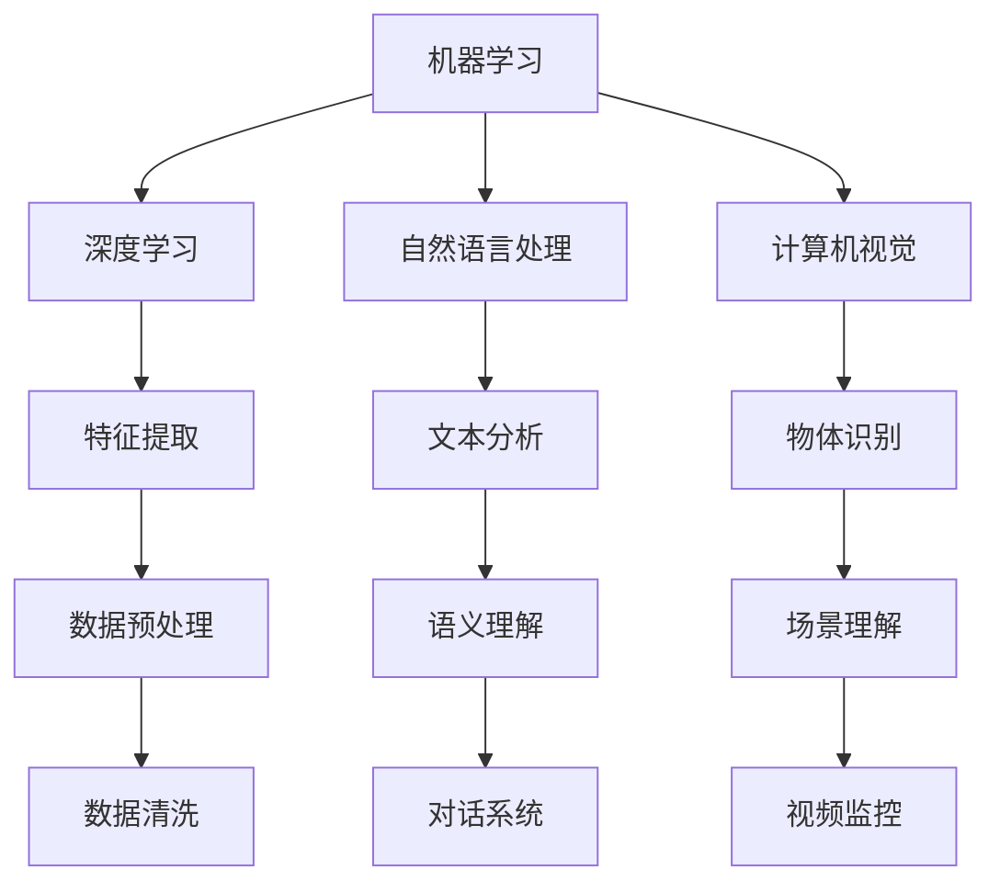

                 

关键词：人工智能，人类，未来，互动，合作，技术进步，社会影响，伦理问题

> 摘要：本文探讨了人工智能与人类未来的互动与合作。从技术进步的角度出发，分析了人工智能在各个领域的应用，探讨了人类与人工智能之间的关系，提出了合作与伦理问题的解决策略，并展望了未来的发展趋势与挑战。

## 1. 背景介绍

随着科技的飞速发展，人工智能（AI）已成为现代社会的核心驱动力。从最初的简单计算到如今的复杂算法，人工智能技术不断突破，为人类带来了前所未有的便利和改变。从语音识别、图像处理到自动驾驶、智能医疗，人工智能正在逐渐渗透到我们生活的方方面面。然而，人工智能的快速发展也引发了诸多社会问题和伦理挑战，如何与人类进行有效的互动与合作成为亟待解决的问题。

### 人工智能的发展历程

人工智能的发展可以追溯到20世纪50年代。当时，计算机科学家们开始探讨如何让计算机模拟人类的思维过程。最初的人工智能系统主要是基于规则和符号逻辑的，例如早期的专家系统和逻辑推理机。随着计算机性能的提升和算法的优化，人工智能技术逐渐成熟，开始应用于各行各业。

进入21世纪，深度学习、神经网络等先进算法的出现，使得人工智能取得了前所未有的突破。这些算法通过大量数据的学习和训练，能够自动提取特征、进行预测和决策，大大提升了人工智能的性能和适用范围。

### 人工智能的当前应用

如今，人工智能已经广泛应用于各个领域，包括但不限于：

- **智能家居**：智能音箱、智能灯泡、智能冰箱等设备，让家庭生活更加便捷。
- **智能交通**：自动驾驶技术、智能交通信号系统，提高了交通效率和安全性。
- **智能医疗**：智能诊断、智能药物设计，助力医疗行业的创新与发展。
- **金融科技**：智能投顾、风险评估，为金融行业提供智能化解决方案。
- **教育**：智能教育平台、个性化学习推荐，提升了教育质量和效果。

## 2. 核心概念与联系

为了更好地理解人工智能与人类的互动与合作，我们需要明确一些核心概念和它们之间的关系。

### 人工智能的核心概念

- **机器学习**：通过数据驱动的方式，使计算机自动获取知识和技能。
- **深度学习**：一种基于神经网络的学习方法，能够自动提取特征和模式。
- **自然语言处理**：使计算机能够理解和生成自然语言，实现人机交互。
- **计算机视觉**：使计算机能够理解和分析图像和视频，实现物体识别和场景理解。

### 人工智能与人类的关系

- **辅助角色**：人工智能作为人类的助手，能够提高工作效率和生活质量。
- **竞争关系**：在某些领域，人工智能可能会取代人类的工作，引发就业问题。
- **伙伴关系**：人工智能与人类共同合作，创造新的价值和创新。

### 人工智能与伦理问题

- **隐私保护**：人工智能系统在收集和处理数据时，如何保护用户的隐私。
- **算法偏见**：人工智能算法在训练过程中，可能会学习到社会偏见，导致不公平的结果。
- **责任归属**：当人工智能系统发生错误或造成损害时，如何界定责任。

### 人工智能架构的 Mermaid 流程图



## 3. 核心算法原理 & 具体操作步骤

### 3.1 算法原理概述

人工智能的核心算法主要包括机器学习、深度学习、自然语言处理和计算机视觉。这些算法通过不同的方式，使计算机能够从数据中学习和提取知识。

- **机器学习**：通过训练模型，使计算机能够从数据中自动学习和发现规律。
- **深度学习**：基于神经网络的结构，通过多层非线性变换，实现复杂的特征提取和模式识别。
- **自然语言处理**：通过理解自然语言，实现人机交互和信息检索。
- **计算机视觉**：通过图像和视频数据的处理，实现物体识别和场景理解。

### 3.2 算法步骤详解

- **机器学习**：
  1. 数据采集：收集大量具有标签的数据。
  2. 数据预处理：对数据进行清洗、归一化等处理。
  3. 特征提取：通过特征工程，将原始数据转换为特征向量。
  4. 模型训练：使用训练数据，通过优化算法，更新模型参数。
  5. 模型评估：使用验证数据，评估模型的性能。

- **深度学习**：
  1. 数据预处理：对图像、文本等数据进行预处理，将其转换为神经网络可以处理的格式。
  2. 构建神经网络：设计网络结构，包括输入层、隐藏层和输出层。
  3. 模型训练：通过反向传播算法，不断更新网络参数，优化模型。
  4. 模型评估：使用验证数据，评估模型的性能。

- **自然语言处理**：
  1. 数据预处理：对文本数据进行清洗、分词、去停用词等处理。
  2. 词嵌入：将文本转换为向量表示。
  3. 构建模型：设计循环神经网络（RNN）、卷积神经网络（CNN）或其他模型。
  4. 模型训练：通过优化算法，更新模型参数。
  5. 模型评估：使用验证数据，评估模型的性能。

- **计算机视觉**：
  1. 数据预处理：对图像数据进行处理，如归一化、缩放等。
  2. 特征提取：通过卷积神经网络等算法，提取图像特征。
  3. 物体识别：使用分类算法，对图像中的物体进行识别。
  4. 场景理解：通过多模态学习，理解图像和视频中的场景。

### 3.3 算法优缺点

- **机器学习**：
  - 优点：能够自动发现数据中的规律，适应性强。
  - 缺点：对数据质量要求高，模型复杂度较高。

- **深度学习**：
  - 优点：能够处理复杂的特征，效果较好。
  - 缺点：对计算资源要求高，模型难以解释。

- **自然语言处理**：
  - 优点：能够实现人机交互，提高信息检索效率。
  - 缺点：对语言理解要求高，数据处理复杂。

- **计算机视觉**：
  - 优点：能够处理图像和视频数据，应用广泛。
  - 缺点：对计算资源要求高，物体识别准确性有限。

### 3.4 算法应用领域

- **机器学习**：推荐系统、金融风控、智能客服等。
- **深度学习**：图像识别、语音识别、自然语言处理等。
- **自然语言处理**：智能助手、机器翻译、文本分类等。
- **计算机视觉**：自动驾驶、智能监控、医学影像分析等。

## 4. 数学模型和公式 & 详细讲解 & 举例说明

### 4.1 数学模型构建

人工智能中的数学模型主要分为两类：监督学习和无监督学习。

- **监督学习**：通过训练数据集，建立输入与输出之间的映射关系。

  - 模型构建：

    $$ y = f(x; \theta) $$

    其中，$x$为输入特征，$y$为输出标签，$f$为模型函数，$\theta$为模型参数。

  - 模型优化：

    通过梯度下降算法，不断更新模型参数，使得模型在训练数据集上达到最优。

    $$ \theta = \theta - \alpha \frac{\partial J(\theta)}{\partial \theta} $$

    其中，$\alpha$为学习率，$J(\theta)$为损失函数。

- **无监督学习**：通过未标记的数据，发现数据中的结构和规律。

  - 模型构建：

    $$ x \sim p(x; \theta) $$

    其中，$x$为输入特征，$p(x; \theta)$为概率分布，$\theta$为模型参数。

  - 模型优化：

    通过最大似然估计或最小化误差平方和，优化模型参数。

    $$ \theta = \arg\min_{\theta} \sum_{i=1}^{n} (x_i - \hat{x}_i)^2 $$

### 4.2 公式推导过程

以线性回归为例，说明监督学习的公式推导过程。

- **模型构建**：

  线性回归模型可以表示为：

  $$ y = \beta_0 + \beta_1 x + \epsilon $$

  其中，$y$为输出标签，$x$为输入特征，$\beta_0$和$\beta_1$为模型参数，$\epsilon$为误差项。

- **损失函数**：

  为了衡量模型的预测误差，可以使用平方误差损失函数：

  $$ J(\beta_0, \beta_1) = \frac{1}{2} \sum_{i=1}^{n} (y_i - (\beta_0 + \beta_1 x_i))^2 $$

- **梯度下降**：

  计算损失函数关于模型参数的梯度，并沿着梯度方向更新参数：

  $$ \frac{\partial J(\beta_0, \beta_1)}{\partial \beta_0} = -\sum_{i=1}^{n} (y_i - (\beta_0 + \beta_1 x_i)) $$

  $$ \frac{\partial J(\beta_0, \beta_1)}{\partial \beta_1} = -\sum_{i=1}^{n} (y_i - (\beta_0 + \beta_1 x_i)) x_i $$

  通过梯度下降算法，不断更新参数：

  $$ \beta_0 = \beta_0 - \alpha \frac{\partial J(\beta_0, \beta_1)}{\partial \beta_0} $$

  $$ \beta_1 = \beta_1 - \alpha \frac{\partial J(\beta_0, \beta_1)}{\partial \beta_1} $$

### 4.3 案例分析与讲解

以房价预测为例，说明线性回归模型的应用。

- **数据集**：

  假设我们有一个包含房屋特征（如面积、卧室数量等）和房价的数据集。

- **数据预处理**：

  对数据进行归一化处理，将特征值缩放到相同的范围。

- **模型构建**：

  使用线性回归模型，将房屋特征作为输入，房价作为输出。

  $$ y = \beta_0 + \beta_1 x $$

- **模型训练**：

  使用训练数据集，通过梯度下降算法，训练模型参数。

- **模型评估**：

  使用验证数据集，评估模型的预测性能。计算均方误差（MSE）或决定系数（R^2）等指标。

- **模型应用**：

  使用训练好的模型，对新的房屋特征进行预测，得到房价。

## 5. 项目实践：代码实例和详细解释说明

### 5.1 开发环境搭建

在Python环境中，我们使用Scikit-learn库实现线性回归模型。

```python
# 安装Scikit-learn库
pip install scikit-learn

# 导入相关模块
import numpy as np
import matplotlib.pyplot as plt
from sklearn.linear_model import LinearRegression
from sklearn.model_selection import train_test_split
from sklearn.metrics import mean_squared_error
```

### 5.2 源代码详细实现

以下代码实现了线性回归模型的训练、评估和应用。

```python
# 生成训练数据
np.random.seed(0)
X = np.random.rand(100, 1) * 10
y = 2 * X[:, 0] + 1 + np.random.randn(100) * 0.1

# 数据预处理
X = X.reshape(-1, 1)
y = y.reshape(-1, 1)

# 划分训练集和测试集
X_train, X_test, y_train, y_test = train_test_split(X, y, test_size=0.2, random_state=0)

# 模型训练
model = LinearRegression()
model.fit(X_train, y_train)

# 模型评估
y_pred = model.predict(X_test)
mse = mean_squared_error(y_test, y_pred)
print("MSE:", mse)

# 模型应用
new_data = np.array([[5]])
predicted_price = model.predict(new_data)
print("Predicted price:", predicted_price)
```

### 5.3 代码解读与分析

- **数据生成**：使用随机数生成训练数据，模拟房价预测问题。
- **数据预处理**：将数据转换为合适的格式，并进行归一化处理。
- **模型训练**：使用Scikit-learn库中的线性回归模型进行训练。
- **模型评估**：计算测试集上的均方误差，评估模型性能。
- **模型应用**：使用训练好的模型，对新的数据进行预测。

## 6. 实际应用场景

### 6.1 智能家居

智能家居是人工智能在生活中的典型应用。通过智能音箱、智能灯泡、智能门锁等设备，用户可以远程控制家庭电器，实现智能化管理和生活便利。例如，通过智能音箱，用户可以语音控制播放音乐、设置闹钟、查询天气等。

### 6.2 智能交通

智能交通系统利用人工智能技术，提高交通效率和安全性。自动驾驶技术是其中的重要应用。通过计算机视觉和深度学习算法，自动驾驶车辆能够识别道路标志、行人、其他车辆等，实现自主行驶。此外，智能交通信号系统可以根据实时交通流量，动态调整信号灯时长，优化交通流。

### 6.3 智能医疗

人工智能在医疗领域的应用日益广泛。通过智能诊断、智能药物设计、医学影像分析等技术，人工智能能够辅助医生进行诊断和治疗，提高医疗质量和效率。例如，智能诊断系统可以根据患者的症状和病史，提供可能的疾病诊断建议。

### 6.4 智能金融

人工智能在金融领域的应用包括智能投顾、风险评估、反欺诈等。智能投顾系统根据用户的投资偏好和风险承受能力，提供个性化的投资建议。风险评估系统通过分析历史数据和实时市场动态，识别潜在风险。反欺诈系统利用机器学习算法，识别异常交易行为，防范欺诈风险。

### 6.5 教育领域

人工智能在教育领域的应用主要体现在智能教育平台、个性化学习推荐等方面。智能教育平台可以根据学生的学习情况和需求，提供定制化的学习内容和资源。个性化学习推荐系统根据学生的学习进度和能力，推荐适合的学习材料和课程。

## 7. 工具和资源推荐

### 7.1 学习资源推荐

- **《深度学习》（Goodfellow, Bengio, Courville著）**：系统介绍了深度学习的基本概念、算法和实现。
- **《Python机器学习》（Sebastian Raschka著）**：详细讲解了机器学习的基础知识和Python实现。
- **《自然语言处理综合教程》（张华平著）**：全面介绍了自然语言处理的基本原理和应用。

### 7.2 开发工具推荐

- **TensorFlow**：一款开源的深度学习框架，支持多种深度学习算法和模型。
- **PyTorch**：一款流行的深度学习框架，具有灵活的动态计算图和强大的社区支持。
- **Scikit-learn**：一款经典的机器学习库，提供丰富的算法和工具。

### 7.3 相关论文推荐

- **《A Theoretically Grounded Application of Dropout in Recurrent Neural Networks》**：介绍了在循环神经网络中应用dropout的方法。
- **《Generative Adversarial Networks》**：提出了生成对抗网络（GAN）这一深度学习模型。
- **《Transformers: State-of-the-Art Natural Language Processing》**：介绍了Transformer模型在自然语言处理中的应用。

## 8. 总结：未来发展趋势与挑战

### 8.1 研究成果总结

人工智能在过去的几十年里取得了显著的成果。从简单的计算到复杂的算法，人工智能技术不断突破，为人类带来了巨大的便利和创新。深度学习、自然语言处理、计算机视觉等领域的进展，使得人工智能在各个行业取得了重要应用。

### 8.2 未来发展趋势

- **跨学科融合**：人工智能与其他学科的融合，如生物医学、物理学、经济学等，将推动人工智能的进一步发展。
- **边缘计算**：随着物联网和智能家居的发展，边缘计算将成为人工智能的重要应用方向，实现实时数据处理和智能决策。
- **人机协作**：人工智能与人类将更加紧密地协作，共同解决复杂问题，提高生产力和生活质量。
- **伦理规范**：随着人工智能技术的广泛应用，伦理问题将越来越受到重视，制定合理的伦理规范和法律法规，确保人工智能的安全和可持续发展。

### 8.3 面临的挑战

- **数据隐私和安全**：人工智能系统在收集和处理数据时，如何保护用户的隐私和安全，是一个亟待解决的问题。
- **算法公平性**：避免算法偏见，确保人工智能系统在不同群体中的公平性，是未来的一大挑战。
- **计算资源**：随着人工智能模型和算法的复杂度增加，对计算资源的需求也将大幅提升，如何高效地利用计算资源，是一个重要问题。
- **社会影响**：人工智能的快速发展，可能会对就业、教育、社会结构等方面产生深远影响，如何应对这些影响，是一个重要的课题。

### 8.4 研究展望

未来，人工智能将在更多领域发挥重要作用。从医疗健康到环境保护，从金融科技到教育创新，人工智能将不断推动社会进步。同时，随着伦理问题的日益凸显，如何确保人工智能的安全和可持续发展，将成为未来研究的重要方向。

## 9. 附录：常见问题与解答

### 问题1：人工智能是否会取代人类？

人工智能在某些领域可能会取代人类的工作，但同时也将为人类创造新的就业机会。人工智能的发展，将推动产业升级和创新发展，带来新的经济增长点。

### 问题2：人工智能算法是否可靠？

人工智能算法在训练过程中可能会学习到一些错误的规律或偏见，导致不可靠的预测或决策。因此，确保人工智能算法的可靠性和公平性，是未来研究的重要课题。

### 问题3：人工智能是否会控制人类？

目前，人工智能技术尚未发展到可以完全自主决策和控制人类的地步。人工智能的发展需要遵循伦理规范和法律法规，确保其安全性和可控性。

### 问题4：如何保障人工智能的隐私和安全？

保障人工智能的隐私和安全，需要从数据采集、存储、处理等各个环节进行严格管理。制定合理的法律法规，加强对人工智能系统的监管，是保障隐私和安全的重要手段。

### 问题5：人工智能对环境有何影响？

人工智能技术的发展，可能会对环境产生一定的影响。例如，大规模数据中心的运行，可能会消耗大量的能源。因此，如何在保障技术发展的同时，减少对环境的影响，是一个重要的课题。

----------------------------------------------------------------

**作者：禅与计算机程序设计艺术 / Zen and the Art of Computer Programming**

