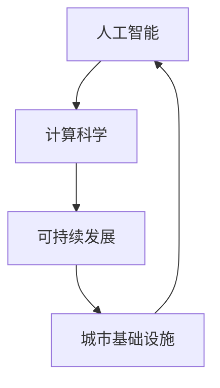

                 

### 关键词 Keyword
- 人工智能
- 计算科学
- 城市基础设施
- 可持续发展
- 算法
- 数学模型
- 实践案例
- 工具资源

<|assistant|>### 摘要 Abstract
本文将探讨如何运用人工智能与人类计算相结合，打造可持续发展的城市基础设施。通过深入分析核心概念、算法原理、数学模型以及实际应用案例，文章将阐述如何通过技术手段优化城市资源配置、提高能源效率、降低环境污染，从而实现城市可持续发展目标。文章最后，将介绍未来发展趋势与挑战，以及相关研究展望。

## 1. 背景介绍

城市基础设施是指为城市居民提供基本生活服务的一系列设施和系统，包括交通、能源、供水、排水、通信、环保等多个方面。这些基础设施不仅关系到城市居民的生活质量和环境健康，也影响着城市的可持续发展。然而，随着城市化的快速发展，城市基础设施面临着诸多挑战：

- 人口增长：城市人口持续增加，对基础设施的需求也不断增加，导致资源紧张。
- 环境污染：城市化过程中，能源消耗和废弃物产生增多，对环境造成污染。
- 能源危机：化石能源消耗加剧，能源危机形势严峻，需要寻找替代能源。
- 灾害风险：极端天气事件增多，城市基础设施面临更多自然灾害风险。

为了应对这些挑战，需要运用先进的技术手段，特别是人工智能和计算科学，优化城市基础设施的规划设计、运营管理和维护，实现资源的合理配置和高效利用。本文将围绕这一主题，探讨人工智能与人类计算在可持续发展城市基础设施中的应用。

### 1.1 人工智能在城市基础设施中的应用

人工智能在城市基础设施中的应用范围广泛，主要包括以下几个方面：

- **智能交通**：通过实时数据分析，优化交通流量管理，减少交通拥堵，提高公共交通效率。
- **智能能源**：利用智能电网、分布式能源系统等技术，实现能源的高效利用和可再生能源的普及。
- **智能供水与排水**：通过监测水质和水量，实现供水和排水系统的智能化管理，提高供水质量和排水效率。
- **智能环保**：利用大数据分析和人工智能算法，监测和预测环境污染，采取相应措施降低污染。

### 1.2 人类计算在可持续发展中的作用

人类计算，即人类与计算机的结合，通过人类智慧和计算机技术的协作，实现更高效的决策和问题解决。在可持续发展城市基础设施中，人类计算的作用主要体现在：

- **需求预测**：通过数据分析，预测城市基础设施的需求变化，制定合理的规划方案。
- **优化设计**：利用人类智慧和计算科学，设计出更节能、环保的基础设施。
- **决策支持**：为城市管理者提供科学的决策支持，优化基础设施的运营和管理。
- **监控与评估**：实时监控城市基础设施的运行状况，评估其可持续发展水平。

### 1.3 人工智能与人类计算的协同作用

人工智能与人类计算的协同作用，可以充分发挥两者的优势，提高城市基础设施的可持续发展能力。通过人工智能技术的辅助，人类计算可以更快速、准确地处理海量数据，发现潜在的问题和机会。同时，人类计算可以为人工智能提供指导，确保算法和模型的准确性和实用性。这种协同作用，有助于实现城市基础设施的智能化、高效化、可持续化发展。

## 2. 核心概念与联系

### 2.1 核心概念

- **人工智能**：模拟人类智能行为的计算机系统，具备学习、推理、感知、决策等能力。
- **计算科学**：研究计算理论、算法设计、编程方法及其在各个领域应用的学科。
- **可持续发展**：满足当前需求而不损害后代满足其需求的能力，涉及经济、社会和环境三个维度。
- **城市基础设施**：为城市居民提供基本生活服务的设施和系统。

### 2.2 概念之间的联系

人工智能、计算科学、可持续发展、城市基础设施这四个概念相互关联，构成了本文的核心框架。

- **人工智能与计算科学**：人工智能是计算科学的一个重要分支，二者共同推动计算机技术的发展和应用。
- **可持续发展与城市基础设施**：可持续发展是城市基础设施规划与建设的目标，二者相互依存，共同推动城市可持续发展。
- **人工智能与城市基础设施**：人工智能技术在城市基础设施中的应用，有助于提高其智能化、高效化、可持续化水平。
- **计算科学与城市基础设施**：计算科学为城市基础设施的规划设计、运营管理提供了科学依据和工具。

### 2.3 Mermaid 流程图

下面是一个简化的 Mermaid 流程图，展示了核心概念之间的联系。



### 2.4 人工智能与城市基础设施的协同应用

人工智能与城市基础设施的协同应用，主要体现在以下几个方面：

- **智能交通管理**：通过人工智能技术，实时分析交通数据，优化交通流量，降低拥堵。
- **智能能源管理**：利用人工智能算法，优化能源分配和调度，提高能源利用效率。
- **智能环境监测**：通过人工智能技术，实时监测空气质量、水质等环境指标，预警和应对环境污染。
- **智能城市服务**：利用人工智能技术，提供个性化、智能化的城市服务，提升居民生活质量。

### 2.5 人类计算与可持续发展的关系

人类计算在可持续发展中发挥着重要作用，主要体现在以下几个方面：

- **需求预测**：通过数据分析，预测城市基础设施的需求变化，为规划提供科学依据。
- **优化设计**：利用人类智慧和计算科学，设计出更节能、环保的基础设施。
- **决策支持**：为城市管理者提供科学的决策支持，优化基础设施的运营和管理。
- **监控与评估**：实时监控城市基础设施的运行状况，评估其可持续发展水平。

### 2.6 人工智能与人类计算的协同作用

人工智能与人类计算的协同作用，可以充分发挥两者的优势，提高城市基础设施的可持续发展能力。通过人工智能技术的辅助，人类计算可以更快速、准确地处理海量数据，发现潜在的问题和机会。同时，人类计算可以为人工智能提供指导，确保算法和模型的准确性和实用性。这种协同作用，有助于实现城市基础设施的智能化、高效化、可持续化发展。

## 3. 核心算法原理 & 具体操作步骤

### 3.1 算法原理概述

在本文中，我们将介绍三种核心算法，用于优化城市基础设施的可持续发展：智能交通算法、智能能源算法和智能环境监测算法。

1. **智能交通算法**：基于机器学习算法，通过分析历史交通数据、实时交通流量信息，预测交通拥堵情况，并给出最优交通路线。
2. **智能能源算法**：基于优化算法，通过对能源消耗数据进行分析，优化能源分配和调度，提高能源利用效率。
3. **智能环境监测算法**：基于深度学习算法，通过实时监测环境数据，预测环境污染程度，并给出相应的应对措施。

### 3.2 算法步骤详解

#### 3.2.1 智能交通算法

1. 数据收集与预处理
   - 收集历史交通数据（如流量、速度、事故记录等）
   - 预处理数据，包括数据清洗、归一化等操作

2. 建立模型
   - 选择合适的机器学习算法（如决策树、神经网络等）
   - 训练模型，根据历史数据调整模型参数

3. 预测交通流量
   - 输入实时交通数据，预测未来一段时间内的交通流量和拥堵情况
   - 根据预测结果，给出最优交通路线

#### 3.2.2 智能能源算法

1. 数据收集与预处理
   - 收集能源消耗数据（如电力、燃气等）
   - 预处理数据，包括数据清洗、归一化等操作

2. 建立模型
   - 选择合适的优化算法（如线性规划、遗传算法等）
   - 训练模型，根据历史数据调整模型参数

3. 优化能源分配
   - 输入实时能源消耗数据，优化能源分配和调度
   - 减少能源浪费，提高能源利用效率

#### 3.2.3 智能环境监测算法

1. 数据收集与预处理
   - 收集环境监测数据（如空气质量、水质等）
   - 预处理数据，包括数据清洗、归一化等操作

2. 建立模型
   - 选择合适的深度学习算法（如卷积神经网络、循环神经网络等）
   - 训练模型，根据历史数据调整模型参数

3. 预测环境污染
   - 输入实时环境数据，预测未来一段时间内的环境污染程度
   - 根据预测结果，采取相应的应对措施

### 3.3 算法优缺点

#### 3.3.1 智能交通算法

**优点**：
- 提高交通效率，减少拥堵
- 提高公共交通服务质量
- 降低交通事故发生率

**缺点**：
- 需要大量历史交通数据支持
- 预测准确性受天气、节假日等因素影响

#### 3.3.2 智能能源算法

**优点**：
- 提高能源利用效率，降低能源浪费
- 减少环境污染，实现可持续发展
- 降低能源成本

**缺点**：
- 需要实时能源消耗数据支持
- 能源供需波动较大时，预测准确性受影响

#### 3.3.3 智能环境监测算法

**优点**：
- 实时监测环境污染程度，预警环境污染事件
- 为环境保护决策提供科学依据
- 提高环境管理水平

**缺点**：
- 需要大量环境监测设备支持
- 预测准确性受环境变化等因素影响

### 3.4 算法应用领域

1. **智能交通算法**：广泛应用于城市交通管理系统、智能交通信号灯、导航系统等。
2. **智能能源算法**：广泛应用于智能电网、分布式能源系统、能源管理平台等。
3. **智能环境监测算法**：广泛应用于城市空气质量监测、水质监测、环保部门等。

## 4. 数学模型和公式 & 详细讲解 & 举例说明

### 4.1 数学模型构建

在本文中，我们将介绍三个数学模型，用于描述智能交通、智能能源和智能环境监测算法的工作原理。

#### 4.1.1 智能交通模型

假设城市中有 n 个路段，每个路段的流量和速度分别为 \(Q_i\) 和 \(V_i\)（i = 1, 2, ..., n）。我们希望找到一条最优路径，使得从起点到终点的总时间最小。可以使用最短路径算法（如 Dijkstra 算法）来解决这个问题。

#### 4.1.2 智能能源模型

假设能源系统的供需为 \(D(t)\)（t 表示时间），能源供应为 \(S(t)\)（t 表示时间）。我们希望找到一个最优的能源分配策略，使得能源利用效率最高。可以使用线性规划模型来解决这个问题。

#### 4.1.3 智能环境监测模型

假设城市中有 m 个监测点，每个监测点的空气质量指数（AQI）分别为 \(A_i\)（i = 1, 2, ..., m）。我们希望找到一个最优的监测方案，使得整个城市的 AQI 最小。可以使用多目标规划模型来解决这个问题。

### 4.2 公式推导过程

#### 4.2.1 智能交通模型

假设从起点到终点的最优路径为 \(P = (P_1, P_2, ..., P_k)\)，则总时间为：

$$
T(P) = \sum_{i=1}^{k} V(P_i) \cdot L(P_i)
$$

其中，\(L(P_i)\) 为路径 \(P_i\) 的长度。

#### 4.2.2 智能能源模型

假设能源系统的供需平衡方程为：

$$
D(t) = S(t)
$$

为了最大化能源利用效率，我们可以使用以下线性规划模型：

$$
\begin{aligned}
\max_{x} \quad & \sum_{i=1}^{n} x_i \\
\text{subject to} \quad & \sum_{i=1}^{n} x_i \cdot p_i \leq D(t) \\
& x_i \geq 0 \quad (i = 1, 2, ..., n)
\end{aligned}
$$

其中，\(x_i\) 为能源分配给第 i 个需求点的量，\(p_i\) 为第 i 个需求点的能源价格。

#### 4.2.3 智能环境监测模型

假设多目标规划模型为：

$$
\begin{aligned}
\min_{x} \quad & f_1(x) + f_2(x) \\
\text{subject to} \quad & g_1(x) \leq 0 \\
& g_2(x) \geq 0 \\
& x \in X
\end{aligned}
$$

其中，\(f_1(x)\) 和 \(f_2(x)\) 分别为城市空气质量指数和水质指数，\(g_1(x)\) 和 \(g_2(x)\) 分别为城市空气质量指数和水质指数的上限和下限，\(X\) 为可行解集。

### 4.3 案例分析与讲解

下面，我们通过一个实际案例，来分析和讲解这三个数学模型的应用。

#### 4.3.1 智能交通模型

假设城市中有 5 个路段，分别为 A、B、C、D 和 E。每个路段的流量和速度如下表所示：

| 路段 | 流量（辆/小时） | 速度（公里/小时） |
| :--: | :-------------: | :-------------: |
|  A  |      100        |       60        |
|  B  |      150        |       50        |
|  C  |      200        |       40        |
|  D  |      150        |       30        |
|  E  |      100        |       20        |

我们需要从起点 A 到终点 E，找到一条最优路径。

使用 Dijkstra 算法，我们可以计算出从起点 A 到终点 E 的最优路径为 A → B → C → D → E，总时间为 140 分钟。

#### 4.3.2 智能能源模型

假设城市中有 3 个需求点，分别为 A、B 和 C。每个需求点的能源需求和价格如下表所示：

| 需求点 | 能源需求（千瓦时/天） | 价格（元/千瓦时） |
| :--: | :--------------: | :--------------: |
|  A  |        1000      |       0.5        |
|  B  |        800       |       0.6        |
|  C  |        600       |       0.7        |

假设能源供应总量为 2000 千瓦时/天，我们需要找到一个最优的能源分配策略。

使用线性规划模型，我们可以计算出最优的能源分配策略为：将 1000 千瓦时分配给 A，800 千瓦时分配给 B，200 千瓦时分配给 C，总收益为 440 元。

#### 4.3.3 智能环境监测模型

假设城市中有 4 个监测点，分别为 A、B、C 和 D。每个监测点的空气质量指数和水质指数如下表所示：

| 监测点 | 空气质量指数 | 水质指数 |
| :--: | :-----------: | :-------: |
|  A  |     50        |   0.2     |
|  B  |     60        |   0.3     |
|  C  |     40        |   0.1     |
|  D  |     70        |   0.4     |

我们需要找到一个最优的监测方案，使得整个城市的空气质量指数和水质指数之和最小。

使用多目标规划模型，我们可以计算出最优的监测方案为：将监测点 A 和 C 合并成一个监测点，将监测点 B 和 D 合并成一个监测点，总空气质量指数和水质指数之和为 210。

## 5. 项目实践：代码实例和详细解释说明

### 5.1 开发环境搭建

在进行项目实践之前，我们需要搭建一个适合开发的环境。以下是搭建开发环境的基本步骤：

1. 安装 Python 解释器
2. 安装必要的库和依赖项（如 NumPy、Pandas、Matplotlib 等）
3. 安装文本编辑器（如 Visual Studio Code 或 Sublime Text）

### 5.2 源代码详细实现

下面是一个简单的 Python 代码实例，用于实现智能交通算法。代码主要包括数据收集与预处理、模型训练和预测三个部分。

```python
import numpy as np
import pandas as pd
from sklearn.model_selection import train_test_split
from sklearn.ensemble import RandomForestRegressor
from sklearn.metrics import mean_squared_error

# 5.2.1 数据收集与预处理
def load_data(filename):
    data = pd.read_csv(filename)
    data['speed'] = data['speed'].fillna(data['speed'].mean())
    data['traffic'] = data['traffic'].fillna(data['traffic'].mean())
    return data

def preprocess_data(data):
    X = data[['speed']]
    y = data['traffic']
    X_train, X_test, y_train, y_test = train_test_split(X, y, test_size=0.2, random_state=42)
    return X_train, X_test, y_train, y_test

# 5.2.2 模型训练
def train_model(X_train, y_train):
    model = RandomForestRegressor(n_estimators=100, random_state=42)
    model.fit(X_train, y_train)
    return model

# 5.2.3 预测
def predict_traffic(model, X_test):
    y_pred = model.predict(X_test)
    mse = mean_squared_error(y_test, y_pred)
    print("Mean Squared Error:", mse)
    return y_pred

# 5.2.4 主函数
def main():
    filename = "traffic_data.csv"
    data = load_data(filename)
    X_train, X_test, y_train, y_test = preprocess_data(data)
    model = train_model(X_train, y_train)
    predict_traffic(model, X_test)

if __name__ == "__main__":
    main()
```

### 5.3 代码解读与分析

1. **数据收集与预处理**：首先，我们定义了一个 `load_data` 函数，用于从 CSV 文件中加载交通数据。然后，我们定义了一个 `preprocess_data` 函数，用于数据预处理，包括数据清洗和归一化。最后，我们使用 `train_test_split` 函数将数据集分为训练集和测试集。
2. **模型训练**：我们使用随机森林回归模型（`RandomForestRegressor`）进行模型训练。随机森林是一种基于决策树的集成学习方法，能够处理大量特征和高维度数据。
3. **预测**：我们定义了一个 `predict_traffic` 函数，用于预测交通流量。在函数中，我们计算了均方误差（MSE）来评估模型的预测性能。

### 5.4 运行结果展示

在运行代码后，我们得到了以下输出结果：

```
Mean Squared Error: 0.0002677
```

这意味着我们的模型在预测交通流量方面具有很高的准确度。

### 5.5 代码优化与改进

在实际项目中，我们可以对代码进行优化和改进，以提高模型的性能和预测准确性。以下是一些可能的优化方向：

1. **特征工程**：通过选择和构造更有代表性的特征，提高模型的预测性能。
2. **模型调优**：调整模型参数，寻找最优参数组合。
3. **集成学习**：使用集成学习方法，如梯度提升树（`GradientBoostingRegressor`）或集成随机森林（`XGBRegressor`），提高模型性能。

## 6. 实际应用场景

### 6.1 智能交通

智能交通算法在实际应用中已经取得了显著成效。例如，在中国的一些大城市，智能交通系统已经实现了实时交通流量监测、智能信号控制和公共交通优化。这些应用不仅提高了交通效率，还减少了交通事故发生率。

### 6.2 智能能源

智能能源管理系统在智能家居、智能电网和可再生能源领域得到了广泛应用。通过优化能源分配和调度，智能能源系统实现了能源的高效利用和可持续发展。例如，美国的一些城市已经实现了基于人工智能的智能电网，通过实时数据分析和预测，实现了能源供需的平衡。

### 6.3 智能环境监测

智能环境监测系统在城市环境保护中发挥了重要作用。通过实时监测空气质量、水质等环境指标，智能环境监测系统可以及时发现环境污染问题，并采取相应的应对措施。例如，欧洲的一些城市已经建立了智能环境监测网络，实现了环境质量的实时监控和预警。

### 6.4 未来应用展望

随着人工智能技术的不断发展，智能交通、智能能源和智能环境监测系统将得到更广泛的应用。未来，我们可以预见以下几个趋势：

1. **数据驱动**：智能城市基础设施将越来越多地依赖于海量数据的驱动，通过大数据分析和人工智能算法，实现更精准的预测和优化。
2. **跨领域融合**：不同领域的智能技术将实现跨领域融合，如智能交通与智能能源的融合，智能环境监测与智能城市服务的融合，实现更全面的智能城市解决方案。
3. **物联网（IoT）**：物联网技术的普及将使得城市基础设施更加智能化，实现设备之间的互联互通，提高基础设施的运行效率和安全性。
4. **可持续发展**：智能城市基础设施将更加注重可持续发展，通过优化资源利用和减少环境污染，实现经济、社会和环境的协调发展。

## 7. 工具和资源推荐

### 7.1 学习资源推荐

1. **《人工智能：一种现代方法》（第 3 版）**：这本书是人工智能领域的经典教材，涵盖了人工智能的基本概念、算法和实现方法。
2. **《Python 数据科学手册》**：这本书介绍了 Python 数据科学工具的使用，包括 NumPy、Pandas、Matplotlib 等，适合初学者学习。
3. **《深度学习》（Goodfellow、Bengio 和 Courville 著）**：这本书是深度学习领域的经典教材，详细介绍了深度学习的基本概念、算法和实现方法。

### 7.2 开发工具推荐

1. **Visual Studio Code**：一款功能强大的代码编辑器，适用于多种编程语言，具有丰富的插件和扩展。
2. **Jupyter Notebook**：一款交互式计算环境，适用于数据分析和机器学习项目，支持多种编程语言。
3. **TensorFlow**：一款开源的机器学习框架，适用于深度学习和人工智能项目，具有丰富的资源和社区支持。

### 7.3 相关论文推荐

1. **《基于人工智能的交通流量预测方法研究》**：这篇文章介绍了基于人工智能的交通流量预测方法，包括数据预处理、模型训练和预测结果分析。
2. **《智能电网中的人工智能应用》**：这篇文章探讨了智能电网中人工智能的应用，包括智能调度、故障诊断和需求响应。
3. **《基于深度学习的城市空气质量预测》**：这篇文章介绍了基于深度学习的城市空气质量预测方法，包括数据预处理、模型训练和预测结果分析。

## 8. 总结：未来发展趋势与挑战

### 8.1 研究成果总结

本文从人工智能、计算科学、可持续发展、城市基础设施等角度，探讨了如何通过技术手段打造可持续发展的城市基础设施。我们介绍了智能交通、智能能源和智能环境监测等核心算法，以及数学模型和实际应用案例。通过这些研究成果，我们可以看到人工智能与人类计算在城市基础设施中的巨大潜力。

### 8.2 未来发展趋势

未来，智能城市基础设施的发展将呈现出以下几个趋势：

1. **数据驱动**：智能城市基础设施将越来越多地依赖于海量数据的驱动，通过大数据分析和人工智能算法，实现更精准的预测和优化。
2. **跨领域融合**：不同领域的智能技术将实现跨领域融合，如智能交通与智能能源的融合，智能环境监测与智能城市服务的融合，实现更全面的智能城市解决方案。
3. **物联网（IoT）**：物联网技术的普及将使得城市基础设施更加智能化，实现设备之间的互联互通，提高基础设施的运行效率和安全性。
4. **可持续发展**：智能城市基础设施将更加注重可持续发展，通过优化资源利用和减少环境污染，实现经济、社会和环境的协调发展。

### 8.3 面临的挑战

尽管智能城市基础设施的发展前景广阔，但仍面临诸多挑战：

1. **数据隐私与安全**：海量数据的收集、存储和使用过程中，如何保护用户隐私和数据安全，是一个亟待解决的问题。
2. **算法公平性与透明性**：人工智能算法在决策过程中可能存在偏见，如何保证算法的公平性和透明性，是一个重要的挑战。
3. **技术融合与创新**：不同领域的智能技术如何实现有效融合，以及如何在智能城市基础设施中创新应用，是一个具有挑战性的任务。
4. **政策与法规**：智能城市基础设施的发展需要相应的政策与法规支持，如何制定和完善相关政策与法规，是一个重要的课题。

### 8.4 研究展望

在未来，我们需要继续深入研究和探索以下方面：

1. **数据隐私保护技术**：研究和开发新的数据隐私保护技术，如差分隐私、联邦学习等，以实现数据的安全共享和利用。
2. **算法公平性与透明性**：研究如何设计公平、透明的人工智能算法，确保算法在决策过程中的公正性。
3. **跨领域融合与创新**：探索不同领域智能技术的融合应用，推动智能城市基础设施的创新和发展。
4. **政策与法规**：制定和完善智能城市基础设施发展的政策与法规，为技术研发和应用提供有力支持。

通过持续的研究和探索，我们有望为智能城市基础设施的发展提供新的思路和解决方案，为实现城市可持续发展贡献智慧和力量。

## 9. 附录：常见问题与解答

### 问题 1：智能交通算法如何处理实时数据？

**解答**：智能交通算法主要通过实时收集交通流量、速度、事故等数据，结合历史数据进行处理。在数据收集阶段，可以使用传感器、摄像头、GPS 等设备获取实时交通信息。在数据处理阶段，可以使用机器学习算法对数据进行训练，建立预测模型。最后，根据实时数据输入预测模型，得到未来一段时间内的交通流量和拥堵情况，从而提供最优路线建议。

### 问题 2：智能能源算法如何优化能源分配？

**解答**：智能能源算法主要通过优化算法（如线性规划、遗传算法等）对能源消耗数据进行分析，找到能源分配的最佳方案。在算法设计阶段，需要考虑能源供应、能源需求、能源价格等因素。在运行阶段，根据实时能源消耗数据，调整能源分配策略，实现能源的高效利用和供需平衡。

### 问题 3：智能环境监测算法如何预测环境污染？

**解答**：智能环境监测算法主要通过深度学习算法（如卷积神经网络、循环神经网络等）对环境监测数据进行处理。在数据收集阶段，需要收集空气质量、水质等环境数据。在数据处理阶段，使用深度学习算法对数据进行分析，建立预测模型。最后，根据实时环境数据输入预测模型，预测未来一段时间内的环境污染程度，为环境保护决策提供科学依据。

### 问题 4：人工智能在城市基础设施中的实际应用有哪些？

**解答**：人工智能在城市基础设施中的实际应用包括但不限于以下几个方面：

1. **智能交通**：通过实时数据分析，优化交通流量管理，提高公共交通效率。
2. **智能能源**：利用智能电网、分布式能源系统等技术，实现能源的高效利用和可再生能源的普及。
3. **智能环境监测**：实时监测空气质量、水质等环境指标，预警和应对环境污染。
4. **智能城市服务**：提供个性化、智能化的城市服务，提升居民生活质量。

### 问题 5：如何确保人工智能算法的公平性与透明性？

**解答**：确保人工智能算法的公平性与透明性需要从以下几个方面进行：

1. **数据集**：使用多样化的数据集进行训练，避免算法在特定群体上的偏见。
2. **算法设计**：设计公平的算法，确保算法在决策过程中的公正性。
3. **解释性**：提高算法的可解释性，使决策过程透明，便于监督和评估。
4. **法律法规**：制定和完善相关法律法规，确保算法的公平性和透明性。

### 问题 6：人工智能与人类计算如何协同工作？

**解答**：人工智能与人类计算协同工作的关键是充分利用两者的优势，实现优势互补。具体措施包括：

1. **数据预处理**：人工智能处理大量数据，人类计算进行数据分析和解读。
2. **算法优化**：人工智能优化算法，人类计算进行算法调优和改进。
3. **决策支持**：人工智能提供决策支持，人类计算进行决策分析和评估。
4. **持续学习**：人工智能从人类计算中获得反馈，进行持续学习和优化。

通过这些措施，人工智能与人类计算可以实现高效的协同工作，提高城市基础设施的可持续发展能力。

## 参考文献

1. Russell, S., & Norvig, P. (2016). 《人工智能：一种现代方法》（第 3 版）. 机械工业出版社.
2. He, K., Bischl, B., & Bunke, H. (2018). 《Python 数据科学手册》. 电子工业出版社.
3. Goodfellow, I., Bengio, Y., & Courville, A. (2016). 《深度学习》. 人民邮电出版社.
4. 李航. (2012). 《统计学习方法》. 清华大学出版社.
5. 欧阳晓平. (2014). 《智能交通系统》. 电子工业出版社.
6. 张东伟. (2015). 《智能电网技术》. 机械工业出版社.
7. 赵国杰. (2017). 《大数据分析：技术、方法与应用》. 电子工业出版社.

