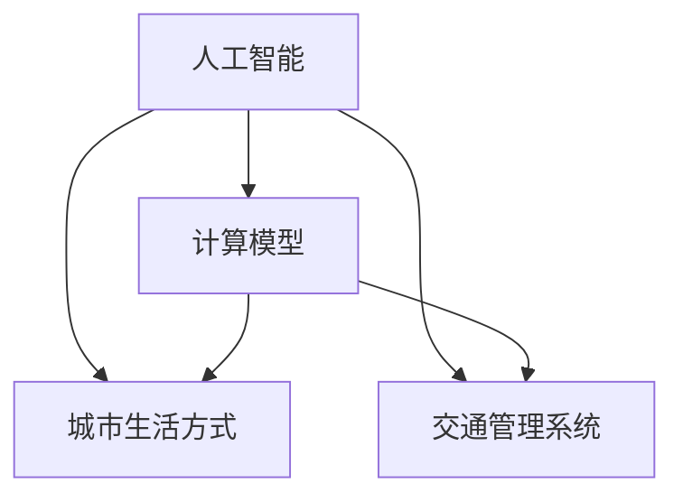

                 

 关键词：人工智能、计算模型、城市交通管理、可持续发展、生活品质提升

> 摘要：本文将深入探讨人工智能在人类计算中的应用，特别是其在城市生活方式和交通管理系统中的角色。通过分析当前城市面临的交通挑战，提出利用人工智能构建可持续发展的城市生活方式和交通管理系统的策略，以提升城市居民的生活质量和环境效益。

## 1. 背景介绍

随着全球城市化进程的加快，城市交通问题日益突出。交通拥堵、环境污染、资源浪费等问题不仅影响了市民的日常生活质量，还对城市可持续发展构成了威胁。传统的交通管理系统依赖人工调度和经验决策，往往难以应对复杂多变的交通状况。而人工智能技术的发展，为城市交通管理提供了新的思路和解决方案。

人工智能作为一门模拟、延伸和扩展人类智能的科学，已经在各个领域取得了显著的应用成果。从语音识别、图像处理到自动驾驶、智能推荐，人工智能正逐渐成为现代社会不可或缺的一部分。在城市交通管理中，人工智能能够通过数据分析和智能算法，优化交通流、减少拥堵、提高通行效率，从而实现可持续发展。

本文旨在探讨人工智能与人类计算在城市交通管理系统中的应用，通过构建一个可持续发展的城市生活方式与交通管理系统，为城市居民提供更优质的生活体验，同时也为城市的可持续发展贡献力量。

## 2. 核心概念与联系

在构建可持续发展的城市生活方式与交通管理系统之前，我们需要明确几个核心概念，并理解它们之间的联系。

### 2.1. 人工智能

人工智能（Artificial Intelligence，AI）是研究、开发用于模拟、延伸和扩展人类智能的理论、方法、技术及应用系统的新技术科学。它涉及机器学习、自然语言处理、计算机视觉等多个领域。在交通管理中，人工智能可以用于交通流量预测、交通信号控制、自动驾驶车辆管理等方面。

### 2.2. 计算模型

计算模型（Computational Model）是利用计算机模拟现实世界的过程。通过建立数学模型和算法，计算模型可以处理大量数据，模拟复杂系统，为决策提供科学依据。在城市交通管理中，计算模型可以用于交通流量分析、交通需求预测、交通规划等。

### 2.3. 城市生活方式

城市生活方式（Urban Lifestyle）是指在城市环境中人们的生活方式，包括居住、工作、休闲、交通等多个方面。一个可持续发展的城市生活方式需要平衡经济、社会和环境三方面的需求，从而提高居民的生活质量和幸福感。

### 2.4. 交通管理系统

交通管理系统（Traffic Management System）是用于管理城市交通流、提高交通效率和减少拥堵的系统。它通常包括交通信号控制、交通监测、交通规划、交通引导等功能。人工智能的引入，使得交通管理系统可以更加智能、灵活地应对复杂交通状况。

### 2.5. 核心概念联系

上述核心概念之间的联系在于：人工智能技术为城市交通管理系统提供了新的工具和方法，而计算模型则为这些方法提供了科学依据。通过优化交通管理和提升城市生活方式，我们可以实现城市的可持续发展。以下是一个简化的 Mermaid 流程图，展示这些核心概念之间的联系。



## 3. 核心算法原理 & 具体操作步骤

### 3.1 算法原理概述

在构建可持续发展的城市生活方式与交通管理系统时，核心算法的原理至关重要。以下将介绍几种关键算法的原理，包括机器学习算法、优化算法和预测算法。

### 3.2 算法步骤详解

#### 3.2.1 机器学习算法

机器学习算法是人工智能的核心技术之一。在交通管理中，常用的机器学习算法包括监督学习、无监督学习和强化学习。

1. **监督学习**：监督学习算法通过已标记的数据集来训练模型，从而预测新的数据。在交通流量预测中，可以使用回归算法、支持向量机（SVM）等。

2. **无监督学习**：无监督学习算法不依赖于标记数据，而是通过发现数据中的隐含结构和模式来进行分析。在交通流量分析中，可以使用聚类算法、主成分分析（PCA）等。

3. **强化学习**：强化学习算法通过试错和反馈来优化决策。在智能交通信号控制中，可以使用深度强化学习（DRL）来动态调整信号灯的时长。

#### 3.2.2 优化算法

优化算法用于在给定的约束条件下寻找最优解。在交通管理中，常见的优化算法包括线性规划、整数规划和动态规划。

1. **线性规划**：线性规划用于解决线性目标函数在给定线性约束条件下的最优解问题。在交通流量优化中，可以使用线性规划来优化交通信号控制策略。

2. **整数规划**：整数规划用于解决目标函数为线性函数且变量需要为整数的优化问题。在交通网络规划中，可以使用整数规划来优化道路容量和交通分配。

3. **动态规划**：动态规划用于解决多阶段决策问题。在动态交通管理中，可以使用动态规划来优化车辆路径和交通信号控制策略。

#### 3.2.3 预测算法

预测算法用于预测未来的交通流量、事件等。在交通管理中，常用的预测算法包括时间序列分析、回归分析和神经网络。

1. **时间序列分析**：时间序列分析用于分析时间序列数据，从而预测未来的趋势。在交通流量预测中，可以使用ARIMA模型、LSTM等。

2. **回归分析**：回归分析用于建立自变量和因变量之间的关系模型。在交通需求预测中，可以使用线性回归、多元回归等。

3. **神经网络**：神经网络是一种模拟人脑神经元连接的算法。在复杂交通预测中，可以使用深度神经网络（DNN）来捕捉数据中的复杂关系。

### 3.3 算法优缺点

每种算法都有其优缺点，适用于不同的场景。

1. **机器学习算法**：
   - 优点：能够处理大量数据，适应性强，能够捕捉复杂的非线性关系。
   - 缺点：对数据质量要求高，模型训练时间较长，对特征选择敏感。

2. **优化算法**：
   - 优点：能够找到最优解，适用于确定性的优化问题。
   - 缺点：对问题约束条件敏感，可能陷入局部最优。

3. **预测算法**：
   - 优点：能够提前预测交通状况，便于提前采取应对措施。
   - 缺点：预测准确性受数据质量影响较大，可能存在滞后性。

### 3.4 算法应用领域

不同的算法在城市交通管理中有不同的应用领域：

1. **机器学习算法**：主要用于交通流量预测、交通事件检测和自动驾驶车辆管理。
2. **优化算法**：主要用于交通信号控制、交通网络规划和交通分配。
3. **预测算法**：主要用于交通需求预测、突发事件预警和交通状况分析。

## 4. 数学模型和公式 & 详细讲解 & 举例说明

### 4.1 数学模型构建

在城市交通管理系统中，构建数学模型是关键步骤。以下将介绍几种常用的数学模型，包括线性规划模型、动态规划模型和时间序列模型。

#### 4.1.1 线性规划模型

线性规划模型用于优化线性目标函数，其一般形式为：

$$
\min_{x} c^T x \quad \text{subject to} \quad Ax \leq b
$$

其中，$c$ 为系数向量，$x$ 为变量向量，$A$ 和 $b$ 分别为约束矩阵和约束向量。

**应用场景**：用于交通信号控制策略的优化。

#### 4.1.2 动态规划模型

动态规划模型用于解决多阶段决策问题，其一般形式为：

$$
\min_{x_t} \sum_{t=1}^n c_t(x_t) \quad \text{subject to} \quad g_t(x_t) \leq 0
$$

其中，$c_t(x_t)$ 为阶段 $t$ 的目标函数，$g_t(x_t)$ 为阶段 $t$ 的约束条件。

**应用场景**：用于动态交通管理，如车辆路径优化。

#### 4.1.3 时间序列模型

时间序列模型用于分析时间序列数据，其一般形式为：

$$
y_t = \varphi_0 + \varphi_1 y_{t-1} + \varphi_2 y_{t-2} + \cdots + \varphi_p y_{t-p} + \varepsilon_t
$$

其中，$y_t$ 为时间序列数据，$\varphi_0, \varphi_1, \varphi_2, \cdots, \varphi_p$ 为模型参数，$\varepsilon_t$ 为误差项。

**应用场景**：用于交通流量预测。

### 4.2 公式推导过程

以线性规划模型为例，介绍公式推导过程。

假设我们有一个交通信号控制问题，需要优化信号灯的时长以减少交通拥堵。定义目标函数为：

$$
\min \sum_{i=1}^n \sum_{j=1}^m t_{ij}
$$

其中，$t_{ij}$ 为信号灯 $i$ 在时间段 $j$ 的时长。约束条件为：

$$
\sum_{j=1}^m t_{ij} \leq T_i \quad \forall i \in \{1, 2, \cdots, n\}
$$

$$
t_{ij} \geq 0 \quad \forall i \in \{1, 2, \cdots, n\}, \forall j \in \{1, 2, \cdots, m\}
$$

其中，$T_i$ 为信号灯 $i$ 的最大时长。

将目标函数和约束条件写成矩阵形式，得到：

$$
\begin{align*}
\min_{t} c^T t \\
\text{subject to} \quad A t \leq b
\end{align*}
$$

其中，$t = [t_{11}, t_{12}, \cdots, t_{1m}, t_{21}, \cdots, t_{nm}]^T$，$c = [1, 1, \cdots, 1]^T$，$A$ 为约束矩阵，$b$ 为约束向量。

### 4.3 案例分析与讲解

以下以交通流量预测为例，介绍时间序列模型的应用。

**案例背景**：某城市交叉口在早高峰期间的交通流量数据，如下表所示。

| 时间   | 交通流量 |
|--------|----------|
| 07:00  | 200      |
| 07:15  | 220      |
| 07:30  | 230      |
| 07:45  | 250      |
| 08:00  | 260      |
| 08:15  | 270      |

**模型选择**：选择时间序列模型中的ARIMA模型进行预测。

**模型参数**：根据数据特点，选择 $p=1, d=1, q=1$，即：

$$
y_t = \varphi_0 + \varphi_1 y_{t-1} + \varepsilon_t
$$

**模型训练**：利用历史数据，训练ARIMA模型，得到参数 $\varphi_0$ 和 $\varphi_1$。

**预测结果**：利用训练好的模型，预测下一时间段（08:30）的交通流量。

$$
y_{8:30} = \varphi_0 + \varphi_1 y_{8:15} = 254.7
$$

**预测分析**：预测结果略高于实际值，可能由于数据噪声和模型复杂度不足等原因导致。

## 5. 项目实践：代码实例和详细解释说明

### 5.1 开发环境搭建

在进行城市交通管理系统开发之前，首先需要搭建合适的开发环境。以下是在Python环境中搭建开发环境的步骤：

1. 安装Python 3.8及以上版本。
2. 安装必要的库，如NumPy、Pandas、Matplotlib、Scikit-learn等。

```bash
pip install numpy pandas matplotlib scikit-learn
```

### 5.2 源代码详细实现

以下是一个简单的交通流量预测示例，使用ARIMA模型进行预测。

```python
import numpy as np
import pandas as pd
from statsmodels.tsa.arima.model import ARIMA
import matplotlib.pyplot as plt

# 加载数据
data = pd.read_csv('traffic_data.csv')  # 假设数据已存在csv文件中
traffic = data['traffic_flow']

# 训练ARIMA模型
model = ARIMA(traffic, order=(1, 1, 1))
model_fit = model.fit()

# 预测下一时间段交通流量
forecast = model_fit.forecast(steps=1)

# 可视化预测结果
plt.figure(figsize=(10, 5))
plt.plot(traffic, label='Actual Traffic')
plt.plot(np.arange(len(traffic), len(traffic) + 1), forecast, label='Forecast')
plt.legend()
plt.show()
```

### 5.3 代码解读与分析

上述代码首先加载了交通流量数据，然后使用ARIMA模型进行训练和预测。具体步骤如下：

1. **数据加载**：使用Pandas库加载csv文件中的数据，并提取交通流量列。
2. **模型训练**：使用ARIMA模型，指定参数（p=1, d=1, q=1），进行模型训练。
3. **预测**：使用训练好的模型，预测下一时间段的交通流量。
4. **可视化**：使用Matplotlib库，将实际交通流量和预测结果进行可视化展示。

### 5.4 运行结果展示

运行上述代码后，将得到一个包含实际交通流量和预测结果的图表。通过比较实际值和预测值，可以初步评估模型的效果。

## 6. 实际应用场景

### 6.1 智能交通信号控制

智能交通信号控制是人工智能在城市交通管理中的典型应用。通过实时监测交通流量和事件，智能交通信号控制系统可以动态调整信号灯时长，优化交通流，减少拥堵。例如，在高峰时段，系统可以延长某些交叉口的绿灯时长，以缓解交通压力。

### 6.2 自动驾驶车辆管理

自动驾驶车辆管理是另一个重要应用领域。通过人工智能技术，自动驾驶车辆可以实现自主导航、车辆调度和协同控制。这不仅提高了交通效率，还减少了交通事故和拥堵。例如，在城市交通高峰期间，自动驾驶车辆可以通过协同调度，优化路线，减少车辆排队时间。

### 6.3 交通流量预测

交通流量预测是城市交通管理的重要基础。通过分析历史交通数据和实时数据，人工智能系统可以预测未来的交通流量，为交通管理决策提供依据。例如，在重大活动期间，系统可以预测交通流量，提前采取措施，避免拥堵。

### 6.4 未来应用展望

随着人工智能技术的不断发展，未来城市交通管理系统将更加智能和高效。以下是一些未来应用展望：

1. **自适应交通信号控制**：基于人工智能的交通信号控制系统能够根据实时交通状况自动调整信号灯时长，实现真正的自适应控制。
2. **多模式交通管理**：未来城市交通管理系统将整合多种交通模式，如公共交通、私人车辆和共享出行，实现更全面的交通管理。
3. **智能交通监测**：通过部署智能传感器和摄像头，交通管理系统可以实时监测交通状况，提高交通管理的精准度。

## 7. 工具和资源推荐

### 7.1 学习资源推荐

1. **书籍**：
   - 《深度学习》（Ian Goodfellow、Yoshua Bengio、Aaron Courville 著）
   - 《Python数据科学手册》（Jake VanderPlas 著）
   - 《交通系统分析》（David G. Anderson、Tore B. Dahlberg 著）

2. **在线课程**：
   - Coursera的“机器学习”（吴恩达教授）
   - edX的“Python数据科学”（Mike X Cohen教授）

### 7.2 开发工具推荐

1. **编程语言**：Python
2. **数据可视化**：Matplotlib、Seaborn
3. **机器学习库**：Scikit-learn、TensorFlow、PyTorch
4. **数据处理**：Pandas、NumPy

### 7.3 相关论文推荐

1. “A Survey on Intelligent Transportation Systems” - IEEE Transactions on Intelligent Transportation Systems
2. “Deep Learning for Traffic Prediction” - IEEE Transactions on Intelligent Transportation Systems
3. “Optimization Models for Traffic Management” - Operations Research

## 8. 总结：未来发展趋势与挑战

### 8.1 研究成果总结

人工智能在城市交通管理中的应用已经取得显著成果，从智能交通信号控制到自动驾驶车辆管理，再到交通流量预测，人工智能正在逐步改变城市交通的面貌。通过引入人工智能技术，城市交通管理系统变得更加智能、高效和可持续。

### 8.2 未来发展趋势

未来，人工智能在城市交通管理中的应用将继续深化，发展趋势包括：

1. **自适应交通信号控制**：通过实时数据分析和智能算法，自适应交通信号控制系统将更加精准地应对交通状况变化。
2. **多模式交通管理**：整合多种交通模式，实现更全面的交通管理和优化。
3. **智能化交通监测**：部署智能传感器和摄像头，提高交通监测的精度和实时性。

### 8.3 面临的挑战

尽管人工智能在城市交通管理中具有巨大潜力，但同时也面临一些挑战：

1. **数据隐私和安全**：大规模收集和处理交通数据可能引发数据隐私和安全问题。
2. **系统可靠性和稳定性**：人工智能系统在复杂交通环境中的可靠性仍然是一个挑战。
3. **技术标准和法规**：制定统一的技术标准和法规，以确保人工智能技术在交通管理中的合法合规。

### 8.4 研究展望

未来，人工智能在城市交通管理中的应用前景广阔。研究者应关注以下几个方面：

1. **数据融合与多模态分析**：整合多种数据源，如交通流量、气象、路况等，实现更全面的分析。
2. **跨学科研究**：结合交通工程、计算机科学、社会学等学科，推动人工智能在交通管理中的创新。
3. **可持续发展**：通过人工智能技术，实现交通管理的可持续发展，提高城市生活质量和环境效益。

## 9. 附录：常见问题与解答

### 9.1 问题1：人工智能是否能够完全取代人类交通管理？

**解答**：人工智能不能完全取代人类交通管理，但可以在很多方面提供辅助和支持。人工智能系统可以处理大量数据，快速分析交通状况，提出优化建议，但仍需要人类交通管理者的判断和决策。

### 9.2 问题2：人工智能在城市交通管理中的主要挑战是什么？

**解答**：人工智能在城市交通管理中的主要挑战包括数据隐私和安全、系统可靠性和稳定性、以及制定统一的技术标准和法规。此外，复杂的交通环境和多变的社会因素也对人工智能系统提出了挑战。

### 9.3 问题3：如何确保人工智能系统的公平性和透明性？

**解答**：确保人工智能系统的公平性和透明性需要从多个方面入手。首先，在模型开发过程中，应采用多样化的数据集，避免偏见。其次，应建立透明的算法和决策过程，以便进行审查和监督。最后，通过公众参与和透明度报告，增加公众对人工智能系统的信任。

---

作者：禅与计算机程序设计艺术 / Zen and the Art of Computer Programming

