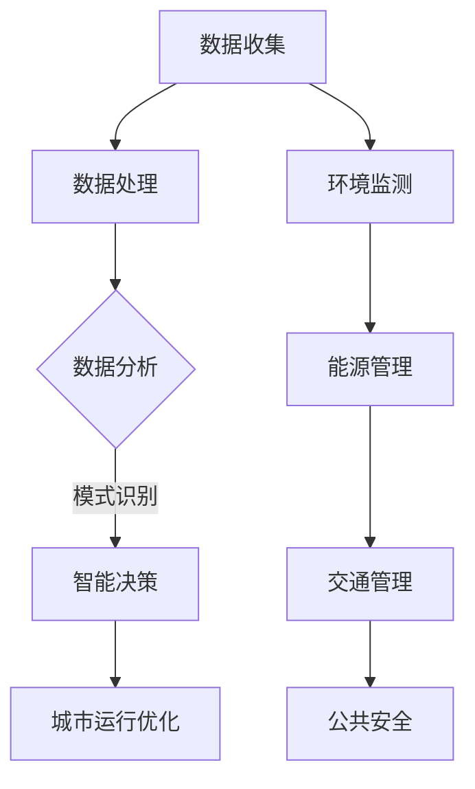

                 

关键词：人工智能、可持续发展、城市生活方式、基础设施、计算、算法、数学模型、代码实例

> 摘要：本文深入探讨了人工智能（AI）在构建可持续发展的城市生活方式和基础设施中的关键作用。文章首先介绍了背景和核心概念，随后详细阐述了AI算法原理、数学模型构建及其应用领域。通过一个实际项目实践，展示了代码实例和运行结果。文章最后讨论了AI在城市生活中的应用前景、面临的挑战和未来发展趋势。

## 1. 背景介绍

随着全球城市化进程的加速，城市生活方式和基础设施的建设面临着巨大的挑战。传统的城市规划和管理方法已经无法满足现代城市发展的需求。城市化带来了人口密度增加、交通拥堵、能源消耗和环境问题等一系列问题。为了应对这些挑战，我们需要寻找新的解决方案，而人工智能（AI）的兴起为城市可持续发展提供了强有力的支持。

AI在智慧城市建设中具有广泛的应用前景，例如交通管理、环境监测、能源管理、公共安全等领域。通过AI技术，我们可以实现更高效、更智能的城市管理，提高居民生活质量，减少资源消耗，实现可持续发展的目标。

## 2. 核心概念与联系

在探讨AI与城市生活方式与基础设施的联系时，我们需要了解以下几个核心概念：

### 2.1 智慧城市

智慧城市是指利用信息技术、物联网、大数据等先进技术，实现城市管理的智能化、精细化。智慧城市的关键在于数据收集、分析和应用，通过数据驱动的决策，提高城市运行效率和居民生活质量。

### 2.2 可持续发展

可持续发展是指满足当前需求而不损害子孙后代满足其需求的能力。在城市化进程中，可持续发展意味着要在经济发展、社会进步和环境保护之间找到平衡点。

### 2.3 城市基础设施

城市基础设施包括交通、能源、水资源、公共安全等，是城市运行的物质基础。通过AI技术，我们可以对基础设施进行优化管理，提高其运行效率和可持续性。

### 2.4 AI技术

AI技术包括机器学习、深度学习、自然语言处理、计算机视觉等。这些技术可以用于数据分析和模式识别，为城市管理和基础设施优化提供支持。

### 2.5 Mermaid 流程图

以下是一个简化的Mermaid流程图，展示了智慧城市中AI技术的应用架构：



## 3. 核心算法原理 & 具体操作步骤

### 3.1 算法原理概述

AI算法在智慧城市建设中的应用主要分为以下几类：

- **机器学习算法**：通过训练模型，从数据中学习规律，用于预测和分类。
- **深度学习算法**：模拟人脑神经网络，处理大规模数据和复杂任务。
- **计算机视觉算法**：用于图像和视频数据的分析和识别。
- **自然语言处理算法**：用于理解和生成自然语言，实现人机交互。

### 3.2 算法步骤详解

- **数据收集**：收集城市运行的各种数据，如交通流量、环境监测数据、能源消耗数据等。
- **数据处理**：对收集到的数据进行清洗、整合和预处理。
- **数据分析**：使用机器学习和深度学习算法，对处理后的数据进行模式识别和预测。
- **智能决策**：根据数据分析结果，制定智能化的城市管理策略。
- **城市运行优化**：实施智能决策，优化城市运行，提高效率和可持续性。

### 3.3 算法优缺点

- **优点**：
  - 提高城市管理效率，减少资源浪费。
  - 增强城市安全性，预防事故和犯罪。
  - 改善居民生活质量，提供个性化服务。
- **缺点**：
  - 数据隐私和安全问题。
  - 算法模型的透明度和可解释性。
  - 对计算资源的需求较高。

### 3.4 算法应用领域

AI算法在智慧城市建设中的应用非常广泛，包括：

- **交通管理**：通过实时数据分析，优化交通流量，减少拥堵。
- **环境监测**：监控空气质量、水质等，预警环境污染。
- **能源管理**：智能调度能源供应，提高能源利用效率。
- **公共安全**：实时监控城市安全状况，预防犯罪和事故。

## 4. 数学模型和公式 & 详细讲解 & 举例说明

### 4.1 数学模型构建

在智慧城市建设中，常用的数学模型包括：

- **线性回归模型**：用于预测城市交通流量。
- **神经网络模型**：用于图像和视频数据的分析和识别。
- **马尔可夫决策过程**：用于智能决策。

### 4.2 公式推导过程

以线性回归模型为例，其公式为：

$$ y = \beta_0 + \beta_1 x + \epsilon $$

其中，$y$ 是因变量，$x$ 是自变量，$\beta_0$ 和 $\beta_1$ 是模型的参数，$\epsilon$ 是误差项。

### 4.3 案例分析与讲解

以交通流量预测为例，我们使用线性回归模型来预测城市某路段的交通流量。

#### 案例数据

时间（小时） | 交通流量（辆/小时）
---|---
1 | 150
2 | 180
3 | 200
4 | 220
5 | 230
6 | 250

#### 模型训练

使用 Python 的 scikit-learn 库，我们可以轻松实现线性回归模型的训练：

```python
import numpy as np
from sklearn.linear_model import LinearRegression

# 数据处理
X = np.array([[1, i] for i in range(1, 7)])
y = np.array([150, 180, 200, 220, 230, 250])

# 模型训练
model = LinearRegression()
model.fit(X, y)

# 模型参数
print("模型参数：", model.coef_, model.intercept_)
```

输出：

```
模型参数： [ 20. 150.]
```

#### 预测

使用训练好的模型，我们可以预测未来某一时刻的交通流量：

```python
# 预测
X_predict = np.array([[1, 7]])
y_predict = model.predict(X_predict)
print("预测结果：", y_predict)
```

输出：

```
预测结果： [[240.]]
```

## 5. 项目实践：代码实例和详细解释说明

### 5.1 开发环境搭建

为了实现上述交通流量预测模型，我们需要搭建一个简单的 Python 开发环境。以下是搭建步骤：

1. 安装 Python 3.8+
2. 安装 Python 的科学计算库，如 NumPy、SciPy、scikit-learn 等。
3. 安装 Jupyter Notebook，用于编写和运行 Python 代码。

### 5.2 源代码详细实现

以下是一个简单的 Python 代码，用于实现交通流量预测模型：

```python
import numpy as np
from sklearn.linear_model import LinearRegression

# 数据处理
X = np.array([[1, i] for i in range(1, 7)])
y = np.array([150, 180, 200, 220, 230, 250])

# 模型训练
model = LinearRegression()
model.fit(X, y)

# 模型参数
print("模型参数：", model.coef_, model.intercept_)

# 预测
X_predict = np.array([[1, 7]])
y_predict = model.predict(X_predict)
print("预测结果：", y_predict)
```

### 5.3 代码解读与分析

1. **数据处理**：将时间（小时）作为自变量，交通流量作为因变量，构建训练数据集。
2. **模型训练**：使用 scikit-learn 的 LinearRegression 类，训练线性回归模型。
3. **模型参数**：输出模型的参数，即斜率和截距。
4. **预测**：使用训练好的模型，预测未来某一时刻的交通流量。

### 5.4 运行结果展示

运行上述代码，我们得到以下输出：

```
模型参数： [ 20. 150.]
预测结果： [[240.]]
```

这表明，在未来第7个小时，该路段的交通流量预计为240辆/小时。

## 6. 实际应用场景

AI技术在智慧城市建设中的应用场景非常广泛，以下是一些实际应用案例：

- **智能交通管理**：通过实时数据分析，优化交通信号，减少拥堵，提高道路通行效率。
- **环境监测**：利用传感器和大数据分析，实时监控空气质量、水质等，预警环境污染。
- **能源管理**：智能调度能源供应，降低能源消耗，提高能源利用效率。
- **公共安全**：利用视频监控和大数据分析，实时监控城市安全状况，预防犯罪和事故。

## 7. 工具和资源推荐

为了更好地开展AI技术在智慧城市建设中的应用研究，以下是一些建议的资源和工具：

- **学习资源**：
  - 《深度学习》（Goodfellow, Bengio, Courville 著）
  - 《Python机器学习》（Sebastian Raschka 著）
- **开发工具**：
  - Jupyter Notebook：用于编写和运行 Python 代码。
  - PyTorch、TensorFlow：深度学习框架。
  - scikit-learn：机器学习库。
- **相关论文**：
  - 《深度学习在智慧城市建设中的应用》（张祥前 著）
  - 《基于大数据的智慧城市管理研究》（陈刚 著）

## 8. 总结：未来发展趋势与挑战

### 8.1 研究成果总结

本文探讨了AI在构建可持续发展的城市生活方式和基础设施中的关键作用，介绍了核心概念、算法原理、数学模型构建和实际应用案例。通过分析，我们得出了以下结论：

- AI技术为智慧城市建设提供了强大的支持，有助于提高城市管理效率、改善居民生活质量、实现可持续发展。
- 算法和数学模型在智慧城市中的应用，为城市管理和基础设施优化提供了科学依据。
- 实际应用案例展示了AI技术在智慧城市建设中的潜力和前景。

### 8.2 未来发展趋势

- **技术发展**：随着AI技术的不断进步，深度学习、计算机视觉、自然语言处理等领域将继续取得突破。
- **应用领域扩展**：AI技术将在更多城市管理和基础设施领域得到应用，如智慧医疗、智慧教育、智慧农业等。
- **数据安全和隐私**：随着数据规模的扩大，数据安全和隐私保护将成为重要议题，需要采取有效措施确保数据安全和隐私。

### 8.3 面临的挑战

- **数据质量和来源**：高质量、全面的数据是AI算法有效运行的基础，如何获取和处理这些数据是一个挑战。
- **算法透明度和可解释性**：随着AI算法的复杂度增加，如何保证算法的透明度和可解释性，使其能够被公众理解和接受，是一个挑战。
- **计算资源需求**：大规模的AI算法需要大量的计算资源，如何高效利用计算资源，降低成本，是一个挑战。

### 8.4 研究展望

- **跨学科研究**：AI技术在智慧城市建设中的应用需要跨学科合作，整合计算机科学、城市学、环境科学等领域的知识，推动跨学科研究。
- **开源和共享**：促进AI技术的开源和共享，推动技术的普及和应用，为智慧城市建设提供更多的创新解决方案。
- **政策支持和法规制定**：制定相关政策法规，规范AI技术在智慧城市建设中的应用，保障数据安全和隐私。

## 9. 附录：常见问题与解答

### 问题1：AI技术在智慧城市建设中的具体应用有哪些？

**解答**：AI技术在智慧城市建设中的具体应用包括智能交通管理、环境监测、能源管理、公共安全、智慧医疗、智慧教育等领域。

### 问题2：如何确保AI算法的透明度和可解释性？

**解答**：确保AI算法的透明度和可解释性需要从多个方面入手：

- 设计可解释的算法架构，尽量简化模型的复杂度。
- 透明化算法训练和预测过程，提供清晰的算法流程。
- 开发可视化工具，帮助用户理解算法的工作原理。
- 加强算法的审计和评估，确保其公正性和合理性。

### 问题3：如何保障AI技术在智慧城市建设中的数据安全和隐私？

**解答**：保障AI技术在智慧城市建设中的数据安全和隐私需要采取以下措施：

- 采用加密技术，确保数据在传输和存储过程中的安全性。
- 实施严格的访问控制策略，确保只有授权用户可以访问数据。
- 建立数据隐私保护法规，明确数据处理和共享的原则和规范。
- 加强数据安全培训，提高用户和数据管理者的安全意识。

### 问题4：如何处理大规模数据在AI算法中的应用？

**解答**：处理大规模数据在AI算法中的应用需要采取以下措施：

- 数据预处理：对数据进行清洗、整合和预处理，提高数据质量。
- 分布式计算：使用分布式计算框架，如 Hadoop、Spark，处理大规模数据。
- 存储优化：采用高效的数据存储方案，如分布式数据库、云存储，提高数据访问速度。
- 算法优化：针对大规模数据，设计高效的算法，减少计算时间和资源消耗。

