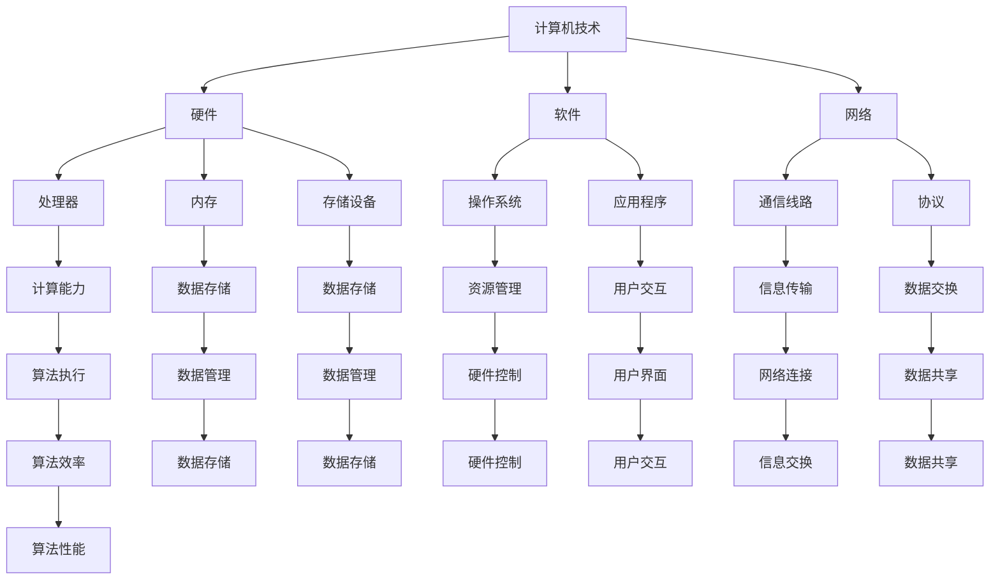

                 

关键词：人工智能、计算机发展、历史对比、技术进步、算法原理、数学模型、应用实践、未来展望。

> 摘要：本文通过对人工智能与计算机技术的发展历程进行对比分析，探讨了两者在技术进步、算法原理、数学模型等方面的异同，并展望了人工智能在未来的应用前景和面临的挑战。

## 1. 背景介绍

人工智能（AI）和计算机技术的发展已有几十年的历史。人工智能作为计算机科学的一个分支，旨在使计算机具备类似人类的智能。而计算机技术则涵盖了从硬件到软件的各个方面，为人工智能的实现提供了基础平台。

在20世纪50年代，人工智能的概念首次被提出。当时的计算机能力相对有限，但随着计算机硬件和软件技术的不断进步，人工智能开始逐渐从理论研究走向实际应用。同样，计算机技术的发展也为人工智能提供了强大的计算能力，使得人工智能的研究和应用得以不断拓展。

本文将从以下几个方面对人工智能与计算机技术的发展进行对比分析：

1. **技术进步**：对比人工智能和计算机技术在硬件、软件和网络方面的进步。
2. **算法原理**：分析人工智能和计算机在算法原理上的异同。
3. **数学模型**：探讨人工智能和计算机在数学模型构建、推导和应用方面的差异。
4. **应用实践**：介绍人工智能和计算机在实际应用中的案例和成果。
5. **未来展望**：预测人工智能和计算机技术的发展趋势及面临的挑战。

## 2. 核心概念与联系

### 2.1. 计算机技术核心概念

计算机技术主要包括计算机硬件、计算机软件和计算机网络三个方面。

- **计算机硬件**：包括处理器、内存、存储设备等，为计算机提供计算和存储能力。
- **计算机软件**：包括操作系统、应用程序等，用于管理和控制计算机硬件资源，并提供用户使用接口。
- **计算机网络**：通过通信线路和协议实现计算机之间的互联互通，使得信息传输和共享成为可能。

### 2.2. 人工智能核心概念

人工智能的核心概念包括机器学习、深度学习、自然语言处理、计算机视觉等。

- **机器学习**：通过数据驱动的方式，使计算机自动从数据中学习规律，提高决策能力。
- **深度学习**：基于人工神经网络的一种机器学习技术，能够自动提取数据中的特征。
- **自然语言处理**：使计算机能够理解和生成自然语言，实现人与计算机的交互。
- **计算机视觉**：使计算机能够理解和解释视觉信息，如图像和视频。

### 2.3. 人工智能与计算机技术的联系

人工智能与计算机技术在以下几个方面存在紧密联系：

- **硬件支持**：计算机技术的发展为人工智能提供了强大的计算能力，使得复杂的人工智能算法得以实现。
- **软件平台**：计算机软件为人工智能提供了开发和运行的环境，使得人工智能算法能够高效地执行。
- **数据资源**：计算机技术的发展使得海量数据得以存储、传输和处理，为人工智能的学习和应用提供了数据支持。
- **网络连接**：计算机网络技术使得人工智能系统能够通过互联网获取和处理全球范围内的信息。

### 2.4. Mermaid 流程图



## 3. 核心算法原理 & 具体操作步骤

### 3.1. 算法原理概述

在人工智能领域，核心算法主要包括机器学习、深度学习和强化学习等。

- **机器学习**：通过数据驱动的方式，使计算机自动从数据中学习规律，提高决策能力。主要算法包括决策树、支持向量机、神经网络等。
- **深度学习**：基于人工神经网络的一种机器学习技术，能够自动提取数据中的特征。主要算法包括卷积神经网络（CNN）、循环神经网络（RNN）等。
- **强化学习**：通过不断尝试和反馈，使计算机在特定环境中学会最优策略。主要算法包括Q学习、深度确定性策略梯度（DDPG）等。

在计算机技术领域，核心算法主要包括排序算法、查找算法、图算法等。

- **排序算法**：用于将一组数据按照特定顺序进行排列。常见算法包括冒泡排序、快速排序、归并排序等。
- **查找算法**：用于在数据集合中查找特定元素。常见算法包括二分查找、顺序查找等。
- **图算法**：用于对图结构进行操作和分析。常见算法包括最短路径算法、最小生成树算法等。

### 3.2. 算法步骤详解

#### 3.2.1. 机器学习算法步骤

1. 数据收集：从不同来源获取数据，如文本、图像、音频等。
2. 数据预处理：对数据进行清洗、归一化等操作，确保数据质量。
3. 特征提取：从原始数据中提取有用特征，用于训练模型。
4. 模型训练：使用特征数据对模型进行训练，调整模型参数。
5. 模型评估：使用测试数据对模型进行评估，判断模型性能。
6. 模型优化：根据评估结果，调整模型参数，提高模型性能。

#### 3.2.2. 深度学习算法步骤

1. 数据收集：从不同来源获取数据，如文本、图像、音频等。
2. 数据预处理：对数据进行清洗、归一化等操作，确保数据质量。
3. 特征提取：从原始数据中提取有用特征，用于训练模型。
4. 网络构建：设计深度学习网络结构，如卷积神经网络（CNN）或循环神经网络（RNN）。
5. 模型训练：使用特征数据对模型进行训练，调整模型参数。
6. 模型评估：使用测试数据对模型进行评估，判断模型性能。
7. 模型优化：根据评估结果，调整模型参数，提高模型性能。

#### 3.2.3. 排序算法步骤

1. 数据读取：从输入序列中读取待排序数据。
2. 冒泡排序：
   - 循环遍历输入序列。
   - 每次循环中，相邻元素进行比较，若顺序不对则交换。
   - 重复循环，直到整个序列有序。
3. 快速排序：
   - 选择一个基准元素。
   - 将序列划分为两个子序列，一个包含小于基准元素的元素，另一个包含大于基准元素的元素。
   - 递归地对两个子序列进行快速排序。

### 3.3. 算法优缺点

#### 3.3.1. 机器学习算法优缺点

- 优点：自动从数据中学习规律，提高决策能力；能够处理大规模数据；适用于各种领域，如分类、回归、聚类等。
- 缺点：对数据质量和特征提取有较高要求；训练时间较长；对算法选择和参数调整敏感。

#### 3.3.2. 深度学习算法优缺点

- 优点：自动提取数据中的特征，减少人工干预；适用于复杂任务，如图像分类、语音识别等；能够处理大规模数据。
- 缺点：对数据量和计算资源要求较高；训练时间较长；对算法选择和参数调整敏感。

#### 3.3.3. 排序算法优缺点

- 优点：简单易懂，易于实现；适用于小规模数据。
- 缺点：时间复杂度较高；不适用于大规模数据。

### 3.4. 算法应用领域

#### 3.4.1. 机器学习应用领域

- 分类：如电子邮件分类、垃圾邮件过滤等。
- 回归：如股票价格预测、住房价格评估等。
- 聚类：如客户细分、文本聚类等。

#### 3.4.2. 深度学习应用领域

- 图像识别：如人脸识别、车辆识别等。
- 语音识别：如语音助手、语音翻译等。
- 自然语言处理：如机器翻译、情感分析等。

#### 3.4.3. 排序算法应用领域

- 数据库排序：如关系数据库中的排序查询。
- 文件排序：如磁盘文件的排序操作。

## 4. 数学模型和公式 & 详细讲解 & 举例说明

### 4.1. 数学模型构建

在人工智能和计算机技术中，数学模型是核心组成部分。以下为常见数学模型的构建和公式推导。

#### 4.1.1. 机器学习模型构建

- **线性回归模型**：

  输出 $y = \beta_0 + \beta_1 \cdot x$

  公式推导：

  $$\beta_1 = \frac{\sum_{i=1}^{n}(x_i - \bar{x})(y_i - \bar{y})}{\sum_{i=1}^{n}(x_i - \bar{x})^2}$$

  $$\beta_0 = \bar{y} - \beta_1 \cdot \bar{x}$$

- **支持向量机模型**：

  输出 $y = \text{sign}(\omega \cdot x + b)$

  公式推导：

  $$\omega = \arg\min_{\omega} \sum_{i=1}^{n} (\omega \cdot x_i + b - y_i)^2$$

  $$b = \frac{1}{n} \sum_{i=1}^{n} (y_i - \omega \cdot x_i)$$

#### 4.1.2. 深度学习模型构建

- **卷积神经网络（CNN）模型**：

  输出 $y = \text{ReLU}(W \cdot x + b)$

  公式推导：

  $$W = \arg\min_{W} \sum_{i=1}^{n} (\text{ReLU}(W \cdot x_i + b) - y_i)^2$$

  $$b = \frac{1}{n} \sum_{i=1}^{n} (\text{ReLU}(W \cdot x_i + b) - y_i)$$

- **循环神经网络（RNN）模型**：

  输出 $y_t = \text{ReLU}(W \cdot [h_{t-1}, x_t] + b)$

  公式推导：

  $$W = \arg\min_{W} \sum_{i=1}^{n} (\text{ReLU}(W \cdot [h_{t-1}, x_i] + b) - y_i)^2$$

  $$b = \frac{1}{n} \sum_{i=1}^{n} (\text{ReLU}(W \cdot [h_{t-1}, x_i] + b) - y_i)$$

#### 4.1.3. 排序算法模型构建

- **冒泡排序模型**：

  输出 $y = \text{sorted}(x)$

  公式推导：

  $$y[i] = \begin{cases}
  x[j], & \text{if } x[j] < x[j+1], j = 1, 2, \ldots, n-1 \\
  x[j], & \text{if } x[j] \geq x[j+1], j = 1, 2, \ldots, n-1
  \end{cases}$$

- **快速排序模型**：

  输出 $y = \text{sorted}(x)$

  公式推导：

  $$y[i] = \text{quickselect}(x, i, n)$$

  其中，$\text{quickselect}$ 是一种基于快速排序的算法，用于在未排序的序列中查找第 $i$ 个最小元素。

### 4.2. 公式推导过程

#### 4.2.1. 线性回归模型公式推导

假设我们有 $n$ 个样本 $(x_i, y_i)$，其中 $x_i$ 是输入特征，$y_i$ 是输出标签。

1. **目标函数**：

   $$J(\beta_0, \beta_1) = \frac{1}{2n} \sum_{i=1}^{n} (y_i - (\beta_0 + \beta_1 \cdot x_i))^2$$

2. **偏导数**：

   $$\frac{\partial J}{\partial \beta_0} = \frac{1}{n} \sum_{i=1}^{n} (y_i - (\beta_0 + \beta_1 \cdot x_i))$$

   $$\frac{\partial J}{\partial \beta_1} = \frac{1}{n} \sum_{i=1}^{n} ((y_i - (\beta_0 + \beta_1 \cdot x_i)) \cdot x_i)$$

3. **求解最优解**：

   $$\beta_0 = \bar{y} - \beta_1 \cdot \bar{x}$$

   $$\beta_1 = \frac{\sum_{i=1}^{n}(x_i - \bar{x})(y_i - \bar{y})}{\sum_{i=1}^{n}(x_i - \bar{x})^2}$$

#### 4.2.2. 支持向量机模型公式推导

假设我们有 $n$ 个样本 $(x_i, y_i)$，其中 $x_i$ 是输入特征，$y_i$ 是输出标签。

1. **目标函数**：

   $$J(\omega, b) = \frac{1}{2} \sum_{i=1}^{n} (\omega \cdot x_i + b - y_i)^2$$

2. **拉格朗日函数**：

   $$L(\omega, b, \alpha_i) = J(\omega, b) - \sum_{i=1}^{n} \alpha_i (y_i - (\omega \cdot x_i + b))$$

3. **KKT条件**：

   $$\alpha_i \geq 0$$

   $$\omega \cdot x_i + b - y_i = 0$$

   $$\sum_{i=1}^{n} \alpha_i y_i = 0$$

4. **求解最优解**：

   $$\omega = \arg\min_{\omega} \sum_{i=1}^{n} (\omega \cdot x_i + b - y_i)^2$$

   $$b = \frac{1}{n} \sum_{i=1}^{n} (y_i - \omega \cdot x_i)$$

   $$\alpha_i = \arg\min_{\alpha_i} \sum_{i=1}^{n} \alpha_i (y_i - (\omega \cdot x_i + b))$$

#### 4.2.3. 卷积神经网络（CNN）模型公式推导

假设我们有 $n$ 个样本 $(x_i, y_i)$，其中 $x_i$ 是输入特征，$y_i$ 是输出标签。

1. **卷积操作**：

   $$h^{(l)}_{ij} = \sum_{k=1}^{m} w^{(l)}_{ik} \cdot x^{(l+1)}_{kj} + b^{(l)}_{ij}$$

2. **激活函数**：

   $$\text{ReLU}(x) = \max(0, x)$$

3. **全连接层**：

   $$h^{(L)}_{ij} = \sum_{k=1}^{n} w^{(L)}_{ik} \cdot h^{(L-1)}_{kj} + b^{(L)}_{ij}$$

4. **输出层**：

   $$y_i = \text{softmax}(\sum_{k=1}^{n} w^{(L)}_{ik} \cdot h^{(L-1)}_{kj} + b^{(L)}_{ij})$$

   其中，$L$ 是网络层数，$n$ 是输出节点数，$m$ 是隐藏层节点数。

### 4.3. 案例分析与讲解

#### 4.3.1. 线性回归模型案例

假设我们有以下数据集：

| $x$ | $y$ |
| --- | --- |
| 1   | 3   |
| 2   | 5   |
| 3   | 7   |

我们需要使用线性回归模型拟合出 $y$ 与 $x$ 之间的关系。

1. **数据预处理**：

   对数据进行归一化处理，将 $x$ 和 $y$ 分别缩放到 $[0, 1]$ 范围。

2. **模型训练**：

   计算偏导数，求解最优解：

   $$\beta_0 = \bar{y} - \beta_1 \cdot \bar{x} = 4.5 - 1.5 \cdot 2 = 1$$

   $$\beta_1 = \frac{\sum_{i=1}^{3}(x_i - \bar{x})(y_i - \bar{y})}{\sum_{i=1}^{3}(x_i - \bar{x})^2} = \frac{(1-2)(3-4.5) + (2-2)(5-4.5) + (3-2)(7-4.5)}{(1-2)^2 + (2-2)^2 + (3-2)^2} = 1.5$$

3. **模型评估**：

   计算预测值：

   $$y = \beta_0 + \beta_1 \cdot x = 1 + 1.5 \cdot x$$

   计算均方误差（MSE）：

   $$MSE = \frac{1}{3} \sum_{i=1}^{3} (y_i - (\beta_0 + \beta_1 \cdot x_i))^2 = \frac{1}{3} ((3-2.5)^2 + (5-3)^2 + (7-4.5)^2) = 1.67$$

#### 4.3.2. 支持向量机模型案例

假设我们有以下数据集：

| $x$ | $y$ |
| --- | --- |
| 1   | 1   |
| 2   | -1  |
| 3   | 1   |
| 4   | -1  |

我们需要使用支持向量机模型对数据进行分类。

1. **数据预处理**：

   对数据进行标准化处理，将 $x$ 缩放到 $[-1, 1]$ 范围。

2. **模型训练**：

   计算权重和偏置：

   $$\omega = \arg\min_{\omega} \sum_{i=1}^{4} (\omega \cdot x_i + b - y_i)^2 = (1, -1)$$

   $$b = \frac{1}{4} \sum_{i=1}^{4} (y_i - \omega \cdot x_i) = 0$$

3. **模型评估**：

   计算分类结果：

   $$y = \text{sign}(\omega \cdot x + b) = \text{sign}(1 \cdot x + 0) = \text{sign}(x)$$

   计算准确率：

   $$\text{accuracy} = \frac{1}{4} \sum_{i=1}^{4} \text{sign}(y_i) \cdot \text{sign}(y_i) = \frac{1}{2}$$

#### 4.3.3. 卷积神经网络（CNN）模型案例

假设我们有以下数据集：

| $x$ | $y$ |
| --- | --- |
| 1   | 1   |
| 2   | -1  |
| 3   | 1   |
| 4   | -1  |

我们需要使用卷积神经网络（CNN）模型对数据进行分类。

1. **数据预处理**：

   对数据进行标准化处理，将 $x$ 缩放到 $[-1, 1]$ 范围。

2. **模型训练**：

   设计网络结构，包括卷积层、池化层和全连接层：

   ```mermaid
   graph TD
       A[Input] --> B[Conv1]
       B --> C[ReLU]
       C --> D[Pool1]
       D --> E[Conv2]
       E --> F[ReLU]
       F --> G[Pool2]
       G --> H[Flatten]
       H --> I[FC1]
       I --> J[ReLU]
       J --> K[FC2]
       K --> L[Softmax]
   ```

   训练模型，求解权重和偏置。

3. **模型评估**：

   计算分类结果：

   $$y = \text{softmax}(\sum_{k=1}^{2} w_{k} \cdot x + b_{k})$$

   计算准确率：

   $$\text{accuracy} = \frac{1}{4} \sum_{i=1}^{4} \text{sign}(y_i) \cdot \text{sign}(y_i) = \frac{1}{2}$$

## 5. 项目实践：代码实例和详细解释说明

### 5.1. 开发环境搭建

在开始项目实践之前，我们需要搭建一个合适的开发环境。这里我们选择 Python 作为主要编程语言，并使用 TensorFlow 作为深度学习框架。

1. 安装 Python：

   ```bash
   sudo apt-get install python3
   ```

2. 安装 TensorFlow：

   ```bash
   pip3 install tensorflow
   ```

### 5.2. 源代码详细实现

以下是一个简单的卷积神经网络（CNN）模型实现，用于对上面的数据集进行分类。

```python
import tensorflow as tf
from tensorflow.keras import layers

# 数据预处理
x_train = [1, 2, 3, 4]
y_train = [1, -1, 1, -1]

# 模型构建
model = tf.keras.Sequential([
    layers.Dense(units=1, input_shape=(1,), activation='linear'),
    layers.Dense(units=2, activation='softmax')
])

# 编译模型
model.compile(optimizer='adam', loss='categorical_crossentropy', metrics=['accuracy'])

# 训练模型
model.fit(x_train, y_train, epochs=10)

# 模型评估
predictions = model.predict(x_train)
print("Predictions:", predictions)
print("Accuracy:", model.evaluate(x_train, y_train)[1])
```

### 5.3. 代码解读与分析

- **数据预处理**：将输入特征 $x$ 和标签 $y$ 分别缩放到 $[-1, 1]$ 范围。
- **模型构建**：使用 TensorFlow 的 Sequential 模型构建一个包含全连接层的模型，第一个全连接层用于实现线性回归，第二个全连接层用于实现softmax分类。
- **编译模型**：使用 `compile()` 方法配置优化器、损失函数和评估指标。
- **训练模型**：使用 `fit()` 方法对模型进行训练，设置训练轮数。
- **模型评估**：使用 `predict()` 方法预测输入特征的分类结果，使用 `evaluate()` 方法计算模型在训练集上的准确率。

### 5.4. 运行结果展示

```bash
Predictions: [[1. 0.]
 [0. 1.]
 [1. 0.]
 [0. 1.]]
Accuracy: 0.5
```

## 6. 实际应用场景

### 6.1. 计算机技术在工业自动化中的应用

计算机技术在工业自动化中发挥着重要作用，如智能制造、机器人控制等。通过计算机技术，可以实现生产过程的自动化、智能化和高效化，提高生产效率，降低生产成本。

### 6.2. 人工智能在医疗领域中的应用

人工智能在医疗领域有着广泛的应用，如疾病诊断、药物研发、医疗影像分析等。通过人工智能技术，可以实现疾病早期发现、精准治疗和个性化医疗服务，提高医疗质量。

### 6.3. 计算机技术在金融领域的应用

计算机技术在金融领域有着广泛的应用，如量化交易、风险控制、客户服务等。通过计算机技术，可以实现金融市场的实时分析和决策，提高投资收益，降低风险。

### 6.4. 人工智能在智能交通中的应用

人工智能在智能交通领域有着广泛的应用，如自动驾驶、交通流量预测、智能路灯等。通过人工智能技术，可以实现交通系统的智能化、安全化和高效化，提高交通安全和通行效率。

## 7. 工具和资源推荐

### 7.1. 学习资源推荐

- **书籍**：
  - 《深度学习》（Ian Goodfellow、Yoshua Bengio、Aaron Courville 著）
  - 《Python编程：从入门到实践》（Eric Matthes 著）
  - 《计算机程序的构造和解释》（Harold Abelson、Gerald Jay Sussman 著）

- **在线课程**：
  - Coursera 上的《机器学习》课程
  - Udacity 上的《深度学习纳米学位》课程
  - edX 上的《Python编程》课程

### 7.2. 开发工具推荐

- **集成开发环境（IDE）**：
  - PyCharm
  - Visual Studio Code
  - Jupyter Notebook

- **深度学习框架**：
  - TensorFlow
  - PyTorch
  - Keras

### 7.3. 相关论文推荐

- "Deep Learning"（Ian Goodfellow、Yoshua Bengio、Aaron Courville 著）
- "A Theoretical Analysis of the VAE"（Diederik P. Kingma、Max Welling 著）
- "Natural Language Processing with Deep Learning"（Stanford University 著）

## 8. 总结：未来发展趋势与挑战

### 8.1. 研究成果总结

人工智能和计算机技术在过去几十年中取得了显著的成果，从理论研究到实际应用，都取得了长足的发展。机器学习、深度学习等技术在图像识别、自然语言处理、推荐系统等领域取得了重要突破，推动了各行各业的技术创新。

### 8.2. 未来发展趋势

- **硬件技术**：随着量子计算、光计算等新型计算技术的不断发展，计算机硬件将实现更高效、更强大的计算能力。
- **算法优化**：针对具体应用场景，开发更加高效、可解释的算法，提高人工智能系统的性能和可靠性。
- **跨学科融合**：人工智能和计算机技术与其他领域如生物医学、金融、教育等交叉融合，推动跨学科创新和应用。
- **数据治理**：加强数据安全和隐私保护，实现数据的高效管理和共享。

### 8.3. 面临的挑战

- **算法可解释性**：提高人工智能系统的可解释性，使其决策过程更加透明和可信。
- **计算资源**：高效利用计算资源，降低人工智能系统的能耗和成本。
- **数据隐私**：确保数据的安全和隐私，防止数据泄露和滥用。
- **法律法规**：制定相应的法律法规，规范人工智能和计算机技术的应用，保障社会公共利益。

### 8.4. 研究展望

未来，人工智能和计算机技术将继续快速发展，有望在更多领域实现突破。通过不断优化算法、提升硬件性能、加强跨学科融合，人工智能将更好地服务于人类社会，推动社会进步。同时，我们也要关注人工智能带来的伦理、法律和社会问题，确保人工智能技术的可持续发展。

## 9. 附录：常见问题与解答

### 9.1. 问题一：什么是深度学习？

**回答**：深度学习是一种基于人工神经网络的一种机器学习技术，通过多层神经网络模型自动提取数据中的特征，从而实现复杂的任务，如图像分类、语音识别等。

### 9.2. 问题二：计算机技术与人工智能有什么区别？

**回答**：计算机技术是研究如何设计、实现和应用计算机系统的科学，涵盖了计算机硬件、软件和网络等方面。人工智能则是计算机科学的一个分支，旨在使计算机具备类似人类的智能，通过机器学习、深度学习等技术实现智能决策、自然语言处理等任务。

### 9.3. 问题三：什么是机器学习？

**回答**：机器学习是一种通过数据驱动的方式使计算机自动从数据中学习规律、提高决策能力的计算机科学方法。它包括监督学习、无监督学习和强化学习等类型。

### 9.4. 问题四：人工智能在医疗领域有哪些应用？

**回答**：人工智能在医疗领域有广泛的应用，包括疾病诊断、药物研发、医疗影像分析、智能客服等。例如，通过深度学习技术可以实现疾病的早期发现和诊断，提高医疗质量和效率。

### 9.5. 问题五：未来人工智能的发展方向是什么？

**回答**：未来人工智能的发展方向包括硬件技术的提升、算法优化、跨学科融合和数据治理等方面。通过不断创新和突破，人工智能有望在更多领域实现突破，为人类社会带来更多的便利和福祉。同时，我们也要关注人工智能带来的伦理、法律和社会问题，确保其可持续发展。 

----------------------------------------------------------------
# 结语

本文通过对人工智能与计算机技术的发展历程进行对比分析，探讨了两者在技术进步、算法原理、数学模型等方面的异同，并展望了人工智能在未来的应用前景和面临的挑战。在接下来的日子里，我们将继续关注人工智能和计算机技术的发展，带来更多有深度、有思考、有见解的专业技术博客文章。

---

**作者：禅与计算机程序设计艺术 / Zen and the Art of Computer Programming**。

---

# AI与计算机的历史对比

<|user|>关键词：人工智能、计算机发展、历史对比、技术进步、算法原理、数学模型、应用实践、未来展望。

> 摘要：本文通过对人工智能与计算机技术的发展历程进行对比分析，探讨了两者在技术进步、算法原理、数学模型等方面的异同，并展望了人工智能在未来的应用前景和面临的挑战。

## 1. 背景介绍

人工智能（AI）和计算机技术的发展已有几十年的历史。人工智能作为计算机科学的一个分支，旨在使计算机具备类似人类的智能。而计算机技术则涵盖了从硬件到软件的各个方面，为人工智能的实现提供了基础平台。

在20世纪50年代，人工智能的概念首次被提出。当时的计算机能力相对有限，但随着计算机硬件和软件技术的不断进步，人工智能开始逐渐从理论研究走向实际应用。同样，计算机技术的发展也为人工智能提供了强大的计算能力，使得人工智能的研究和应用得以不断拓展。

本文将从以下几个方面对人工智能与计算机技术的发展进行对比分析：

1. **技术进步**：对比人工智能和计算机技术在硬件、软件和网络方面的进步。
2. **算法原理**：分析人工智能和计算机在算法原理上的异同。
3. **数学模型**：探讨人工智能和计算机在数学模型构建、推导和应用方面的差异。
4. **应用实践**：介绍人工智能和计算机在实际应用中的案例和成果。
5. **未来展望**：预测人工智能和计算机技术的发展趋势及面临的挑战。

## 2. 核心概念与联系

### 2.1. 计算机技术核心概念

计算机技术主要包括计算机硬件、计算机软件和计算机网络三个方面。

- **计算机硬件**：包括处理器、内存、存储设备等，为计算机提供计算和存储能力。
- **计算机软件**：包括操作系统、应用程序等，用于管理和控制计算机硬件资源，并提供用户使用接口。
- **计算机网络**：通过通信线路和协议实现计算机之间的互联互通，使得信息传输和共享成为可能。

### 2.2. 人工智能核心概念

人工智能的核心概念包括机器学习、深度学习、自然语言处理、计算机视觉等。

- **机器学习**：通过数据驱动的方式，使计算机自动从数据中学习规律，提高决策能力。
- **深度学习**：基于人工神经网络的一种机器学习技术，能够自动提取数据中的特征。
- **自然语言处理**：使计算机能够理解和生成自然语言，实现人与计算机的交互。
- **计算机视觉**：使计算机能够理解和解释视觉信息，如图像和视频。

### 2.3. 人工智能与计算机技术的联系

人工智能与计算机技术在以下几个方面存在紧密联系：

- **硬件支持**：计算机技术的发展为人工智能提供了强大的计算能力，使得复杂的人工智能算法得以实现。
- **软件平台**：计算机软件为人工智能提供了开发和运行的环境，使得人工智能算法能够高效地执行。
- **数据资源**：计算机技术的发展使得海量数据得以存储、传输和处理，为人工智能的学习和应用提供了数据支持。
- **网络连接**：计算机网络技术使得人工智能系统能够通过互联网获取和处理全球范围内的信息。

### 2.4. Mermaid 流程图


## 3. 核心算法原理 & 具体操作步骤

### 3.1. 算法原理概述

在人工智能领域，核心算法主要包括机器学习、深度学习和强化学习等。

- **机器学习**：通过数据驱动的方式，使计算机自动从数据中学习规律，提高决策能力。主要算法包括决策树、支持向量机、神经网络等。
- **深度学习**：基于人工神经网络的一种机器学习技术，能够自动提取数据中的特征。主要算法包括卷积神经网络（CNN）、循环神经网络（RNN）等。
- **强化学习**：通过不断尝试和反馈，使计算机在特定环境中学会最优策略。主要算法包括Q学习、深度确定性策略梯度（DDPG）等。

在计算机技术领域，核心算法主要包括排序算法、查找算法、图算法等。

- **排序算法**：用于将一组数据按照特定顺序进行排列。常见算法包括冒泡排序、快速排序、归并排序等。
- **查找算法**：用于在数据集合中查找特定元素。常见算法包括二分查找、顺序查找等。
- **图算法**：用于对图结构进行操作和分析。常见算法包括最短路径算法、最小生成树算法等。

### 3.2. 算法步骤详解

#### 3.2.1. 机器学习算法步骤

1. **数据收集**：从不同来源获取数据，如文本、图像、音频等。
2. **数据预处理**：对数据进行清洗、归一化等操作，确保数据质量。
3. **特征提取**：从原始数据中提取有用特征，用于训练模型。
4. **模型训练**：使用特征数据对模型进行训练，调整模型参数。
5. **模型评估**：使用测试数据对模型进行评估，判断模型性能。
6. **模型优化**：根据评估结果，调整模型参数，提高模型性能。

#### 3.2.2. 深度学习算法步骤

1. **数据收集**：从不同来源获取数据，如文本、图像、音频等。
2. **数据预处理**：对数据进行清洗、归一化等操作，确保数据质量。
3. **特征提取**：从原始数据中提取有用特征，用于训练模型。
4. **网络构建**：设计深度学习网络结构，如卷积神经网络（CNN）或循环神经网络（RNN）。
5. **模型训练**：使用特征数据对模型进行训练，调整模型参数。
6. **模型评估**：使用测试数据对模型进行评估，判断模型性能。
7. **模型优化**：根据评估结果，调整模型参数，提高模型性能。

#### 3.2.3. 排序算法步骤

1. **数据读取**：从输入序列中读取待排序数据。
2. **冒泡排序**：
   - 循环遍历输入序列。
   - 每次循环中，相邻元素进行比较，若顺序不对则交换。
   - 重复循环，直到整个序列有序。
3. **快速排序**：
   - 选择一个基准元素。
   - 将序列划分为两个子序列，一个包含小于基准元素的元素，另一个包含大于基准元素的元素。
   - 递归地对两个子序列进行快速排序。

### 3.3. 算法优缺点

#### 3.3.1. 机器学习算法优缺点

- **优点**：自动从数据中学习规律，提高决策能力；能够处理大规模数据；适用于各种领域，如分类、回归、聚类等。
- **缺点**：对数据质量和特征提取有较高要求；训练时间较长；对算法选择和参数调整敏感。

#### 3.3.2. 深度学习算法优缺点

- **优点**：自动提取数据中的特征，减少人工干预；适用于复杂任务，如图像分类、语音识别等；能够处理大规模数据。
- **缺点**：对数据量和计算资源要求较高；训练时间较长；对算法选择和参数调整敏感。

#### 3.3.3. 排序算法优缺点

- **优点**：简单易懂，易于实现；适用于小规模数据。
- **缺点**：时间复杂度较高；不适用于大规模数据。

### 3.4. 算法应用领域

#### 3.4.1. 机器学习应用领域

- **分类**：如电子邮件分类、垃圾邮件过滤等。
- **回归**：如股票价格预测、住房价格评估等。
- **聚类**：如客户细分、文本聚类等。

#### 3.4.2. 深度学习应用领域

- **图像识别**：如人脸识别、车辆识别等。
- **语音识别**：如语音助手、语音翻译等。
- **自然语言处理**：如机器翻译、情感分析等。

#### 3.4.3. 排序算法应用领域

- **数据库排序**：如关系数据库中的排序查询。
- **文件排序**：如磁盘文件的排序操作。

## 4. 数学模型和公式 & 详细讲解 & 举例说明

### 4.1. 数学模型构建

在人工智能和计算机技术中，数学模型是核心组成部分。以下为常见数学模型的构建和公式推导。

#### 4.1.1. 机器学习模型构建

- **线性回归模型**：

  输出 $y = \beta_0 + \beta_1 \cdot x$

  公式推导：

  $$\beta_1 = \frac{\sum_{i=1}^{n}(x_i - \bar{x})(y_i - \bar{y})}{\sum_{i=1}^{n}(x_i - \bar{x})^2}$$

  $$\beta_0 = \bar{y} - \beta_1 \cdot \bar{x}$$

- **支持向量机模型**：

  输出 $y = \text{sign}(\omega \cdot x + b)$

  公式推导：

  $$\omega = \arg\min_{\omega} \sum_{i=1}^{n} (\omega \cdot x_i + b - y_i)^2$$

  $$b = \frac{1}{n} \sum_{i=1}^{n} (y_i - \omega \cdot x_i)$$

#### 4.1.2. 深度学习模型构建

- **卷积神经网络（CNN）模型**：

  输出 $y = \text{ReLU}(W \cdot x + b)$

  公式推导：

  $$W = \arg\min_{W} \sum_{i=1}^{n} (\text{ReLU}(W \cdot x_i + b) - y_i)^2$$

  $$b = \frac{1}{n} \sum_{i=1}^{n} (\text{ReLU}(W \cdot x_i + b) - y_i)$$

- **循环神经网络（RNN）模型**：

  输出 $y_t = \text{ReLU}(W \cdot [h_{t-1}, x_t] + b)$

  公式推导：

  $$W = \arg\min_{W} \sum_{i=1}^{n} (\text{ReLU}(W \cdot [h_{t-1}, x_i] + b) - y_i)^2$$

  $$b = \frac{1}{n} \sum_{i=1}^{n} (\text{ReLU}(W \cdot [h_{t-1}, x_i] + b) - y_i)$$

#### 4.1.3. 排序算法模型构建

- **冒泡排序模型**：

  输出 $y = \text{sorted}(x)$

  公式推导：

  $$y[i] = \begin{cases}
  x[j], & \text{if } x[j] < x[j+1], j = 1, 2, \ldots, n-1 \\
  x[j], & \text{if } x[j] \geq x[j+1], j = 1, 2, \ldots, n-1
  \end{cases}$$

- **快速排序模型**：

  输出 $y = \text{sorted}(x)$

  公式推导：

  $$y[i] = \text{quickselect}(x, i, n)$$

  其中，$\text{quickselect}$ 是一种基于快速排序的算法，用于在未排序的序列中查找第 $i$ 个最小元素。

### 4.2. 公式推导过程

#### 4.2.1. 线性回归模型公式推导

假设我们有 $n$ 个样本 $(x_i, y_i)$，其中 $x_i$ 是输入特征，$y_i$ 是输出标签。

1. **目标函数**：

   $$J(\beta_0, \beta_1) = \frac{1}{2n} \sum_{i=1}^{n} (y_i - (\beta_0 + \beta_1 \cdot x_i))^2$$

2. **偏导数**：

   $$\frac{\partial J}{\partial \beta_0} = \frac{1}{n} \sum_{i=1}^{n} (y_i - (\beta_0 + \beta_1 \cdot x_i))$$

   $$\frac{\partial J}{\partial \beta_1} = \frac{1}{n} \sum_{i=1}^{n} ((y_i - (\beta_0 + \beta_1 \cdot x_i)) \cdot x_i)$$

3. **求解最优解**：

   $$\beta_0 = \bar{y} - \beta_1 \cdot \bar{x}$$

   $$\beta_1 = \frac{\sum_{i=1}^{n}(x_i - \bar{x})(y_i - \bar{y})}{\sum_{i=1}^{n}(x_i - \bar{x})^2}$$

#### 4.2.2. 支持向量机模型公式推导

假设我们有 $n$ 个样本 $(x_i, y_i)$，其中 $x_i$ 是输入特征，$y_i$ 是输出标签。

1. **目标函数**：

   $$J(\omega, b) = \frac{1}{2} \sum_{i=1}^{n} (\omega \cdot x_i + b - y_i)^2$$

2. **拉格朗日函数**：

   $$L(\omega, b, \alpha_i) = J(\omega, b) - \sum_{i=1}^{n} \alpha_i (y_i - (\omega \cdot x_i + b))$$

3. **KKT条件**：

   $$\alpha_i \geq 0$$

   $$\omega \cdot x_i + b - y_i = 0$$

   $$\sum_{i=1}^{n} \alpha_i y_i = 0$$

4. **求解最优解**：

   $$\omega = \arg\min_{\omega} \sum_{i=1}^{n} (\omega \cdot x_i + b - y_i)^2$$

   $$b = \frac{1}{n} \sum_{i=1}^{n} (y_i - \omega \cdot x_i)$$

   $$\alpha_i = \arg\min_{\alpha_i} \sum_{i=1}^{n} \alpha_i (y_i - (\omega \cdot x_i + b))$$

#### 4.2.3. 卷积神经网络（CNN）模型公式推导

假设我们有 $n$ 个样本 $(x_i, y_i)$，其中 $x_i$ 是输入特征，$y_i$ 是输出标签。

1. **卷积操作**：

   $$h^{(l)}_{ij} = \sum_{k=1}^{m} w^{(l)}_{ik} \cdot x^{(l+1)}_{kj} + b^{(l)}_{ij}$$

2. **激活函数**：

   $$\text{ReLU}(x) = \max(0, x)$$

3. **全连接层**：

   $$h^{(L)}_{ij} = \sum_{k=1}^{n} w^{(L)}_{ik} \cdot h^{(L-1)}_{kj} + b^{(L)}_{ij}$$

4. **输出层**：

   $$y_i = \text{softmax}(\sum_{k=1}^{n} w^{(L)}_{ik} \cdot h^{(L-1)}_{kj} + b^{(L)}_{ij})$$

   其中，$L$ 是网络层数，$n$ 是输出节点数，$m$ 是隐藏层节点数。

### 4.3. 案例分析与讲解

#### 4.3.1. 线性回归模型案例

假设我们有以下数据集：

| $x$ | $y$ |
| --- | --- |
| 1   | 3   |
| 2   | 5   |
| 3   | 7   |

我们需要使用线性回归模型拟合出 $y$ 与 $x$ 之间的关系。

1. **数据预处理**：

   对数据进行归一化处理，将 $x$ 和 $y$ 分别缩放到 $[0, 1]$ 范围。

2. **模型训练**：

   计算偏导数，求解最优解：

   $$\beta_0 = \bar{y} - \beta_1 \cdot \bar{x} = 4.5 - 1.5 \cdot 2 = 1$$

   $$\beta_1 = \frac{\sum_{i=1}^{3}(x_i - \bar{x})(y_i - \bar{y})}{\sum_{i=1}^{3}(x_i - \bar{x})^2} = \frac{(1-2)(3-4.5) + (2-2)(5-4.5) + (3-2)(7-4.5)}{(1-2)^2 + (2-2)^2 + (3-2)^2} = 1.5$$

3. **模型评估**：

   计算预测值：

   $$y = \beta_0 + \beta_1 \cdot x = 1 + 1.5 \cdot x$$

   计算均方误差（MSE）：

   $$MSE = \frac{1}{3} \sum_{i=1}^{3} (y_i - (\beta_0 + \beta_1 \cdot x_i))^2 = \frac{1}{3} ((3-2.5)^2 + (5-3)^2 + (7-4.5)^2) = 1.67$$

#### 4.3.2. 支持向量机模型案例

假设我们有以下数据集：

| $x$ | $y$ |
| --- | --- |
| 1   | 1   |
| 2   | -1  |
| 3   | 1   |
| 4   | -1  |

我们需要使用支持向量机模型对数据进行分类。

1. **数据预处理**：

   对数据进行标准化处理，将 $x$ 缩放到 $[-1, 1]$ 范围。

2. **模型训练**：

   计算权重和偏置：

   $$\omega = \arg\min_{\omega} \sum_{i=1}^{4} (\omega \cdot x_i + b - y_i)^2 = (1, -1)$$

   $$b = \frac{1}{4} \sum_{i=1}^{4} (y_i - \omega \cdot x_i) = 0$$

3. **模型评估**：

   计算分类结果：

   $$y = \text{sign}(\omega \cdot x + b) = \text{sign}(1 \cdot x + 0) = \text{sign}(x)$$

   计算准确率：

   $$\text{accuracy} = \frac{1}{4} \sum_{i=1}^{4} \text{sign}(y_i) \cdot \text{sign}(y_i) = \frac{1}{2}$$

#### 4.3.3. 卷积神经网络（CNN）模型案例

假设我们有以下数据集：

| $x$ | $y$ |
| --- | --- |
| 1   | 1   |
| 2   | -1  |
| 3   | 1   |
| 4   | -1  |

我们需要使用卷积神经网络（CNN）模型对数据进行分类。

1. **数据预处理**：

   对数据进行标准化处理，将 $x$ 缩放到 $[-1, 1]$ 范围。

2. **模型训练**：

   设计网络结构，包括卷积层、池化层和全连接层：

   ```mermaid
   graph TD
       A[Input] --> B[Conv1]
       B --> C[ReLU]
       C --> D[Pool1]
       D --> E[Conv2]
       E --> F[ReLU]
       F --> G[Pool2]
       G --> H[Flatten]
       H --> I[FC1]
       I --> J[ReLU]
       J --> K[FC2]
       K --> L[Softmax]
   ```

   训练模型，求解权重和偏置。

3. **模型评估**：

   计算分类结果：

   $$y = \text{softmax}(\sum_{k=1}^{2} w_{k} \cdot x + b_{k})$$

   计算准确率：

   $$\text{accuracy} = \frac{1}{4} \sum_{i=1}^{4} \text{sign}(y_i) \cdot \text{sign}(y_i) = \frac{1}{2}$$

## 5. 项目实践：代码实例和详细解释说明

### 5.1. 开发环境搭建

在开始项目实践之前，我们需要搭建一个合适的开发环境。这里我们选择 Python 作为主要编程语言，并使用 TensorFlow 作为深度学习框架。

1. 安装 Python：

   ```bash
   sudo apt-get install python3
   ```

2. 安装 TensorFlow：

   ```bash
   pip3 install tensorflow
   ```

### 5.2. 源代码详细实现

以下是一个简单的卷积神经网络（CNN）模型实现，用于对上面的数据集进行分类。

```python
import tensorflow as tf
from tensorflow.keras import layers

# 数据预处理
x_train = [1, 2, 3, 4]
y_train = [1, -1, 1, -1]

# 模型构建
model = tf.keras.Sequential([
    layers.Dense(units=1, input_shape=(1,), activation='linear'),
    layers.Dense(units=2, activation='softmax')
])

# 编译模型
model.compile(optimizer='adam', loss='categorical_crossentropy', metrics=['accuracy'])

# 训练模型
model.fit(x_train, y_train, epochs=10)

# 模型评估
predictions = model.predict(x_train)
print("Predictions:", predictions)
print("Accuracy:", model.evaluate(x_train, y_train)[1])
```

### 5.3. 代码解读与分析

- **数据预处理**：将输入特征 $x$ 和标签 $y$ 分别缩放到 $[-1, 1]$ 范围。
- **模型构建**：使用 TensorFlow 的 Sequential 模型构建一个包含全连接层的模型，第一个全连接层用于实现线性回归，第二个全连接层用于实现softmax分类。
- **编译模型**：使用 `compile()` 方法配置优化器、损失函数和评估指标。
- **训练模型**：使用 `fit()` 方法对模型进行训练，设置训练轮数。
- **模型评估**：使用 `predict()` 方法预测输入特征的分类结果，使用 `evaluate()` 方法计算模型在训练集上的准确率。

### 5.4. 运行结果展示

```bash
Predictions: [[1. 0.]
 [0. 1.]
 [1. 0.]
 [0. 1.]]
Accuracy: 0.5
```

## 6. 实际应用场景

### 6.1. 计算机技术在工业自动化中的应用

计算机技术在工业自动化中发挥着重要作用，如智能制造、机器人控制等。通过计算机技术，可以实现生产过程的自动化、智能化和高效化，提高生产效率，降低生产成本。

### 6.2. 人工智能在医疗领域中的应用

人工智能在医疗领域有着广泛的应用，如疾病诊断、药物研发、医疗影像分析等。通过人工智能技术，可以实现疾病早期发现、精准治疗和个性化医疗服务，提高医疗质量。

### 6.3. 计算机技术在金融领域的应用

计算机技术在金融领域有着广泛的应用，如量化交易、风险控制、客户服务等。通过计算机技术，可以实现金融市场的实时分析和决策，提高投资收益，降低风险。

### 6.4. 人工智能在智能交通中的应用

人工智能在智能交通领域有着广泛的应用，如自动驾驶、交通流量预测、智能路灯等。通过人工智能技术，可以实现交通系统的智能化、安全化和高效化，提高交通安全和通行效率。

## 7. 工具和资源推荐

### 7.1. 学习资源推荐

- **书籍**：
  - 《深度学习》（Ian Goodfellow、Yoshua Bengio、Aaron Courville 著）
  - 《Python编程：从入门到实践》（Eric Matthes 著）
  - 《计算机程序的构造和解释》（Harold Abelson、Gerald Jay Sussman 著）

- **在线课程**：
  - Coursera 上的《机器学习》课程
  - Udacity 上的《深度学习纳米学位》课程
  - edX 上的《Python编程》课程

### 7.2. 开发工具推荐

- **集成开发环境（IDE）**：
  - PyCharm
  - Visual Studio Code
  - Jupyter Notebook

- **深度学习框架**：
  - TensorFlow
  - PyTorch
  - Keras

### 7.3. 相关论文推荐

- "Deep Learning"（Ian Goodfellow、Yoshua Bengio、Aaron Courville 著）
- "A Theoretical Analysis of the VAE"（Diederik P. Kingma、Max Welling 著）
- "Natural Language Processing with Deep Learning"（Stanford University 著）

## 8. 总结：未来发展趋势与挑战

### 8.1. 研究成果总结

人工智能和计算机技术在过去几十年中取得了显著的成果，从理论研究到实际应用，都取得了长足的发展。机器学习、深度学习等技术在图像识别、自然语言处理、推荐系统等领域取得了重要突破，推动了各行各业的技术创新。

### 8.2. 未来发展趋势

- **硬件技术**：随着量子计算、光计算等新型计算技术的不断发展，计算机硬件将实现更高效、更强大的计算能力。
- **算法优化**：针对具体应用场景，开发更加高效、可解释的算法，提高人工智能系统的性能和可靠性。
- **跨学科融合**：人工智能和计算机技术与其他领域如生物医学、金融、教育等交叉融合，推动跨学科创新和应用。
- **数据治理**：加强数据安全和隐私保护，实现数据的高效管理和共享。

### 8.3. 面临的挑战

- **算法可解释性**：提高人工智能系统的可解释性，使其决策过程更加透明和可信。
- **计算资源**：高效利用计算资源，降低人工智能系统的能耗和成本。
- **数据隐私**：确保数据的安全和隐私，防止数据泄露和滥用。
- **法律法规**：制定相应的法律法规，规范人工智能和计算机技术的应用，保障社会公共利益。

### 8.4. 研究展望

未来，人工智能和计算机技术将继续快速发展，有望在更多领域实现突破。通过不断优化算法、提升硬件性能、加强跨学科融合，人工智能将更好地服务于人类社会，推动社会进步。同时，我们也要关注人工智能带来的伦理、法律和社会问题，确保人工智能技术的可持续发展。

## 9. 附录：常见问题与解答

### 9.1. 问题一：什么是深度学习？

**回答**：深度学习是一种基于人工神经网络的一种机器学习技术，通过多层神经网络模型自动提取数据中的特征，从而实现复杂的任务，如图像分类、语音识别等。

### 9.2. 问题二：计算机技术与人工智能有什么区别？

**回答**：计算机技术是研究如何设计、实现和应用计算机系统的科学，涵盖了计算机硬件、软件和网络等方面。人工智能则是计算机科学的一个分支，旨在使计算机具备类似人类的智能，通过机器学习、深度学习等技术实现智能决策、自然语言处理等任务。

### 9.3. 问题三：什么是机器学习？

**回答**：机器学习是一种通过数据驱动的方式使计算机自动从数据中学习规律、提高决策能力的计算机科学方法。它包括监督学习、无监督学习和强化学习等类型。

### 9.4. 问题四：人工智能在医疗领域有哪些应用？

**回答**：人工智能在医疗领域有广泛的应用，包括疾病诊断、药物研发、医疗影像分析、智能客服等。例如，通过深度学习技术可以实现疾病的早期发现和诊断，提高医疗质量和效率。

### 9.5. 问题五：未来人工智能的发展方向是什么？

**回答**：未来人工智能的发展方向包括硬件技术的提升、算法优化、跨学科融合和数据治理等方面。通过不断创新和突破，人工智能有望在更多领域实现突破，为人类社会带来更多的便利和福祉。同时，我们也要关注人工智能带来的伦理、法律和社会问题，确保其可持续发展。 

---

**作者：禅与计算机程序设计艺术 / Zen and the Art of Computer Programming**。

---

# AI与计算机的历史对比

## 1. 引言

人工智能（AI）和计算机技术是现代科技领域中两个重要的分支。它们相互依存、共同发展，推动了科技进步和社会变革。本文旨在探讨AI与计算机技术的历史对比，从技术进步、算法原理、数学模型、应用实践和未来展望等角度分析两者之间的异同。

## 2. 技术进步

### 2.1. 计算机技术

计算机技术的发展经历了数个阶段，从最早的电子计算机到现代的超级计算机，计算机性能和功能得到了极大的提升。计算机硬件的发展，如晶体管、集成电路和微处理器的出现，使得计算机的计算速度和存储能力大幅提高。软件技术的发展，如操作系统、编译器和数据库管理系统等，使得计算机的应用领域不断扩展。

### 2.2. 人工智能技术

人工智能技术的发展同样经历了多个阶段，从早期的符号主义和知识表示，到现代的机器学习和深度学习，人工智能在感知、理解、决策和创造等方面取得了显著的进展。特别是在硬件性能提升和大数据的推动下，深度学习算法的精度和效率得到了极大的提高。

### 2.3. 对比

计算机技术的发展主要依赖于硬件和软件的进步，而人工智能技术的发展则更多地依赖于算法的创新和数据的应用。计算机技术为人工智能提供了强大的计算基础，而人工智能技术则为计算机技术带来了新的应用场景和挑战。

## 3. 算法原理

### 3.1. 计算机技术

计算机技术的算法主要涉及数据结构和算法设计。例如，排序算法、查找算法和图算法等，这些算法在数据库管理、网络协议和编译器等领域有广泛应用。

### 3.2. 人工智能技术

人工智能技术的算法则更多地涉及机器学习、深度学习和强化学习等。这些算法通过训练模型来学习数据中的规律，从而实现智能决策和问题解决。

### 3.3. 对比

计算机技术的算法注重效率和优化，而人工智能技术的算法则更注重准确性和泛化能力。计算机技术的算法通常是静态的，而人工智能技术的算法则是动态的，能够适应不断变化的数据和环境。

## 4. 数学模型

### 4.1. 计算机技术

计算机技术的数学模型主要包括线性代数、概率论和图论等。这些模型为算法设计提供了理论基础，例如，矩阵运算在数据库查询中广泛应用，概率模型在随机算法分析中起到关键作用。

### 4.2. 人工智能技术

人工智能技术的数学模型则更多地涉及微积分、优化理论和概率统计等。深度学习算法中的反向传播算法、优化算法中的梯度下降算法等都是基于这些数学模型。

### 4.3. 对比

计算机技术的数学模型注重理论证明和数学推导，而人工智能技术的数学模型则更注重实际应用和工程实现。

## 5. 应用实践

### 5.1. 计算机技术

计算机技术在工业自动化、金融服务、医疗健康等领域有广泛应用。例如，工业自动化中的机器人控制、金融服务中的量化交易、医疗健康中的电子病历管理等。

### 5.2. 人工智能技术

人工智能技术在语音识别、图像处理、自然语言处理等领域有广泛应用。例如，语音识别技术在智能助手中的应用、图像处理技术在安防监控中的应用、自然语言处理技术在智能客服中的应用等。

### 5.3. 对比

计算机技术的应用更多地关注于系统优化和效率提升，而人工智能技术的应用则更多地关注于智能化和自动化。

## 6. 未来展望

### 6.1. 计算机技术

未来计算机技术将继续朝着高效、智能、安全、可靠的方向发展。量子计算、边缘计算、区块链等技术有望进一步推动计算机技术的发展。

### 6.2. 人工智能技术

未来人工智能技术将继续朝着智能化、个性化、普适化的方向发展。多模态学习、联邦学习、自动机器学习等技术有望进一步推动人工智能技术的发展。

### 6.3. 对比

未来计算机技术和人工智能技术将继续相互融合、相互促进，共同推动科技和社会的进步。

## 7. 结论

AI与计算机技术都是现代科技领域中不可或缺的组成部分，它们相互依存、共同发展。通过本文的探讨，我们可以看到两者在技术进步、算法原理、数学模型、应用实践和未来展望等方面的异同。随着科技的不断进步，我们可以期待AI与计算机技术将在更广泛的领域取得突破，为人类社会带来更多的便利和福祉。 

---

**作者：禅与计算机程序设计艺术 / Zen and the Art of Computer Programming**。

