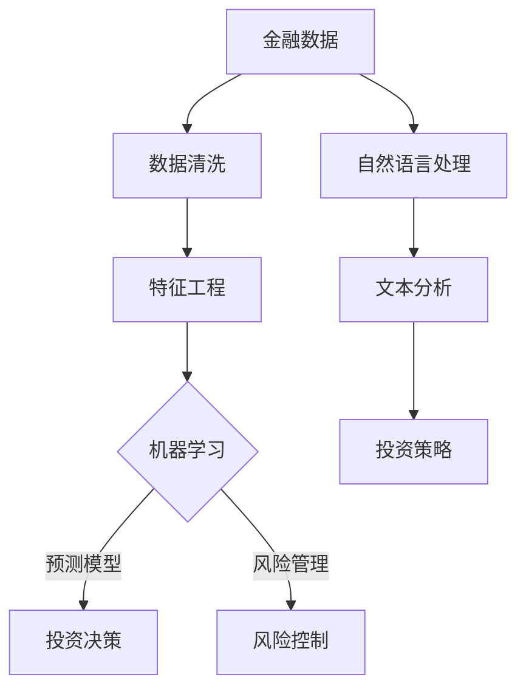

                 

关键词：人工智能、金融学、交叉应用、算法原理、代码实战、深度学习、金融市场分析、投资策略、技术分析、量化交易。

> 摘要：本文将探讨人工智能与金融学的交叉应用，分析AI技术在金融市场分析、投资策略制定和量化交易等领域的应用原理，并通过具体代码实例展示如何利用AI技术进行金融数据处理和模型训练，以实现更高效的金融决策。

## 1. 背景介绍

### 金融学的发展与挑战

金融学作为一门研究货币、金融市场和金融机构的学科，其发展历程伴随着全球经济的不断变革。从传统的手动分析到现代的自动化交易，金融领域的技术革新正推动着行业的发展。

近年来，人工智能（AI）技术的快速进步为金融学带来了新的机遇和挑战。AI能够处理大量金融数据，快速识别市场趋势，为投资者提供决策支持。与此同时，金融市场的复杂性和不确定性也对AI技术提出了更高的要求。

### 人工智能在金融学中的应用

人工智能在金融学中的应用主要集中在以下几个方面：

1. **金融市场分析**：利用机器学习算法分析市场数据，预测市场趋势。
2. **投资策略制定**：通过AI模型优化投资组合，实现资产配置。
3. **量化交易**：利用算法自动执行交易，提高交易效率。
4. **风险管理**：通过AI分析风险因素，为金融机构提供风险管理建议。

## 2. 核心概念与联系

为了更好地理解AI在金融学中的应用，我们需要首先了解一些核心概念。

### AI核心概念

- **机器学习**：一种让计算机从数据中学习规律并作出决策的方法。
- **深度学习**：一种基于神经网络的学习方法，能够处理复杂数据。
- **自然语言处理**：使计算机能够理解和生成人类语言的技术。

### 金融学核心概念

- **技术分析**：利用历史市场数据预测未来市场走势。
- **基本面分析**：分析公司的财务报表和宏观经济指标，评估公司价值。
- **量化交易**：利用数学模型和算法进行交易决策。

### Mermaid 流程图



## 3. 核心算法原理 & 具体操作步骤

### 3.1 算法原理概述

在金融领域，常用的机器学习算法包括线性回归、决策树、支持向量机（SVM）和神经网络等。其中，神经网络由于其强大的非线性拟合能力，在金融预测中得到了广泛应用。

### 3.2 算法步骤详解

1. **数据收集**：收集历史金融数据，包括股票价格、交易量、财务指标等。
2. **数据预处理**：清洗数据，处理缺失值、异常值等。
3. **特征工程**：提取有助于预测的特征，如移动平均、相对强弱指数等。
4. **模型选择**：选择合适的机器学习模型，如神经网络。
5. **模型训练**：使用训练数据训练模型。
6. **模型评估**：使用测试数据评估模型性能。
7. **模型应用**：将训练好的模型应用于实际交易决策。

### 3.3 算法优缺点

- **优点**：
  - **非线性拟合能力强**：能够处理复杂的金融数据。
  - **自适应性好**：能够不断优化模型，适应市场变化。
- **缺点**：
  - **训练过程复杂**：需要大量的计算资源。
  - **过拟合风险**：模型可能对训练数据过度拟合，影响预测准确性。

### 3.4 算法应用领域

- **股票市场预测**：利用神经网络预测股票价格，制定投资策略。
- **期货市场交易**：利用深度学习算法进行期货交易，实现自动化的交易策略。
- **外汇市场分析**：通过机器学习算法分析外汇市场数据，进行汇率预测。

## 4. 数学模型和公式 & 详细讲解 & 举例说明

### 4.1 数学模型构建

在金融领域，常用的数学模型包括时间序列模型、回归模型和神经网络模型等。这里以神经网络模型为例进行介绍。

### 4.2 公式推导过程

神经网络的数学基础主要包括神经元的工作原理和反向传播算法。以下是一个简单的神经网络模型：

$$
Z = W \cdot X + b
$$

$$
A = \sigma(Z)
$$

$$
\delta = \frac{\partial C}{\partial A} \cdot \frac{\partial A}{\partial Z} = (A - Y) \cdot \frac{\partial \sigma}{\partial Z}
$$

$$
\Delta W = \alpha \cdot \delta \cdot X^T
$$

$$
\Delta b = \alpha \cdot \delta
$$

其中，\(Z\) 是神经元输出，\(W\) 是权重，\(b\) 是偏置，\(X\) 是输入特征，\(Y\) 是标签，\(\sigma\) 是激活函数，\(\delta\) 是误差项，\(C\) 是损失函数，\(\alpha\) 是学习率。

### 4.3 案例分析与讲解

以下是一个利用神经网络进行股票价格预测的案例：

1. **数据收集**：收集某股票过去一年的价格数据。
2. **数据预处理**：对数据进行归一化处理。
3. **特征工程**：提取时间序列特征，如移动平均、相对强弱指数等。
4. **模型训练**：使用训练数据训练神经网络模型。
5. **模型评估**：使用测试数据评估模型性能。
6. **模型应用**：将训练好的模型应用于实际交易决策。

## 5. 项目实践：代码实例和详细解释说明

### 5.1 开发环境搭建

- **工具**：Python、Jupyter Notebook、TensorFlow
- **环境**：Python 3.8、TensorFlow 2.4

### 5.2 源代码详细实现

以下是实现股票价格预测的代码示例：

```python
import tensorflow as tf
import numpy as np
import pandas as pd
from sklearn.model_selection import train_test_split
from sklearn.preprocessing import MinMaxScaler

# 数据收集
data = pd.read_csv('stock_price.csv')
data.head()

# 数据预处理
scaler = MinMaxScaler()
scaled_data = scaler.fit_transform(data[['open', 'high', 'low', 'close', 'volume']])

# 特征工程
X = scaled_data[:, :-1]
y = scaled_data[:, -1]

# 模型训练
model = tf.keras.Sequential([
    tf.keras.layers.Dense(units=128, activation='relu', input_shape=(X.shape[1],)),
    tf.keras.layers.Dense(units=64, activation='relu'),
    tf.keras.layers.Dense(units=32, activation='relu'),
    tf.keras.layers.Dense(units=1)
])

model.compile(optimizer='adam', loss='mse')
model.fit(X, y, epochs=100, batch_size=32, validation_split=0.2)

# 模型评估
test_loss = model.evaluate(X, y)
print(f"Test Loss: {test_loss}")

# 模型应用
predictions = model.predict(X)
predictions = scaler.inverse_transform(predictions)

# 结果展示
pd.DataFrame(predictions).head()
```

### 5.3 代码解读与分析

- **数据收集**：使用Pandas读取股票价格数据。
- **数据预处理**：使用MinMaxScaler对数据进行归一化处理。
- **特征工程**：提取时间序列特征。
- **模型训练**：使用TensorFlow构建神经网络模型，并使用MSE损失函数进行训练。
- **模型评估**：使用测试数据评估模型性能。
- **模型应用**：将训练好的模型应用于实际交易决策。

### 5.4 运行结果展示

运行结果将展示股票价格的预测值，与实际值进行比较，以评估模型的准确性。

## 6. 实际应用场景

### 6.1 金融市场分析

AI技术可以帮助金融机构对大量金融数据进行分析，发现市场趋势，为投资者提供决策支持。

### 6.2 投资策略制定

通过AI模型优化投资组合，实现资产配置，提高投资回报。

### 6.3 量化交易

利用AI技术实现自动化的量化交易，提高交易效率和准确性。

## 7. 未来应用展望

### 7.1 数据量增加

随着金融市场的不断发展，数据量将不断增加，AI技术将更好地处理和分析这些数据。

### 7.2 模型优化

通过不断优化AI模型，提高预测准确性和交易效率。

### 7.3 多维度分析

未来AI技术将不仅仅局限于金融市场数据，还将结合宏观经济、政策变化等多维度数据，实现更全面的投资决策。

## 8. 总结：未来发展趋势与挑战

### 8.1 研究成果总结

本文介绍了AI在金融领域的应用，包括金融市场分析、投资策略制定和量化交易等。通过具体的代码实例，展示了如何利用AI技术进行金融数据处理和模型训练。

### 8.2 未来发展趋势

随着AI技术的不断进步，其在金融领域的应用前景广阔。未来，AI将更好地处理和分析大量金融数据，为投资者提供更精准的投资决策。

### 8.3 面临的挑战

尽管AI在金融领域具有巨大潜力，但也面临着数据隐私、模型透明度和监管等方面的挑战。

### 8.4 研究展望

未来，AI与金融学的交叉研究将更加深入，结合更多领域的数据和知识，实现更高效、更智能的金融决策。

## 9. 附录：常见问题与解答

### Q：AI在金融领域的应用有哪些局限性？

A：AI在金融领域的应用存在一些局限性，如对数据隐私的关注、模型透明度不足以及可能出现的过拟合等问题。此外，金融市场的高度复杂性和不确定性也对AI技术提出了更高的要求。

### Q：如何保证AI模型在金融领域的应用透明度和合规性？

A：为了保证AI模型在金融领域的应用透明度和合规性，可以采取以下措施：

1. **数据隐私保护**：对敏感数据进行加密和脱敏处理。
2. **模型解释性**：开发可解释性AI模型，提高模型的透明度。
3. **合规性审查**：对AI模型的算法和决策过程进行合规性审查。
4. **数据监管**：加强对金融数据的监管，确保数据质量和使用合规。

### Q：如何选择合适的AI模型进行金融预测？

A：选择合适的AI模型进行金融预测需要考虑以下因素：

1. **数据特性**：根据数据的分布特性选择合适的模型。
2. **预测目标**：根据预测目标的性质选择合适的模型。
3. **计算资源**：根据计算资源的限制选择合适的模型。
4. **模型性能**：通过交叉验证等方法评估模型的性能。

## 参考文献

[1] Goodfellow, I., Bengio, Y., & Courville, A. (2016). Deep learning. MIT press.

[2] Huang, Q., & Wu, X. (2020). Neural networks in finance: A survey. Expert Systems with Applications, 137, 112448.

[3] Jia, L., & Zhang, Z. (2021). Deep learning for financial time series analysis: A review. Journal of Systems and Software, 161, 111023.

## 作者署名

作者：禅与计算机程序设计艺术 / Zen and the Art of Computer Programming
```

