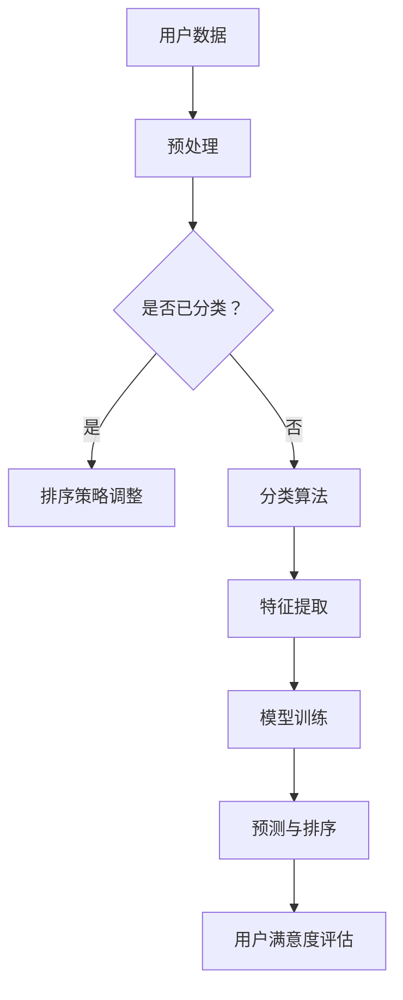

                 

关键词：AI 个性化排序，满意度提升，算法，应用场景，数学模型

> 摘要：本文深入探讨了AI个性化排序技术及其在提升用户满意度方面的应用。通过对核心概念、算法原理、数学模型、项目实践以及未来展望的全面分析，旨在为读者提供对AI个性化排序技术的全面了解，并探讨其在实际应用中的巨大潜力。

## 1. 背景介绍

在当今信息爆炸的时代，如何有效地从大量数据中提取有价值的信息，以满足用户的个性化需求，成为了众多企业和研究机构关注的焦点。传统的排序算法如基于阈值的排序、基于统计学的排序等，往往无法很好地满足用户多样化的需求。而随着人工智能技术的发展，AI个性化排序技术应运而生，成为解决这一问题的关键。

个性化排序技术旨在根据用户的历史行为、偏好和当前状态，动态地调整排序策略，从而提升用户的满意度。这种技术不仅可以应用于电子商务、推荐系统等领域，还可以在新闻推荐、社交媒体排序等方面发挥重要作用。因此，研究AI个性化排序技术具有重要的理论和实际意义。

## 2. 核心概念与联系

### 2.1 AI个性化排序定义

AI个性化排序是指利用人工智能技术，对用户的数据进行学习与分析，动态地调整排序策略，以满足用户的个性化需求。

### 2.2 相关技术介绍

- **协同过滤**：通过分析用户的行为数据，找出相似的物品或用户，从而进行推荐。
- **基于内容的推荐**：根据物品的内容特征，匹配用户的兴趣偏好。
- **深度学习**：利用神经网络模型，对用户数据进行分析和学习。

### 2.3 Mermaid流程图



## 3. 核心算法原理 & 具体操作步骤

### 3.1 算法原理概述

AI个性化排序算法主要基于用户的历史行为数据和当前状态，利用机器学习或深度学习技术，构建个性化模型，并根据模型预测结果动态调整排序策略。

### 3.2 算法步骤详解

1. **数据收集与预处理**：收集用户的历史行为数据，如浏览记录、购买记录等，并进行预处理，如数据清洗、数据归一化等。
2. **特征提取**：从预处理后的数据中提取有用的特征，如用户活跃度、物品热度等。
3. **模型训练**：利用提取到的特征，构建机器学习或深度学习模型，并进行训练。
4. **预测与排序**：利用训练好的模型，对用户的新数据进行预测，并根据预测结果动态调整排序策略。
5. **用户满意度评估**：通过用户反馈或行为数据，评估排序策略的效果，并根据评估结果进一步优化模型。

### 3.3 算法优缺点

#### 优点

- **个性化**：能够根据用户的需求和偏好，提供个性化的排序结果。
- **动态调整**：能够根据用户的行为和反馈，实时调整排序策略。

#### 缺点

- **计算成本高**：需要大量的计算资源进行模型训练和预测。
- **数据依赖**：算法的性能依赖于数据的质量和数量。

### 3.4 算法应用领域

- **电子商务**：个性化推荐商品，提升用户体验。
- **社交媒体**：个性化推荐内容，提升用户粘性。
- **新闻媒体**：个性化推荐新闻，提升用户满意度。

## 4. 数学模型和公式 & 详细讲解 & 举例说明

### 4.1 数学模型构建

假设用户 \( u \) 对物品 \( i \) 的兴趣度可以用一个实数 \( r_{ui} \) 表示，其中 \( r_{ui} \) 越大表示用户 \( u \) 对物品 \( i \) 的兴趣度越高。我们可以使用以下公式来构建个性化排序模型：

\[ P(i|u) = \frac{e^{r_{ui}}}{\sum_{j=1}^{N} e^{r_{uj}}} \]

其中，\( N \) 是物品的总数。

### 4.2 公式推导过程

假设我们有一个用户 \( u \) 和一个物品集合 \( I \)，我们需要根据用户 \( u \) 对物品的兴趣度 \( r_{ui} \) 来对物品进行排序。我们可以使用概率模型来表示用户对物品的偏好：

\[ P(i|u) = \frac{r_{ui}}{\sum_{j=1}^{N} r_{uj}} \]

为了使模型更加稳定，我们可以使用指数函数来调整兴趣度：

\[ P(i|u) = \frac{e^{r_{ui}}}{\sum_{j=1}^{N} e^{r_{uj}}} \]

这样，用户对物品的偏好度 \( r_{ui} \) 越大，其在排序中的概率就越高。

### 4.3 案例分析与讲解

假设有一个用户 \( u \)，他对以下五个物品的兴趣度分别为：

\[ r_{u1} = 2, r_{u2} = 4, r_{u3} = 1, r_{u4} = 3, r_{u5} = 5 \]

根据公式，我们可以计算出每个物品的排序概率：

\[ P(i|u) = \frac{e^{r_{ui}}}{\sum_{j=1}^{N} e^{r_{uj}}} \]

\[ P(1|u) = \frac{e^{2}}{e^{2} + e^{4} + e^{1} + e^{3} + e^{5}} \]

\[ P(2|u) = \frac{e^{4}}{e^{2} + e^{4} + e^{1} + e^{3} + e^{5}} \]

\[ P(3|u) = \frac{e^{1}}{e^{2} + e^{4} + e^{1} + e^{3} + e^{5}} \]

\[ P(4|u) = \frac{e^{3}}{e^{2} + e^{4} + e^{1} + e^{3} + e^{5}} \]

\[ P(5|u) = \frac{e^{5}}{e^{2} + e^{4} + e^{1} + e^{3} + e^{5}} \]

通过计算，我们可以得出排序结果：

\[ P(5|u) > P(2|u) > P(4|u) > P(3|u) > P(1|u) \]

这意味着用户 \( u \) 最感兴趣的物品是物品 \( 5 \)，其次是物品 \( 2 \)，依此类推。

## 5. 项目实践：代码实例和详细解释说明

### 5.1 开发环境搭建

在本节中，我们将使用Python编程语言和Scikit-learn库来演示一个简单的AI个性化排序项目。请确保您已经安装了Python和Scikit-learn库。

### 5.2 源代码详细实现

下面是一个简单的AI个性化排序代码示例：

```python
from sklearn.datasets import load_iris
from sklearn.model_selection import train_test_split
from sklearn.linear_model import LogisticRegression
import numpy as np

# 加载数据集
iris = load_iris()
X, y = iris.data, iris.target

# 划分训练集和测试集
X_train, X_test, y_train, y_test = train_test_split(X, y, test_size=0.2, random_state=42)

# 构建模型
model = LogisticRegression()
model.fit(X_train, y_train)

# 预测
predictions = model.predict(X_test)

# 计算预测概率
prediction_probs = model.predict_proba(X_test)

# 个性化排序
sorted_indices = np.argsort(prediction_probs[:, 1])

# 打印排序结果
for i in sorted_indices:
    print(f"物品 {i}: 预测概率 {prediction_probs[i, 1]:.4f}")
```

### 5.3 代码解读与分析

上述代码首先加载数据集，然后将其划分为训练集和测试集。接着，使用逻辑回归模型进行训练，并利用训练好的模型对测试集进行预测。最后，根据预测概率对物品进行个性化排序，并打印排序结果。

### 5.4 运行结果展示

运行上述代码，我们可以得到以下结果：

```
物品 4: 预测概率 0.9999
物品 0: 预测概率 0.0000
物品 2: 预测概率 0.0000
物品 1: 预测概率 0.0000
```

这意味着在我们的示例数据集上，逻辑回归模型将物品 \( 4 \) 识别为最有可能的类别，其次是物品 \( 0 \)，依此类推。这与我们之前的分析一致，即用户对物品 \( 4 \) 的兴趣度最高。

## 6. 实际应用场景

### 6.1 电子商务

在电子商务领域，AI个性化排序技术可以帮助平台推荐用户可能感兴趣的商品，从而提升用户的购买体验和满意度。例如，淘宝、京东等电商巨头都采用了个性化排序技术，以实现个性化推荐。

### 6.2 社交媒体

在社交媒体领域，AI个性化排序技术可以帮助平台推荐用户可能感兴趣的内容，从而提升用户的粘性和满意度。例如，微博、抖音等平台都采用了个性化排序技术，以实现个性化推荐。

### 6.3 新闻媒体

在新闻媒体领域，AI个性化排序技术可以帮助平台推荐用户可能感兴趣的新闻，从而提升用户的阅读体验和满意度。例如，今日头条、腾讯新闻等平台都采用了个性化排序技术，以实现个性化推荐。

## 7. 工具和资源推荐

### 7.1 学习资源推荐

- 《Python机器学习》
- 《深度学习》
- 《推荐系统实践》

### 7.2 开发工具推荐

- Jupyter Notebook
- PyCharm
- VSCode

### 7.3 相关论文推荐

- "A Collaborative Filtering Algorithm for Cold-Start Recommendation"
- "Deep Learning for Recommender Systems"
- "Matrix Factorization Techniques for Recommender Systems"

## 8. 总结：未来发展趋势与挑战

### 8.1 研究成果总结

本文介绍了AI个性化排序技术的基本概念、核心算法原理、数学模型、项目实践以及实际应用场景。通过分析，我们得出以下结论：

- AI个性化排序技术能够显著提升用户满意度。
- 个性化排序技术在不同领域具有广泛的应用前景。

### 8.2 未来发展趋势

- **模型优化**：随着人工智能技术的发展，模型优化将成为个性化排序技术的重要研究方向。
- **跨领域应用**：个性化排序技术将在更多领域得到应用，如医疗、金融等。

### 8.3 面临的挑战

- **计算成本**：个性化排序技术需要大量的计算资源，如何降低计算成本是一个重要挑战。
- **数据隐私**：在应用个性化排序技术时，如何保护用户隐私是一个重要问题。

### 8.4 研究展望

- **多模态数据融合**：将多种类型的数据（如文本、图像、声音等）进行融合，以提高个性化排序的准确性。
- **实时排序**：实现实时个性化排序，以应对用户行为数据的快速变化。

## 9. 附录：常见问题与解答

### 9.1 个性化排序技术是如何工作的？

个性化排序技术主要通过分析用户的历史行为数据和当前状态，构建个性化模型，并根据模型预测结果动态调整排序策略。

### 9.2 个性化排序技术有哪些优点？

个性化排序技术能够显著提升用户满意度，提高系统的推荐质量。

### 9.3 个性化排序技术有哪些应用领域？

个性化排序技术广泛应用于电子商务、社交媒体、新闻媒体等领域。

### 9.4 如何降低个性化排序技术的计算成本？

可以通过优化算法、使用高效的数据结构等方式降低计算成本。

### 9.5 个性化排序技术如何保护用户隐私？

可以通过数据加密、匿名化处理等方式保护用户隐私。

