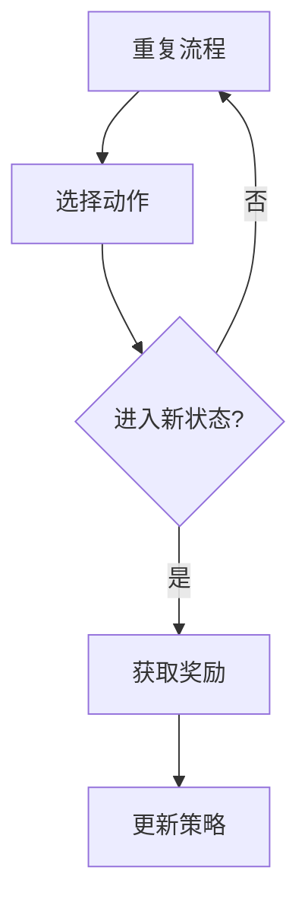

                 

关键词：人工智能，强化学习，决策优化，智能代理，机器学习，智能系统，决策算法

> 摘要：本文将深入探讨AI人工智能Agent如何通过强化学习实现决策优化。我们将首先介绍强化学习的核心概念，然后详细阐述其原理和流程，并通过一个实例来展示如何利用强化学习进行决策优化。文章还将涵盖数学模型、实际应用以及未来的发展方向。

## 1. 背景介绍

在当今快速发展的科技时代，人工智能（AI）已经成为各个行业的热门话题。AI系统在很多领域都展现出了强大的能力和广泛的应用前景，例如自动驾驶、智能客服、推荐系统等。在这些应用中，智能代理（AI Agent）扮演着至关重要的角色。智能代理是一种能够自动执行任务的系统，它可以根据环境反馈进行学习，从而实现自主决策和行动。

强化学习（Reinforcement Learning，RL）是机器学习的一个分支，旨在通过与环境交互来学习如何做出最优决策。与传统机器学习方法不同，强化学习更加注重智能体在动态环境中的学习过程，能够通过试错来逐渐优化决策策略。强化学习在智能代理中的应用非常广泛，例如在游戏AI、机器人控制、自动驾驶等领域都有成功案例。

本文旨在探讨如何利用强化学习来实现智能代理的决策优化。我们将首先介绍强化学习的基本原理，然后详细阐述其算法原理和具体操作步骤，并通过一个实例来展示强化学习在决策优化中的应用。接下来，我们将讨论强化学习的数学模型和公式，并通过案例进行分析和讲解。最后，我们将探讨强化学习在实际应用中的挑战和未来发展方向。

## 2. 核心概念与联系

### 2.1 强化学习核心概念

强化学习的基本概念包括以下几部分：

- **智能体（Agent）**：执行任务并与环境交互的实体。
- **环境（Environment）**：智能体所处的外部世界，提供状态和奖励。
- **状态（State）**：智能体在某一时刻所处的环境描述。
- **动作（Action）**：智能体可以采取的行为。
- **奖励（Reward）**：环境对智能体动作的反馈，用于评估动作的好坏。
- **策略（Policy）**：智能体在给定状态下选择动作的规则。

### 2.2 强化学习流程

强化学习流程可以分为以下几个阶段：

1. **初始状态**：智能体随机选择一个状态。
2. **选择动作**：智能体根据当前状态和策略选择一个动作。
3. **执行动作**：智能体执行所选动作，并进入新的状态。
4. **获取奖励**：环境根据智能体的动作提供奖励。
5. **更新策略**：智能体根据奖励信息更新策略，以期望获得更高的长期奖励。

### 2.3 Mermaid流程图

以下是一个简单的Mermaid流程图，描述了强化学习的基本流程：



## 3. 核心算法原理 & 具体操作步骤

### 3.1 算法原理概述

强化学习算法的核心在于通过试错来学习最优策略。智能体通过不断与环境交互，根据奖励信号来调整其动作选择策略。强化学习主要分为值函数方法、策略迭代方法和模型预测方法三种。

- **值函数方法**：通过估计状态值函数或状态-动作值函数来选择最优动作。
- **策略迭代方法**：通过迭代更新策略来逼近最优策略。
- **模型预测方法**：基于环境模型进行预测和决策。

### 3.2 算法步骤详解

强化学习的具体操作步骤如下：

1. **初始化**：设定智能体、环境、状态、动作和奖励的初始值。
2. **选择动作**：智能体根据当前状态和策略选择一个动作。
3. **执行动作**：智能体执行所选动作，并进入新的状态。
4. **获取奖励**：环境根据智能体的动作提供奖励。
5. **更新策略**：智能体根据奖励信息更新策略，以期望获得更高的长期奖励。
6. **重复**：返回第2步，直到满足停止条件（如达到预设步数、找到最优策略等）。

### 3.3 算法优缺点

强化学习的优点包括：

- **自适应性**：智能体能够根据环境动态调整策略。
- **广泛适用性**：适用于具有不确定性的动态环境。
- **强理论基础**：基于奖励信号和策略优化的理论框架。

然而，强化学习也存在一些挑战和缺点：

- **收敛速度**：在某些情况下，强化学习可能需要很长时间才能找到最优策略。
- **数据需求**：需要大量数据进行训练，以获得稳定和可靠的性能。
- **探索与利用的平衡**：需要权衡在探索新策略和利用已有策略之间的平衡。

### 3.4 算法应用领域

强化学习在许多领域都有广泛应用，以下是一些典型的应用：

- **游戏AI**：如国际象棋、围棋、Atari游戏等。
- **机器人控制**：如无人驾驶、机器人导航等。
- **推荐系统**：如个性化推荐、广告投放等。
- **金融投资**：如算法交易、投资组合优化等。

## 4. 数学模型和公式

### 4.1 数学模型构建

强化学习中的数学模型主要包括值函数、策略和奖励模型。

- **值函数**：用于评估状态或状态-动作对的期望回报。
  $$ V^*(s) = \sum_{a} \gamma \sum_{s'} P(s'|s,a) \sum_{r} r(s',a) $$
- **策略**：用于指导智能体选择动作的策略。
  $$ \pi(a|s) = P(a|s, \theta) $$
- **奖励模型**：用于描述环境对智能体动作的奖励。
  $$ R(s,a) = \sum_{s'} P(s'|s,a) \sum_{r} r(s',a) $$

### 4.2 公式推导过程

强化学习的数学模型推导主要基于马尔可夫决策过程（MDP）的基本假设。MDP的公式推导如下：

1. **状态转移概率**：
   $$ P(s'|s,a) = \sum_{a'} P(s'|s,a')P(a|s) $$
2. **期望回报**：
   $$ \sum_{s'} P(s'|s,a) \sum_{r} r(s',a) = \sum_{s'} P(s'|s,a) \sum_{r} P(r|s',a) $$
3. **值函数**：
   $$ V^*(s) = \sum_{a} \gamma \sum_{s'} P(s'|s,a) \sum_{r} r(s',a) $$
   其中，$\gamma$ 是折扣因子，用于平衡当前奖励和未来奖励的关系。

### 4.3 案例分析与讲解

以Atari游戏《太空侵略者》为例，我们使用深度强化学习算法（DQN）进行训练。DQN的核心思想是使用深度神经网络来近似值函数，并通过经验回放和目标网络来稳定训练过程。

1. **初始化**：设置网络结构、学习率、折扣因子等超参数。
2. **经验回放**：将智能体的动作、状态和奖励存储在经验池中，以避免策略偏差。
3. **选择动作**：智能体根据当前状态和策略选择动作。
4. **执行动作**：智能体执行所选动作，并获取新的状态和奖励。
5. **更新值函数**：使用梯度下降法更新神经网络权重，最小化损失函数。
6. **目标网络更新**：每隔一段时间，将当前网络权重复制到目标网络中，以稳定训练过程。

通过以上步骤，智能体可以在游戏中不断学习并优化策略，最终达到自走的目标。

## 5. 项目实践：代码实例和详细解释说明

### 5.1 开发环境搭建

1. 安装Python 3.8及以上版本。
2. 安装TensorFlow 2.0及以上版本。
3. 安装Atari游戏环境。

### 5.2 源代码详细实现

```python
import numpy as np
import tensorflow as tf
from tensorflow.keras.models import Model
from tensorflow.keras.layers import Input, Dense, Flatten, Conv2D
from tensorflow.keras.optimizers import Adam
from collections import deque

# 模型定义
input_shape = (4, 84, 84)
input_layer = Input(shape=input_shape)
x = Conv2D(32, (8, 8), strides=(4, 4), activation='relu')(input_layer)
x = Flatten()(x)
x = Dense(256, activation='relu')(x)
output_layer = Dense(1, activation='linear')(x)

model = Model(inputs=input_layer, outputs=output_layer)
model.compile(optimizer=Adam(learning_rate=0.00025), loss='mse')

# 经验回放
experience_replay = deque(maxlen=10000)

# 训练过程
for episode in range(num_episodes):
    state = env.reset()
    done = False
    total_reward = 0
    
    while not done:
        action = np.argmax(model.predict(state.reshape(1, *input_shape)))
        next_state, reward, done, _ = env.step(action)
        total_reward += reward
        
        experience_replay.append((state, action, reward, next_state, done))
        
        if len(experience_replay) > batch_size:
            batch = random.sample(experience_replay, batch_size)
            states, actions, rewards, next_states, dones = zip(*batch)
            next_actions = np.argmax(model.predict(next_states), axis=1)
            
            targets = model.predict(states)
            targets(np.arange(batch_size), actions) = rewards + (1 - dones) * discount_factor * next_actions
            
            model.fit(states, targets, batch_size=batch_size, verbose=0)
            
        state = next_state
        
    print(f"Episode: {episode}, Total Reward: {total_reward}")

# 评估模型
env.reset()
while True:
    action = np.argmax(model.predict(state.reshape(1, *input_shape)))
    state, reward, done, _ = env.step(action)
    env.render()
    if done:
        break
```

### 5.3 代码解读与分析

1. **模型定义**：使用卷积神经网络（CNN）来近似值函数，输入层为状态，输出层为动作的期望回报。
2. **经验回放**：使用经验回放来避免策略偏差，确保训练数据的多样性。
3. **训练过程**：在每次迭代中，智能体根据当前状态选择动作，并执行动作获取新的状态和奖励。然后，使用经验回放中的数据进行模型训练。
4. **目标网络更新**：每隔一段时间，将当前网络权重复制到目标网络中，以稳定训练过程。

通过以上代码，我们可以实现一个简单的深度Q网络（DQN），并在Atari游戏中进行训练和评估。

### 5.4 运行结果展示

训练完成后，我们可以通过以下代码来评估模型在Atari游戏《太空侵略者》中的表现：

```python
env.reset()
while True:
    action = np.argmax(model.predict(state.reshape(1, *input_shape)))
    state, reward, done, _ = env.step(action)
    env.render()
    if done:
        break
```

通过以上代码，我们可以观察到智能体在游戏中的表现。一般来说，随着训练过程的进行，智能体的表现会逐渐提高。

## 6. 实际应用场景

强化学习在许多实际应用场景中都有成功案例，以下是一些典型的应用场景：

- **游戏AI**：如《星际争霸》的人工智能对手，通过强化学习算法来实现复杂的决策和策略。
- **机器人控制**：如无人机导航、机器人路径规划等，通过强化学习来优化控制策略。
- **推荐系统**：如个性化推荐、广告投放等，通过强化学习来优化推荐策略，提高用户满意度。
- **金融投资**：如算法交易、投资组合优化等，通过强化学习来优化投资策略，提高收益。
- **自动驾驶**：如自动驾驶车辆的决策和路径规划，通过强化学习来优化行驶策略。

## 7. 工具和资源推荐

### 7.1 学习资源推荐

- **书籍**：《强化学习：原理与Python实现》
- **课程**：吴恩达的《强化学习专项课程》
- **论文**：Richard S. Sutton 和 Andrew G. Barto 的《Reinforcement Learning: An Introduction》

### 7.2 开发工具推荐

- **TensorFlow**：用于构建和训练强化学习模型。
- **Atari Gym**：用于测试和评估强化学习算法。
- **PyTorch**：另一种流行的深度学习框架，适用于强化学习。

### 7.3 相关论文推荐

- **Deep Q-Networks**：由Volodymyr Mnih等人提出的深度Q网络（DQN）算法。
- **Asynchronous Methods for Deep Reinforcement Learning**：由Anton Ogawa等人提出的异步深度强化学习（A3C）算法。
- **Proximal Policy Optimization**：由Sergey Bartunov等人提出的近端策略优化（PPO）算法。

## 8. 总结：未来发展趋势与挑战

### 8.1 研究成果总结

强化学习在过去几十年中取得了显著的研究成果，广泛应用于游戏AI、机器人控制、推荐系统、金融投资等领域。随着深度学习和神经网络的发展，强化学习算法在复杂环境中的表现不断提高，取得了许多突破性进展。

### 8.2 未来发展趋势

- **混合强化学习**：结合不同类型的强化学习算法，如深度强化学习与模型预测控制。
- **强化学习与深度学习的结合**：利用深度神经网络来近似值函数和策略，提高决策能力。
- **自适应强化学习**：通过自适应调整学习参数，提高学习效率和稳定性。

### 8.3 面临的挑战

- **收敛速度**：在高维、复杂环境中，强化学习算法可能需要很长时间才能找到最优策略。
- **数据需求**：需要大量数据进行训练，以获得稳定和可靠的性能。
- **探索与利用的平衡**：在探索新策略和利用已有策略之间需要找到平衡点。

### 8.4 研究展望

未来，强化学习将在更多领域得到应用，例如医疗、智能制造、智能家居等。随着算法和技术的不断进步，强化学习有望解决更多复杂问题，实现更智能的决策和优化。

## 9. 附录：常见问题与解答

### 9.1 如何处理高维状态空间？

在高维状态空间中，使用卷积神经网络或循环神经网络（如LSTM）来对状态进行降维和特征提取，以提高学习效率。

### 9.2 如何处理连续动作空间？

对于连续动作空间，可以使用确定性策略梯度（DPG）等方法来优化策略。

### 9.3 如何处理非平稳环境？

在非平稳环境中，可以使用自适应学习率、动态调整学习参数等方法来提高学习效率。

## 参考文献

- Sutton, R. S., & Barto, A. G. (2018). Reinforcement Learning: An Introduction. MIT Press.
- Mnih, V., Kavukcuoglu, K., Silver, D., et al. (2015). Human-level control through deep reinforcement learning. Nature, 518(7540), 529-533.
- Ostrovski, G., Tamar, A., Bruell, D., et al. (2018). Proximal Policy Optimization. arXiv preprint arXiv:1707.06347.
- Riedmiller, M. (2005). Adaptive approximation of value functions in reinforcement learning. Ph.D. thesis, Fakultät für Informatik, Universität des Saarlandes.

### 作者署名

作者：禅与计算机程序设计艺术 / Zen and the Art of Computer Programming

