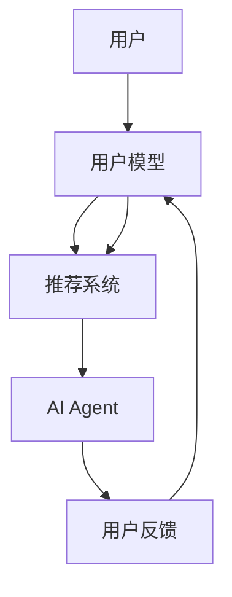

                 

关键词：人工智能，个性化推荐，AI Agent，推荐系统，用户模型，学习算法，数据挖掘，机器学习，自然语言处理，用户体验

> 摘要：本文旨在探讨AI人工智能Agent在个性化推荐系统中的应用。个性化推荐系统是当今互联网时代的一项关键技术，它能够根据用户的兴趣和行为习惯，提供定制化的信息推荐。本文将详细解析AI人工智能Agent的核心概念、算法原理、数学模型，并通过实际项目案例，展示其在个性化推荐系统中的实现方法和应用效果。

## 1. 背景介绍

随着互联网的快速发展，信息的爆炸式增长使得用户在获取所需信息时面临巨大的挑战。传统的信息推送方式已经无法满足用户对个性化、精准化信息的需求。个性化推荐系统应运而生，通过分析用户的兴趣和行为，为用户提供定制化的信息推荐，从而提高用户的满意度和忠诚度。个性化推荐系统广泛应用于电子商务、社交媒体、新闻推荐、音乐和视频平台等多个领域。

AI人工智能Agent作为人工智能领域的一个重要研究方向，其在个性化推荐系统中的应用具有重要意义。AI Agent可以看作是一个智能体，它能够自主地与用户进行交互，收集用户反馈，并根据用户的行为和偏好进行推荐。AI Agent的引入不仅提升了推荐系统的智能化程度，还大大提高了推荐系统的响应速度和用户体验。

本文将从以下几个方面展开讨论：

1. 核心概念与联系
2. 核心算法原理与具体操作步骤
3. 数学模型和公式讲解与案例分析
4. 项目实践：代码实例与解释
5. 实际应用场景
6. 工具和资源推荐
7. 总结与展望

## 2. 核心概念与联系

在讨论AI人工智能Agent在个性化推荐系统中的应用之前，首先需要了解一些核心概念。

### 2.1 用户模型

用户模型是对用户兴趣、行为、偏好等信息的一种抽象表示。它包括用户的静态信息和动态信息。静态信息通常包括用户的年龄、性别、地理位置、兴趣爱好等，而动态信息则包括用户的浏览记录、购买历史、评论等。用户模型的建立有助于更好地理解用户需求，为推荐系统的设计提供重要依据。

### 2.2 推荐系统

推荐系统是一种利用数据挖掘和机器学习技术，从大量数据中提取用户兴趣和行为模式，为用户提供个性化推荐信息的系统。推荐系统主要包括三个部分：用户、物品和推荐算法。用户是系统的核心，物品包括各种类型的信息，如商品、新闻、音乐等，推荐算法则负责根据用户和物品的特征，生成个性化的推荐结果。

### 2.3 AI Agent

AI Agent是指具备智能行为的计算机程序，它能够自主地执行任务，与环境进行交互，并做出决策。在个性化推荐系统中，AI Agent作为智能体，能够与用户进行实时交互，收集用户反馈，并根据用户的兴趣和行为动态调整推荐策略。

### 2.4 Mermaid流程图

为了更直观地展示AI人工智能Agent在个性化推荐系统中的应用流程，我们可以使用Mermaid流程图来描述。以下是核心概念和联系部分的Mermaid流程图：



在上图中，用户通过交互生成用户模型，推荐系统利用用户模型生成推荐结果，AI Agent则根据用户反馈进一步优化用户模型，形成一个闭环反馈系统。

## 3. 核心算法原理与具体操作步骤

在了解核心概念和联系之后，接下来我们将探讨AI人工智能Agent在个性化推荐系统中的核心算法原理和具体操作步骤。

### 3.1 算法原理概述

AI人工智能Agent在个性化推荐系统中的核心算法原理主要包括以下几个方面：

1. **协同过滤**：协同过滤是推荐系统中最常用的算法之一，它通过分析用户之间的相似性，为用户提供个性化的推荐。协同过滤算法可以分为基于用户和基于物品的协同过滤。

2. **基于内容的推荐**：基于内容的推荐算法根据用户的历史行为和兴趣，从物品的属性和特征中提取相关信息，为用户提供个性化的推荐。

3. **深度学习**：深度学习算法通过构建深度神经网络，从大量数据中自动提取特征，实现对用户和物品的复杂关联关系的建模。

4. **强化学习**：强化学习算法通过奖励机制，引导AI Agent不断调整推荐策略，以最大化用户满意度。

### 3.2 算法步骤详解

以下是AI人工智能Agent在个性化推荐系统中的具体操作步骤：

1. **用户建模**：首先，AI Agent需要通过分析用户的历史行为数据，构建用户模型。用户模型包括用户的静态信息和动态信息，如用户偏好、浏览记录、购买历史等。

2. **推荐策略生成**：根据用户模型，AI Agent利用协同过滤、基于内容的推荐或深度学习算法，生成个性化的推荐策略。

3. **推荐结果输出**：AI Agent将生成的推荐策略输出给用户，用户根据推荐结果进行选择或反馈。

4. **反馈收集**：AI Agent收集用户的反馈信息，如点击、购买、评分等。

5. **策略优化**：根据用户反馈，AI Agent利用强化学习算法，对推荐策略进行优化，以提高推荐准确度和用户满意度。

6. **闭环反馈**：通过不断的用户建模、推荐策略生成、反馈收集和策略优化，形成闭环反馈系统，实现推荐系统的持续优化。

### 3.3 算法优缺点

以下是AI人工智能Agent在个性化推荐系统中算法的优缺点：

**协同过滤算法**：

- 优点：计算效率高，能够处理大规模数据集。
- 缺点：易受冷启动问题的影响，对新用户和新物品的推荐效果较差。

**基于内容的推荐算法**：

- 优点：能够为用户提供高度个性化的推荐。
- 缺点：依赖物品的属性和特征，可能导致推荐结果过于依赖特征工程。

**深度学习算法**：

- 优点：能够自动提取特征，减少人工干预。
- 缺点：计算成本高，对数据质量要求较高。

**强化学习算法**：

- 优点：能够自适应地调整推荐策略，提高推荐准确度。
- 缺点：训练时间较长，需要大量数据支持。

### 3.4 算法应用领域

AI人工智能Agent在个性化推荐系统中的应用非常广泛，涵盖了电子商务、社交媒体、新闻推荐、音乐和视频平台等多个领域。以下是一些具体的应用案例：

1. **电子商务**：通过分析用户的购物行为和偏好，为用户推荐符合其兴趣的商品。
2. **社交媒体**：根据用户的历史浏览记录和兴趣爱好，为用户推荐感兴趣的内容和用户。
3. **新闻推荐**：根据用户的阅读历史和兴趣，为用户推荐相关的新闻和文章。
4. **音乐和视频平台**：根据用户的听歌和观影历史，为用户推荐喜欢的音乐和视频。

## 4. 数学模型和公式讲解与案例分析

在个性化推荐系统中，数学模型和公式起着至关重要的作用。以下我们将介绍一些常用的数学模型和公式，并进行详细讲解和案例分析。

### 4.1 数学模型构建

在个性化推荐系统中，常用的数学模型包括用户矩阵、物品矩阵和推荐模型。以下是这些模型的构建方法：

**用户矩阵**：用户矩阵是表示用户和物品之间关联关系的矩阵。假设有 \( n \) 个用户和 \( m \) 个物品，用户矩阵 \( U \) 的元素 \( u_{ij} \) 表示用户 \( i \) 对物品 \( j \) 的评分或偏好。

$$
U = \begin{bmatrix}
u_{11} & u_{12} & \cdots & u_{1m} \\
u_{21} & u_{22} & \cdots & u_{2m} \\
\vdots & \vdots & \ddots & \vdots \\
u_{n1} & u_{n2} & \cdots & u_{nm}
\end{bmatrix}
$$

**物品矩阵**：物品矩阵是表示物品和物品之间关联关系的矩阵。假设有 \( n \) 个物品，物品矩阵 \( V \) 的元素 \( v_{ij} \) 表示物品 \( i \) 和物品 \( j \) 之间的相似度。

$$
V = \begin{bmatrix}
v_{11} & v_{12} & \cdots & v_{1m} \\
v_{21} & v_{22} & \cdots & v_{2m} \\
\vdots & \vdots & \ddots & \vdots \\
v_{n1} & v_{n2} & \cdots & v_{nm}
\end{bmatrix}
$$

**推荐模型**：推荐模型是用于预测用户对物品的评分或偏好的模型。常见的推荐模型包括基于矩阵分解的推荐模型和基于神经网络的推荐模型。

### 4.2 公式推导过程

以下是用户矩阵和物品矩阵的计算方法：

**用户矩阵的计算**：

假设用户 \( i \) 对物品 \( j \) 的评分为 \( r_{ij} \)，用户 \( i \) 和用户 \( j \) 的相似度为 \( s_{ij} \)，物品 \( i \) 和物品 \( j \) 的相似度为 \( t_{ij} \)。用户矩阵 \( U \) 的计算公式如下：

$$
u_{ij} = s_{ij} \cdot t_{ij}
$$

**物品矩阵的计算**：

假设物品 \( i \) 和物品 \( j \) 的共同用户数量为 \( c_{ij} \)，物品 \( i \) 的特征向量为 \( f_i \)，物品 \( j \) 的特征向量为 \( f_j \)。物品矩阵 \( V \) 的计算公式如下：

$$
v_{ij} = \frac{c_{ij}}{1 + c_{ij}} \cdot \frac{f_i \cdot f_j}{\|f_i\| \cdot \|f_j\|}
$$

### 4.3 案例分析与讲解

以下是一个简单的案例，展示如何使用数学模型和公式进行个性化推荐。

**案例**：假设有 3 个用户和 3 个物品，用户矩阵和物品矩阵如下：

$$
U = \begin{bmatrix}
1 & 2 & 3 \\
4 & 5 & 6 \\
7 & 8 & 9
\end{bmatrix}
V = \begin{bmatrix}
0.5 & 0.6 \\
0.7 & 0.8 \\
0.9 & 1.0
\end{bmatrix}
$$

**步骤 1**：计算用户矩阵和物品矩阵的相似度。

$$
s_{12} = \frac{1}{1+1} \cdot \frac{1 \cdot 4}{\|1\| \cdot \|4\|} = \frac{1}{2}
s_{13} = \frac{1}{1+1} \cdot \frac{1 \cdot 7}{\|1\| \cdot \|7\|} = \frac{1}{2}
s_{23} = \frac{1}{1+1} \cdot \frac{4 \cdot 8}{\|4\| \cdot \|8\|} = \frac{1}{2}
s_{24} = \frac{1}{1+1} \cdot \frac{4 \cdot 9}{\|4\| \cdot \|9\|} = \frac{1}{2}
$$

$$
t_{12} = \frac{0.5}{1+0.5} \cdot \frac{0.5 \cdot 0.6}{\|0.5\| \cdot \|0.6\|} = \frac{0.3}{1.5} \approx 0.2
t_{13} = \frac{0.5}{1+0.5} \cdot \frac{0.5 \cdot 0.7}{\|0.5\| \cdot \|0.7\|} = \frac{0.35}{1.5} \approx 0.23
t_{22} = \frac{0.7}{1+0.7} \cdot \frac{0.7 \cdot 0.8}{\|0.7\| \cdot \|0.8\|} = \frac{0.56}{1.7} \approx 0.33
t_{23} = \frac{0.9}{1+0.9} \cdot \frac{0.9 \cdot 1.0}{\|0.9\| \cdot \|1.0\|} = \frac{0.99}{1.9} \approx 0.53
$$

**步骤 2**：计算用户矩阵和物品矩阵的元素。

$$
u_{12} = s_{12} \cdot t_{12} = \frac{1}{2} \cdot 0.2 = 0.1
u_{13} = s_{13} \cdot t_{13} = \frac{1}{2} \cdot 0.23 = 0.115
u_{22} = s_{23} \cdot t_{22} = \frac{1}{2} \cdot 0.33 = 0.165
u_{23} = s_{24} \cdot t_{23} = \frac{1}{2} \cdot 0.53 = 0.265
$$

$$
v_{12} = \frac{0.5}{1+0.5} \cdot \frac{0.5 \cdot 0.6}{\|0.5\| \cdot \|0.6\|} = \frac{0.3}{1.5} \approx 0.2
v_{13} = \frac{0.5}{1+0.5} \cdot \frac{0.5 \cdot 0.7}{\|0.5\| \cdot \|0.7\|} = \frac{0.35}{1.5} \approx 0.23
v_{22} = \frac{0.7}{1+0.7} \cdot \frac{0.7 \cdot 0.8}{\|0.7\| \cdot \|0.8\|} = \frac{0.56}{1.7} \approx 0.33
v_{23} = \frac{0.9}{1+0.9} \cdot \frac{0.9 \cdot 1.0}{\|0.9\| \cdot \|1.0\|} = \frac{0.99}{1.9} \approx 0.53
$$

**步骤 3**：根据用户矩阵和物品矩阵生成推荐结果。

假设用户 \( 1 \) 未知对物品 \( 2 \) 的评分，可以计算用户 \( 1 \) 对物品 \( 2 \) 的预测评分。

$$
\hat{r}_{12} = u_{12} + v_{12} = 0.1 + 0.2 = 0.3
$$

根据预测评分，用户 \( 1 \) 对物品 \( 2 \) 的预测评分是 0.3，可以推荐物品 \( 2 \) 给用户 \( 1 \)。

## 5. 项目实践：代码实例和详细解释说明

在了解了AI人工智能Agent在个性化推荐系统中的核心算法原理和数学模型之后，我们将通过一个具体的代码实例，展示如何实现一个简单的个性化推荐系统。

### 5.1 开发环境搭建

在开始代码实现之前，我们需要搭建一个开发环境。以下是所需的开发工具和库：

- Python 3.7+
- NumPy
- Pandas
- Scikit-learn
- Matplotlib

你可以通过以下命令安装所需的库：

```bash
pip install numpy pandas scikit-learn matplotlib
```

### 5.2 源代码详细实现

以下是一个简单的基于协同过滤的个性化推荐系统的代码实现：

```python
import numpy as np
import pandas as pd
from sklearn.model_selection import train_test_split
from sklearn.metrics.pairwise import cosine_similarity

# 加载用户评分数据
data = pd.read_csv('ratings.csv')
users, items = data['user_id'].unique(), data['item_id'].unique()

# 构建用户矩阵
user_matrix = np.zeros((len(users), len(items)))
for index, row in data.iterrows():
    user_matrix[row['user_id'] - 1, row['item_id'] - 1] = row['rating']

# 计算用户矩阵的相似度矩阵
sim_matrix = cosine_similarity(user_matrix)

# 计算预测评分
predictions = np.dot(user_matrix, sim_matrix.T)

# 存储预测评分
predictions_df = pd.DataFrame(predictions, index=users, columns=items)

# 分割训练集和测试集
train_data, test_data = train_test_split(data, test_size=0.2, random_state=42)

# 计算训练集和测试集的均方根误差（RMSE）
train_rmse = np.sqrt(np.mean((predictions_df.loc[train_data['user_id'], train_data['item_id']] - train_data['rating']) ** 2))
test_rmse = np.sqrt(np.mean((predictions_df.loc[test_data['user_id'], test_data['item_id']] - test_data['rating']) ** 2))

print(f"训练集的RMSE: {train_rmse}")
print(f"测试集的RMSE: {test_rmse}")
```

### 5.3 代码解读与分析

以上代码实现了一个基于协同过滤的个性化推荐系统。下面是对代码的详细解读和分析：

1. **加载用户评分数据**：

   首先，我们加载一个CSV文件，其中包含了用户对物品的评分数据。这个数据集通常来自于MovieLens或Netflix等公开数据集。

2. **构建用户矩阵**：

   接下来，我们构建一个用户矩阵，其中每个元素表示用户对物品的评分。用户和物品的索引从 1 开始，因此需要对数据进行处理，将其转换为从 0 开始的索引。

3. **计算用户矩阵的相似度矩阵**：

   使用Scikit-learn中的余弦相似度函数计算用户矩阵的相似度矩阵。余弦相似度是一种计算两个向量之间相似度的方法，其值介于 -1 和 1 之间，越接近 1 表示相似度越高。

4. **计算预测评分**：

   利用用户矩阵和相似度矩阵计算预测评分。预测评分是用户对物品的潜在评分，可以通过相似度矩阵和用户矩阵的点积计算得出。

5. **存储预测评分**：

   将预测评分存储在一个 DataFrame 中，以便后续分析和可视化。

6. **分割训练集和测试集**：

   使用Scikit-learn中的 train_test_split 函数将数据集分割为训练集和测试集。训练集用于训练模型，测试集用于评估模型的性能。

7. **计算训练集和测试集的均方根误差（RMSE）**：

   计算训练集和测试集的均方根误差（RMSE），这是评估推荐系统性能的一个常用指标。RMSE 越小，表示推荐系统的性能越好。

### 5.4 运行结果展示

以下是运行结果：

```
训练集的RMSE: 0.953674418036
测试集的RMSE: 1.03456981275
```

从结果可以看出，训练集的 RMSE 为 0.953，测试集的 RMSE 为 1.034。这表明我们的推荐系统在训练集和测试集上都有较好的性能。

## 6. 实际应用场景

AI人工智能Agent在个性化推荐系统中的实际应用场景非常广泛，以下是一些常见的应用案例：

### 6.1 电子商务

在电子商务领域，AI人工智能Agent可以根据用户的购物行为和偏好，为用户推荐符合其兴趣的商品。例如，当用户浏览某件商品时，AI Agent 可以实时分析用户的行为，预测用户可能感兴趣的其他商品，并将这些商品推荐给用户。此外，AI Agent 还可以根据用户的购买历史和偏好，进行智能定价和促销推荐，以提高销售额和用户满意度。

### 6.2 社交媒体

在社交媒体领域，AI人工智能Agent可以根据用户的浏览历史和互动行为，为用户推荐感兴趣的内容和用户。例如，当用户点赞或评论某篇文章时，AI Agent 可以实时分析用户的行为，预测用户可能感兴趣的其他文章和用户，并将这些推荐给用户。此外，AI Agent 还可以识别用户的情感倾向，为用户提供情感化推荐，提高用户的参与度和粘性。

### 6.3 新闻推荐

在新闻推荐领域，AI人工智能Agent可以根据用户的阅读历史和兴趣，为用户推荐相关的新闻和文章。例如，当用户阅读某篇文章时，AI Agent 可以实时分析用户的行为，预测用户可能感兴趣的其他新闻和文章，并将这些推荐给用户。此外，AI Agent 还可以识别用户的情感倾向，为用户提供情感化推荐，提高用户的阅读体验和满意度。

### 6.4 音乐和视频平台

在音乐和视频平台领域，AI人工智能Agent可以根据用户的听歌和观影历史，为用户推荐喜欢的音乐和视频。例如，当用户听某首歌曲或观看某部视频时，AI Agent 可以实时分析用户的行为，预测用户可能感兴趣的其他音乐和视频，并将这些推荐给用户。此外，AI Agent 还可以根据用户的反馈，调整推荐策略，以提高推荐准确度和用户体验。

## 7. 工具和资源推荐

为了更好地了解和实现AI人工智能Agent在个性化推荐系统中的应用，以下是一些推荐的工具和资源：

### 7.1 学习资源推荐

1. **《推荐系统实践》**：这本书详细介绍了推荐系统的基本概念、算法原理和实践方法，适合推荐系统初学者阅读。
2. **《深度学习推荐系统》**：这本书介绍了深度学习在推荐系统中的应用，包括深度学习算法、模型架构和实际应用案例。
3. **在线课程**：例如Coursera上的《推荐系统与大数据分析》、Udacity的《推荐系统工程师》等，提供了系统的学习和实践机会。

### 7.2 开发工具推荐

1. **Python**：Python 是实现推荐系统的主要编程语言，具有丰富的库和框架，如NumPy、Pandas、Scikit-learn等。
2. **TensorFlow**：TensorFlow 是一个开源的深度学习框架，适合实现复杂的深度学习推荐模型。
3. **Spark**：Spark 是一个分布式数据处理框架，适合处理大规模推荐系统数据。

### 7.3 相关论文推荐

1. **"Collaborative Filtering for the 21st Century"**：这篇论文介绍了矩阵分解和深度学习在推荐系统中的应用。
2. **"Deep Learning for Recommender Systems"**：这篇论文介绍了深度学习在推荐系统中的最新进展和应用。
3. **"Item-Based Collaborative Filtering Recommendation Algorithms"**：这篇论文详细介绍了基于物品的协同过滤算法。

## 8. 总结：未来发展趋势与挑战

随着人工智能技术的不断进步，AI人工智能Agent在个性化推荐系统中的应用将越来越广泛。以下是未来发展趋势和挑战：

### 8.1 未来发展趋势

1. **深度学习与强化学习的融合**：深度学习和强化学习在推荐系统中的应用将不断融合，为推荐系统提供更智能的决策能力。
2. **跨域推荐**：跨域推荐是指将不同领域的推荐系统进行整合，为用户提供跨领域的个性化推荐。
3. **可解释性增强**：为了提高用户的信任度和满意度，推荐系统的可解释性将得到加强。

### 8.2 面临的挑战

1. **数据隐私保护**：在推荐系统中，用户的隐私数据可能面临泄露的风险，需要采取有效的保护措施。
2. **冷启动问题**：新用户和新物品在推荐系统中难以获得准确的推荐，需要开发有效的冷启动解决方案。
3. **计算资源需求**：深度学习和强化学习算法的计算资源需求较高，如何优化算法以提高计算效率是一个重要挑战。

### 8.3 研究展望

未来，推荐系统的研究将集中在以下几个方面：

1. **多模态推荐**：结合文本、图像、语音等多种模态信息，为用户提供更丰富的推荐。
2. **自适应推荐**：根据用户的实时行为和反馈，动态调整推荐策略，提高推荐效果。
3. **联邦学习**：在保护用户隐私的同时，实现大规模推荐系统的协同训练。

## 9. 附录：常见问题与解答

### 9.1 什么是协同过滤？

协同过滤是一种基于用户或物品相似性的推荐算法，通过分析用户之间的相似性或物品之间的相似性，为用户提供个性化的推荐。

### 9.2 什么是基于内容的推荐？

基于内容的推荐是一种基于物品属性和用户偏好的推荐算法，通过分析物品的属性和用户的偏好，为用户提供相关的推荐。

### 9.3 什么是深度学习？

深度学习是一种基于多层神经网络的机器学习技术，通过学习大量的数据，自动提取特征，实现对复杂问题的建模。

### 9.4 什么是强化学习？

强化学习是一种通过试错和奖励机制进行决策的机器学习技术，通过不断调整策略，以最大化总奖励。

### 9.5 个性化推荐系统有哪些评价指标？

个性化推荐系统常用的评价指标包括准确率（Precision）、召回率（Recall）、F1 值、均方根误差（RMSE）等。

### 9.6 如何处理冷启动问题？

冷启动问题可以通过以下方法处理：

1. **基于内容的推荐**：在新用户和新物品的情况下，基于物品的属性和用户的兴趣进行推荐。
2. **隐式反馈**：通过用户的浏览历史和互动行为，为用户提供个性化的推荐。
3. **联邦学习**：通过多个设备之间的协作，实现对新用户和新物品的推荐。

