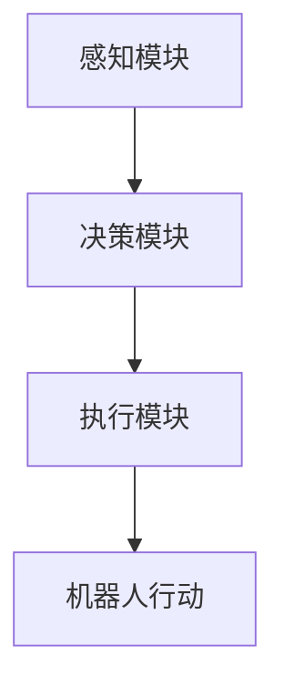

                 

关键词：人工智能，机器人，AI Agent，应用场景，未来展望

> 摘要：本文深入探讨了人工智能（AI）在机器人领域的应用，特别是AI Agent技术的核心概念、算法原理、数学模型、实际应用案例以及未来发展的趋势与挑战。

## 1. 背景介绍

随着科技的飞速发展，人工智能（AI）已经成为推动社会进步的重要力量。在众多AI应用领域中，机器人技术尤为引人注目。机器人能够执行复杂任务，提高生产效率，甚至在危险环境中替代人类进行工作。然而，这些机器人要真正发挥效用，需要具备高度智能化的特性，而AI Agent是实现这一目标的关键技术。

AI Agent，即人工智能代理，是一种能够在特定环境中自主行动并作出决策的计算机程序。它们可以模拟人类的思维和行为，通过学习、感知、推理和规划等能力，实现自主操作。在机器人领域，AI Agent的应用使得机器人能够更好地适应环境变化，提高任务执行效率和智能化水平。

## 2. 核心概念与联系

### 2.1 AI Agent的基本概念

AI Agent由感知模块、决策模块和执行模块组成。感知模块负责收集环境信息，决策模块根据感知信息进行决策，执行模块则根据决策结果执行相应的动作。

### 2.2 AI Agent与机器人技术的联系

AI Agent是机器人技术的核心，通过将人工智能技术应用于机器人，使其具备自主决策和行动的能力。AI Agent与机器人技术之间的联系可以用以下Mermaid流程图表示：



## 3. 核心算法原理 & 具体操作步骤

### 3.1 算法原理概述

AI Agent的核心算法包括感知、决策和执行三个阶段。感知阶段使用传感器收集环境信息，决策阶段基于感知信息进行推理和规划，执行阶段则根据决策结果执行动作。

### 3.2 算法步骤详解

1. **感知阶段**：AI Agent通过传感器收集环境信息，如视觉、听觉、触觉等。
2. **决策阶段**：基于感知信息，AI Agent使用机器学习算法进行推理和规划，生成行动策略。
3. **执行阶段**：AI Agent根据决策结果执行相应的动作，如移动、抓取等。

### 3.3 算法优缺点

**优点**：
- 自主性：AI Agent能够自主决策和行动，适应复杂环境。
- 高效性：通过机器学习算法，AI Agent能够快速学习并优化行为。

**缺点**：
- 计算资源需求大：AI Agent需要大量计算资源进行感知、决策和执行。
- 稳定性问题：在复杂环境中，AI Agent可能因为数据不足或算法缺陷导致决策失误。

### 3.4 算法应用领域

AI Agent在机器人领域的应用非常广泛，包括但不限于以下几个方面：
- 工业自动化：在制造业中，AI Agent可以替代人工完成组装、检测、搬运等任务。
- 服务机器人：在酒店、医院、商场等场景中，AI Agent可以作为服务员、导医等。
- 智能家居：AI Agent可以控制家庭设备，如灯光、空调、安防等。

## 4. 数学模型和公式 & 详细讲解 & 举例说明

### 4.1 数学模型构建

AI Agent的数学模型主要包括感知模型、决策模型和执行模型。其中，感知模型主要涉及图像处理、语音识别等技术；决策模型主要使用机器学习算法，如决策树、神经网络等；执行模型则涉及机器人运动控制、机械臂控制等技术。

### 4.2 公式推导过程

$$
\text{感知模型} = f(\text{传感器数据})
$$

$$
\text{决策模型} = g(\text{感知模型输出})
$$

$$
\text{执行模型} = h(\text{决策模型输出})
$$

### 4.3 案例分析与讲解

以工业自动化为例，AI Agent在生产线上的应用可以通过以下步骤进行：

1. **感知阶段**：AI Agent通过摄像头和传感器收集生产线上的工件信息，如位置、形状、颜色等。
2. **决策阶段**：基于感知信息，AI Agent使用机器学习算法对工件进行分类和定位，生成组装指令。
3. **执行阶段**：AI Agent通过控制器控制机械臂进行组装操作，将工件组装成最终产品。

## 5. 项目实践：代码实例和详细解释说明

### 5.1 开发环境搭建

为了实现AI Agent在机器人领域的应用，我们需要搭建一个合适的开发环境。以下是一个基本的开发环境搭建步骤：

1. **安装操作系统**：选择Linux或Windows操作系统。
2. **安装Python环境**：安装Python 3.7及以上版本。
3. **安装机器人控制库**：如ROS（Robot Operating System）。
4. **安装机器学习库**：如TensorFlow、PyTorch。

### 5.2 源代码详细实现

以下是一个简单的AI Agent在机器人上的应用示例代码：

```python
import rospy
from sensor_msgs.msg import Image
from cv_bridge import CvBridge
import cv2
import numpy as np

class AIAgent:
    def __init__(self):
        self.bridge = CvBridge()
        rospy.init_node('ai_agent', anonymous=True)
        self.image_sub = rospy.Subscriber('/camera/image_raw', Image, self.callback)

    def callback(self, data):
        # 将ROS消息转换为OpenCV格式的图像
        cv_image = self.bridge.imgmsg_to_cv2(data, desired_encoding='bgr8')
        # 对图像进行预处理
        processed_image = self.preprocess_image(cv_image)
        # 使用机器学习模型进行分类
        class_id = self.classify_image(processed_image)
        # 根据分类结果进行决策
        action = self.decide_action(class_id)
        # 执行决策结果
        self.execute_action(action)

    def preprocess_image(self, image):
        # 图像预处理代码
        pass

    def classify_image(self, image):
        # 使用机器学习模型进行分类
        pass

    def decide_action(self, class_id):
        # 根据分类结果进行决策
        pass

    def execute_action(self, action):
        # 执行决策结果
        pass

if __name__ == '__main__':
    agent = AIAgent()
    rospy.spin()
```

### 5.3 代码解读与分析

上述代码实现了AI Agent在机器人上的基本功能，主要包括感知、决策和执行三个阶段。感知阶段通过ROS订阅图像数据，预处理后传递给分类模型；决策阶段使用分类模型输出进行决策；执行阶段根据决策结果执行相应的动作。

### 5.4 运行结果展示

通过运行上述代码，AI Agent可以实时处理摄像头捕捉的图像，根据分类结果进行决策并执行相应的动作。例如，在工业自动化场景中，AI Agent可以识别工件并进行组装操作。

## 6. 实际应用场景

### 6.1 工业自动化

在制造业中，AI Agent可以用于自动化生产线，提高生产效率和质量。例如，AI Agent可以识别工件并进行组装、检测、搬运等操作，降低人力成本，提高生产安全性。

### 6.2 医疗服务

在医疗领域，AI Agent可以作为辅助工具，为医生提供诊断、治疗方案推荐等服务。例如，AI Agent可以分析病历数据，识别疾病类型，提供个性化的治疗方案。

### 6.3 智能家居

在智能家居领域，AI Agent可以控制家庭设备，如灯光、空调、安防等。用户可以通过语音或APP与AI Agent进行交互，实现智能家庭场景的设置和管理。

## 7. 工具和资源推荐

### 7.1 学习资源推荐

- 《人工智能：一种现代的方法》
- 《机器人学：基础与进阶》
- 《深度学习》

### 7.2 开发工具推荐

- ROS（Robot Operating System）
- TensorFlow
- PyTorch

### 7.3 相关论文推荐

- "Deep Reinforcement Learning for Robotics: Overview and Open Problems"
- "Humanoid Robots: Modeling, Planning, and Control"
- "Deep Learning for Robotics: A Review"

## 8. 总结：未来发展趋势与挑战

### 8.1 研究成果总结

近年来，AI Agent在机器人领域的应用取得了显著成果。通过结合感知、决策和执行技术，AI Agent在工业自动化、医疗服务、智能家居等领域表现出强大的应用潜力。

### 8.2 未来发展趋势

随着AI技术的不断发展，AI Agent在机器人领域的应用将越来越广泛。未来，AI Agent将更加智能化、自适应化，实现更高效、更安全的机器人服务。

### 8.3 面临的挑战

尽管AI Agent在机器人领域具有巨大潜力，但仍面临一些挑战。例如，计算资源需求大、稳定性问题、数据安全与隐私保护等。解决这些挑战需要进一步研究和技术创新。

### 8.4 研究展望

未来，研究人员将继续探索AI Agent在机器人领域的应用，开发更高效、更智能的AI算法，推动机器人技术的发展。同时，跨学科合作也将成为重要趋势，以实现机器人技术的全面突破。

## 9. 附录：常见问题与解答

### 9.1 AI Agent是什么？

AI Agent是一种能够在特定环境中自主行动并作出决策的计算机程序，通过感知、决策和执行三个阶段实现自主操作。

### 9.2 AI Agent在机器人领域有哪些应用？

AI Agent在机器人领域的应用非常广泛，包括工业自动化、医疗服务、智能家居等多个领域。

### 9.3 如何实现AI Agent？

实现AI Agent需要结合感知、决策和执行技术，通过机器学习算法和机器人控制技术实现自主行动。

### 9.4 AI Agent面临哪些挑战？

AI Agent面临的主要挑战包括计算资源需求大、稳定性问题、数据安全与隐私保护等。

### 9.5 未来AI Agent的发展趋势是什么？

未来，AI Agent将更加智能化、自适应化，实现更高效、更安全的机器人服务。跨学科合作也将成为重要趋势。

# 作者：禅与计算机程序设计艺术 / Zen and the Art of Computer Programming

