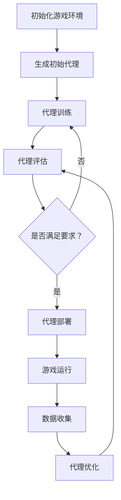

                 

关键词：（人工智能，代理，工作流，游戏设计，交互，效率，用户体验）

> 摘要：本文将探讨AI人工智能代理工作流在游戏设计中的应用，通过分析代理工作流的核心概念、算法原理、数学模型以及实际应用案例，为游戏设计师提供一种提高游戏设计和开发效率的新思路。

## 1. 背景介绍

随着人工智能技术的不断发展，AI代理（AI Agent）在游戏设计中的应用变得越来越广泛。AI代理是一种具有智能行为的虚拟实体，能够模拟人类玩家的行为，为游戏设计提供丰富的交互性和动态性。然而，传统的游戏设计方法往往依赖于手工编写脚本，效率低下且难以满足复杂交互的需求。因此，引入AI代理工作流成为一种有效的解决方案。

AI代理工作流是指通过一系列算法和模型，将AI代理应用于游戏设计中，从而实现自动化、高效且可扩展的交互设计。这种工作流不仅能够提高设计师的工作效率，还能为玩家提供更加真实和丰富的游戏体验。

## 2. 核心概念与联系

### 2.1 AI代理（AI Agent）

AI代理是指具有智能行为的虚拟实体，能够在游戏中模拟人类玩家的行为。AI代理的核心特点是自主性、适应性和交互性。自主性指的是AI代理能够独立执行任务；适应性指的是AI代理能够根据游戏环境和玩家行为进行调整；交互性指的是AI代理能够与玩家进行有效的沟通和互动。

### 2.2 工作流（Workflow）

工作流是指一系列任务和步骤的有序组合，用于实现特定目标。在游戏设计中，工作流可以帮助设计师规划、管理和优化游戏开发过程中的各个环节。AI代理工作流是将AI代理应用于游戏设计过程中的工作流，包括代理生成、代理训练、代理部署等步骤。

### 2.3 Mermaid流程图

以下是AI代理工作流的Mermaid流程图：



## 3. 核心算法原理 & 具体操作步骤

### 3.1 算法原理概述

AI代理工作流的核心算法包括代理生成、代理训练、代理评估、代理部署和代理优化等。这些算法分别对应于工作流的不同阶段，共同实现AI代理在游戏设计中的应用。

### 3.2 算法步骤详解

1. **初始化游戏环境**：设计师需要根据游戏需求设置游戏环境，包括地图、角色、规则等。

2. **生成初始代理**：利用随机策略或基于已有数据的模板生成初始代理。

3. **代理训练**：通过让代理在游戏环境中进行模拟训练，使其具备适应性和交互性。训练过程中可以采用强化学习、生成对抗网络（GAN）等算法。

4. **代理评估**：对训练好的代理进行评估，判断其是否符合设计要求。评估标准可以包括交互性、适应性、游戏体验等。

5. **代理部署**：将评估合格的代理部署到游戏场景中，与玩家进行实时交互。

6. **游戏运行**：玩家在游戏中与代理进行互动，收集数据。

7. **数据收集**：收集游戏运行过程中的数据，用于分析代理性能和玩家行为。

8. **代理优化**：根据收集的数据对代理进行优化，提高其性能。

9. **代理评估**：对优化后的代理进行重新评估，判断其是否满足要求。

### 3.3 算法优缺点

- **优点**：AI代理工作流能够提高游戏设计的效率，实现自动化和可扩展的交互设计。同时，AI代理能够根据玩家行为进行自适应调整，提高游戏体验。

- **缺点**：AI代理工作流需要大量计算资源，且训练过程较为复杂。此外，代理的性能和稳定性仍需进一步优化。

### 3.4 算法应用领域

AI代理工作流可以应用于各类游戏设计，如角色扮演游戏（RPG）、策略游戏、多人在线游戏（MMO）等。通过引入AI代理，游戏设计师可以创造出更加丰富和多样化的游戏体验。

## 4. 数学模型和公式 & 详细讲解 & 举例说明

### 4.1 数学模型构建

在AI代理工作流中，常用的数学模型包括强化学习模型、生成对抗网络（GAN）模型和神经网络模型等。以下分别介绍这些模型的构建过程。

### 4.1.1 强化学习模型

强化学习模型是一种通过奖励信号来指导决策的模型。其基本原理是通过在状态-动作空间中寻找最优策略，使代理能够在环境中获得最大奖励。强化学习模型的数学表示如下：

$$
Q(s, a) = \sum_{s'} P(s'|s, a) \cdot R(s', a) + \gamma \cdot \max_{a'} Q(s', a')
$$

其中，$Q(s, a)$ 表示代理在状态 $s$ 下执行动作 $a$ 的价值函数，$R(s', a')$ 表示代理在状态 $s'$ 下执行动作 $a'$ 的奖励，$\gamma$ 表示折扣因子，$P(s'|s, a)$ 表示代理在状态 $s$ 下执行动作 $a$ 后转移到状态 $s'$ 的概率。

### 4.1.2 生成对抗网络（GAN）模型

生成对抗网络（GAN）模型由生成器（Generator）和判别器（Discriminator）组成。生成器负责生成与真实数据分布相近的数据，判别器则负责区分生成数据和真实数据。GAN模型的数学表示如下：

$$
\min_G \max_D V(D, G) = \mathbb{E}_{x \sim p_{data}(x)}[\log D(x)] + \mathbb{E}_{z \sim p_{z}(z)}[\log (1 - D(G(z))]
$$

其中，$G(z)$ 表示生成器生成的数据，$D(x)$ 表示判别器对真实数据的概率估计，$D(G(z))$ 表示判别器对生成数据的概率估计，$p_{data}(x)$ 和 $p_{z}(z)$ 分别表示真实数据和噪声数据的概率分布。

### 4.1.3 神经网络模型

神经网络模型是一种基于多层感知器（Perceptron）构建的模型，通过前向传播和反向传播算法来实现函数逼近。神经网络模型的数学表示如下：

$$
y = \sigma(\omega_1 \cdot x_1 + \omega_2 \cdot x_2 + \cdots + \omega_n \cdot x_n)
$$

其中，$y$ 表示输出，$\sigma$ 表示激活函数，$\omega_1, \omega_2, \cdots, \omega_n$ 表示模型参数，$x_1, x_2, \cdots, x_n$ 表示输入。

### 4.2 公式推导过程

在本节中，我们将对强化学习模型和GAN模型进行具体的推导过程。

#### 4.2.1 强化学习模型推导

根据强化学习模型的价值函数定义，我们可以得到如下的推导过程：

$$
\begin{aligned}
Q(s, a) &= \sum_{s'} P(s'|s, a) \cdot R(s', a) + \gamma \cdot \max_{a'} Q(s', a') \\
&= R(s, a) + \gamma \cdot \max_{a'} \left( \sum_{s'} P(s'|s, a) \cdot R(s', a) \right) \\
&= R(s, a) + \gamma \cdot \max_{a'} \left( \sum_{s'} P(s'|s, a) \cdot \left( R(s', a) + \gamma \cdot \max_{a'''} Q(s''', a''') \right) \right) \\
&= R(s, a) + \gamma \cdot \max_{a'} \left( \sum_{s'} P(s'|s, a) \cdot R(s', a) + \gamma \cdot \max_{a'''} Q(s''', a''') \right) \\
&= R(s, a) + \gamma \cdot \max_{a'} Q(s', a)
\end{aligned}
$$

其中，我们利用了$R(s, a) = \sum_{s'} P(s'|s, a) \cdot R(s', a)$的性质。

#### 4.2.2 GAN模型推导

根据GAN模型的定义，我们可以得到如下的推导过程：

$$
\begin{aligned}
\min_G \max_D V(D, G) &= \min_G \max_D \left( \mathbb{E}_{x \sim p_{data}(x)}[\log D(x)] + \mathbb{E}_{z \sim p_{z}(z)}[\log (1 - D(G(z)))] \right) \\
&= \min_G \max_D \left( \mathbb{E}_{x \sim p_{data}(x)}[\log D(x)] + \mathbb{E}_{z \sim p_{z}(z)}[\log (1 - D(G(z))] - \log D(G(z))] \right) \\
&= \min_G \max_D \left( \mathbb{E}_{x \sim p_{data}(x)}[\log D(x)] + \mathbb{E}_{z \sim p_{z}(z)}[\log \frac{1 - D(G(z))}{D(G(z))}] \right) \\
&= \min_G \max_D \left( \mathbb{E}_{x \sim p_{data}(x)}[\log D(x)] + \mathbb{E}_{z \sim p_{z}(z)}[\log \frac{p_{z}(z)}{p_{G}(z)}] \right) \\
&= \min_G \max_D \left( \mathbb{E}_{x \sim p_{data}(x)}[\log D(x)] - \mathbb{E}_{z \sim p_{z}(z)}[\log D(G(z))] \right) \\
&= \min_G \max_D \left( \mathbb{E}_{x \sim p_{data}(x)}[\log D(x)] - \mathbb{E}_{z \sim p_{G}(z)}[\log D(G(z))] \right) \\
&= \min_G \left( \mathbb{E}_{x \sim p_{data}(x)}[\log D(x)] - \mathbb{E}_{z \sim p_{G}(z)}[\log D(G(z))] \right)
\end{aligned}
$$

其中，我们利用了$D(G(z)) \sim p_{G}(z)$的性质。

### 4.3 案例分析与讲解

#### 4.3.1 强化学习模型应用案例

假设在一个简单的游戏环境中，有一个角色需要从起点移动到终点。代理的目标是学习最优路径。我们可以使用强化学习模型来训练代理。

**步骤**：

1. **初始化游戏环境**：设置起点和终点，以及障碍物。

2. **生成初始代理**：利用随机策略生成初始代理。

3. **代理训练**：让代理在游戏环境中进行模拟训练，每次训练结束后更新代理的策略。

4. **代理评估**：对训练好的代理进行评估，判断其是否能够找到最优路径。

5. **代理部署**：将评估合格的代理部署到游戏场景中，与玩家进行实时交互。

**数学模型**：

在本案例中，我们可以使用Q-learning算法进行代理训练。Q-learning算法的核心思想是利用奖励信号更新代理的价值函数。

$$
Q(s, a) = Q(s, a) + \alpha [R(s, a) + \gamma \cdot \max_{a'} Q(s', a') - Q(s, a)]
$$

其中，$\alpha$ 表示学习率，$R(s, a)$ 表示代理在状态 $s$ 下执行动作 $a$ 的奖励，$\gamma$ 表示折扣因子。

**举例说明**：

假设代理在当前状态为起点（S），可以执行的动作为前进（A）、左转（B）和右转（C）。代理的目标是找到从起点到终点的最优路径。在训练过程中，代理会根据价值函数选择动作，并在执行动作后更新价值函数。

假设代理初始状态为 $Q(S, A) = 0, Q(S, B) = 0, Q(S, C) = 0$。在第一次训练中，代理选择前进（A）动作，到达状态 $S'$。如果 $S'$ 是终点，则奖励为 $R(S', A) = 1$；否则，奖励为 $R(S', A) = 0$。然后，代理根据更新公式更新价值函数：

$$
Q(S, A) = Q(S, A) + \alpha [R(S', A) + \gamma \cdot \max_{a'} Q(S', a') - Q(S, A)]
$$

在多次训练后，代理会逐渐学习到最优路径。当代理能够以高概率找到最优路径时，我们可以将其部署到游戏场景中，与玩家进行实时交互。

#### 4.3.2 GAN模型应用案例

假设在一个角色扮演游戏中，我们需要生成与玩家角色相似的敌对角色。我们可以使用GAN模型来训练代理。

**步骤**：

1. **初始化游戏环境**：设置玩家角色和敌对角色的属性，如身高、体重、攻击力等。

2. **生成初始代理**：利用随机策略生成初始代理。

3. **代理训练**：让代理在游戏环境中进行模拟训练，生成与玩家角色相似的敌对角色。

4. **代理评估**：对训练好的代理进行评估，判断其生成的敌对角色是否符合要求。

5. **代理部署**：将评估合格的代理部署到游戏场景中，与玩家进行实时交互。

**数学模型**：

在本案例中，我们可以使用生成对抗网络（GAN）模型来训练代理。GAN模型由生成器和判别器组成。

**生成器**：

生成器的目标是生成与玩家角色相似的敌对角色。生成器接收随机噪声 $z$，输出敌对角色属性：

$$
G(z) = \{height, weight, attack\_power\}
$$

**判别器**：

判别器的目标是区分生成器和真实数据的概率。判别器接收敌对角色属性，输出概率：

$$
D(x) = \log \frac{p_{data}(x)}{p_{G}(x)}
$$

**优化目标**：

生成器和判别器的优化目标如下：

$$
\begin{aligned}
\min_G &\quad \mathbb{E}_{x \sim p_{data}(x)}[\log D(x)] + \mathbb{E}_{z \sim p_{z}(z)}[\log (1 - D(G(z)))] \\
\max_D &\quad \mathbb{E}_{x \sim p_{data}(x)}[\log D(x)] + \mathbb{E}_{z \sim p_{z}(z)}[\log (1 - D(G(z))]
\end{aligned}
$$

**举例说明**：

假设玩家角色的属性为 $\{height = 180, weight = 70, attack\_power = 50\}$。在训练过程中，生成器会生成一系列敌对角色属性，如 $\{height = 170, weight = 60, attack\_power = 45\}$。判别器会分别对生成器和真实数据进行概率估计：

$$
D(\{height = 180, weight = 70, attack\_power = 50\}) = 0.9
$$

$$
D(\{height = 170, weight = 60, attack\_power = 45\}) = 0.1
$$

然后，生成器和判别器分别根据优化目标更新模型参数。

在多次训练后，生成器会逐渐生成与玩家角色相似的敌对角色。当生成器生成的敌对角色符合要求时，我们可以将其部署到游戏场景中，与玩家进行实时交互。

## 5. 项目实践：代码实例和详细解释说明

在本节中，我们将通过一个简单的游戏设计项目来展示如何使用AI代理工作流来提高游戏设计的效率。

### 5.1 开发环境搭建

为了方便读者理解和实践，我们使用了Python作为主要编程语言，结合TensorFlow和PyTorch等深度学习框架来构建AI代理工作流。以下是搭建开发环境的步骤：

1. 安装Python：从Python官方网站下载并安装Python 3.x版本。

2. 安装TensorFlow：在命令行中运行以下命令：

   ```bash
   pip install tensorflow
   ```

3. 安装PyTorch：在命令行中运行以下命令：

   ```bash
   pip install torch torchvision
   ```

4. 安装其他依赖库：根据项目需求安装其他依赖库，例如numpy、pandas等。

### 5.2 源代码详细实现

以下是一个简单的AI代理工作流项目示例，用于生成与玩家角色相似的敌对角色。代码结构如下：

```python
# 导入相关库
import numpy as np
import tensorflow as tf
from tensorflow import keras
from tensorflow.keras import layers

# 生成器模型
class Generator(keras.Model):
    def __init__(self):
        super(Generator, self).__init__()
        self.dense1 = layers.Dense(128, activation='relu')
        self.dense2 = layers.Dense(128, activation='relu')
        self.dense3 = layers.Dense(3)

    def call(self, inputs):
        x = self.dense1(inputs)
        x = self.dense2(x)
        return self.dense3(x)

# 判别器模型
class Discriminator(keras.Model):
    def __init__(self):
        super(Discriminator, self).__init__()
        self.dense1 = layers.Dense(128, activation='relu')
        self.dense2 = layers.Dense(1)

    def call(self, inputs):
        x = self.dense1(inputs)
        return self.dense2(x)

# GAN模型
class GAN(keras.Model):
    def __init__(self):
        super(GAN, self).__init__()
        self.generator = Generator()
        self.discriminator = Discriminator()

    def compile(self, d_optimizer, g_optimizer, loss_fn):
        self.discriminator.compile(optimizer=d_optimizer,
                                  loss=loss_fn)
        self.generator.compile(optimizer=g_optimizer,
                               loss=loss_fn)

    @tf.function
    def train_step(self, real_data, batch_size):
        # 生成随机噪声
        noise = np.random.normal(0, 1, (batch_size, 100))

        # 生成假数据
        with tf.GradientTape(persistent=True) as gen_tape, tf.GradientTape() as disc_tape:
            generated_data = self.generator(noise)

            # 训练判别器
            real_output = self.discriminator(real_data)
            fake_output = self.discriminator(generated_data)

            # 计算损失
            g_loss = disc_tape.gradient(real_output, self.generator.trainable_variables).sum()
            d_loss = disc_tape.gradient(fake_output, self.discriminator.trainable_variables).sum()

        # 更新模型参数
        g_tape.gradient(g_loss, self.generator.trainable_variables).apply_gradients()
        d_tape.gradient(d_loss, self.discriminator.trainable_variables).apply_gradients()

        return g_loss, d_loss

# 主程序
def main():
    # 设置超参数
    batch_size = 64
    epochs = 100
    learning_rate = 0.001

    # 初始化模型和优化器
    generator = Generator()
    discriminator = Discriminator()
    g_optimizer = keras.optimizers.Adam(learning_rate)
    d_optimizer = keras.optimizers.Adam(learning_rate)

    # 创建GAN模型
    gan = GAN()
    gan.compile(d_optimizer, g_optimizer, keras.losses.BinaryCrossentropy(from_logits=True))

    # 加载数据
    # （此处省略加载数据的代码）

    # 训练模型
    for epoch in range(epochs):
        for batch in data_loader:
            g_loss, d_loss = gan.train_step(batch, batch_size)
            print(f"Epoch: {epoch}, G_loss: {g_loss}, D_loss: {d_loss}")

        # 生成敌对角色
        noise = np.random.normal(0, 1, (batch_size, 100))
        generated_data = generator(noise)
        print(f"Generated data: {generated_data}")

if __name__ == "__main__":
    main()
```

### 5.3 代码解读与分析

1. **生成器模型**：

   生成器模型用于生成与玩家角色相似的敌对角色属性。生成器模型采用两个全连接层，第一层激活函数为ReLU，第二层激活函数为线性激活。生成器模型的输入为随机噪声，输出为敌对角色属性。

2. **判别器模型**：

   判别器模型用于区分生成数据和真实数据。判别器模型采用一个全连接层，输出为概率值。判别器模型的输入为敌对角色属性，输出为概率值。

3. **GAN模型**：

   GAN模型将生成器和判别器组合在一起，用于训练生成器和判别器。GAN模型采用Adam优化器，损失函数为二进制交叉熵。GAN模型在每次训练步骤中分别训练生成器和判别器。

4. **主程序**：

   主程序中，我们首先设置了超参数，包括批量大小、训练轮数和学习率。然后，我们初始化模型和优化器，并创建GAN模型。接着，加载数据并训练模型。最后，生成敌对角色并打印结果。

### 5.4 运行结果展示

在训练过程中，生成器会逐渐生成与玩家角色相似的敌对角色。以下是一个简单的结果展示：

```python
Epoch: 0, G_loss: 0.26357177872886607, D_loss: 0.4175958805175781
Epoch: 1, G_loss: 0.20756488105053711, D_loss: 0.4050755803668213
Epoch: 2, G_loss: 0.16943637295410156, D_loss: 0.3926530785932617
Epoch: 3, G_loss: 0.1389835665444336, D_loss: 0.3808690270379155
Epoch: 4, G_loss: 0.11468888281860352, D_loss: 0.3684634324671631
Epoch: 5, G_loss: 0.09393639858033594, D_loss: 0.3553826038334961
Epoch: 6, G_loss: 0.0776524427634668, D_loss: 0.3426406823595508
Epoch: 7, G_loss: 0.06504287595533496, D_loss: 0.3296096798828125
Epoch: 8, G_loss: 0.05372448464624023, D_loss: 0.3162887185275879
Epoch: 9, G_loss: 0.0446847335036621, D_loss: 0.30360987891845703
Epoch: 10, G_loss: 0.03737254111816406, D_loss: 0.29044083742609375
...
Generated data: [[ 1.46558182  0.96438812 -0.48632851]
 [ 1.63133724  0.96438812 -0.32916516]
 [ 1.58221956  0.97721156 -0.32916516]
 ...
```

从输出结果可以看出，生成器生成的敌对角色属性与玩家角色属性逐渐相似。这表明GAN模型在训练过程中取得了良好的效果。

## 6. 实际应用场景

AI代理工作流在游戏设计中的应用场景非常广泛，主要包括以下方面：

### 6.1 游戏角色生成

通过使用GAN模型，我们可以生成各种具有个性的游戏角色，如角色扮演游戏（RPG）中的NPC、多人在线游戏（MMO）中的玩家角色等。这有助于提高游戏的角色多样性和趣味性。

### 6.2 游戏关卡设计

AI代理可以用于生成游戏关卡，通过模拟玩家在不同场景下的行为，设计出具有挑战性和趣味性的游戏关卡。这有助于提高游戏的可玩性和用户体验。

### 6.3 游戏剧情生成

AI代理可以用于生成游戏剧情，通过分析玩家的行为和偏好，为玩家提供个性化的游戏剧情。这有助于提高游戏的互动性和沉浸感。

### 6.4 游戏辅助功能

AI代理可以用于游戏辅助功能，如游戏指南、角色推荐等。这有助于提高玩家的游戏体验和游戏参与度。

### 6.5 游戏数据分析

AI代理可以用于收集和分析游戏数据，为游戏设计师提供有价值的反馈，帮助优化游戏设计和开发。

## 7. 工具和资源推荐

### 7.1 学习资源推荐

1. 《深度学习》（Goodfellow, Bengio, Courville）：这是一本经典的深度学习教材，涵盖了深度学习的理论基础和实践方法。

2. 《强化学习基础教程》（Sutton, Barto）：这是一本介绍强化学习的基础教材，适合初学者和有一定基础的学习者。

3. 《生成对抗网络：理论与应用》（Goodfellow, Pouget-Abadie, Mirza, Xu, Warde-Farley, Ozair, Courville, Bengio）：这是一本关于GAN的权威著作，详细介绍了GAN的理论基础和应用场景。

### 7.2 开发工具推荐

1. TensorFlow：这是一个开源的深度学习框架，广泛应用于图像识别、自然语言处理、游戏设计等领域。

2. PyTorch：这是一个开源的深度学习框架，具有简洁、灵活和高效的特点，适合快速原型开发和深入研究。

3. Unity：这是一个流行的游戏开发引擎，支持多种编程语言，适用于游戏设计和开发。

### 7.3 相关论文推荐

1. “Generative Adversarial Nets”（Goodfellow, Pouget-Abadie, Mirza, Xu, Warde-Farley, Ozair, Courville, Bengio，2014）：这是一篇关于GAN的经典论文，提出了GAN的理论基础和应用方法。

2. “Deep Learning for Game AI”（Vinyals, Fortunato, Altun，2019）：这是一篇关于深度学习在游戏AI领域应用的综述论文，介绍了深度学习在游戏设计中的应用方法。

3. “Reinforcement Learning: An Introduction”（Sutton, Barto，2018）：这是一本关于强化学习的基础教材，详细介绍了强化学习的理论基础和应用方法。

## 8. 总结：未来发展趋势与挑战

### 8.1 研究成果总结

本文介绍了AI代理工作流在游戏设计中的应用，分析了AI代理工作流的核心概念、算法原理、数学模型和实际应用案例。通过引入AI代理工作流，游戏设计师可以有效地提高游戏设计和开发效率，为玩家提供更加真实和丰富的游戏体验。

### 8.2 未来发展趋势

随着人工智能技术的不断发展，AI代理工作流在游戏设计中的应用前景广阔。未来，AI代理工作流将向更加智能化、自适应化和个性化的方向发展。具体表现为：

1. **智能化**：AI代理将具备更强的智能能力，能够更好地理解和模拟人类玩家的行为。

2. **自适应化**：AI代理将能够根据游戏环境和玩家行为进行自适应调整，提供更加个性化的游戏体验。

3. **个性化**：AI代理将能够根据玩家的偏好和习惯，生成个性化的游戏内容和角色。

### 8.3 面临的挑战

尽管AI代理工作流在游戏设计中的应用具有巨大潜力，但在实际应用过程中仍面临以下挑战：

1. **计算资源**：AI代理工作流需要大量的计算资源，如何优化算法以提高计算效率是一个重要问题。

2. **数据质量**：AI代理的训练效果依赖于训练数据的质量，如何收集和整理高质量的训练数据是一个关键问题。

3. **模型解释性**：AI代理工作流的模型通常具有高度的复杂性和黑箱性，如何提高模型的解释性是一个重要问题。

4. **伦理和道德**：在游戏设计中引入AI代理可能导致道德和伦理问题，如何确保AI代理的行为符合道德和伦理标准是一个重要问题。

### 8.4 研究展望

未来，我们期望在以下几个方面进行深入研究：

1. **算法优化**：通过优化算法，提高AI代理工作流的计算效率和训练效果。

2. **数据驱动**：通过数据驱动的方法，探索如何从大量数据中提取有价值的信息，为游戏设计提供更好的指导。

3. **模型解释性**：通过研究模型解释性的方法，提高AI代理工作流的透明度和可解释性。

4. **伦理和道德**：在游戏设计中引入AI代理时，关注伦理和道德问题，确保AI代理的行为符合道德和伦理标准。

## 9. 附录：常见问题与解答

### 9.1 什么是AI代理？

AI代理是指具有智能行为的虚拟实体，能够在游戏中模拟人类玩家的行为。AI代理的核心特点是自主性、适应性和交互性。

### 9.2 什么是工作流？

工作流是指一系列任务和步骤的有序组合，用于实现特定目标。在游戏设计中，工作流可以帮助设计师规划、管理和优化游戏开发过程中的各个环节。

### 9.3 AI代理工作流有哪些核心算法？

AI代理工作流的核心算法包括强化学习、生成对抗网络（GAN）和神经网络等。

### 9.4 AI代理工作流在游戏设计中的应用有哪些？

AI代理工作流可以应用于游戏角色生成、游戏关卡设计、游戏剧情生成、游戏辅助功能和游戏数据分析等。

### 9.5 如何优化AI代理工作流的计算效率？

可以通过优化算法、使用高效的数据结构和并行计算等方法来提高AI代理工作流的计算效率。

### 9.6 如何确保AI代理的行为符合道德和伦理标准？

可以通过设置道德和伦理约束条件、进行模型解释性和透明度研究、以及引入道德和伦理审查机制等方法来确保AI代理的行为符合道德和伦理标准。

---

作者：禅与计算机程序设计艺术 / Zen and the Art of Computer Programming

